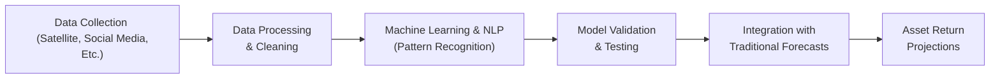

## Overview

Alternative data is quite the buzzword these days, right? I remember a senior analyst chuckling about how we used to be thrilled with a single line of 10-K footnote data. Now, we’re drowning in oceans of satellite imagery, social media sentiment, geolocation data, and so on. The idea behind all this “non-traditional” data—even though it’s quickly becoming mainstream—centers on informational advantage. If you can see and interpret signals before everyone else, it might mean you can position portfolios ahead of big market shifts or identify turning points more accurately. But let’s be real: it’s not magic. It’s about careful collection, cleaning, processing, and—most importantly—interpreting the data in a way that genuinely adds value.

In the context of capital market expectations, we’re basically doing what we learned in Chapter 2’s earlier sections: we want to form a sound view on risk and return for major asset classes—from equities and bonds to real estate and commodities. But we’re beefing up our toolkit with unstructured or novel data sets. Satellite-imaged parking lots, for example, might confirm or poke holes in official consumer spending data. Or web traffic to certain product pages might give us clues about a tech company’s new gadget sales. However, there’s a lot to keep in mind: compliance with data privacy laws, ensuring we haven’t introduced bizarre biases, and calibrating how much weight to give these signals in real forecasts.

## Defining Alternative Data

We’ve all read the standard macro reports from major agencies, used corporate financial statements, or followed price-volume data on equities. Alternative data expands this universe, pulling in sources like:

• Satellite imagery: Observing shipping routes and store parking lots.  
• Web scraping: Gathering consumer sentiment and product pricing from e-commerce sites.  
• Social media sentiment: Analyzing millions (or billions) of everyday posts to gauge brand perception.  
• Credit card and payment data: Aggregating consumer spending habits by geography or demographics.  
• Geolocation data: Tracking foot traffic in stores, tourist flows, or supply chain disruptions.  

These data sets are often “unstructured,” meaning they don’t fit neatly into rows and columns. And yes, it can quickly spiral into complexity—so we need machine learning (ML) to help parse it.

Before we dig deeper, let’s define a few key terms:

• Alternative Data: Non-traditional info (like geolocation data, satellite images) used for unique trading or investment insights.  
• Machine Learning: Using algorithms to identify data patterns, letting computers “learn” from historical examples.  
• Natural Language Processing (NLP): A branch of ML that interprets and processes human language, from tweets to corporate filings.  
• Unstructured Data: Content such as text, images, audio, and video, not neatly organized into relational databases.

## Enhancing Forecasts with Alternative Data

### Blending Alternative Data with Conventional Models

Investors still rely heavily on time-tested methods: macroeconomic indicators, corporate fundamentals, interest rate trends, etc. But now, you can layer in data that might pick up signals macro data misses. For instance:

• Monitoring farmland health via satellite can refine agricultural commodity forecasts (supporting Section 2.9 on Forecasting Commodity Markets).  
• Tallying foot traffic at major shopping districts can augment retail sector equity projections—perhaps even confirming (or contradicting) official retail sales figures from government agencies.  

This blending approach often yields a more holistic view. You still interpret GDP trends and monetary policy decisions (from prior chapters), but you back them up with granular, ground-level perspectives. That synergy can reveal inflection points earlier.

### Data Analytics, NLP, and Machine Learning

Here’s where it can get super exciting—and maybe a tad overwhelming. Let’s say you’re analyzing social media sentiment on an emerging-market product launch. A million tweets a day, in multiple languages, with slang, emojis, and sarcasm. A basic data funnel approach might look like this:

First is the raw ingestion step, where you “collect” or purchase data feeds. Next, you structure and clean it—removing duplicate tweets, handling missing geolocation coordinates, or clarifying ambiguous text. Then your ML and NLP modules identify relevant patterns (like brand sentiment negative/positive). You test how well these patterns predict future revenue growth or stock returns (out-of-sample validation to avoid data mining bias). Finally, you integrate these signals with your more conventional forecasting frameworks to update your return expectations for certain equity sectors or bond yields.

## Handling Privacy, Regulatory, and Ethical Issues

Let’s not forget that alternative data often walks a fine line with privacy regulations such as the General Data Protection Regulation (GDPR) in the EU or the California Consumer Privacy Act (CCPA) in the US. These laws protect individual data rights, so we have responsibilities not to trample them. For example:

• **Consent**: If data is user-generated (like social media posts), you must ensure you’re allowed to collect/analyze it at scale.  
• **Anonymization**: Payment data might need to be aggregated or anonymized to comply with local rules.  

Ethical implications can also rear up surprisingly: if a data set includes unintended personal details, you could face reputational and legal blowback. In a professional context—especially per the CFA Institute Code and Standards—due diligence and transparency about data sources are critical. You don’t want to generate alpha at the expense of ignoring privacy rules or ethical boundaries.

## Avoiding the Pitfalls of Data Mining Bias

When you have an enormous dataset with numerous variables, it’s tempting to keep fishing for a model that “looks good.” This might lead to data mining bias: you fit the model brilliantly to historical data, but it flops in real-time. To mitigate that:

• Keep separate training and test sets, plus a final holdout set.  
• Resist the urge to over-tweak parameters.  
• Use cross-validation or out-of-sample testing, then replicate results with fresh data.

If you’re seeing a strategy that claims a tiny drawdown or unbelievably consistent returns, watch out for overfitting. Maximum Drawdown becomes a key measure: if the strategy never draws down beyond a small fraction, check how many hyper-specific rules you (or your machine) have introduced.

## Calibrating Model Weights

Given the hype, you might be tempted to trust alternative datasets at face value. But market professionals often find that alternative data best serves as a complement. Sure, analyzing shipping container data can be insightful, but it might sometimes conflict with official inflation numbers or corporate guidance. So what do you do?

1. Assign a base weight to your standard macro approach (GDP, inflation, yield curve data).  
2. Introduce a smaller, variable weight for alternative data signals.  
3. Adjust these weights based on out-of-sample backtests and, ultimately, your risk tolerance.  

Keeping an open mind, but verifying the alpha claims with statistical significance is the sweet spot. If alternative data consistently boosts forecasting accuracy, you can gradually increase the weight. If it doesn’t, figure out what’s going wrong or scale back.

## Data Quality Control

A big chunk of the headache around alternative data is the messy nature of unstructured feeds. For instance, you might have geospatial data from one quarter that uses a specific mapping format, then in the next quarter they changed something. So you get these quirks:

• **Coverage Gaps**: Days or weeks with no data due to satellite downtime.  
• **Mismatched Time Zones**: Feeds from multiple regions might cause weird alignment issues.  
• **Different Data Definitions**: One provider’s “unique visitors” might differ from another’s.  

Before you incorporate alternative data into a well-tuned forecasting model, ensure consistent coverage, define your data fields precisely, and test for missing or outlier observations. High-level processes should check for internal consistency, remove duplicates, and validate the data’s reliability. As we often say: “Garbage in, garbage out.”

## Integrating Alternative Data with Fundamental Narratives

I had an experience a while back: we were analyzing a retail stock, and official statements suggested robust foot traffic. But what do you think the satellite data said? It showed a steadily decreasing trend in visits to many locations during the quarter. We included it in our analysis and concluded that sales might disappoint. Indeed, the next earnings release was a big miss.

That example is a reminder that alternative data doesn’t replace fundamental analysis; rather, it confirms or challenges the official narrative. If signals diverge from what you hear in official announcements, that’s sometimes an opportunity to reevaluate your assumptions. Combining these signals with a top-down approach—like we discuss in “2.7 Methods of Forecasting Volatility” or “2.3 Approaches to Setting Equity Market Return Expectations”—can refine your overall asset class projections in powerful ways.

## Eroding Alpha as Data Becomes Mainstream

We should also recognize that alternative data might lose some of its edge as it becomes widely adopted. Once everyone’s analyzing satellite images of major malls, the advantage might shift to, say, more nuanced interpretations or new data sources entirely. Markets are dynamic: as fresh data hits the scene, it can generate alpha for early movers. Eventually, though, that alpha shrinks. This is a classic theme in finance: you find an edge, people replicate it, you need a new edge. So it’s essential to remain agile—always exploring new data angles and refining your methodology.

## Common Challenges and Best Practices

• **Challenge**: Regulatory and privacy constraints can be complex across multiple jurisdictions.  
  • **Best Practice**: Keep track of data governance frameworks, maintain privacy compliance, and track any changes in local regulations.

• **Challenge**: Overfitting your model to past data.  
  • **Best Practice**: Use robust out-of-sample testing, cross-validation, and maximum drawdown metrics to ensure realistic performance expectations.

• **Challenge**: Data coverage and consistency.  
  • **Best Practice**: Implement rigorous data cleaning and define each variable carefully. Don’t let partial data skew your entire projection.

• **Challenge**: Interpreting conflicting signals.  
  • **Best Practice**: Stay anchored to fundamental narratives and weigh alternative data signals proportionally. If they contradict established data, see if that contradiction persists over multiple data updates or if it’s a short-term anomaly.

## Exam Relevance for CFA Level III

In the exam’s item sets or constructed-response questions, you might see real or hypothetical sets of alternative data. The question could ask you to interpret the impact on an equity market forecast or adjust an MVO-based asset allocation (see “4.1 Mean–Variance Optimization (MVO) in Asset Allocation”). You might also be asked to select the best approach to incorporate alternative data signals into a short-term tactical asset allocation shift, referencing “5.4 Use of Short-Term Shifts in Asset Allocation (Tactical Asset Allocation).”

Remember to justify your process: show how you validated the data and integrated it with more conventional frameworks. Practice constructing clear, concise bullet points when responding. If you just rely on a single data feed without discussing how or why it improves your forecast, you may lose partial credit. Also, stay aware of the fiduciary and ethical responsibilities that come into play—always keep the CFA Institute Code and Standards front and center.

## Glossary

• Alternative Data: Non-traditional information sources (such as geolocation data, satellite imagery, web scraping) used to gain investment insights.  
• Machine Learning: Algorithms that enable computers to learn patterns from data without being explicitly programmed.  
• Natural Language Processing (NLP): Techniques allowing computers to interpret and generate human language from text or voice data.  
• Maximum Drawdown: The largest observed loss from a peak to a trough within a certain time period.  
• Data Mining Bias: The risk of overfitting a model by excessive parameter tuning or repeated testing on the same dataset.  
• Unstructured Data: Information that does not follow conventional data models, such as text, images, or audio.  
• Alpha Generation: Efforts to achieve returns in excess of a benchmark through active management or unique insights.  
• Data Privacy Laws (GDPR/CCPA): Regulations that govern the processing of personal data of individuals, protecting their privacy and rights.

## References & Further Reading

• Ives, B., Palese, B., & Rodriguez, J. (2019). The Rise of Alternative Data. Journal of Financial Data Science.  
• CFA Institute. (2025). CFA Program Curriculum, Level III – Alternative Data in Investment Management.  
• Dunn, J. (2020). Practical Applications of AI and Big Data in Finance. Wiley.  

## Test Your Knowledge: Mastering Alternative Data



### Which of the following best describes alternative data in the context of asset class return projections?
- [x] Non-traditional datasets like satellite imagery and social media analytics.  
- [ ] Data exclusively derived from central bank reports.  
- [ ] Only historical price and volume data for equities.  
- [ ] Authorized personal information from retail banking records only.  

> **Explanation:** Alternative data refers to new or non-traditional sources (e.g., satellite imagery, geolocation data, social media sentiment). It is not limited to official or traditional data feeds from central banks or standard historical price data.

### Why is it important to calibrate the weight of alternative data in forecast models using out-of-sample tests?
- [x] Because it helps reduce the risk of overfitting the model to historical data.  
- [ ] Because regulators require a minimum number of data points in every forecast.  
- [ ] Because alternative data is only valid for short-term trading.  
- [ ] Because it automatically nullifies fundamental data.  

> **Explanation:** Out-of-sample testing helps ensure that a model with alternative data generalizes well to unseen data. It is a key technique to mitigate overfitting and data mining bias.

### An analyst intends to use satellite images of store parking lots to predict retail sector performance. Which is the primary data-management challenge?
- [ ] Aligning daily returns data with forward earnings estimates.  
- [x] Dealing with inconsistencies or gaps in image coverage and data quality.  
- [ ] Neutralizing foreign exchange risk in multi-currency assets.  
- [ ] Complying with standard time-series regression assumptions.  

> **Explanation:** Satellite images often vary in frequency and coverage, requiring careful data cleaning and frequency alignment. This is a classic data quality and consistency issue.

### Which scenario illustrates the erosion of alpha from alternative data?
- [x] As multiple firms begin using the same new dataset, its predictive power diminishes over time.  
- [ ] As the data moves from raw to structured format, it becomes more valuable.  
- [ ] When only personal data is used, it produces partial signals.  
- [ ] When the data is kept confidential by all users of the platform.  

> **Explanation:** Once an innovative dataset is widely adopted, the informational edge decreases, causing alpha to erode as many market participants trade on the same signals.

### What is a significant ethical concern when sourcing alternative data for asset return forecasting?
- [ ] Overreliance on fundamental ratios like P/E.  
- [x] Possible violation of privacy regulations or harvesting personal data without consent.  
- [ ] Lack of correlation with standard macroeconomic indicators.  
- [ ] Data can only be used in private portfolios, not public funds.  

> **Explanation:** Privacy regulations (like GDPR/CCPA) require that data be anonymized and collected lawfully, making it critical to handle personal or location-based information responsibly.

### When applying machine learning to large alternative datasets, which process best reduces data mining bias?
- [x] Splitting the dataset into training, validation, and final test segments.  
- [ ] Relying solely on short-run price fluctuations.  
- [ ] Eliminating all missing data points from the study.  
- [ ] Keeping the entire dataset in one group for easy processing.  

> **Explanation:** By segmenting data into distinct sets, analysts can train on one portion, tune on another, and finally test on fresh data. This helps curb overfitting.

### How might an institutional investor combine alternative data with traditional metrics to refine emerging market equity forecasts?
- [x] Incorporate satellite-based shipping data to confirm official trade reports.  
- [ ] Rely solely on official government press releases for GDP forecasts.  
- [ ] Base all decisions on historical default rates from decades ago.  
- [ ] Use only inflation data from the past five years.  

> **Explanation:** Satellite-based shipping data can serve as a real-time check on official trade data in emerging markets, offering deeper insights into actual economic activity.

### In which situation might text-based NLP be most helpful for projecting asset class returns?
- [x] Analyzing the sentiment of central bank policy statements or earnings calls.  
- [ ] Predicting future oil prices by focusing on historical pipeline capacity only.  
- [ ] Measuring the number of physical goods loaded at a port.  
- [ ] Evaluating farmland health via infrared satellite imagery.  

> **Explanation:** NLP (Natural Language Processing) is used to interpret and quantify language-based sources such as policy statements, corporate guidance, and earnings transcripts.

### What is the primary risk if you rely too heavily on one proprietary alternative dataset?
- [x] You may suffer from a single-source bias and get misleading signals if that data source is flawed or compromised.  
- [ ] You will always achieve maximum alpha since no one else has that data.  
- [ ] Your compliance costs will drop significantly.  
- [ ] You can ignore all macro data going forward.  

> **Explanation:** Over-reliance on a single source is risky. If it becomes compromised (poor coverage, errors, or even data tampering), your entire forecast and portfolio decisions may be impacted.

### True or False: Integrating alternative data directly into your MVO (Mean–Variance Optimization) framework is always straightforward since all data is quantitative.
- [x] True  
- [ ] False  

> **Explanation:** While alternative data is often numeric (e.g., images converted to traffic counts or sentiment scores), it still needs substantial processing and cleansing. There are complexities, but once properly structured, it can be integrated into MVO like other factors.


