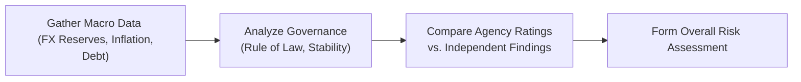

## Introduction

Investing in emerging market (EM) fixed income can be both exciting and nerve-wracking—kind of like discovering a hidden travel destination that isn’t on everyone’s radar yet. And much like the thrill of travel, there’s an element of risk you just can’t ignore. Emerging markets, while often full of potential, also carry heightened vulnerabilities that can bite investors who venture in unprepared. Understanding the mechanics behind these risks is key to making sound decisions, especially when you’re juggling multiple asset classes in a portfolio.

In this article, we’ll walk through the key risks associated with emerging market fixed-income investing, including sovereign default risk, currency convertibility restrictions, political and legal uncertainties, and more. We’ll discuss how to conduct thorough country risk analysis by reviewing macroeconomic indicators, governance metrics, and independent research. Finally, we’ll explore practical tools—like EMBI spreads, CDS spreads, and yield differentials—to gauge market sentiment. The goal? Help you see through the noise and confidently allocate to EM debt when it makes sense for your portfolio.

## Overview of Unique Risks in EM Debt

Emerging market bonds can offer attractive yields compared to their developed-market counterparts. But that yield spread usually reflects significant additional risks:

• Sovereign Default Risk  
• Convertibility and Capital Control Risk  
• Political and Governance Risk  
• Liquidity Constraints  
• Currency Risk

Let’s look at each one in more detail.

### Sovereign Default Risk

Sovereign default risk is the possibility that a national government will be unable or unwilling to repay its debt. Sometimes that’s due to fiscal stress, sometimes it’s due to a sudden political upheaval—frankly, it can be both. Unlike municipal defaults (or even corporate defaults) in developed markets, the fallouts of a sovereign default can be severe, lengthy, and complicated by legal uncertainties. For instance, governments might invoke sovereign immunity or restructure debt in ways that can be significantly more disruptive than what goes on in advanced economies. 

One personal memory: I remember analyzing a hypothetical EM country that boasted a strong primary balance. Everything looked manageable until commodity prices crashed, which triggered a cascade of debt-service problems. It was a reminder that emerging markets’ fates can hinge on external factors like trade shocks or resource revenues.

### Convertibility and Capital Control Risk

Convertibility risk refers to the chance that an investor can’t convert local currency into a “hard currency” due to government-imposed restrictions. For example, you might be holding local currency bonds in a country whose currency is not freely tradable. If that government then restricts currency outflows, you could be stuck. Capital controls sometimes arise in tough economic times, when governments try to shield their reserves from capital flight or stabilize their exchange rate. In a stressful environment, who wants to be locked into a currency that might lose value daily? Precisely—nobody. That’s why local currency EM bonds yield more in many cases—they’re compensating you for this convertibility or capital-control risk.

### Political and Governance Risk

We all know politics can get messy. Emerging markets often face changes in leadership or policy direction that can affect everything from taxation on foreign investments to nationalization of key industries. A lack of clear rule of law, or frequent changes to the constitution, can further add confusion and elevate the risk for bondholders. Rating agencies do try to price some of this in, but they can lag (or sometimes even overstate) events. 

Stability in governance and adherence to the rule of law are crucial. For instance, frequent “executive decrees” can undermine investor confidence because they effectively bypass legislative checks and balances. This makes it all the more important to look behind the yield—because a high yield might be an olive branch from a shaky government to draw in capital.

### Liquidity Constraints

Market liquidity in EM bond trading can be drastically different from that in developed markets. Wider bid-ask spreads, fewer market makers, and lower daily trading volumes can all mean it’s harder (and more expensive) to enter or exit positions. Something like this:

• When times are calm: The market can behave well, though spreads may still be wide.  
• When times are rough: Liquidity can dry up fast, as local investors panic and foreign investors rush for the exit.  

You have to price in the possibility of not getting out at the “last quoted price” if there’s a sudden political scandal or a negative growth shock.

### Currency Risk

EM investors often buy local currency bonds to benefit from potential currency appreciation. But that sword cuts both ways—speculative inflows can suddenly reverse, leading to rapid currency depreciations. And a central bank’s ability to defend the currency depends heavily on its foreign exchange reserves, monetary policy credibility, and overall economic health. 

If you look at past crises (like the Asian financial crisis in the late 1990s), you’ll see rapid exchange rate moves that wiped out local investors, not to mention foreign holders. Always keep an eye on currency trends, interest rate differentials, and the central bank’s track record.

## Conducting a Country Risk Analysis

Assessing EM fixed-income opportunities goes beyond reading a single credit rating report. You’ll often find a puzzle: rating agencies might misprice (or at least lag in pricing) the real risk. That’s why a combination of macroeconomic analysis and qualitative political assessment is crucial.

### Macroeconomic Stability

Look closely at:

• Current Account Balance: Persistent deficits might require external funding, indicating potential vulnerabilities.  
• Fiscal Position: Government debt-to-GDP levels, budget deficits, and the political willingness to implement reforms matter.  
• FX Reserves: Sufficient reserves can cushion currency volatility and reduce default risk.  
• Inflation Rate: High or volatile inflation can erode bond returns and signal poor policy discipline.  

One clue: large foreign exchange reserves relative to short-term external debt obligations can help avoid sudden crises. On the other hand, low reserves coupled with ballooning deficits could spell trouble.

### Political Governance and Rule of Law

Does the country have a transparent legal framework for foreign investment? How stable is the executive branch? Are checks and balances present, or can policies shift overnight? These questions require more than statistical data—you need on-the-ground or third-party investigative reports, as well as a nuanced reading of the country’s political history.

A quick anecdote from a friend who worked in EM research: in one country, a newly elected government reversed major economic pledges within two weeks—the local bond market tanked. Ratings agencies adjusted their views months later. So, direct political intelligence matters.

### Reading and Interpreting Agency Reports

Rating agencies like Moody’s, S&P, and Fitch provide sovereign ratings, but those are just the starting point. Their updates can be delayed or subject to methodology constraints. Smart investors do their own credit assessments:

• Compare reported data with IMF or World Bank figures.  
• Check local news sources and alternative data (satellite images for shipping activity, for instance).  
• Closely follow announcements from the central bank and finance ministry.  

### Independent Analysis of Default Risk

Building internal models—through scenario analysis, stress tests, or your own research—can avoid pitfalls of relying too heavily on official ratings. You might incorporate a “risk premium” over a base yield to account for intangible risks. For instance:

(1) Start with a risk-free rate (e.g., yield on US Treasuries).  
(2) Add a base sovereign spread for EM countries with similar economic profiles.  
(3) Adjust for unique country factors (e.g., political transitions, capital controls).  

### Quick Diagram: The Country Risk Process

Below is a simple Mermaid diagram illustrating a streamlined version of the country risk assessment approach.

## Liquidity Constraints and Capital Controls

Liquidity in EM debt markets can be as unpredictable as the weather. We’ve all heard stories about big buy-side funds attempting to unwind a position in an EM bond issue only to find that there are no willing buyers—or that the bid was 200 basis points away from the last trade. You can mitigate some of these issues by:

• Building relationships with local banks and brokers for better price discovery.  
• Focusing on only the most liquid securities in a given market (i.e., benchmark issues).  
• Maintaining adequate cash or highly liquid securities as a buffer.  

Capital controls are an additional annoyance. If a government restricts currency outflows, you might have to reinvest or hold funds in local currency indefinitely. This risk intensifies if the local currency is weakening or the inflation rate is surging.

## Using Indicators to Gauge Sentiment

Sometimes you want a quicker read on market sentiment. Interestingly, the following indicators can serve as valuable clues:

• EMBI (Emerging Markets Bond Index) Spreads: Widening spreads usually signal that investors want higher compensation for perceived risk.  
• CDS (Credit Default Swap) Spreads: A spike implies escalating default concerns.  
• Local vs. Hard Currency Yield Differentials: If local currency yields jump relative to USD-denominated debt, it often indicates heightened concern over currency stability.  

These market-based measures aren’t perfect, but they offer real-time insights into how global investors are pricing risk. In combination with fundamental research, they can help you spot potential danger signs early.

## Incorporating a Country Risk Premium

To systematically capture differences in risk across emerging markets, some investors apply a “country risk premium” (CRP). This approach attempts to quantify how much extra yield is required to invest in a given country.

A simplified version of the Damodaran-style model for the CRP in local equity markets is:


\text{CRP} = \text{Sovereign Bond Spread} \times \frac{\sigma_\text{Equity Market}}{\sigma_\text{Sovereign Bond}}


While you might tweak these components for a bond context, the idea remains: quantify uncertainty by scaling the observed sovereign spread by the ratio of market volatilities. It’s not perfect—no single formula is—but it helps form a structured, repeatable approach for comparing countries.

## Bringing It All Together in Portfolio Context

When applying these insights to your overall asset allocation, recall that EM debt may have a lower correlation to developed market bonds—but it can also exhibit equity-like drawdowns in times of crisis. In Chapter 2.8, we discuss how macroeconomic changes influence portfolio weightings. In that context, emerging market fixed income might be tactically increased when you anticipate stable growth, favorable commodity prices, or improved global funding conditions.

By contrast, if you suspect a sudden tightening of global liquidity or a commodity price crash, you might reduce your EM debt exposure to limit downside risk. In multi-asset portfolios, thoughtful position sizing in EM bonds—and hedging currency exposure where feasible—can improve overall risk-adjusted returns.

## Common Pitfalls and Best Practices

• Overreliance on Ratings: Agency downgrades often happen after the fact. Conduct your own analysis.  
• Ignoring Political Turmoil: A simple yield pick-up might not be worth the risk of sudden regime change.  
• Underestimating Liquidity Constraints: In a crisis, the exit door could be very narrow.  
• Oversimplifying Currency Risk: Don’t just assume your local currency bond will appreciate.  
• Failing to Diversify: EM debt isn’t a monolith. Spreading investments across regions and credits can help.  

Best practices include building a robust in-house or external research capability, combining quantitative and qualitative factors, and always staying abreast of local political and macroeconomic news.

## Case Study Snapshot

Suppose you identify two emerging economies, both offering 200 basis points more yield than comparable developed-market bonds. Country A shows healthy FX reserves, moderate inflation, stable governance, and an improving current account. Country B shows political instability, high external debt, and a rising budget deficit. Despite their yields being equally enticing, the rational approach is to favor Country A unless you see a compelling reason or short-term catalyst that’s turned Country B’s bonds into a “value” bet. You might still keep an eye on Country B for tactical trades, but the overall risk might be too high for strategic allocations.

## Final Exam Tips

• Connect the Dots: When analyzing EM debt, apply concepts from macroeconomic cycles (Chapter 1) and your broader asset allocation framework (Chapter 3).  
• Scenario Analysis for Constructed Responses: In exam scenarios, you may be asked to evaluate a shift in a country’s macro variables (such as a commodity price crash). Show how that directly impacts sovereign creditworthiness and your recommended allocation.  
• Manage Time: For item-set questions linking multiple data points—like inflation, CDS spreads, and political developments—quickly identify which factors weigh most heavily on your risk assessment.  

## References and Further Reading

• Eaton, J., & Gersovitz, M. (1981). Debt with Potential Repudiation: Theoretical and Empirical Analysis. The Review of Economic Studies.  
• IMF Country Reports: https://www.imf.org/en/Publications/Search  
• CFA Institute. (2025). CFA Program Curriculum, Level III – Emerging Market Fixed Income Readings.

## Test Your Knowledge: Emerging Market Debt & Country Risk Quiz



### Which of the following best describes sovereign default risk in an emerging market?

- [ ] The risk that an emerging market corporation will fail to pay its bond obligations.
- [ ] The risk that a local municipality defaults on its debt.
- [x] The risk that a national government fails or refuses to meet its debt obligations.
- [ ] The risk that currency volatility reduces real returns.

> **Explanation:** Sovereign default risk specifically refers to the phenomenon where a national government cannot or will not make payments on its debt. It is distinct from corporate or municipal defaults.

---

### What is the main concern when a country imposes capital controls on foreign investors?

- [ ] Reduced interest payment frequencies.
- [x] Inability to repatriate capital or convert local currency to hard currency.
- [ ] Higher credit spreads on government bonds globally.
- [ ] Overvaluation of local stock indices.

> **Explanation:** Capital controls can prevent investors from moving funds out of the country or converting local currencies into more widely accepted hard currencies, thus limiting liquidity and increasing risk.

---

### Which macroeconomic factor is most relevant when estimating a country’s ability to defend its currency?

- [ ] Government bond coupon rates.
- [x] Level of foreign exchange reserves.
- [ ] Amount of currency in circulation.
- [ ] Volume of foreign direct investment (FDI).

> **Explanation:** Sizable foreign exchange reserves allow a country’s central bank to intervene in currency markets, stabilizing exchange rates and minimizing abrupt depreciations.

---

### Why might relying solely on rating agencies be insufficient for assessing EM sovereign risk?

- [ ] Rating agencies rarely cover emerging markets.
- [ ] Rating agencies do not consider political governance or rule of law.
- [ ] Rating agencies focus only on corporate securities.
- [x] Rating agency actions may lag real-time events, and independent analysis can offer earlier signals.

> **Explanation:** While ratings are a useful starting point, agencies often update their opinions after significant events have already affected market prices, so proactive analysis is essential.

---

### What does a widening EMBI spread typically indicate?

- [ ] Decreasing risk aversion in global markets.
- [ ] Improving creditworthiness of a sovereign issuer.
- [x] Heightened investor concern and a higher yield demanded for EM debt.
- [ ] Stronger local currency performance and falling default risk.

> **Explanation:** A widening spread means investors demand more yield to compensate for increased perceived risk in emerging market bonds.

---

### Which statement correctly explains the relationship between local-currency bonds and currency risk?

- [x] Local-currency bonds expose foreign investors to exchange rate fluctuations against their home currency.
- [ ] Local-currency bonds hedge against exchange rate risks.
- [ ] Local-currency bonds do not carry any default risk.
- [ ] Local-currency bonds are unaffected by global macroeconomic conditions.

> **Explanation:** Investors in local-currency bonds must convert proceeds into their base currency, making them vulnerable to changes in the exchange rate.

---

### A budget deficit coupled with a low level of FX reserves primarily raises concerns about:

- [ ] Rising local equity valuations.
- [x] The government’s ability to service foreign-denominated debt.
- [ ] An increase in domestic job growth.
- [ ] Overly strong domestic currency appreciation.

> **Explanation:** A budget deficit and weak reserves signal potential vulnerability in meeting external debt obligations, especially during global liquidity stress.

---

### Which of the following does a higher-than-expected inflation rate in an EM economy often suggest?

- [ ] Strong private consumption that supports higher bond prices.
- [x] Potential policy instability and elevated risk for bond investors.
- [ ] Lower default risk because nominal GDP growth is higher.
- [ ] Lower interest rates to contain inflation.

> **Explanation:** High or volatile inflation can hint at ineffective monetary policy or other economic imbalances, which can be detrimental for fixed-income investors.

---

### Which measure is most frequently used to gauge perceived sovereign credit risk via derivatives?

- [ ] EMBI Index
- [ ] Hard-currency bond yield
- [ ] Volatility Index (VIX)
- [x] Credit Default Swap (CDS) spread

> **Explanation:** CDS spreads reflect the cost to insure against a default, directly indicating how the market perceives the issuer’s credit risk.

---

### A country experiencing sudden capital flight and depleting FX reserves may choose to:

- [x] Impose capital controls to restrict money outflows. 
- [ ] Lower import tariffs immediately to spur local manufacturing.
- [ ] Issue more domestic equity to raise foreign capital.
- [ ] Eliminate all forms of currency intervention.

> **Explanation:** When investors rush to exit, FX reserves can plummet. A government might impose capital controls as a short-term measure to prevent further exodus of funds.


