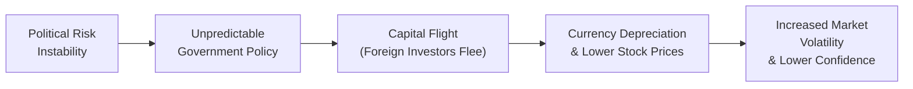

## Introduction
I remember one time—quite a few years ago—when a friend excitedly told me about a “can’t-miss” opportunity in an emerging market (EM) steel company. With starry eyes, they saw big potential returns, spurred by that country’s rapidly expanding infrastructure. Well, fast-forward a year, and a round of sudden government policy changes caused the stock to plunge by half—practically overnight. Stories like this are all too familiar in the world of emerging market equities. While these markets definitely offer prospects for higher growth and portfolio diversification, they also come with a fair share of unique (and sometimes surprising) risks.

This section looks at those risks from multiple angles and offers some real-life applications. We’ll explore threats ranging from political and regulatory instability to liquidity constraints and currency volatility. Whether you’re a seasoned investor or a curious newcomer, it’s important to fully grasp the nature and depth of these risks before venturing into EM equities. After all, once you spot possible pitfalls, you can better position yourself to harness those higher expected returns—hopefully without losing too much sleep.

## Political and Regulatory Instability
Political risk, at its heart, is a reflection of how government actions, political events, or legislative changes can disrupt investments. Emerging markets often have less predictable legal frameworks in place. So, a sudden shift in governmental leadership or economic policies—such as the imposition of capital controls or even nationalization of industries—can send shockwaves through both equity prices and currency valuations.

Some countries in the EM universe have made strides toward more transparent regulatory structures. Others, though, remain volatile and prone to rapid policy swings. And it’s not just about your classic “election risk.” We’re talking about the potential for abrupt trade policy changes, new tariffs, ownership restrictions for foreign investors, or even the renegotiation of previously signed contracts.

If you recall from the glossary, “political risk” effectively covers every shape and size of government or societal action that can hamper—or sometimes outright destroy—your investment returns. Mitigating it typically involves staying informed about each country’s political climate, analyzing macroeconomic indicators (as explained earlier in Chapter 1), and looking out for warning signs that might signal looming legislative upheaval. In many cases, multi-country diversification within EM exposure becomes your best friend—spreading the risk across different political theaters.

Here’s a quick visual illustration of how political and regulatory instability can cascade into broader market turmoil:

## Liquidity Constraints
Emerging market equity exchanges, in many instances, have lower trading volumes compared to their developed market counterparts. In practice, that translates to wider bid-ask spreads, especially for large transactions. If you’ve ever tried to sell a thinly traded stock, you know the frustration: you might have to stand in line until a matching buyer arrives. Even then, you may have to settle for a lower price than you’d hoped.

Sometimes, an EM equity might sport a high market capitalization but still trade infrequently due to a low free float—the proportion of shares available to public investors. State-owned or closely held companies are prime examples. Randomly, you’ll see these single-day price spikes (or drops) that can significantly deviate from fair value simply because one large institutional player placed an order, and there wasn’t enough liquidity to absorb it smoothly.

Moreover, liquidity constraints can become especially troublesome in periods of market stress. Even a rumor or minor shift in global risk sentiment can trigger sell-offs that severely amplify price movements. One best practice is to thoroughly analyze the turnover ratio, which is the total value of shares traded divided by the average market cap. The higher the turnover ratio, the more liquid the market. Keep an extra eye on that ratio if you’re investing in frontier markets—which are even less liquid (and sometimes shakier) than standard EMs.

## Currency Exposure and Exchange Rate Volatility
So, let’s say you’re a U.S.-based investor looking to tap into Chinese equities or Brazilian equities. A pleasant run-up in the local share price can still be wiped out if the yuan or real tanks against the U.S. dollar (in your base currency context). Currency risk in emerging markets is often no small footnote. Many EMs rely heavily on commodities or specific export industries, which makes exchange rates highly sensitive to global supply-and-demand fluctuations.

If a country’s currency is experiencing heavy depreciation pressure—maybe triggered by capital flight (see the diagram above)—an investor could lose a significant part of the local market’s gain once those returns are converted back to the investor’s home currency. Hedging these exposures is possible through forward or futures contracts, but it can be expensive or practically difficult in less liquid currency markets. On the flip side, you might also enjoy tailwinds if EM currencies move favorably.

Remember to check any correlations between the equity market and its currency. In some places, such as commodity-driven economies, the local stock index might move in tandem with the currency. In others, the relationship can be more complicated. Detailed scenario analysis or stress testing, which you’ll find in Chapter 5, can help you gauge potential outcomes under varying exchange rate assumptions.

## Transparency and Accounting Standards
Let’s be honest: not every EM company follows IFRS or GAAP as rigorously as big corporates in advanced economies. Sometimes, homegrown accounting standards can be piecemeal. Couple that with the fact that some emerging economies have weaker regulations on disclosures, and you might find yourself grappling with incomplete financial statements, irregular corporate filings, or nonstandard reporting cycles.

In practical terms, you have to ramp up your vigilance and due diligence. Examining not just the company’s numbers but also who’s auditing those numbers can offer peace of mind. Is that audit firm reputable and known for high-quality oversight? Or is it a lesser-known outfit with potential conflicts of interest?

Similarly, watch out for potential differences in how “related-party transactions” are disclosed. If a company is part of a larger conglomerate or if the government has a direct stake, you want to ensure that decisions aren’t being pushed to benefit stakeholders behind the scenes. This is where “corporate governance” (another term from our glossary) can really come into play. High-level governance typically implies transparency and consistent investor protections.

## Capital Flight and Global Risk Sentiment
Emerging market equities can be particularly sensitive to global investor sentiment. Picture a scenario where a spike in uncertainties—maybe a big meltdown in developed markets or a geopolitical event—prompts global investors to retreat to “safer” developed market assets. This flight to quality can spark considerable outflows from EMs. Those outflows, in turn, may lead to large-scale selling, pushing stock prices downward and weakening local currencies, as described in the diagram above.

Historically, big episodes of capital flight often come when external interest rates rise (e.g., a Federal Reserve tightening cycle), triggering a reallocation from riskier EM debt and equities back to developed markets. As a result, emerging markets can exhibit heavier volatility at just the moments investors are craving stability. By building this possibility into your risk scenarios, you can decide whether you’re comfortable weathering through those storms—or if you’d prefer a more modest allocation to EM or frontier markets.

## Sector Concentration
It’s not unusual for emerging market economies to rely heavily on a small handful of industries—commodities (like oil or metals) or financials (especially big national banks) are prime examples. That can leave the entire equity market index vulnerable to cyclical swings in just a few areas. This often differs from developed markets, where sector diversification is more balanced. Maybe you’ll see an EM index heavily weighted in petroleum exploration companies or banks serving the commodity exporters. That’s fantastic if, say, oil prices are soaring, but it’s punishing when global energy demand softens.

Managing this risk calls for a deeper top-down analysis of each emerging market’s industry makeup (see Section 1.2 on the challenges of developing forecasts). Internal diversification might be more difficult in a single EM market that’s heavily commodity-dependent, pushing some investors to spread allocations across multiple emerging markets—improving cross-country diversification. Also, a fundamental approach to stock selection, rather than pure index tracking, might help mitigate an index’s concentration risk.

## Corporate Governance
Corporate governance in emerging markets, broadly speaking, can be uneven. When board independence is strong, minority shareholder rights are recognized, and ownership structures are well-diversified, you’re more likely to see accountability and transparency. On the flip side, closely held ownership, cross-shareholdings, or family-run conglomerates with opaque reporting can elevate investment risk. In some cases, controlling shareholders might prioritize their own interests over those of minority shareholders. If that’s not nerve-wracking enough, local markets might not have strong legal frameworks for recourse.

Engaging with or reviewing governance metrics is a must if you’re diving into EM equities on a single security basis. You’ll want to ask: Who sits on the board, and is it truly independent? How do they manage conflicts of interest? Does the firm consistently release timely, robust disclosures? In some countries, regulatory reforms have improved governance practices in recent years, but progress can be slow and uneven across different markets.

## Market Reforms and Government Intervention
Another related factor is the potential for abrupt government intervention. Governments in emerging (and especially frontier) markets may directly regulate how much foreign ownership is allowed in strategic industries or impose restrictions on currency convertibility. In certain extreme circumstances, they can freeze capital flows or even step in and nationalize private enterprises. All these potential interventions can distort valuations, hamper natural price discovery, and create cross-border capital hurdles. 

On the plus side, some governments enact ongoing reforms that expand market access and transparency—often leading to an upgrade in a country’s classification from “frontier” to “emerging” status by major index providers. Those reforms typically attract more foreign capital, which can elevate asset prices and liquidity. On the minus side, you never want to assume reforms will continue unimpeded or that governments won’t reverse these measures under pressure.

## Bringing It All Together
Investing in emerging market equities requires you to balance an alluring growth story with caution around higher volatility and structural uncertainties. Consider how each risk—political, regulatory, liquidity, currency, governance, and sector concentration—fits within your total portfolio strategy. If you’re employing the asset allocation principles from Chapter 3, make sure your exposure to EMs aligns with your risk tolerance, return objectives, and any liability considerations if applicable.

• Keep an eye on liquidity conditions and potential transaction costs.  
• Evaluate hedging strategies for currency exposures, while acknowledging their cost and complexity.  
• Use fundamental analysis with robust due diligence to mitigate unscrupulous or opaque accounting.  
• Diversify geographically to reduce reliance on any single country’s political or economic fate.

Emerging markets are dynamic—what’s an advantage this year can become a liability the next. So, building your knowledge of EM fundamentals and carefully monitoring any changes in economic policies can help you adapt along the way.

## Practical Example: Volatile Regulatory Overhaul
Imagine you invest in a tech company based in an emerging Southeast Asian country. Initially, everything’s booming: smartphone usage is skyrocketing, internet connectivity is spreading, and consumer demand looks robust. Then, out of the blue, the government decides it wants more control over the tech sector. It announces new data handling restrictions, potential limitations on foreign ownership, and drastically raises certain tariffs on imported electronics components.

Your once-thriving investment experiences a sharp sell-off. The local currency also tumbles as global investors perceive greater operational risks. While you consider whether to exit or double-down, you notice wide bid-ask spreads because liquidity has dried up. Scrutinizing the firm’s financial statements, you discover that the CFO recently resigned without explanation, fueling further corporate governance concerns.

In this scenario, your best moves (ideally made beforehand) would have involved a thorough analysis of local political trends, regulatory proposals, and potential currency hedges. You could also have placed protective stops, or at least raised some kind of “red flag” watchlist. And in the broader portfolio sense, you’d check whether other EM exposures might be less correlated with these tech-oriented risks—perhaps diversifying into markets where the policy environment is more stable.

## Exam Tips and Final Thoughts
For your CFA Level III exam, especially the essay (constructed response) section, prepare to discuss how you would integrate emerging market equity considerations into overall portfolio strategy. Topics might span:
• Explaining how a jump in global risk aversion could amplify capital flight and hamper returns.  
• Identifying suitable hedging strategies for currency exposures.  
• Proposing ways to mitigate political, sector concentration, and liquidity challenges.  

Be ready to demonstrate that you can not only list these risks but also articulate how to measure, monitor, and manage them in a real portfolio context—just as you would for a client with specific objectives and constraints.

The ability to tie in macroeconomic analysis (Chapter 1) and asset allocation frameworks (Chapters 3 and 4) will likely be tested, as the CFA exam loves to see integrated thinking. So practice walking through how an EM equity position would affect a client’s risk profile and how you might offset these challenges with complementary investments or intelligent position sizing.

## References and Further Reading
• Bekaert, G., & Harvey, C. R. (2003). “Emerging Markets Finance.” Journal of Empirical Finance.  
• CFA Institute. (2025). CFA Program Curriculum, Level III – Emerging Market Equity Readings.  
• The Economist. Various issues, articles on global emerging markets.

---

## Test Your Knowledge: Emerging Market Equity Risks



### In an emerging market investment scenario, which of the following best describes political risk?
- [x] Government actions or events that can negatively affect investment returns (e.g., sudden ownership restrictions).
- [ ] Volatility resulting solely from currency fluctuations.
- [ ] Lack of liquidity for large transactions.
- [ ] Companies’ inability to comply with IFRS or GAAP.

> **Explanation:** Political risk primarily stems from unpredictable government actions (such as expropriation or new foreign-ownership laws) that adversely affect investments.

### Which factor most contributes to liquidity constraints in emerging markets?
- [x] Lower trading volumes and potentially smaller free floats of public shares.
- [ ] Highly correlated equity and currency markets.
- [ ] Strict adherence to IFRS in these markets.
- [ ] Complete absence of political risk in the country.

> **Explanation:** Emerging markets frequently have lower trading volumes and more concentrated shareholdings, which increases bid-ask spreads and constrains liquidity.

### An investor from Europe allocates capital to a Chinese equity fund. Local stocks rise 10%, but the currency depreciates 10% relative to the euro. What is the net return to the European investor, ignoring other costs?
- [x] 0%
- [ ] 20%
- [ ] 10%
- [ ] –10%

> **Explanation:** Gains in local currency terms are offset when exchange rates move in the opposite direction by an equivalent amount. Thus, the overall return ends up being zero in euro terms.

### Which of the following terms refers to a “rapid flow of capital out of a country due to economic or political instability”?
- [x] Capital Flight
- [ ] Turnover Ratio
- [ ] Home Bias
- [ ] Syndicated Loan Risk

> **Explanation:** “Capital Flight” is the correct term from the glossary describing a rapid outflow of foreign investment from a risk-affected country or region.

### Why can an emerging market portfolio be heavily impacted by sector concentration risk?
- [x] EM stocks are often overweight commodities or financials, making them vulnerable to cyclical swings.
- [ ] Emerging markets perpetually maintain uniform industrial diversification.
- [x] Many EM countries limit foreign currency convertibility in multiple sectors.
- [ ] Developed markets impose tariffs on EM exports.

> **Explanation:** Emerging market economies frequently rely on a small set of industries. Therefore, any downturn in that sector can disproportionately affect the entire equity market. Also note that certain governments may restrict capital flows in key sectors.

### When analyzing corporate governance in EM companies, what should investors prioritize?
- [x] Board independence, shareholder rights, and transparency of disclosures.
- [ ] Lower cost of capital for the entity.
- [ ] Absence of auditing standards.
- [ ] Reliance on a single controlling shareholder with no oversight.

> **Explanation:** Good governance metrics like independent boards and robust disclosures are critical for mitigating agency risk and protecting minority investors.

### Government intervention in emerging markets might include which action that directly affects foreign equity investors?
- [x] Imposing new currency controls or limiting foreign ownership limits.
- [ ] Maintaining free and open capital markets at all times.
- [x] Eliminating all political risk in the exchange’s jurisdiction.
- [ ] Lowering the turnover ratio to increase liquidity.

> **Explanation:** Sudden moves like currency controls or ownership limit changes can dramatically affect the foreign investors’ ability to enter or exit positions.

### Which statement about capital flight from emerging markets is most accurate?
- [x] Capital flight can rapidly depress equity valuations and weaken local currencies.
- [ ] Capital flight is limited to highly liquid and developed markets only.
- [ ] Capital flight tends to raise local equity valuations.
- [ ] Currency speculation has no bearing on capital flight.

> **Explanation:** Once foreign investors leave, EM stock prices typically drop, while large currency sell-offs often cause local currencies to depreciate.

### An investor notices that a certain EM company regularly delays its financial disclosures and changes auditors frequently. Which principal risk is most evident here?
- [x] Transparency and accounting standards risk leading to questionable financial information.
- [ ] Sector concentration risk.
- [ ] Hedging risk due to foreign currency exchange.
- [ ] Liquidity risk from big bid-ask spreads.

> **Explanation:** Delayed financial disclosures and frequent auditor changes suggest a lack of transparency and robust accounting norms, which poses a significant risk to investors’ understanding of the firm’s true financial health.

### True or False: Sector diversification in a single emerging market always matches that of a developed market.
- [x] False
- [ ] True

> **Explanation:** Many EMs tend to concentrate in one or two major sectors (commodities, financials, etc.), so they typically do not match the broad sector diversification seen in developed markets.


