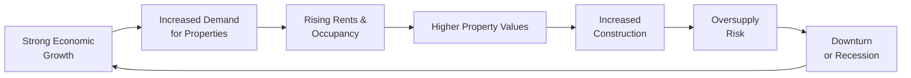

## Introduction and Overview

Real estate might seem rather tangible—buildings, land, brick, and mortar. But, as you look deeper, it’s a fascinatingly rich asset class influenced by everything from local zoning regulations to global macroeconomic conditions. It’s not just about buying a piece of land and watching it (hopefully) appreciate. We have to factor in cyclical shifts in interest rates, changing consumer behaviors (like the rise of e-commerce), and demographic trends (aging populations or millennial-driven city living).

In this section, we’ll explore how these “economic and competitive factors” drive real estate values, influence returns, and shape the dynamics among different property sectors. While real estate can seem complicated, we’ll break it down so that by the time you finish reading, you’ll have a far clearer picture of why real estate belongs in asset allocation decisions, how to evaluate it, and which pitfalls to avoid as you forecast returns.

## Supply and Demand Dynamics in Real Estate

### Core Macroeconomic Drivers

One of the biggest influences on property values and returns is simple supply and demand. Supply, on the one hand, is affected by the availability of developable land, construction costs, labor availability, and local regulations for building. Demand, on the other hand, largely emerges from population growth, household formation, and macroeconomic drivers, such as GDP growth or per capita income. If an economy is on a tear—picture the heady days of a real estate boom—demand for houses, offices, and retail spaces all go up, and that often boosts property values.

Let’s say, for instance, an economy experiences consistent annual GDP growth of 3%. More jobs are created; more people look for places to live, work, and shop. This scenario can lead to lower vacancy rates and higher rent levels. Of course, if the construction sector ramps up supply too quickly—perhaps by building many new skyscrapers or sprawling subdivisions—there’s a heightened risk of oversupply, leading to downward pressure on rental rates or property prices.

### Demographic Trends and Urbanization

Demographics are crucial when analyzing real estate trends. It’s not just population size; it’s also how households form (e.g., young adults leaving parents’ homes to rent) and where they choose to live (e.g., suburban vs. urban). I remember when I first looked at real estate data for a suburban region in my country. Household formations were rising, but everyone wanted to be near the new commuter rail station. Properties within a 10-minute walk soared in value, whereas homes just 30 minutes away stagnated.

Urbanization has been an overarching theme for decades. People relocating from rural areas to cities searching for better opportunities can create persistent upward price pressure in urban cores. However, trends can shift. Some cities might lose population if industries move away. Alternatively, remote-work possibilities might reduce the need for large office footprints. One must keep an eye on these shifting patterns—particularly for forecasting real estate returns over the medium to long term.

## Local Market Factors and Regulations

### Zoning Regulations and Infrastructure

Local regulations can make or break a real estate deal. Zoning laws determine whether an area can be used for residential, commercial, or industrial purposes. If you happen to own a piece of land that local authorities suddenly rezone for higher-density development, your property’s valuation may skyrocket (lucky you).

Infrastructure also matters. A new highway off-ramp or a proposed light rail extension can open up areas that previously had poor transportation access. The presence of good schools or newly built hospitals can catalyze residential demand. Similarly, higher property taxes or complicated licensing processes can deter development and limit potential growth in property values. These micro-level influences sometimes outweigh the broader macroeconomic picture.

### Property Taxes and Operating Expenses

Property taxes, insurance, and maintenance costs all reduce the net operating income (NOI) that property owners receive. If taxes rise or if local government imposes stricter building codes, owners might see a drop in profitability. In some markets, property tax differences between neighboring municipalities can be significant. Just a short walk across a city boundary might mean a different (perhaps higher) tax rate.

A property’s operating expenses matter for forecasting future cash flows. For instance, in some jurisdictions, older buildings require more frequent repairs and compliance upgrades, and that additional cost can lower your profitability. Ensuring that you factor in all local constraints—property tax rates, typical maintenance expense levels, and insurance—will help you form more realistic forecasts of your real estate returns.

## Competitive Factors: Vacancy Rates, Rents, and Operating Costs

### Vacancy Rates and Rent Levels

When analysts talk about “competitive factors,” they typically mean variables like vacancy rates, attainable rents, and operating costs. Vacancy rate is straightforward: the share of properties (e.g., offices, apartments) that are unoccupied. A rising vacancy rate usually indicates weakness in the market. When vacancies are extremely high, tenants can demand rent discounts, and landlords may offer concessions (like a free month’s rent or additional amenities).

Conversely, a low vacancy rate signals that supply is tight. Landlords can push rents up, fueling higher NOI and thus a more attractive return on investment. Watching the trend in vacancy rates can give forward-looking insight about whether new supply is coming online or whether demand might be softening. If you see a surge of new apartment developments in a zone with flat population growth, that’s often a sign that rising vacancies and downward rent pressure may be right around the corner.

### Operating Costs and Net Operating Income (NOI)

NOI is probably the most talked-about metric in real estate, and for good reason. NOI is basically your rental income (plus any other property revenue) minus your operating expenses. It’s the money you earn before considering financing costs (debt service) and capital expenditures. If you can reduce operating costs (e.g., by installing energy-efficient lighting or by negotiating better insurance rates), you might see a direct boost to NOI. Conversely, if new environmental regulations require costly retro-fits, your NOI may shrink.

The interplay between vacancy (which reduces revenue), operating costs (which reduce cash flow), and rent schedules (which determine revenue potential) is at the core of real estate returns. The more systematically you evaluate these factors, the less likely you are to be caught off-guard by a sudden rise in costs or an unexpected drop in rentals.

## Different Real Estate Sectors

### Residential Sector

Residential real estate is often the first sector that comes to mind. Changes in population growth, household formation, and interest rate policy can have immediate effects here. For instance, if mortgage rates drop, more families may qualify for loans, fueling demand and boosting prices. This sector also tends to respond to job market conditions. A stable local job market usually supports healthy rents and occupancy rates.

### Commercial (Office, Retail, Industrial)

Commercial real estate is vast. Offices respond mostly to employment in sectors needing physical office spaces. Think about the shift to remote and hybrid work—this has introduced new uncertainties regarding long-term office demand. Retail is driven by consumer spending, foot traffic, and the rise of e-commerce (which can reduce demand for brick-and-mortar spaces). Industrial real estate benefits from the growth in logistics—e-commerce might reduce retail space needs, but it increases the need for warehouses and distribution centers. They’re all interlinked. If consumer behavior changes drastically—like big expansions in online shopping—then industrial real estate might thrive while certain retail properties languish.

### Specialized Segments (Hotels, Healthcare, Data Centers)

Some specialized real estate segments have entirely different demand drivers. Hotels, for example, depend heavily on business travel, tourism, and broader economic conditions that shape consumer willingness to spend on travel. Healthcare real estate sees demand from hospitals, clinics, and senior living facilities—often influenced by demographic aging trends and medical insurance frameworks. Data centers are relatively new entrants on the real estate stage, riding the wave of cloud computing and the insatiable demand for data storage. While these categories are often lumped in with broader commercial properties, they can behave quite differently. They’re also subject to unique operating risks: building codes for medical properties are far more stringent than those for your typical office building, for instance.

## The Cap Rate Approach

### Capitalization Rate Basics

When you see a real estate professional summoning their quick e-math, they’re likely calculating or referencing the “cap rate,” short for capitalization rate. The formula is elegantly simple:


\text{Cap Rate} = \frac{\text{NOI}}{\text{Property Value}}


Let’s say an office building generates an annual NOI of $500,000, and the property’s market value is $10 million. Then the cap rate is 5%. What does that mean for you? It’s a back-of-the-envelope proxy for your return on investment if you paid cash for the property (no leverage). Analysts compare cap rates across markets and asset classes. A 5% cap rate might be more typical in a prime downtown area, while a 7% cap rate might reflect a bit more risk or a secondary market location.

### Using Cap Rates in Market Comparisons

Cap rates can help you compare properties with different rent and operating expense characteristics. If the market for a certain office location typically trades at a 6% cap rate, and you see a building on sale that’s generating a 7% cap rate, that might suggest either a bargain or a property with hidden risks (e.g., looming capital expenditures, questionable tenant credit quality). Evaluating factors like tenant mix or the likelihood of rents continuing at current levels is key to bridging these differences. Remember: a higher cap rate can indicate higher return potential, but it also typically reflects greater risk or weaker market fundamentals.

## Interest Rates, Credit Availability, and Financing Conditions

### Leverage and Its Double-Edged Nature

Real estate is a leverage-driven asset class. The majority of investors finance at least part of a purchase with debt (loans, mortgages). This magnifies returns (in both directions: gains can be amplified, and so can losses). If interest rates rise, it becomes more expensive to borrow, which can put downward pressure on property prices. Likewise, if banks tighten lending standards, investors may have difficulty securing financing, inhibiting demand and possibly damping price growth.

I once watched a friend of mine attempt to purchase a small apartment building during a period of steadily rising interest rates. He locked in a variable-rate mortgage and ended up paying almost twice as much in monthly interest by the end of the rate hikes. Though in a growing market, he might have been fine, but it shows how sensitive real estate can be to financing terms and the broader credit environment.

### Central Bank Policies and Liquidity

At a macro level, central bank monetary policy can shape the trajectory of real estate values. In many global markets, years of accommodative monetary policy (low interest rates, bond-buying programs) have fueled big surges in property prices. When central banks reverse course and start tightening monetary policy, investors may re-price risk, and real estate yields can move upwards.

## Cyclical vs. Structural Factors

### Pro-Cyclical Nature of Real Estate

Real estate is widely considered pro-cyclical. When an economy booms, people have higher income and companies expand—driving up demand for office space, housing, etc. That leads to rising rents and property values, often spurring new construction. But watch out: if a bust cycle hits, real estate can tumble. Property owners might face rising vacancy rates, lower rents, or even forced selling if property values drop below the outstanding loan balance.

### Long-Term Structural Shifts

While cyclical dynamics are exciting and more immediate, real estate also faces structural changes. E-commerce is the perfect example. With the steady migration of retail spending online, certain big shopping malls in out-of-town locations have begun struggling. Meanwhile, demand for distribution centers is climbing. Similarly, the shift to working from home might reduce the need for large-scale office developments, although the effect might be partial or cyclical in nature. Additionally, demographic shifts (aging populations, smaller household sizes, the growth of single-person households) can permanently alter residential market demand. Analysts who ignore these shifts can be caught in “zombie investments” that are out of step with new realities.

## Practical Mermaid Diagram: The Real Estate Market Cycle

Below is a simplified diagram (in Mermaid.js) illustrating how macroeconomic performance and credit conditions feed into the property cycle:

At first, robust economic growth fuels property demand, which boosts occupancy and rents. This leads to higher valuations—encouraging more construction. However, new supply can overshoot demand, leading to potential downturns. When the economy eventually softens, that can loop back around, rebalancing or resetting the property market cycle.

## Best Practices and Pitfalls

• It’s wise to maintain a broad perspective. Local zoning, interest rates, demographic trends, and occupancy levels all matter—a narrow focus on price appreciation alone can mislead you.  
• “Cap rate chasing”—merely picking properties that seem to have the highest yields—can be tempting. But high cap rates might be a yellow (or even red) flag for underlying problems.  
• Pay attention to leverage: those who over-leverage can be forced to sell in a down cycle, permanently eroding returns.  
• Keep track of structural trends such as online retail, telecommuting, changing transportation modes, and new infrastructure. These can disrupt established patterns.  

## Putting It All Together for Capital Market Expectations

In your broader asset allocation, real estate can serve as a source of both current income (rents) and potential long-term capital growth. But real estate’s cyclical nature and local specificity demand careful analysis. Integrating real estate into a multi-asset portfolio means balancing both short-term cyclical signals and long-term structural trends. Whether you’re using real estate investment trusts (REITs), private equity real estate funds, or direct ownership, it is crucial to forecast supply-demand imbalances accurately, evaluate current financing conditions, and adapt to shifting structural factors.

Asset allocators must also bear in mind return correlations: real estate returns can behave differently from equities or fixed income (though sometimes they show surprising correlations during market upheavals). Evaluating how these interactions evolve over time is a key skill for any portfolio manager. Keep a watchful eye on, say, how rising rates might not only tighten real estate credit supply but also shift investor preference to fixed-income products, pulling money out of property markets and sinking prices—especially in certain overheated markets.

## Additional Case Study: Urban Mixed-Use Office Complex

Imagine a large-scale, mixed-use building in a major city. The developer aims to lease offices, retail spaces, and luxury apartments under one roof. Demographic analysis might indicate more young professionals are flocking to city centers. The local economy looks stable and is adding jobs in finance and tech. That means decent initial demand for both apartments and office floors.

But you also discover that nearly half a dozen new real estate projects are planned in the same area. That’s a supply-side risk. Meanwhile, a new zoning regulation is in the works that might limit the building’s expansion. Then you note that interest rates, which have been at historical lows, are starting to tick up. That can influence financing and the final cost of capital. Finally, e-commerce may reduce foot traffic in the retail portion of the building, so you’d need more creative approaches to keep your retail units attractive (maybe new restaurants or experiential retail concepts).

In constructing your expected return scenario, you look at both short-term cyclical factors (job growth, interest rates) and longer-term structural changes (shift to online retail, potential future remote-work expansions). You adjust your forecasted NOI, apply a suitable cap rate for the market, and run stress tests on your financing assumptions. This process might make you revise your original, perhaps overly optimistic, return expectations. That’s the real-life interplay between economic forces and local competitive factors in real estate markets.

## Implications for the CFA Level III Exam

For the Level III exam, you’ll want to show integrated thinking about how real estate fits into multi-asset portfolios. (In topic areas dealing with capital market expectations, you might see question sets that require you to evaluate the economic outlook alongside real estate fundamentals, or weigh the effect of interest rates on cap rates and valuations.) Don’t forget to consider how an exogenous shock—maybe a pandemic or major technology adoption—would affect your real estate forecasts. Also remember to pay attention to how currency risks can arise if you’re investing in international properties.

Time management is key. You should be able to interpret vacancy rates, cap rates, and NOI figures quickly, explaining how they influence your recommended allocations. On essay-style questions, be sure to address risk factors thoroughly—especially leverage risks—and incorporate structural changes in your rationale.

## Concluding Remarks

Real estate returns are shaped by a tapestry of factors: macroeconomic performance, local supply-demand balances, shifting consumer and business preferences, and the whims of interest rates. But with thorough research and an eye for both cyclical and structural influences, you can develop robust capital market expectations for this vital asset class. Stay open-minded, double-check the fundamentals, and you’ll be well-prepared to fit real estate thoughtfully into an overall portfolio strategy.

Real estate is by no means a simple “buy and forget” asset class. Yet, done right, it can be a powerful tool for diversification, income generation, and inflation protection. Keep refining your understanding of these economic and competitive factors, stay aware of evolving market trends, and you’ll be far ahead of those who look only at the building’s façade without peeking under the hood.

## References and Further Exploration

• Geltner, D. et al. (2013). Commercial Real Estate Analysis and Investments. OnCourse Learning.  
• CFA Institute. (2025). CFA Program Curriculum, Level III – Real Estate Market Analyses.  
• Ling, D. C., & Archer, W. R. (2022). Real Estate Principles: A Value Approach. McGraw-Hill.  

--------------------------------------------------------------------------------

## Test Your Knowledge: Economic and Competitive Factors in Real Estate Markets Quiz



### Which of the following factors typically has the most direct impact on Net Operating Income (NOI) for a commercial property?

- [ ] Zoning regulations
- [x] Vacancy rates
- [ ] Property tax differentials between regions
- [ ] Lease duration

> **Explanation:** While zoning regulations, property taxes, and lease duration can all affect property performance, the most direct impact on NOI comes from changes in vacancy rates, which directly influences rental revenue.

### In a market with rising vacancy rates and flat demand, how are rent levels most likely to respond?

- [x] Rent levels generally decrease, as landlords compete to attract tenants.
- [ ] Rent levels increase, to compensate for lost tenants.
- [ ] Rent levels remain fixed, unaffected by occupancy.
- [ ] Rent levels increase only if property taxes decline.

> **Explanation:** Landlords often resort to rent reductions or incentives when vacancy rates climb and demand is not expanding, to attract or retain tenants in a more competitive environment.

### Which of the following long-term structural trends is most likely to reduce the expected demand for retail space?

- [x] The continued rise of e-commerce and online retail
- [ ] Rising interest rates
- [ ] A shrinking labor market in major cities
- [ ] Reduced property tax rates

> **Explanation:** While interest rates and labor markets have impacts, the structural shift of shopping patterns toward online platforms directly weakens demand for brick-and-mortar retail space over time.

### A cap rate of 7% compared to a market norm of 5% suggests:

- [ ] The property is undervalued and free of risk.
- [x] Higher return potential, typically accompanied by higher perceived risk or weaker market fundamentals.
- [ ] The property is in a prime area with low vacancy rates.
- [ ] The property has minimal operating expenses.

> **Explanation:** A higher cap rate can look attractive due to potentially greater returns, but it commonly reflects a less stable tenant base, an inferior location, higher operational risk, or other factors.

### Which specialized real estate sector relies heavily on hospitality and travel-related spending?

- [ ] Data centers
- [ ] Senior living
- [ ] Industrial/distribution facilities
- [x] Hotels

> **Explanation:** Hotels (a specialized part of the real estate sector) depend greatly on business travel and tourism, making them sensitive to macroeconomic and industry-specific cycles.

### If local government suddenly rezones a parcel of land to permit higher-density construction, which of the following is the most likely immediate effect?

- [x] The land value of that parcel increases due to enhanced development potential.
- [ ] The land value remains unchanged unless vacancy rates change.
- [ ] The new zoning rules reduce future cash flow projections.
- [ ] The existing building’s rent price must drop.

> **Explanation:** Allowing higher-density construction typically boosts the potential future revenue stream of that property, often increasing its market value right away.

### Which feature is most characteristic of a pro-cyclical asset class like real estate?

- [ ] It tends to rise in value when economic conditions deteriorate.
- [x] Its value typically increases during expansions and declines during recessions.
- [ ] It is largely unaffected by credit availability.
- [ ] It exhibits negative correlation with equity markets at all times.

> **Explanation:** Pro-cyclical assets, including most real estate, align with the broader economic cycle: when growth is strong, values rise, and vice versa.

### When evaluating real estate in an asset allocation framework, which factor is most critical to compare across different sectors (e.g., office vs. residential vs. industrial)?

- [x] The sectors’ occupancy and rental-income assumptions
- [ ] The tenant preferences regarding risk budgeting
- [ ] The uniformity of building design
- [ ] The pattern of all property tax regimes

> **Explanation:** Different real estate sectors (office, residential, industrial, retail) each have unique drivers for occupancy and rental levels; analyzing those fundamentals is crucial for assessing risk and return potential.

### You observe that mortgage lending standards have tightened significantly. Which immediate effect on real estate demand is most likely?

- [x] Demand may drop, as would-be buyers struggle to obtain financing.
- [ ] Demand spikes, as more people rush to buy before financing disappears.
- [ ] No effect, since real estate pricing is unaffected by credit conditions.
- [ ] Demand rises if vacancy rates are historically low.

> **Explanation:** Stricter lending standards reduce the pool of qualified buyers, often slowing real estate demand and potentially lowering prices.

### Real estate is best described as “pro-cyclical” because:

- [x] It generally moves in the same direction as the overall economy, rising in booms and falling in recessions.
- [ ] It moves in the opposite direction of the economy, creating a hedge against economic downturns.
- [ ] It has no correlation to macroeconomic growth.
- [ ] It only responds to long-term demographic trends, ignoring short-term cycles.

> **Explanation:** Real estate typically performs well when economic growth is strong and underperforms during recessions, aligning with economic cycles.


