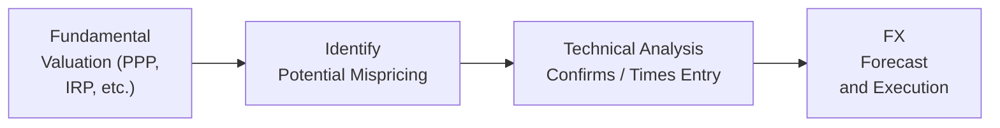

## Introduction and Context

In global investing and portfolio management, exchange rates matter a lot more than we sometimes realize. I’ll never forget the first time I saw a carefully constructed international portfolio lose most of its gains in dollar terms because the foreign currency fell sharply. I remember thinking: “Wait, I nailed the stock picks. Why am I still losing money?” The culprit was currency risk. That moment taught me that we must pay serious attention to foreign exchange (FX) movements.  

Anyway, forecasts of exchange rates can—let’s be candid—feel notoriously tricky. There’s a big mix of macroeconomic fundamentals, investor sentiment, capital flows, and even technical patterns swirling around. In the sections that follow, we’ll walk through the major approaches used by professionals to forecast exchange rates. We’ll explore time-tested models like Purchasing Power Parity (PPP) and the Monetary Model, as well as more market-driven angles such as short-term speculation and technical analysis.  

The key takeaway is that there’s no single, infallible approach. In many real-world scenarios, we combine multiple perspectives to form the strongest possible view. Let’s dig in and see how each approach tries to tackle the tough question: “Where is that currency going next?”

## Purchasing Power Parity (PPP)

PPP is a long-run equilibrium concept. It basically says if a “basket of goods” costs USD 100 in the United States and GBP 80 in the UK, the exchange rate should adjust so those goods cost the same in both places, ignoring shipping and transaction costs. Over time, differences in inflation rates—especially in the presence of open trade—should cause exchange rates to move in a direction that equalizes the real price of that basket in each country.

### Conceptual Overview

The PPP formula often goes as follows:


\text{Spot Exchange Rate}_{\text{USD/GBP}} = \frac{P_{\text{USD}}}{P_{\text{GBP}}},


where \\(P_{\text{USD}}\\) and \\(P_{\text{GBP}}\\) are price levels (or price indexes) in the United States and the UK, respectively. The logic is: If the U.S. has higher inflation than the UK over time, the USD should depreciate to keep purchasing power the same. That’s the theory, at least.

### Practical Insights

• For long-horizon forecasts, PPP is often a starting point to gauge a “fair-value” level for a currency.  
• If a currency is significantly above its PPP-implied rate, we might say it’s overvalued. The assumption is that eventually (maybe after a year, maybe after a decade, who knows?), it’ll revert to levels justified by relative price fundamentals.  
• But: Many factors can keep a currency away from PPP-based fair values for a long time. Trade barriers, capital controls, or inconsistent consumption patterns can create persistent deviations.

## Interest Rate Parity: Covered vs. Uncovered

Another well-known currency forecasting approach is interest rate parity (IRP). If you’ve ever worked on a forward currency contract, you’ve probably seen how forward prices are derived from differences in interest rates in each currency.

• **Covered Interest Rate Parity**: States that forward exchange rates should move to offset any differences in risk-free interest rates, when you hedge via a forward contract.  
• **Uncovered Interest Rate Parity**: Says that the expected spot rate (not locked in by a forward contract) should incorporate interest rate differentials because, in theory, currencies with higher interest rates should depreciate.

### Formulas and Logic

Covered interest parity can be expressed as:


F_{a/b} = S_{a/b} \times \frac{1 + i_a}{1 + i_b},


where \\(F_{a/b}\\) is the forward rate for currency a in terms of currency b, \\(S_{a/b}\\) is the current spot rate, and \\(i_a\\) and \\(i_b\\) are the risk-free interest rates. When this relationship doesn’t hold, arbitrage is possible—at least until advanced systems and traders exploit it.

For uncovered interest rate parity, the idea is:


E[S_{a/b}(t+1)] = S_{a/b}(t) \times \frac{1 + i_a}{1 + i_b},


where \\(E[\cdot]\\) denotes the expected future spot rate. The currency with the higher interest rate is expected to depreciate.

### Real-World Application

Given the complexities of open economies, IRP rarely holds in a neat, precise manner, especially uncovered parity. Political risk, capital controls, and investor sentiment all throw wrenches into the works. However, IRP is still a great baseline, especially when you’re analyzing forward rates or comparing broad currency market expectations to fundamental interest rate differentials.

## Balance of Payments (Current Account) Approach

Now, focusing on a country’s external accounts is another strategy. This approach looks to explain long-run currency trends by analyzing trade balances (the current account) and cross-border capital flows. If a country runs a persistent trade deficit—like the United States has for decades—it may require large capital inflows to fund that deficit. Those capital inflows (foreigners buying U.S. Treasury bonds, for instance) can help support that currency. Conversely, a net outflow might pressure the currency.

### Logic

• **Trade Surplus**: Exports exceed imports. In theory, that extra demand for domestic goods boosts demand for local currency, possibly causing appreciation.  
• **Trade Deficit**: Imports exceed exports. The local currency might face downward pressure unless the deficit is financed by significant foreign capital inflows.  

In the short run, certain large deals—like cross-border mergers or acquisitions—may also influence a currency’s demand and supply.  

### Strengths and Complexity

• This approach tries to incorporate real-world flows of goods and capital.  
• But in practice, we must monitor both the current account and the capital account. For instance, large capital inflows can offset a trade deficit or might accelerate currency appreciation.  
• Changes in foreign direct investment policy, shifts in investor risk appetite, or major global events (e.g., sudden capital flight) can drastically alter the currency.

## Monetary Model of Exchange Rates

Currency values, in this approach, are driven by supply and demand for money, interest rates, and inflation rates. Central banks are key players here. If a central bank is printing money aggressively (increasing money supply), it may spark inflationary pressures, leading to currency depreciation. Alternatively, a more disciplined monetary stance might help maintain or increase a currency’s value.

### Typical Framework

One simplified version is:


S_{a/b}(t) = \frac{M_a(t) \times V_a(t)}{M_b(t) \times V_b(t)},


where \\(M_a\\) and \\(M_b\\) represent the money supplies of each country, and \\(V_a\\) and \\(V_b\\) are the velocities of money (how quickly money changes hands). Admittedly, velocity can be difficult to measure precisely and might be influenced by many short-term factors like interest rates, consumer confidence, and bank lending patterns.

### Policy Implications

• If a central bank signals tighter monetary policy relative to another country, we might see currency appreciation in the tighter country.  
• If monetary policy is unexpectedly loose, currency depreciation or lower relative value could occur.  
• Like PPP, the monetary model often focuses on medium- to long-term horizons. Short-term fluctuations may deviate widely.

## Behavioral and Market Sentiment Approaches

Sometimes, you look at a currency chart and think, “This is as much about raw emotion as it is about economic theory.” Indeed, short-term exchange rate dynamics are often driven by speculation, fear, greed, or momentum.

### Elements of Behavioral Finance in FX

• Herd behavior, where traders rush into the same trade because it’s working or because a major institution “hinted” that it might be a winner.  
• Overreaction to news: An interest rate announcement or political event can set off a big rally or sell-off—sometimes bigger than fundamentals alone would justify.  
• Speculative trading: Large leveraged players (hedge funds, for instance) can push a currency beyond its PPP value if the momentum trade is hot.

Behavioral approaches can be especially relevant during crises or volatile markets, where fear catalysts can overshadow fundamental data.

## Capital Flows Approach

Capital flows models expand on the current account approach by paying extra attention to net cross-border transactions. Large portfolio investments—like foreign purchases of domestic stocks and bonds—can influence currency demand. Foreign direct investment (FDI) in infrastructure, factories, or real estate can also create persistent demand for a currency.  

Conversely, if local investors begin shifting capital abroad en masse, that can spark currency depreciation. We also see this interplay in emerging markets, where “sudden stops” (rapid pullouts of foreign capital) can cause abrupt currency crashes.

## Technical Analysis in FX Forecasting

Feel like scanning a chart for a pattern? Technical analysis uses graphical trends, chart patterns (like double tops, head-and-shoulders, triangles), and momentum indicators (like Moving Averages, RSI, MACD) to spot potential short-term currency movements. It’s widely employed by traders to time entries and exits.

### Typical Tools

1. **Moving Averages**: Identify direction and potential support/resistance zones.  
2. **Trendlines**: Spot supply/demand zones.  
3. **Momentum Indicators**: RSI or MACD to measure how quickly a currency is moving and whether it’s overbought/oversold.

### Complementing Fundamental Strategies

Many managers combine fundamental models like PPP for a long-term target and then refine market timing with technical signals. If the PPP model suggests that a currency is undervalued but the chart shows a major downward trend, it might be wiser to wait for a technical breakout before entering a position.

Below is a simple illustration of how a fundamental signal might combine with a technical approach to refine forecasting:

## Assumptions and Limitations

Despite the best efforts of each approach:

• **PPP** can be slow to realize. A currency can remain well above or below PPP equilibrium for years due to speculation or structural factors.  
• **Interest Rate Parity** is not always visible in real markets, especially in times of crisis or when capital controls exist.  
• **Balance of Payments** approach can be complicated by capital flows, trade policies, and global supply chain disruptions.  
• **Monetary Model** assumptions of stable velocity of money and rational expectations can oversimplify reality.  
• **Behavioral** factors can overwhelm fundamentals for extended periods, especially in times of political or economic uncertainty.  
• **Capital Flows** approach can shift suddenly if investor sentiment changes.  
• **Technical Analysis** can provide many false signals, especially in sideways or low-volatility markets.

So, let’s be realistic. A measured, “blended” approach—where we listen to multiple signals—often proves more robust than relying on a single model.  

## Synthesizing Multiple Forecasting Methods

Professional currency analysts typically blend fundamentals, technicals, and sentiment indicators. For example, a manager who invests globally might:  

1. Start with PPP or a monetary model to get a sense of long-run fair value.  
2. Examine interest-rate differentials and forward curves to see short-term expectations.  
3. Check the balance of payments data for large deficits or surpluses and capital flows for possible breakpoints.  
4. Incorporate signals from behavioral or momentum-based indicators to time trades—especially in volatility.  

Over the last decade, we’ve seen how risk-on/risk-off episodes can overshadow fundamentals when fear or exuberance grips the market. That’s why many analysts also keep a close eye on crowd sentiment.

## Best Practices and Pitfalls

• **Use Multiple Time Horizons**: Different approaches excel in different timeframes. PPP might guide your longer-term stance, while interest rate parity or technical analysis can help with short-term adjustments.  
• **Watch for Structural Breaks**: Political upheavals, large-scale monetary policy changes, or global events like pandemics can shift underlying relationships drastically.  
• **Diversify Hedging Decisions**: Even if your main model signals a certain currency move, consider partial hedges or stepping in gradually.  
• **Stay Aware of Transaction Costs**: Costly spreads or forward premiums can quickly erode expected gains from forecasting trades.  
• **Assess Liquidity**: For major currency pairs (EUR/USD, USD/JPY, GBP/USD, etc.), liquidity is rarely a concern. But in emerging markets, low liquidity can amplify short-term volatility.  
• **Review and Update Assumptions**: If your forecast turned out wrong, do a post-mortem—see if your model’s inputs changed or if sentiment overshadowed fundamentals.

## Exam Relevance and Key Takeaways

For the CFA Level III exam, you might face scenario-based questions requiring you to evaluate currency outcomes using one or more models. Often, the exam wants you to:

• Analyze which currency approach (PPP, IRP, monetary, etc.) is most relevant given the scenario timeline.  
• Propose hedging or portfolio strategies under various currency outcomes.  
• Discuss the limitations or assumptions of each approach in relation to a practical case.  

Remember that Level III often emphasizes the portfolio-level implications of currency movements. So, be prepared to do more than just produce a numerical forecast. Consider how a mispriced currency can affect strategic and tactical asset allocation, risk budgeting, and performance evaluation.

## References and Further Reading

- Obstfeld, M., & Rogoff, K. (1996). Foundations of International Macroeconomics. MIT Press.  
- CFA Institute. (2025). CFA Program Curriculum, Level III – Currency Management and Forecasting Readings.  
- Frankel, J. A. (1979). On the Mark: A Theory of Floating Exchange Rates. American Economic Review.  

## Final Thoughts and Exam Tips

• **Contextualize**: In the exam, describe why a certain approach is suitable for a given timeframe and market condition.  
• **Combine Qualitative and Quantitative**: Show you understand the theoretical math but can also apply real-world disclaimers.  
• **Practice Scenario Analysis**: If the exam question sets up an environment of rising inflation in one country and stable interest rates in another, see how PPP, IRP, and monetary factors line up—and what happens if capital flows shift abruptly.  
• **Time Management**: If you see a multi-part essay question, map out your main points on each approach before diving into calculations.  
• **Stay Calm**: With enough practice, you’ll recognize that each model complements the others. The real skill is knowing when and how to deploy them effectively.

Use these recommended resources and practice problem sets to deepen your grasp—and don’t forget to watch out for trick questions that test whether you know each model’s limitations. At Level III, your ability to articulate the “why” behind the forecast is often as important as generating the forecast itself.

---

## Test Your Knowledge: Exchange Rate Forecasting Quiz



### Which approach primarily states that exchange rates should adjust so goods cost the same across countries over time?

- [ ] Interest Rate Parity
- [x] Purchasing Power Parity
- [ ] Monetary Model
- [ ] Behavioral Finance Model

> **Explanation:** Purchasing Power Parity (PPP) holds that exchange rates should, in the long run, adjust so that identical goods or baskets of goods cost the same in different countries.

### According to the Monetary Model of exchange rate determination, what is the primary driver of a currency’s value?

- [ ] The price of commodities like gold 
- [x] Supply and demand of money, influenced by monetary policy 
- [ ] The central bank’s foreign exchange reserves alone
- [ ] Investor emotion and speculation

> **Explanation:** The Monetary Model centers on money supply and demand, with inflation and central bank policies playing major roles in determining currency values.

### Covered interest rate parity relies on which financial instrument to eliminate arbitrage opportunities?

- [x] Forward contracts
- [ ] Stock index futures
- [ ] Options on equity indices
- [ ] Interest rate caps and floors

> **Explanation:** Covered interest rate parity states that using forward contracts on currency pairs aligns any difference in risk-free interest rates, removing arbitrage opportunities.

### Which of the following is typically considered a long-term equilibrium concept rather than a short-term predictive tool?

- [ ] Technical Analysis
- [ ] Market Sentiment Approach
- [x] Purchasing Power Parity
- [ ] Capital Flows Approach

> **Explanation:** PPP is generally applied to long-run exchange rate predictions to identify broad under- or overvaluation, recognizing that it might not accurately capture short-term fluctuations.

### Under uncovered interest rate parity, a higher domestic interest rate is expected to result in:

- [ ] A permanent appreciation of the currency
- [ ] No change in the expected future spot rate
- [x] Expected depreciation of the domestic currency
- [x] A large capital outflow

> **Explanation:** Uncovered interest rate parity suggests that if the domestic interest rate is higher, investors expect the domestic currency to depreciate just enough to offset the interest advantage.

### Which approach places a large emphasis on investor psychology, herding, and overreaction to market news?

- [ ] Balance of Payments Approach
- [x] Behavioral / Market Sentiment Approach
- [ ] Monetary Model
- [ ] Purchasing Power Parity

> **Explanation:** The behavioral approach highlights how emotional and psychological factors can drive currency movements, often in ways that deviate from strict fundamental values.

### Which statement best describes a limitation of the Monetary Model?

- [ ] It cannot be used when interest rates are zero.
- [x] It assumes stable velocity of money and rational expectations, which may not hold in reality.
- [ ] It ignores the role of interest rates altogether.
- [ ] It only applies to fixed exchange rate regimes.

> **Explanation:** A challenge with the Monetary Model is that in real-world settings, velocity of money isn’t constant, and market participants often exhibit irrational or non-rational behavior.

### A country running a persistent trade deficit but receiving substantial foreign direct investment might see its currency:

- [x] Supported by capital inflows and possibly appreciating
- [ ] Depreciating automatically according to PPP
- [ ] Ignoring both imports and exports
- [ ] Pegged artificially by the IMF

> **Explanation:** Major and sustained FDI inflows can support and even strengthen a currency despite a current account deficit, illustrating how capital flows can outweigh a purely trade-based view.

### How does technical analysis commonly aid currency forecasting?

- [ ] By predicting a currency’s exact equilibrium based on PPP
- [ ] By calculating inflation spreads across countries
- [ ] By determining central bank policy moves
- [x] By identifying trends, patterns, and potential reversal points on price charts

> **Explanation:** Technical analysis focuses on price and volume charts to identify potential turning points and momentum shifts, complementing or refining fundamental models.

### True or False: In some scenarios, short-term currency valuations can deviate significantly from fair value due to speculative trading and investor sentiment.

- [x] True
- [ ] False

> **Explanation:** Short-term fluctuations often result from psychology, speculation, or momentum-based trading, causing exchange rates to deviate from fundamental fair-value estimates.


