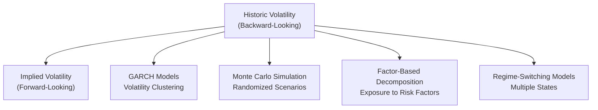

## Introduction

So, volatility forecasting—ever found yourself fretting over how bumpy the road might get when you invest in stocks, bonds, or even more esoteric instruments? You’re not alone! Practitioners all over the globe wrestle with the best way to gauge the risk in their portfolios, particularly the variability of returns or prices over time. In many ways, volatility is at the heart of risk management and asset allocation, so it’s no surprise that forecasting it is a key skill for any advanced investment professional, including CFA Level III candidates.

Below, we’ll talk through a bunch of methods to forecast volatility: the classic historical standard deviation approach, the forward-looking implied volatility gleaned from options, the more advanced GARCH techniques, practical Monte Carlo simulations, factor-based variance decompositions, and even more intricate regime-switching models. We’ll also explore why it matters whether you’re looking at short-term turbulence versus long-term fundamental shifts. 

Most crucially, you’ll see that no single approach is perfect for all scenarios—frankly, you might end up applying multiple methods to cross-check your analysis, especially if you’re working in large institutional portfolios. Let’s walk through a structured breakdown of these methods and see how you might apply them in practice.

## Historical Volatility

Historical volatility is the most straightforward jumping-off point for a forecast. You calculate the standard deviation of past returns over a chosen time window—perhaps daily returns for the last year, or monthly returns for the last five years.

1. Concept:  
   – Historical volatility examines how much an asset’s returns have fluctuated around their mean over a specific historical period.  
   – It’s easy to compute with the basic formula for standard deviation, which, at its simplest, can be written as:

     (1)  
     σ = √( (1 / (T − 1)) × Σ (rᵢ − r̄)² )

     where:  
     • T = total number of data points,  
     • rᵢ = the ith return,  
     • r̄ = average return across all T observations.

2. Use Cases:  
   – Historical analysis of equity price movements, bond yields, or currency fluctuations.  
   – Quick measure to form baseline expectations about risk.

3. Limitations:  
   – Backward-looking. If markets shift—due to a regime change or a major policy announcement—historical volatility might understate or overstate the future.  
   – Yesterday’s calm might turn into tomorrow’s storm, and your historical figure might say “Everything’s fine!” when it’s not.

In practice, many investment managers still start with historical volatility because it’s easy. But they’ll often cross-reference it with forward-looking measures (like implied volatility) or advanced statistical models to pick up early signals of regime changes.

## Implied Volatility

Implied volatility (IV) is extracted from market prices of options—essentially, it’s the volatility level that the option’s market price is implying for the underlying asset. In equity markets, the VIX is a well-known implied volatility measure for the S&P 500 index.

1. Concept:  
   – IV is forward-looking, reflecting both investor sentiment and actual market expectations. For instance, if the VIX is rising quickly, it often means participants trading S&P 500 options see rockier days ahead.  
   – In the Black–Scholes model for an option, there’s a single unknown variable for standard deviation (σ), which we call implied volatility. Market prices of options can be used to back-solve for σ.

2. Use Cases:  
   – Input for risk management dashboards (e.g., calculating Value at Risk (VaR) or stress-testing).  
   – Gauging near-term risk environment for short-duration strategies, because implied vol is typically used in actively traded option markets with short maturities.

3. Limitations:  
   – Sensitive to supply-and-demand conditions in the options market, so it can sometimes overstate or understate realized risk.  
   – Not always available in all markets (some instruments are illiquid or do not have standard options).

Implied volatility is a favorite among practitioners for short-term forecasting because it captures real-time “wisdom of the crowd.” That being said, it’s also subject to noise—so keep in mind that the market can overreact (or underreact) in the short term. 

## GARCH (Generalized Autoregressive Conditional Heteroskedasticity) Models

If there’s one approach that best captures the phenomenon of “volatility clustering,” GARCH is it. Ever notice how big moves in the market tend to clump together—like a series of aftershocks following an earthquake? GARCH picks up these patterns.

1. Concept of Volatility Clustering:  
   – Volatile days tend to follow volatile days, and calm periods follow calm periods. This phenomenon underpins the GARCH framework developed by Robert Engle (and extended by Tim Bollerslev).  
   – The GARCH(1,1) model is a simple hallmark:  
     
     (2)  
     σₜ² = ω + α·εₜ₋₁² + β·σₜ₋₁²  

     where:  
     • σₜ² is the current variance estimate,  
     • εₜ₋₁² is the previous period’s squared error (shock factor),  
     • σₜ₋₁² is the previous period’s variance estimate,  
     • ω, α, β are model parameters, typically estimated through maximum likelihood methods.

2. Use Cases:  
   – Capturing how yesterday’s volatility influences today’s volatility.  
   – Suitable for markets where you suspect that large movements beget continued uncertainty (think emerging market equities or commodities).

3. Limitations:  
   – It can be overfitted if the sample period is short.  
   – Doesn’t automatically consider major external macro shocks or regime changes (though advanced “threshold GARCH” or “EGARCH” models may incorporate asymmetries).

But GARCH is powerful precisely because it deals with how volatility evolves over time. Don’t be surprised if you see exam questions asking you to interpret GARCH parameters—like if α and β are high, watch out; volatility has serious staying power!

## Monte Carlo Simulation

Maybe you want to push further and test a whole distribution of future price paths. That’s where Monte Carlo simulation steps in—a computational technique that can replicate random draws from assumed distributions to see how an asset or portfolio could evolve.

1. Concept:  
   – You begin with an assumed distribution for returns (commonly normal or lognormal) and a set of parameters (e.g., expected return, volatility, correlations).  
   – Then you repeatedly simulate potential future price paths, each time generating random outcomes based on those distributional assumptions.  
   – By doing many simulations (thousands or even millions), you create a distribution of potential outcomes.

2. Use Cases:  
   – Stress testing: how often do you see a big drawdown?  
   – Projecting the range of possible portfolio values at the end of an investment horizon—helpful in asset allocation under uncertain market conditions.

3. Limitations:  
   – Very dependent on the accuracy of your input assumptions (garbage in, garbage out).  
   – Traditional Monte Carlo often relies on normal distributions, ignoring fat tails or skewness—though you can incorporate more advanced distributions.

We often see Monte Carlo used in tandem with results from historical or GARCH-based volatility estimates. For instance, you might calibrate the simulation’s volatility parameter using a GARCH forecast or implied volatility. You get a more holistic sense if you can see not just a single expected outcome, but an entire range of outcomes, including tail events.

## Factor-Based Variance Decomposition

Sometimes, you want to know why your portfolio’s volatility might spike or drop, rather than just how much it will move. That’s where factor-based approaches come in, decomposing your total volatility by looking at the exposures to various risk factors.

1. Concept:  
   – Suppose your portfolio is influenced by multiple factors—like interest rates, market indices (S&P 500, MSCI World), credit spreads, and commodity prices.  
   – In a factor model, each asset’s return is broken down into the factor exposures multiplied by factor returns plus an idiosyncratic (asset-specific) term.  
   – Portfolio variance is then aggregated from the factor variances and covariances, weighted by factor loadings.

2. Use Cases:  
   – Risk budgeting: which factor is your biggest risk driver?  
   – Strategic asset allocation: tilt away or toward certain macro factors if you expect them to shift.

3. Limitations:  
   – Dependent on the quality of the factor model. If you miss an important factor (say an unexpected political crisis), your decomposition might be incomplete.  
   – Factor exposures may change over time, complicating the analysis.

If you’re a big institutional manager with a multi-asset portfolio—think large pension plan or endowment—factor-based variance decomposition is a potent approach. It informs you which levers to move if you decide to reduce or increase risk relative to a particular macro outlook.

## Regime-Switching Models

Sometimes the market is calm; sometimes it’s stormy. Why pretend both conditions produce the same volatility parameters? Regime-switching models attempt to explicitly allow for multiple “states” of the world. 

1. Concept:  
   – The model presumes there might be a low-volatility state (normal times) and a high-volatility state (crisis times), each with its own mean return and volatility.  
   – A transition matrix determines the probability of switching from one regime to another.  

2. Use Cases:  
   – Particularly relevant for macro or geopolitical shifts (e.g., ironically, everything might be stable until a big shock triggers a transition to a crisis state).  
   – Stress testing for major structural changes.

3. Limitations:  
   – Model complexity. You have to estimate not only the means and volatilities for each regime, but also the transitions.  
   – Real markets might have more than two states. Some advanced models handle multiple regimes, but complexity goes up significantly.

Regime-switching is a nice complement for scenarios where historical volatility doesn’t do justice to abrupt or cyclical changes. If your emerging market bond portfolio experiences drastically different risk profiles during stable political conditions than during election turmoil, a regime-switching approach can capture that.

## Forecasting Horizon Considerations

All these methods—historic, implied, GARCH, Monte Carlo, factor-based, or regime-switching—tie back to what horizon you’re interested in. It’s easy to forget, but short-term and long-term vol forecasts can differ drastically.

• Short-Term (a few days to a few months):  
  – Implied volatility is often a leading indicator.  
  – GARCH can capture day-to-day or week-to-week clustering.  
  – Factor-based might not fully shift so quickly, but can highlight immediate exposures.

• Long-Term (several months to years):  
  – Historical volatility offers a broad-strokes gauge but might understate unusual events.  
  – Regime-switching can help if you expect certain macro transitions over the horizon.  
  – Monte Carlo can incorporate longer-term distributions (especially if you embed structural shifts or changing correlations).

Anyway, always define your forecast horizon clearly in exam answers—CFA exam graders love clarity around “this method is suitable for short-term horizons” or “we prefer Monte Carlo for multi-year horizons.”

## Beyond the Normal Distribution

One real-world observation is that asset returns don’t always line up nicely with a bell-shaped curve. Sometimes you get fat tails (or leptokurtosis) and skewness, meaning extreme outcomes might happen more frequently than the normal distribution predicts.

• Fat Tails & Skewness:  
  – Means that you might get bigger-than-expected drawdowns—or rocket-ship rallies—outside the range implied by a normal curve.  
  – Some GARCH variations (EGARCH, GJR-GARCH) allow for asymmetry.  

• Extreme Value Theory (EVT):  
  – Focuses explicitly on the tails of the distribution.  
  – Helpful in analyzing risk in stressed markets (like the Global Financial Crisis scenario in 2008–2009).  
  – Often used in combination with historical or Monte Carlo methods to produce a “worst-case scenario” perspective.

• Practical Example:  
  – If you’re analyzing a commodity like oil, you might see highly skewed distributions—oil price can spike or crater dramatically based on geopolitical developments. Traditional normal-based models might underestimate the chance of a huge crash.

If you’re a risk manager or an asset allocator at a hedge fund, you might frequently overlay these advanced distribution approaches to ensure you don’t get blindsided by black-swan events.

## Practical Exam Tips

• Show Understanding of Each Method:  
  – On exam day, you might see prompt-driven questions requiring you to select an appropriate volatility-forecasting method for different scenarios. If the question highlights day-to-day trading strategies or sentiment-driven markets, pick implied volatility or GARCH. If it’s a longer-term pension asset allocation, you might emphasize historical or factor-based approaches plus a stress-testing overlay.

• Compare and Contrast:  
  – CFA essay questions often ask you to “compare/contrast two or three approaches.” Be ready to articulate strengths, weaknesses, and real-world use cases for each method.  

• Mention Key Terms:  
  – Examiners love seeing terms like “volatility clustering,” “fat tails,” “regime switching,” and “implied volatility.” It shows command of the material.  

• Provide Structured Responses:  
  – For essay (constructed response) segments, your best bet is to keep the answers structured and concise: define the method, state how it’s used, acknowledge limitations, and tie it back to a portfolio management decision.

Remember: diagrams, bullet points, and short paragraphs can be your friends when writing exam answers. But be sure to answer exactly what is asked—don’t drift off into tangential topics!

## References & Further Reading

• Hull, J. (2017). Options, Futures, and Other Derivatives. Pearson.  
• Engle, R. (1982). Autoregressive Conditional Heteroscedasticity with Estimates of the Variance of UK Inflation. Econometrica.  
• CFA Institute. (2025). CFA Program Curriculum, Level III – Volatility Forecasting Techniques.

## Visual Overview of Volatility Forecasting Methods

Below is a simple diagram showing different popular approaches to forecasting volatility:

They all start with the idea of quantifying uncertainties in returns, but each approach provides a different angle (looking backward, looking forward, factoring in dynamic patterns, or capturing tail risks).

-----------------------------------------------------------------------

## Test Your Knowledge: Volatility Forecasting Methods



### Which of the following statements regarding implied volatility is most accurate?
- [ ] Implied volatility is exclusively a backward-looking measure based on historical returns. 
- [x] Implied volatility is a forward-looking measure derived from current option prices. 
- [ ] Implied volatility is always higher than realized volatility. 
- [ ] Implied volatility is irrelevant for short-term forecasting.  

> **Explanation:** Implied volatility is extracted from contemporaneous option prices, making it a forward-looking metric. Historical data does not come into play when directly calculating implied volatility.

### A GARCH(1,1) model includes which key elements for forecasting volatility?
- [x] Past variance estimates and past squared errors.  
- [ ] Bond yields and dividend distributions.  
- [ ] Changes in the implied volatility index.  
- [ ] Multiplicative exchange rate differentials.  

> **Explanation:** A standard GARCH(1,1) approach updates today’s variance based on yesterday’s variance and yesterday’s squared error term. Factors like bond yields or dividend distributions are not inherently part of this model.

### What is a disadvantage of relying solely on historical volatility to predict future volatility?
- [ ] It focuses too heavily on forward-looking sentiment.  
- [ ] It is consistent during regime shifts.  
- [x] It may fail to adapt to sudden changes in market conditions.  
- [ ] It automatically accounts for changes in risk factors.  

> **Explanation:** Historical volatility is backward-looking, so if there is a sudden shock or a new market regime, it may be unable to reflect the resulting risk changes promptly.

### Which statement best describes a regime-switching model?
- [x] It recognizes different “states” (e.g., normal vs. crisis) with distinct volatility levels.  
- [ ] It is a single-state model with fixed volatility.  
- [ ] It offers the same variance estimates regardless of market conditions.  
- [ ] It ignores transitional probabilities between market states.  

> **Explanation:** Regime-switching models allow each state (regime) to have unique parameters (mean and volatility) and incorporate transition probabilities between states.

### In a factor-based variance decomposition, the portfolio’s overall volatility is primarily influenced by:
- [x] The volatility and covariances of various risk factors weighted by factor exposures.  
- [ ] The credit rating of market participants.  
- [x] The magnitude of individual security dividends.  
- [ ] Purely the historical average return.  

> **Explanation:** Factor-based decomposition calculates total variance based on the systematic risk factors, their variances, and how they correlate with each other, weighted by the portfolio’s factor exposures.

### Which of the following methods is particularly useful for examining the tail risk of an asset’s return distribution?
- [x] Extreme Value Theory (EVT).  
- [ ] Simple moving averages of price returns.  
- [ ] CAPM (Capital Asset Pricing Model).  
- [ ] Conventional linear regression without any modifications.  

> **Explanation:** EVT specializes in analyzing extreme outcomes in the tails of the distribution, making it an appropriate tool for tail risk assessment.  

### When calibrating a Monte Carlo simulation for equity returns, which statement is true?
- [x] The quality of simulation results depends heavily on the chosen distribution and parameters.  
- [ ] Normality is guaranteed for all equity market returns.  
- [x] Volatility inputs become irrelevant when generating random returns.  
- [ ] Fewer simulations always yield more accurate results.  

> **Explanation:** If the parameters (e.g., mean return, volatility, correlation) are poorly set, the simulation results will be unreliable. Monte Carlo simulation doesn’t automatically enforce normality, and increasing the number of simulations often provides more robust results.

### A portfolio manager wants to capture how calm stock market periods switch to turbulent periods. Which approach is most appropriate?
- [x] Regime-switching models.  
- [ ] Simple historical standard deviation.  
- [ ] Single-factor models with fixed parameters.  
- [ ] Arithmetic averaging of implied volatility.  

> **Explanation:** Regime-switching models explicitly allow for transitions between different volatility states, reflecting how tranquil markets can turn into high-volatility markets when conditions change.

### The phenomenon where periods of high volatility are followed by more high volatility, and low volatility by low volatility, is called:
- [x] Volatility clustering.  
- [ ] Theta decay.  
- [ ] Arbitrage.  
- [ ] Rebalancing effect.  

> **Explanation:** Volatility clustering refers to the tendency of large (small) market moves to cluster together, a key assumption behind GARCH models.

### True or False: GARCH models and implied volatility only apply to equity markets and are not relevant for fixed-income or currency markets.
- [x] False  
- [ ] True  

> **Explanation:** GARCH models and implied volatility can be applied to a variety of asset classes, including fixed-income, foreign exchange, and commodities. They’re not limited to equities.


