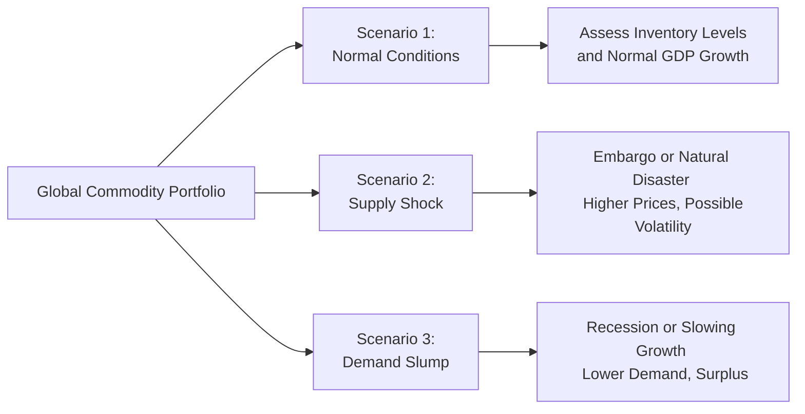

## Unique Supply and Demand Drivers Across Commodity Sectors

Let’s start with a bird’s-eye view of what sets different commodities apart in terms of supply and demand. Sometimes I like to think of commodities as personalities in a family: each one has its quirks. Energy commodities—think crude oil, natural gas, and refined products—often hinge on geopolitical relations (e.g., OPEC decisions), production technologies (e.g., shale drilling), and global consumption cycles. Metals—both precious (gold, silver) and industrial (copper, aluminum)—tend to reflect industrial demand, currency values, and sometimes good old-fashioned investor psychology. Meanwhile, “soft” commodities like wheat, cocoa, coffee, or orange juice might be all about weather patterns, crop diseases, and consumer trends.

A stark illustration is the 2020–2021 period, when global lockdowns slashed energy demand, causing oil prices to tumble in early 2020. However, metals demand surged when governments worldwide stepped up infrastructure spending and green-energy initiatives. Soft commodity prices sometimes look like they’re dancing to the beat of climate conditions—something as simple as a drought in Brazil’s coffee regions can send prices soaring.

Overall, it’s crucial to understand the unique rhythms and cyclicalities of each commodity sector:

• Energy: Susceptible to geopolitical shocks and OPEC production agreements.  
• Metals: Industrial usage for base metals; safe-haven or monetary usage for precious metals.  
• Soft commodities (agricultural): Hyper-sensitive to weather patterns, disease, and yield trends.

## Fundamental Analysis for Commodities

Fundamental analysis is often the anchor for forecasting. You might rely on inventory data, global consumption trends, or production technologies to make sense of price dynamics. Let’s say you’re analyzing crude oil. You’d track global inventories in major storage hubs like Cushing, Oklahoma (in the United States) or ARA (Amsterdam-Rotterdam-Antwerp) in Europe. You’d also evaluate how quickly shale producers in North America can ramp up supply whenever prices climb above their breakeven thresholds.

For metals such as copper, keep a close eye on construction and manufacturing activity in major consumer regions like China or the United States. A slump in real estate development can soften demand, leading to inventory buildups and downward pressure on prices. On the agricultural side, you’d review planting intentions, seasonal precipitation forecasts, and export data.

A fundamental approach typically includes the cost of production (are producers profitable at current prices?), combined with the expected demand from major consumers. Another factor is whether the commodity is in an expansion or contraction stage of its life cycle. Some commodities—like lithium—remain in an early growth stage as electric vehicle (EV) markets expand, while mature commodities might rely on more established consumption patterns.

## Roll Yield and Futures Markets

Some investors can’t—or don’t—hold physical commodities. Instead, they access commodity markets through futures contracts. In these cases, the concept of roll yield is super important. Roll yield refers to the gain or loss that occurs when an expiring futures contract is rolled into a new contract with a later expiration date.

If the market is in backwardation (where longer-dated futures trade cheaper than the spot price), your roll yield can be positive. Conversely, in contango (longer-dated futures more expensive than spot), rolling leads to a negative roll yield for a long futures position. Here is the simplified total return equation for a long-only futures position:

[
R_\text{total} = R_\text{spot} + \text{Roll Yield} + \text{Collateral Yield}
]

• Rᵣ₍ₛₚₒₜ₎ is the price change of the underlying commodity.  
• Roll Yield is the gain or loss from rolling near-expiry contracts to later maturities.  
• Collateral Yield references the return earned on the capital set aside as margin (often invested in T-bills).

Understanding this dynamic is pivotal when forecasting commodities, especially because the roll yield can either enhance or erode total returns in a major way. I’ve come across cases where a commodity’s spot price stays flat over six months, yet the futures-based investor loses out entirely due to steep contango.

## Seasonality in Commodities

Commodities can be more affected by seasonality than many other asset classes. A simple example is natural gas, where demand for heating in winter can send prices upward in cold regions. Agricultural commodities, too, often exhibit distinct price patterns tied to planting and harvesting schedules. Even precious metal demand for jewelry can have a seasonal bump around holidays in certain cultures.

Seasonality is sometimes overshadowed by major macro shocks, but it still resurfaces as a predictable cycle. Take the concept of a “weather market” in agriculture. An unexpected drought or flood during a key planting or harvesting window can shift sentiment on next year’s crop yields—and prices might respond quickly. When building a forecast model, it’s prudent to incorporate these cyclical fluctuations to identify periods with potential spikes or drops that others might miss.

## Macroeconomic Influence

A commodity’s appeal and price direction can also be swayed by big-picture factors such as:

• USD Exchange Rates: Commodities are usually priced in U.S. dollars. When the USD strengthens, commodities might become more expensive for foreign buyers, weakening demand. When the USD weakens, foreign buyers effectively see commodities “on sale,” which can support higher prices.  
• Interest Rates: Higher global interest rates can drive up the opportunity cost of holding commodities or stoke concerns about slower economic growth, both of which might reduce commodity demand.  
• Inflation Expectations: Commodities, particularly precious metals and real assets, often claim the spotlight as inflation hedges. If inflation is expected to rise, investors might allocate more to commodities, thus boosting prices.

I recall a manager who used to say, “Watch for that trifecta: the direction of the dollar, the shape of the yield curve, and what the inflation indicators are doing.” That trifecta can shift capital flows rapidly in or out of commodities.

## Real Assets and Their Role

Real assets are a broader category that includes commodities but also extends to physical or tangible investments such as:

• Precious Metals (e.g., gold, silver, platinum)  
• Infrastructure (roads, bridges, airports, utilities)  
• Farmland  
• Timberland

Each subset of real assets has its own sensitivity to economic cycles and inflation:

• Precious Metals: Often lauded for their potential “safe-haven” status or inflation hedge, while also serving an industrial role (especially silver and platinum).  
• Infrastructure: Typically structured to provide stable, long-term cash flows, frequently with inflation-linked revenue streams (e.g., regulated utility rates).  
• Farmland: Values and yields depend on global food demand and commodity prices for the crops grown on that land. Skilled operation is key—converting farmland to different crops can be expensive and time-consuming.  
• Timberland: Similar to farmland but with different seasonality and harvesting cycles. Trees can be “stored on the stump” if prices are temporarily unfavorable.

In one farmland investment due diligence I observed, the operational expertise—like deciding optimal planting cycles, advanced irrigation techniques, and crop rotation—was just as critical as the financial model. These are not hands-off investments. They require specialized knowledge, sometimes looking more like a business operation than a passive investment.

## Scenario Analysis and Stress Testing

Because commodities can be vulnerable to sudden supply disruptions—like a sudden embargo or a major hurricane wiping out Gulf Coast oil facilities—scenario analysis is crucial. We start by modeling a range of potential outcomes, from “normal” scenarios to extreme cases such as major geopolitical tensions cutting off supply lines or a global recession slashing demand for industrial metals.

Stress testing can help us evaluate how an overall portfolio might respond if oil prices double or if farmland yields slump due to a historic drought. Combining scenario analysis with your fundamental viewpoint can guide more robust capital allocation decisions and help avoid nasty surprises when real-world events diverge from baseline estimates.

Here’s an example of a simple scenario matrix in Mermaid.js:

## Best Practices, Pitfalls, and Strategies

It’s helpful to highlight some best practices and pitfalls:

• Best Practices:  
  • Thoroughly combine fundamental analysis (inventory, supply, demand) with macroeconomic context (interest rates, currency trends).  
  • Monitor roll yield carefully if investing through futures.  
  • Incorporate scenario analysis or stress testing.  
  • Consider seasonality in your forecasts.

• Common Pitfalls:  
  • Underestimating weather or geopolitical risk.  
  • Ignoring contango that erodes returns despite stable spot prices.  
  • Believing farmland or timberland is entirely passive—operational complexities can be substantial.

• Strategies to Overcome Issues:  
  • Diversify across multiple commodities or real-asset classes.  
  • Use hedging instruments to mitigate extreme volatility.  
  • Partner with operational experts if investing in farmland or infrastructure.

## Conclusion and Exam Tips

Forecasting commodities and real assets can feel a bit like trying to predict the weather—things change quickly, and you’re juggling multiple variables. But the essential ingredients are a strong understanding of supply/demand drivers, a handle on futures market mechanics (including roll yield), a sensitivity to seasonality, and an appreciation for macroeconomic forces. Real assets require a similar approach, but with a heavier dose of operational awareness. Remember that the CFA Level III exam might test your ability to integrate all these aspects.

When you see an item set or essay question about establishing or adjusting a commodity or real-asset exposure, keep these tips in mind:

• Show you know the unique drivers (geopolitics, weather, currency).  
• Reference roll yield or contango/backwardation if futures are involved.  
• Mention scenario analysis.  
• Look for signs of seasonality or macro factors.  
• Evaluate operational factors for real assets like farmland and infrastructure.  

By doing so, you’ll demonstrate a broad and practical skill set the examiners love.

## References

• Gorton, G., & Rouwenhorst, K. G. (2006). Facts and Fantasies about Commodity Futures. Financial Analysts Journal.  
• CFA Institute. (2025). CFA Program Curriculum, Level III – Commodities and Real Assets Readings.  
• Bodie, Z., Kane, A., & Marcus, A. (2017). Investments. McGraw-Hill.  

## Test Your Knowledge: Forecasting Commodity Markets and Real Assets



### When analyzing the supply side of crude oil markets, which of the following factors is typically most critical?

- [ ] Weather forecasts for major agricultural regions
- [x] Geopolitical decisions by OPEC
- [ ] Seasonal jewelry demand
- [ ] Housing starts data

> **Explanation:** OPEC production and policy decisions are key drivers of crude oil supply, making them vital factors for forecasting.

### Which of the following best describes backwardation in commodity futures markets?

- [ ] The spot price is lower than the future price
- [x] The future price is lower than the spot price
- [ ] There is no difference between spot and future prices
- [ ] Storage costs are irrelevant in pricing

> **Explanation:** Backwardation occurs when longer-dated futures contracts trade below the current spot price, potentially resulting in a positive roll yield for long positions.

### Which of the following best explains why an investor might experience negative roll yield?

- [x] The market is in contango
- [ ] The commodity’s spot price is rising
- [ ] There is an excess of demand
- [ ] OPEC has restricted production

> **Explanation:** In a contango market, longer-dated futures prices are higher than spot prices. Rolling futures positions forward in such a market typically results in negative roll yield.

### What is one major reason agricultural commodities exhibit strong seasonal price patterns?

- [ ] They are rarely consumed by humans
- [x] Production cycles depend on planting and harvesting times
- [ ] Agricultural sectors are immune to weather effects
- [ ] Farmers can store food indefinitely

> **Explanation:** Crops have specific planting and harvesting times, making their production—and thus prices—subject to seasonal fluctuations.

### Why might a stronger U.S. dollar reduce global demand for commodities?

- [x] Commodities become more expensive to foreign buyers
- [ ] It automatically reduces global GDP
- [x] Foreign investors may shift capital away from dollar-priced commodities
- [ ] The U.S. dollar has no influence on commodity prices

> **Explanation:** Commodities are usually priced in U.S. dollars. A stronger dollar means foreign buyers must spend more in their local currency to purchase the same amount of the commodity, potentially reducing demand.

### Which real asset is often characterized by long investment horizons and inflation-linked revenue streams?

- [x] Infrastructure
- [ ] Coffee futures
- [ ] Soft commodities
- [ ] Precious metals

> **Explanation:** Infrastructure investments—such as toll roads, utilities, and airports—often provide stable, inflation-linked revenues over long periods.

### Which of the following is the most direct advantage of stress testing within commodity portfolios?

- [x] Identifying potential losses during extreme market conditions
- [ ] Eliminating all risk of negative returns
- [x] Ensuring daily price stability of commodities
- [ ] Replacing fundamental analysis with scenario analysis

> **Explanation:** Stress testing helps investors estimate potential losses in extreme or unexpected events, guiding better risk management decisions.

### When forecasting commodity prices, what primarily distinguishes farmland investments from a purely financial commodity exposure?

- [x] Farmland requires operational expertise in crop management
- [ ] Farmland provides no sensitivity to global food demand
- [ ] Farmland has quick and easy entry/exit
- [ ] Farmland returns are fully uncorrelated with broader markets

> **Explanation:** Farming operations involve significant input costs, strategic crop decisions, and resource management that purely financial commodities (like a futures contract) do not.

### Which of the following factors is NOT typically relevant to forecasting soft (agricultural) commodities?

- [x] OPEC supply quota
- [ ] Weather-related supply disruptions
- [ ] Disease in crops or livestock
- [ ] Consumer consumption habits

> **Explanation:** OPEC controls oil production quotas, which generally do not influence agricultural commodity production or demand directly.

### For a long-only futures investor in a market with stable spot prices and steep contango, which statement is most accurate?

- [x] The investor may experience negative roll yield over time
- [ ] The investor gains from backwardation each time they roll
- [ ] The spot return is negative
- [ ] The collateral yield is always zero

> **Explanation:** With stable spot prices and steep contango, rolling to higher-priced contracts can produce negative roll yield, even if the underlying spot price is unchanged.


