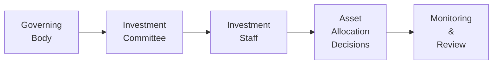

## Introduction and Context

Investment governance can be a bit of a dry topic—at least at first glance—but, oh boy, is it important. Think of governance as the guiding framework that clarifies who’s in charge, who’s making the decisions, and how those decisions fit into the bigger picture of an organization’s investment objectives. You can have the best financial models and data in the world, but if your governance is chaotic, good luck making consistent, prudent, and transparent asset allocation decisions.

Investment governance is about structure. It’s a set of policies and procedures guiding what you’re allowed (and not allowed) to do with the portfolio. Governance typically details the roles of oversight groups—think board of directors or trustees—and specialized committees—most commonly, the investment committee. Everyone involved in the investment process, from the CFO to the portfolio manager to the external consultants, needs to know who has authority to do what.

Governance is also about accountability and risk awareness. If you’re managing someone else’s money, you have a fiduciary responsibility to put their interests first. A strong governance framework helps ensure that there’s a consistent set of checks and balances so that personal bias, misaligned incentives, or even honest mistakes don’t stray too far from the client’s or institution’s best interest.

Keep in mind that robust investment governance doesn’t exist in a vacuum. It interacts directly with how you set your strategic and tactical asset allocations, which we’ll explore throughout the rest of Chapter 3. For instance, there’s a substantial difference between how a large pension fund's board sets broad directives on equity-versus-bond weightings and how an individual financial advisor might approach the same question for a private client. But in both situations, governance informs what’s acceptable and what decisions require more scrutiny. 

## Foundations of Effective Investment Governance

When we say “investment governance,” we’re really talking about a few key elements:

• Clear Mission and Objectives  
• Defined Roles and Responsibilities  
• Oversight Mechanisms and Compliance  
• Formal Policies and Procedures  
• Transparent and Accountable Decision-Making  

In a practical sense, a well-functioning governance framework might look like this:

• A board of trustees or directors, acting as the ultimate fiduciary, delegates certain responsibilities to an investment committee.  
• That committee sets broad policy guidelines—e.g., “No more than 60% exposure to equities,” or “We need to maintain a certain liquidity buffer for short-term obligations.”  
• An investment staff or external manager executes on those guidelines, making day-to-day portfolio decisions within pre-agreed risk limits.  
• Regular reporting on key performance and risk metrics is provided back to the investment committee, with scheduled reviews of whether the overall strategy remains aligned with the mission.  

Sure, it can be tempting to say, “We hired a smart portfolio manager. Let’s leave them to do their job.” But if there’s no oversight or accountability, you might find out later that the manager was taking on way too much risk to chase short-term gains. Or, maybe they were ignoring emerging markets because they dislike the volatility—potentially missing valuable diversification and return opportunities. Governance is the guardrail that keeps the investment process centered on the overall objectives and risk appetite.

### A Personal Reflection

I recall joining my first investment committee at a mid-sized endowment fund. I was so eager to dig into the data and models. But in the first few meetings, it became clear that the biggest debates weren’t about data or returns; they were about who had authority to do what. One trustee insisted on personally approving each trade, while our staff wanted autonomy to pivot quickly when market conditions changed. It was a little messy! Ultimately, we hammered out a well-documented governance process that clarified those approval thresholds. Suddenly, decisions became so much smoother—and, interestingly, less emotional. We had already decided at a high level what was within staff’s purview and what required full committee attention, so we could focus on the real work: how to best meet our long-term objectives.

## Key Components of Governance Structures

### Governing Body

At the top of the pyramid, you’ll often find a board of directors or trustees. These individuals are typically responsible for setting the overarching mission. This mission might include statements like “preserve real value in perpetuity” for an endowment, or “ensure that future liabilities can be paid” for a pension plan. The board will usually delegate day-to-day investment responsibilities but retains ultimate accountability for fulfilling fiduciary duties.

### Investment Committee

Slightly below the main board sits the investment committee, which is tasked with strategic decisions regarding the asset allocation policy. They’re often made up of individuals with expertise in finance, investing, or business—though expertise doesn’t always guarantee alignment with the portfolio’s mission, so a thorough oversight framework is crucial. The committee also sets performance benchmarks, risk tolerance levels, and guidelines for manager selection and retention.

### Investment Staff or External Manager

The staff (or an external manager) handles the more operational aspects—like picking securities, monitoring exposures, rebalancing, and executing trades. If the committee says “We want 50–60% in equities, with a tilt toward value stocks,” it’s the staff’s job to figure out which managers or securities best fulfill that mandate. There needs to be a system tracking compliance with these directives—both so the staff knows it’s staying within guardrails and so that the higher-level committees can see if the rules have been respected.

### Monitoring and Review

To close the loop, you need robust processes to monitor how effectively the portfolio is performing against stated objectives. Typically, this includes quarterly (if not monthly) performance reviews, risk measurement, compliance checks, and scenario-based stress testing. If performance lags or if the portfolio is misaligned with strategy, committees can decide whether to change managers, adjust allocations, or possibly revisit the entire governance structure.

Here’s a simplified visual representation of a governance framework:

Certainly, real-world structures can be more complex. Some might have multiple committees (e.g., a risk committee separate from the investment committee), or subcommittees that focus on specific asset classes like private equity or fixed income. The key remains that each layer has clearly defined responsibilities and accountability metrics.

## Aligning Governance with Asset Allocation

Why does all this matter for asset allocation? Because the portfolio’s strategic asset mix is essentially the expression of the organization’s risk and return objectives. A robust governance framework ensures:

• The asset mix actually reflects the mission and constraints.  
• There’s clarity on who can alter the allocation.  
• Periodic reviews will confirm or possibly revise the strategic asset allocation based on changes in market conditions, liquidity needs, or risk tolerance.  

If your institution has a bulletproof governance framework, you’ll probably see fewer knee-jerk reactions during market turmoil. With clear rules and guidelines, decisions to reallocate away from equities or to buy more real estate are typically subject to thorough discussion and must be approved by the appropriate authority. This prevents impulsive moves that might hamper long-term performance.

## Documentation and Transparency

We can’t talk about governance without talking about documentation. Ideally, you’ll have an investment policy statement (IPS) or some similarly named document that lays out all the foundational info:  

• Purpose of the portfolio  
• Return objectives and risk tolerance  
• Asset allocation targets and permissible ranges  
• Benchmark(s) for performance measurement  
• Governance structure, including responsibilities and decision-making authority  
• Policies for rebalancing, liquidity, and leverage  
• ESG or socially responsible investing constraints, if relevant  

From there, each major decision—especially big moves in asset allocation—should be thoroughly recorded and rationalized. Honestly, in practice, it can be easy to forget the “why” behind a decision once a year or two has passed. That’s why meticulous minutes, notes, and official memos are crucial. They allow you to look back and say, “We decided to overweight emerging market equities because of strong growth projections and attractive valuations at the time.” Or maybe, “We decided to reduce our real estate exposure because we anticipated higher interest rates might hurt property valuations.” This transparency helps everyone learn from both good and bad decisions.

## Mitigating Conflicts of Interest

Another huge plus of robust governance is conflict-of-interest mitigation. Conflicts can pop up in the realm of asset allocation—for example, maybe an investment staff member has a spouse working at a real estate development firm. Without a formal approval process, that staffer could push for a heavier real estate allocation that indirectly benefits that spouse’s employer. Strong governance puts checks in place to deal with such conflicts openly.

## Periodic Reviews and Audits

You might assume that once you’ve put a governance framework in place, you’re all set forever. Not so. Markets change, regulations evolve, and boards turn over. Periodic reviews—sometimes involving independent auditors or external consultants—are super helpful in spotting weaknesses or process gaps:

• Annual governance reviews to reaffirm or adjust the official investment policy statement  
• Audits of compliance with guidelines (e.g., verifying that actual allocations are within policy limits)  
• Performance benchmarks that are updated to reflect new asset classes or market realities  

These reviews aren’t just bureaucratic red tape; they’re your chance to make sure the structure actually works and that it’s still aligned with your broader objectives.

## Cultivating a Risk Awareness Culture

A big part of governance is culture. You might have excellent documentation, but if the board or staff don’t take risk seriously, you could be in trouble. A risk awareness culture means that everyone, from top to bottom, understands the portfolio’s risk profile and is willing to escalate issues if something feels off. That culture might involve monthly “risk deep dives,” informal check-ins with staff about emerging risks, or ensuring that each investment committee meeting includes a dedicated section on risk exposures.

When I worked at a foundation, we had a standing agenda item titled “Risk and Headaches.” Basically, staff had five minutes at the beginning of each meeting to describe what was keeping them up at night—rising default rates in high yield, or maybe some new regulatory scrutiny. It wasn’t always a big, formal thing, but it ensured that nobody was afraid to bring up potential problems.

## Practical Examples and Case Studies

Here are a few real-world-style scenarios that highlight how governance shapes asset allocation:

1. University Endowment: The board sets a mission to support the university “in perpetuity,” implying a focus on long-term real returns. The investment committee implements a diversified asset allocation (e.g., equities, private equity, property, bonds) with the idea that short-term volatility is acceptable in pursuit of higher long-term returns. The staff then chooses external managers to populate each asset class, monitoring them quarterly. A robust governance process ensures that the committee doesn’t overreact to short-term market downturns, because the IPS clearly states the endowment’s infinite time horizon.

2. Corporate Pension Plan: The plan sponsor’s board delegates to an investment committee with an explicit directive: “Primary goal is to fund liabilities at minimal risk.” Over many iterations, the committee develops a liability-driven investment (LDI) approach that emphasizes long-duration bonds that match liabilities. The staff regularly monitors interest-rate sensitivities, ensuring the portfolio remains matched to the liabilities. Governance ensures that every shift in bond allocation is consistent with offsetting liability risk.

3. Family Office: A wealthy family wants to preserve wealth across generations while maintaining liquidity for lifestyle expenses. Their governance framework might be less formal (since it’s basically a family), but they still benefit from defining who has authority to make investment decisions, how conflicts are managed, and what the long-term preservation goals are. The asset allocation might lean on stable dividend-paying equities and real assets, with a smaller allocation to more adventurous alternatives. Documentation and clarity help avoid family disputes—like Uncle Joe unilaterally dumping half the portfolio into crypto.

## Common Pitfalls and Strategies to Overcome Them

• Overly Complex Structures: Sometimes, organizations set up multiple layers of committees and subcommittees that lead to slow decision-making. Keeping the structure lean while preserving checks and balances is key.  
• Lack of Expertise: Boards or committees without sufficient financial knowledge can make shaky decisions. Pair them with experienced professionals or external advisors.  
• Poor Documentation: Even well-intentioned committees can lose track of “why decisions were made.” Keeping a consistent record fosters accountability and learning.  
• Ignoring Cultural Factors: If the broader culture doesn’t take risk management seriously, you can have all the policies in the world, but people will bypass them.  
• Conflicts of Interest: Undisclosed or under-managed conflicts degrade trust and can introduce bias in asset allocation. Have a formal conflict-of-interest policy in place.  

## Exam Relevance and Key Takeaways

At the CFA® Level III exam, you could see governance show up in both essay and item-set questions. Often, they’ll present a scenario where governance is either poorly structured or an organization is in the process of refining its investment policy. You may be asked to spot governance weaknesses in a case or explain how an enhanced governance process supports more consistent, mission-aligned asset allocation.

To nail these questions, focus on:

• Identifying roles and responsibilities.  
• Understanding how oversight ensures compliance with risk tolerance.  
• Explaining how a well-defined governance framework keeps the portfolio aligned with long-term objectives.  
• Demonstrating how conflict-of-interest policies and thorough documentation support fiduciary responsibilities.  

Remember, exam questions might weave governance issues into broader portfolio construction or risk discussions. They might say something like, “The board rarely meets, the CIO makes major decisions without consulting the investment committee, and there is no formal IPS.” That’s a classic sign of a broken governance system. The correct approach would be to highlight the need for a structured, well-documented decision-making pipeline.

## Final Thoughts and Practical Tips

Effective governance might feel a bit bureaucratic, but it’s what keeps multi-billion-dollar portfolios (and family portfolios alike) from going off track. By clarifying who makes decisions, documenting how and why those decisions are made, and reviewing everything periodically, you’re setting the stage for a disciplined, repeatable investment process. That discipline is invaluable in times of crisis, when emotions run high.

If I can leave you with one piece of advice, it’s this: Don’t underestimate the power of a strong, transparent governance framework. When markets are tanking, or there’s political or regulatory upheaval, you’ll really appreciate having a clear chain of command, well-delineated roles, and a culture that values risk awareness. It might not remove all stress (we’re dealing with money, after all!), but it sure can prevent panicked or misguided decisions that compromise long-term goals.

## References and Further Reading

• CFA Institute. “Asset Allocation and Governance.” CFA Program Curriculum.  
• Maginn, Tuttle, Pinto, and McLeavey. Managing Investment Portfolios: A Dynamic Process. CFA Institute Investment Series.  
• Swensen, David F. Pioneering Portfolio Management: An Unconventional Approach to Institutional Investment.  
• Clarke, Thomas & Branson, Douglas. The SAGE Handbook of Corporate Governance.  

--------------------------------------------------------------------------------------

## Test Your Knowledge: Investment Governance Essentials



### Which of the following best defines “investment governance?”

- [ ] A series of marketing tactics to attract new investors.
- [x] A set of legal, administrative, and process controls guiding how portfolio decisions are made and overseen.
- [ ] A benchmarking standard that allows investors to compare their performance to the S&P 500.
- [ ] A purely automated system that eliminates human discretion in investing.

> **Explanation:** Investment governance refers to the framework of rules, processes, and structures that ensures investment decisions align with the objectives and obligations of the entity.  

### Which entity is typically responsible for ultimate fiduciary oversight in a governance structure?

- [ ] The external fund manager.
- [ ] The risk committee.
- [x] The board of directors or trustees.
- [ ] The IT department.

> **Explanation:** The board or trustees usually holds ultimate fiduciary responsibility, even if daily responsibilities are delegated to committees or professional staff.

### How does a culture of risk awareness typically manifest in an investment governance framework?

- [x] Stakeholders throughout the organization regularly discuss potential risks and escalate issues as necessary.
- [ ] The staff intentionally avoids risk at all costs.
- [ ] Only the CEO is responsible for highlighting risk in investment decisions.
- [ ] Risk never factors into the decision-making process.

> **Explanation:** Grooming a risk-aware culture means every participant remains vigilant about risk exposures, and there are formal channels for elevating concerns.

### Which of the following best highlights the relationship between governance and asset allocation?

- [ ] Governance only covers administrative tasks while asset allocation is purely a financial decision.
- [ ] Governance slows down the investment process and harms allocation decisions.
- [x] Governance establishes the rules and authority under which asset allocation decisions are made, ensuring alignment with objectives.
- [ ] Whether governance exists or not has no impact on asset allocation.

> **Explanation:** Strong governance guides the objectives, approvals, and oversight of how assets are allocated, preventing misalignment with the mission or excessive risk-taking.

### An investment committee is established to oversee strategic decisions. Which statement is most accurate?

- [x] The investment committee sets policy guidelines and risk tolerance, while staff executes day-to-day decisions.
- [ ] The investment committee has no relationship with staff and does not guide day-to-day operations.
- [x] The investment committee only hires external managers; they don’t set strategic guidelines.
- [ ] The investment committee distributes performance bonuses to staff specifically based on the number of trades they execute.

> **Explanation:** The investment committee typically determines the strategic policy constraints and risk limits, leaving staff or external managers to implement them.

### When conflicts of interest arise within an investment governance structure, what is the best practice?

- [x] Disclose and appropriately manage or mitigate them, per a formal policy.
- [ ] Hide them to maintain trust.
- [ ] Let the board privately resolve them without formal procedures.
- [ ] Ignore them, since conflicts are inevitable in finance.

> **Explanation:** Best practice is transparent disclosure of conflicts, with procedures to manage or mitigate them consistently.

### Which of the following is a common pitfall in governance related to asset allocation?

- [x] Overreacting to short-term market fluctuations due to unclear decision-making authority. 
- [ ] Documenting all allocation decisions comprehensively.
- [ ] Conducting annual reviews of the strategic allocation policy.
- [ ] Monitoring performance against clear benchmarks.

> **Explanation:** A lack of clarity or well-defined roles can lead to knee-jerk responses that deviate from the long-term plan.

### Why is documentation essential in an investment governance framework?

- [x] It ensures decisions and rationales are recorded for accountability and learning.
- [ ] It deters regulators, because that’s their preference.
- [ ] It is required only if you want to hire an outside consultant.
- [ ] It’s purely optional, depending on staff preferences.

> **Explanation:** Proper documentation of policies, rationale, and decisions is crucial for transparency, oversight, compliance, and institutional memory.

### Periodic governance reviews or audits typically serve what purpose?

- [ ] To introduce more confusion in decision-making processes.
- [x] To evaluate the effectiveness of policies and identify areas needing adjustment.
- [ ] To replace the need for an investment committee.
- [ ] To determine new benchmarks without regard to prior performance.

> **Explanation:** These reviews help keep the governance framework up to date, detect compliance breaches, and ensure alignment with evolving objectives.

### True or False: A robust investment governance process can reduce the likelihood of short-term, emotionally driven asset allocation decisions.

- [x] True
- [ ] False

> **Explanation:** Good governance mandates a disciplined approach requiring defined approvals and rational analyses before any major change, thus reducing impulsive behavior.


