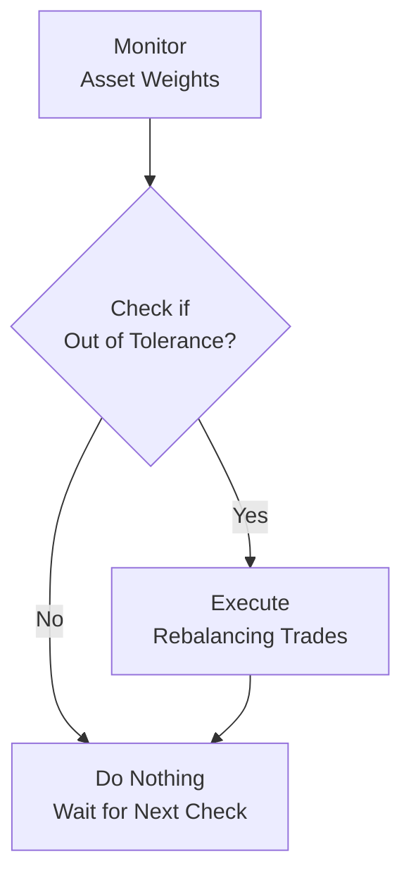

## Introduction

Rebalancing is one of those practices in portfolio management that folks sometimes underestimate. You know, it might not get the same buzz as picking the next unicorn stock or reading the markets’ tea leaves, but it really matters for controlling risk. Picture this: If you don’t rebalance, your equity positions could drift way beyond your intended risk level in a bull market—and that’s not so fun once volatility returns. A disciplined rebalancing approach makes sure your portfolio aligns to the risk-return profile you intended, even when life (or the markets) get complicated.

In this article, we’ll explore the key elements of strategic rebalancing. We’ll look at common rebalancing methods, how to weigh the costs against the benefits, the role of taxes, how to cleverly use cash flows, the psychological boosts of regular rebalancing, and the slightly nuanced rebalancing considerations for liability-relative and goals-based portfolios. Finally, we’ll go through some best practices and tips for navigating the CFA® exam—and the real world.

## Purpose of Rebalancing

Let’s begin with why rebalancing even exists. If you remember from your earlier studies (like in asset-only or factor-based approaches), each asset class in a portfolio is assigned a target weight. For example, maybe you have 60% in equities, 30% in fixed income, and 10% in real estate. Over time, asset prices change at different speeds, so your portfolio will drift from this ideal mix. Equities might grow faster than expected, or you might experience negative shifts in fixed income (especially if rates rise).

Rebalancing is making sure you’re steering the ship back to your intended course. Here are a few core reasons:

• Risk Control: If your equity stake grows from 60% to 75% during a bullish phase, then you’re holding a riskier portfolio than planned. Rebalancing ensures your overall portfolio volatility doesn’t exceed the level you’re comfortable with.

• Return Enhancement: Some practitioners argue that a disciplined rebalancing policy can even boost returns, because it enforces a contrarian practice—selling what’s “high” and buying what’s “low.”

• Behavioral Discipline: Let’s be real, it’s tough not to get swept up in market euphoria. A good rebalancing policy keeps you from impulsive decisions, reminding you to stick to your plan.

## Rebalancing Methods

Generally, there are two main ways to handle rebalancing: threshold-based (also called band rebalancing) and calendar-based. Let’s break those down:

### Threshold-Based (Band Rebalancing)

This method says, “We’ll watch the portfolio’s asset weights regularly, and if they deviate from the target by a certain percentage, we’ll rebalance.” For example, if your policy states a ±5% corridor for equities (i.e., 60% ± 5%), then if the equity portion hits 65% or higher (or 55% or lower), you’d automatically rebalance it back to 60%.

Benefits:
• Keeps your portfolio near its desired mix.  
• May reduce tail events because you’re adjusting as soon as a band is exceeded.

Challenges:
• Frequent monitoring can be time-consuming (or cost-consuming).  
• Smaller deviations might persist without triggers, so you might have slight, ongoing drifts within the band.

### Calendar-Based

Calendar-based rebalancing is simpler to implement—rebalancing at set intervals, such as quarterly, semi-annually, or annually. You ignore the small daily or weekly fluctuations, but on that predetermined date, you reset your allocations to the targets.

Benefits:
• Operational simplicity—easier to manage and automate.  
• Doesn’t require constant watchfulness or complex triggers.

Challenges:
• The portfolio can drift significantly between rebalancing dates.  
• You may rebalance at an inopportune time (e.g., right after a sharp market decline), realizing losses you might have avoided had you simply waited.

## Cost–Benefit Analysis of Rebalancing

Rebalancing is never free. There are trading costs (commissions, bid-ask spreads, market impact), and for taxable accounts, there can be capital gains taxes. Plus, rebalancing can soak up your time and resources (staff time, compliance oversight, etc.). So, how do we weigh these costs against benefits?

One approach is like a break-even analysis. You say, “How much do I have to pay in rebalancing costs, and how does that compare to the potential incremental risk reduction or even performance improvement?” There’s no single formula that works for everyone. But typically:

• More frequent rebalancing = tighter risk control but higher total transaction costs.  
• Less frequent rebalancing = looser risk control but lower transaction costs.

Investors often choose a hybrid approach—checking monthly or quarterly for threshold breaches, then rebalancing only when things get out of line. This can help keep transaction costs down without letting the portfolio drift too far.

## Tax Efficiency in Rebalancing

In taxable accounts, rebalancing can create immediate tax liabilities because you’re forced to sell positions that have appreciated. Let’s say your equities soared, and you need to trim those holdings. That triggers realized capital gains. Well, that can be painful for an individual investor’s tax bill—especially if it’s short-term capital gains.

### Tax-Loss Harvesting

Tax-loss harvesting is a strategy to soften the blow. In simplified terms, you:

• Identify positions that have dropped in value.  
• Sell them to realize capital losses (which can offset your realized gains).  
• Potentially buy a similar—but not “substantially identical”—security.  

This keeps your portfolio exposed to similar market factors while creating a realized loss for tax benefits. Of course, watch out for issues like the wash-sale rule in certain tax jurisdictions. (In the real exam context, you might see a scenario-based question about how to optimize the timing or asset selection for rebalancing under different tax regimes.)

### Delaying Rebalancing

Some investors might even choose to delay rebalancing or do partial rebalancing to avoid large realized gains. While this isn’t always recommended from a pure risk-control standpoint, it does show how tax motives can alter rebalancing decisions. As the CFA Program emphasizes, it’s always a trade-off between your after-tax performance objective and your risk target.

## Using Cash Flows to Rebalance

A powerful trick is using new cash inflows or outflows to rebalance. For instance, pension plans often receive regular contributions. Let’s say your fixed-income portion is below target. Instead of selling equities to buy bonds, you can just deploy the new cash contributions into fixed income. This approach can save you from incurring big trading costs.

Alternatively, if your portfolio has outflows—like an endowment or foundation paying out a portion to fund operations—those outflows can be sourced from the over-weighted asset class. This is a neat way to keep the portfolio near the strategic targets with minimal friction.

## Behavioral Benefits of a Disciplined Rebalancing Policy

One friend of mine (let’s call him Chris) was always trying to chase winners—he’d buy more of what had recently spiked and offload what had been lagging. It’s a very human instinct. Unfortunately, that can lead to buying high and selling low. A well-defined rebalancing approach helps short-circuit that emotional behavior:

• It forces you to sell some of the “winners” and buy some of the “losers.”  
• It reduces “analysis paralysis” when markets become choppy.  
• It sets a standard rule so that you can focus on other important aspects of portfolio management instead of reacting to daily market swings.

## Liability-Relative and Goals-Based Portfolios

Rebalancing can get more nuanced if you’re managing a liability-relative portfolio—like a pension plan where the main goal is to ensure assets are sufficient to meet liabilities. Or in a goals-based framework, you might have different “buckets” allocated to different life goals (short-term liquidity, retirement, college funding, etc.).

In liability-relative approaches, the target asset allocation is typically linked to the behavior of the liabilities (e.g., you might allocate more to long-duration bonds if your liabilities are interest-rate sensitive). In that setup, you might also track a “surplus” (assets minus liabilities). The rebalancing policy might revolve around keeping that surplus within a certain band—rather than focusing solely on raw asset class weights.

In a goals-based approach, each goal might have a specified risk tolerance and time horizon, so you’d rebalance each “goal bucket” to ensure it remains on track. For example, your retirement bucket might be more growth-oriented and thus rebalanced less frequently, while your short-term emergency fund is conservatively allocated and rebalanced more tightly.

## Implementation Best Practices

Below are some practical tips for building a rebalancing strategy that handles real-world constraints:

• Specify a Rebalancing Policy in Your IPS (Investment Policy Statement): This includes your target weights, rebalancing triggers (threshold and/or calendar frequency), and how you handle exceptions.  
• Consider the Total Transaction Cost: That includes not just commissions but also market impact, taxes, and administrative overhead.  
• Use Offsetting Trades: If you’re over target in U.S. equities and under target in emerging market equities, see if you can directly swap them. This might reduce transaction and spread costs.  
• Exploit Cash Flows When Possible: As mentioned earlier, direct new capital or outflows to correct imbalances.  
• Monitor Market Conditions—But Don’t Overreact: Some rebalancing approaches allow “flex bands” that widen during periods of high market volatility, preventing you from trading at times of extreme stress.  
• Integrate Tax Management Tools: If you’re dealing with multiple accounts, keep track of each account’s tax situation. For instance, you might prefer to rebalance in a tax-exempt account (like some retirement vehicles) first.

## Simple Example of Threshold Rebalancing

Let’s do a short, hypothetical example:

• You start with a portfolio of $1,000,000. The target is 60% equity ($600,000) and 40% bonds ($400,000).  
• After some bullish run in equities, the portfolio is now worth $1,150,000, with $750,000 in equity and $400,000 in bonds. So your equity is at about 65.2% and your bonds are around 34.8%.  
• Let’s assume your threshold policy says you must rebalance whenever equity exceeds 65%. That trigger just happened, so you’d sell $57,500 in equity to bring equities down to 60% of $1,150,000 (which is $690,000). You’d use that $57,500 to buy bonds.  
• After rebalancing, you’re back to 60% equity ($690,000) and 40% bonds ($460,000).

With threshold-based rebalancing, you minimize drift. However, all that selling of equities might have triggered capital gains if you’re in a taxable account. So, you’d weigh that cost against your preference to control risk.

## Visualizing Rebalancing

Below is a simple Mermaid diagram illustrating a threshold-based approach. Think of it as a high-level loop:

• Step A: You observe your current asset weights (e.g., check weekly or monthly).  
• Step B: You compare those weights to your threshold bands (like ±5%).  
• Step C: If the deviation exceeds the threshold, proceed with rebalancing.  
• Step D: If not, keep the current allocation until the next review.

## Common Pitfalls and How to Avoid Them

• Overtrading: Some investors get too aggressive, rebalancing at the slightest drift. This racks up costs.  
• Ignoring Taxes: Doing a big rebalancing trade without considering capital gains can tank your after-tax returns. Try to harvest losses or partially rebalance in tax-deferred accounts.  
• Setting Too Small or Too Large Thresholds: A ±1% threshold might be overkill (you’ll be trading every week!), whereas a ±10% threshold might let the portfolio get dangerously out of whack.  
• Failing to Update Policy: Maybe your risk tolerance or personal circumstances changed. However, you never revised your rebalancing rules. That gap can set you up for surprise outcomes.

## Exam and Real-World Tips

For the CFA® exam, you’ll often see scenario-based questions about rebalancing. Read carefully for hints about:
• Client’s tax status.  
• Frequency of contributions or withdrawals.  
• Tolerance of tracking error or portfolio drift.  
• The existence of short-term or long-term liabilities.  

Regarding open-ended “constructive response” (essay) questions, be sure to highlight the trade-offs: “Rebalancing more frequently results in higher costs but maintains target allocations more precisely.” Always tie back to the client’s objectives, constraints, risk tolerance, and time horizon. For item-set (multiple-choice) questions, watch for details about thresholds, transaction costs, or possible pitfalls (like ignoring tax consequences).

In real life, it’s about discipline and nuance. You want a process that’s robust but not so rigid it blindly forces you to shoot yourself in the foot with excessive taxes or trading costs. And, of course, keep your Investment Policy Statement updated as conditions change.

## References and Further Reading

• Masters, Seth. “Strategic Rebalancing: A Tactical Weapon?” Journal of Portfolio Management.  
• CFA Institute, “Rebalancing Strategies” in the CFA Program Curriculum.  
• Berkin, Andrew L., and Luke, Jia Ye. “A Tax-Aware Approach to Rebalancing,” Financial Analysts Journal.  

These resources offer deeper insights, additional case studies, and more advanced quantitative approaches if you want to boost your rebalancing expertise.

---

## Test Your Knowledge: Strategic Rebalancing Methods and Best Practices



### Which of the following is a primary benefit of a disciplined rebalancing policy?

- [ ] It guarantees higher returns than a buy-and-hold strategy under all market conditions.
- [x] It helps control the portfolio’s overall risk by maintaining target asset weights.
- [ ] It eliminates all transaction costs for the portfolio.
- [ ] It automatically identifies the best-performing assets to hold over the long term.

> **Explanation:** Maintaining target weights through rebalancing helps limit unwanted risk drift in the portfolio. It does not guarantee superior absolute returns in all markets. Nor does it eliminate transaction costs.

### A major difference between threshold-based and calendar-based rebalancing is:

- [ ] Threshold-based rebalancing never incurs taxes, while calendar-based always incurs taxes.
- [ ] Threshold-based rebalancing is cheaper than calendar-based in all markets.
- [x] Threshold-based triggers trades when allocations deviate beyond certain bands, whereas calendar-based rebalances at set intervals.
- [ ] Calendar-based rebalancing cannot be applied to portfolios with more than three asset classes.

> **Explanation:** Threshold (or band) rebalancing depends on deviations from target weights, while calendar-based occurs at fixed intervals, regardless of drift amount.

### In a taxable portfolio, realizing large capital gains due to rebalancing can often be mitigated by:

- [ ] Using leverage to increase allocation to underweight asset classes.
- [x] Employing tax-loss harvesting strategies.
- [ ] Conducting intraday trades only.
- [ ] Completely avoiding rebalancing until retirement.

> **Explanation:** Tax-loss harvesting helps offset realized capital gains by generating losses in other securities. Leverage and intraday trading do not inherently mitigate capital gains. Avoiding rebalancing until retirement ignites other risk-control challenges.

### Which of the following best describes how liability-relative rebalancing differs from asset-only rebalancing?

- [ ] Liability-relative rebalancing always ignores bond allocations.
- [x] Liability-relative rebalancing focuses on maintaining acceptable surplus levels relative to liabilities.
- [ ] In liability-relative rebalancing, equities are never sold.
- [ ] Asset allocations are indifferent to the presence of liabilities in liability-relative approaches.

> **Explanation:** Liability-relative portfolios center around the difference between assets and liabilities. They adjust asset allocations to keep that surplus (or deficit) within tolerable boundaries.

### What is a key advantage of using new cash contributions to rebalance a portfolio?

- [x] It can minimize transaction costs since fewer assets need to be sold to fund rebalancing.
- [ ] It increases the frequency of capital gains recognition.
- [x] It potentially redeploys fresh capital to underweight asset classes directly.
- [ ] It creates more administrative tasks due to multiple trades.

> **Explanation:** Using new cash flows can reduce the need to sell existing assets to rebalance. It not only cuts transaction costs but also aligns new contributions with underweight components.

### One major drawback of rebalancing too frequently is:

- [x] Excessive transaction costs that can erode returns.
- [ ] Inability to maintain target allocations effectively.
- [ ] Permanent elimination of risk from the portfolio.
- [ ] The strategy is illegal under most global regulations.

> **Explanation:** Although frequent rebalancing keeps allocations close to targets, it can generate high transaction costs and potentially higher tax impacts.

### An investor notices that their equity allocation is at 66%, above their 60% target with a ±5% band. Under a band rebalancing approach, they would typically:

- [x] Rebalance equities back to the 60% target.
- [ ] Rebalance when equity hits exactly 70%.  
- [x] Possibly execute additional allocation changes if other asset classes need rebalancing.
- [ ] Ignore it until the next quarter’s end rebalancing date.

> **Explanation:** Once the band is exceeded (in this case, 65%), the policy usually calls for rebalancing back to the target weight. The investor may also rebalance other assets if they are out of range.

### A good rebalancing policy is likely to include:

- [x] Defined thresholds or intervals for rebalancing.
- [ ] A requirement to always buy the highest-performing stocks in the market.
- [ ] A ban on selling any asset that has appreciated.
- [ ] A guarantee of zero taxes across all transactions.

> **Explanation:** A policy typically includes rules about when to rebalance. None of the other choices make sense in practical or theoretical terms.

### When a portfolio manager chooses to delay rebalancing to reduce tax burdens, what is the main risk they are accepting?

- [x] Potentially higher portfolio volatility due to asset class drift.
- [ ] Guaranteed outperformance in the winning asset classes.
- [ ] Complete immunity from capital gains taxes at a later date.
- [ ] An overall reduction in total transaction costs and no other consequences.

> **Explanation:** Delaying rebalancing lowers immediate taxes but increases the chance that the portfolio drifts from the target and experiences higher volatility.

### True or False: Rebalancing is equally effective for both tax-exempt and taxable investors in terms of after-tax returns.

- [x] True
- [ ] False

> **Explanation:** While the mechanics of rebalancing are the same, tax-exempt investors do not face capital gains taxes. However, from a risk-control perspective, rebalancing remains equally effective in both scenarios for maintaining target allocations.


