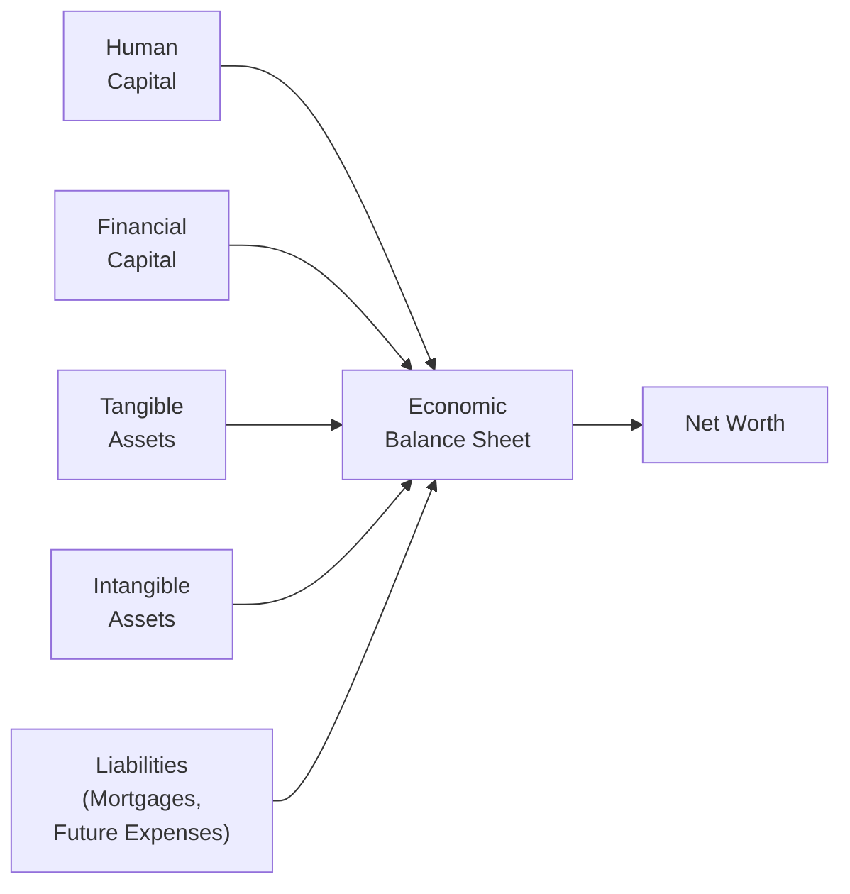

Introduction  
When we think of a “balance sheet,” we usually picture a list of financial assets—like cash, stocks, bonds—and against these, financial liabilities such as loans or credit card debt. That’s all good, but the reality is, well, a little more nuanced. Have you ever considered your own job security, your future salary growth, or even your brand’s reputation if you’re a business owner? Those intangible considerations might not appear on the traditional balance sheet, but they absolutely matter for your overall net worth and risk profile. And ignoring them is sort of like forgetting to bring your map and compass while hiking in unfamiliar terrain!

Let’s take a deeper look at “Formulating the Economic Balance Sheet,” a concept that extends beyond the standard financial statements taught in accounting courses. If you’re preparing for the CFA Level III exam, understanding this expanded and more holistic perspective can really reshape how you think about asset allocation, risk management, and everything in between. It also happens to be a crucial building block for strategic portfolio decisions that reflect the real-world interplay between personal or institutional circumstances and the capital markets.  

Understanding the “Economic” in Economic Balance Sheet  
The core idea is straightforward: a conventional balance sheet doesn’t capture the entire picture of one’s economic reality. For instance, a 35-year-old mid-career professional might have student loan debt and only a modest investment portfolio. Based on traditional metrics, that might look unimpressive. But—oh!—they also have decades of rising salary potential and a deep reservoir of skills that should continue to appreciate over time. In economic terms, that’s “human capital.” It’s an asset, albeit intangible, that should influence how we design an investment policy and select the portfolio’s asset allocation.

Similarly, an institution like a pension fund has the usual suspects in assets—bonds, equities, alternative investments—but it also has to consider future liabilities such as retiree benefit payouts. And if the pension fund is sponsored by a company, the sponsor’s corporate financial health forms part of the broader reality. A big downturn in the sponsor’s primary industry, for instance, might render the sponsor less able to make contributions. So, the concept of the economic balance sheet is about weaving all these interconnected threads—tangible and intangible—into a single, overarching view of net worth and risk exposure.

Key Components of the Economic Balance Sheet  

Human Capital  
For individuals, this is the present value of expected future earnings. Formally, we can think of it like:

 \text{Human Capital at time } t = \sum_{n=1}^{R} \frac{E(Y_n)}{(1 + r)^n}, 

where E(Yₙ) is expected labor income in year n, R is the number of years to retirement (or to the end of the working horizon), and r is the discount rate that reflects the riskiness of future income.  

For institutions, “human capital” can indirectly represent the quality of staff, brand reputation, or intangible knowledge base. Though you can’t precisely measure these items on a standard financial statement, they still contribute significantly to future economic performance.

Future Liabilities  
Think of everything that might “pull out” resources from your portfolio in the future. For individuals, this could be a mortgage, college tuition for children, or a projected stream of living expenses in retirement. For institutions, liabilities include pension or insurance payouts, operational costs, or debt obligations. The better you quantify these, the more accurate your economic balance sheet becomes.

Financial Assets  
No surprise here—these are your straightforward investment holdings, including equities, bonds, cash, real estate, derivatives, and so on. On typical balance sheets, these appear front and center. In an economic balance sheet, they remain crucial but form just one part of a larger mosaic.

Intangible Assets  
Personal intangible assets include your personal brand, potential future inheritances, health status (surprisingly important for future earnings), and more. Institutional intangible assets comprise corporate brand equity, intellectual property rights, or regulatory permits and licenses that confer future economic benefits. While intangible assets are often excluded from conventional accounting statements (under IFRS or US GAAP, you’d see pretty strict rules about intangible recognition), they are recognized in the economic balance sheet for portfolio planning and broader risk assessment.

Below is a simple Mermaid.js diagram illustrating a conceptual economic balance sheet:

In this diagram, “Net Worth” emerges from the total synergy of all asset components minus liabilities, even if many of those assets aren’t officially “accounted for” in traditional statements.

Why the Economic Balance Sheet Matters for Asset Allocation  
When you consider everything on your personal or organizational horizon—both financial and non-financial—the insights for asset allocation can be pretty illuminating. Imagine two individuals of the same age. One is a tenured professor, drawing a stable salary, effectively guaranteeing a form of “bond-like” income stream. The other is a tech startup entrepreneur, with a variable “stock-like” income stream that might skyrocket in a successful IPO or vanish upon a product flop. Even if these two individuals have the same dollar value of stocks and bonds in their portfolio, their “economic balance sheets” are entirely different.

• The professor: Because of stable human capital, he may comfortably tolerate higher equity risk in his investment plan. His steady labor income acts like a buffer, letting him weather market downturns without needing to sell assets at an inopportune time.  
• The entrepreneur: With an income stream that is already correlated to the equity and venture capital space, loading up on more high-risk stocks in the portfolio might be tantamount to doubling down. This person might want more fixed income or alternative assets that diversify away from the risk of her business ventures.

This framing is indispensable for institutional investors too. Pension funds with “bond-like” obligations to retirees usually prefer matching those liabilities—at least partly—with fixed-income instruments. Insurance companies, likewise, have to account for potential policyholder claims (which can spike if there’s an unexpected event or economic crisis), influencing how they invest to ensure liquidity and stability.

Scenario Analysis and Correlation Effects  
Now, one of the best perks of formulating an economic balance sheet is that it sets the stage for robust scenario analysis. In the earlier chapters (for instance, see Section 1.3 on exogenous shocks and Section 1.5 on major approaches to economic forecasting), we discussed how shifting interest rates, inflation trends, or geopolitical upheavals might affect the economy. Those shocks can ripple across your intangible assets, your job market prospects, your liabilities, and—of course—your financial portfolio.  

• Interest Rates: If you lock in a long-term mortgage at a fixed rate, increasing interest rates won’t affect that liability. But if your human capital is tied to an industry that’s sensitive to interest rates (like housing construction), your future earning potential may be at risk.  
• Inflation: Rising inflation can reduce the real value of your bonds. Meanwhile, real estate might offer partial protection, and your salary might adjust upward (if your labor market sets wages in line with inflation). Viewing these moves “holistically” helps identify whether your overall net worth is actually protected or dangerously exposed.  
• Personal Life Events: Getting married, having children, or incurring healthcare expenses can significantly shift your liability profile. It’s wise to incorporate these personal changes into your economic balance sheet and adjust your asset allocation accordingly.

And about correlation effects: maybe your job is in the auto sector, which tends to rise and fall with the business cycle, and your company stock plan is heavily tied to auto stocks. If your personal portfolio also has a large chunk of auto or manufacturing equities, then you’re effectively “doubling or tripling down” on the same risk factor. The solution might be to diversify your portfolio toward sectors uncorrelated to your job, or to hold more fixed income to stabilize your overall position.

Implications for Institutions  
Pension funds, insurance companies, and even large endowments frequently rely on an expanded notion of their economic balance sheets to better match assets to liabilities. Take a defined-benefit pension plan:  
• Liabilities: The present value of forecasted pension payouts. These are often bond-like but can be complicated by factors such as the longevity of retirees, inflation adjustments to payouts, and changes in discount rates.  
• Assets: Typically a portfolio that mixes equities, bonds, and alternative assets. The ongoing debate is how best to hedge interest rate and inflation risk while also generating enough return to meet obligations.  
• Corporate Sponsor Health: If the sponsor’s industry is under strain, they might not fund the plan adequately. In that scenario, the pension fund might adopt an even more conservative asset allocation, cutting reliance on sponsor contributions.

Insurance companies similarly factor in “technical reserves” for policyholder claims and maintain capital to abide by regulatory requirements. If the insurer’s future liabilities are quite interest-rate sensitive (e.g., guaranteed policies), it might hold more duration-matched bonds in its investment portfolio than a typical corporate entity would.

Updating the Economic Balance Sheet Over Time  
One of my big “aha” moments, personally, was realizing that the economic balance sheet isn’t carved in stone. It’s a living, breathing construct reflecting changes across your entire lifecycle or, for institutions, the evolution of corporate objectives and obligations. For individuals, job transitions, salary progression, or even new personal goals—like buying a vacation home—should prompt an updated look at whether your asset allocation makes sense.  

For institutions, changes in regulatory capital standards (like an insurer’s shift in required solvency ratios) or new legislation that affects pension liabilities (like adjustments to the mandated discount rate) can reshape the risk profile. The best practice: set a reminder to review your economic balance sheet annually or semi-annually. Also, re-check it whenever a big life event or market shock happens.

Bringing It All Together with a Simple Case Study  
Consider a mid-career individual named Laura. She is 45, well-paid in a relatively stable industry (healthcare administration), and has about $400,000 in her traditional investment accounts split 60% equities and 40% bonds. She also has a mortgage, an education savings plan for her child, and a future inheritance from her parents. From a standard balance-sheet point of view, you’d see something like:

• Assets: $240,000 in equities, $160,000 in bonds, and a home valued at $300,000 (with $100,000 left on the mortgage).  
• Liabilities: The $100,000 mortgage, and that’s basically it.  

But the economic balance sheet would go further: it incorporates the present value of her expected future income (perhaps $700,000 in “bond-like” human capital, given the stability of the sector), the intangible potential of an inheritance (which might be $200,000), and her longer-term living expenses that aren’t all captured in the immediate mortgage. Additionally, it might note an intangible but important “brand or network capital” if she’s well-connected in her field, enabling her to pivot to higher-paying positions with relative ease.

The upshot for asset allocation: factoring in her stable “bond-like” human capital might argue for holding slightly more equities in her financial portfolio (perhaps shifting to 70% equities, 30% bonds) because the risk of job loss is comparatively low. She may also decide to hold less credit risk within her bond allocation because her inheritance expectation (though uncertain in timing) somewhat boosts her financial resilience. 

Practical Exam Tips  
• Calculation Nuances: If a CFA Level III exam question asks you to incorporate human capital into a portfolio recommendation, be sure to treat it as an asset with its own risk and return properties.  
• Linking to Risk Tolerance: The more stable your intangible assets (like tenured teaching positions or stable sponsor support for a pension), the higher your capacity to bear portfolio risk.  
• Stress Testing: Don’t forget scenario analysis, especially if the intangible asset has a high correlation with equity markets or interest rates.  
• Time Horizon: Human capital is higher when you’re younger, ironically boosting your risk capacity. But as you approach retirement, future income streams decline, shifting your overall balance sheet to rely more on financial capital.  
• Straightforward Rebalancing: Changes in personal or institutional circumstances (like shifting business conditions, new regulatory requirements, or personal events such as a new marriage or child) should prompt a re-examination of your total asset allocation.  
• Common Pitfalls: Overlooking indirect correlations is a frequent pitfall—like ignoring that your job, company stock, and personal investment portfolio might be heavily correlated to the same industry cycle.  

References  
• Campbell, John Y., and Luis M. Viceira, Strategic Asset Allocation: Portfolio Choice for Long-Term Investors.  
• Bodie, Zvi, Detemple, Jerome, Otruba, Stefan, and Walter, Paul, “Optimal Consumption-Portfolio Choices and Retirement Planning.”  
• CFA Institute, “Private Wealth Management” readings in the CFA Program Curriculum.  

Below, we present a brief quiz to help you test your knowledge of the Economic Balance Sheet concept and its implications, as covered in this section.

## Test Your Knowledge of the Economic Balance Sheet



### Which best describes an economic balance sheet compared to a conventional balance sheet?

- [ ] It includes only the marketable securities held in a portfolio.  
- [x] It incorporates both financial and non-financial (intangible) assets and liabilities.  
- [ ] It excludes “human capital” because it is unquantifiable.  
- [ ] It applies only to institutions, not individuals.  

> **Explanation:** The economic balance sheet extends beyond standard accounting assets to include factors such as human capital, brand, pension entitlements, future expenses, etc.

### Which of the following intangible items is most typically considered part of an individual’s economic balance sheet?

- [x] Personal human capital in the form of expected future labor earnings  
- [ ] Day-to-day checking account balance  
- [ ] Outstanding credit card debt  
- [ ] Dividends from a publicly traded REIT  

> **Explanation:** Human capital is the present value of future labor income, which is precisely what the economic balance sheet attempts to capture beyond standard financial assets and liabilities.

### How might stable human capital, akin to a “bond-like” income stream, affect an individual’s asset allocation decisions?

- [x] It generally increases one’s willingness to accept more equity risk.  
- [ ] It prompts a greater reliance on fixed-income assets.  
- [ ] It forces a reduction in overall portfolio risk—all else remaining constant.  
- [ ] It has no effect on investment decisions.  

> **Explanation:** A stable, bond-like human capital source can allow an individual to take on a higher proportion of equities, because the stable cash flow from employment can offset some market risk.

### In an economic balance sheet for a defined-benefit pension fund, which of the following is most important to factor beyond the standard asset and liability view?

- [ ] Only the on-balance-sheet assets that are recognized under GAAP  
- [ ] The brand equity of any company in which the pension invests  
- [x] The sponsor’s financial health and any correlated business risks  
- [ ] The personal savings of employees covered by the plan  

> **Explanation:** For a defined-benefit pension fund, the health and longevity of the sponsor are crucial. A financially weak sponsor might not make future contributions or may alter the funding strategy, so that risk belongs in the economic balance sheet.

### When performing scenario analysis on an economic balance sheet, which factor is least likely to matter?

- [ ] Interest rate changes  
- [ ] Future personal expenses  
- [ ] Inflation trends  
- [x] Historical financial statement footnotes from 20 years ago  

> **Explanation:** Scenario analysis focuses on how potential future states of the world will affect assets and liabilities. Old footnotes from decades ago are less relevant than forward-looking factors.

### In the context of the economic balance sheet, an entrepreneur whose human capital is already highly correlated to equity market risk might logically do which of the following?

- [x] Maintain a higher allocation to fixed-income assets for diversification  
- [ ] Double down on equities to potentially maximize returns  
- [ ] Convert uncorrelated debt assets into equity positions  
- [ ] Completely eliminate risk assets  

> **Explanation:** An entrepreneur’s future earnings might already behave like equity, so diversifying with more fixed-income reduces overall portfolio volatility and can improve risk-adjusted returns.

### Over time, the economic balance sheet must be updated to reflect changes in:

- [x] Human capital, liabilities, and shifting personal or market conditions  
- [ ] Only regulatory accounting rules  
- [ ] Only the portfolio’s aggregate value  
- [ ] None of the above—once set, the economic balance sheet stays constant  

> **Explanation:** It’s crucial to update the economic balance sheet to capture new job prospects, changes in personal or corporate obligations, shifts in market interest rates, and other evolving factors.

### How does economic balance sheet thinking enhance strategic asset allocation?

- [ ] It discourages rebalancing and portfolio adjustments.  
- [x] It factors in non-traditional assets and liabilities to tailor risk exposures more accurately.  
- [ ] It replicates traditional portfolio strategies automatically.  
- [ ] It is purely theoretical and lacks practical application.  

> **Explanation:** By including intangible assets, liabilities, and correlations in the total view, the final portfolio strategy can be more closely aligned with real-world risk exposures.

### Why would pension plan liabilities often be considered “bond-like” in economic balance sheet terms?

- [ ] Because pension liabilities are always inflation-protected.  
- [ ] Because plan participants cannot outlive their benefits.  
- [x] Because they represent predictable future cash flows with sensitivity to interest rates.  
- [ ] Because participants are guaranteed a lump sum equal to the plan’s net asset value.  

> **Explanation:** Pension obligations generally assume fairly predictable or actuarially modeled cash flow patterns; interest-rate movements thus have a direct impact on how those future flows are valued.

### True or False: Individuals with more volatile human capital should hold more equity in their investment portfolios to compensate for the unpredictability of future income.

- [ ] True  
- [x] False  

> **Explanation:** Volatile human capital is already “equity-like,” making it logical to add a more balanced or conservative tilt to the portfolio, not more equity.  


