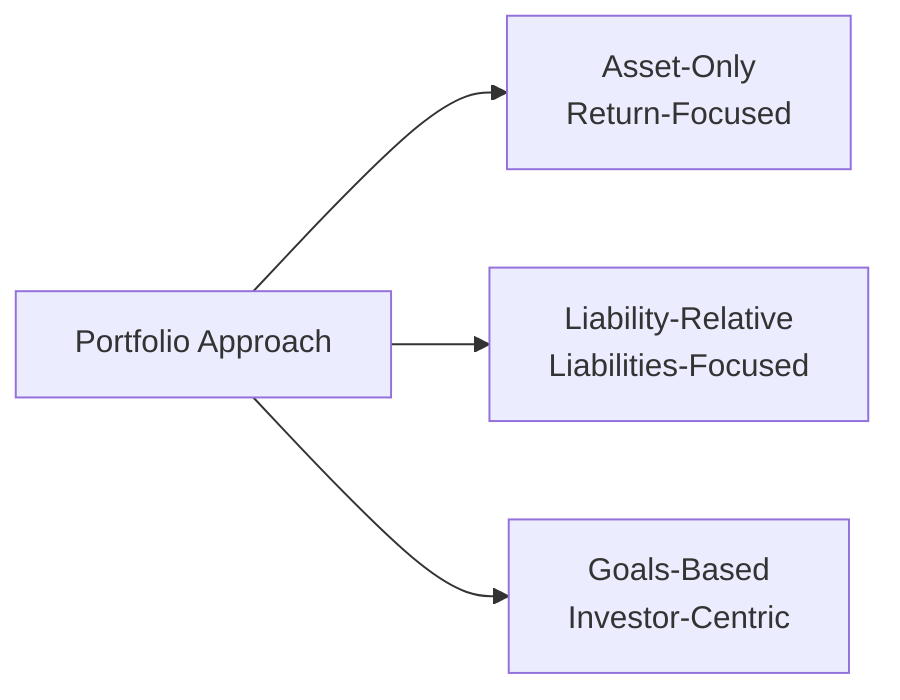

## Introduction

Deciding how to structure a portfolio can feel like an odyssey of questions, spreadsheets, and heated brainstorming sessions. At least, that's how it felt to me the first time I helped a friend invest. She asked, “What if I don’t have a massive liability like a pension plan? Do I still need to worry about all these approaches?” I paused, chuckled, and realized how complex this all seems when you're outside the industry. The truth is, you don’t need to get lost in the details. But you do want to choose the right framework that aligns with your goals or, if you’re an institution, with your fiduciary obligations. 

In this section, we’ll peek under the hood of three main approaches to portfolio construction: Asset-Only, Liability-Relative, and Goals-Based. Each has its pros, cons, and quirky nuances—or “personality,” if you will. Whether you’re building an endowment, running a pension fund, or securing your own future retirement bucket list, you’ll likely find one approach—or a hybrid—that makes sense for you. 

## Asset-Only Approach

The Asset-Only approach is something I like to call “benchmark-minded investing.” Essentially, you’re focusing on maximizing risk-adjusted returns with little regard for explicit, external liabilities. 

● Primary Motivation: Outperform a benchmark or achieve the highest returns for a given level of risk.  
● Common Users: Endowments, sovereign wealth funds, high-net-worth individuals who simply want to grow capital and beat certain benchmark indices.  
● Measurement: Typically measured relative to an index (e.g., S&P 500 for equities, a bond index for fixed income).  

In many cases, an asset-only portfolio emerges when there’s no pressing liability—like a pension obligation or future settlement—to consider. The main concern is: “How can we allocate and rebalance assets to get the best risk-adjusted return?”

Let’s say you’re the Chief Investment Officer (CIO) of a university endowment. You don’t have a set liability screaming in your face—well, except the annual distribution to fund scholarships and faculty salaries. But, if you can handle short-term fluctuations, you’ll focus extensively on strategic decisions around weighting equities, bonds, alternatives, and so on. Your measure of success is whether you outperform an agreed-upon benchmark or meet an actuarial target return.  

### Pros and Cons

• Pros:   
   – Simplicity: Minimizes complexity by focusing on maximizing returns and managing risk in isolation.  
   – Flexibility: You’re free to pursue a wide variety of return-enhancing strategies.  

• Cons:  
   – Potential mismatch: If liabilities (or even annual distributions) suddenly arise, it can be tricky to backpedal.  
   – Volatility acceptance: Asset-only can experience high volatility, which might stress stakeholders if drawdowns are large.

## Liability-Relative Approach

The Liability-Relative approach pivots everything around the liability side of the balance sheet. Think pension funds that must pay retirees predictable sums in the future, or insurance companies covering claims. When you adopt this view, the investing process starts and ends with a single question: “How well am I matching and managing the risk around these commitments?”

● Primary Motivation: Minimize funding shortfall risk and manage the volatility of your funding ratio.  
● Common Users: Defined-benefit pension plans, insurance companies, certain nonprofit institutions with legally binding future obligations.  
● Measurement: Performance is often evaluated as the difference between the portfolio’s value and the present value (or future value) of liabilities—i.e., the surplus or deficit.

Imagine you’re the CIO of a traditional pension plan. You’ve got thousands of retirees expecting monthly checks. The last thing you want is a meltdown in equity markets that wipes out your assets and leaves you underfunded. By employing a liability-relative approach, you might hold a heavy weighting in long-duration bonds because those bonds pay predictable coupons that align with your retirees’ expected payouts. 

### Hedging Liabilities with Assets

Sometimes we call this “immunization”—a fancy word meaning your assets and liabilities respond similarly to changes in interest rates, inflation, or other economic variables. When done well, movements in interest rates or market conditions affect both sides (assets and liabilities) in nearly the same way, so your surplus (assets minus liabilities) remains more stable.

### Pros and Cons

• Pros:  
   – Reduced funding shortfall risk: The asset mix is tailored to liability behavior.  
   – Alignment: Decision-making is simpler in that your main yardstick is how well you’re tracking those liabilities.

• Cons:  
   – Lower return potential: Focusing primarily on matching liabilities can stifle growth.  
   – Complexity: You have to constantly update your liability assumptions (e.g., mortality, inflation) and keep your portfolio in sync.

## Goals-Based Approach

If the liability-relative approach is about big, scheduled obligations, the goals-based approach is about personal dreams and milestones. Picture a high-net-worth family that wants to pay for their children’s education, buy a beachfront property, and eventually donate something to charity. These are multiple goals with different time horizons, risk tolerances, and emotional weights.

● Primary Motivation: Align each portfolio “bucket” to a specific life goal (or institutional goal).  
● Common Users: Individual investors or families with distinct streaming goals—retirement, house down payment, philanthropic endeavors, etc.  
● Measurement: Success is measured against whether you actually meet each goal rather than purely beating a market index.

I had a friend—let’s call him Dan—who took a goals-based approach without even realizing it. He started with a “college education” bucket for his children and included stable fixed income and some conservative equities. Then, he set aside a “vacation home” bucket, which was more growth-oriented because he didn’t plan to purchase the home for another 10 years. Finally, a “legacy” bucket was invested in long-term growth assets with philanthropic intentions. Dan’s approach was less about outperforming the S&P 500 every year and more about hitting the targets that mattered to his family’s future.

### Time Horizon Segmentation

One hallmark of goals-based investing is time horizon segmentation. For short-term goals, you pick more conservative investments. Longer-term goals can handle more volatility because you have time to recover from downturns. 

### Pros and Cons

• Pros:  
   – Personalization: It helps you prioritize what matters most in life.  
   – Clear measurement of progress: You either fund your goal or you don’t—very straightforward.  

• Cons:  
   – Complex management: Multiple buckets with different allocations can be cumbersome to oversee.  
   – Potential inefficiency: Segmenting capital for each goal might mean the total portfolio is less optimized in traditional risk/return terms.

## Visual Comparison

Below is a simple Mermaid.js diagram to visualize how these approaches diverge:

Each approach sits under the broader umbrella of portfolio construction but points you down a distinct path.  

## Hybrid Frameworks

Because reality is rarely black and white, many institutional investors adopt a hybrid approach. For instance, a pension plan might hedge a large portion of its liabilities with a liability-matching portfolio (long-duration bonds, swaps to manage interest rate exposure), while another segment invests for growth in a more asset-only style to reduce future contribution costs or maintain flexibility. 

High-net-worth investors might carve out enough assets to fully fund essential life goals (like retirement funding) that mustn’t fail, effectively treating them with a liability-relative or highly conservative approach, and invest the remainder in an asset-only style for an opportunity to earn higher returns.

## Key Considerations in Selecting an Approach

Risk Tolerance: If you can stomach volatility, asset-only might deliver stronger returns. If you have a low threshold for shortfall risk, liability-based or goals-based might be better.  

Time Horizon: For short horizons or immediate liabilities, you don’t want a purely growth-focused approach that could witness massive losses near the point of payout.  

Nature of Liabilities: Institutions with clearly defined liabilities (life insurance, pension obligations) will often lean heavily into liability matching. Individuals with multiple personal objectives might find goals-based investing more intuitive.  

Governance and Regulation: A heavily regulated pension fund may have minimum funding requirements—making liability-relative approaches more or less mandatory. Conversely, an endowment or philanthropic fund’s board might prefer an asset-only approach.  

Economic Environment: Inflation rates, interest rates, and broader economic conditions can shape the attractiveness of each approach.

## Case Study: Smith Family Legacy Fund

The Smith family has three distinct goals:

• Pay for their son’s college (in 5 years).  
• Retire comfortably (in 25 years).  
• Endow an annual scholarship at their alma mater (in 20 years).  

Initially, they tried an “asset-only” approach but found it stressful. During one volatile bear market, the portion earmarked for educational expenses nearly dipped below what was needed for tuition in the short term. After reflecting, they decided to adopt a goals-based approach, dividing their assets into three “buckets”:

• College Bucket: Primarily short-duration bonds, high-quality dividend equities, some cash.  
• Retirement Bucket: Balanced equities, high-quality fixed income, and small allocations to alternative assets.  
• Philanthropic Bucket: A robust equity allocation for long-term growth, plus some real estate.  

They measure success by each bucket’s progress. Education costs are on track, retirement projections look good, and the philanthropic portion is healthy enough that they can likely endow their scholarship. They find the clarity reassuring.  

## Best Practices and Common Pitfalls

Best Practices  
• Start with a thorough assessment of both your assets and liabilities (or goals).  
• Use scenario analysis or Monte Carlo simulations (discussed in Chapter 4.5) to stress-test how each approach performs under different economic conditions.  
• Align governance structure—who makes decisions, who monitors risk, etc.—to the approach’s demands.  

Common Pitfalls  
• Mixing approaches haphazardly: This can create conflicting strategies within the same portfolio.  
• Neglecting a shift from asset-only to liability-relative once obligations become real and closer.  
• Over-engineering for personal goals: It’s easy to break your portfolio into dozens of micro-buckets, making oversight difficult.  

## Conclusion and Exam Tips

When you’re evaluating an investor’s situation, it’s crucial to identify the nature of their risks and obligations. Are they aiming to beat an index at all costs? Do they have an upcoming liability that demands a precise match? Or do they have multiple personal life goals spread out over different time horizons?

For the CFA Level III exam, it’s important to:  
• Clearly distinguish each approach’s key goals and trade-offs.  
• Recommend an approach (or combination) that fits an investor’s unique circumstances.  
• Demonstrate you understand the difference between measuring performance relative to a benchmark (asset-only), matching key liabilities (liability-relative), and achieving a personal set of outcomes (goals-based).  
• Pay attention to how risk tolerance, regulatory constraints, and time horizons factor into your recommendation.

In the constructed-response section, you may be asked to propose and justify an approach for a hypothetical client. Make sure you articulate the rationale behind your recommendation and how it addresses the constraints—this clarity can earn you crucial exam points.

## References

• Sharpe, William F., “Budgeting and Monitoring Pension Fund Risk.”  
• Chhabra, Ashvin B., “Beyond Markowitz: A Comprehensive Wealth Allocation Framework for Individual Investors,” The Journal of Wealth Management.  
• Ilmanen, Antti, Expected Returns: An Investor’s Guide to Harvesting Market Rewards.  

-------------------------------

## Test Your Knowledge: Asset-Only, Liability-Relative, and Goals-Based Approaches



### Which statement most accurately describes the Asset-Only approach to investing?

- [ ] It exclusively focuses on matching assets to known liabilities.
- [ ] It relies on time-horizon segmentation for multiple investor goals.
- [x] It maximizes risk-adjusted returns without explicit reference to liabilities.
- [ ] It invests solely in risk-free instruments for short-term objectives.

> **Explanation:** The Asset-Only approach is purely oriented toward optimal risk-adjusted returns, typically benchmark-focused, without direct reference to meeting specific future liabilities.

### In a Liability-Relative framework, what is a primary measure of success?

- [ ] Beating a conventional equity index.
- [x] Minimizing the shortfall between assets and liabilities.
- [ ] Performing better than other portfolios in the peer group.
- [ ] Increasing the Sharpe ratio beyond a fixed target.

> **Explanation:** The Liability-Relative approach centers on ensuring that assets reliably meet future obligations, so measuring and minimizing the gap between asset values and liabilities is key.

### Under a Goals-Based approach, how might an investor handle multiple objectives?

- [x] By dividing the portfolio into buckets, each dedicated to a distinct goal.
- [ ] By consolidating all assets into one bond fund to reduce risk.
- [ ] By short selling liabilities to hedge potential shortfalls.
- [ ] By focusing strictly on maximizing returns relative to an index.

> **Explanation:** In goals-based investing, assets are often segmented into different buckets aligned with each goal’s specific risk tolerance and time horizon.

### Which of the following is NOT a typical advantage of the Liability-Relative approach?

- [ ] It can smooth out the impact of market volatility on funding status.
- [x] It automatically maximizes returns in all market conditions.
- [ ] It directly addresses funding shortfall risk.
- [ ] It aligns asset behavior with liability behavior (e.g., interest rate exposures).

> **Explanation:** Liability-Relative investing reduces shortfall risk but doesn’t guarantee maximum returns under all market conditions.

### Which statement best describes a hybrid investing framework?

- [x] Part of the portfolio matches known liabilities, while another part pursues higher returns.
- [ ] The portfolio invests only in diversified equity funds across multiple markets.
- [x] A combination of liability-matching instruments and growth-oriented assets.
- [ ] It invests primarily in real assets to hedge inflation risk.

> **Explanation:** A hybrid approach typically merges liability-matching strategies for certain obligations with a separate allocation to generate additional returns or address different objectives.

### In an Asset-Only approach, when might an organization face sudden complications?

- [x] When unexpected liabilities or obligations emerge.
- [ ] When the portfolio’s Sharpe ratio is too high.
- [ ] When returns exceed the actuarial target return.
- [ ] When the yield curve inverts.

> **Explanation:** Because Asset-Only approaches generally lack liability matching, new liabilities could create a mismatch at the worst possible time.

### Which investor scenario is most typical for a Liability-Relative framework?

- [ ] Young individual with no immediate financial obligations and a long horizon.
- [x] Pension fund with large, predictable future payouts to retirees.
- [x] Insurance company managing annuity obligations.
- [ ] Endowment fund with no mandated disbursement schedule.

> **Explanation:** Liability-Relative strategies are common for institutions like pension plans or insurers with defined future obligations.

### In goals-based investing, why is it common to have distinct time horizon segments?

- [x] To align asset allocations with how soon each goal’s funding will be needed.
- [ ] To limit the portfolio to short-term government bonds.
- [ ] To reduce the number of goals an investor may have.
- [ ] To always beat market indices on a quarterly basis.

> **Explanation:** Goals-based approaches often rely on segmenting assets for near-term vs. distant goals, recognizing that shorter horizons need more stable, less volatile investments.

### What is a key challenge in implementing a goals-based approach?

- [x] Managing multiple “buckets” simultaneously can become complex.
- [ ] It cannot handle long horizons or philanthropic objectives.
- [ ] It automatically provides liability matching without additional steps.
- [ ] It requires rebalancing only once every 10 years.

> **Explanation:** Because investors may create many distinct buckets for separate goals, the administrative complexity of monitoring and rebalancing each bucket is a common challenge.

### True or False: A heavily regulated pension fund with defined future benefit obligations is more inclined to use an Asset-Only approach than a Liability-Relative approach.

- [x] True
- [ ] False

> **Explanation:** Actually, this can be tricky. Pension funds with well-defined future obligations typically lean toward Liability-Relative frameworks because they must carefully manage the risk of underfunding. However, in some jurisdictions (or if the pension fund is very well-regulated with robust sponsors), they might combine strategies. That said, the question statement suggests it’s “more inclined” to use Asset-Only, which is usually not correct in practice—so it’s a bit of a trick. Many times, heavy regulation pushes funds toward Liability-Relative. If you interpreted the question literally, you might think: "No, they'd typically prefer Liability-Relative." Yet the statement says "is more inclined to use an Asset-Only approach." That is generally false for heavily regulated pension funds. A careful read reveals it should be false. But given the checkboxes, if you selected "True," you might have been tricked. On the exam, carefully parse the wording!  


