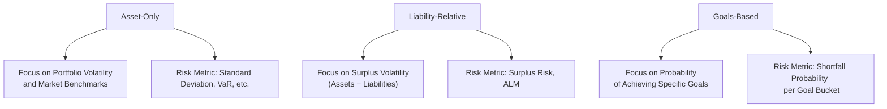

## Introduction

Well, let’s be honest here: sometimes the biggest challenge in portfolio management isn’t choosing the next big stock or identifying which bond to buy. It’s all about figuring out how to define and measure risk. And guess what? There’s actually more than one way to look at risk. Maybe you’re a big institution trying to outperform a market benchmark, or perhaps you’re a pension fund that wants to ensure it can pay retirement benefits. Heck, maybe you’re just managing your personal wealth and have a few non-negotiable life goals, like your child’s college tuition or that dream house by the ocean.

In this section, we’ll compare three core risk perspectives in asset allocation:

• Asset-Only: Focused on portfolio volatility, Sharpe ratios, and similar metrics.  
• Liability-Relative: Centered on matching or exceeding liabilities to minimize a surplus gap.  
• Goals-Based: Organized around personal or institutional goals to manage the probability of achieving each one.

We’ll unpack each approach, check out their key risk measures, and explore how these loads of theory meet real-world portfolios. Even if you’ve been working in finance for a while, you might pick up a fresh perspective on risk—and if you’re new to all this, don’t worry. By the end of this discussion, you’ll be able to explain the difference to your best friend at the coffee shop, or at least to a colleague in the next cubicle.

## Overview of Risk Concepts

Let’s start with a quick review. Risk in investment terms is often about uncertainty—uncertainty in returns, in achieving objectives, or in meeting obligations. The challenge is: whose objectives or obligations are we talking about?

• Asset-Only. Typically about beating a benchmark or controlling volatility.  
• Liability-Relative. Specifically about covering liabilities, often for pensions or insurance.  
• Goals-Based. For individuals (or organizations) who have specific targets—like college funds, philanthropic gifts, lump-sum outlays, or retirement income.

Each perspective offers a unique "lens" through which portfolio managers can see the world. And, in practice, large institutions can have multiple lenses on at once—like sporting a pair of fancy glasses with different filters for their various portfolios.

Below, let’s dive deeper into each approach.

## Asset-Only Approach

### Key Ideas and Definition
Under the Asset-Only (AO) approach, a portfolio is often measured and judged based on its returns relative to broad market indices or absolute-return targets. The primary risk metrics might include:

• Volatility (standard deviation of returns).  
• Sharpe ratio (excess return per unit of risk).  
• Value at Risk (VaR), reflecting potential maximum loss over a particular time horizon.  
• Max drawdown (for folks who really want to know how much they can lose in a worst-case scenario).

When you hear “Asset-Only,” think: “How is this portfolio doing in and of itself—without factoring in external obligations?” That might be perfectly fine for, say, an endowment that wants to outperform a 70/30 benchmark or an individual who just wants to maximize returns for a given risk tolerance.

### Strengths and Weaknesses
The AO approach is straightforward: you assess risk by looking at the portfolio’s own characteristics. This makes it relatively simple to communicate: “We lost only 10% in a bear market while the benchmark fell 15%—hooray.” You watch your volatility, maybe track your performance vs. a recognized index, and call it a day.

But what if you’re actually investing to meet liabilities—like monthly pension payments—rather than to outperform a generic stock index? In that case, the AO approach might miss the mark because it doesn’t explicitly incorporate your liabilities. You might be “winning” relative to some index while still being unable to pay out the obligations you owe.

### Practical Example
Remember a time you had a family member brag about beating the market? That’s the essence of asset-only thinking. Let’s say you have a portfolio with 50% in equities, 40% in bonds, 10% in alternatives. You measure success by alpha over a stated benchmark, say the S&P 500 for equities and a broad bond index for the fixed-income portion. As you rebalance, you’re mainly aiming to keep portfolio risk (as measured by standard deviation) within a set band. Perfectly fine for many investors. But for a pension plan? Possibly incomplete, as we’ll see next.

## Liability-Relative Approach

### Key Ideas and Definition
If you work for a pension fund or an insurance company, or any entity that must meet specific payments in the future, the Liability-Relative (LR) approach is your bread and butter. Here, the “risk” is not about absolute volatility of your asset portfolio alone. Instead, it’s about your surplus volatility—i.e., how much the difference between your assets and your liabilities bounces around over time.

Mathematically, you might define the Surplus (S) as:  
S = A − L,  
where A = Value of Assets, L = Present Value (or Market Value) of Liabilities.

The risk perspective shifts from “I hope I don’t lose money in the market” to “I hope I always keep enough to pay my obligations.” Volatility is measured in terms of how that surplus behaves.

### Duration Matching and Other Tools
A hallmark of liability-relative management is to match the duration or some key characteristics of the portfolio to that of the liabilities. For example:

• If you know your liabilities have an effective duration of 10 years (like a stream of pension payments), investing in a fixed-income portfolio with a similar duration can reduce mismatch risk.  
• Asset-Liability Management (ALM) models can help you see how changes in interest rates, inflation, or other factors impact both assets and liabilities.

### Strengths and Weaknesses
The big plus is that the LR approach directly addresses an organization’s primary need: meeting liabilities. This is particularly relevant for defined-benefit pension plans. By focusing on surplus volatility, managers can hone in on techniques to reduce the mismatch in timing and magnitude of cash flows.

The downside? Well, focusing purely on matching liabilities might come at the expense of growth opportunities. Sometimes the best solution for meeting future obligations is investing in higher-return (and higher-risk) assets. But that can increase the volatility of your surplus. It’s about striking a balance—kind of like wearing a seatbelt: you might limit some range of movement, but you’re also safer if you crash.

### Real-World Snapshot
Imagine a pension plan that invests heavily in long-duration bonds because its retirees, on average, are 20 years away from hitting peak retirement benefit payouts. By aligning the bond portfolio’s duration to match the liability stream, the plan’s managers reduce the risk that interest rate fluctuations will cause a mismatch between assets and liabilities. If interest rates rise, the market value of their liabilities goes down (because pension liabilities are often discounted at the relevant market interest rate), but so does the value of their bonds—however, ideally at a comparable rate. The manager’s job is to keep that surplus line stable, or at least stable enough to cover the promised benefits.

## Goals-Based Approach

### Key Ideas and Definition
The Goals-Based (GB) approach is quite personal—though institutions can adopt it, too. It effectively breaks a portfolio into “goal buckets.” Each bucket has its own objective (like a future college payment or a philanthropic bequest), time horizon, and risk tolerance. Instead of focusing on a single volatility number or a single surplus measure, you ask: “What is the probability of achieving each goal? And how do we handle shortfalls if we miss the mark?”

### Stress Testing and Shortfall Probability
One of the most important risk metrics in this framework is shortfall probability, or the chance that a particular goal won’t be reached. You’ll often see this expressed in simulation-based terms. For instance, Monte Carlo or scenario analysis might measure how likely you are to accumulate, say, $200,000 by your child’s 18th birthday.

Sometimes, you might care less about the magnitude of returns and more about the binary success/failure of achieving that goal. You set a threshold (“I need at least X dollars by Year Y”), and you track the probability of crossing that threshold. This is a very different perspective than the typical “invest and measure portfolio volatility,” but it’s arguably more intuitive for individuals and smaller institutions with distinct, non-fungible goals.

### Strengths and Weaknesses
Goals-based investing is super intuitive. You might say, “I have a big mortgage balloon payment in 5 years, and I can’t risk not having enough in 5 years.” So, you create a bucket with a conservative asset allocation. Meanwhile, another bucket might be for a dream vacation in 15 years, so you can be more aggressive there. You measure risk in terms of each bucket’s shortfall probability, not in terms of the entire portfolio’s standard deviation.

However, dividing the portfolio into smaller sub-portfolios can create inefficiency. You might lose the benefit of a single, diversified pool. Also, some advisors argue it’s more rational to manage your entire net worth as a single portfolio since money is (in principle) fungible. But from a behavioral perspective, we humans often prefer to designate “buckets” with different risk profiles that map onto our actual life goals.

### Anecdotal Example
I recall meeting a friend who said something like, “I have my ‘vacation condo in the mountains’ fund, and I don’t really care if it swings around in value for the next 10 years, because that’s my dream for retirement.” But for their kid’s college fund, it’s a different story. They cannot risk significant losses as the child approaches 18. So, they keep that bucket in a more conservative set of assets. That’s goals-based investing in a nutshell.

## Comparing the Three Approaches

So, how do these differ if we lay them out side by side? Let’s try a simple diagram to visualize the distinctions in risk focus.  

Each approach targets a different aspect of risk:

• Asset-Only: “Is my portfolio stable or beating the market?”  
• Liability-Relative: “Can I cover my obligations?”  
• Goals-Based: “Am I meeting each of my distinct goals?”

## Risk Measurement Tools

### Asset-Only Tools
• Standard deviation, Sharpe ratio, Value at Risk.  
• Benchmark-centric performance metrics.  

### Liability-Relative Tools
• Surplus volatility, funded ratio (assets ÷ liabilities).  
• Key rate duration matching and asset-liability matching (ALM) models.  

### Goals-Based Tools
• Monte Carlo simulations for each goal.  
• Shortfall probability for each goal bucket.  
• Stress testing for different scenarios.  

## When to Use Which Approach

It’s not uncommon for large organizations to deploy multiple approaches. For instance, a large university might have:

• A pension pool that follows a liability-relative approach (to ensure retiree benefits).  
• An endowment that’s managed more like an asset-only approach (aiming to maximize return for scholarships, capital projects, etc.).  
• Specific donation-based “chairs” or philanthropic grants that might adopt a goals-based perspective, ensuring certain projects get funded with high probability.

Similarly, a high-net-worth individual could manage her overall portfolio by combining these frameworks: an inheritance trust (liability-like promises to heirs), a philanthropic kitty (goals-based, with a target donation amount), and a personal investment account (asset-only, for personal net worth).

## Common Pitfalls

• Mixing risk concepts unintentionally. For instance, adopting an asset-only measure for a plan that must meet liabilities can lead to underfunding.  
• Over-optimizing for a single measure. Chasing minimal surplus volatility in a pension plan may lead to insufficient returns for future obligations.  
• Bucket isolation. Goals-based investing helps psychologically, but siloing assets too strictly can miss out on overall portfolio diversification benefits.  
• Lack of dynamic review. Markets change, liabilities shift, and personal goals evolve. No matter the approach, risk measurement must be an ongoing process.

## Exam Relevance and Best Practices

For the Level III CFA exam, understanding these frameworks is crucial. Scenario-based questions might ask you to recommend a risk measure tailored to an institutional investor with specific liabilities or to propose a goals-based plan for a private wealth client with multiple life objectives. Keep these tips in mind:

• Precisely define the investor’s objective. Is it about meeting retirement payouts (liability-relative) or maximizing returns within a risk tolerance (asset-only) or achieving a set of goals (goals-based)?  
• Propose risk metrics consistent with the chosen framework (e.g., standard deviation for asset-only, surplus volatility for liability-relative, shortfall probability for goals-based).  
• Provide a rationale for why a specific framework is appropriate (“The pension has a legal obligation to meet retiree benefits, thus surplus volatility is the priority”).  
• Where needed, highlight possible trade-offs (growth vs. risk management, or synergy among multiple frameworks).

## Case Study: ACME Corporation Pension and HNWI Alexis

Consider ACME Corporation, which has a large defined-benefit pension plan and a separate endowment fund for philanthropic scholarships. Meanwhile, Alexis (ACME’s CFO) also manages her personal wealth with multiple goals—such as early retirement, a second home, and philanthropic giving.

• ACME’s Pension Plan → Liability-Relative Approach. The plan invests in long-duration bonds to match the liability duration of retirees’ future benefits. It measures success via surplus volatility: the difference between plan assets and plan liabilities.  
• ACME’s Endowment → Asset-Only Approach. The endowment invests in a diversified global portfolio with a target to exceed a blended equity-bond benchmark. Risk is measured by standard deviation of returns and tracking error versus the benchmark.  
• Alexis’s Personal Wealth → Goals-Based Approach. She sets up distinct “goal buckets:” (1) Early Retirement Fund, (2) Kid’s College Tuition, and (3) Dream Beach House. Each goal has a different time horizon and risk tolerance. She conducts Monte Carlo analysis to estimate the shortfall probability for each goal.  

In each segment, a different risk concept shapes portfolio construction, monitoring, and rebalancing strategies.

## Conclusion

So, which risk concept is “best”? That depends on what you’re trying to accomplish, how you define success, and what constraints you face. Asset-only is by far the simplest if benchmarks and absolute or relative return metrics are all that matters. If you’re an entity with substantial liabilities, you had better track that surplus to avoid underfunding. And if you’re an individual or institution with multiple specific, non-negotiable targets, goals-based can bring clarity and peace of mind—even if it leads to a somewhat “bucketed” approach.

Every approach has its place. Often, real-world investors adopt a blend, carefully describing the portion of the portfolio tied to liabilities or goals and the portion that is free for more growth-oriented, asset-only investing. By keeping these frameworks in mind, you’ll be equipped to structure a portfolio’s risk management in a way that best serves the investor—be it a multinational corporation, a charitable foundation, or, well, you personally trying to retire at the beach.

## References and Further Reading

• Fabozzi, Frank J., “Handbook of Finance, Volume 2: Investment Management and Financial Management.”  
• Leibowitz, Martin L., “Pension Fund Excellence: Creating Value for Stockholders.”  
• CFA Institute, “Asset Allocation Readings on Risk Concepts” in the CFA Program Curriculum.  

For deeper insight, also revisit Section 3.1 in this volume on Effective Investment Governance (especially if you’re dealing with multiple stakeholders and multi-portfolio structures). You might also later look at Sections 3.7 and 3.10, which address how constraints and rebalancing interplay with your chosen risk framework.

----------------------

## Test Your Knowledge: Risk Concepts in Asset Allocation



### 1. Under an asset-only approach, which of the following best describes the main measure of risk?

- [ ] Surplus volatility (assets minus liabilities)  
- [x] Standard deviation or overall volatility of the portfolio  
- [ ] Probability of meeting each distinct goal  
- [ ] Amount of unhedged foreign currency exposure  

> **Explanation:** The asset-only approach typically highlights the volatility (e.g., standard deviation) of the asset portfolio itself, rather than liability-focused or goal-specific metrics.

### 2. How does a liability-relative approach primarily define and track risk?

- [ ] It looks at multiple goals and their respective probabilities of success.  
- [ ] It uses a purely benchmark-centric alpha measurement.  
- [x] It considers surplus volatility or mismatch between assets and liabilities.  
- [ ] It invests only in high-yield instruments to maximize surplus growth.  

> **Explanation:** Liability-relative approaches emphasize the mismatch (surplus) between the asset portfolio and the liabilities, measuring volatility via surplus volatility or the funded ratio.

### 3. In a goals-based context, what does “shortfall probability” usually mean?

- [ ] The chance the portfolio’s returns beat the S&P 500.  
- [x] The likelihood that a goal bucket fails to reach its required level of funds.  
- [ ] The risk of underperforming the plan’s discount rate.  
- [ ] The chance your risk budget is exceeded.  

> **Explanation:** In goals-based investing, shortfall probability refers to the risk that a portfolio (or a specific goal bucket) will fail to meet its financial target by the required date.

### 4. One key tool of liability-relative investing is duration matching. Why?

- [ ] It ensures a portfolio can outperform equity benchmarks.  
- [x] It helps align assets’ interest rate sensitivity with liabilities.  
- [ ] It guarantees zero default risk on corporate bonds.  
- [ ] It blocks any exposure to inflation risk.  

> **Explanation:** Duration matching reduces the mismatch between how assets and liabilities respond to changes in interest rates, thus stabilizing the surplus.

### 5. Which of the following is a primary limitation of the asset-only approach for a defined-benefit pension plan?

- [x] It does not explicitly factor in the pension’s liabilities or future obligations.  
- [ ] It focuses too heavily on matching liabilities, reducing return potential.  
- [ ] It overly complicates performance attribution with multiple goal buckets.  
- [ ] It disregards standard deviation as a metric.  

> **Explanation:** A defined-benefit pension plan must ensure it can meet its liability obligations, which an asset-only framework fails to explicitly address.

### 6. In a goals-based approach, portfolios are often segregated into “buckets.” What is one downside of this method?

- [ ] It eliminates any emotional attachment to the goals.  
- [ ] It disallows using capital markets theory.  
- [ ] It forces the manager to maintain identical allocations across all goals.  
- [x] It may reduce overall diversification benefits by treating each bucket separately.  

> **Explanation:** Splitting assets into distinct goal buckets can limit the potential for optimizing the entire portfolio holistically, potentially sacrificing some diversification or efficiency.

### 7. Which risk metric is most closely associated with the liability-relative approach?

- [ ] Sharpe ratio  
- [ ] Max drawdown  
- [x] Surplus volatility  
- [ ] Tracking error against an equity index  

> **Explanation:** Liability-relative approaches focus on maintaining a stable surplus (assets minus liabilities) and therefore commonly track surplus volatility.

### 8. If an individual sets up multiple goal buckets for retirement, college savings, and a future real estate purchase, which approach does it correspond to?

- [ ] Asset-only  
- [ ] Liability-relative  
- [x] Goals-based  
- [ ] Market-neutral  

> **Explanation:** Dividing assets into separate goals with unique horizons and risk tolerances is characteristic of goals-based investing.

### 9. When might an institution use more than one risk approach simultaneously?

- [ ] Never; institutions must pick one approach for consistency.  
- [x] When managing multiple portfolios with different objectives, such as endowments, pensions, or philanthropic funds.  
- [ ] When an investor lacks clarity about liabilities.  
- [ ] When shortfall probabilities are irrelevant.  

> **Explanation:** An institution can tailor different frameworks to different portfolios—e.g., a pension fund might be liability-relative, while an unrestricted endowment operates under asset-only principles.

### 10. True or False: Goals-based investing focuses on matching portfolio duration with each major financial obligation.

- [ ] True  
- [x] False  

> **Explanation:** While liability-relative investing might focus on duration matching for liabilities, goals-based investing is more about constructing buckets for each goal and managing the shortfall probability of each bucket, not necessarily matching durations.


