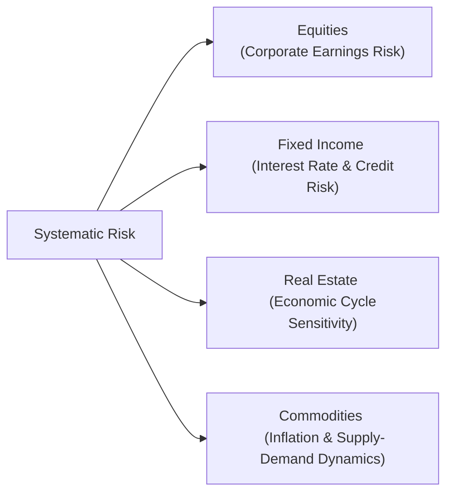

## Introduction

I still remember the first time I tried carving up a portfolio into different “buckets” of risk—equities, bonds, and, well, anything else I could find. Honestly, it felt like rummaging through a buffet line, hoping I’d pick just enough variety on my plate to avoid any dreaded “concentration” regret. Over time, though, I realized there’s a systematic way to approach all of this. Each asset class represents unique market exposures—also called systematic or non-diversifiable risks—that can shape the returns of your overall portfolio.

In this section, we’ll explore how various asset classes serve as proxies for major risk exposures. We’ll look at how these exposures respond to changing economic conditions, the role of correlation in shaping diversification benefits, and how we can break each asset class into smaller slices (like regions, sectors, or niche markets). And not to spoil the ending, but we’ll also check out how performance attribution helps us see whether we’re benefitting mostly from the market itself (beta) or from our own skill (alpha). 

Let’s dig in—informally, but thoroughly.

## Revisiting Systematic Risk

Systematic risk is the type of risk affecting the entire market or a broad segment of it. Now, you might say, “Wait, can’t I just diversify away risk?” True—except for systematic risk. That’s the risk that simply can’t be eradicated by diversifying into more stocks or more bonds, because it’s driven by broad economic, political, or financial market conditions.

When we speak about systematic risk, we’re often referring to factors like:  
• Equity market swings.  
• Interest rate fluctuations.  
• Widespread credit cycle changes.  
• Macroeconomic shifts.  

No matter how many different tech stocks you own, if the entire equity market plummets, you’re still caught in the downdraft. Similarly, if interest rates across the board rise sharply, most bonds will lose value. Recognizing this reality is at the heart of asset allocation. We bucket securities into broad groups—asset classes—each of which typically captures one or more systematic risk premia. 

## Asset Classes as Proxies for Systematic Risk

We often treat traditional asset classes—equities, fixed income, real estate, and commodities—as stand-ins for distinct risk factors. To be fair, these categories are generalizations. There are variations within each asset class that can exhibit different sensitivities to business cycles, inflation, or interest rates. But from a big-picture perspective, these broad categories help identify how our portfolio might behave under various market conditions.

### Equity

Most of us start here: stocks (or equities) are usually the foundation of growth-oriented portfolios. Equity exposures represent a claim on corporate profitability. When business cycles are positive—meaning the economy is generally expanding, and consumer confidence is strong—corporate earnings tend to improve, and equity markets often rise. In essence, equities encapsulate that corporate earnings risk, which is intimately linked to overall economic health. 

At the same time, equities can be subdivided for finer control over certain exposures. If you want more granular bets, you might slice equities by region (e.g., U.S., Europe, emerging markets) or by style (e.g., value vs. growth). Each segment might have unique risk profiles, such as value stocks typically being more defensive during times of market stress and growth stocks often being more sensitive to interest rate policies.

### Fixed Income

Unlike equities, which focus on corporate earnings, fixed income securities—such as government and corporate bonds—are primarily exposed to interest rate movements and credit risk. Rising interest rates generally drive bond prices down, while falling rates push them up. Credit risk exposure is also important: high-yield bonds, for example, embed more credit risk than investment-grade or government bonds.

If you’re curious about how to refine fixed income exposure further, you can consider:  
• Duration: Sensitivity to changes in interest rates.  
• Credit Quality: Investment-grade vs. high-yield.  
• Geographic Region: Developed vs. emerging markets.  

All these subcategories still revolve around systematic factors like interest-rate policy, credit cycles, and liquidity conditions.

### Real Estate

Real estate generally taps into macroeconomic growth (and sometimes local supply-demand conditions). Property values often rise when economic growth and consumer spending are on an upswing—though, let’s be honest, real estate can respond quite slowly to market shifts. The risk is correlated with broader business cycles, labor markets, and interest rates (since financing costs matter a lot in real estate). 

You can think of real estate as offering partial insulation from equity fluctuations because physical property values don’t immediately reflect every stock market blip. But it’s definitely not immune to recessions or credit crunches. Real estate investment trusts (REITs) and private real estate funds are popular vehicles to gain direct or indirect exposure to this asset class. 

### Commodities

Commodities—things like crude oil, metals, and agricultural products—tend to have different risk drivers than equities or bonds. Historically, commodities can provide an inflation hedge, because when inflation picks up, commodity prices may rise (particularly energy and precious metals). That said, commodity markets are also cyclical, influenced by supply-demand imbalances, geopolitical events, and currency fluctuations. 

Commodities can behave quite differently from financial assets, so they can reduce the overall correlation in your portfolio. But fair warning: they can also be very volatile, with price swings driven by weather events, supply chain disruptions, and global political tensions. 

### Visual Overview

Below is a simple mermaid diagram illustrating how asset classes correspond to different primary risk factors, all branching from the general concept of systematic risk:

## Correlation and Diversification

We often hear that diversification is like not “putting all your eggs in one basket.” But to do that effectively, you need to understand how different baskets move relative to each other. Enter correlation—the statistical measure in the range of –1 to +1, capturing how two assets move in tandem:  
• A positive correlation near +1 means they move almost in lockstep.  
• A negative correlation near –1 means they move in opposite directions.  
• Around zero means little to no linear relationship.  

When asset classes have low or negative correlation, combining them in a portfolio generally reduces volatility without necessarily sacrificing much return potential. This is the classic impetus for multi-asset portfolios that combine equities, bonds, real estate, and commodities. As one asset class zigs, another might zag, dampening overall risk.

That said, correlations can—and do—change over time, often converging during market crises. Whether we’re talking about 2008 or 2020, times of panic can make everything sell off together. This phenomenon underscores that diversification helps, but it’s no panacea in extreme market stress.

## Subdividing Asset Classes

So, we just discussed big, broad categories. However, markets rarely stand still, and your risk management might require more nuance. We can subdivide each asset class to target more specific risk exposures.

• Equities: By region (emerging vs. developed), style (value vs. growth), or sector (technology, financials, energy).  
• Fixed Income: By maturity, credit quality, or region—U.S. Treasuries, corporate bonds, emerging market sovereign bonds, etc.  
• Real Estate: By property type (residential, commercial, industrial) or by geography (local vs. global).  
• Commodities: By subcategories, such as energy, metals, agriculture, each with unique supply-and-demand dynamics.

This detailed segmentation helps advanced investors dial up or down their exposure to certain risk factors. For instance, if you believe interest rates will keep climbing, you might favor shorter-duration bonds over long-term bonds. Or if you see global growth surging in emerging markets, you might tilt more heavily toward those regions.

## Performance Attribution and Alpha vs. Beta

One side-benefit of representing systematic risk through asset classes is that it simplifies performance attribution. Managers want to know whether returns come from broad market exposure (beta) or from skillful active management (alpha).

• Beta: If your equity portfolio simply tracked the S&P 500, then your performance is almost entirely explained by the market’s performance—i.e., you’re earning “beta.”  
• Alpha: If your portfolio outperforms an appropriate benchmark (after adjusting for the same or a similar level of systematic risk), we say that your manager (or strategy) earned alpha.

Sometimes, managers can camouflage market-like returns as “skill,” so properly delineating asset classes and their underlying systematic exposures allows a more transparent breakdown of performance. If a manager says, “We had a phenomenal year,” you’d want to see whether that aligns with the overall market’s strength or whether they genuinely delivered returns above market beta.

## New (and Evolving) Asset Classes

As financial markets evolve, new asset classes and sub-asset classes emerge, requiring careful evaluation before integration into your strategic or tactical asset allocation. Cryptocurrencies, for instance, have garnered attention from some managers as a potential diversifier or as an alternative store of value. But these assets can be extremely volatile, and their correlation structures with traditional asset classes aren’t yet deeply established.

Also, think about segments like emerging market high-yield debt. Once considered esoteric, it’s becoming more mainstream. Investors can capture both interest rate risk and heightened credit risk while diversifying across regions. The question, as always, is how these new exposures fit within your broader systematic risk framework and whether they create synergy—or unnecessary chaos—in your portfolio.

## Passive vs. Active Allocation

Another angle is how you implement your asset class exposures—passively (an index-based approach) or actively (striving for alpha). Generally speaking, more efficient or liquid markets (like U.S. large-cap equities or developed government bonds) are tougher to outperform net of fees. Many managers prefer passive strategies for these “core” exposures. By contrast, in less efficient or more specialized niches—like emerging market small-caps or high-yield bonds—there may be more room for alpha generation.

Your choice also depends on cost. Passive index funds are often cheaper, meaning less drag on net returns. And if you consider asset allocation to be the biggest driver of returns (a widely accepted view), you may prefer to spend less on management fees for broad markets and reserve your active budget for areas where skill has a higher chance of paying off.

## Practical Illustration: Multi-Asset Portfolios

Let’s say you’re constructing a portfolio for a broad-based pension fund. You might allocate:  
• 50% to Global Equities (exposure to equity risk premium, subdivided by region).  
• 30% to Fixed Income (interest rate and credit risk exposure, primarily high-grade government and corporate bonds).  
• 10% to Real Estate (via REITs and direct property funds).  
• 5% to Commodities (balanced energy, metals, agriculture).  
• 5% to Opportunistic Investments (maybe emerging market high-yield or private equity).

By combining these allocations, you can spread out the overall risk and hopefully lower your portfolio’s volatility, while still capturing returns from multiple sources. A performance attribution analysis down the road would illustrate how much return was generated from broad equity beta, from interest rate trends, or from the real estate cycle versus your specific manager’s skill.

## Challenges and Pitfalls

• Changing Correlations: Diversification benefits may weaken during severe market crashes.  
• Over- or Under-segmentation: Breaking asset classes into too many slices can lead to complexity that’s costly or hard to manage reliably.  
• Hidden Overlaps: Some sub-asset classes can share risk factors. For example, private equity and public equities might both be heavily sensitive to the same economic cycle.  
• Incorporating Novel Assets: New or niche asset classes (cryptocurrencies, frontier market debt, carbon credits, etc.) demand deeper due diligence—particularly regarding their volatility and correlation patterns.  
• Manager Selection: Even if you define your asset classes well, picking skillful managers is its own challenge (especially in inefficient markets).

## Exam Tips

• Understand the Distinctions: Be prepared to articulate how each broad asset class maps to systematic risks.  
• Factor vs. Asset Class: You might get a question that tests your ability to reconcile factor investing (e.g., value, momentum, volatility) with traditional asset class buckets.  
• Tie to Portfolio Construction: Exam scenarios often involve tailoring multi-asset portfolios to specific client objectives. Expect to show how correlations and systematic exposures guide your recommended allocation.  
• Performance Attribution: You may have item set questions that require you to parse out alpha vs. beta.  
• Emerging and Alternative Assets: The exam may probe your understanding of how to handle new, less liquid investments.  

Whether it’s a constructed-response question asking for a recommended asset mix or a vignette-based item set about performance attribution, keep these systematic risk concepts in mind.

## References

• Ang, Andrew. Asset Management: A Systematic Approach to Factor Investing.  
• Ilmanen, Antti. Expected Returns: An Investor’s Guide to Harvesting Market Rewards.  
• Sharpe, William F. “Asset Allocation: Management Style and Performance Measurement,” The Journal of Portfolio Management.  

----------------------------------------------------------------------------

## Test Your Knowledge of Systematic Risk Exposures



### Which of the following best describes systematic risk?

- [ ] Risk specific to an individual company or industry.
- [x] Risk inherent to the entire market or broad segments of the market.
- [ ] Risk that can be eliminated through diversification in a single company’s stock.
- [ ] Risk that increases if an investor only holds U.S. Treasuries.

> **Explanation:** Systematic risk is non-diversifiable and stems from general market conditions that affect all companies and asset classes.

### Which asset class is often associated with capturing corporate earnings risk as its primary systematic exposure?

- [ ] Fixed Income
- [ ] Commodities
- [x] Equities
- [ ] Real Estate

> **Explanation:** Equities are typically sensitive to corporate earnings cycles and broader economic growth.

### Why do investors often include commodities in a multi-asset portfolio?

- [x] They can provide an inflation hedge and low correlation with traditional financial assets.
- [ ] They tend to outperform equities in all market conditions.
- [ ] They have no price volatility and are considered risk-free.
- [ ] They offer immediate income in the form of dividends.

> **Explanation:** Commodities, especially energy and precious metals, often show different correlation patterns than stocks or bonds and can help hedge against inflation.

### Which of the following asset class subdivisions most directly addresses interest rate risk?

- [ ] Growth vs. value equities
- [ ] U.S. vs. developed ex-U.S. equities
- [ ] Industrial vs. retail real estate
- [x] Duration in fixed income

> **Explanation:** Duration measures a bond’s sensitivity to changes in interest rates, making it a key subdivision of fixed income for controlling rate exposure.

### What is typically the main determinant for choosing a passive vs. active strategy in a given asset class?

- [ ] The level of systematic risk.
- [ ] The correlation with other asset classes.
- [ ] The volatility of the underlying market.
- [x] The relative efficiency of the market and the cost of pursuing alpha.

> **Explanation:** Passive strategies often prevail in highly efficient markets where alpha generation is more difficult and/or more expensive.

### How does a well-structured performance attribution framework help an investor?

- [x] It distinguishes between returns derived from market (beta) and manager skill (alpha).
- [ ] It ensures that correlation among asset classes remains constant.
- [ ] It replaces the need for portfolio rebalancing.
- [ ] It measures only total fees and expenses, not portfolio returns.

> **Explanation:** By breaking down performance into market-driven returns vs. skill-based returns, investors can make more informed decisions about manager selection and risk exposures.

### Why might an emerging market high-yield bond fund be considered a separate sub-asset class?

- [ ] It has no credit risk and is guaranteed by governments.
- [ ] It is not exposed to any form of systematic risk.
- [x] It features both emerging market sovereign/corporate risk and high yield credit risk.
- [ ] It has a negative correlation with all traditional asset classes.

> **Explanation:** Emerging market high-yield bonds combine multiple risk drivers—country risk, currency risk, and higher credit risk—making them distinct from plain vanilla developed-market bonds.

### When correlations among asset classes converge to 1.0 (perfect correlation) during market stress, what is the primary implication?

- [ ] Portfolios become less volatile overall.
- [x] Diversification benefits are greatly reduced in a crisis.
- [ ] Managers can more effectively generate alpha in such markets.
- [ ] Bonds and stocks become opposite in price movements.

> **Explanation:** When correlations head toward 1.0, the diversification advantage typically disappears, and most assets fall together.

### In which scenario is real estate exposure likely to support portfolio diversification?

- [x] Moderate economic growth with stable interest rates.
- [ ] A drastic and immediate drop in global GDP.
- [ ] Rapid rise in short-term interest rates only.
- [ ] High growth in the technology sector alone.

> **Explanation:** Real estate often benefits from stable or growing economic conditions and can behave differently than equities and bonds, thus aiding portfolio diversification.

### Is it true that systematic risk can be entirely eliminated by holding a well-diversified portfolio?

- [x] True
- [ ] False

> **Explanation:** This is actually a bit tricky: The question, as stated, might feel counterintuitive. Systematic risk cannot be fully diversified away (that’s the definition of systematic risk). However, the quiz statement was “Is it true that systematic risk can be entirely eliminated by holding a well-diversified portfolio?” The correct answer is actually “False.” Systematic risk remains no matter how diversified you are. 


