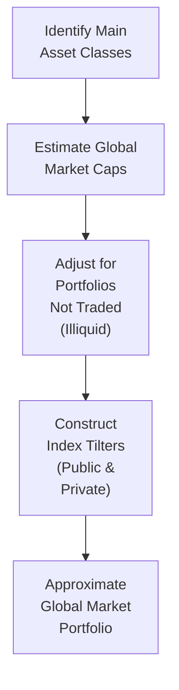
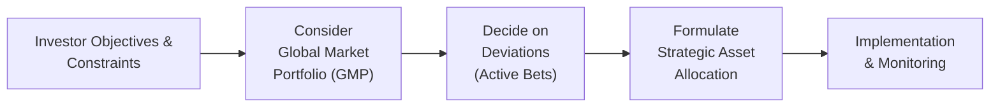

## Introduction and Conceptual Foundation

Have you ever looked around at all the possible investments—equities, bonds, real estate, hedge funds, private equity, you name it—and wondered: okay, so which mix is the “true” neutral or starting point? Well, in traditional finance theory, there’s a big idea that the Global Market Portfolio (GMP) is that neutral anchor. It’s like the “portfolio of everything,” representing an aggregate view of how the world’s investors collectively allocate their money across all investable assets.

Thinking back to my early days in portfolio management, I remember trying to replicate this GMP in a small training exercise. I had these huge spreadsheets mapping out global stocks, government bonds, corporate bonds, and even a few obscure instruments. Let me tell you, it was a learning experience about how messy the real world can be.

Still, from a purely theoretical perspective, the GMP is central to models like the Capital Asset Pricing Model (CAPM). Under CAPM, if markets are efficient, no combination of assets can beat the market portfolio on a risk-adjusted basis except by sheer luck (or mispricing). So, the GMP stands for this “market” that includes everything—almost like a final puzzle piece that completes the capital markets jigsaw.

## Why the GMP Is Considered a Baseline

In an efficient market, the global market portfolio is the overall “crowdsourced” portfolio. The idea is that if you hold anything different, you must have a good reason: you’re taking an active bet that your selected portfolio will outperform—or underperform—this broad-based consensus. If everyone else is, for instance, 50% in stocks and 40% in bonds and 10% in real estate, and you choose a different setup, you’re basically saying, “I have a view that a different ratio of these assets will do better given my objectives, constraints, or information.” 

### Principles from the CAPM
Under the CAPM assumptions taught in many finance programs (including earlier CFA® curriculum levels), each investor looks at risk and return in a consistent manner, and all publicly available information is fully reflected in prices. Therefore, the market portfolio is supposedly mean-variance efficient. This is the major theoretical underpinning that justifies why some use the GMP as a baseline for asset allocation. 

### Efficiency and Neutrality
Because it encompasses all investable assets in their market-value weights, the GMP is the neutral reference that, by definition, has no “bet” relative to itself. It’s basically the yardstick: any tilt or tilt away is on purpose. That’s why many professionals and academics say: “Start with the GMP as your baseline. Then deviate only if your constraints and beliefs justify it.”

## Constructing an Approximate GMP in Practice

Of course, we can talk about the GMP conceptually all day, but in reality, it can be tricky to capture everything. There are data limitations, large swathes of private or illiquid markets, and local market biases. People will say, “Wait, how do I even estimate the total market cap of farmland in Illinois or intangible software assets?” Great question. That’s basically the problem. 

Still, investment managers try to approximate the GMP using (often) some combination of broad, investable indexes:

• Global Equity Indexes (e.g., a broad MSCI or FTSE global all-cap index).  
• Global Bond Indexes (government and corporate).  
• Real Estate, frequently through Real Estate Investment Trusts (REIT) indexes.  
• Commodity indexes (although many remain small in relative weight).  
• Potential inclusion of alternative assets such as hedge funds, private equity, or private debt in proportion to estimates of their global asset size.  

Even then, we constantly face question marks: “Are we double-counting anything?” or “Is that private equity figure accurate?” or “How should we handle cross-currency issues?” It’s a never-ending story, so perfect replication remains elusive.

## Evolving Weights over Time

You know, it’s not like the world’s asset prices stay fixed. As markets expand or crash, or new instruments are introduced, the relative sizes move around. That means even your best guess of the GMP from last year might be outdated. 

For instance, if global equities rally significantly while bonds remain flat, that equity portion of the GMP might swell from, say, 45% to 50%. Meanwhile, if real estate experiences a downturn, it might shrink from 8% to 7%. This dynamic nature of weights means that a “static” GMP is more of a reference than a permanent solution. Investors who use the GMP as a foundation often do so with the awareness that it needs to be rebalanced or updated periodically.

## Deviating from the GMP: Active Bets

Remember that the moment you shift away from the GMP—maybe by overweighting emerging markets or alternative assets—some might say you’re “making an active bet.” And that’s fine, because many or most investors have objectives and constraints that might differ from the average. Here’s where we also pick up the conversation from earlier sections (e.g., see 3.3, “Comparing Asset-Only, Liability-Relative, and Goals-Based Objectives”). Certain investors, like pension funds with large future liabilities, or individuals with a shorter time horizon, might need to deviate. 

### Comparing with Liability-Relative or Goals-Based Approaches
If you’re in a liability-relative approach, the GMP might still act as a reference, but it’s not going to be the “perfect” portfolio. For example, a pension plan that needs to match liabilities might tilt more heavily toward long-duration bonds. Meanwhile, from a goals-based perspective, you might shape your portfolio to achieve certain lifestyle goals or philanthropic goals. None of that is strictly “the GMP,” but the GMP can still be your baseline or yardstick: “We’re deviating from the universal market mix in search of a better fit for our specific situation.”

### Performance Attribution versus the GMP
Another reason the GMP can be super helpful is for performance attribution. By comparing your portfolio returns to the GMP, you can see what portion of your performance is driven by your unique asset allocation choices. If your manager has severely underweighted global equities in a year of strong equity performance, you might see a large negative attribution from that shift. It helps keep track of whether your active bets are paying off or not.

## A Quick Illustrative Example

Let’s do a simplified example to make this more concrete. Let’s say you approximate the GMP at:

• Global Equities: 42%  
• Global Government Bonds: 30%  
• Corporate Bonds: 9%  
• Real Estate (REITs): 8%  
• Alternatives (Hedge Funds, Private Equity, etc.): 6%  
• Commodities: 5%  

You must remember: This is only an illustration, not a real-time reflection of the actual weighting. If your personal portfolio is 60% equities, 20% government bonds, 10% corporate bonds, 5% alternatives, and 5% real estate, then you have an overweight to equities compared to the GMP. That’s an active bet. Maybe you have strong convictions about equity returns, or your risk tolerance is higher. 

But let’s say a big portion of your real estate is in private funds, and you’re not capturing that in a simple REIT index. Then you might actually be overweighting real estate unknowingly, because private real estate is less visible in a standard index. This mismatch between the theoretical GMP and real data is what professional asset allocators wrestle with all the time.

## Diagram: Conceptual Flow of Building a GMP

Below is a Mermaid diagram showing a conceptual flow of how one might think about building an approximate GMP from various asset classes. Think of it as a simplified blueprint.

Of course, each step in real life is a huge undertaking, especially “Adjust for Illiquid Portfolios,” because it’s tough to track the entire private market—like farmland, privately held family businesses, infrastructure projects, etc.

## Best Practices for Using the GMP

• Use it as a Reference, Not a Straightjacket: It’s helpful to see how your portfolio stacks up, but you’re not necessarily obligated to match it exactly.  
• Monitor Market Shifts: The GMP changes as global asset prices change. Revisit its composition periodically to see how the mix evolves.  
• Factor in Your Own Constraints: Remember that personal constraints—liquidity needs, regulatory issues, ESG preferences—often require you to deviate from the GMP. That’s perfectly normal.  
• Keep an Eye on Data Quality: Any representation of the GMP is only as good as the data goes. Watch out for incomplete or stale data.  
• Revisit Periodically for Performance Attribution: Check your results relative to the GMP. Did your tilts add value? Did your constraints hamper performance?  

## Pitfalls and Challenges

### Illiquid Assets and Private Market Data
Many private markets don’t have easily verifiable prices, at least not daily or monthly. If you’re including private equity or private real estate, you can’t always rely on a big, transparent index. As a result, the weighting for these assets might be off.

### Home Bias
Even though the GMP is “global,” some investors have a psychologically ingrained preference to invest more in their home country’s assets. If you compared your local portfolio to the GMP, you might find an overweight in your home market. While home bias can sometimes be justified (e.g., currency matching for liabilities), it is, in pure theory, a tilt away from the global balanced approach.

### Changing Market Dynamics
Things like inflation, shifts in monetary policy, or investor sentiment can cause dramatic changes in the relative market valuations of different asset classes. That means the GMP is not a static anchor. In a sense, it’s always a moving target.

### Practical Constraints
If you’re running a smaller portfolio or have difficulty accessing certain global markets, you might not be able to replicate a portion of the GMP. For instance, many alternative assets require accredited investor status or a minimum capital commitment. So, in that sense, a “true” GMP might be out of reach. We talk further about constraints in Chapter 5, “Asset Allocation with Real-World Constraints.”

## Real-World Case Study: Scandinavia Pension Fund

Let’s do a quick anecdotal case: A major pension fund in Scandinavia updated its strategic asset allocation by referencing the GMP. First, they compiled a global index-based model that included equities, bonds, real estate, and private equity in approximate market-cap weights. They discovered they were significantly overweight domestic bonds and underweight emerging market equities. They had rational reasons for this tilt: regulatory rules that favored local holdings and risk constraints that discouraged them from taking emerging-market volatility. Nonetheless, the GMP served as a transparent baseline. They used it to communicate to stakeholders, “Here’s how and why we differ from what the ‘world’ invests in.” That alignment of the internal committee was crucial, and it led to some modest changes to move slightly closer to the GMP over time. 

## Example Calculation for the Equity Weight in the GMP

Let’s do a hypothetical numeric illustration of how you’d figure out the equity share:

1) Suppose you have an estimate for the total global equity market (publicly listed) at $100 trillion.  
2) The total global public debt market is $110 trillion (government and corporate) plus $30 trillion in private debt.  
3) Global real estate is complicated, but publicly traded REITs might show $2 trillion, while private RE values are estimated at $60 trillion.  
4) Other alternatives (private equity, hedge funds, etc.) might weigh in at $10 trillion.  

If we just sum those up, we get:  
• Equities: $100 trillion  
• Debt (public + private): $140 trillion  
• Real Estate (public + private): $62 trillion  
• Alternatives: $10 trillion  

Total = $312 trillion.

Hence, the approximate share for equities is:  
( $100 trillion / $312 trillion ) × 100% ≈ 32%.

A real aggregator might refine these estimates with more precise data. But notice how wide the margin for error might be with private real estate or private equity. This is exactly why constructing a perfect GMP can become a guessing game. 

## Using the GMP in Risk Factor–Based Frameworks

We touched on risk factors in 3.6, “Using Risk Factors in Asset Allocation vs. Traditional Asset Class–Based Approaches.” Some advanced allocators break down the GMP by risk factors (e.g., equity risk, duration risk, credit risk, real estate risk, etc.) instead of just asset classes. In that sense, the GMP notion still holds: your “baseline” factor exposures reflect the overall exposures that the marketplace is collectively taking. If you deviate, you’re actively emphasizing one factor over another.

## ESG Considerations

With the rise of ESG integration (see 3.11, “Incorporating ESG Factors into Asset Allocation Policies”), some question whether the GMP fully captures the desire for sustainability or social responsibility. By definition, the GMP includes everything, even assets that might not meet certain ESG criteria. If an investor has strong ESG preferences, that’s a reason to tilt away from the “pure” global representation. 

## Diagram: GMP within the Strategic Asset Allocation Process

Below is another Mermaid diagram that provides an overview of the entire strategic asset allocation process and shows where GMP might serve as a reference point.

Note how the GMP is not the end but the starting baseline, giving you a vantage point to consider the possible deviations that align with your needs.

## Key Takeaways

• The GMP is the theoretical portfolio of all investable assets on Earth, weighted by their relative market capitalizations.  
• Deviating from the GMP is an “active” choice that must be justified based on your investment objectives or convictions.  
• Because real markets have imperfect data and illiquid segments, the GMP is approximated with broad indexes or estimates of private markets.  
• Monitoring how (and why) you differ from the GMP is a useful exercise for performance attribution and risk management.  
• The GMP’s composition shifts over time, requiring periodic updates if you aim to stay aligned with it.  

## Final Exam Tips

• The CFA Level III exam might throw you a scenario-based item set: “Here’s the composition of the global market portfolio. Here’s an investor’s portfolio. Why do they differ, and what does that say about the investor’s active risk?” Practice identifying the reasons and ramifications of those differences.  
• Be prepared to articulate how the GMP fits into a broader strategic asset allocation approach. You might get short-answer essay questions asking “Explain why an investor would deviate from the GMP and how those deviations might affect portfolio volatility.”  
• Practice short numeric examples. You could be asked to approximate the GMP weighting or compare performance.  
• Remember references to CAPM and the Efficient Market Hypothesis. That’s part of the theory behind using the GMP.  
• When you see “liability-relative investing” or “goals-based investing,” recall that the GMP is still relevant but not necessarily the perfect solution.  

## References

- Sharpe, William F. (1964). “Capital Asset Prices: A Theory of Market Equilibrium.” Journal of Finance.  
- Ibbotson, Roger, and Kaplan, Paul (2000). “Does Asset Allocation Policy Explain 40, 90, or 100 Percent of Performance?” Financial Analysts Journal.  
- CFA Institute. “Efficient Market Hypothesis and the GMP,” in CFA Program Curriculum.  
- Maginn, Tuttle, Pinto, and McLeavey (various editions). Managing Investment Portfolios: A Dynamic Process.  

---

## Assessing Knowledge of the Global Market Portfolio: 10 Practice Questions



### Which statement best describes the Global Market Portfolio (GMP)?

- [x] It is a theoretical portfolio of all investable assets worldwide, weighted by their market capitalization.
- [ ] It is a portfolio of only domestic equities in a single economic region.
- [ ] It is a specialized hedge fund strategy that weights assets by their Sharpe ratios.
- [ ] It is a benchmark comprised solely of government-issued bonds.

> **Explanation:** The GMP includes all investable assets globally, from equities to bonds, real estate, and beyond, in proportion to each asset class’s total market capitalization.

### Under the CAPM framework, the GMP is often considered the optimal portfolio primarily because:

- [ ] It automatically excludes volatile alternative assets like hedge funds.
- [x] It is, by definition, mean-variance efficient when capital markets are in equilibrium.
- [ ] It offers the lowest volatility of all possible portfolios.
- [ ] It rebalances automatically in all market conditions.

> **Explanation:** CAPM assumes that all markets are efficient and in equilibrium, meaning the market portfolio should be mean-variance efficient. The GMP is the broad representation of that “market.”

### Why might an investor choose to deviate from the GMP?

- [x] Due to unique constraints (e.g., liquidity or regulation) or to express an active view.
- [ ] Because the GMP never performs well in rising equity markets.
- [ ] To guarantee underperformance relative to a liability-focused strategy.
- [ ] Because the GMP excludes government bonds.

> **Explanation:** Investors deviate from the GMP if they have constraints or if they believe they can achieve additional returns or better align with their liabilities or goals through an active approach.

### Which of the following is a common practical challenge when constructing a real-world GMP?

- [ ] Lack of any investable index for public equity.
- [ ] Zero correlation among major asset classes.
- [ ] Universal access to all alternative investments for everyone.
- [x] Data limitations for private or illiquid assets.

> **Explanation:** In practice, some segments (like private equity, private debt, or real estate) are illiquid and/or lack reliable and timely valuation metrics, making a perfect GMP difficult to replicate.

### An investor overweighting global bonds relative to the GMP is most accurately described as:

- [x] Taking an active tilt or bet compared to a neutral baseline.
- [ ] Eliminating all duration risk from the portfolio.
- [ ] Matching the risk factor exposures implied by the GMP.
- [ ] Investing strictly in equity index derivatives.

> **Explanation:** Overweighting or underweighting any asset class compared to the GMP is an active deviation from a neutral asset allocation standard.

### Over time, the weights within the GMP:

- [ ] Remain fixed no matter how markets shift.
- [ ] Are regularly rebalanced based on an investor’s age.
- [x] Evolve as asset classes rise or fall in global market capitalization.
- [ ] Are mandated by global regulatory bodies.

> **Explanation:** The GMP changes in response to market price movements, causing relative shifts in its component weights.

### How might an institutional investor use the GMP for performance attribution?

- [ ] By matching its portfolio exactly to the GMP and removing all active decisions.
- [ ] By focusing solely on currency hedging strategies.
- [ ] By comparing the total portfolio return to the risk-free rate multiple times per year.
- [x] By assessing differences in asset class weights versus the GMP and measuring the impact on performance.

> **Explanation:** Performance attribution often starts with noting deviations in asset allocation from a baseline (such as the GMP) and evaluating how those deviations contribute to portfolio returns and risk.

### Which statement best describes the liquidity aspect of the GMP?

- [x] Some components, such as private equity or private real estate, are relatively illiquid, complicating replication.
- [ ] The GMP is entirely composed of overnight money-market funds.
- [ ] GMP invests only in the most liquid segments, ignoring private markets.
- [ ] Liquidity is not a concern because all assets in the GMP have the exact same turnover.

> **Explanation:** Illiquid assets are included in the conceptual GMP, but they are difficult to replicate in a real portfolio, indicating that liquidity can be a stumbling block.

### When deciding to incorporate an ESG tilt into the portfolio, how does the GMP serve as a reference point?

- [x] It shows where you’re diverging from the broad market by preferring or excluding certain assets.
- [ ] It excludes carbon-intensive industries by definition.
- [ ] It prescribes an exact measure of each company’s ESG score.
- [ ] It is incompatible with ESG constraints and is rarely used.

> **Explanation:** The GMP remains a baseline; if you apply ESG criteria, you’ll be diverging from the broad market composition insofar as you exclude certain assets or emphasize others for sustainability reasons.

### True or False: A liability-relative investor will almost always match the GMP exactly.

- [x] True
- [ ] False

> **Explanation:** This statement is false. A liability-relative investor often requires unique exposures (like long-duration bonds, inflation-protection instruments, etc.) to match specific liabilities. By definition, that often leads to deviations from the GMP.


