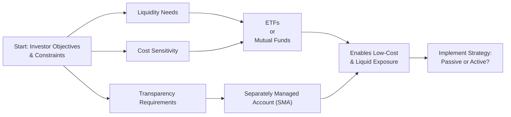
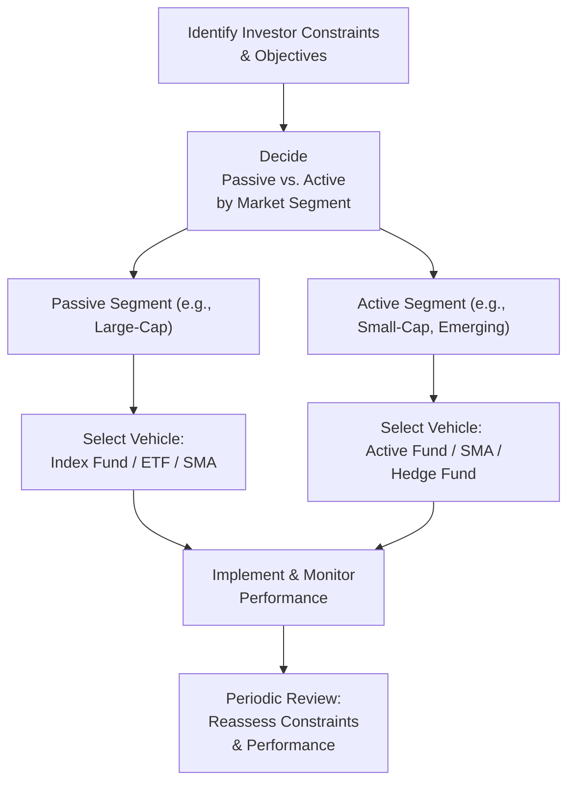

## Introduction and Context

So, let’s say you’re having a casual chat with a fellow investment manager—someone who’s juggling daily trades and reading markets like they’re best-selling novels. They might start throwing around terms like “index funds,” “ETFs,” “alpha extraction,” or “betas,” and you’re left wondering how all these fit into an overarching asset allocation plan. In many ways, deciding on a strategic implementation approach—passive or active—plus selecting the right vehicle (e.g., mutual funds, exchange-traded funds, etc.) can feel like choosing the right tool for the right job. You wouldn’t use a hammer to do a job better served by a screwdriver. The same is true with selecting between passive and active investment mandates.

But let’s not get ahead of ourselves. The purpose here is to dig deep into the core philosophies behind passive and active management, the trade-offs involved, the real-world constraints, and ultimately how to decide on the best route to achieve an investor’s specific objectives. We’ll also take a look at vehicle selection—because, well, you can craft the greatest strategy in the world, but if you’re stuck with a suboptimal investment vehicle, it might derail your returns.

## Passive Management: Aiming to Mirror the Market

Passive management is often the go-to approach when portfolio managers or investors want to capture general market returns without additional complexity. In other words, they aim to replicate the performance of a chosen benchmark or index—like the S&P 500, Bloomberg Aggregate Bond Index, or any number of global market indices. You might have heard someone say, “If you can’t beat the market, just be the market.” That’s exactly the ethos behind a passive strategy.

### How Passive Strategies Work

1. Index Construction:  
   The manager picks a familiar index—say, the S&P 500. They invest in all (or most) of the constituents in roughly the same proportions as the index weighting. This can be done via:  
   • Index mutual funds.  
   • Exchange-traded funds (ETFs).  
   • Direct indexation (where individuals hold all the stocks in an index in a personalized account).

2. Minimal Turnover:  
   Passive funds rebalance only when the underlying index changes. That typically means lower transaction costs and potentially lower taxes (depending on the jurisdiction), because there aren’t frequent trades.

3. Costs and Efficiency:  
   Because managers aren’t spending time (and money) on security research and analysis, a passive fund typically charges lower fees. Vanguard’s iconic S&P 500 Index Fund is often used as a benchmark for low-cost investing. You’ll often see expense ratios as low as a few basis points.

### Example: Index Mutual Fund

To keep it real, let’s illustrate with a small example. Suppose you invest $1,000 in an S&P 500 index mutual fund at an annual expense ratio of 0.05%. Over 10 years, ignoring market returns for simplicity, your cost adds up to around $50 on a $1,000 investment (over the entire period, it’d be slightly more if you compound it, but the point is it’s quite low).

### Pros and Cons of Passive Management

• Pros:  
  – Low fees and expenses.  
  – High transparency: you know you’re mirroring the underlying index.  
  – Generally strong long-term performance relative to many active managers, especially in efficient markets.  

• Cons:  
  – Limited potential for outsized (above-benchmark) returns.  
  – No tactical flexibility to escape market downturns.  
  – May inadvertently overweight certain stocks during index rebalancing (e.g., large-cap index that gets top-heavy in technology names).

## Active Management: Pursuing Excess Returns (“Alpha”)

Active management is the pursuit of beating a specified benchmark by employing security selection, factor tilts, or tactical asset allocation shifts. The idea is that a skilled manager—through deep analysis, unique insights, or advanced techniques—can generate alpha, defined as:

$$
\alpha = R_{\text{portfolio}} - R_{\text{benchmark}}
$$

where \\( R_{\text{portfolio}} \\) is the return of the actively managed portfolio and \\( R_{\text{benchmark}} \\) is the return of the relevant benchmark (e.g., S&P 500 if you’re measuring large-cap U.S. equity performance).

### Approaches to Active Management

1. Fundamental Analysis:  
   • Stock picking via company-specific research—earnings projections, management quality assessments, industry trends.  
   • Best known through “value investing,” “growth investing,” or a combination thereof.

2. Quantitative Analysis:  
   • Factor investing, using historically predictive factors (like momentum, size, quality, etc.).  
   • Algorithmic or systematic approaches to analyzing large data sets.

3. Tactical Asset Allocation:  
   • Shifting exposure among asset classes in response to short-term market conditions.  
   • Potentially overweighting or underweighting sectors, countries, or factors based on expected conditions.

### Vehicles for Active Management

• Actively Managed Mutual Funds: Managed to beat a benchmark with a stated investment style (e.g., large-cap growth).  
• Hedge Funds: May use leverage, short-selling, and derivatives for absolute return strategies.  
• Separately Managed Accounts (SMAs): Offers personalization; the manager invests according to the client’s risk and return preferences.

### Risks, Costs, and Realities

Active management can be a bumpy ride. The quest for alpha involves extra costs (research teams, portfolio manager compensation) and higher fees. On top of that, you have to consider the possibility of underperformance. Numerous studies, including analyses by Morningstar, indicate that many active managers fail to outperform their benchmarks after fees, especially in highly efficient asset classes like large-cap U.S. equities.

## Vehicle Selection

All right, let’s talk about the packaging. Whether you go passive or active, you still face a range of choices—ETFs, mutual funds, hedge funds, SMAs, commingled funds, or limited partnerships—each with pros, cons, and unique structures.

### Key Considerations

• Fees: Mutual funds sometimes carry higher expense ratios and possible sales loads. ETFs may have lower expense ratios but also can incur bid-ask spreads when trading.  
• Liquidity: ETFs generally trade intraday on exchanges; daily-traded mutual funds price once a day; hedge funds may have lock-up periods.  
• Transparency: ETFs publish holdings daily, while mutual funds usually disclose quarterly in many jurisdictions. SMAs can provide full transparency, as you directly own the underlying securities.  
• Minimum Investment: Some hedge funds and private partnerships demand substantial asset minimums (e.g., $1 million).  
• Regulation: Mutual funds and ETFs are often regulated under standardized frameworks providing certain investor protections. Hedge funds typically have fewer restrictions but are limited to accredited investors.

### A Visual Overview

Below is a simple Mermaid diagram illustrating a high-level flow for choosing a vehicle:

This is obviously simplified, but it gives you a sense of how real-world constraints—like liquidity needs, cost sensitivity, and transparency preferences—can steer you toward specific vehicles.

## Blended Implementation Approaches

Many institutional and individual investors end up blending passive and active approaches, aiming to capture the best of both worlds. Perhaps they’ll choose passive funds for large-cap U.S. equities (where efficiency is high and alpha is notoriously elusive) but opt for active managers in less efficient markets—like small-cap, frontier, or emerging markets—where skilled managers may uncover hidden gems.

### Case Study: Pension Fund Blend

Consider an institutional pension fund with a moderate risk profile and a 10-year time horizon. The fund’s internal team might adopt:  
• A passive U.S. large-cap equity sleeve (to reduce costs).  
• An active emerging market equity sleeve (to exploit potential inefficiencies).  
• A passive core bond allocation (for diversification).  
• An active high-yield bond fund (to capture potential alpha in credit selection).

The blended approach can help manage overall fees while also providing some alpha potential. Of course, the downside is increased complexity—more manager selection, performance evaluation, and potential manager turnover.

## Implementation Constraints and Regulatory Factors

It’s not all sunshine and roses, though. Many investors—particularly institutions like pension plans, insurance companies, or sovereign wealth funds—are bound by guidelines or regulations. Those might include:

• Limits on how much leverage they can use or how extensively they can employ derivatives.  
• Prohibitions against certain asset classes (e.g., no “exotic” or unregulated markets).  
• Stringent reporting standards.  

These constraints can limit the choice of either passive or active approaches. For instance, if a certain regulatory body requires absolute daily liquidity, the investor might not be able to hold a hedge fund or certain private placements.

## When to Consider Shifting from Active to Passive

The decision to move from active to passive can be a tough one, especially if you’ve grown fond of your star managers. But, if repeated performance reviews show managers consistently lagging an appropriate benchmark net of fees, it might be time to reduce costs and complexity. Performance attribution can help you figure out precisely where your alpha (or negative alpha) is coming from—sector tilts, style factors, security selection, or just luck. If, over a full market cycle, there’s little sign that alpha generation is sustainable, a low-cost passive approach often becomes more appealing.

## Market Efficiency Considerations

Some market segments are more efficient than others. Large-cap U.S. equities tend to be extremely well researched, making alpha generation difficult. In contrast, smaller or more specialized segments—like micro-caps, emerging markets, or certain bond niches—exhibit greater mispricing opportunities due to limited analyst coverage or lower transparency. That’s where active managers may shine, assuming they have the expertise to exploit these inefficiencies.

## Practical Tips, Pitfalls, and Best Practices

1. Fee Awareness:  
   Don’t underestimate the impact of fees on long-term performance—0.50% can add up to major sums over a decade.

2. Collective Knowledge:  
   If you’re choosing an active manager, look for consistent track records, robust risk management frameworks, and a clear investment philosophy.

3. Benchmark Selection:  
   Pick an appropriate benchmark to measure performance. If the benchmark doesn’t match the manager’s approach, the performance comparison might be misleading.

4. Rebalancing:  
   Keep an eye out for how each vehicle rebalances. Index funds may do so automatically when the index changes, while actively managed vehicles might have more frequent turnover.

5. ESG Integration:  
   More investors today weigh sustainability criteria in selecting managers. Passive ESG indices are on the rise, but specialized active managers can also integrate ESG factors in a more customized manner.

## Brief Personal Anecdote

I once spent months evaluating a boutique active manager specializing in macro strategies—someone who’d done remarkably well the previous year due to one timely call on global interest-rate movements. However, when I dug into the underlying exposures, it turned out a lot of their return was from a few leveraged bets that lucked out during a low-volatility environment. Over the next year, that same strategy performed poorly once volatility returned. It was a reminder for me—and hopefully you—that chasing last year’s top performers doesn’t always guarantee future success.

## Putting It All Together with an Implementation Flow

Here’s a high-level flowchart summarizing how you might approach these strategic implementation decisions:

## Final Exam Tips

• Understand the rationale behind choosing passive versus active for different asset classes.  
• Prepare to discuss examples of how fees and market efficiency influence these choices.  
• Stay alert to how constraints like liquidity needs or regulatory rules can tilt the preference for a particular vehicle.  
• Articulate a clear performance attribution approach to justify manager decisions.  

## References

• Bogle, John C., Common Sense on Mutual Funds.  
• Swensen, David F., Unconventional Success: A Fundamental Approach to Personal Investment.  
• Morningstar Research Center, “Active vs. Passive Fund Performance Analysis.”  

--------------------------------------------------------------------------------

## Mastering Passive vs. Active Mandates and Vehicle Selection Quiz



### Which statement most accurately describes a key advantage of passive management?

- [x] Passive management typically features lower fees and simpler implementation.
- [ ] Passive management always outperforms active management in all market segments.
- [ ] Passive managers have no need to rebalance their portfolios over time.
- [ ] Passive management provides more opportunities to achieve alpha relative to benchmarks.

> **Explanation:** The major advantage of passive management is lower cost and minimal turnover, not guaranteed outperformance or alpha-seeking behavior.

### In what market context are active managers most likely to outperform?

- [ ] Highly researched, liquid asset classes.
- [x] Less efficient, niche, or under-researched markets.
- [ ] Any market operating under strict regulation.
- [ ] Only large-cap U.S. equities, provided they are hedged.

> **Explanation:** Active managers traditionally have a better chance of outperforming in markets where there is less information available or fewer market participants, such as small-cap, emerging, or frontier markets.

### Which of the following best describes a blended implementation strategy?

- [ ] Using only one active manager and no other strategies.
- [ ] Splitting the portfolio into sub-portfolios based on different time horizons.
- [x] Combining passive strategies for efficient markets with active approaches for less efficient markets.
- [ ] Steadily rotating managers to capture last year’s winning strategy.

> **Explanation:** A blended strategy commonly uses a passive approach for highly efficient segments and employs active managers where mispricing opportunities may be greater.

### An ETF’s liquidity is primarily determined by which of the following?

- [x] The liquidity of the ETF’s underlying holdings and its trading volume on exchanges.
- [ ] The daily net asset value (NAV) published by the fund provider.
- [ ] The number of different cryptocurrencies tracked by the ETF.
- [ ] The willingness of the ETF’s manager to hold illiquid securities.

> **Explanation:** ETF liquidity relates both to the trading activity of the ETF itself and the liquidity of its underlying securities.

### Which of the following is NOT a commonly cited reason for selecting a separately managed account (SMA)?

- [ ] Greater transparency into underlying security holdings.
- [x] The ability to avoid all regulatory obligations.
- [ ] Customization of investment strategy for the individual investor.
- [ ] Potential for improved tax efficiency with direct security ownership.

> **Explanation:** SMAs do not allow investors to circumvent regulatory obligations; they must still comply with the relevant laws and regulations.

### If an institutional investor is constrained by regulations prohibiting derivatives and leverage, how might this affect their vehicle selection?

- [x] They might opt for mutual funds or ETFs that do not use derivatives or leverage.
- [ ] They must always select hedge fund vehicles given their lock-up periods.
- [ ] They can only use private equity partnerships to avoid derivatives.
- [ ] They must invest solely in separate accounts for all asset classes.

> **Explanation:** Many mutual funds or ETFs can be managed without leverage or derivatives, making them more suitable for investors subject to such constraints.

### What is the primary difference between active mutual funds and hedge funds?

- [x] Hedge funds can use leverage and lock-up periods more extensively, while active mutual funds typically cannot.
- [x] Hedge funds often require investors to be accredited and have higher minimums, while mutual funds are widely accessible.
- [ ] Mutual funds can never outperform their benchmarks, while hedge funds can.
- [ ] Hedge funds are always more transparent than mutual funds.

> **Explanation:** Hedge funds generally employ broader, less-regulated strategies (including leverage, short-selling) and often have higher barriers to entry, while mutual funds (active or passive) come with more regulatory restrictions and accessibility for smaller investors.

### In evaluating active manager performance, which factor is most critical to determine whether alpha is sustainable?

- [x] Performance attribution over a full market cycle net of fees.
- [ ] The manager’s short-term track record (6–12 months).
- [ ] The marketing materials provided by the manager.
- [ ] Whether the manager has a large number of holdings.

> **Explanation:** Sustainable alpha is best assessed through longer-term performance attribution, factoring in the manager’s investment style, risks taken, and net-of-fees results over multiple market conditions.

### Why might an investor prefer a passive approach for the large-cap U.S. equity portion of their portfolio?

- [x] Large-cap U.S. stocks tend to trade in highly efficient markets, making it difficult for active strategies to outperform net of fees.
- [ ] Large-cap stocks are illiquid and thus require a strong alpha-generating active manager.
- [ ] Large-cap funds generally have higher expense ratios that favor active management.
- [ ] Passive management is mandated by regulators for U.S. equity exposures.

> **Explanation:** Large-cap U.S. equity markets are generally considered very efficient, meaning mispricing opportunities are harder to find, and net-of-fee outperformance can be difficult to sustain.

### True or False: “Blended implementation strategies typically carry higher total expense ratios than purely passive approaches.”

- [x] True
- [ ] False

> **Explanation:** A blended strategy often includes both passive (low expense) and active (higher expense) components, which can push the total expense ratio higher than a purely passive approach.




