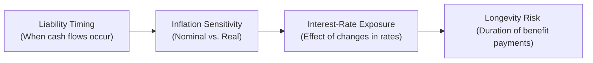
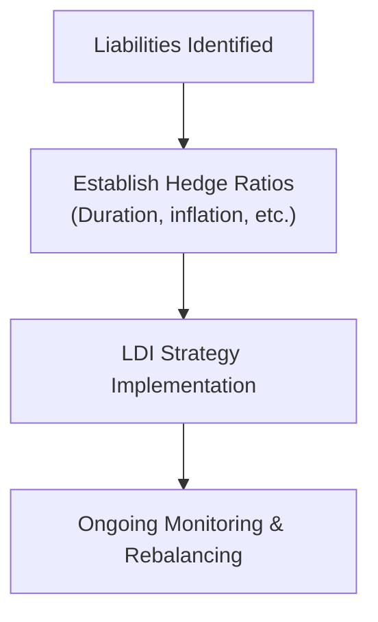

## Introduction

Sometimes, when people hear the word “liability,” they immediately think of debt or lawsuits. In finance, though, a liability can be something much more benign—like the obligation to pay pension benefits or an insurance claim in the future. If you’ve ever tried to help a friend plan for their child’s education costs, you know that a big part of the conversation is figuring out how much money will be needed and when. Then you (hopefully) figure out which assets can help meet that future expense. Well, that’s pretty much what professionals do when they talk about liability-driven investing (LDI). 

Organizations such as pension funds, insurance companies, and even endowments with defined spending policies all must structure their portfolios to meet specific cash-flow needs (liabilities). Understanding the nature of these liabilities—like their timing, how inflation affects them, or how changes in interest rates might affect the liabilities’ value—makes all the difference in designing a strategy that effectively meets them. 

In this article, we’ll explore the characteristics that make each liability unique. We’ll then dive into strategies for building portfolios that aim to match or hedge these liabilities. And—because we want to keep this lively and slightly informal—I might throw in a little personal anecdote here or there. Let’s dig in.

## The Unique Nature of Liabilities

Liabilities come in many shapes and sizes. Think about pensions: when they promise benefit payments to retirees, the nature of these future obligations depends on factors like staff longevity, wage growth, and interest rates. Meanwhile, an insurance company might have short-term liabilities (e.g., auto insurance claims) or much longer-term ones (life insurance payouts decades from now).

Some liabilities fluctuate with economic conditions—like those that are inflation-linked—and others are fixed in nominal terms. If you’re running a big pension fund, you don’t just want any random portfolio; you want a portfolio that can offset these risks. By properly sizing up liability characteristics—timing, size, sensitivity to interest rates, inflation exposure, and perhaps longevity risk—asset managers can more confidently craft an asset mix that stands a better chance of meeting those obligations.

### Why It Matters

I remember once talking to a friend who worked at a small pension fund; they had a big mismatch between the timing of their asset cash flows and their retiree benefit payments. Everything looked rosy until, all of a sudden, they had to liquidate assets at low prices to pay benefits on time. That mismatch jeopardized the plan’s funding status. The lesson? Maintaining an understanding of liability timing and structure is crucial for sustaining healthy portfolio performance in the long run.

## Key Liability Characteristics

We can think of each liability as having certain key traits:

• Timing of Cash Flows  
• Sensitivity to Inflation  
• Interest-Rate Exposures  
• Longevity Risk (especially for pensions or lifetime annuities)

Below is a simple diagram illustrating how different liabilities might unfold over time and why each consideration matters.

### Timing of Cash Flows

Some liabilities are due soon (like a short-term bond maturity), while others may not come due for decades (like pension payments for a 25-year-old new hire). From a portfolio perspective, we want to make sure that assets are aligned appropriately. This might mean choosing short-term bonds or more liquid assets for near-term liabilities, or employing long-duration instruments to match obligations that are far off into the future.

### Sensitivity to Inflation

It’s fairly common for pensions, especially in certain jurisdictions, to factor in cost-of-living adjustments (COLAs). If your liabilities are nominal (i.e., a fixed dollar amount per year), inflation is not a direct factor—though it can still affect your participants’ real purchasing power. But if your benefits promise to keep pace with inflation, you need to integrate inflation-hedging instruments like Treasury Inflation-Protected Securities (TIPS) or real return bonds, which may be used to preserve real purchasing power.

### Interest-Rate Exposures

Liabilities—especially those discounted at market interest rates—can behave a bit like long-duration bonds. When market rates drop, the present value of liabilities goes up (generally speaking). The good news is that, if your assets also have matching duration, they tend to increase in value at the same time. Many pension funds and insurance firms will see their liability values shift dramatically when interest rates move just a few basis points. The key is to ensure you have enough interest-rate sensitivity in the asset portfolio (via long-duration bonds, interest-rate swaps, etc.) to hedge these changes.

### Longevity Risk

For pensions and life annuities, longevity risk is the risk that retirees live longer than expected, resulting in more total payments than initially projected. It can be a significant risk for those guaranteeing lifetime incomes. Some advanced derivative products (like longevity swaps) exist, though they’re less mainstream, to help hedge that risk. But the primary strategy is ensuring that a plan’s assumptions around mortality rates are realistic and that there’s enough buffer in the assets to cover potential variations in life expectancy.

## Liability-Driven Investing (LDI) Strategies

In a nutshell, LDI is all about matching your assets to the risk profile of your liabilities. It’s basically the grown-up version of: “When I need to pay $1,000 next year, I want to be sure I have $1,000 next year.” Let’s break down the main frameworks.

### Duration Matching

Duration matching is a classic technique. Here, you try to align the portfolio’s duration with that of the liabilities. In simple terms, if your liabilities behave like a 10-year bond (which is an oversimplification, but okay for illustrative purposes), you want your aggregate portfolio to behave about the same way. So if interest rates dip, you don’t find yourself in the painful position of liabilities skyrocketing in present value while your assets remain flat.

But do keep in mind: if the shape of the yield curve shifts, matching “just duration” might not fully hedge. More sophisticated approaches incorporate key rate durations or partial durations to hedge along the entire term structure.

### Immunization

This approach is basically the “locking it in” method. You build a portfolio with the same duration and the same present value as your liabilities. You hope that, come what may in interest rates, your portfolio’s value and the liability’s value move in tandem. If done correctly, it theoretically ensures that, at the horizon date, the portfolio value should be enough to cover the liability payoff. 

In practice, though, an exact immunization requires constant rebalancing. Changes in interest rates and the passage of time will cause your portfolio (and your liabilities) to drift unless you adjust. Plus, immunization generally focuses on interest-rate risk alone. If you have liabilities sensitive to inflation or currency fluctuations, you may need to adapt the traditional immunization approach.

### Cash-Flow Matching

Cash-flow matching is the old-school approach. You directly match each liability cash flow with a corresponding asset cash flow. For example, if you know you need $2 million in five years, you might invest in a zero-coupon bond that matures in exactly five years for that exact amount. Voila—no reinvestment or interest-rate risk for that particular liability. This strategy can be pretty exact, but it can also be more expensive and less flexible. 

### Real Liabilities and Real Assets

When your liabilities are inflation-linked—like COLA-indexed pension benefits—nominal bonds don’t fully insulate you. Enter TIPS (or real-return bonds, depending on your region). TIPS will adjust your principal or coupon payments with inflation, providing a real return if held to maturity. Real estate or even certain commodities can help hedge inflation, but they come with additional complexity (price volatility, liquidity concerns, etc.). 

At a personal level, I remember explaining TIPS to my father when inflation was creeping up. He thought it was fascinating that the bond’s principal just steps up with inflation, basically protecting him from losing ground in real terms. Similarly, big funds might incorporate direct real estate or infrastructure investments to capture returns that move with inflation.

## Real-World Example: Pension with Inactive Liabilities

One typical scenario is the “mature” pension fund. This plan has many retirees (inactive members) who are currently drawing benefits. They might also have active members, but the retirees could represent a large chunk of liabilities. The plan knows that it has fairly predictable monthly benefit payments over the next 20 years or more.

• Timing: Monthly or annual payments until participants pass away.  
• Sensitivity to Inflation: If benefits include COLAs, then liability payouts increase.  
• Interest-Rate Exposure: The present value of those liabilities is very sensitive to long-term interest rates.  
• Longevity Risk: If retirees live longer, total payouts increase.

The pension fund might build a portfolio heavily weighted toward long-term bonds, possibly including TIPS if it’s sensitive to inflation. They may also employ an LDI overlay, using swaps to fine-tune duration. By doing so, the fund tries to ensure that a fall in interest rates (which makes liabilities more expensive) coincides with a rise in the value of their bond holdings, offsetting the pain.

## Combining Liabilities with Other Constraints

Rarely are liabilities the only consideration in a multi-asset portfolio. Many institutions also have some appetite (or necessity) for earning returns above the liability discount rate. So while part of the portfolio might be dedicated to immunization or duration matching, another part may be allocated to growth assets (equities, real estate, etc.) to generate surplus returns. The trick is balancing that growth objective with the risk of shortfalls. 

If you studied the risk factor approach from earlier sections of your CFA studies, you’ll recall that mapping liabilities to the correct risk factors helps in designing suitable hedges. But there can be curvature risk, model risk, and basis risk. Keep an eye on those sneaky devils.

## Conclusion: The Big Picture

Ultimately, liabilities come in all flavors. Designing an asset allocation that respects multiple risk exposures—interest rates, inflation, longevity, and more—requires a disciplined approach. The better you understand the “profile” of what you owe and when, the easier it becomes to build a targeted solution. 

It’s also crucial to monitor this alignment over time. Liabilities evolve, discount rates change, and policy environments shift. A monthly or quarterly check-in to see if your portfolio is still sized up against your liabilities is typically a good idea.

## Practical Exam Tips

• Know your definitions: LDI, duration matching, and immunization are pivotal.  
• In scenario-based questions, be able to describe how changes in interest rates, inflation, or longevity assumptions affect the value of a liability—and how you’d hedge those changes with an asset portfolio.  
• Expect item sets that discuss partial durations, yield curve shifts, or extension of liability durations.  
• For an essay-format question, you might be asked to propose a suitable portfolio to match a specific liability profile.  
• Practice explaining the difference between nominal and real liabilities and cite instruments that can address inflation risk.  

## Further Reading and References

• Fabozzi, F. J. (2001). Bond Portfolio Management. John Wiley & Sons.  
• CFA Institute (2025). “Liability Characteristics and Asset Allocation,” in 2025 Level III Curriculum, Volume 1.  
• Martellini, L., & Milhau, V. (2012). “Capital Consumption under Retirement Constraints,” EDHEC Risk Institute.

And, honestly, if you have the chance, talk to someone managing a pension fund or an insurance portfolio. Nothing beats real-world conversations to see how these theories play out.  
 
--------------------------------------------------------------------------------

## Test Your Knowledge: Liability Characteristics in Asset Allocation Quiz



### A pension plan has inflation-linked benefit payments. To hedge the plan’s liabilities most effectively, which instrument is generally most appropriate?

- [ ] Short-term corporate bonds
- [ ] A diversified equity fund
- [x] Inflation-protected government bonds (TIPS)
- [ ] A nominal long-duration government bond

> **Explanation:** Inflation-protected points directly address the inflation linkage of the pension’s liabilities, maintaining real purchasing power.

### A mature pension plan with primarily inactive members is concerned about rising interest rates. Which of the following best describes the relationship between interest rates and the plan’s liabilities?

- [ ] Liabilities increase in present value when interest rates rise
- [x] Liabilities decrease in present value when interest rates rise
- [ ] Liabilities are unaffected by interest rates
- [ ] Liabilities may increase or decrease, depending on inflation

> **Explanation:** As interest rates rise, the discount rate used to value liabilities rises, thus reducing the present value of those liabilities.

### When constructing a liability-driven portfolio, which of the following risk factors is least likely to be directly hedged?

- [x] Basis risk between equity factors
- [ ] Interest-rate risk
- [ ] Inflation risk
- [ ] Longevity risk

> **Explanation:** LDI typically focuses on hedging duration, inflation, and longevity exposures. Equity basis risk is not typically a core liability risk.

### Which of the following is a characteristic of immunization strategy in asset-liability management?

- [ ] Maximizing equity returns relative to liabilities
- [ ] Selecting assets with minimal credit risk only
- [ ] Relying on short duration assets in hopes of yield
- [x] Matching the duration and present value of assets to liabilities

> **Explanation:** Immunization focuses on matching both the duration and present value of assets to that of liabilities, protecting the portfolio from interest-rate changes over a specific time horizon.

### In practice, immunization must be updated regularly because:

- [x] Duration drifts over time as cash flows shorten
- [ ] It targets only inflation risk but not interest rates
- [x] Changes in yields can alter asset and liability durations
- [ ] It is a strategy that only works in stable markets

> **Explanation:** Immunization requires ongoing rebalancing to maintain the match between asset duration and liability duration as time passes and yields change.

### For liabilities that are linked to wage growth rather than standard inflation, which of the following is most relevant?

- [x] The growth rate of wages may exceed CPI-based inflation
- [ ] TIPS perfectly hedge wage-based liabilities
- [ ] Nominal bonds always outperform wage growth
- [ ] Wage growth is straightforward to forecast long term

> **Explanation:** Wage growth may deviate from CPI-based inflation, meaning it can be trickier to hedge and often requires a more specialized approach than just TIPS.

### In a cash-flow matching approach, the investor typically:

- [x] Buys securities that produce cash flows matching each liability payout
- [ ] Derives returns only from equities
- [x] Eliminates reinvestment risk for each matched liability
- [ ] Prefers shorter-term instruments for all liability horizons

> **Explanation:** Cash-flow matching invests in instruments that provide cash flows that align with each liability date. Once matched, reinvestment risk for that liability is minimized.

### What is the primary advantage of real assets (e.g., real estate) for hedging liabilities?

- [x] Their expected returns often have some inflation sensitivity
- [ ] They never experience market volatility
- [ ] They require no management oversight
- [ ] They have no correlation with interest rates

> **Explanation:** Real assets can help hedge inflation-related liabilities since many real assets’ incomes and values respond to inflationary pressures, although they still carry volatility.

### Which statement best describes the effect of longevity risk on liability valuation?

- [x] Increased longevity raises the total payout required, thus increasing liability value
- [ ] Individuals living longer reduce the total liability required
- [ ] Longevity risk has no effect unless interest rates are changing
- [ ] Only nominal bonds can hedge longevity risk

> **Explanation:** Longer life expectancies mean the liability (e.g., pension payments) must be paid over more years, thus increasing the total payouts and liability.

### A plan sponsor seeks to combine LDI with a return-seeking portfolio. Which is true?

- [x] The LDI portion hedges liability risk, while the return-seeking portfolio aims for surplus
- [ ] Both halves are entirely dedicated to real estate
- [ ] Liabilities are only matched through equities
- [ ] No rebalancing is necessary once initial allocations are set

> **Explanation:** By design, LDI hedges the liability’s risk exposures (interest-rate, inflation, etc.), while the return-seeking allocation attempts to generate excess returns. Rebalancing is still typically required over time.


