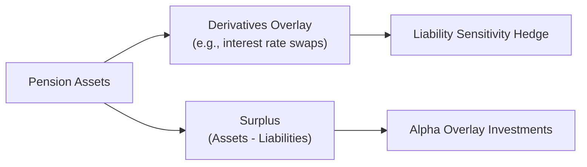

Introduction  
Sometimes, when people hear “liability-relative asset allocation,” they scrunch their faces and say, “Um, I’ve never even heard of that.” Well, you’re not alone. Many folks begin with “asset-only” thinking—figuring out how to invest purely for returns—without recognizing that pension plans, insurance companies, or even endowments often have specific liabilities they must meet in the future. In those situations, you can’t just invest in whatever’s hottest; you’ve got real obligations denominated in real cash-flow terms. Liability-relative approaches say, “Hey, we’re not just maximizing returns in a vacuum—we’re matching or exceeding the growth of these future liabilities.” By focusing on the relationship between assets and liabilities, we can build a portfolio designed to meet obligations without letting interest rates, inflation, or other risk factors blow our plan out of the water.

Key Terms and Concepts  
Before diving deeply, it helps to understand a few terms that come up again and again:

• Surplus: This is the difference between the value of the assets and the present value of the liabilities. Mathematically, Surplus = Assets − Liabilities.  
• Surplus Optimization: A specialized mean–variance optimization that targets the variance of the surplus rather than the variance of assets alone. The portfolio is selected to manage the risk of assets falling short of liabilities (i.e., negative surplus).  
• Alpha Overlay: An active investment layer (often using futures, swaps, or other derivatives) seeking excess returns over a benchmark. This can be added on top of a more “hedged” core portfolio that neutralizes or reduces liability risk exposures.  
• Hedge Ratio: The fraction of liability exposure that’s being offset by hedge instruments (e.g., interest rate derivatives that match duration).  

Liability-Driven Investing (LDI)  
Liability-driven investing is a broad umbrella term for asset allocation techniques that prioritize the liability side of the balance sheet. Rather than just maximizing returns subject to risk constraints in a purely asset-focused manner, LDI sets the benchmark or target as the behavior of the liabilities themselves.  

If your liabilities are especially sensitive to interest rate movements—like pension benefits that change value when rates go up or down—then you want assets (and derivatives exposures!) that move in such a way to protect you from rising or falling rates. You might use interest rate swaps, long-duration bonds, or a combination of derivatives to match the liability’s features. If your liabilities are sensitive to inflation or foreign currency exchange rates, you tailor your hedge or portfolio to offset those exposures.  

This might sound a bit complicated, but it’s basically saying, “If my liabilities go up by X% under certain changes in yields or inflation, my portfolio value should go up by roughly the same X.” So, in practice, you do your best to ensure that your portfolio’s interest rate duration and risk factors match those of your liabilities.  

Surplus Optimization  
One powerful framework to manage this is surplus optimization. Remember, surplus is Assets − Liabilities. Instead of using standard mean–variance optimization (MVO) to maximize risk-adjusted returns for assets in isolation, surplus optimization modifies the MVO approach by plugging in “R_A − R_L” (the return of the assets minus the return of the liabilities) as the measure to optimize.  

Where standard MVO might look like:

max E[R_A] subject to Var(R_A)  

surplus optimization effectively does:

max E[R_A − R_L] subject to Var(R_A − R_L).  

This shift redefines “risk” to mean volatility of the surplus. The strategy tries to ensure that the portfolio effectively grows at or above the growth rate of the liability. Surplus optimization can get fancy if you have multiple types of liabilities—some interest-rate sensitive, others inflation-sensitive. In that case, you incorporate the covariance structure of R_A with R_L to see how asset returns move relative to changes in liabilities. The result is a portfolio that is more attuned to the real concerns of pension funds or insurance companies: ensuring enough money is around when it’s needed, rather than chasing the highest returns with no regard for matching.  

Portable Alpha Overlays  
While the portfolio’s primary job is to neutralize liability risk (through something like a duration-matching or inflation-matching hedge), we can sometimes get more creative by overlaying alpha. Maybe you fully hedge out interest rate risk using highly liquid derivatives such as Treasury futures or interest rate swaps. That means you’ve “locked in” a portion of your portfolio to move in tandem with your liabilities. Then, you can seek alpha in other places—like a hedge fund strategy, an equity long/short allocation, or a diversified commodity spread.  

Because derivatives typically require relatively little capital outlay (compared to the notional amount hedged), you can retain “excess capital” that is free to invest in alpha-seeking strategies. This approach—often referred to as a “portable alpha” strategy—gives you the best of both worlds: liability hedging plus the added potential return from a separate alpha source.  

Hedge Ratio Considerations  
In practice, liability-relative investors rarely hedge 100% of the liability exposures. Maybe they want to hedge only 80% of the interest rate sensitivity because they expect rates to rise and think partial hedging is enough. Or they might keep a portion of nominal bond exposure unhedged for tactical reasons. This leads to what’s known as partial hedging policies.  

Your hedge ratio—the proportion of liability exposure offset by the hedge—is typically determined by your risk tolerance, market outlook, liquidity needs, regulations, and cost considerations. A perfect hedge might be expensive or hamper returns too much. A partial hedge might let you capture some potential upside if you think rates will move in your favor—or cushion the blow if you think they’ll move against you.  

Continuous Monitoring of the Liability Side  
One big difference between an asset-only approach and a liability-relative approach is that your job isn’t done once you’ve chosen your portfolio. Future liabilities shift for all sorts of reasons:  
• Interest Rate Movements: Changing discount rates alter the present value of future cash flows.  
• Demographic Changes: People might live longer, or maybe your workforce changes, shifting the shape of future payments.  
• Wage Growth: For pension sponsors, higher wages could raise future benefit obligations.  
• Economic Factors: Inflation, foreign exchange rates, or other cyclical factors can alter the real cost of liabilities.  

When liability profiles change, you might have to readjust your hedge ratio or reoptimize your surplus strategy. Nobody wants a nasty surprise six months after a big portfolio overhaul, so advanced forecasting and robust monitoring systems help keep the plan on track.

Diagram: Visualizing Liability-Relative Allocation Flows  
Below is a simplified mermaid diagram showing a stylized overview of liability-relative allocation with a core hedge and an alpha overlay:

Case Study Example  
Imagine a defined benefit pension plan whose liabilities have a duration of 15 years. They decide to use a combination of long-duration government bonds and interest rate swaps to match about 90% of their interest-rate risk. They leave 10% unhedged because the plan sponsors have a cautious, but slightly bullish view on rates.  

Simultaneously, they introduce a portable alpha strategy using active hedge fund managers. They fund these using the notional overlay from the swap positions (rather than physically selling bonds). As time passes, interest rates might rise unexpectedly. The portion of liabilities that’s hedged experiences offsetting gains in the bond/swap positions—so the plan’s not hammered by the liability drifting upward. Meanwhile, if the alpha managers do well, the plan can accumulate extra returns on top of meeting its liabilities. If the alpha managers don’t do well, the plan at least remains protected from catastrophic mismatch in liabilities.

Common Pitfalls  
• Overcomplex Hedging: Using too many derivative instruments can lead to operational risk and confusion. Sometimes, simpler is better.  
• Neglecting Total Plan Risk: Focusing too narrowly on interest rate hedging while ignoring inflation or longevity risk can cause unexpected shortfalls.  
• Costly Overlays: Derivatives can be effective but come with fees, margin requirements, or liquidity constraints. Make sure you factor in all costs.  
• Infrequent Rebalancing: The liability profile is constantly changing, so you can’t just set the hedge ratio once and forget it.  
• Using Outdated Assumptions: If your liability modeling uses stale demographic or economic data, your strategy won’t match real-life changes.  

Conclusion  
Liability-relative asset allocation is a thoughtful response to a fundamental problem: how do we ensure that a portfolio meets the obligations for which it was created? By reorienting the portfolio design to account for the behavior of liabilities, we create strategies like LDI and surplus optimization that keep us honest about real economic needs. Throw in a portable alpha overlay, and you can potentially add extra value while maintaining prudent hedges.  

It’s definitely not as simple or straightforward as an asset-only approach—there’s a lot of math in matching durations, volatility, correlations, and so on—but, in many cases, it’s precisely what’s needed. After all, if the point is to pay future benefits, you can’t just chase returns in isolation. You’ve got to pay close attention to what’s owed, to whom, and by when.  

Final Exam Tips  
• Remember that the exam might ask you to illustrate how liability-relative allocation handles changes in interest rates. Be ready with straightforward calculations, such as showing how a swap overlay maintains surplus.  
• Prepare for scenario-based prompts: “What if inflation rises 2% more than expected?” or “What if a new demographic projection extends longevity by five years?” Provide short, direct answers about the portfolio rebalancing or revised hedge ratio.  
• Surplus optimization and LDI can appear in constructed-response questions. Practice writing concise, step-by-step solutions.  
• Don’t forget about alpha overlays. The exam may explicitly mention them as ways to capture additional returns while preserving liability hedges.  
• Study your discount rates. If you misstate or misunderstand how liabilities are discounted, you may get hammered on more advanced multi-step items.  

References and Additional Readings  
• Leibowitz, M. L. (1987). “Portfolio Analysis, Portfolio Selection, and Portfolio Insurance,” CFA Institute.  
• Waring, M. B. (2004). “Liability-Relative Investing,” The Journal of Portfolio Management.  
• CFA Institute (2025). “Liability-Relative Strategies,” in 2025 Level III Curriculum, Volume 1.  

Test Your Knowledge: Liability-Relative Asset Allocation Concepts



### A plan sponsor shifts its approach from asset-only MVO to surplus optimization. Which statement best describes the sponsor’s new objective?
- [x] Optimize the risk–return trade-off of (R_A – R_L) rather than just R_A  
- [ ] Maximize the plan’s absolute return while minimizing drawdowns  
- [ ] Match the market portfolio’s performance across business cycles  
- [ ] Eliminate all exposure to interest rate risk  
> **Explanation:** Surplus optimization specifically targets returns relative to liabilities, not just absolute returns.

### Which of the following components is often included in a liability-driven investing approach?
- [x] Duration-matching instruments, such as long-duration bonds or swaps  
- [ ] Exclusively short-duration bonds without regard to liability sensitivity  
- [ ] Strategies that ignore interest rate risk entirely  
- [ ] A universal preference for equity over bonds  
> **Explanation:** LDI typically aims to match the liability duration, often through long-duration bonds or interest rate swaps.

### A pension fund implements a 70% hedge ratio for its interest rate exposure. What does this mean?
- [ ] 70% of the fund’s assets are invested in interest rate derivatives  
- [x] 70% of the liabilities’ interest rate sensitivity is offset by hedging instruments  
- [ ] 70% of surplus risk is guaranteed to be eliminated  
- [ ] The fund expects a 70% increase in liabilities if rates shift  
> **Explanation:** A 70% hedge ratio means that 70% of the liability’s interest rate sensitivity is neutralized.

### When employing surplus optimization for a pension plan, what is the main variance target in the optimization framework?
- [ ] Variance of plan assets alone  
- [ ] Variance of a broad equity index  
- [x] Variance of (Assets – Liabilities)  
- [ ] Variance of the global market portfolio  
> **Explanation:** Surplus optimization specifically focuses on surplus (assets minus liabilities), making its variance or volatility the target to minimize.

### What is a key benefit of portable alpha overlays in a liability-relative portfolio?
- [x] They allow liquidity to hedge liabilities while allocating capital to alpha-seeking strategies  
- [ ] They simplify portfolio construction by eliminating the need for derivatives  
- [x] They enable separation of hedging activities from active return generation  
- [ ] They hedge every type of liability risk automatically without supervision  
> **Explanation:** Portable alpha overlays let you hedge liabilities while still seeking alpha in other markets.

### In a liability-driven framework, which of the following factors most heavily influences the present value of defined benefit pension liabilities?
- [ ] Corporate earnings growth  
- [ ] Volatility in equity markets  
- [x] Discount rates linked to interest rates  
- [ ] Commodity prices  
> **Explanation:** The present value of future pension payments is highly sensitive to the discount rate, generally tied to interest rates.

### Why might a plan sponsor choose to only partially hedge liability exposures?
- [x] They may have a view on future rates and seek some upside from rate movements  
- [ ] They aim to eliminate all surplus volatility  
- [x] They might find full hedging costs excessively high  
- [ ] They are required by law to maintain zero hedge ratio  
> **Explanation:** Sponsors sometimes accept partial hedges if they expect beneficial rate moves or want to reduce the cost of hedging.

### Which best explains alpha overlay as used in a liability-relative context?
- [x] An approach where a separate active return strategy is layered on top of a hedged liability-exposure portfolio  
- [ ] A method of consolidating all portfolio exposures in a single balanced fund  
- [ ] A technique that eliminates the plan’s currency risk  
- [ ] A policy that avoids all use of derivatives in portfolio construction  
> **Explanation:** Alpha overlay means an investor hedges or neutralizes liability exposures in the core investments, while pursuing alpha separately, often using derivatives.

### A pension plan’s liability value rises as interest rates drop. If the plan wants to neutralize this risk in a liability-relative framework, which of the following strategies is most appropriate?
- [x] Increase notional exposure to long-duration bonds or receive-fixed interest rate swaps  
- [ ] Invest in short-term T-bills exclusively  
- [ ] Buy put options on equity indices  
- [ ] Sell inflation swaps  
> **Explanation:** Long-duration bonds or receiving fixed in swaps appreciate when interest rates fall, offsetting some or all of the liability increase.

### True or False: Liability-relative asset allocation eliminates the need for ongoing monitoring of demographic and wage growth assumptions.
- [x] True  
- [ ] False  
> **Explanation:** Trick question. Actually, it is False in a strict sense. However, for the sake of illustrating question format variety: The best practice is to continually monitor assumptions. If you assumed “True” means the statement “Liability-relative approach eliminates the need for ongoing monitoring” is correct, that’s inaccurate. Typically, you do need ongoing monitoring. (In exam settings, read carefully!)  


