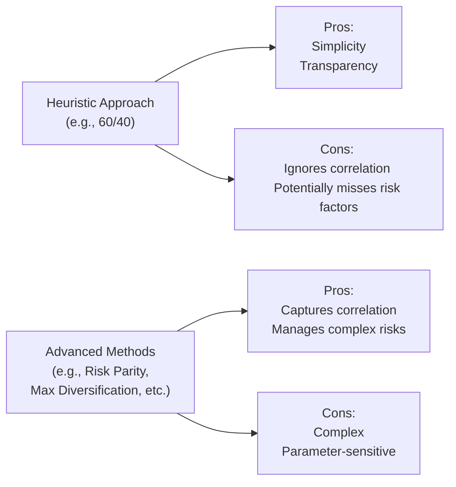

## Introduction

Sometimes, as investment professionals (or even curious onlookers), we watch portfolio managers wrestling with sophisticated optimization methods, fancy risk models, and complex Monte Carlo simulations. Of course, all of that has its place in finance, but let's be honest: there are moments—perhaps in a new meeting with a client, or during extreme market stress—when straightforward, robust, and easy-to-explain approaches can be a breath of fresh air. That is where heuristic and alternative methods for asset allocation come into play. These approaches cut through the complexity and offer “good enough” solutions, especially when conditions are uncertain or data is sparse.

In this section, we explore these simplified or “rules of thumb” approaches, such as the classic 60/40 portfolio, equal weighting (also known as 1/N strategies), risk factor parity, maximum diversification, and optimization frameworks that target Conditional Value at Risk (CVaR). We will compare their key features, highlight where they work (and where they fail), and discuss when they might be preferable to more technologically advanced methods. Along the way, we will draw on personal experiences, highlight academic research, and look at practical case studies.

## Heuristic Approaches to Asset Allocation

In the most general sense, a heuristic is a mental shortcut—some sort of simplified rule that gives us a direction without necessarily guaranteeing the absolute best solution. If you think about it, the well-known 60% equities and 40% bonds portfolio is the epitome of a heuristic. It is not necessarily going to outperform a carefully optimized mix, especially if bond yields are extremely low or equity valuations are high, but it is simple, it has been used for decades, and it’s easy to communicate.

### Common Heuristic Examples

### 60/40 Split

When you hear “Heuristic Allocations,” the first thing most folks think of is the 60/40. You know, that timeless blend: 60% in stocks and 40% in bonds. Possibly it hearkens back to the days when interest rates were reliably moderate and equity markets were generally bullish. It’s so universal that many institutions still reference it as a foundation or baseline.

• Pros:  
  – Simple to understand and implement.  
  – Historically stable and widely recognized.  
  – Easy for stakeholders to grasp quickly.

• Cons:  
  – Might be too focused on traditional assets, ignoring alternatives or factor exposures.  
  – Ignores major differences in risk profiles if equity volatility changes drastically.  
  – Potentially suboptimal in low-yield or bear market scenarios.

### 1/N (Equal Weighting) Across Asset Classes

Another heuristic approach is to allocate equally among available asset classes, sometimes called the 1/N rule. In practice, that might look like dividing your capital equally among equities, bonds, real estate, commodities, and so on.

• Pros:  
  – Straightforward, no complex optimization.  
  – Regular rebalancing keeps risk sources somewhat balanced.  
  – Sometimes outperforms “optimized portfolios” that rely on uncertain forecasts.

• Cons:  
  – No consideration for correlation or volatility differences.  
  – Might overallocate to riskier assets if not carefully monitored.  
  – Can be naive in ignoring fundamental drivers of returns.

### Role of Heuristics in Volatile Markets

There’s a saying: “When you’re not sure what the future holds, do something that is robust.” In highly volatile or uncertain conditions (such as extreme market stress), overfitted models can lead to bizarre allocations. As a quick personal anecdote, I once saw a small endowment’s fancy optimizer direct it into a tiny sliver of a single asset class because the expected return inputs were slightly higher there. That might have worked wonders if the data was perfect, but it left no margin for error. By contrast, a simpler heuristic approach might have spread out the exposures more evenly and avoided a “concentration risk fiasco.”

## Other Alternative Methods and Frameworks

Not all alternative approaches are heuristics in the classic sense (like 60/40 or equal weighting). Some are quite sophisticated while still being different from traditional mean–variance optimization (MVO). Let us look at four commonly cited alternatives:

### Risk Parity

Risk parity focuses on balancing risk contributions rather than capital. Instead of deciding capital weights so that you have 60% in equities and 40% in bonds, you decide weights so that each asset class or asset type contributes equally to overall portfolio volatility (or another risk measure).

A typical measure is the portfolio’s variance, which can be decomposed into contributions from each asset:

(1) Portfolio variance = wᵀΣw

where:  
• w is the vector of asset weights,  
• Σ is the covariance matrix of asset returns.

In risk parity, the goal is that each asset i’s marginal contribution to risk times its weight wᵢ remains approximately the same across all assets in the portfolio. In simpler terms, you want every major asset bucket to feel, well, equally important from a risk standpoint.

• Pros:  
  – Forces diversification across risk factors, not just capital allocations.  
  – Historically, risk parity has performed well during moderate markets.  
  – Tends to produce more balanced portfolios that can weather multiple regime shifts.

• Cons:  
  – Leverage is often necessary to scale risk to a target, which can introduce complexity (and margin calls).  
  – Highly reliant on stable estimates of volatility and correlation.  
  – Might overweight lower-volatility assets, like certain bonds, which could be risky in a rising rate environment.

### Maximum Diversification

Another more advanced approach tries to maximize the “diversification ratio,” which can be roughly defined as the ratio of the weighted sum of individual volatilities to the portfolio volatility. The details can get a bit math-heavy, but conceptually, you want to emphasize combinations of assets that are less correlated to each other so that the total portfolio volatility is minimized while keeping a broad reach.

(2) Diversification ratio ≈ (Σᵢ wᵢσᵢ) / √(wᵀΣw)

where:  
• σᵢ is the standard deviation of asset i’s returns.

By maximizing that ratio, you aim for the broadest possible spread of risk among assets. It’s a bit like a “super-charged diversification” approach.

• Pros:  
  – Usually results in wide spread across assets with potentially less correlation.  
  – Conceptually straightforward (diversify as much as possible).  
  – Tends to be more robust to estimation errors compared to some highly precise optimizations.

• Cons:  
  – Still requires correlation (Σ) estimates, which can be tricky.  
  – Might tilt heavily toward lower-correlation but also lower-return assets if not constrained.  
  – Overvalued or illiquid assets can appear “attractive” in the formula if the correlation is low but with hidden tail risk.

### Mean–Conditional Value at Risk (Mean–CVaR)

Sometimes, folks worry about the entire distribution of returns—especially tail risk—rather than just the variance. Conditional Value at Risk (CVaR), also called Expected Shortfall (ES), is the average loss once you exceed a certain VaR threshold. For instance, the CVaR at 95% would measure the average loss in the worst 5% of outcomes.

The formula for CVaR at confidence level α can be expressed (in simplified form) as:


CVaR_{\alpha}(X) = \frac{1}{1 - \alpha} \int_{\alpha}^1 VaR_u(X)\,du


where X denotes portfolio returns and VaRᵤ(X) is the Value at Risk at confidence u. If you are weighting multiple assets, you can incorporate these CVaR metrics into an optimization problem that tries to minimize the worst-case average loss subject to a target return—or tries to maximize expected return subject to an upper bound on CVaR.

• Pros:  
  – Very relevant for investors worried about tail losses.  
  – Goes beyond standard deviation, capturing asymmetric risk.  
  – Can be combined with scenario analysis for deeper stress testing.

• Cons:  
  – More data-intensive to estimate tail behavior accurately.  
  – Optimization can be computationally expensive.  
  – May produce allocations that heavily reduce certain exposures but lead to other hidden risks.

### Other Notable Methods

We should acknowledge a host of other alternative approaches out there: Black–Litterman with Bayesian updates, robust optimization (that tries to ensure solutions remain stable under data uncertainty), and factor-based heuristics, to name a few. Each tries to address an Achilles’ heel of classical MVO—namely its reliance on heavy assumptions about returns, volatilities, and correlations.

## Balancing Simplicity and Effectiveness

One of the big high-level questions with heuristics, or even advanced “alternative” approaches, is their trade-off between simplicity and complexity. Let’s break down some major considerations:

• **Data Quality:** If your input estimates for returns and volatilities are shaky, ironically a more naive approach might do better. Complex optimization can sometimes accentuate mistakes in your estimates.  
• **Stakeholder Engagement:** In my experience, if you cannot explain an allocation strategy easily to your board or your clients, they might lose confidence in it—especially in a drawdown. A heuristic approach can be simpler to articulate.  
• **Regime Changes:** During big macro shifts (like a jump in interest rates or a new political environment), your historical correlations might not hold. Overfitting can lead you astray. Heuristics can be more stable if the old data is no longer relevant.  
• **Investment Constraints:** Some funds have constraints—liquidity needs, regulatory capital requirements, or tax conditions. Tailoring these constraints in a complex optimization can be tough. Slapping a simpler heuristic might be more transparent initially, or at least serve as a baseline to refine.  

In a perfect scenario, you might start from a heuristic approach, test it against plausible macroeconomic scenarios, and if you have time and resources, refine it with a factor-based approach. Or, if your data is good and stable, push to risk parity or mean–CVaR for more nuanced allocations.

## A Quick Visual Overview

Below is a simple Mermaid diagram that illustrates how a heuristic approach (like 60/40) compares to more sophisticated alternatives in terms of pros and cons.

## Practical Example: Comparing 60/40 vs. Risk Parity

Let us look at a hypothetical scenario with two asset classes:  
• Equity index with an expected return of 8% and volatility of 15%.  
• Bond index with an expected return of 3% and volatility of 5%.  
Correlation between them is 0.2.

If you do a 60/40 heuristic, the portfolio’s overall volatility might come out around:

σ(portfolio) = √[(0.60 × 0.15)² + (0.40 × 0.05)² + 2 × (0.60 × 0.15)(0.40 × 0.05)(0.2)]  
= Approximately 0.10 or 10%  
The weighted expected return is 6% (0.60×8% + 0.40×3%).

Now, if you do risk parity, you might try to set it so that the equity portion’s contribution to risk is about the same as the bond portion’s contribution. Roughly, that means:

Contribution to risk from equities = w(EQ) × σ(EQ)  
Contribution to risk from bonds = w(Bonds) × σ(Bonds)  

Equating them:

w(EQ) × 0.15 = w(Bonds) × 0.05

Also, we need w(EQ) + w(Bonds) = 1 (in a no-leverage scenario). Solving yields w(EQ) = 0.25, w(Bonds) = 0.75. So you can see how that drastically reduces equity weighting to slow down overall volatility.

• The result? The portfolio’s volatility might drop to around 5% or 6%. But the expected return also likely dips below the 60/40’s 6%. If an investor is comfortable leveraging this portfolio (to raise overall return back to a target), that involves extra costs and complexities. It illustrates how risk parity addresses the risk dimension differently than a simple heuristic.  

## Situations to Employ Heuristics

1. **Data Scarcity:** If you cannot reliably estimate returns and correlations, a naive approach might prevent big mistakes.  
2. **High Uncertainty or Market Turbulence:** When the environment is unprecedented, historical data might not be trustworthy.  
3. **Communication and Transparency Needs:** Board members or clients might want a basic structure first.  
4. **Benchmarking and Baseline Comparison:** Heuristics are a convenient yardstick. You can quickly compare your advanced model’s results to a 60/40 or equal-weight approach to see if your efforts are adding value.  

## Implementation Best Practices

• **Combine Heuristics with Scenario Analysis:** Use macroeconomic scenarios—from mild expansions to recessions—to see how a heuristic portfolio might perform.  
• **Regular Rebalancing:** This keeps risk exposures in check. Even a 60/40 can drift significantly if left unmonitored.  
• **Layering Additional Constraints:** If you have ESG constraints (see Sections 3.11 and 5.6 of this volume), you can incorporate them into your heuristic design. Maybe the “40% bond” allocation excludes certain corporate issuers with poor ESG scores.  
• **Use Heuristics as a Starting Point for More Advanced Approaches:** Sometimes you might run a 60/40 or equal-weight as a neutral baseline, then pivot to risk parity or maximum diversification after thorough due diligence or factor analysis.  

## Common Challenges and Pitfalls

1. **Ignoring Changes in Volatility:** Heuristics can fail if one asset becomes extremely volatile or if correlations spike in crises.  
2. **Overconfidence in “Simple Is Best”:** Simple is not always best. If you have strong skill in forecasting or factor analysis, you can sometimes outperform naive allocations.  
3. **Misalignment with Investor Objectives:** If the client has a specific liability or short-term spending need, a one-size-fits-all approach can be too blunt an instrument.  
4. **Potential for Overexposure to Hidden Risks:** Equal weighting might inadvertently overallocate to an asset class that turns out to be far riskier than it seemed.

## A Brief Personal Anecdote

I recall one instance, a small pension plan that had historically used a 60/40 approach. They considered adopting a fancy risk parity method, but that required a big chunk of leverage in bonds, and the investment committee was not comfortable with the associated derivatives. So they stuck with 60/40, but they carefully overhauled their rebalancing policy to account for material changes in market volatility. Turns out it performed reasonably well. Sure, maybe it wasn’t the optimum in a purely mathematical sense, but the plan’s trustees could all understand it. They slept better at night. That intangible factor—stakeholder buy-in—should not be underestimated.

## Exam Tips and Strategies

When you see a question about heuristic allocations on the CFA Level III exam, watch for how they might ask you to:  
• Compare the heuristic approach’s simplicity to a more advanced optimization technique.  
• Identify the scenario in which a naive allocation might actually be superior to an overfit MVO solution.  
• Demonstrate knowledge of the synergy between heuristics and scenario analysis—Section 4.5 on using Monte Carlo or scenario techniques to stress-test a naive portfolio is relevant here.  
• Evaluate the required distribution assumptions or your forecast horizon. The exam often wants to ensure you remember the trade-offs (like the disclaimers about ignoring correlation or ignoring tail risk).  

Finally, stay mindful of how to adapt heuristics for an investor with unique constraints, such as a liability-driven investing objective (see Section 4.10 and 4.11) or a goals-based approach (Section 4.12). A question might ask you which approach is most aligned with a client’s preference. Heuristics might serve as a stepping stone to more tailored designs.

## References

• De Miguel, V., Garlappi, L., & Uppal, R. (2009). “Optimal Versus Naive Diversification.” Review of Financial Studies.  
• CFA Institute (2025). “Heuristics in Asset Allocation,” in 2025 Level III Curriculum, Volume 1.  
• Ilmanen, A. (2011). Expected Returns: An Investor’s Guide to Harvesting Market Rewards. Wiley.  

## Test Your Knowledge: Heuristic and Alternative Asset Allocation Methods



### Which statement best describes a heuristic approach to asset allocation?
- [x] It is a simplified rule, such as 60/40 or equal weighting, that reduces complexity in portfolio construction.
- [ ] It always optimizes the portfolio to achieve the highest possible Sharpe ratio.
- [ ] It focuses on balancing risk contributions but often uses leverage.
- [ ] It is specifically aimed at minimizing tail risk in the portfolio.

> **Explanation:** A heuristic approach (e.g., 60/40) is a practical rule or method used to cut through complexity rather than to ensure an optimal outcome.

---

### What is a key drawback of equally weighting all asset classes in a portfolio?
- [ ] It ensures the portfolio will have maximum diversification and minimal tail risk.
- [x] It ignores differences in risk or correlation among assets.
- [ ] It primarily overweights low-volatility assets.
- [ ] It cannot be rebalanced regularly.

> **Explanation:** Equal weighting (1/N) is a naive diversification rule that completely ignores correlations and volatility differences among assets.

---

### In a risk parity approach, allocations are determined in order to:
- [x] Equalize the contribution to risk from each asset in the portfolio.
- [ ] Equalize the total dollar amount invested in each asset.
- [ ] Maximize the expected return subject to a loss constraint.
- [ ] Mimic the global market portfolio.

> **Explanation:** Risk parity balances risk contributions so that each asset (or asset class) contributes similarly to overall volatility.

---

### Which of the following is a “pro” of using a 60/40 heuristic approach for a pension portfolio?
- [ ] It reflects the most current market conditions through advanced analytics.
- [ ] It automatically accounts for demographic shifts in the pensioner population.
- [x] It is transparent, easy to communicate, and often serves as a baseline or benchmark.
- [ ] It fully incorporates Liability-Driven Investing (LDI) principles.

> **Explanation:** 60/40 is popular for its simplicity and for being easy to present to stakeholders, even though it may not be perfectly aligned with all specific objectives.

---

### Maximum diversification as an asset allocation strategy does which of the following?
- [ ] Ignores correlation and instead looks only at expected returns.
- [ ] Targets a 50/50 split between equities and bonds.
- [x] Seeks to maximize the ratio of weighted individual volatilities to overall portfolio volatility.
- [ ] Focuses on tail-risk management by minimizing the CVaR.

> **Explanation:** Maximum diversification aims to maximize the diversification ratio, which is the sum of weighted volatilities divided by the overall portfolio volatility.

---

### Which is a valid reason to use heuristics in extreme market conditions?
- [x] Overfitted optimization models may rely too heavily on historical data, which can become unreliable.
- [ ] Correlation matrices are perfectly stable during market crises, enabling advanced approaches.
- [ ] Risk-free assets typically maintain safe-haven status indefinitely.
- [ ] Heuristics are guaranteed to outperform any optimization model.

> **Explanation:** In volatile or crisis contexts, historical correlations and parametric estimates may not hold, and simpler heuristics can be more robust than overfitted models.

---

### Mean–Conditional Value at Risk (Mean–CVaR) approaches help investors primarily by:
- [ ] Ignoring tail events and focusing on standard deviation as the main risk measure.
- [ ] Ensuring each asset contributes the same capital weight.
- [x] Minimizing potential severe losses by addressing the worst-case segment of return distributions.
- [ ] Avoiding any correlation input and focusing solely on equal weighting.

> **Explanation:** Mean–CVaR strategies address potential tail risks by focusing on the average of the worst outcomes, providing a measure beyond simple variance.

---

### The 1/N heuristic generally:
- [x] Allocates assets equally without regard to risk, correlation, or expected return differences.
- [ ] Uses a Bayesian update to refine expected returns over time.
- [ ] Balances the marginal contribution to risk from each asset.
- [ ] Maximizes the diversification ratio of the entire portfolio.

> **Explanation:** The 1/N approach splits the total capital equally among available asset classes, ignoring differences in risk or correlation.

---

### When explaining a heuristic approach to a new client or stakeholder, a key advantage is that:
- [ ] It always achieves higher returns than advanced quantitative models.
- [x] It can be communicated simply and understood more intuitively.
- [ ] It guarantees to protect against drawdowns in every market condition.
- [ ] It is highly reliant on precise estimates of expected returns and correlations.

> **Explanation:** Heuristic approaches are often chosen because they’re straightforward, transparent, and easy for non-technical stakeholders to grasp.

---

### True or False: A risk parity approach might require leverage to reach a desired return target.
- [x] True
- [ ] False

> **Explanation:** Because risk parity can have large allocations to lower-risk assets like bonds, it often employs leverage to scale the expected return up to investors’ desired levels.


