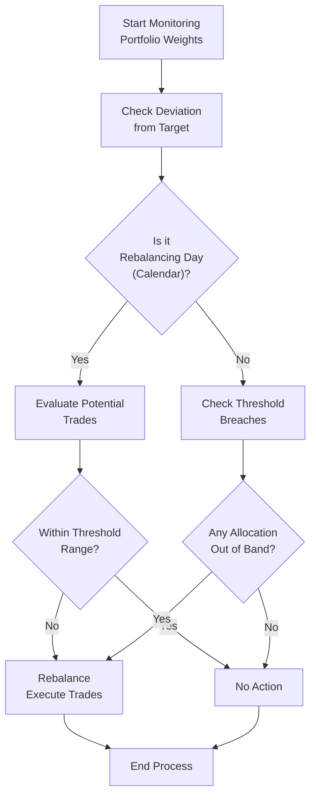

Introduction

Rebalancing a portfolio might sound straightforward—just buy and sell your various asset classes until you’re back to your target allocation, right? Well, sure, that’s the concept in a nutshell. But you know, I still remember the first time I tried implementing a threshold-based rebalancing policy in a real-life client scenario. I realized that while rebalancing definitely helps maintain desired risk exposures, the details (transaction costs, taxes, market volatility, liquidity constraints, among others) can make it quite a puzzle. This section will guide you through the finer points of rebalancing, exploring the forces that shape rebalancing decisions, strategies, and best practices.

Why Rebalance?

Before we dive into the nitty-gritty, let’s pause for a moment and ask: why rebalance at all? Over time, markets move, and the relative values of assets within your portfolio can drift away from their targets. Equities might rally, while fixed income lags, or vice versa. Left unchecked, that drift can change the overall risk profile of the portfolio, possibly creating an unintended heavy tilt toward one asset class. A systematic rebalancing approach—whether that’s on a strict calendar schedule or triggered by the magnitude of drift—helps ensure your portfolio stays in line with its strategic asset allocation (SAA) plan.

Key Rebalancing Methods

Calendar-Based Rebalancing  
Calendar-based rebalancing uses fixed intervals to review and potentially readjust allocations. Common intervals range from monthly to annually, depending on how actively engaged the investor wants to be. For instance, you might choose to rebalance every quarter-end. The advantage is simplicity and predictability: you know exactly when you’ll buy or sell, so you can plan for it. The downside, of course, is that if your portfolio drifts significantly right after one of these intervals, you may be stuck waiting for the next date to make any changes. This can prove costly during a period of rapid market swings.

Threshold-Based Rebalancing  
Threshold-based rebalancing (also called percentage-of-portfolio or band-based rebalancing) involves specifying tolerance bands around target allocations. For instance, if you have a 60% equity target, you might set a ±5% band, rebalancing only if equity weights deviate below 55% or above 65%. This approach can be more responsive to market movements, because you rebalance only when necessary. On the flip side, if markets whipsaw or drift around those thresholds, it can result in more frequent trading and possibly higher transaction costs—especially in choppy markets.

Hybrid Approach  
Some investors combine both approaches: they check the portfolio on a regular schedule (say, monthly) but only pull the trigger and rebalance if allocations are outside tolerable thresholds at that point. This provides a nice compromise, giving a routine for reevaluation while avoiding small, unnecessary trades. The hybrid method tries to capture the benefits of discipline (a set schedule) and flexibility (only rebalance when the deviation is material).

Factors That Influence Rebalancing Decisions

Transaction Costs  
Transaction costs are often the single biggest drag on rebalancing enthusiasm. These include brokerage commissions, bid–ask spreads, and market impact costs—particularly if you’re rebalancing a large portfolio. If your threshold is set too tightly, you might repeatedly trade in and out for small movements at a high cost. On the other hand, if your threshold is too wide, you might allow your portfolio to drift too far, inadvertently taking on more risk than you intended. Balancing these two extremes is key.

Taxes  
Taxes deserve special mention, especially in taxable accounts. Realized gains trigger capital gains taxes, which can eat into returns significantly. It’s one reason many high–net-worth investors track their unrealized gains and losses, delaying rebalancing in certain accounts until it becomes essential. Sometimes, rebalancing in tax-advantaged accounts first (where possible) helps limit immediate tax consequences. Another technique is to direct new contributions or income from coupons and dividends into underweighted asset classes (often called “cash-flow rebalancing”), helping avoid explicit sales of appreciated assets.

Volatility of Asset Classes  
Market volatility, especially on the equity side, can have a big effect on how quickly your portfolio drifts from target weights. During tranquil markets, a tight rebalancing band might not trigger many trades. But when storms gather and equity prices swing substantially, you might find you’re rebalancing more often, which can lead to higher transaction costs (and potential tax hits if in a taxable account). Some investors adopt a dynamic threshold approach, which adjusts the band size based on the volatility in the market.

Liquidity Constraints  
Large institutional investors, for example, large pensions or sovereign wealth funds, often invest in illiquid assets like real estate, private equity, or infrastructure. Rebalancing can be tricky when assets are locked up for multiple years. Imagine trying to quickly sell a commercial building just to meet your new target. Not very feasible! Thus, rebalancing decisions in these cases might be restricted to the liquid portion of the portfolio, which can sometimes lead to over-concentration in certain liquid assets.

Policy Guidelines and Governance  
Institutional investors typically have an Investment Policy Statement (IPS) that outlines rebalancing guidelines. For example, a policy can state that staff must rebalance whenever the portfolio weights deviate by more than 3% from the target, or they may require Board approval for trades above a certain size. That’s a formal governance constraint that shapes how rebalancing unfolds in practice. Governance also ensures that the entire process is disciplined and not driven by ad hoc emotional responses.

Behavioral Considerations  
Yes, we’re all rational professionals, or at least we strive to be—but it’s worth noting that in times of extreme market stress, the idea of selling assets that have performed well (or buying more of a declining asset) can feel counterintuitive. Behavioral biases like recency bias, loss aversion, and regret aversion might cause investors to drag their feet on rebalancing. Sticking with a systematic approach is often the best way to remove these harmful emotional impulses.

Impact on Portfolio Performance

Rebalancing can serve as a contrarian discipline: by selling what has been going up and buying what has lagged, you often “buy low” and “sell high” over the long run. However, it’s not a free lunch. Depending on the frequency of your trades, you can incur higher transaction costs. Also, in taxable accounts, repeated rebalancing can crystallize gains, which you then owe taxes on. Studies have shown that rebalancing can modestly reduce long-term portfolio volatility, but its effect on returns can vary. Sometimes, in bull markets that go on for years, frequent rebalancing might cause you to sell winning positions prematurely. Still, most investment professionals focus on controlling risk exposures rather than maximizing short-term returns, and rebalancing is essential to that process.

Let’s illustrate the interplay of rebalancing frequency and performance with a simplified numeric example:

• Assume a two-asset portfolio: 60% equity (E) and 40% fixed income (FI).  
• Over the course of one year, equity returns 20%, while fixed income returns 3%.  
• At the end of the year, your portfolio allocation is now approximately 64.5% E and 35.5% FI (because the faster-growing equity portion has grown significantly).  

If you do nothing, your risk exposure is now higher than your policy target. But if you rebalance back to 60/40, you’ll sell some shares of equity (realizing gains in the process). If taxes on those gains are high, that’s an immediate drag. But you’ve reduced the risk that your portfolio is carrying an outsized position in equity. Over the long run, that discipline can help you avoid an overweight in high-volatility assets just when negative shocks occur.

Dynamic Rebalancing Approaches

Dynamic rebalancing is a more advanced technique where you adjust thresholds or rebalancing frequency in response to market conditions, often indicated by volatility metrics. For instance, when volatility is low and the market is drifting gradually, you might use relatively wide thresholds. But if you notice heightened volatility—say the VIX is spiking or geopolitical event risk is exceptionally high—you could tighten your thresholds so that your portfolio does not drift too far from the target. This approach requires more sophistication, real-time monitoring, and possibly advanced analytical tools. It can help reduce transaction costs in stable markets while still keeping a close watch on risk exposures during turbulent periods.

Mermaid Diagram of the Rebalancing Process

Below is a simple Mermaid diagram that illustrates a typical rebalancing workflow. This diagram shows how an investor might progress from monitoring portfolio weights to choosing a rebalancing method (calendar or threshold) and ultimately deciding whether or not to execute trades:

This simplified chart helps visualize the conditional steps in rebalancing: either waiting for a scheduled date, or monitoring the portfolio for threshold breaches.

Practical Considerations and Case Studies

Case Study: High-Net-Worth Individual with Taxable Accounts  
Imagine a private investor who has large unrealized gains in equity positions acquired many years ago. Calendar-based rebalancing might realize significant capital gains every quarter, which is painful from a tax perspective. This investor might prefer an opportunistic approach, waiting until a fairly wide threshold is crossed before triggering a sale, or using fresh cash inflows to bolster underweight asset classes first. The tension here is balancing tax efficiency with risk management.

Case Study: Institutional Pension Plan with Policy Ranges  
A large pension plan typically invests in a combination of publicly traded securities and illiquid holdings (e.g., private equity, real estate). The plan has a formal Investment Policy Statement specifying permissible ranges around target allocations. Because private equity is revalued only periodically, the plan might focus primarily on rebalancing its liquid holdings. For example, if equity markets soar and push the plan’s public equity exposure above the permissible upper limit, the staff would sell some public equities to bring the total equity weighting back into line. The presence of illiquid assets complicates the rebalancing—staff tries to manage the total portfolio’s overall risk while recognizing that some assets can’t be liquidated quickly.

Case Study: Dynamic Threshold During High Volatility  
During a financial crisis—like 2008 or the volatile periods of 2020—some risk management teams adopt a dynamic threshold approach. When volatility spikes, the portfolio managers shrink their thresholds so that the portfolio is quickly brought back into alignment if it drifts. The rationale is that in more turbulent times, the risk of significant drawdowns is higher, and you want to remain on top of your allocations more frequently. Conversely, in calmer markets, the threshold might be allowed to widen.

Common Pitfalls and Tips

• Over-Trading: Setting thresholds too tight, or checking too often, can lead to excessive trading. Over time, that chips away at returns through transaction fees and spreads.  
• Ignoring Taxes: Trigger-happy rebalancing can lead to unnecessary capital gains realization. Seek to offset gains with losses (tax-loss harvesting) or do your trades in a tax-advantaged account if possible.  
• Wrong Frequency: Rebalancing too frequently can be as problematic as not rebalancing frequently enough. A general tip is to reevaluate monthly or quarterly, and only execute rebalance trades if your portfolio is truly out of alignment.  
• Behavioral Biases: Resist the temptation to override your systematic rebalancing plan because of fear, regret, or speculation that “this time is different.”  
• Illiquid Holdings: If part of your asset mix is illiquid, ensure you have enough liquid investments to handle rebalancing needs without forcing ill-timed sales of illiquid assets at a discount.  

Conclusion and Exam Tips

Any rebalancing policy should reflect an investor’s unique combination of objectives, constraints (including taxes and liquidity), risk tolerance, and cost considerations. Calendar-based approaches are simple and predictable but may not adapt quickly to market fluctuations. Threshold-based methods can provide responsiveness but can also lead to frequent trades and higher costs if not managed carefully. A hybrid method may offer an elegant blend of discipline and flexibility. For advanced practitioners, dynamic thresholds—adjusted in real-time to market volatility—can provide additional nuance.

In a Level III exam context, you should be prepared to:  
• Calculate the impact of rebalancing on portfolio weights after certain asset-class returns.  
• Discuss how taxes and transaction costs affect rebalancing frequency and thresholds.  
• Recommend a rebalancing policy with a rationale that reflects the investor’s constraints and behavioral considerations.  
• Evaluate the pros and cons of strict calendar-based versus threshold-based rebalancing.  
• Analyze special scenarios like high-volatility or illiquid assets demanding alternative approaches.  

The key is to connect these mechanics to real-world risk management. In a constructed-response question, you might be asked to compare rebalancing approaches for a client with different risk tolerances or unique tax situations. If you remember anything, recall that rebalancing is ultimately about keeping your portfolio’s risk exposures aligned with your investment objectives over time—without incurring unnecessary costs.

References and Further Reading

• Daryanani, G. (2008). “Opportunistic Rebalancing: A New Paradigm for Wealth Managers,” Journal of Financial Planning.  
• CFA Institute (2025). “Rebalancing Considerations,” in 2025 Level III Curriculum, Volume 1.  
• Plaxco, L., & Arnott, R. (2002). “Rebalancing and the Value Effect,” Journal of Portfolio Management.  

• For a deeper dive into how rebalancing interacts with asset allocation modeling, you might also revisit Chapter 3 on strategic rebalancing considerations and read about factor-based approaches in Sections 4.9 and 4.16.

--------------------------------------------------------------------------------

## Test Your Knowledge: Rebalancing Strategies and Their Influencing Factors



### In portfolio management, which of the following best describes a key benefit of rebalancing?

- [ ] It guarantees higher returns relative to a buy-and-hold strategy.
- [ ] It eliminates capital gains taxes on profitable trades.
- [x] It helps maintain the preferred risk exposure over time.
- [ ] It forces an investor to continuously increase equity allocation.

> **Explanation:** Rebalancing’s main purpose is to keep the portfolio’s risk exposures in line with the target allocations. It doesn’t guarantee outperformance over a buy-and-hold approach and can actually trigger taxable events.

### Which of the following is a disadvantage of a calendar-based rebalancing policy?

- [ ] It aligns perfectly with capital gains deferral strategies.
- [x] It may fail to act on significant short-term movements away from target allocations.
- [ ] It never triggers unnecessary trades.
- [ ] It guarantees minimal transaction costs in illiquid markets.

> **Explanation:** With calendar-based rebalancing, you may miss significant market moves if they occur soon after the last scheduled rebalance date.

### An investor who sets ±5% bands around a 50/50 equity/bond allocation, only rebalancing if allocations exceed 55% in equity or 45% in equity, is most likely using:

- [ ] A purely calendar-based rebalancing approach.
- [ ] A “buy-and-hold” strategy with no adjustments.
- [ ] A dynamic threshold approach based on volatility.
- [x] A threshold-based rebalancing approach.

> **Explanation:** Threshold-based rebalancing involves monitoring allocations and trading only when they deviate beyond preset tolerance bands.

### Suppose an investor’s target allocation is 60% equities and 40% bonds. After a strong equity rally, the portfolio is 65% equities and 35% bonds. The investor sells part of the equity holding to restore 60%. Which is a likely tax implication?

- [x] Realized capital gains on the equity portion sold.
- [ ] Capital gains are deferred indefinitely.
- [ ] Full tax exemption on the realized gains.
- [ ] Step-up in cost basis for all remaining equity holdings.

> **Explanation:** Selling appreciated equities triggers realized capital gains, generally creating a taxable event in non-tax-advantaged accounts.

### What is a potential advantage of a dynamic rebalancing strategy over a simple threshold-based strategy?

- [x] It adjusts threshold widths in response to market volatility.
- [ ] It eliminates all transaction costs.
- [x] It ensures zero capital gains tax on transactions.
- [ ] It mandates monthly trades regardless of portfolio drift.

> **Explanation:** Dynamic rebalancing shifts the threshold bands or rebalancing frequency based on volatility or market conditions. It does not guarantee free transactions or zero taxes.

### Which of the following statements best describes a hybrid rebalancing approach?

- [x] Rebalancing at regular intervals but only if allocations are beyond certain tolerance bands.
- [ ] Using different tolerance bands for bonds but not for equities.
- [ ] Checking for deviation daily, but never trading.
- [ ] Having no fixed interval for rebalancing decisions.

> **Explanation:** A hybrid approach involves reviewing the portfolio periodically (e.g., monthly or quarterly) but only executing trades if any asset class is outside the set threshold band.

### In a heavily taxable personal portfolio with large unrealized gains, one common approach to limit tax impact is:

- [ ] Frequent discretionary trading whenever markets move.
- [ ] Rebalancing strictly on a weekly calendar basis, ignoring tax implications.
- [x] Directing new cash flows to underweight assets first to avoid selling appreciated positions.
- [ ] Always selling the largest position first regardless of its cost basis.

> **Explanation:** Using contributions or new cash flow to correct underweights is often called “cash-flow rebalancing.” This can reduce or delay realizing capital gains comparedto outright asset sales.

### An institutional investor with significant illiquid allocations finds it difficult to rebalance frequently because:

- [x] Private equity and real estate holdings usually cannot be sold quickly at fair value.
- [ ] There is no need to maintain a target asset allocation.
- [ ] Transaction costs for illiquid assets are negligible.
- [ ] Illiquid assets typically have higher volatility requiring more frequent rebalancing.

> **Explanation:** Illiquid assets such as private equity and real estate often have long lockup periods and cannot be sold on short notice, restricting the ability to rebalance as markets shift.

### When volatility spikes in the broader market, dynamic threshold-based rebalancing would most likely:

- [ ] Widen its rebalancing bands to reduce transaction costs in a crisis.
- [x] Narrow its rebalancing bands to stay closer to target allocation.
- [ ] Halt all rebalancing until volatility settles.
- [ ] Shift entirely to a buy-and-hold strategy.

> **Explanation:** In dynamic approaches, higher volatility typically triggers narrower bands, ensuring the portfolio doesn’t drift too far from desired targets in a rapidly changing environment.

### True or False: Rebalancing is equally beneficial in tax-advantaged and taxable accounts.

- [x] True
- [ ] False

> **Explanation:** While rebalancing remains beneficial everywhere (it’s core to risk control), the method and frequency might differ to account for tax consequences in taxable accounts. The underlying benefit to maintain strategic targets still applies to both environments.


