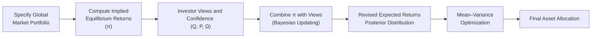

## Introduction

I remember the first time I encountered the Black-Litterman model in practice—my immediate thought was, “Wait, how does this solve all those nasty problems we get with traditional mean–variance optimization (MVO)?” You know, that uneasy moment after you tweak expected returns by a tiny fraction of a basis point and your optimizer goes crazy, suddenly allocating 80% to a small niche asset. It feels a bit unrealistic, right?

Well, the Black-Litterman approach steps in to address that kind of quirk. The basic idea is to start with something called the “implied equilibrium returns” from the global market portfolio (that is, the portfolio representing the entire market at large, often proxied by a broad multi-asset benchmark). Then we overlay our own “views” on top of those implied returns—so if we’re convinced that certain assets are undervalued, or if we think some new technology is going to disrupt an entire market, the model can incorporate those beliefs. But here’s the real beauty: the final combined result doesn’t just swing wildly and bet everything on your hunches. Instead, it carefully blends them based on how confident you say you are, producing more balanced, intuitive portfolios. Let’s dig into how it all works.

## Why Black-Litterman Matters

Classic MVO is great theoretically: rely on expected returns, variances, and covariances to get an “optimal” static portfolio. But in practice, minor estimation errors in expected returns can produce major differences in recommended allocations. It’s like walking a tightrope—one wrong step, and your portfolio is totally skewed.

The Black-Litterman model is a Bayesian-based approach, meaning we start with a prior (implied equilibrium returns that assume the market portfolio is efficient) and then update that prior with the investor’s views on certain assets. The result is a posterior distribution (our new best guess about expected returns). Confident in your view? We tilt more heavily toward it. Unsure? We don’t tilt much at all. So it’s the best of both worlds: the stability and diversification of the market portfolio plus your specialized insights.

## Building Blocks of Black-Litterman

### Implied Equilibrium Returns

At the heart of the Black-Litterman model, we have implied equilibrium returns. Think of them as the returns that, if everyone in the market believed them, would make the global market portfolio the “optimal portfolio” in a Capital Asset Pricing Model (CAPM) sense.

In a simplified form, we can express these implied returns (often denoted as π) using a relationship such as:

$$
\pi = \delta \, \Sigma \, w_m
$$

where:  
• \\( \delta \\) is a coefficient representing the market’s risk-aversion level.  
• \\( \Sigma \\) is the covariance matrix of asset returns.  
• \\( w_m \\) is the market-cap weight vector for the global market portfolio.

### Investor Views

Next come the investor’s views, which are typically about specific returns (like “I expect Asset A to outperform by 2%”). Let’s say we have a set of views summarized in a vector \\( Q \\). These views correspond to some weighting matrix \\( P \\), which captures how each view impacts each asset’s return. If a certain view involves only a single asset, the relevant row in \\( P \\) might place a weight of 1 on that asset and 0 on others.

### Confidence in Views

A key innovation in Black-Litterman is that we must specify how confident we are in each view. If we are super confident, we’ll give that view a correspondingly small uncertainty (variances in the so-called matrix \\( \Omega \\)), effectively weighting it more strongly. If we’re less sure, we’ll allow a wider variance, so the final return estimate doesn’t tilt as heavily.

### Bayesian Updating

All these inputs feed into a Bayesian updating formula that calculates a new set of expected returns, which gives us a posterior distribution:

$$
E(R) = \left[ \Sigma^{-1} + P^\top \Omega^{-1} P \right]^{-1} 
         \left[ \Sigma^{-1}\pi + P^\top \Omega^{-1} Q \right].
$$

There’s a fair bit of linear algebra going on here, but the gist is:  
• \\( \Sigma^{-1} \\) is the precision matrix of the prior (the equilibrium returns).  
• \\( P^\top \Omega^{-1} P \\) and \\( P^\top \Omega^{-1} Q \\) reflect how strongly your views weigh in, given confidence levels.  
• The expression in brackets collapses to a final vector of revised expected returns.

Anyway, it might feel a bit heavy at first but—take it from me—once you’ve walked through this a few times, the mechanics feel more intuitive.

## Putting It All Together

### Step-by-Step Overview

It might help to see a big-picture flow of how the Black-Litterman approach pulls everything together:

1. We start with the global market portfolio.  
2. Based on that market portfolio and the covariance matrix, we derive the implied equilibrium returns (\\( \pi \\)).  
3. We gather the investor’s views, including how confident the investor is about each view.  
4. We combine the implied returns with these views, adjusting for confidence, using Bayesian updating.  
5. The output is a new set of expected returns, which we feed into an MVO.  
6. The final step yields a hopefully more robust portfolio allocation that accounts for both market equilibrium and your specific insights.

### Dealing with Extreme Allocations

One huge perk is how the Black-Litterman model helps keep your portfolio from going off the rails when you tweak your assumptions slightly. By anchoring everything to the equilibrium returns, you’re effectively saying, “Unless I have a strong reason to deviate from the market consensus, I’ll stick pretty close to it.” This weighting effect means your final portfolio is typically more diversified. Goodbye, 80% allocations in obscure assets!

### A Quick Example

Let’s say we have three asset classes—domestic equity (weights 50%), international equity (weights 30%), and bonds (weights 20%). The global market portfolio we use has slightly different weights, but we incorporate them as the baseline:  
• \\( \pi_{\text{domestic eq}} = 5\% \\)  
• \\( \pi_{\text{intl eq}} = 6\% \\)  
• \\( \pi_{\text{bond}} = 3\% \\)  

We hold a bullish view on domestic equity, believing it’ll return 7%. Meanwhile, we’re neutral on international equity and bonds. After thinking it through, we set our confidence so that the domestic equity view has a moderate uncertainty, meaning we’re somewhat sure but not absolutely certain. The model then modifies the 5% prior domestic equity expected return upward, but not all the way to 7%. Perhaps the final figure ends up around 5.7%. That leads to a moderate overweight in domestic equity when we do the final MVO, but not an extreme shift.

## Implementation and Practical Considerations

### Data Requirements and Complexity

The Black-Litterman model can be computationally more involved than standard MVO. You need:  
• A reliable estimate of \\( \Sigma \\), the covariance matrix.  
• Market capitalization weights for the global portfolio.  
• A system or method to articulate your subjective views (matrix \\( P \\) and vector \\( Q \\)).  
• A logical framework for specifying confidence (matrix \\( \Omega \\)).

If you’re not comfortable with linear algebra or if your software doesn’t support matrix operations, it can feel a bit daunting. In many professional settings, the model is built into sophisticated portfolio management tools.

### Forming and Scaling Views

Part of the “art” of Black-Litterman is determining which views truly add value. If your views are random guesses, your final portfolio won’t fare well. You should have a disciplined process for generating these views—maybe they come from your firm’s research analysts or from certain fundamental signals. You also have to calibrate confidence levels appropriately. I’ve seen novices input overly certain views, skewing results as though they “know it all.” Actually, the more humility you have in practicing building confidence intervals, the more stable your outcomes are likely to be.

### Risk Aversion Parameter

That \\(\delta\\) in \\( \pi = \delta \Sigma w_m \\) is also a bit tricky to pin down in real life. Some folks simply guess or use historical risk premiums to back into \\(\delta\\). Others treat it as a tuneable parameter. The good news is that it’s often not super sensitive—within reason, small changes typically don’t break the model.

### Common Pitfalls

• Overconfident views: leads to large deviations from the market.  
• Poorly estimated covariance matrix: inaccurate correlations and volatilities hamper your posterior estimates.  
• Not reevaluating views frequently: a static set of views can become stale. The market environment might have changed, but your model is still living in the past.

## Connecting to the CFA® Curriculum

From a CFA Level III perspective, you’re likely to see scenario-based questions or constructed-response prompts asking how and why the Black-Litterman model might be preferable to “plain vanilla” MVO, or how you’d use certain subjective views in the model. You might also be asked to demonstrate knowledge of the formula or to interpret a new set of posterior expected returns. Above all, be prepared to discuss how the confidence level in each view influences the final weights.

## Conclusion and Final Exam Tips

The Black-Litterman model stands out as a more nuanced approach to asset allocation, one that begins by respecting whatever the global market portfolio suggests is “fair,” and then carefully layering in your convictions. By taking a Bayesian stance, it smooths out the dramatic shifts that can plague naive MVO. Make sure you can articulate:

• How implied equilibrium returns are derived.  
• The role of the investor’s views and how to incorporate confidence.  
• How to interpret the final portfolio weights and double-check that they remain stable even if your forecasts shift slightly.  

On the CFA Level III exam, keep in mind that this model is beloved for its practicality and its ability to anchor portfolio weights in the face of uncertain forecasts.

## Mastering Black-Litterman Approach: 10-Question Quiz



### The Black-Litterman model typically begins with which set of returns as its baseline?

- [ ] Historical average returns over the past five years.
- [ ] The investor's best guess of future returns for each asset.
- [x] Implied equilibrium returns derived from a global market portfolio.
- [ ] Risk-free rate plus an inflation premium.

> **Explanation:** The hallmark of the Black-Litterman approach is that it starts with implied equilibrium returns from the global market portfolio before incorporating investor views.

### Which term best describes the process Black-Litterman uses to integrate new information (investor views) into the prior distribution (equilibrium returns)?

- [ ] Frequentist adjustment.
- [ ] Linear regression.
- [x] Bayesian updating.
- [ ] Ordinary least squares.

> **Explanation:** Black-Litterman uses Bayesian methods to update the prior (implied equilibrium returns) with an investor’s subjective views, yielding posterior expected returns.

### In Black-Litterman, the investor's degree of conviction in their views is captured primarily by which matrix?

- [ ] The correlation matrix of returns.
- [x] The uncertainty or confidence matrix (Ω).
- [ ] The global market weights.
- [ ] The covariance matrix (Σ).

> **Explanation:** The Ω matrix dictates how certain or uncertain the model is with respect to each view. Lower variance in Ω indicates higher confidence in that particular view.

### A major advantage of the Black-Litterman model over naive MVO is:

- [ ] It guarantees a higher Sharpe ratio.
- [x] It typically avoids extreme allocations by anchoring on the global market portfolio.
- [ ] It requires no covariance matrix estimation.
- [ ] It eliminates all subjective aspects from portfolio construction.

> **Explanation:** By starting from market equilibrium weights and blending in investor views proportionally to their confidence, Black-Litterman tends to produce more diversified portfolios with fewer extremes.

### Suppose you have two views in the Black-Litterman framework. One view is that Asset A will outperform by 3%, and you are very confident in this. The second view is that Asset B will outperform by 2%, but you have moderate confidence. How would the model likely adjust expected returns?

- [x] Raise Asset A’s expected return by more than Asset B’s, reflecting higher certainty in the first view.
- [ ] Raise both assets’ returns equally since they are both positive.
- [ ] Lower Asset A’s return and increase Asset B’s return.
- [ ] Remove Asset B from the portfolio entirely.

> **Explanation:** With stronger confidence in the view for Asset A, the model will tilt A’s expected return more heavily upward relative to B’s.

### In the Black-Litterman formula, the term Σ⁻¹π can be viewed as:

- [ ] The realized variance of the global market portfolio.
- [x] The “weight” of the prior equilibrium returns in the posterior.
- [ ] An assumption that the market is always efficient.
- [ ] A measure of how many assets are mispriced.

> **Explanation:** Σ⁻¹π represents the precision-scaled prior returns (implied equilibrium returns). It is the model’s initial anchor before updating with new views.

### When determining the parameter δ in the expression π = δΣwₘ, which approach might a practitioner use?

- [ ] Assume δ = 0 to eliminate risk aversion from the model.
- [ ] Let δ = ∞ for maximum risk aversion.
- [x] Back into δ using historical data or a known market risk premium estimate.
- [ ] Choose δ randomly to avoid bias.

> **Explanation:** δ is commonly chosen to match historically observed risk premiums or the market’s implied risk aversion, ensuring more reasonable implied returns.

### Which is a potential pitfall when implementing the Black-Litterman model?

- [ ] Using time-varying views or updating them too often.
- [x] Overconfidence in subjective views, leading to heavy tilts away from equilibrium.
- [ ] Incorporating the global market portfolio equilibrium weights.
- [ ] Conducting Bayesian updating for new views.

> **Explanation:** Overconfidence can cause the model to over-tilt asset allocations. Balancing the investor’s subjective optimism with the equilibrium baseline is critical.

### The matrix P in the Black-Litterman model:

- [x] Converts abstract “views” into how each view impacts each asset’s return.
- [ ] Defines the global market portfolio weights.
- [ ] Reflects the inverse of the covariance matrix of returns.
- [ ] Doubles as a risk factor model.

> **Explanation:** The P matrix connects the investor’s specific viewpoints (on returns for certain assets) to the broader set of assets in the portfolio, indicating which assets are influenced by each view.

### The Black-Litterman approach, as compared to traditional MVO, is:

- [x] More stable and diversified due to anchoring on market equilibrium and scaled by confidence in views.
- [ ] Less robust because it ignores the global market portfolio.
- [ ] Unaffected by the covariance matrix of returns.
- [ ] Entirely view-based without reference to prior market data.

> **Explanation:** By blending equilibrium returns with subjective views, the Black-Litterman model reduces the likelihood of extreme allocations and produces a more balanced solution.



## References and Further Reading

• Black, F., & Litterman, R. (1992). “Global Portfolio Optimization,” Financial Analysts Journal.  
• He, G., & Litterman, R. (2002). “The Intuition behind Black-Litterman Model Portfolios,” Goldman Sachs Asset Management.  
• CFA Institute (2025). “Advanced Asset Allocation: Black-Litterman,” in 2025 Level III Curriculum, Volume 1.  

You can also explore various online resources that provide step-by-step corridor rebalancing examples, open-source toolkits with built-in Black-Litterman functions, and interactive demos to practice calibrating your own confidence levels. It might seem like a lot to digest, but once you truly understand Black-Litterman, you’ll probably wonder how you ever got by with just “plain vanilla” MVO. Good luck!


