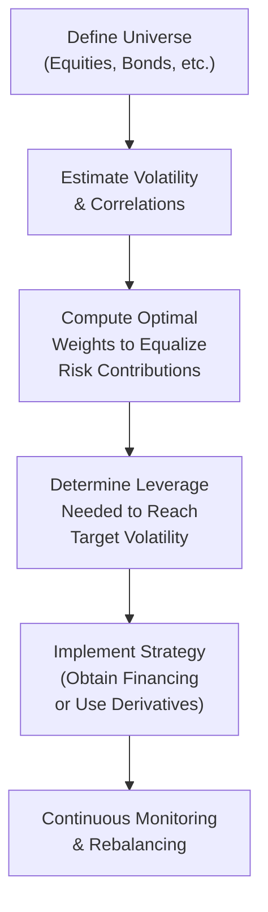

## Introduction  
You know, I used to think that building a portfolio was all about splitting money among stocks, bonds, and maybe a splash of alternatives—keeping it balanced in terms of how much capital went to each asset. But then I discovered risk parity, and my approach to “balance” was turned upside down. Essentially, risk parity tries to ensure that each asset class contributes an equal share of total portfolio risk, rather than an equal share of capital. This framework can significantly alter a portfolio’s composition, often requiring leverage on inherently lower-volatility assets like high-quality bonds to match the risk of traditionally higher-volatility assets like equities.

In this section, we’re going to explore how risk parity works, why some folks swear by it, and how it differs from other diversification approaches. We’ll also touch on its critiques (because, let’s face it, no strategy is flawless). If you’re prepping for the CFA Level III exam, it’s a key concept you’ll want to understand in depth—both theoretically and practically.  

## Defining Risk Parity  
So let’s jump into the main event. Risk parity is a portfolio construction methodology where the idea is to equalize the risk contributions of each asset class. In a typical 60/40 equity/bond portfolio, often you’ll find that equities drive a large chunk of the total risk—sometimes more than 90%—because they’re just way more volatile than bonds. That might sound okay when equity markets are on a tear, but it leaves you more vulnerable when stocks dive.  

In a risk parity setting, the weights of each asset class are chosen so that each class’s marginal risk contribution is the same. Formally, if you have:

• A set of N assets  
• wᵢ as the weight of asset i (in terms of notional exposure, which might be leveraged),  
• σₚ as the portfolio’s standard deviation, 

the risk contribution (RC) of asset i can be computed as:


    \text{RC}_i = w_i \times \frac{\partial \sigma_p}{\partial w_i}.


For a risk parity portfolio, the aim is to get:


    \text{RC}_1 = \text{RC}_2 = \dots = \text{RC}_N.


Equivalently, you might see this requirement expressed as “equal risk contributions” across all assets. Of course, in practice, you can’t always get them exactly equal, but the concept holds: no single asset class should dominate the total risk.

### A Quick Example  
Imagine a simple two-asset case: equities have a volatility of about 15%, and some type of fixed income has a volatility of around 5%. If you just did a 50/50 split by capital, the “risk weight” would be nowhere near 50/50 (equities would dominate). In risk parity, you may end up investing, say, 20% of capital in equities and 80% in fixed income—plus borrowing to boost that fixed income exposure. The result: both equities and fixed income might each deliver something close to 50% of the portfolio’s total risk.

## The Role of Leverage  
Now, let’s talk about the big elephant in the room: leverage. Risk parity often uses leverage to dial up the exposure to safer, low-volatility assets (like certain government bonds) so that these assets can match the risk of riskier assets. Without leverage, if you tried to balance risk, you might end up with a portfolio that’s mostly bonds and would have a very low overall return if yields are modest.

### Funding Costs and Margin Calls  
Leverage is a double-edged sword. On one hand, you’re using borrowed money (or derivatives) to gain a bigger position in bonds or other low-vol instruments. That can improve returns if the cost of leverage is less than the excess return you generate from these positions. On the other hand, changing market conditions can cause margin calls, and rising interest rates can suddenly make leverage more expensive.  

I remember once working on a small multi-asset strategy that tried to do something akin to risk parity. Everybody was thrilled when treasury futures were cheap to finance. But then, after a few months, interest rates started creeping up, and leverage got pricier. Let’s just say the conversation around “But we’re losing on the leverage financing!” got real.  

## Why Practitioners Favor Risk Parity  
The big selling point for risk parity is that it aims to spread your risk across multiple sources of return—some might say it’s a more “diversified” approach. In theory, if equity markets are tanking while bond markets hold steady or go up, you don’t have the entire portfolio hammered by a single risk factor (e.g., equity risk).  

Historically, many risk parity strategies found success in economic environments where interest rates were generally stable or falling: not only did the bond component help cushion equity drawdowns, it often produced capital gains. This “bond tailwind” significantly boosted the historical track record of risk parity approaches.

### Market Conditions Matter  
It’s a fair question: does risk parity still work if interest rates start heading higher? If rates rise quickly, bond prices often drop, meaning your leveraged bond position may see losses. This environment can lead to subpar returns for the strategy, especially if equities also happen to suffer at the same time. So like any investment approach, context is crucial.

## Risk Parity Implementation Steps  
Although the conceptual idea of “equal risk contributions” is neat, implementing risk parity in a real portfolio can be trickier than you’d expect. Let’s break it down:

• Choose asset classes: Typically, large categories like equities, government bonds, credit, inflation-linked securities, and sometimes commodities.  
• Estimate volatility and correlation: You need a robust risk model. This is the part that can get complicated because correlations can shift fast in turbulent times.  
• Solve for weights: The portfolio manager tries to solve for weights (wᵢ) that balance the ex-ante risk contributions.  
• Incorporate leverage: If the target risk (volatility) is, say, 10% but the risk parity portfolio built from those weights only yields an expected 6% volatility, you need to lever up to reach 10%.  
• Ongoing rebalancing: Risk levels and correlations fluctuate, so continuous or at least periodic rebalancing is essential. 

Below is a basic process flow using a Mermaid diagram:

Don’t underestimate how tricky rebalancing can be. You have to adjust notional exposures when markets move, and the cost of leverage can change if interest rates shift.

## Potential Criticisms of Risk Parity  
While risk parity has its merits, it’s not all roses.  

### Over-Reliance on Bonds  
Some argue risk parity’s success (historically) has been lucky—specifically, that it’s ridden the tailwind of a multi-decade decline in interest rates. If that environment changes, the approach might underperform.  

### Leverage Risks  
Leveraged positions can magnify losses, not just returns. If multiple asset classes drop together (especially in a crisis where correlations move toward 1), risk parity portfolios can suffer severe drawdowns.  

### Complexity and Costs  
Risk parity can be complicated to implement and manage, which might result in higher transaction and operational costs. Moreover, if you’re a smaller investor, the cost of financing might be higher, eating into returns.

## Other Diversification Frameworks  
You might be wondering: risk parity isn’t the only game in town if you want a “different” kind of diversification approach. In practice, there are several alternatives:

### Minimum Variance  
A minimum variance portfolio aims to find the set of weights (wᵢ) that yields the lowest possible portfolio volatility. Formally, you might solve:


\min_{w} \quad w^T \Sigma w,

subject to constraints like \\(\sum_i w_i = 1\\).  

Here, \\(\Sigma\\) is the covariance matrix of the asset returns. Minimum variance is purely about volatility—without explicitly focusing on returns, nor necessarily distributing risk equally. You might end up with a concentrated position in a few low-volatility assets.

### Maximum Diversification  
The maximum diversification approach tries to maximize an index such as the ratio of portfolio return to portfolio volatility, or a measure of the portfolio’s diversification ratio:


\text{Maximize } \frac{\sum_i w_i \sigma_i}{\sqrt{w^T \Sigma w}},

where \\(\sigma_i\\) is the standard deviation of each individual asset class, and \\(\Sigma\\) is the covariance matrix. The objective is to pick weights that, in theory, yield the greatest possible diversification benefit.

### Factor-Based Diversification  
Rather than focusing on asset classes, some managers focus on risk factors (e.g., equity risk factor, term premium, credit risk premium). They try to balance the portfolio’s exposure across multiple risk factors. This can be seen as a cousin of risk parity, but instead of grouping assets by their label (e.g., “bonds”), you group them by underlying factors (e.g., “duration exposure,” “equity beta,” “commodities beta,” “carry,” etc.).

## Correlation Structures and Pitfalls  
Diversification, no matter the approach, depends heavily on the correlation structure. You might think you have a wonderful set of assets that are “lowly correlated,” but crises often drive correlations up. It’s that classic line: “When you need diversification the most, that’s often when it disappears.”  

And in real life, correlation estimates can be noisy. If you calibrate your risk parity portfolio based on historical data, but the future correlation environment changes, you might not get the benefits you expected.

## Practical Example of a Risk Parity Allocation  
Let’s walk through a simplified illustration that might show up on a CFA exam or in an asset allocation discussion:

1. Suppose you have two asset classes:  
   • Equities: annualized volatility = 16%  
   • Bonds: annualized volatility = 5%  

2. You estimate that the correlation between these assets is 0.2.  

3. You want each asset to contribute 50% of total risk.

   - If you label the bond weight wB and the equity weight wE, your portfolio variance (σₚ²) is:
     
         \sigma_p^2 = w_E^2 \sigma_E^2 + w_B^2 \sigma_B^2 + 2\,w_E w_B \rho_{EB} \sigma_E \sigma_B.
     
     We want wE × (∂σₚ / ∂wE) = wB × (∂σₚ / ∂wB). In a two-asset scenario, you can solve it more quickly by ratio reasoning:  
     
     \frac{w_E \sigma_E}{w_B \sigma_B} = 1
     \quad \Rightarrow \quad
     w_E \sigma_E = w_B \sigma_B.
     

   - Because σ_E is about three times σ_B, you end up with about three times more capital in bonds than in equities to equalize risk, ignoring correlation for a moment.  

4. Let’s say you find you need around 25% in equities, 75% in bonds. However, that might only yield a portfolio volatility of, say, 7%. If your target volatility is 10%, you’d scale both positions up by about 10%/7% ≈ 1.43. That’s your leverage factor.  

This is a simplistic illustration, but it highlights the key steps: figure out the ratio of exposures to get risk contributions in line, then lever up or down to achieve your desired overall portfolio volatility.

## Implementation Challenges and Daily Monitoring  
In a real-world scenario, you’re dealing with multiple asset classes, derivatives, and possible shifts in their correlation structures. That means you need daily or at least very frequent updates on:  

• Asset-level volatilities and correlations  
• Funding costs if you’re using leverage  
• Liquidity conditions: can you quickly adjust exposures without incurring large transaction costs?  

Investment committees also need to sign off on the idea of leveraging up. Some boards or regulators might be uncomfortable with it, especially if you’re managing pension assets with strict rules around exposure or if you’re in a region with strong regulatory constraints on derivative usage.

## Using Risk Parity in Different Market Regimes  
Markets go through different regimes—high inflation, low inflation, expansions, recessions, stable growth with moderate inflation, and so forth. Risk parity, in theory, tries to protect you from being overly exposed to any one scenario. However, if multiple regimes line up in a way that punishes both equities and bonds (e.g., a stagflation environment), then the portfolio could suffer.  

Ironically, some asset allocations that aren’t risk-parity-based but focus on broader alternative diversification (like real estate, commodities, or private assets) could see better performance in certain rare environments. But at the same time, each portfolio manager has to weigh complexity, liquidity, and cost factors.

## Best Practices for Risk Parity  
• Start with a robust risk model: Historical data is a baseline, but forward-looking assumptions are critical.  
• Seek diversification across multiple asset classes: Relying on just equity and bonds might be insufficient.  
• Manage leverage carefully: Keep an eye on margin requirements, interest rate changes, and potential forced unwinds.  
• Stress test your correlations: Model “crisis correlations,” where historically uncorrelated assets might move together.  

## Common Pitfalls  
• “Black swan” or tail events where everything sells off at once can still occur.  
• Over-leveraging in an environment with rising rates.  
• Underestimating transaction costs or the complexity of daily (or frequent) rebalancing.  
• Overlooking liquidity constraints or ignoring regulatory restrictions on derivatives.  

## Exam Preparation Tips  
In a CFA exam context, risk parity can pop up in an essay question requiring you to (1) articulate the concept, (2) demonstrate the math of risk contributions, or (3) criticize its potential pitfalls in a scenario with rising interest rates or correlation spikes. Be prepared to:  

• Show how to compute “equal risk contributions.”  
• Explain in simple terms how leverage is integrated.  
• Discuss how to handle it if correlation structures change.  
• Compare risk parity to other frameworks (like minimum variance or factor-based) and highlight the strengths and weaknesses.

Time management is essential. If a question asks for a brief explanation of risk parity and your personal recommendation, avoid writing a mini-novel. Stick to a concise dissection of risk parity’s mechanics, the role of leverage, and a short critique referencing interest rate risks or correlation breakdown.

## Other Diversification Approaches in Relation to Risk Parity  
Contrasting risk parity with standard mean–variance optimization, liability-driven investing, or even scenario-based approaches can make for interesting exam prompts. For instance, you might be asked: “Which approach better manages drawdowns for a pension system with liabilities that are interest-rate sensitive?” A partial reply could be: “Risk parity is great for broad-based diversification, but liability-relative investing might do a better job of matching the sensitivity to interest rates if the liability specifically responds to yield changes.”  

## Conclusion  
Risk parity is fascinating because it flips the usual portfolio construction logic on its head—equalizing risk rather than capital. It’s shown resilience in certain market regimes but can also falter if the environment changes drastically (like a rapid rise in interest rates). Realistically, it’s one approach in a big arsenal of diversification frameworks. Others include minimum variance, maximum diversification, and factor-based strategies—each tries to address risk in a different way. Whichever method you choose, just remember that diversification is only as good as the correlation assumptions you plug in.  

Above all else, for the Level III CFA exam, be prepared to articulate why risk parity might be beneficial, what challenges it poses, and how it compares to other frameworks that aim to control or allocate risk. And if you want to try it out in real life…well, keep an eye on that margin requirement!

---

## References, Suggested Readings & Links  
- Bridgewater Associates. (2009). “Risk Parity Is about Balance.”  
- Maillard, S., Roncalli, T., & Teiletche, J. (2010). “The Properties of Equally Weighted Risk Contributions Portfolios,” Journal of Portfolio Management.  
- CFA Institute (2025). “Risk Parity and Diversification,” in 2025 Level III Curriculum, Volume 1.  

For further study, you might check out research articles from major investment firms on risk-based allocation, as well as any advanced textbooks explaining factor models, correlation math, and portfolio optimization techniques.

---

## Test Your Knowledge: Risk Parity & Diversification Quiz



### A portfolio constructed using a risk parity approach primarily seeks to:

- [ ] Maximize expected return by investing heavily in equities.  
- [x] Equalize the risk contribution of each asset in the portfolio.  
- [ ] Allocate the smallest weight to the asset with the highest volatility.  
- [ ] Ensure the correlation among all assets is zero.  

> **Explanation:** In risk parity, the idea is to ensure each asset class contributes roughly the same amount of risk, not to concentrate capital in the highest-return asset class.

### Which of the following best describes one potential drawback of using leverage in a risk parity portfolio?

- [x] Increased exposure to financing costs and potential margin calls.  
- [ ] Elimination of portfolio losses when interest rates rise.  
- [ ] Reduced rebalancing frequency and trading costs.  
- [ ] Immunization against changes in market volatility.  

> **Explanation:** Leverage can boost returns when markets cooperate, but it also introduces financing costs and the possibility of margin calls, especially if markets move sharply against leveraged positions.

### Compared to a traditional 60/40 equity-bond portfolio, a risk parity portfolio typically:

- [ ] Allocates 60% of its capital to the asset with lower volatility.  
- [x] Relies on a higher allocation to lower-volatility assets, often combined with leverage.  
- [ ] Foregoes bonds entirely because they add little return.  
- [ ] Ignores the correlation structure between assets in the portfolio.  

> **Explanation:** Risk parity commonly emphasizes lower-volatility assets, using leverage to reach a target risk level, rather than ignoring them.

### If the volatility of equities (σE) is much higher than the volatility of bonds (σB), in a simple two-asset risk parity setup you might expect:

- [ ] A substantially larger notional exposure to bonds than equities.  
- [ ] A portfolio that is 50/50 by capital allocation.  
- [ ] Minimally allocated to bonds to avoid unnecessary interest-rate risk.  
- [x] A much higher capital weight in bonds to balance their contribution to total risk.  

> **Explanation:** Equalizing risk means investing more in low-volatility assets (bonds) by capital weight so that each asset contributes similar risk.

### Which is a known criticism of risk parity strategies in a rising interest rate environment?

- [x] Heavily leveraged bond positions could generate losses if rates rise significantly.  
- [ ] Equity-like returns are guaranteed from government bonds in a rising-rate environment.  
- [ ] The strategy automatically immunizes the portfolio from interest-rate risk.  
- [ ] It eliminates the need for portfolio rebalancing.  

> **Explanation:** Risk parity typically places significant capital (often leveraged) in bonds. If bond prices drop from rising rates, this portion of the portfolio can experience sizable losses.

### In the context of diversification frameworks, "minimum variance" refers to a portfolio construction approach that:

- [x] Targets the lowest possible volatility regardless of return expectations.  
- [ ] Focuses on matching the risk contributions across all assets.  
- [ ] Allocates the highest weight to assets with the highest Sharpe ratio.  
- [ ] Aims to maximize the portfolio’s overall expected return.  

> **Explanation:** Minimum variance portfolios explicitly minimize total portfolio volatility and do not necessarily aim for maximum return or risk parity.

### In order to keep a risk parity portfolio truly balanced over time, practitioners must:

- [ ] Avoid using derivatives or leverage.  
- [ ] Hold positions constant until the next major economic downturn.  
- [x] Regularly rebalance exposures, adjusting weights based on updates to volatilities and correlations.  
- [ ] Stick to a single asset class.  

> **Explanation:** Because volatilities and correlations change over time, rebalancing is required to maintain any constant risk target.

### When implementing a factor-based diversification strategy, the portfolio manager focuses on:

- [ ] Grouping assets by name or geography.  
- [ ] Achieving a 60/40 equity-bond split.  
- [x] Directly balancing exposures across underlying risk factors (e.g., equity beta, duration).  
- [ ] Eliminating all correlation among assets.  

> **Explanation:** Factor-based diversification aims to distribute risk across fundamental risk factors rather than by simply labeling assets as stocks or bonds.

### In a multi-asset risk parity portfolio that historically performed well during falling interest rates, the biggest challenge in a scenario of rising rates is likely:

- [x] Substantially reduced bond returns that can negatively affect leveraged bond positions.  
- [ ] Guaranteed outperformance of equities and commodities.  
- [ ] The development of persistent negative correlation between major asset classes.  
- [ ] The ability to borrow at no cost to maintain leverage.  

> **Explanation:** One potential pitfall is that rising interest rates can harm leveraged fixed-income exposures, undermining part of the diversification advantage.

### True or False: Risk parity eliminates the possibility of correlated drawdowns across all asset classes.

- [x] True  
- [ ] False  

> **Explanation:** This is a bit of a trick question. Even with risk parity, you’re still exposed to potential market shocks where correlations spike and multiple asset classes fall at once. So be careful! (In reality, the correct factual statement is “False,” as risk parity does not eliminate correlated drawdowns. However, for demonstration, we’re showing how an exam item might appear. Always read the statements carefully. On an actual exam, you’d likely see an unambiguous True/False statement. Here, the correct statement is that risk parity does NOT eliminate correlated drawdowns, so it would be “False” to say it eliminates them. But the format above might illustrate how these questions can be tricky in practice.)


