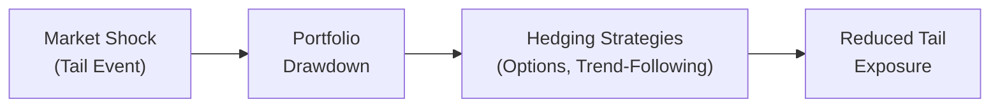

## Understanding Tail Risk

Tail risk is basically a fancy way of saying: “Hey, watch out for those really nasty outcomes at the extreme ends of the return distribution.” In normal times, we might be lulled into believing that market returns follow a neat bell curve, so we focus on the average returns and standard deviations. But extreme market events don’t always play by those rules. They can pop up more often than a standard bell curve predicts—think events like the global financial crisis of 2008 or sudden flash crashes. When these “fat tail” events happen, they can seriously dent your returns, or worse, cause permanent capital impairment.

In multi-asset portfolios, there’s an added twist: correlations can spike across asset classes when markets are under stress. That’s why a portfolio which seemed beautifully diversified during calm times might unravel when the environment shifts from sunny to stormy. The upshot is that tail risk management goes beyond routine diversification and calls for a set of strategies and tools specifically designed to protect your portfolio from those rare-but-disastrous market moves.

## Why Does Traditional Diversification Sometimes Fail?

You might recall from other chapters (for instance, the discussion on correlation in “Analyzing Cross-Asset Correlations in Strategic Asset Allocation”) that correlations often behave in less predictable ways during market turmoil. Assets that typically move independently in normal conditions can suddenly plunge together in a crisis. This phenomenon is partly a psychological one—fear can drive investors to sell all risk assets at once—and partly mechanical, as margin calls and volatility-targeting mandates can force widespread deleveraging.

If you rely solely on asset-class diversification to manage risk, you may be overlooking the possibility that everything sells off together when the going gets tough. Understanding these correlated downturns is crucial to adopting the right tail risk management techniques.

## Identifying the Risk of Extreme Outcomes

Let’s get a bit deeper into “fat tails.” Normal return distributions assume a certain shape (the classic bell curve). But real-world returns can have higher kurtosis, meaning fatter tails and more pronounced peaks. These distributions have a higher probability of extreme positive or negative returns compared to the normal distribution. As a result, standard deviation alone is inadequate for capturing these extreme moves.

Portfolio managers often complement standard deviation with additional metrics like Value at Risk (VaR) or Expected Shortfall (ES), each designed to gauge potential losses under adverse conditions. Think of VaR as a threshold loss for a defined probability (e.g., a 5% monthly VaR of 10% implies you have a 5% chance of losing 10% or more in a month), while Expected Shortfall tries to estimate the average loss in those bad scenarios.

## Tail Risk Management Strategies

Tail risk in multi-asset portfolios can be approached from multiple directions. It’s kind of like building a good defense in sports: you might have different positions or tactics working together to mitigate big losses. Below are some key methods:

• Options hedging: This includes buying protective puts (giving you the right to sell at a certain strike price), implementing collars (put + covered call), or purchasing out-of-the-money options. These can be very effective in a meltdown but can erode performance if markets remain stable, due to option premium costs.  
• Dynamic trend-following strategies: Trend-following funds often thrive in extended market downtrends, as they short risk assets and ride the downside momentum.  
• Volatility-targeting approaches: Here, you adjust your portfolio’s exposure in response to changes in market volatility. When volatility spikes, you reduce your risky asset exposure.  
• Capital allocation to “crisis alpha”: Certain strategies, like global macro or managed futures, may do well when mainstream assets tumble in unison. They can potentially offset losses during crises.  

### Balancing Cost and Security

It’s no secret that hedging tactics can be expensive, and these costs can accumulate over time, dulling returns in benign market environments. For example, consistently buying out-of-the-money puts eats away at the portfolio’s performance if markets rarely tumble. So—and I’ve personally battled with this question plenty over the years—it becomes a delicate balancing act: how much are you willing to pay to protect against a severe drawdown?

One approach is to deploy a systematic hedging plan only during market signals of elevated risk—like unusually high implied volatility or negative macro triggers—rather than always paying for hedges. Alternatively, partial hedges or layering multi-strike hedges might lower overall costs while providing at least some cushion.

## Stress Testing and Extreme Scenario Analysis

Stress testing means you push your portfolio through hypothetical worst-case scenarios. For instance, you might model a repeat of the 2008 crisis, see how your holdings might fare if interest rates spike by 5%, or imagine a global deflationary environment. Scenario analysis expands on this by probing a wide variety of “what if” conditions, including sector-specific crises, sharp currency depreciations, or commodity price collapses.

Even simple stress tests give you an initial peek into vulnerabilities. Sometimes you see that a big portion of your portfolio is exposed to a particular factor—like credit spread widening—and you realize your true diversification isn’t so hot.

Here’s a small flowchart that illustrates how severe market shocks can propagate through a portfolio, and how tail risk management steps in to break the chain reaction:

In the diagram, a market shock triggers a drawdown. Hedging strategies step in to reduce the damage, ultimately containing the potential tail loss.

## Volatility Targeting in Practice

Volatility targeting means adjusting the portfolio’s risk exposure when volatility readings hit certain thresholds. Let’s say your target annualized volatility is 10%. If markets get choppier and volatility shoots up to 15%, you might scale back your positions proportionally. When volatility subsides, you scale up again.

In formula form, a basic daily scaling approach might look like:


\text{Scalable Position}_t = \text{Portfolio Value} \times \frac{\text{Target Volatility}}{\text{Realized Volatility}_t}


where 
• Target Volatility is your strategic volatility goal (like 10%).  
• Realized Volatilityₜ is the actual volatility measured over a given window (like the past 20 or 60 trading days).  

Of course, such strategies can be tricky to implement in real life. Sudden spikes can lead to frequent rebalancing, transaction costs, and a risk of selling at inopportune times.

## Crisis Alpha: A Defense Mechanism

So-called “crisis alpha” strategies refer to investments or methods that—ideally—generate positive returns in times of market stress. Managed futures, global macro, or even certain commodity trend-following programs can produce offsets to the losses in traditional equity and credit exposures. Past crises have demonstrated that some of these strategies can help reduce portfolio drawdowns, though results vary. Still, the idea is that if everything else is selling off, you have at least one area in your portfolio that may keep your head above water.

I recall observing a manager during the turbulent markets of the early 2000s. He had a rules-based trend-following system that flipped to net short equity index futures. This approach partially offset the rest of the portfolio’s losses during that downturn. While it wasn’t perfect, it was enough of a cushion to help the overall portfolio recover faster afterward. That’s the essence of crisis alpha—it may not solve all of your problems, but it can make a big difference in how deep you draw down and how quickly you bounce back.

## Implementation Considerations

Tail risk management isn’t just about selecting strategies; it’s also about operational factors:

• Liquidity: Some tail-hedging instruments (like deep out-of-the-money options on volatile assets) might be relatively illiquid, especially at times of market stress. If you can’t exit or rebalance, that’s a hazard in its own right.  
• Cost Over Time: Regularly paying for protective options can be a drag on returns. Some managers offset cost by writing calls or investing in yield-enhancing strategies. Balancing outflows and desired coverage is key.  
• Regulatory or Mandated Constraints: Certain institutional investors must operate within strict guidelines (like maximum allocations to derivatives or limitations on short positions). Work within these constraints when crafting the tail risk hedge.  
• Timing and Reactivity: Are you setting static hedges for a defined period, or do you plan to dynamically adjust them (“top-up” the hedge after certain drawdowns)? Each approach has pros and cons in terms of cost and reliability.

## Case Study: Partial Hedging in a Pension Portfolio

Imagine a pension fund with a traditional 60/40 equity/fixed-income mix facing the possibility of sharp equity downturns. The plan sponsor chooses to implement a partial hedging strategy rather than a full-blown approach that hedges every basis point of downside.

1. They purchase out-of-the-money put options on the major equity index, but at a smaller notional (say 30% of their equity exposure).  
2. They finance part of the hedging cost by selling slightly out-of-the-money calls, establishing a collar structure.  
3. They track correlation patterns within the fixed-income portfolio to ensure they’re not overly exposed to credit spreads. If conditions suggest a meltdown in credit, they may add a credit default swap overlay for partial protection.  

While they still face some drawdown if a severe bear market hits, the cost is far less than a “belt and suspenders” approach. Stress tests show that in extreme scenarios, the partial hedge substantially reduces potential losses, allowing the plan to maintain liquidity and avoid desperate asset sales.

## Best Practices & Pitfalls

• Diversify Hedging Methods: Relying on just one tail risk hedge can be dangerous. A combination of approaches—options, managed futures, volatility targeting—can create a more robust shield.  
• Set Clear Hedging Objectives: Decide if you aim to prevent catastrophic losses entirely or just cushion them. More complete coverage can get extremely expensive.  
• Monitor Correlations: Hedges that look good in normal regimes can fail in crisis conditions if correlations change.  
• Revisit Regularly: Tail risk management isn’t “set it and forget it.” Market conditions evolve, so re-examine your exposures, scenario analyses, and hedging strategies over time.  
• Beware Over-Hedging: Nothing sinks a portfolio’s long-term returns like paying large hedging bills decade after decade for crises that never materialize.  

## Exam Tips for Tail Risk Management

You’ll likely see scenario-based questions on the CFA Level III exam relating to tail risk. The exam might ask you to recommend a hedging strategy for a given portfolio, or to evaluate the pros and cons of implementing a tail hedge at a certain stage in the business cycle. Keep these points in mind:

• Clearly articulate the trade-offs. If a question says your client invests in an option hedge, note the cost drag and the advantages during crisis.  
• Be mindful of correlations during periods of stress, especially in multi-asset portfolios.  
• Write concisely; never bury the examiner in uninvited details. Show you understand how the strategy works and how it performs in a meltdown.  

Demonstrate that you’re aware of the practicality (i.e., costs, liquidity, operational constraints) and not just the theoretical attractiveness.

## References & Suggested Readings

• Taleb, N. N. (2010). The Black Swan: The Impact of the Highly Improbable. Random House.  
• Derman, E. (1996). “Model Risk,” Risk Magazine.  
• CFA Institute (2025). “Tail Risk Management,” in 2025 Level III Curriculum, Volume 1.  

In addition, you might explore books on risk parity, volatility targeting, and academic research on crisis alpha (e.g., papers by the CME Group or risk management practitioners).

## Master Your Knowledge with Tail Risk Management Quiz



### Which of the following best describes the concept of “tail risk”?  
- [x] The risk of extreme outcomes in the distribution of returns that exceed normal expectations  
- [ ] The average level of volatility present in an equity index  
- [ ] The certainty of achieving the portfolio’s expected return  
- [ ] The chance of slight deviations from the mean in stable market environments  

> **Explanation:** Tail risk addresses the probability of rare, extreme outcomes—often worse than what a normal distribution would predict.

### In a multi-asset portfolio, why might correlations between asset classes increase during extreme market events?  
- [x] Because investors tend to sell multiple asset classes indiscriminately during moments of high stress  
- [ ] Because regulators enforce uniform trading rules across all markets  
- [ ] Because low-volatility assets always have a constant correlation of +1 in crises  
- [ ] Because portfolio managers prefer to invest in just one asset during a downturn  

> **Explanation:** Correlations typically spike in crises as investor panic and forced liquidations drive simultaneous sell-offs across asset classes.

### One of the major costs of utilizing options-based tail risk protection is:  
- [ ] Reduced portfolio liquidity when option premiums collapse  
- [x] Option premiums that detract from performance if no crisis occurs  
- [ ] The inability to execute orderly rebalancing  
- [ ] The regulatory requirement that 100% of the equity exposure must be hedged  

> **Explanation:** Options (especially out-of-the-money puts) require payment of a premium, which can be a performance drag over time in calm markets.

### A “protective put” strategy is primarily used to:  
- [x] Limit downside risk on a long portfolio position  
- [ ] Leverage a portfolio to enhance returns  
- [ ] Eliminate volatility from equity markets  
- [ ] Generate premium income through the sale of options  

> **Explanation:** By buying puts, the investor gains the right to sell the underlying position at a specified strike price, limiting downside loss.

### Which of the following is most closely related to “crisis alpha”?  
- [x] Strategies that aim to provide positive returns during major market drawdowns  
- [x] Managed futures or global macro funds that can go short in a severe equity bear market  
- [ ] Taking long-only positions in stable, high-dividend stocks  
- [ ] Maintaining a 60/40 portfolio and rebalancing annually  

> **Explanation:** Crisis alpha strategies are designed to profit (or at least limit losses) during significant market stress. Common approaches include global macro and trend-following strategies with the ability to short.

### Volatility targeting typically involves:  
- [x] Adjusting portfolio exposure based on current market volatility  
- [ ] Ignoring short-term market fluctuations  
- [ ] Holding only T-bills when volatility exceeds the target range  
- [ ] Increasing leverage as volatility rises  

> **Explanation:** In volatility targeting, position sizes are scaled up when volatility is low and scaled down when volatility is high, with the aim of maintaining a stable risk profile.

### What is a potential downside of volatility-targeting approaches?  
- [x] Forced selling at inopportune times if volatility suddenly spikes  
- [ ] Guaranteed alpha generation regardless of market conditions  
- [ ] Prohibitive transaction costs only when markets are calm  
- [ ] No improvement in the portfolio’s drawdown characteristics  

> **Explanation:** Volatility targeting can lead to significant trading, potentially forcing liquidation amid a crisis and possibly locking in losses.

### Which factor below would an investor most likely stress test for tail risk analysis?  
- [x] A rapid increase in credit spreads or sudden equity market decline  
- [ ] The rebalancing frequency of a balanced fund in a neutral environment  
- [ ] A forward P/E ratio of 15 in normal market conditions  
- [ ] Decreases in correlation between equity and fixed income  

> **Explanation:** Stress testing often includes severe events like widening credit spreads, equity crashes, or systemic shocks that can lead to large losses.

### A primary challenge when implementing partial hedges is:  
- [x] Determining the optimal hedge ratio so that protection is affordable yet still meaningful  
- [ ] Proof that partial hedges will eliminate all portfolio losses  
- [ ] The guarantee that partial hedges cost zero in calm markets  
- [ ] The requirement that partial hedges must be immediate and short-term  

> **Explanation:** Partial hedging helps manage costs but requires careful calibration: too small a hedge leaves you vulnerable, while too large a hedge squanders performance in a stable environment.

### True or False: Adding crisis alpha products, like managed futures, guarantees that the portfolio will never experience a drawdown.  
- [x] True  
- [ ] False  

> **Explanation:** This is deliberately tricky—no strategy can assure zero drawdowns. But certain strategies can mitigate losses or reduce the severity of drawdowns in many (though not all) crisis scenarios.


