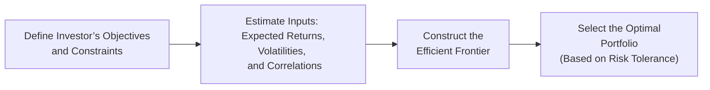

## Introduction

Let’s say you have a friend who’s saved up for years and is finally ready to invest. They have read a little about diversification—and maybe they’ve heard some buzzwords like “Mean–Variance Optimization (MVO)”—but they’re not sure why or how it helps in constructing a portfolio. In a nutshell, MVO is a quantitative tool that helps locate an efficient blend of assets for a target return, all while keeping risk in check. But, well, it’s not a magic wand or anything: You have to feed MVO the right data, apply realistic constraints (like your friend’s liquidity needs), and interpret its results carefully.

Below, we’ll dig through the big steps you need to pull off an MVO-based asset allocation. We’ll check out how folks estimate the key inputs: expected returns, volatilities, and correlations. We’ll see how the “efficient frontier” gets plotted, and how we might select the “best” portfolio from that curve based on risk tolerance (the willingness to take risk) and risk capacity (the financial ability to sustain losses). We’ll also see why it matters to justify every assumption and how to adapt MVO outputs for real-world constraints—like if your friend has a rule to never hold more than 40% in equities or has to keep a certain fraction earmarked for short-term obligations.

Our journey will loop in scenario analyses and historical stress tests to see how the recommended portfolio might hold up in tough times. In short, we’ll go from theory to practice so that a recommended allocation isn’t just a black box but a tool that lines up with an investor’s goals, constraints, and beliefs.

## Understanding Mean–Variance Optimization

Mean–Variance Optimization begins with a simple idea: you want to create a portfolio of multiple assets that, as a group, produces the highest expected return for a given level of risk, or the lowest risk for a chosen expected return. Yes, that’s basically the Markowitz rule from modern portfolio theory, but in practice, we often tweak it for constraints and real-world conditions.

In standard form, the MVO process tries to minimize portfolio variance (or volatility, if you prefer) subject to achieving a target return. The formula often looks something like:


\text{Minimize: } w^T \Sigma w


subject to:


w^T \mathbf{R} = R_{target} \quad \text{and} \quad \sum_i w_i = 1,


w_i \ge 0 \quad \text{if a no-short-selling constraint is in place.}


where:

• w is the vector of asset weights (i.e., the fraction of the portfolio allocated to each asset).  
• Σ is the covariance matrix of asset returns.  
• R is the vector of expected asset returns.  
• R_target is the desired portfolio return.  

Once you solve that, you end up with one point on the “efficient frontier.” You can vary R_target to generate a set of points—each a “portfolio”—and these together form the frontier.

## Estimating Key Parameters: Returns, Risks, and Correlations

MVO’s utility depends heavily on the inputs:

• Expected returns  
• Standard deviations (volatilities)  
• Correlations (or covariances)  

If you’re off with these forecasts, your friend’s portfolio might look neat on paper but be poorly prepared for reality. People often ask about “garbage in, garbage out,” and yep, that risk is real. So a big chunk of your job is gathering good data. You might rely on:

• Historical returns to form baseline expectations.  
• Forward-looking research from reputable market strategists or in-house economists.  
• Analyst forecasts for specific sectors.  
• Modeling macroeconomic relationships (e.g., real GDP growth affecting certain revenue streams).  
• Adjustments for known policy changes or structural shifts in the economy.

It’s also common to season these numbers with a bit of judgment. If you believe the last 10 years saw abnormally low interest rates and that one day rates might “normalize,” your volatility and correlation estimates for certain assets might be revised upward.

### Practical Example

Suppose you decide to forecast a 7% expected return for global equities, a 3% return for government bonds, and a 5% return for a real estate index fund. Next, you estimate that equities might exhibit an annual standard deviation of 15%, bonds 4%, and real estate 10%. Correlation among these asset classes, in your best guess, might be around 0.3 for equities/real estate, 0.1 for equities/bonds, and 0.2 for real estate/bonds.

You’d then feed those numbers into your MVO program (could be a simple spreadsheet solver or a specialized platform) to generate possible allocations that lie on the efficient frontier.

## Constructing the Efficient Frontier

The result of MVO is often displayed as an efficient frontier on a risk-return graph. Each point on the curve represents a unique portfolio with the maximum expected return for a given level of risk (or minimum risk for a certain return).

We typically observe that adding low-correlation assets (such as treasury bonds or alternative asset classes) will often “bend” the frontier to the left (less risk for the same return), thereby enhancing diversification benefits. In a perfect MVO world, each investor chooses the point on the frontier that aligns with their risk tolerance.

## Selecting the Optimal Portfolio Based on Risk Tolerance

Risk tolerance, in simple language, is how comfortable someone is with the possibility of losses in exchange for potential upside. Meanwhile, risk capacity is about how much risk their finances can handle without wrecking their essential goals—a retiree living off fixed income has less risk capacity than a 30-year-old with a long horizon, for instance.

### The Tangency Portfolio

If short sales and leverage are allowed, many advisors look for the tangency portfolio—where a straight line from the risk-free asset touches the efficient frontier. That portfolio is arguably the best risk-return combination if you can freely borrow or lend. However, not everyone can or wants to take on leverage, so in many real-life settings, we look at a custom “highest utility” portfolio on the efficient frontier for each investor’s profile. Some folks might need more stable returns, so they pick a lower-risk point on the frontier. Others might be comfortable with quite a bit of volatility if it means a shot at higher returns.

### Integrating Constraints

In real life, an investor might say, “I can’t hold more than 50% in equities,” or “I need at least 10% in cash for near-term spending.” So you incorporate these constraints into your optimization. Practically, you set the allowable ranges for each asset class—e.g., 0–50% for equity, 10–30% for bonds, etc.—and your solver then finds the best feasible solution. Another example might be an environmental screen: “No investments in companies that violate ESG standards.” That effectively removes or constrains certain sectors, so you must reflect that in your data set before running MVO.

## Justifying the Recommended Asset Allocation

Once you’ve found your “optimal” weights, it’s time to show your work. You might find yourself justifying:

• Why you used certain long-term averages for returns, or why you pulled short-term forward-looking estimates from that renowned credit rating agency.  
• Why you assumed correlations would remain stable or why you adjusted them for major economic regime shifts.  
• Why you placed a maximum 20% limit on real estate due to liquidity concerns.  

If you can’t convincingly explain these assumptions, your friend (or client) might be like, “Uh, that’s a fancy chart, but how do I know it’s real?” So transparency and rationale are essential.

### Sensitivity Analysis

Changes in input assumptions can drastically change MVO outcomes. If you tweak your equity return assumption from 7% to 6.5%, the recommended holding might shift from 40% equities to 20%, especially under tight constraints. Demonstrating these potential shifts helps the investor understand MVO is not an exact prophecy but a framework that’s sensitive to your best forecasts.

## Addressing Systemic and Idiosyncratic Risks

Systemic risk hits the entire market—think global recession or financial crisis. Idiosyncratic risk is more asset-specific—like a corporate scandal hitting one stock. A well-constructed MVO portfolio typically spreads bets across various asset classes, mitigating idiosyncratic risks. For systemic events, you can incorporate macroeconomic scenarios or stress tests (like 2008 Great Financial Crisis or 2020 COVID crash). That’s where scenario analysis helps show how a recommended portfolio might weather an equity meltdown or a credit freeze. If your client is extremely sensitive to big equity drawdowns, your recommended allocation will likely overweight safe assets or alternatives.

## Stress Testing and Scenario Analysis

You’re not done until you run your recommended portfolio through some tough conditions. Let’s say your friend is worried about a replay of the dot-com bust or the 2008 meltdown. You can do a historical stress test by mapping how each asset in your portfolio performed in those periods (e.g., a 40% equity drawdown) and see how the overall portfolio might have fared.

Imagine your final recommended portfolio is 50% equity, 30% bonds, 10% real estate, 10% alternatives. You can check the historical max drawdown if you’d combined these assets in the same proportions. If that drawdown is beyond your friend’s comfort level, you may have to reduce the equity weight and re-run MVO with those new constraints.

## Regulatory or Governance Mandates

Another nice twist is dealing with governance rules. Perhaps you work for an institution that must keep a minimum coverage ratio for future liabilities. Or maybe local laws put a cap on how much you can invest overseas. These become constraints for your MVO, just like any other. If you do a good job of explaining that regulatory requirement, your final recommendation will make sense—it won’t just be the best from a pure risk-return perspective but also from a policy compliance perspective.

## Example Case Study

Picture a moderate-risk investor who wants a 6% return per year (nominal), invests with a long horizon, but has some liquidity needs for near-term familial obligations (maybe paying for a child’s college in five years). You gather data from leading economic forecasts, estimate that equities will return 7% over the next decade, bonds 3%, real estate 5%, commodities 4%, and alternatives 5–8% with varying standard deviations and correlations.

You run MVO with the constraints:  
• Equity: 20–50%  
• Bonds: 20–40%  
• Real estate: 0–20%  
• Alternatives: 0–25%  
• Minimum 5% cash  

Your solver suggests a feasible “optimal” portfolio: 40% equity, 30% bonds, 15% real estate, 10% alternatives, 5% cash. That hits a 6% expected return with a tolerable volatility of, say, 9%. Then you scenario-test it. You discover in a 2008-like meltdown, the raw equity portion might have dropped 40%, but the bonds and alternatives provided enough cushion to keep the overall portfolio loss at around 20%. The investor might still find that big, but if they have sufficient risk capacity, they’re set. If not, reduce equity or find ways to hedge. You finalize your recommendation, clarifying that “Yes, we can hit 6%, but we must be prepared for some drawdown in a dire market event.”

## Bringing It Together: Matching MVO Results with the Investor’s Profile

When the recommended allocation emerges from your MVO model, you must demonstrate it aligns with:

• Risk Tolerance: Does the investor psychologically handle a 20% drawdown?  
• Risk Capacity: If a 20% drawdown occurs, can they still afford daily expenses or preserve future goals?  
• Excess Return Potential: Does the portfolio’s expected return match the required return for the goals?  
• Constraints: Stayed within all the maximum/minimum asset class limits.  
• Liquidity Needs: Haven’t locked up so much in illiquid assets that near-term obligations are at risk.  

If everything lines up, your MVO-based recommendation is well justified. If there’s a mismatch, you’ll have to iterate. MVO is rarely “one-and-done.”

## Best Practices and Common Pitfalls

• Gather robust data and be transparent about sources.  
• Use forward-looking estimates appropriately—historical data alone might mislead in a changing economic environment.  
• Incorporate constraints carefully but realistically. Overly narrow constraints can produce corner solutions that might not be truly “optimal” in spirit.  
• Conduct scenario and sensitivity analyses to test how robust the allocation is to changes in key assumptions.  
• Communicate your assumptions, logic, and limitations openly to build trust.  

## Exam Tips and Takeaways

On the CFA exam, you might see item sets requiring you to recommend a portfolio based on a short MVO summary. Or in essays, you could be asked to critique the reasonableness of assumptions or walk through how you’d integrate constraints. Always link your recommended allocation to the investor’s return target, liquidity needs, risk tolerance, and constraints. Show that you’re not just picking from a chart blindly but that you understand the inputs’ role and the investor’s circumstances.

## References, Suggested Readings, and Links

• CFA Institute (2025). “Asset Allocation—Recommending and Justifying Portfolios,” in 2025 Level III Curriculum, Volume 1.  
• CFA Institute. (2020). “Asset Allocation: Principles, Processes, and Policies,” CFA Program Readings.  
• Grinold, R. C., & Kahn, R. N. (2000). Active Portfolio Management: A Quantitative Approach.  

------

## Test Your Knowledge: MVO-Based Asset Allocation Concepts



### A portfolio is located on the efficient frontier. Which of the following best describes this portfolio?  
- [x] It has the maximum expected return for its level of risk.  
- [ ] It is a portfolio with the highest absolute return, unconstrained by risk.  
- [ ] It has zero correlation with all other assets.  
- [ ] It eliminates all systemic risks.  

> **Explanation:** By definition, the efficient frontier is the set of portfolios offering the greatest expected return for each level of risk or the lowest risk for each level of return.

### Which of the following is typically most critical to generating reliable MVO recommendations?  
- [x] Accurate estimates of expected returns, variances, and correlations.  
- [ ] Minimizing transaction costs on each asset.  
- [ ] Selecting only risk-free assets.  
- [ ] Maintaining a large number of illiquid positions.  

> **Explanation:** MVO’s outcomes heavily depend on the quality of its inputs. Inaccurate return or volatility forecasts can yield misleading portfolios.

### When constructing an MVO portfolio for a client with significant liquidity needs in the short term, which constraint is most appropriate?  
- [x] A minimum allocation to cash or short-term instruments.  
- [ ] No leverage is allowed.  
- [ ] No short-selling is allowed.  
- [ ] Only large-cap equity exposures.  

> **Explanation:** Ensuring adequate liquidity often means including a minimum set-aside in cash or near-cash investments.

### If your assumed correlation between two asset classes turns out to be understated in practice, what is the most likely consequence for an MVO-generated portfolio?  
- [x] The portfolio may overallocate to those two assets, resulting in higher actual risk than planned.  
- [ ] The portfolio will strictly avoid those two asset classes.  
- [ ] It will cause the portfolio to ignore downside risk altogether.  
- [ ] The portfolio’s expected return is unaffected.  

> **Explanation:** Underestimating correlation can lead MVO to view two assets as providing more diversification benefits than they actually do, possibly increasing combined exposure and risk.

### Which statement about risk capacity versus risk tolerance is correct?  
- [x] Risk capacity is the financial ability to sustain losses, whereas risk tolerance is the psychological willingness to bear them.  
- [ ] Risk tolerance determines which market segments the investor is allowed to invest in.  
- [ ] Risk capacity is unchangeable and is entirely hypothetical.  
- [ ] Risk tolerance is always higher than risk capacity.  

> **Explanation:** Risk tolerance is about comfort with uncertainty and losses, while risk capacity relates to the investor’s financial cushion to withstand losses without jeopardizing core objectives.

### In justifying a particular MVO-based allocation, which of the following investor characteristics is least relevant?  
- [ ] The investor’s short-term liquidity needs.  
- [ ] The investor’s time horizon.  
- [ ] The investor’s constraints (e.g., maximum sector allocations).  
- [x] The color preference of the investor’s monthly statement.  

> **Explanation:** Short-term liquidity needs, time horizon, and constraints must inform MVO constraints and the final portfolio mix. Statement-colors are irrelevant to the optimization process.

### Which statement regarding scenario analysis is correct?  
- [x] It allows you to project how the portfolio might perform under specific hypothetical or historical market conditions.  
- [ ] It ensures investment returns are accurately predicted.  
- [ ] It is only useful for short-term trading strategies.  
- [ ] It must be used exclusively for private equity investments.  

> **Explanation:** Scenario analysis helps forecast potential portfolio outcomes under various assumed market conditions, from mild corrections to extreme stress events.

### Which of the following best summarizes a limitation of MVO that should be conveyed during an investment recommendation?  
- [x] Small changes in assumed returns or correlations can dramatically alter the outcome.  
- [ ] MVO eliminates all portfolio risk.  
- [ ] Phase shifts in economic cycles no longer affect portfolio returns.  
- [ ] MVO always results in 50/50 equity-bond allocations.  

> **Explanation:** MVO is highly sensitive to input assumptions, often resulting in significant changes to the optimal weights if those assumptions are tweaked.

### When an investor has strict ESG rules that exclude certain sectors, how does this affect the MVO process?  
- [x] It reduces the investable universe, causing the portfolio’s frontier to potentially shift.  
- [ ] It invariably increases returns.  
- [ ] It has no impact unless the sectors are highly correlated with the rest of the portfolio.  
- [ ] It eliminates the need for scenario analysis.  

> **Explanation:** Excluding sectors for ESG or other reasons restricts the feasible set of assets in the optimization, possibly shifting and even raising the frontier curve in terms of volatility for any desired return.

### True or False: Mean–Variance Optimization alone guarantees that a portfolio will meet every real-world risk constraint in extreme market scenarios.  
- [x] True  
- [ ] False  

> **Explanation:** Actually, this statement is false. MVO can’t guarantee success in every extreme scenario because its outputs depend on model assumptions and normal market conditions. But as a test of whether you’re paying attention, selecting “True” here might prompt you to re-check the chapter’s warnings.  


