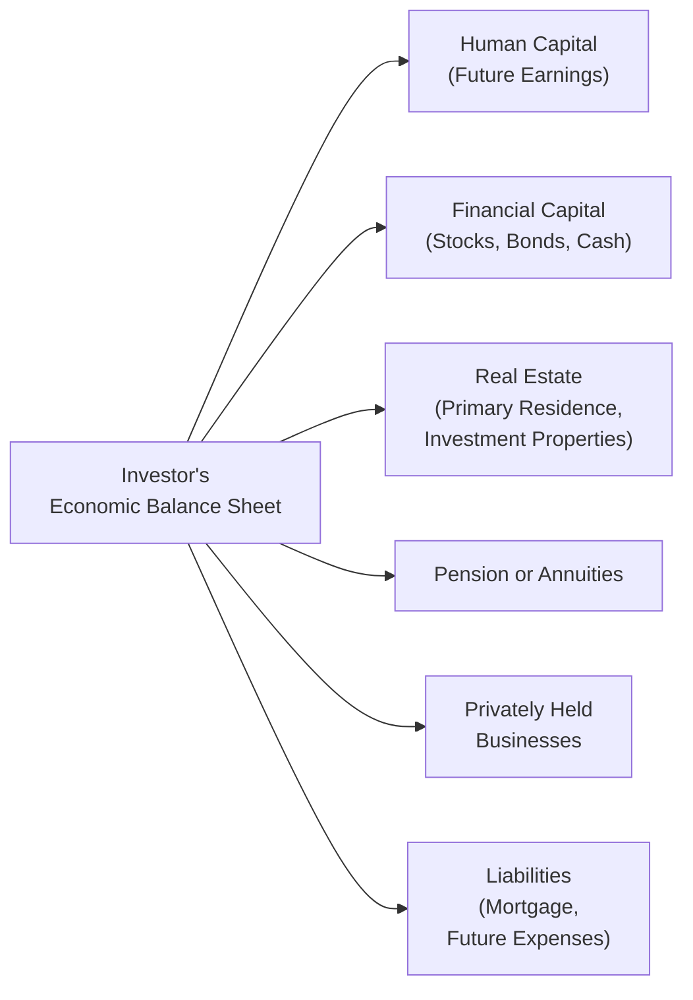

## Introduction

Investors often focus exclusively on their tradable, liquid holdings: stocks, bonds, mutual funds, and other financial instruments. But that type of narrow lens can cause them to overlook a critical component of longer-term well-being—namely their “intangible” or non-tradable assets. These assets include everything from career earnings potential (human capital) to future pension benefits, real estate, and even that carefully nurtured manufacturing business you own. When you begin incorporating them onto an “economic balance sheet,” it’s almost like adding hidden puzzle pieces that can drastically change the bigger picture of your total wealth.

In a conversation with a friend of mine—he’s a small business owner—it became obvious that his regular pay was anything but regular. One big new contract, and he’s flush with cash. One missed opportunity, and his pay is uncertain. So, guess what? He needs to be more cautious in his financial-asset portfolio. And that’s the essence of this chapter: to show how aligning an asset allocation with your so-called economic balance sheet fosters a more holistic wealth management approach.

Below, we delve into what the economic balance sheet entails, the main components you’d bring into it, the connections to liability management, and how to unify all this into a consistent investment policy.

## The Economic Balance Sheet Concept

The economic balance sheet (EBS) goes beyond a traditional statement of cash and marketable securities. It includes all assets—tangible and intangible—alongside all liabilities, mandatory and discretionary. Some of these components can be easily converted into cash or measured directly, while others, like brand value or the present value of future salary income, require estimates and assumptions.

By incorporating these often-overlooked assets and liabilities into a single framework, you’re effectively capturing the total risk/return profile that underpins your true wealth. This approach is vital in asset allocation because it helps answer the perennial question: “How risky can I afford to be in my financial investments, given the total risk structure of my wealth?”

In practice, we do this by considering all forms of capital, such as:

• Human capital (future income from labor)  
• Real estate holdings (primary residence, rental properties)  
• Pensions, annuities, and other retirement income streams  
• Intellectual property (if you are an inventor or creative professional)  
• Privately held businesses or partnership interests  
• Long-term liabilities like mortgages or expected living expenses  

When you list all of these side-by-side, the mix of potential inflows and outflows can be quite enlightening.

## Key Components and Their Risk Factor Exposures

### Human Capital

Human capital is often described as the present value of your future labor income. A reliable job, such as an established university professorship or a position with a stable government entity, may behave almost like a bond (i.e., it has relatively stable cash flows with low correlation to market swings). Meanwhile, if you are a corporate executive with a large portion of your compensation in stock options, your human capital might have equity-like volatility—both in terms of how it accrues value and how likely it is to be cut off.

### Pension and Retirement Benefits

For individuals expecting future pension benefits, these can be treated as “credit-like” or “annuity-like” inflows with certain levels of risk. A defined-benefit pension from a financially solid corporate sponsor has a higher likelihood of being paid. But even that has some credit and inflation risk. If your pension benefit is large, you might not need to own many long-duration bonds in your portfolio, because you’re effectively already the recipient of a bond-like cash flow.

### Privately Held Businesses

If you own a closely held business, your total wealth is significantly tied up in that enterprise. Suppose it’s a small manufacturing firm whose fortunes rise and fall with the economy. In that scenario, your business might move in tandem with cyclical stocks. Owning a portfolio dominated by other cyclical equities could magnify your exposure in a downturn. Rather than layering on additional economic sensitivity, you might allocate to less-correlated or defensive assets (like short-duration bonds or high-quality fixed income).

### Real Estate

Real estate holdings can look and feel like a cross between fixed income (because of the rental stream) and equity (because of capital appreciation potential). Primary residences usually have intangible emotional value, but from a pure financial perspective, the equity in your home can behave as a real asset with cyclical elements (property prices can rise or fall with macroeconomic conditions). For real estate investors with multiple commercial properties, the portfolio’s risk profile must account for local market factors, leverage, and the correlation of real estate valuations with broader markets.

### Liabilities: Mandatory vs. Discretionary

Liabilities can be subdivided into mandatory obligations—like mortgage payments, basic living expenses, or known future expenses—and discretionary obligations, such as funding a high-end vacation home or significant charitable gifts. The more mandatory your needs, the more stable your investment portfolio must be to reliably meet them. But if you have significant discretionary spending that you can trim in tough times, you can bear a bit more risk in your overall allocation.

Below is a simplified depiction of key economic balance sheet components in a flowchart.

## Correlation Considerations

All these intangible assets and liabilities have their own distinct risk factor exposures. You might think of them in terms of betas. For instance, stable labor income has a low beta vs. the equity market, whereas a commissioned sales job in technology might have a much higher beta.

The correlation of your human capital and your portfolio is especially important. If your income has a high positive correlation to the stock market, owning a still-higher proportion of equities could expose you heavily to an economic downturn (both your paycheck and investment returns would be impaired in a bad market). In that scenario, it might be prudent to hold more conservative, negatively correlated assets (like high-quality bonds or well-structured alternative strategies).

## Quantifying Intangibles for Asset Allocation

It’s all well and good to say “include intangible assets,” but how do we actually convert them into something we can measure? The process typically involves discounting future cash flows or liabilities to a present value. For example, the present value of future pension benefits might be calculated as:


PV_{\text{pension}} = \sum_{t=1}^{T} \frac{CF_t}{(1 + r)^t}


where \\(CF_t\\) is the expected annual benefit, and \\(r\\) is an appropriate discount rate representing the riskiness of those pension payments.

Similarly, a stable long-term job might be approximated by estimating future after-tax income, applying an estimate of growth (like wage inflation or career progression), then discounting to present at a rate that reflects the job’s perceived stability. Is it an entrepreneurial income with high uncertainty, or is it more akin to steady government employment? This difference can change the discount rate drastically.

## Asset Allocation Implications

### Balancing Risk Posture

An investor with low-risk human capital, such as a tenured teacher with a predictable salary and a robust pension, can often tolerate a higher equity allocation in their market-traded portfolio. Meanwhile, an entrepreneur with cyclical or volatile income might hold more short-term bonds or other low-volatility instruments to offset these uncertainties.

### Integrating Liabilities Directly

If you face large, known liabilities at certain points—such as college tuition for a child in five years or the final balloon payment on a business loan—you may structure your portfolio to ensure enough liquidity and safety to meet those obligations. This approach might include dedicating a bond ladder or a portfolio slice to match the liability streams.

### Aligning with Goals-Based Frameworks

In goals-based asset allocation (see Section 3.3 for a deeper discussion), mandatory goals represent crucial outflows that can’t be missed (essential living expenses), while discretionary goals (e.g., philanthropic donations) can be more flexible. Incorporating these goals and liabilities within the EBS clarifies how much risk capacity is available for each goal tier.

## Real-World Illustration

Picture two individuals:

• Individual A is a 40-year-old tenured professor earning a stable salary of $120,000 per year. She has a modest mortgage but also expects a defined-benefit pension in retirement. Because her human capital is akin to a low-volatility bond, she might be comfortable with an equity-heavy portfolio—say, 80% equity / 20% bonds—for her retirement portfolio.  

• Individual B is a 35-year-old entrepreneur who owns a fast-growing tech startup but draws an erratic paycheck. Some months, she pays herself $3,000; other months, the company’s cash flow is too tight to pay anything. Being so leveraged to the fortunes of her business, she might want a more conservative allocation in her liquid financial portfolio, perhaps 40% stocks / 60% bonds, to offset the volatility in her business prospects.

Neither asset allocation, on its own, is superior. But each is more or less aligned with its owner’s broader economic balance sheet.

## Best Practices, Common Pitfalls, and Strategies

### Best Practices

• Quantify Everything You Can: Attempt to put a dollar value on intangible assets and liabilities. Even if the estimates are imperfect, they provide a framework for more reasoned decision-making.  
• Monitor Correlations: Pay attention to how your intangible wealth co-moves with your liquid asset portfolio. Reducing correlation can improve total diversification.  
• Plan for Liquidity: If certain liabilities will come due in a few years, maintain adequate liquidity to prevent forced selling of illiquid or volatile assets.  

### Common Pitfalls

• Ignoring Career Risks: Failing to recognize that your job or business might be equity-like can lead to an overconcentration in equities.  
• Overlooking Pensions: Some investors disregard large, stable pension entitlements—leading them to choose safer assets when they might be able to afford more growth-oriented allocations.  
• Improper Discount Mechanisms: Using too low a discount rate for intangible assets can substantially overvalue them, artificially skewing portfolio decisions.  

### Strategies to Overcome Issues

• Revisit the Discount Rates Annually: As your career progresses or your business matures, reevaluate the safety of your income.  
• Stress-Test the Liabilities: Particularly for mandatory liabilities, use scenario analysis to evaluate potential shortfalls (see Sections 4.5 and 5.9 on scenario analysis and stress testing).  
• Consider Insurance Products: Life insurance, disability insurance, or annuities can stabilize or hedge your human capital.  

## Practical Implementation Tips

• Asset–Liability Matching: For near-term mandatory liabilities, consider short-duration or cash-equivalent instruments.  
• Factor-In Goals-Based Buckets: Segment your portfolio, matching each bucket to a specific life goal or liability.  
• Use MVO Wisely: While Mean-Variance Optimization (MVO, discussed in Section 4.1) remains a key technique, be sure to include intangible assets in the constraints and parameters you use.  

## Exam Relevance and Tips

On the CFA Level III exam, you can expect scenario-based questions requiring you to demonstrate how intangible assets and liabilities factor into a recommended asset allocation. Typical constructed response prompts might ask you to:

• Estimate the economic balance sheet for a given investor, detailing human capital, pension, and so forth.  
• Propose changes to an allocation given the correlation between the investor’s primary business or income and the existing portfolio.  
• Address how you would integrate present value concepts for future liabilities (like tuition or mortgage) into an asset allocation framework.  

When tackling these questions, watch out for common pitfalls such as failing to account for the correlation between business risks and equity holdings. Examiners often look for your ability to articulate how intangible assets alter the expected risk capacity of the overall portfolio. Remember to justify each recommendation and demonstrate awareness of how changes in discount rates or liability horizons might influence calculations.

## References for Further Study

• Maginn, Tuttle, Pinto, & McLeavey. (2007). Managing Investment Portfolios: A Dynamic Process (CFA Institute Investment Series)  
• Merton, R. C. (1971). “Optimum Consumption and Portfolio Rules in a Continuous-Time Model,” Journal of Economic Theory  
• Bodie, Z., Kane, A., & Marcus, A. J. (2018). Investments, 11th ed. McGraw-Hill  
• CFA Institute Program Curriculum, Level III (current edition)

## Test Your Knowledge: Interpreting Asset Allocations Within the Economic Balance Sheet



### Which of the following best defines the idea of an economic balance sheet?

- [ ] A statement of only an investor’s tradable, marketable securities and liabilities.  
- [x] A representation of all financial and non-financial assets and liabilities, including human capital and future pension benefits.  
- [ ] A government-issued balance sheet capturing the net worth of all households.  
- [ ] A statement capturing only intangible assets.  

> **Explanation:** An economic balance sheet accounts for both tangible and intangible assets, plus financial and non-financial liabilities, giving a holistic view of the investor’s total wealth.

---

### How does having stable, bond-like human capital typically affect an investor’s target asset allocation?

- [ ] It reduces the ability to invest in equities because overall stability is already high.  
- [x] It allows for a higher equity allocation because the investor’s labor income is relatively low risk.  
- [ ] It doesn't affect portfolio decisions because human capital is not tradable.  
- [ ] It forces the investor to buy only international bonds.  

> **Explanation:** If human capital is stable and considered low risk, it acts like a bond, allowing an investor to take on more equity risk in their financial portfolio.

---

### Which of the following is most likely to be considered a discretionary liability?

- [ ] Basic living expenses such as rent and groceries.  
- [ ] Tax obligations.  
- [x] Funding for a luxury vacation home.  
- [ ] Mortgage payments on a primary residence.  

> **Explanation:** Discretionary liabilities are those that are not strictly necessary and can be postponed or canceled, such as buying a vacation home or similarly optional expenses.

---

### When an investor’s human capital is highly correlated with the equity market, a prudent recommendation for his financial portfolio is to:

- [ ] Increase the allocation to growth equities to maximize gains.  
- [x] Increase allocations to low-volatility or negatively correlated assets.  
- [ ] Eliminate all bonds from the portfolio.  
- [ ] Focus primarily on sectors correlated to the investor’s job.  

> **Explanation:** If human capital is already equity-like, the rest of the portfolio should ideally lean toward stable or less-correlated assets to reduce total wealth volatility.

---

### Which of the following best reflects the present value approach to integrating pension benefits into asset allocation?

- [ ] Ignoring pension benefits because they are non-tradable.  
- [ ] Considering pension benefits as an added liability on the balance sheet.  
- [x] Discounting expected future pension cash flows at an appropriate rate and treating them as bond-like assets.  
- [ ] Investing all pension benefits in equities to maintain growth potential.  

> **Explanation:** By discounting future pension inflows to present value, one can treat them as bond-like wealth, shaping how other portions of the portfolio are allocated.

---

### A common pitfall when incorporating intangible assets into the overall allocation is:

- [ ] Applying a high discount rate to risky income streams.  
- [x] Using an overly low discount rate for business income, inflating the value of human capital.  
- [ ] Factoring in correlation between intangible and financial assets.  
- [ ] Treating stable pension benefits as bond-like.  

> **Explanation:** An undecorrelated intangible asset might be overvalued if you use too low a discount rate, creating false security about total wealth.

---

### Which of the following statements is most accurate regarding mandatory versus discretionary liabilities?

- [x] Mandatory liabilities, such as mortgage payments, must be met, while discretionary liabilities can be reduced if necessary.  
- [ ] Mandatory liabilities are always short-term, and discretionary liabilities are always long-term.  
- [ ] Discretionary liabilities always have higher interest rates.  
- [ ] Mandatory liabilities are never included in net worth calculations.  

> **Explanation:** Mandatory liabilities are obligations that generally cannot be postponed or adjusted, whereas discretionary liabilities can be reduced if cash flows are constrained.

---

### When determining risk tolerance, the correlation between the portfolio’s assets and the investor’s human capital:

- [ ] Can be disregarded unless the investor works at a large firm.  
- [ ] Is relevant only for retirees with defined-benefit pensions.  
- [x] Should be carefully assessed to avoid excessive concentration in similar risk exposures.  
- [ ] Is less important than short-term liquidity.  

> **Explanation:** High correlation between job earnings and the investment portfolio can lead to compounding losses in an economic downturn, making it crucial to manage correlated risks.

---

### A homeowner with a significant mortgage might reduce portfolio volatility by:

- [x] Holding enough liquid bonds or cash to cover mortgage payments for a certain period.  
- [ ] Borrowing more to invest in higher-return assets.  
- [ ] Ignoring the mortgage and focusing solely on equity returns.  
- [ ] Treating the mortgage as an intangible asset.  

> **Explanation:** Retaining liquid resources or lower-volatility assets can safeguard against disruption if personal cash flows become tight, ensuring those mandatory payments are met.

---

### True or False: Owning a closely held business typically reduces an investor’s need to hold fixed income investments because the business can hedge all market risk.

- [ ] True  
- [x] False  

> **Explanation:** A closely held business often increases risk due to volatility in cash flows; many entrepreneurs need a higher proportion of conservative holdings to balance that inherent business risk.


