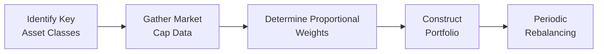
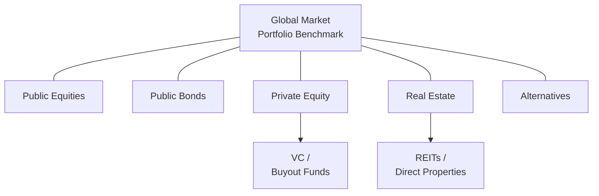

## Introduction

Have you ever wondered if there’s a single portfolio that captures the entire spirit of global investing? You know—like that “perfect” burrito that has just the right mix of all the ingredients you’d ever crave. Well, in the investment world, many professionals believe that the Global Market Portfolio (GMP) is precisely that (minus the guac). The GMP is a theoretical portfolio consisting of every investable asset out there, weighted by its market capitalization. And if that already sounds massive, it's because it is! This portfolio concept plays a critical role in portfolio management theory and practice.

In this section, we’ll examine why the Global Market Portfolio is often viewed as the ultimate neutral reference point for asset allocation. We’ll dig into what it represents, how it might be replicated (spoiler alert: it’s really tough to get it exact), and how deviations from it can reveal interesting insights about your own or your client's investment strategy. We’ll also share some stories, real-world examples, and relevant best practices to help you see how this theoretical gem can be used—or approximated—in portfolio construction.

## Foundational Concepts

### What Exactly Is the Global Market Portfolio?

The Global Market Portfolio is, in theory, a portfolio of all investable assets—equities, bonds, private equity, real estate, infrastructure, cryptocurrencies (some say yes, others say no), you name it. Each component is proportionate to its total market value relative to the size of the entire investable universe.

In a state of market equilibrium (thanks, Capital Market Theory!), the global market portfolio is supposed to be the portfolio that every "average" investor ends up holding. That is, if all investors collectively hold every asset according to its market weight, no single investor’s portfolio can differ from that weight without forcing an equal and opposite deviation by another investor. It’s a neat equilibrium concept that leads to a foundational insight: The GMP is the “neutral portfolio” you compare yourself to, in order to see how your distinct preferences, constraints, or beliefs deviate from the market average.

### Why Use the Global Market Portfolio as a Benchmark?

• It’s theoretically optimal in a frictionless market under CAPM assumptions.  
• It represents a sort of “fair game” baseline for expected risk and return, given that all assets are priced fairly.  
• By comparing your actual (or proposed) asset allocation to the GMP, you can pinpoint overweights or underweights that reflect your specific views or constraints.  

Let’s say you have a strong conviction that emerging market equities are undervalued. In that case, your portfolio will likely overweight EM equities relative to the global market’s weighting. That’s a deliberate tilt that you can measure precisely by looking at the GMP weights.

## The Global Market Portfolio in Practice

Now, a quick reality check: We can’t literally buy every asset on the planet—even institutions with billions in assets under management face limitations. Some assets are simply not investable at scale (e.g., certain niche private equity or direct real estate deals). Other markets are restricted (say, a country that doesn’t allow foreign ownership of local securities). Then you’ve got costs, liquidity constraints, and operational complexities. So, while the concept of a GMP is elegant, replicating it is anything but trivial.

### Market-Capitalization Weighting

When we say “capitalization weighting,” we’re basically saying, “Allocate to each asset in proportion to its total market size.” For equities, that means you hold each stock at a weight reflective of its market cap relative to the total global equity market. For bonds, you weigh by the outstanding market value. And for real estate, you (theoretically) do the same by property values, although data might be incomplete or inaccessible.

Market-cap weighting is an extremely popular approach for passively investing in equities. You’ve probably seen or held cap-weighted index funds that mirror the S&P 500. Extending that concept to the global level across all asset classes, however, gets complicated.

### Is the Global Market Portfolio Investable?

Let’s be honest: the GMP in its purest form is not entirely investable. Some assets (like specialized private equity deals) are illiquid or extremely restricted. Others (like certain forms of intangible assets or non-tradable instruments) might not even have a reliable market price. You could say that the “real” GMP is bigger than the “investable” GMP. Still, even an approximate version that includes, for example, global stocks, global bonds, mainstream real estate, and a wedge of alternatives can serve as a powerful reference.

### The Role of Market Equilibrium

In a perfect frictionless world of the Capital Asset Pricing Model (CAPM), the market portfolio is the tangential portfolio with the highest Sharpe ratio. But the real world is full of constraints—taxation, transaction costs, behavioral biases, and so on. Thus, it’s not that everyone invests exactly in the global market portfolio, but the GMP remains an excellent starting point for strategic asset allocation.

## Practical Steps to Approximating the Global Market Portfolio

Although you could, in theory, try to buy each share class of every publicly listed stock in the world, sprinkle in every bond issuance, add real estate investment trusts (REITs), and so on... let’s just say it’s going to be an operational headache. Instead, many practitioners rely on broadly diversified index funds or exchange-traded funds (ETFs) to get close.

### Step 1: Identifying Key Asset Classes

Decide which big buckets you want:  
• Global equities (large-cap, small-cap, emerging markets).  
• Global fixed income (government bonds, corporate bonds, high yield).  
• Alternative assets like real estate (often in the form of REITs), infrastructure, commodities, private equity, hedge funds, etc.  

### Step 2: Assigning Their Weights

Grab the total market capitalization data for each large asset class from reputable sources. For equities, big index providers (MSCI, FTSE, S&P) are common references. For bonds, you might look at the Bloomberg Global Aggregate Index. Real estate? You might approximate it through global REIT indexes, or use estimates of private real estate value from well-known data providers. The heartbreak here is that not all data is always consistent or updated at the same frequency, so you do the best you can.

### Step 3: Aggregating and Rebalancing

Once you build your version of the GMP (maybe it’s 55% global equities, 35% global bonds, 10% everything else—those are random numbers, by the way), you’ll need to rebalance periodically. Because market values shift, your pie chart slices will drift from the initial weights. Frequent rebalancing can be expensive; infrequent rebalancing might lead you to stray from your neutral posture for too long. There’s also the operational aspect of quickly allocating new capital (or proceeds from sales) in a systematic way.

Below is a simple mermaid diagram illustrating a hypothetical approach to constructing a rough GMP approximation. Don’t worry, it’s simpler than it looks:

## Comparing Proposed Asset Allocations to the Global Market Portfolio

Once you have this reference portfolio in mind, you can hold it up against your client’s or your own proposed allocation. Let’s pretend your GMP approximation suggests 55% equities, 35% bonds, 10% alternatives. But your actual client portfolio is something like 45% equities, 40% bonds, 15% alternatives. That difference from the “neutral weight” can tell you a lot:

• Are you more conservative (less equities, more bonds) than the average investor?  
• Are you expecting higher returns (more equities, fewer bonds)?  
• Are you diversifying more aggressively into alternatives because you foresee new opportunities or have a different liquidity horizon?  

When you explain these tilts to clients (or to yourself, if you play both roles), you can use the GMP as a kind of “it’s not me, it’s the market” conversation starter. It’s a nice, objective number. Clients might ask, “Why don’t we just buy the global market portfolio and call it a day?” And you’ll say, “Well, Ms. Client, because you have constraints—like your personal liquidity needs, your tax situation, and that philanthropic foundation you want to fund each year.” Or perhaps your strategic forecast for emerging markets is stronger than what the global weighting would suggest. The uses—and the conversation—are endless.

## Overweights and Underweights: Why Bother?

### Informed Views

One reason for deviating from the GMP is that you have “informed” or “differentiated” views about the future performance of certain asset classes. For instance, during post-recession recoveries, you might believe that real estate exposure will bounce more strongly than the market expects. Is that always correct? Possibly not. But that’s the essence of active management—expressing a view that differs from the consensus.

### Client Preferences

A colleague of mine (and this is a real anecdote) once had a client who absolutely hated the volatility of emerging market bonds. The client didn't want them anywhere in the portfolio, period. That is obviously a deviation from the neutral weighting. But the client’s comfort level was more important to them than capturing that slice of the bond market. Often, investing is about sleeping well at night, not just about maximizing returns. So, from a purely theoretical standpoint, you might say it’s suboptimal. But from a client-centric standpoint, it’s exactly right.

### Constraints

Constraints—think taxes, regulations, or specific ESG priorities—can prompt big divergences. For instance, if the client invests only in Sharia-compliant instruments, or avoids certain industries for ethical reasons, the comparison to the GMP reveals how far these constraints lead them away from the global average. And that’s not necessarily a “bad” thing; it’s just a reflection of the client's personal or institutional identity.

## The Reality of Implementation

### Illiquid and Private Investments

One of the toughest challenges is replicating the GMP’s treatment of private assets like real estate and private equity. The size of these markets is huge, but also tricky to pin down with precision. Even if you do get good estimates, are you sure your client wants such a large portion of their portfolio in illiquid assets (which can remain locked up for years)? For some large institutional investors (like endowments or pension funds), that might be feasible. For smaller investors or those with short time horizons, it could be a nightmare.

### Complexity, Cost, and Operational Logistics

Replicating or even approximating the GMP can lead to multiple asset managers, a blend of funds, potentially higher fees, and complexities in rebalancing. In practice, many managers might start with a simpler subset: global stocks, global bonds, maybe liquid alternatives, and call that the “global market portfolio.” It’s not perfect, but it’s straightforward and cost-effective.

### Access and Minimums

Some creative approaches to replicate the GMP—like direct ownership of farmland or direct stakes in private companies—require large capital commitments, specialized skill sets, or significant legal frameworks. That alone might exclude many investors. So “universal access” doesn’t always exist. Ultimately, you do your best to approximate.

Above is a rough chart showing major asset classes that might go into the GMP. Notice how some are more easily invested in public markets, while others require specialized vehicles.

## Common Pitfalls

1. **Misconstrued Market Data**: Relying on out-of-date or inconsistent data for market capitalization can misrepresent the actual size of various asset classes.  
2. **Ignoring Taxes**: Implementing a GMP strategy in a taxable portfolio can trigger increased capital gains if frequent rebalancing is required.  
3. **Liquidity Mismatch**: Holding a share of private equity or real estate that matches the “market” might be illiquid for long spells, which can be problematic for investors needing flexibility.  
4. **Overestimating Risk Tolerance**: If you strictly follow GMP weighting, you may end up with a more volatile combination than some investors can handle (especially if private equity or highly volatile alternative assets are big slices).  
5. **Overcomplicating Rebalancing**: The more slices in your GMP approximation, the more complex and costly rebalancing can become.  

## Conclusion and Final Exam Tips

Let’s step back and reflect on the big picture. The Global Market Portfolio, while purely theoretical in many ways, stands as a powerful yardstick against which portfolio managers and their clients can measure risk and return exposures. If you deviate, do so with intention: maybe you have unique insights or your client has specialized needs. The important part is to keep track of these deviations and to be able to explain, “Yes, we are overweight developed equities, and here’s why.”

For Level III exam success, remember these practical pointers:

• Be prepared to explain how the GMP is derived, as well as the limitations to implementing it.  
• Know how to articulate “why deviate from the GMP?”—citing client preferences, constraints, and investment beliefs.  
• Be aware of the complications of including illiquid or alternative assets in a portfolio, especially from a risk management perspective.  
• If an exam question asks for a recommended asset allocation, you can often reference the GMP as your starting point or “neutral anchor,” then detail why you’d tilt the portfolio.  
• Summarize how rebalancing, costs, and operational constraints factor into the feasibility of matching the GMP.  

Ultimately, exam questions in this domain might revolve around being able to weigh the theoretical ideal against real-world friction. If you can do that effectively, you’re in good shape.

## References, Suggested Readings & Links

• CFA Institute. (2025). “Using the Global Market Portfolio as a Baseline,” in 2025 Level III Curriculum, Volume 1.  
• Ibbotson, R., & Kaplan, P. (2000). “Does Asset Allocation Policy Explain 40, 90, or 100 Percent of Performance?” Financial Analysts Journal.  
• Bogle, J. (2003). Common Sense on Mutual Funds. Wiley.  

Now that we’ve covered the main concepts, examples, and best practices for using the Global Market Portfolio as an asset allocation benchmark, let’s move on to some practice questions!

## Test Your Knowledge: Global Market Portfolio Benchmark Insights



### Which of the following best describes the Global Market Portfolio?

- [ ] A portfolio consisting exclusively of domestic bonds.  
- [x] A theoretical portfolio of all investable assets weighted by market capitalization.  
- [ ] A tactical portfolio that only includes liquid instruments.  
- [ ] A fund-of-funds vehicle that invests solely in hedge funds.  

> **Explanation:** The Global Market Portfolio (GMP) is a theoretical portfolio that includes every investable asset in proportion to its total market value.

### What is the principal reason practitioners often compare a proposed allocation to the Global Market Portfolio?

- [x] To highlight specific deviances (tilts) from the market weight and justify them.  
- [ ] To ensure the portfolio is consistently underweight in equities.  
- [ ] To find a more volatile alternative to traditional portfolios.  
- [ ] To avoid investing in emerging markets.  

> **Explanation:** By comparing to the GMP, investors can identify how and why their portfolios deviate, reflecting active views, constraints, or client preferences.

### Why might the Global Market Portfolio be considered “uninvestable” in practice?

- [ ] It consists almost entirely of asset classes that no one wants.  
- [x] Certain private or illiquid components are difficult or impossible to replicate.  
- [ ] Institutional investors are restricted by global regulations.  
- [ ] It generates lower total returns than a simple equity-bond mix.  

> **Explanation:** While it’s excellent as a theoretical reference point, many of its components are illiquid or otherwise hard to replicate at scale.

### How do monetary and liquidity constraints typically affect GMP replication?

- [ ] They make replication cheaper and simpler over time.  
- [ ] They force investors to rely exclusively on local equities.  
- [x] They increase complexity and prevent full inclusion of all market segments.  
- [ ] They have no effect if the bonds portion is large enough.  

> **Explanation:** The actual investable set is smaller than the theoretical set, meaning constraints often force approximations rather than perfect replication of the GMP.

### An investor with strong convictions about undervalued emerging market equities is likely to:

- [ ] Exactly match the GMP weighting to avoid extra risk.  
- [x] Overweight emerging market equities relative to the GMP.  
- [ ] Eliminate emerging market equities, focusing on developed markets only.  
- [ ] Forget the GMP and invest strictly in domestic T-bills.  

> **Explanation:** Overweighting the asset class (versus the GMP) expresses a deliberate active view that EM equities will outperform.

### Which of the following is a common pitfall when implementing the Global Market Portfolio approach?

- [x] Relying on inconsistent or outdated market cap data.  
- [ ] Adding new asset classes to increase diversification.  
- [ ] Using REITs to represent real estate exposure.  
- [ ] Periodically rebalancing the portfolio.  

> **Explanation:** Gathering reliable, consistent, and up-to-date data across all asset classes can be challenging. Incorrect data can distort your portfolio weights significantly.

### In discussing the relevance of GMP with a client who has strong ESG constraints, a manager should emphasize:

- [ ] That ESG investing never deviates from the GMP.  
- [ ] That ESG investing always outperforms the GMP.  
- [x] How ESG screens may cause the portfolio to stray from the GMP’s asset mix.  
- [ ] That ESG investing has no effect on asset allocation.  

> **Explanation:** Strict ESG or socially responsible investing often excludes certain sectors or companies, thus creating unavoidable deviations from the “neutral” GMP.

### Which statement about overweights and underweights relative to the GMP is most accurate?

- [ ] They should never be undertaken if the investor is risk-averse.  
- [x] They can reflect both active views and constraints or preferences.  
- [ ] They signify an inability to manage portfolio risk.  
- [ ] They are typically undesirable for institutional portfolios.  

> **Explanation:** Deviations from the GMP occur due to decision-making based on active forecasts, client circumstances, risk tolerances, and other real-world considerations.

### A primary challenge for a retail investor aiming to replicate the GMP is:

- [ ] The inability to hold any global equities.  
- [ ] Onerous tax penalties that only apply to GMP strategies.  
- [x] High costs, limited access to certain asset classes, and operational difficulties.  
- [ ] Severe underperformance compared to a domestic-only portfolio.  

> **Explanation:** Retail investors may not have the scale, resources, or risk tolerance to hold so many asset classes in market-cap proportions, especially in private or illiquid segments.

### A key concept from the Capital Market Theory is that the Global Market Portfolio:

- [x] Is the market-clearing balance of all assets in equilibrium.  
- [ ] Offers the highest portfolio variance possible.  
- [ ] Excludes riskier assets to keep volatility minimal.  
- [ ] Must be actively managed to outperform the market return.  

> **Explanation:** Under classic asset pricing models, the broad market portfolio reflects the equilibrium state where supply and demand for all assets meet, and all are priced fairly.


