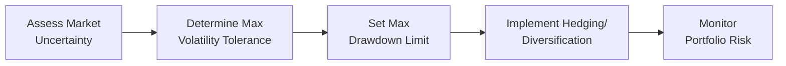
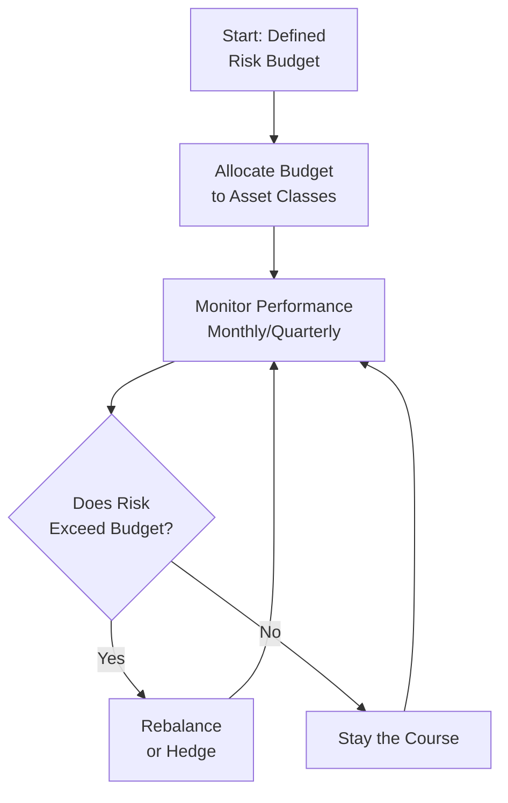

## Introduction

Let’s be honest—when we talk about risk in investing, it can sometimes feel like jumping into a black hole. It’s big, it’s a bit scary, and not everyone manages it the same way. But in practice, risk management doesn’t have to be so daunting, especially when you can establish clear risk budgets. A “risk budget” is effectively a ceiling—an amount of risk you’re willing (or able) to take in pursuit of return. That’s it. But how do we figure out if the budget should be measured in absolute terms (like total portfolio volatility) or relative terms (like tracking error vs. a benchmark)?

In this article, we’ll explore how absolute and relative risk budgets are set, and we’ll talk about how they’re used in determining (and rebalancing) an overall asset allocation. We’ll throw in a couple of personal anecdotes, a casual approach to complicated equations, and a few real-world examples so that you can walk away feeling you truly “get it.” Let’s jump in.

## Risk Budgeting: The Big Picture

Before diving into the difference between absolute and relative risk budgets, it helps to have a sense of what a risk budget actually looks like in practice. Think of a company’s budget for expenses. You set a total limit—maybe it’s $1 million a year—that you cannot exceed. Within that limit, you allocate money to different departments or strategic initiatives. Similarly, a risk budget sets an upper boundary for allowable portfolio risk, then allocates that allowable risk to different asset classes, strategies, or risk factors.

### Why Risk Budgets Matter
• They help align portfolio strategies with an investor’s capacity for loss and risk aversion.  
• They guide asset allocation decisions so that no single position or asset class can “blow up” the portfolio’s risk.  
• They’re practical tools for internal governance, ensuring that everyone—trustees, portfolio managers, analysts—understands and abides by the same risk boundaries.

## Absolute Risk Budgets

When we talk about absolute risk budgets, we’re referring to risk tolerances measured in stand-alone terms. That can be something like:  
• “Keep portfolio volatility below 12%.”  
• “Avoid a peak-to-trough drawdown beyond 15%.”  
• “Value at Risk (VaR) at a 95% confidence level should not exceed $100 million.”  

Fundamentally, an absolute risk limit doesn’t care about how the portfolio compares to any particular benchmark or index. It’s just a line in the sand that says: “No matter what’s happening in the markets, we don’t want to exceed this level of risk.”

### Examples of Absolute Risk Measures

• **Maximum Portfolio Volatility:** An investor might say “Fine, we’re comfortable with 10% annualized volatility. But if forward-looking estimates show we’re creeping above 10%, we have to reduce risky assets.”  
• **Maximum Drawdown:** If the investor can’t stomach a 20% portfolio decline from a recent peak, the portfolio manager might use hedging strategies—like options or futures—to limit downside.  
• **Value at Risk (VaR):** For instance, we might set a “1-year 95% VaR” at $5 million, which implies that we only have a 5% chance of losing more than $5 million over the next year.

#### Personal Anecdote
I once worked with an investment committee that basically “freaked out” if the portfolio lost more than 10% in a single year. That was their absolute risk budget—clear, direct, no complicated formulas. It might have seemed a bit conservative, but at least it was easily communicated to all stakeholders.

Below is a Mermaid diagram briefly illustrating how an absolute risk budget might be set:

## Relative Risk Budgets

Unlike absolute risk budgets where we only care about the portfolio’s total risk in isolation, relative risk budgets benchmark the portfolio’s risk against something else. That “something else” might be:  
• A benchmarking index—e.g., the S&P 500.  
• A target liability—e.g., a pension plan’s future liabilities.  
• A reference portfolio—e.g., a policy portfolio or a strategic asset allocation “baseline.”

### Examples of Relative Risk Measures

• **Tracking Error (TE):** The annualized standard deviation of the difference between the portfolio’s returns and the benchmark’s returns. One might say, “We’re targeting a 2% tracking error. If it climbs above 4%, we need to pull back.”  
• **Surplus Risk:** This measure is often used by pension funds to gauge how the difference between asset returns and liability returns fluctuates. The sponsor says something like, “We don’t want our funding ratio to vary by more than 5% per year.”  
• **Active Risk (Information Ratio-Style):** Where the difference relative to a reference portfolio or passive index is limited in some fashion.

Relative risk budgets, in many ways, reflect the active decision to deviate from a standard or from what’s required. If a portfolio manager is trying to outperform the S&P 500, the relative risk budget will define how big those off-benchmark bets can be.

#### Casual Observation
Relative budgets make sense if your performance is being judged against a widely known yardstick. That’s why many institutional investors emphasize tracking error. On the other hand, if your main worry is losing real money (and not how you stack up against others), an absolute measure might be more intuitive.

## Using Risk Budgets in Mean–Variance Optimization (MVO)

In traditional Mean–Variance Optimization (MVO), we try to figure out the portfolio weights that produce the best expected return for a certain level of volatility (or, equivalently, the lowest volatility for a certain return). But if we simply feed historical return and volatility estimates into a standard MVO, it might shoot out a portfolio heavily concentrated in one or two asset classes (for example, if one asset class has had a massively attractive risk/return profile in the sample data).

### Enter: Risk Budgets

When we impose an absolute risk budget, we might restrict the total portfolio volatility to around 10%. That ensures the optimizer can’t chase higher-return, higher-volatility assets too aggressively. Similarly, in a relative sense, we might impose a constraint that portfolio weights can’t deviate so far from the policy benchmark that the ex-ante or forecasted tracking error exceeds 3%. The MVO algorithm then seeks the best combination of assets without breaking that limit.

Here’s a simple (and admittedly condensed) example of how risk budgets shape MVO:

- Suppose you have four asset classes:  
  • Domestic equities (expected volatility 15%)  
  • Domestic bonds (expected volatility 5%)  
  • International equities (expected volatility 16%)  
  • Alternative assets (expected volatility 12%)  

- You run a standard MVO and see that the optimizer gives you 80% domestic equities, 20% domestic bonds (just as a hypothetical). That might yield an overall portfolio volatility of, say, 12%—which is higher than your 10% absolute budget. So to satisfy the absolute risk limit, you reduce equity exposure or partially hedge it until expected portfolio volatility is 10% or less.

- Alternatively, you might discover that heavy weighting to domestic equities is going to create a 4% tracking error relative to your global equity baseline. If your relative risk budget is only 3% tracking error, you adjust the weights, maybe adding some international equities or alternatives to diversify and reduce your expected TE.

In short, risk budgets help keep MVO solutions from overshooting your risk tolerance or drifting too far from your benchmark.

## Implementation Guidelines and Rebalancing

So, once you’ve set your risk budget—be it absolute or relative—how do you actually manage it day-to-day? Well, you generally put guidelines in place:

- **Concentration Limits**: Disallow more than 40% of your portfolio to be in a single asset class or single equity sector.  
- **Leverage Constraints**: If you do use leverage, specify that the total portfolio debt-to-equity ratio can’t exceed 1:1, for instance.  
- **Volatility/Economic Triggers**: If realized or forecasted portfolio volatility rises above agreed-upon thresholds, you’re forced to pare back risk.

When actual market returns push certain asset classes beyond their allocated risk share, you rebalance. Maybe equities soared and now your expected volatility limit is dangerously close. You take some equity off the table and reallocate to less-risky fixed income or alternatives. This ensures your portfolio stays within the budget you and your stakeholders set.

## Common Pitfalls

- **Too Rigid Budgets**: Overly tight constraints might prevent the portfolio from responding to changing market conditions.  
- **Ignoring Correlations**: Setting risk budgets for each asset class independently could be misleading if you forget that assets move together.  
- **Outdated Risk Models**: High market volatility can render historical-based VaR or tracking error estimates obsolete.  
- **Miscommunication**: If the board thinks “10% volatility is safe” but the portfolio manager sees a big shock in the market, confusion abounds unless there’s a clear plan for what happens when thresholds are breached.

## Practical Examples

1. **Institutional Pension Fund**: Suppose the sponsor sets a “surplus risk” limit of 5%. That means the difference between returns on the fund’s assets and the liabilities can’t fluctuate more than 5% in standard deviation terms. The portfolio team divides the total allowable 5% surplus risk among equity, fixed income, and alternatives. If the equity allocation grows too large, the expected surplus risk might exceed the 5% limit, prompting a rebalancing.

2. **Wealth Manager with a High-Net-Worth Individual**: This HNW client states, “I can’t lose more than 10% of my wealth in a year, or I’ll lose sleep.” That’s an absolute risk budget—no mention of a benchmark. The wealth manager designs a lower-volatility portfolio (maybe uses some structured notes) to cap annual drawdowns at around 10%.  

3. **Endowment Fund**: The Investment Policy Statement (IPS) might say, “Target 2% to 4% tracking error relative to our policy portfolio.” This sets a relative risk budget. The endowment invests in active managers, but each manager’s active risk roll-ups collectively must keep the overall portfolio’s tracking error in the 2%–4% corridor.

## Exam Tips and Final Thoughts

Practically speaking, risk budgeting is a powerful concept at the capstone CFA Level III. You want to link how your risk budget interacts with things like strategic asset allocation, scenario analysis, and rebalancing triggers. On an exam, you could be asked to:
- Recommend changes to a current portfolio if it exceeds established absolute or relative risk budgets.  
- Propose how a risk budget might be integrated into a mean–variance framework.  
- Identify the key differences between absolute and relative approaches in a case scenario.  

And yes—practice articulating how you’d bring a portfolio back into line if it’s “over budget.” Above all, show you understand that risk budgeting is not just a theoretical exercise but a day-to-day discipline.

## References

• Grinold, R. C., & Kahn, R. N. (2000). Active Portfolio Management. McGraw-Hill.  
• CFA Institute. (2025). “Absolute vs. Relative Risk Budgets,” in 2025 Level III Curriculum, Volume 1.  
• Campbell, J. Y., Lo, A. W., & MacKinlay, A. C. (1997). The Econometrics of Financial Markets. Princeton University Press.  

## Test Your Knowledge: Absolute and Relative Risk Budgeting Essentials



### Which of the following best describes an absolute risk budget?

- [x] A risk limit measured on a stand-alone basis, such as maximum portfolio volatility of 10%.
- [ ] A risk limit measured relative to a benchmark index.
- [ ] A risk limit based solely on expected liabilities.
- [ ] A leverage utilization threshold that must not exceed 2:1.

> **Explanation:** An absolute risk budget targets a specific stand-alone risk measure (e.g., volatility, drawdown) regardless of any benchmark.

### What is one key difference between absolute and relative risk budgets?

- [ ] Absolute budgets always target maximum drawdown; relative budgets always target maximum VaR.
- [x] Absolute budgets do not depend on a benchmark, while relative budgets are expressed relative to a benchmark or liability.
- [ ] Relative budgets require more frequent rebalancing.
- [ ] Absolute budgets only apply to private markets, while relative budgets only apply to public markets.

> **Explanation:** Absolute practices measure stand-alone risk, whereas relative practices use an external reference or benchmark to determine acceptable risk levels.

### In a mean–variance optimization, how might a relative risk budget be applied?

- [x] By constraining the expected tracking error so that it does not exceed a set threshold.
- [ ] By calculating the maximum annual portfolio drawdown a portfolio can tolerate.
- [ ] By limiting the percentage of fixed income to 20%.
- [ ] By ensuring the portfolio has 2% less volatility than the benchmark.

> **Explanation:** A common form of relative risk budget in MVO is a constraint on tracking error to maintain the portfolio’s overall deviation from a benchmark within an acceptable range.

### Which factor is typically considered when defining a surplus risk budget for a pension plan?

- [x] The difference between the returns of the plan’s assets and the growth of its liabilities.
- [ ] The difference in performance fees paid to active managers.
- [ ] The expected volatility of each asset class relative to a broad market index.
- [ ] The correlation between the plan’s assets and global equities.

> **Explanation:** Surplus risk addresses the potential shortfall or surplus of assets relative to liabilities, focusing on fund solvency over time.

### Which of the following guidelines is most directly associated with implementing a risk budget?

- [x] Setting concentration limits for each asset class within the portfolio.
- [ ] Mandating that all assets be at least partially hedged.
- [ ] Restricting trading to only large-cap equities.
- [ ] Using only passive index funds for all exposures.

> **Explanation:** Concentration limits help ensure that no single asset class or sector dominates total portfolio risk, thus adhering to the assigned risk budget.

### How does a maximum drawdown limit function as an absolute risk budget?

- [x] It specifies the largest acceptable loss from peak to trough, setting a red line for portfolio declines.
- [ ] It measures the difference between actual performance and a benchmark’s performance.
- [ ] It helps ensure that a portfolio cannot deviate from its strategic mix more than 5%.
- [ ] It dictates how far yields can rise before rebalancing.

> **Explanation:** A maximum drawdown sets an absolute tolerance level for losses, clearly capping potential downside in a stand-alone context.

### In practice, how might rebalancing be triggered when using an absolute risk budget?

- [ ] If benchmark performance is lagging the portfolio by more than a certain margin.
- [ ] If the manager sees an opportunity for arbitrage returns.
- [x] If the portfolio’s volatility spikes past its predefined risk ceiling.
- [ ] If the client wants to switch from equities to bonds regardless of market dynamics.

> **Explanation:** With an absolute risk budget, once volatility (or another risk measure) surpasses the predefined threshold, rebalancing actions or hedging strategies are initiated.

### Under what circumstances might a relative risk budget be less relevant for an investor?

- [x] When the investor does not compare performance to any index or liability, focusing on real return.
- [ ] When a manager uses active strategies with large tracking error.
- [ ] When the investor has a board that requires a tracking error measure.
- [ ] When the investor specifically wants to replicate an index exactly.

> **Explanation:** A relative risk budget is less relevant if the investor cares only about absolute performance, not how they compare to any benchmark or liability structure.

### In a scenario where a pension fund manager must keep surplus risk below 6%, which scenario indicates that the fund has breached this limit?

- [x] Forecasted standard deviation of the difference between the fund’s asset returns and liability growth is 7%.
- [ ] The fund’s annual return is 6% lower than the benchmark.
- [ ] The fund’s volatility is 10%.
- [ ] The manager invests 6% of the fund in alternatives.

> **Explanation:** Surplus risk is defined as the volatility of the difference between asset returns and liability returns. If that figure rises above 6%, the limit is breached.

### In the context of absolute risk budgets, is it true or false that a volatility cap of 12% means the portfolio cannot exceed 12% volatility on a realized basis?

- [x] True
- [ ] False

> **Explanation:** An absolute volatility cap of 12% sets a threshold that portfolio managers must strive to respect in real-time, although actual realized volatility can fluctuate. Once it goes above that threshold, risk management actions are usually triggered.


