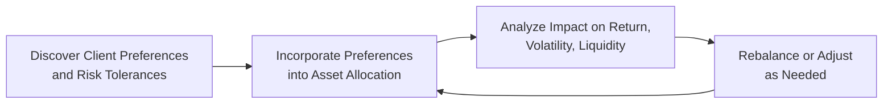

## Understanding Client-Driven Risk Preferences

When we talk about asset allocation, it’s tempting to jump right into numbers, portfolio optimizations, and the usual jargon about yields and standard deviations. But there’s a human side to all of this—clients come with stories, experiences, and sometimes deeply held beliefs that color the way they view investing. Maybe you’ve come across a client who firmly believes in the future of farmland (like it’s their dream to own a slice of rustic paradise) or someone who really wants to avoid tobacco stocks or gambling-related securities because of personal ethics. Honestly? Those preferences can be just as powerful a driver of risk and return as more traditional metrics.

The reality is that a portfolio never exists in a vacuum. We all have beliefs, personal constraints, and emotional relationships with money. So, the question becomes: how do we incorporate these often intangible (or at least nontraditional) preferences into an asset allocation without veering too far from long-term investment goals? Or is that even possible?

## Balancing Long-Term Goals with Personal Investments

Before diving into the nitty-gritty, it helps to recall some of the earlier topics in this Volume. When setting strategic asset allocations, we often rely on frameworks like Mean–Variance Optimization (MVO) or risk factor–based approaches. That’s all well and good to identify an efficient frontier for a set of standard asset classes. However, real clients might want to weave in specialized holdings (antique cars, farmland, or sustainable “green” bonds) that don’t always slot neatly into those conventional models.

The good news is that MVO (as explained in earlier sections such as 4.1 and 4.2) can still be adapted. If you can estimate the expected returns and volatilities of these specialized assets—and gather correlation data relative to the rest of the portfolio—you can treat them like any other investment, albeit with some additional disclaimers around illiquidity and limited historical data. The end goal is to maintain a coherent portfolio strategy that respects both math and personal meaning.

## Communication: The Cornerstone of Aligning Preferences with Risk

I once worked with a client who was incredibly passionate about farmland investments because she grew up on a family-owned farm and saw farmland ownership as a legacy to pass down. The conversation quickly turned emotional at times: farmland represented so much more than just a commodity or real estate asset; it was part of her history. However, farmland can be illiquid, cyclical, and heavily influenced by global agricultural markets. So, we had to have honest discussions about how this would affect her liquidity if she needed quick access to capital. In the end, we allocated a modest share—enough to satisfy her emotional and legacy desires, but not so large as to disrupt her entire portfolio.

That story underscores the importance of direct, transparent communication about how an asset preference might alter the portfolio’s overall risk and liquidity. This is particularly vital when dealing with socially responsible (ESG) investing or excluding certain industries— because if a client wants to exclude 20% of an entire equity index (say, energy or certain manufacturing sectors), there may be a profound impact on diversification and the inner workings of volatility and returns.

## Tools for Implementation

In practice, we can integrate client preferences in more than one way. Two common approaches are custom screening and the use of separate accounts:

• Custom Screening: Here, you filter out (or in) specific securities based on certain criteria—maybe carbon emissions, “controversy scores,” or stated ESG ratings. You can also screen for unique areas of investment, such as farmland REITs, green bonds, or specialized alternative assets. Screening is often done with the help of a data provider or the asset manager’s proprietary data sets.

• Separate Accounts: A separate account is effectively a dedicated vehicle that can be tailor-made to meet client-imposed constraints. If a client wants absolutely zero exposure to tobacco or weapons manufacturers, you can exclude those holdings entirely in this account. Or, if they want farmland to be a more prominent slice, you can overweight farmland equities, farmland private placements, or farmland REITs within a separate account. The big plus here is customization. The downside is the potential for higher costs, as building a separate account usually requires more ongoing management and oversight compared to a pooled fund.

In either case, the discipline is the same: you define precisely what the preferences are, you systematically apply them (whether by screening or active selection), and you track the potential effect on performance, risk, and correlation relative to a benchmark.

## Mapping Client Preferences to Risk Tolerance

It might sound obvious, but you can’t incorporate preferences you don’t know about. That’s why risk-profiling questionnaires and in-depth interviews come in handy. Beyond the standard “What’s your time horizon?” or “How do you feel about losing 20% in a quarter?” type questions, it’s often helpful to ask about intangible preferences or emotional triggers. An example:

• Do they have a moral or ethical stance against certain industries?
• Are they particularly attached to certain geographies or sectors because of personal history?
• Do they want stable, inflation-protected income because they’re retired and living on a fixed amount?
• Do they prefer low volatility, or are they comfortable with wild swings if it aligns with their personal convictions?

You may be surprised at how revealing these chats can be. A client sometimes can’t articulate these preferences on a standard risk questionnaire but will openly share them in conversation.

As you parse out these preferences, you then look for how they intersect with risk capacity (the client’s actual financial ability to bear losses) and risk tolerance (their emotional comfort with volatility). If there’s a mismatch—like a client on a tight retirement budget wanting to invest heavily in exotic, illiquid farmland—some gentle coaching may be in order. The final portfolio design has to promise both alignment with goals and psychological comfort.

## Inflation Protection and Income Stability

Some clients, particularly those nearing or in retirement, may prioritize stable or inflation-protected income streams. In the United States, inflation-protected government bonds (TIPS) can be utilized to hedge inflation risk. Real estate and infrastructure are other real assets that often provide a partial inflation hedge when approached carefully in the portfolio structure. If a client emphasizes stable income, it might require a more conservative, liability-driven approach. You’d tilt allocations toward assets whose cash flows more reliably match the client’s spending needs, or at least keep pace with inflation.

Keep in mind that this emphasis on inflation protection can conflict with other exclusive preferences, such as farmland or even collectible assets. Yes, farmland might be an inflation hedge in theory—especially if we expect agricultural product prices to rise—but it might not provide immediate or consistent annual cash flow. So it’s a balancing act to find the blend where short-term liquidity needs are met, while the portfolio also remains robust in the face of inflation.

## Esoteric or Specialized Assets

Esoteric assets are those that you might not encounter every day: farmland, vineyards, antique cars, vintage wines, rare art, domain names, and so on. Let’s be real, sometimes clients want a slice of these simply because they love them—and that’s fine! However, from a capital market perspective, these can be illiquid, hard to value, and lack robust historical performance data. Thus, including them in a portfolio demands:

• Thorough due diligence (Is there an active, liquid resale market or stable source of data on transaction prices?).
• A clear statement of how these assets fit into the client’s bigger picture.
• A risk budget that accounts for possible difficulty in rebalancing or liquidating these positions under duress.

In some cases, you might manage this by dedicating a small, explicitly ring-fenced part of the portfolio to these “passion assets” or specialized investments. That way, any significant dislocation in these markets (like if the farmland bubble bursts) won’t fully jeopardize the client’s retirement or philanthropic goals.

## Liquidity Considerations

While you’re incorporating the client’s unique preferences, keep an eye on liquidity. You don’t want to get into a scenario where your portfolio is so loaded with farmland shares, private equity, or real estate that the client can’t easily access funds for an emergency or a short-term obligation. This conversation is a big part of the “explicit communication” step the CFA curriculum emphasizes. You talk to the client: “Sure, farmland is awesome, but realize that if we invest 20% there, you may not be able to tap that money if you have a big expense next year.” Often, a modest allocation or a strategy that invests in farmland through more liquid vehicles like publicly traded REITs or listed agricultural companies can achieve some exposure while managing liquidity constraints.

## Monitoring and Periodic Adjustments

Once you’ve incorporated these preferences, it’s not a set-it-and-forget-it scenario. Personal interests and philosophies can shift; new industries or ESG concerns can emerge. On top of that, the investment landscape changes. Just think of how quickly new technologies or resource concerns can reshape entire sectors. That’s why any well-thought-out approach to client preferences is an ongoing process. You periodically revisit them, possibly once a year or every few years, to gauge whether they remain relevant.

Additionally, the risk and return profiles of these specialized or excluded assets may shift over time. Suppose farmland values skyrocket over a decade—suddenly, your 5% farmland allocation has grown to 15%. That concentration might become a risk that calls for rebalancing. Awareness of these shifts is paramount to ensuring that the client’s portfolio remains on track with long-term goals while also respecting personal convictions.

## Visual Representation of Incorporating Client Preferences

Below is a simple diagram illustrating the iterative cycle for incorporating client-specific preferences into asset allocation decisions. It ties together the major steps: discovering preferences, allocating them, analyzing the impact, and making adjustments over time.

## Example Case Study

Imagine a hypothetical client, Alex, who is 45 years old with a high net worth, partial retirement plan in 10 years, and a strong personal interest in sustainable agriculture. Alex wants to invest heavily in farmland, is open to moderate volatility, but also values liquidity to some extent. Her existing portfolio is fairly traditional: 60% equities (diversified globally), 30% bonds (a mix of government and corporate), and 10% in private equity.

1. Discovering Preferences: Through conversations, you learn Alex spent summers at her grandfather’s farm, which fosters a sentimental connection to farmland. She also believes in the “future of sustainable agriculture.”  
2. Incorporating Preferences: You dedicate a 10% slice of her portfolio to farmland. To manage liquidity risk, half of it goes to a farmland-oriented REIT (publicly traded) and the other half to a private farmland partnership that invests in mid-size sustainable farms.  
3. Impact on Return and Risk: By adding farmland, you theoretically gain inflation-hedging properties, but also face potential correlation to commodities, an illiquidity premium for private farmland, and farmland-specific operational risks (like drought or disease).  
4. Monitoring and Adjusting: If farmland outperforms significantly, the client’s 10% farmland exposure could become a higher share, requiring rebalancing. Alternatively, if farmland underperforms or becomes illiquid, you might scale back that portion.  

In practice, each stage demands open communication. Alex understands that farmland is illiquid and subject to environmental factors. She accepts it because she’s comfortable with the trade-off, guided by her personal convictions and risk tolerance.

## Behavioural and Emotional Dimensions

It’s no secret that personal biases and emotions significantly influence investment choices. If a client is emotionally attached to certain preferences, it can lead them to overestimate potential returns or underestimate risks. Behavioral finance teaches us that individuals often derive more “utility” from aligning their portfolios with personal values—even if, in purely financial terms, it costs them some expected return. This intersection of “utility” and “values” is a key reason for ongoing, empathetic dialogue with clients, ensuring they really grasp the potential trade-offs involved.

At times, you might observe that these preferences conflict with standard diversification. For example, a client who excludes too many sectors or invests heavily in a single theme can inadvertently raise their portfolio’s unsystematic risk. It's the role of the advisor or the allocator to highlight such pitfalls and help the client weigh the intangible satisfaction from their preference against the probable cost or risk.

## Common Pitfalls and Best Practices

• Pitfall 1: Over-allocating to illiquid assets. Enthusiasm for farmland, collectibles, or private equity can hamper the client’s ability to meet short-term liabilities.  
• Pitfall 2: Lack of clear performance measurement. When preferences deviate significantly from standard benchmarks, it can be tricky to evaluate success. Use custom benchmarks that approximate the exposures.  
• Pitfall 3: Inadequate due diligence on esoteric assets. Alternative assets might have limited track records or uncertain valuations.  
• Pitfall 4: Overlooking correlation shifts. Markets evolve, and farmland might behave more like equities or commodities in certain environments, changing correlations over time.  

• Best Practice 1: Incorporate preferences incrementally. Rather than drastically altering the entire allocation, start with a slice.  
• Best Practice 2: Document everything. Clear communication in an investment policy statement (IPS) or an addendum ensures the client knows the rationale and possible consequences.  
• Best Practice 3: Revisit preferences regularly. People’s lives and market realities shift, so keep track of how relevant the preferences remain.  

## Conclusion and Exam Tips

Incorporating client preferences and needs for investment risks is about striking that sweet spot between hard-nosed portfolio analytics and the softer, more personal side of investing. Recognize that sometimes a client’s intangible satisfaction can matter just as much as an optimized Sharpe ratio. If the client is comfortable with the trade-offs—and the path is well-documented with a thorough understanding of liquidity, risk, and return impacts—then these unique preferences can live harmoniously in the portfolio.

For the CFA Level III exam, expect scenario-based questions where a client’s personal constraints and preferences play a major role in shaping the asset allocation. You might be asked to justify how you’d balance or re-balance a portfolio that includes specialized or restricted holdings. Or you might be given a case with a strong ESG tilt and asked to detail how it changes the risk profile. Here’s the key: demonstrate your knowledge of how these preferences impact the broader portfolio metrics (volatility, liquidity, diversification) while still addressing the client’s overall risk–return objectives.

• Common Pitfall: Failing to address how personal preferences might limit diversification or increase concentration risk.  
• Strategy for Constructed Responses: Cite the relevant tools (separate accounts, screenings), highlight liquidity concerns, show you understand the need for rebalancing or adjusting the portfolio as key circumstances change.  
• Time Management: When dealing with item sets or essay questions, quickly identify the unique client preference (e.g., ESG exclusion, farmland, stable income) and jump right into the ramifications on standard asset allocation.  

By doing so, you’ll demonstrate a comprehensive grasp of how to bring a client’s personal sense of purpose into alignment with a financially coherent investment strategy.

## References

• CFA Institute (2025). “Client Preferences in Asset Allocation,” in 2025 Level III Curriculum, Volume 1.  
• Statman, M. (2017). Finance for Normal People: How Investors and Markets Behave. Oxford University Press.  
• Brounen, D., & Koedijk, K. (2015). “Behavioral Real Estate,” The Journal of Portfolio Management.

## Test Your Knowledge: Incorporating Client Preferences and Needs for Investment Risks



### Which tool allows full customization of portfolio holdings based on a client’s unique preferences?

- [ ] Pooled mutual funds
- [ ] Exchange-Traded Funds (ETFs)
- [x] Separate accounts
- [ ] Sweep accounts

> **Explanation:** Separate accounts allow each client’s portfolio to be custom-tailored, facilitating the inclusion or exclusion of specific securities to match any ethical or investment constraints.

### A client insists on excluding gambling and tobacco stocks from her portfolio. Which approach would typically be used for this purpose?

- [x] Custom screening
- [ ] Short selling
- [ ] Performance-based fees
- [ ] Equal-weight indexing

> **Explanation:** Custom screening filters out companies involved in activities the client wishes to avoid (e.g., gambling or tobacco), ensuring that excluded securities are not part of the final portfolio.

### A significant drawback of investing in esoteric assets like vintage collectibles can be:

- [x] Illiquidity and lack of reliable pricing data
- [ ] Strict regulatory frameworks that reduce supply
- [ ] High short-term returns overshadowing stable performance
- [ ] Low correlation with traditional assets

> **Explanation:** Many esoteric assets suffer from illiquidity and limited publicly available data, making it difficult to estimate fair market value or compare risk-adjusted returns.

### For a client focusing on stable, inflation-protected cash flows, which instrument typically plays a key role in the United States?

- [ ] High-yield bonds
- [ ] Municipals
- [x] TIPS (Treasury Inflation-Protected Securities)
- [ ] Short-term Treasury bills

> **Explanation:** TIPS provide a coupon and principal payments that adjust for inflation, offering a straightforward way to preserve purchasing power.

### When a client incorporates specific ESG constraints and excludes entire market sectors, the portfolio is most likely to:

- [x] Lose some diversification benefits
- [x] Experience a potential tracking error relative to the broad market
- [ ] Decrease correlation with bond markets
- [ ] Reduce illiquidity risk

> **Explanation:** Excluding entire sectors can increase the portfolio’s tracking error and may reduce diversification by eliminating potentially large segments of the market.

### A critical role of risk-profiling questionnaires is to:

- [x] Identify intangible preferences and emotional risk tolerances
- [ ] Calculate short-term trading profits precisely
- [ ] Automate portfolio rebalancing
- [ ] Guarantee a higher return via risk factor control

> **Explanation:** While risk-profiling questionnaires can’t guarantee returns, they help capture a client’s emotional and behavioral tendencies, which is vital for aligning preferences with a suitable portfolio.

### When farmland becomes overvalued and forms a disproportionately large share of an investor’s portfolio, the key action is:

- [x] Rebalancing a portion into other assets
- [ ] Excluding farmland entirely
- [x] Reassessing the client’s strategic allocation to farmland
- [ ] Using farmland as a substitute for cash holdings

> **Explanation:** Farmland’s share may need to be trimmed to maintain alignment with the target allocation and the client’s risk tolerances. Also, reevaluating the strategic logic behind farmland’s weight is essential.

### Which of the following best describes the advantage of using a farmland-oriented REIT rather than directly owning farmland?

- [x] Potentially higher liquidity and less management overhead
- [ ] Lower IPO-related risk 
- [ ] Elimination of market risk
- [ ] Guaranteed preservation of principal

> **Explanation:** A publicly traded farmland REIT often provides more liquidity than owning farmland outright, and the investor does not manage the real property directly.

### Which statement is most accurate regarding the impact of values-based (ESG) exclusions on portfolio risk?

- [x] They can increase specific risk and tracking error
- [ ] They eliminate systemic risk
- [ ] They usually increase liquidity
- [ ] They have no effect on diversification

> **Explanation:** Excluding large areas of the market can concentrate the portfolio and thus heighten tracking error and specific risk.

### A client repeatedly changes their esoteric asset preferences. True or False: Frequent changes in preferences can increase the risk of misalignment with long-term objectives.

- [x] True
- [ ] False

> **Explanation:** Shifting preferences can cause the portfolio to be constantly restructured, which may drift away from the strategic plan and undermine the client’s long-term goals.


