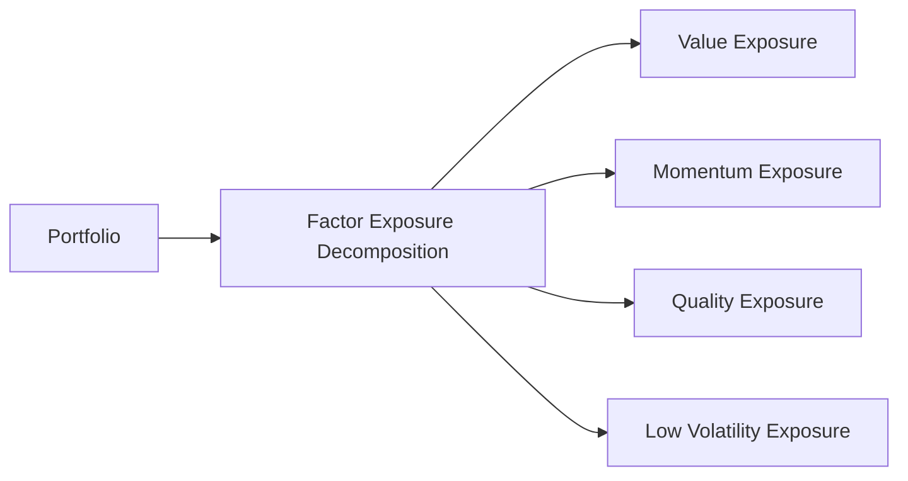

## Introduction

Why do certain stocks, bonds, or real estate holdings trend in a particular direction regardless of their specific industry or geographic region? It often boils down to underlying “factors” that are at play across different securities. For some, this discovery is what made investing feel like uncovering secret puzzle pieces. Factors like Value, Growth, Momentum, Low Volatility, and Quality have been identified by academics and practitioners as fundamental drivers of returns that cut across traditional asset class boundaries.

In older days, many investors would organize their portfolios strictly by region or asset class. But factor investing tries to strip away that top layer and say, “Let’s look at the risk and return drivers inside your holdings.” In fact, factors can explain a significant portion of a portfolio’s performance, sometimes more so than the simplistic grouping into equities and fixed income. With the right analysis, you can figure out whether your portfolio is, say, heavily tilted toward high-growth technology names—even if you thought you were just holding a broad equity index.

Let’s dive into how we structure asset allocations using this factor-based approach, how we manage overlapping exposures, and how we use these factors for risk budgeting and performance analysis. We’ll walk through theory, highlight real-world practice, and, yes, share a personal anecdote or two. I’ll never forget a moment (it was in the middle of the night, well, it felt like the middle of the night) when I realized I’d inadvertently made a big bet on Growth and Momentum in my personal portfolio—without meaning to. Factor-awareness might have saved me a few sleepless nights.

## Understanding Factor Investing

Factor investing is a strategy that allocates capital based on empirically identified drivers of returns. Rather than focusing purely on high-level asset classes such as “U.S. equities,” you look under the hood to identify exposures to, for example, Value (buying cheap stocks relative to fundamentals), Momentum (chasing recent winners, albeit in a disciplined way), Low Volatility (focusing on stocks with historically lower price fluctuations), and Quality (companies with stronger balance sheets or profitability metrics).

From Chapter 3 references in this curriculum, we know that we can represent systematic risk exposures either through broad asset classes or through factors. In factor-based allocations, you dive deeper into the portfolio to find what really moves the needle.

### Systematic vs. Idiosyncratic Factors

• Systematic risk factors are broad influences that affect many securities or the entire market—think of market beta, interest rate exposure, or credit spreads.  
• Idiosyncratic risks are unique to a specific security and can be diversified away with enough breadth in your portfolio.

It’s the systematic factors that have historically been studied for consistent return premia. For example, Value has been observed to outperform (in many markets, over the long run) because cheap stocks tend to revert upward. Momentum can keep running in the short term, and so on. By contrast, idiosyncratic outcomes—like a CEO scandal in one firm—are not typically considered “factor exposures.”

A common mathematical representation of a factor model (for a single security i) is:


R_i = \alpha_i + \sum_{k=1}^{K} \beta_{i,k} F_k + \epsilon_i


where:  
• \\( R_i \\) is the return on security i,  
• \\( F_k \\) is the return of factor k (e.g., Value, Momentum, etc.),  
• \\( \beta_{i,k} \\) is the exposure or sensitivity of security i to factor k,  
• \\( \alpha_i \\) is the security’s alpha (excess return not explained by the factors),  
• \\( \epsilon_i \\) is the idiosyncratic component.

## Constructing Factor-Based Portfolios

When we talk about constructing a factor-based portfolio, we’re often using a risk model that identifies how each security in the portfolio loads onto these different factors. Then—like a chef checking flavors in a stew—we can tune these loadings to emphasize or minimize certain factors.

### Step-by-Step Factor-Based Construction

1. Identify Relevant Factors: Usually, we start with well-known style factors (Value, Momentum, etc.) or macro factors (inflation, interest rates, credit spreads).  
2. Determine Factor Exposures of Potential Holdings: For each asset or security, measure its loading on each factor. This can be done through regression, factor scorecards, or third-party factor analytics.  
3. Assess Correlations Among Factors: Some factors can be strongly correlated in certain market regimes. If you chase Growth while also overweighting Momentum, you might be doubling down on the same structural risk.  
4. Set Factor Targets or Constraints: Decide how much overall factor exposure you want; is it a moderate tilt toward Value? Or do you want to be neutral on certain factors to reduce risk?  
5. Optimize the Portfolio: Use a risk model or mean–variance optimization approach that incorporates factor correlations rather than just asset-class correlations.  
6. Review Conflicts or Overlaps: Check that your final portfolio doesn’t inadvertently amplify one factor and overshadow others.  

In practice, for instance, you might realize that a big position in pharmaceuticals combined with certain industrial stocks inadvertently piles into Quality exposures. Or your new love for consumer-tech names might keep pushing you into Growth territory more than you intended.

### Visualizing Factor Decomposition

Below is a simple diagram of how you might see factor-based construction as part of a broader portfolio design. It’s a simplistic view but helps you see how factor decomposition might branch out:

The portfolio is broken into different factor exposures, each of which holds a part of the total risk budget.

## Analyzing Factor Exposures

One big advantage of factor-based asset allocation is it helps you see if your portfolio is secretly making a big bet on something you didn’t realize. Maybe your nominally “diversified” equity portfolio has a heavy tilt toward Growth—particularly if you’ve been picking technology and biotech names. That’s fine if it’s deliberate. But you know how it goes sometimes: you add a few “innovative” companies, a couple of small-cap picks, and you blink and discover you have a de facto Momentum rocket on your hands.

By decomposing your portfolio into factors, you can decide how much factor exposure is appropriate for your goals and risk tolerance. For instance, you could systematically reduce Momentum exposure if you believe market sentiment is turning. Or you could maintain a strategic bias toward Value if your research suggests that Value’s risk premium is likely to persist for the next few years.

### Overlaps and Unintended Bets

A huge problem in multi-asset portfolios is that the same factor might appear multiple times—just wearing different hats. For example, a tilt toward high-yield bonds and an equity style tilt toward small-cap value might both produce a high level of “credit risk,” albeit reflected differently in standard asset class labeling. That’s why factor analysis is so powerful: it shows how your entire portfolio might revolve around that same “value-ish, credit-like” risk factor.

## Strategic vs. Tactical Factor Tilts

Now, let’s get a little deeper into the ways you can deploy factor tilts: strategic and tactical.

### Strategic Factor Tilts

Strategic tilts are long-term positions. Maybe your research shows that Value historically outperforms over the full cycle, so you decide to overweight Value as a core policy. Or you believe Low Volatility is an interesting anomaly that might reduce portfolio drawdowns over time, so you keep a consistent tilt in that direction. In other words, you set it and (mostly) forget it, with periodic rebalancing.

Strategic factor investing generally relies on strong empirical evidence, academic literature, and market behavior—like the widely cited work of Eugene Fama and Kenneth French on the Value premium, or the large body of evidence on Momentum. Because these factor premiums can wax and wane, strategic investors expect to hold them through downturns, with the belief that over multiple cycles, the factor delivers a positive risk-adjusted return.

### Tactical Factor Tilts

Tactical tilts, on the other hand, are short-term adjustments to your factor exposures based on market conditions, economic forecasts, or momentum signals. Maybe you see that Momentum has been on a tear (and you think it will keep going for a bit), so you overweight Momentum for the next quarter. Or you believe that interest rates are about to rise sharply, so you underweight interest-rate-sensitive factors in your fixed-income portfolio.

Tactical factor decisions often require market timing skill or advanced quantitative models. The risk is higher because you might be wrong in your short-term view—timing can be tricky, as we all know.

## Risk Budgeting With Factors

Traditional risk budgeting typically partitions the portfolio’s risk among asset classes—e.g., 40% of the risk in equities, 30% in fixed income, 20% in alternatives, etc. Factor-based risk budgeting slices the risk pie a bit differently: you allocate your “risk budget” to individual factors. For instance:

• 25% of the total risk to Value,  
• 25% to Momentum,  
• 20% to Low Volatility,  
• 15% to Quality,  
• 15% to Macro factors (like interest rate changes or inflation).

If you are “over-limit” on one factor, you rebalance or de-emphasize that factor. This approach provides a more granular handle on what’s truly driving your portfolio’s returns. Instead of trying to juggle complex asset-class interactions, you can manage each factor’s share of the overall risk.

Here’s a simple representation of the factor-based approach to total portfolio returns, summing up factor exposures:


R_p = \beta_{\mathrm{Value}} \times R_{\mathrm{Value}} + \beta_{\mathrm{Momentum}} \times R_{\mathrm{Momentum}} + \dots + \epsilon


where \\( \beta_{\mathrm{Value}} \\) is the portfolio’s overall exposure to the Value factor, and \\( R_{\mathrm{Value}} \\) is that factor’s return. Summing across factors yields your portfolio’s systematic exposure. Any leftover risk or return is considered alpha or security-specific \\(\epsilon\\).

## Factor-Based Approaches vs. Traditional Approaches

Traditional asset allocation organizes the portfolio based on asset classes (e.g., domestic equities, international equities, corporate bonds, government bonds) and possibly sub-categorizes them by region or industry. Factor-based approaches cut across these lines and highlight underlying risk premia. In some cases, factor-based investing can simplify and unify your portfolio. Instead of holding three different U.S. equity funds that, after further inspection, all emphasize Growth, you might simply say: “Let’s hold a broad equity fund plus a targeted Value factor fund, balancing them to achieve my desired factor tilt.”

In Chapter 3 of this curriculum, the concept of representing systematic risk exposures through asset classes was introduced. Factor-based approaches effectively re-label systematic exposures more precisely, enabling you to see correlations that might be hidden by superficial groupings. The synergy between factor-based and traditional approaches can actually be complementary if you employ both sets of insights—use factors for deeper analysis and risk control while still thinking about broad categories for macro positioning.

## Practical Implementation Challenges

Amid the excitement around factor investing, it’s important to be aware of practical hurdles:

• Data and Measurement: Defining “Quality” is trickier than it looks. Different vendors have different definitions, and some may have data lags.  
• Correlation Among Factors: Factors are not static. Momentum and Growth may be highly correlated in some market conditions but not in others.  
• Turnover and Transaction Costs: Factor rebalancing can mean higher turnover, leading to costs that erode your alpha if not managed carefully.  
• Capacity Constraints: A factor like Low Volatility might become crowded if too many investors chase it.  
• Behavioral Biases: Overreacting to short-term factor performance can lead to suboptimal timing and frequent strategy shifts.  

## Best Practices and Common Pitfalls

Below are some best practices for adopting a factor-based approach:

• Stay Consistent With Your Investment Policy Statement: If your client’s risk and return objectives revolve around controlling drawdowns, Low Volatility might align well. However, ensure you’re not inadvertently ignoring your client’s primary constraints or time horizon.  
• Monitor Factor Exposures Regularly: Just as a pilot regularly checks flight instrument readings, you should re-check factor exposures to ensure they match your intended profile.  
• Avoid Overfitting: Some factor strategies look incredible historically but fail out-of-sample. Focus on well-documented factors with robust evidence.  
• Don’t Neglect Correlations: Overreliance on two correlated factors can lead to excessive concentration risk.  
• Know Your Exit Strategy: If you’re leaning on short-term factor trends, define your rebalancing or exit criteria.  

One poignant memory that comes to mind (and yes, it’s a bit embarrassing) is when I once loaded up on Value stocks late in a cyclical rally—thinking I was being contrarian—and basically ended up with a “cheap for a reason” portfolio. It taught me that, while factor investing is powerful, each factor can go through prolonged periods of underperformance. So always remember to size these bets based on your risk appetite and overall plan.

## Concluding Remarks

In many ways, factor investing is like decoding the DNA of your portfolio. You’re no longer content with knowing you have “equities”—you want to see whether they’re Value, Growth, or Momentum, or perhaps you have a hidden tilt to cyclical industries. This knowledge can be empowering and allow for more precise risk control. But like any approach, factor investing must be thoughtfully integrated with your goals, constraints, and macroeconomic expectations.

As you progress through the CFA Level III curriculum, you’ll see how factor investing ties into strategic asset allocation (from Chapter 4.1 on MVO to Chapter 5 on real-world constraints). It’s a flexible framework that can amplify the other tools you’ve learned, whether that’s liability-relative investing or goals-based approaches. If used wisely, factor investing can help you fine-tune your portfolio exposures, optimize risk allocation, and potentially improve long-term performance.

## Exam Tips

• When facing a constructed-response question that pits factor-based allocations against traditional asset-class approaches, clearly articulate the advantages (and disadvantages) of each.  
• Be prepared to interpret factor decomposition in a scenario-based item set: identify exposures, discuss correlation among factors, and propose portfolio adjustments.  
• For a question about tactical vs. strategic tilts, remember that strategic tilts are based on long-term evidence, while tactical tilts involve active judgment on short-term dynamics.  
• Watch out for correlation traps. The exam might provide a scenario where two factors are unexpectedly correlated, leading to concentrated risk.  
• Be succinct, but ensure you link each step to the candidate’s unique objectives, constraints, or risk tolerance to show you understand the integrated nature of factor investing.

## References and Suggested Readings

• Ang, A. (2014). Asset Management: A Systematic Approach to Factor Investing. Oxford University Press.  
• Asness, C., Frazzini, A., & Pedersen, L. H. (2019). “Quality Minus Junk,” Review of Accounting Studies.  
• CFA Institute (2025). “Using Investment Factors in Asset Allocation,” in 2025 Level III Curriculum, Volume 1.

--------------------------------------------------------------------------------

## Test Your Knowledge: Factor-Based Asset Allocation Strategies Quiz



### Which of the following best describes the primary goal of factor-based asset allocation?

- [x] To identify underlying return drivers that cut across traditional asset classes
- [ ] To eliminate portfolio correlation completely
- [ ] To classify securities based on regulatory regimes
- [ ] To maximize unsystematic risk exposures

> **Explanation:** Factor investing focuses on core risk premia (e.g., Value, Momentum) that transcend standard asset class boundaries.

### Which statement most accurately distinguishes idiosyncratic risk from systematic risk factors?

- [x] Idiosyncratic risks are unique to individual securities, while systematic factors affect broader markets.
- [ ] Idiosyncratic risks are common economic influences, while systematic factors are security-specific.
- [ ] Idiosyncratic risks affect all securities equally.
- [ ] Systematic factors can usually be hedged out with single-stock positions alone.

> **Explanation:** Idiosyncratic risks are security-specific, whereas systematic factors reflect broad market influences.

### In a factor-based risk budgeting framework, what is the most likely approach to rebalancing if one factor’s risk contribution exceeds its target?

- [x] Reduce exposure to that factor until its share of total risk aligns with the budget
- [ ] Increase overall volatility to allow more factor leeway
- [ ] Switch to a liability-relative approach
- [ ] Eliminate the factor entirely

> **Explanation:** Factor-based risk budgeting typically involves adjusting exposures if a factor becomes too large a contributor to overall portfolio risk.

### An investor holds both a high-yield bond portfolio and a small-cap value equity fund, leading to a concentrated “credit-like” exposure. This phenomenon is known as:

- [x] Overlapping factor exposures
- [ ] Goal-based investing
- [ ] Heuristic optimization
- [ ] A single-period MVO approach

> **Explanation:** The high-yield bond and small-cap value equity allocations may share a similar underlying factor (credit/value), creating overlapping risk.

### Which of the following is a key characteristic of a strategic factor tilt?

- [x] It is based on long-run empirical evidence and is maintained consistently.
- [ ] It seeks short-term alpha generation from market timing.
- [x] It often involves large, frequent changes in exposures.
- [ ] It ignores factor correlations entirely.

> **Explanation:** Strategic tilts rely on enduring evidence that suggests certain factors provide persistent premiums. They are intended for consistent, long-term allocations.

### If a portfolio were to overweight both Growth and Momentum factors simultaneously in a bullish market environment, what is the main risk?

- [x] Increased correlation and potential drawdowns if both factors turn negative
- [ ] Reduced portfolio turnover
- [ ] Automatically reduced exposure to systematic factors
- [ ] Idiosyncratic risk becomes unmanageable

> **Explanation:** Growth and Momentum often behave similarly, particularly in strong markets, so simultaneously overweighting them may compound losses if market sentiment reverses.

### Which of the following statements is most accurate regarding factor investing and transaction costs?

- [x] Frequent rebalancing to maintain factor exposures can increase transaction costs.
- [ ] Factor investing inherently reduces turnover to zero.
- [x] Factor investing encourages “buy and hold” with no rebalancing.
- [ ] Transaction costs are never considered in factor-based approaches.

> **Explanation:** Factor-oriented strategies often require ongoing rebalancing to retain desired exposures, which can result in higher transaction costs.

### What is a potential disadvantage of strictly targeting factor exposures rather than traditional asset classes?

- [x] Factor definitions and correlations can shift over time, complicating portfolio management.
- [ ] It guarantees higher returns over any time horizon.
- [ ] It totally eliminates style drift.
- [ ] It requires no regular monitoring.

> **Explanation:** Factors and their correlations can evolve across market cycles, so maintaining appropriate factor exposures takes effort and a dynamic approach.

### How is factor-based asset allocation most helpful in identifying unintended risks within a multi-asset portfolio?

- [x] By decomposing total holdings into specific factor exposures that may appear across different asset classes
- [ ] By replacing all equities with fixed-income securities
- [ ] By eliminating all correlation among asset classes
- [ ] By employing a static 60/40 stock-bond split

> **Explanation:** Factor-based allocation reveals overlapping exposures to the same risk factors, even when they appear in different asset classes.

### True or false: A tactical factor tilt always replaces a strategic tilt in a portfolio construction process.

- [x] True
- [ ] False

> **Explanation:** If the portfolio strategy includes both long-term factor tilts (strategic) and short-term adjustments (tactical), the short-term tilt will supersede or modify the strategic weights during the tactical period. In practice, you can revert to the strategic position once the tactical view has played out.


