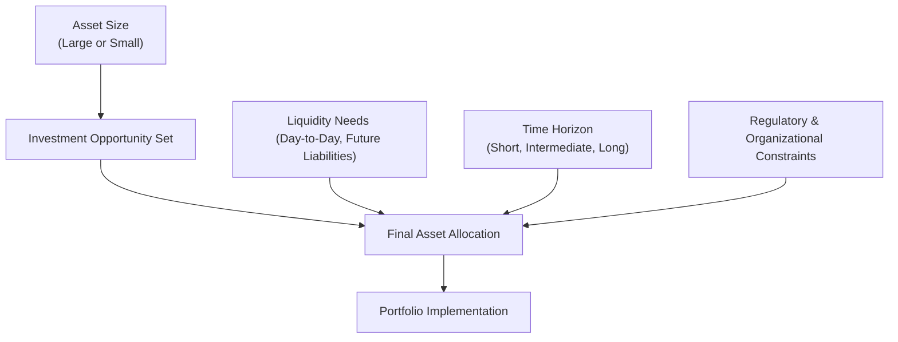

## Introduction

So, you’ve probably noticed that no matter how elegant a portfolio theory is in a textbook, real investment environments can pose all kinds of messy complications. Asset size can open certain doors—or slam them shut—and you might have to juggle liquidity constraints that can feel like you’re racing against the clock. Then toss in regulatory constraints, time horizon issues, and a host of other unique client demands—well, it’s not exactly straightforward. But that’s real life, right?

This section explores the main real-world constraints that come into play when designing an asset allocation. We’ll look at the implications of large versus small asset pools, figure out how to manage liquidity requirements without feeling cornered, and discuss how time horizon and compliance demands all wrap together into your final strategy. Let’s dive in.

## Asset Size Considerations

Asset size is one of those things that can dramatically shape the opportunity set for an investor. A large pension plan with billions under management has a much broader menu of investments at its disposal compared to a modest family trust with a few million. And it’s not just about prestige. It’s also about how costs spread out, the kind of deals you can access, and the internal resources you can devote to analysis.

### Large Asset Pools
Large portfolios can enjoy meaningful economies of scale. Fixed costs, such as research subscriptions or certain technology fees, get spread across a big pile of assets, so the per-dollar expense ends up being lower. In addition, large investors might qualify for lower management fees because they can allocate sizable amounts of capital to a single manager.

Moreover, some investments—like private equity, specialized hedge funds, or infrastructure deals—often have steep minimum investment thresholds. If your organization is large enough, you can meet those thresholds without blinking. You can also hire specialized teams or consultants for in-depth due diligence.

But large organizations are not without a few challenges. Sometimes, the sheer volume of assets can be cumbersome to manage because you must deploy capital in ways that are both efficient and scalable. Niche, high-alpha strategies that only accept small amounts might not move the needle for a mega fund. Portfolio transitions can be tricky too. If you need to shift 10% of a $50B fund, that’s $5B—trading that much without moving the market can require a well-thought-out trading strategy (including possible use of dark pools or negotiated block trades to minimize slippage).

### Small Asset Pools
Small asset pools, on the other hand, have fewer options to choose from—or maybe it’s more accurate to say fewer exotic places to invest. Some specialized strategies or direct private-equity deals may be off-limits due to high minimum allocations or high due-diligence costs relative to total assets. Also, you might not get institutional-class pricing on funds when you go in with a relatively small ticket size. Sadly, that can translate into higher expense ratios.

On the bright side, smaller portfolios can be more agile. Liquidating or reallocating smaller pools usually causes less market impact. Additionally, there’s less managerial complexity and fewer layers to wade through. In practice, a moderately sized institutional portfolio can still access a wide array of index funds, ETFs, or mutual funds to build a well-diversified portfolio that meets most risk-return objectives. And some smaller portfolios might have fewer decision-makers, which can streamline the governance process.

## Liquidity Requirements

Setting aside the important question of “how big is the portfolio?” the next question that often leaps to mind is: “How quickly might we need the cash?” You know, for day-to-day needs, unplanned spending, or even market opportunities that pop up.

### Operational Needs
If an organization or family trust has regular expenses—like monthly payouts, salaries, bills, capital expenditures, or scheduled philanthropic grants—those outflows must be covered by readily available liquid assets. You don’t want to scramble to sell private-equity shares (which can be impossible to liquidate quickly) just to cover monthly overhead.

Short-term instruments such as treasury bills or money market funds often serve this purpose. Some institutional investors, such as insurance companies or health care systems, segment their portfolios into a short-term “operating” pool and a longer-term “strategic” pool that invests for growth.

### Illiquid Investments
Private equity, real estate, and certain alternative strategies like distressed debt can require capital to be locked up for years. This arrangement can present difficulties if an institution encounters sudden demands—like a large claim for an insurance firm or an unexpected philanthropic initiative for a foundation. That’s why it’s best practice to ensure alignment between lock-up periods and overall risk tolerance as well as projected liquidity needs.

Lock-up periods exist for a reason: these strategies often invest in lengthy, transformation-oriented projects that need time to mature. So it’s not that illiquid assets are automatically a bad idea; they can produce strong returns or diversification benefits. But they must remain proportionate. If too large a share of the portfolio is tied up, it can lead to a liquidity squeeze during market crises or unforeseen events.

### Lock-Up Constraints
Another angle here is lock-up constraints in hedge funds, private credit, or even real estate special-purpose vehicles. These can limit the ability to redeem capital even after you’ve invested. While this can provide stable core funding for the manager, from the investor’s perspective, it feels like being handcuffed. If that’s unacceptable for your client or your organization, focusing on more liquid alternatives might be advisable.

## Time Horizon

Time horizon is like the anchor for all of your asset allocation decisions. A short time horizon means you need to protect capital, possibly at the expense of high returns. A longer time horizon, on the other hand, opens the door to more volatile or growth-oriented assets because you have time to ride out the inevitable storms.

### Short Horizons
If you’re dealing with a retiree who plans to withdraw a small portion of the portfolio immediately, or a corporate treasury investing cash temporarily, you generally want less exposure to price volatility. That translates into shorter-duration fixed income, a heavier allocation to cash equivalents, and some stable equity positions (potentially defensive sectors or dividend payers). You also have to keep an eye on inflation—though short-term inflation risk can sometimes be overshadowed by capital preservation needs.

### Long Horizons
University endowments, pension funds with younger participants, or large foundations set up in perpetuity can boast multi-decade investment outlooks. This can justify heavier exposures to equities, private equity, and other growth engines. A long horizon may allow for acceptance of higher short-term volatility and illiquidity. And historically, research has shown that a well-structured portfolio with growth assets tends to generate higher expected returns over time. Of course, one must consider that “long horizon” doesn’t mean “infinite horizon”: interim cash needs, major capital expenditures, or liability payouts might require some liquidity planning.

## Regulatory Constraints

Regulations can shape portfolio choices in a major way. Pension funds, insurance companies, sovereign wealth funds, endowments—each has its own set of rules to follow.

### Pensions and Insurance
In the United States, pension plans subject to ERISA (Employee Retirement Income Security Act) must operate under certain fiduciary rules, including prudent investment guidelines and minimum funding requirements. Insurance companies often follow capital adequacy rules under local or international frameworks (like Solvency II in the EU). These rules can put limits on how much capital can be committed to certain asset classes and also demand that certain liabilities are matched with higher-quality assets.

### Sovereign and Policy Constraints
Sovereign wealth funds or government agencies frequently have additional policy or political constraints. For example, a country might not invest in industries that run counter to its socio-economic objectives, or there could be local laws preventing foreign investments beyond a certain allocation. Politics can come into the mix, too: a change in administration might alter the allowable investable universe.

### Endowments and Foundations
Some endowments have to honor donor-imposed investment constraints—like avoiding certain types of industries or certain types of derivatives. They might also be guided by spending rules that specify how much income should be paid out annually. Compliance with state or provincial regulations about mission-related or socially responsible investing can add another twist.

## Other Constraints

We’ve talked about some big items, but let’s not forget that unique preferences or legal structures can play a big role in shaping a portfolio.

### Ethical and Religious Restrictions
If your client prefers to avoid “sin” stocks (like alcohol, tobacco, or gambling) or wants to align with green or faith-based investing principles, entire categories of assets might simply be off the table. This can slightly reduce diversification potential, or it can cause some tracking error relative to mainstream benchmarks. However, the intangible benefits of mission alignment can be quite rewarding for the client.

### Legal Considerations
Trust agreements or disclaimers can prohibit the trustee from investing in high-risk strategies. Or certain securities might violate rules around self-dealing or overlapping ownership. It’s always important to read legal documents carefully—even if it’s dry reading—and consult counsel to ensure compliance.

### Organizational Factors
Every organization has a governance structure. If approval from a committee of 12 directors takes six months, quick changes to an asset allocation are obviously not feasible. Some organizations have robust processes with multiple layers of oversight and risk committees, while others are more hands-on and nimble. Understanding how quickly you can act is crucial for seizing market opportunities or rebalancing in times of volatility.

## Practical Steps and Best Practices

Given all these constraints, how do we keep things practical?

• Conduct a comprehensive inventory of constraints. Gather everything—liquidity demands, relevant regulation, time horizon, coverage of operational expenses, governance processes, and so on.  
• Align liquidity needs with matching liquidity in your portfolio. This might imply having a dedicated cash or short-term instruments buffer for day-to-day or predictable payouts.  
• Conduct scenario analysis to see how the portfolio would respond to unexpected liquidity events, interest-rate spikes, or unplanned capital calls.  
• Double-check compliance. There’s nothing worse (or more embarrassing) than discovering a breach of some regulatory or trust constraint after the fact. Thorough documentation of relevant laws and internal policies is critical.  
• Evaluate those “niche” or “alternative” strategies carefully. If you have the scale and the investor appetite to handle them, they can add a nice layer of diversification and return potential. But watch out for lock-up periods and limited redemption windows.  

## An Illustrative Example

Let’s say we’re working with a mid-sized charitable foundation—around $100 million in assets. The organization has moderate, ongoing grant commitments: about $3 million a year that must be disbursed. They also have a moderate time horizon, effectively perpetual, but the foundation’s board is quite conservative. Additionally, the foundation’s giving mandate requires them to avoid investments in fossil fuels or tobacco.

Any heavy commitments to private equity with multi-year lock-ups might create stress if they fail to maintain adequate liquidity to meet the yearly grants. They might decide to invest 70% in equities, 20% in fixed income, and 10% in liquid alternatives or real assets with short redemption windows. They’ll keep a rolling allocation to money market instruments for near-term cash. The fossil fuel and tobacco screens mean they’re cutting out a slice of the equity universe, so they select an ESG-oriented global equity strategy. The board meets quarterly, so any reallocation requests above a certain threshold need a full board vote—this means big shifts can’t happen overnight. Perfect example of how governance constraints matter.

## Visualizing Constraints in Asset Allocation

Below is a simple diagram illustrating how key constraints feed into the final asset allocation decision. Quick note: we use Mermaid.js for easy rendering.

## Glossary

Lock-up Period: A predefined time during which investors cannot redeem or sell shares of a particular fund.  
Economies of Scale: Cost advantages that organizations obtain due to size, output, or scale of operation.  
Solvency Requirements: Regulatory capital thresholds that financial institutions must maintain to ensure they can meet long-term obligations.  
Endowment: A financial asset donation made to a nonprofit organization, typically with certain rules about spending only the investment income.  
Foundation: A nonprofit entity set up to distribute funds according to a specific purpose; it may operate under certain spending requirements and investment constraints.  
ERISA: (Employee Retirement Income Security Act) U.S. legislation establishing standards for corporate pension plans, including prudent investment and funding requirements.  
Trust Agreement: A legal arrangement in which one or more trustees hold and manage property for the benefit of others, often with strict investment directives.  
Liquidity Squeeze: A situation where a portfolio has trouble raising cash to meet obligations, usually because too many assets are locked into illiquid investments.

## References, Further Reading, and Research Materials

• Maginn, J., Tuttle, L., McLeavey, D., & Pinto, J., “Managing Investment Portfolios: A Dynamic Process,” CFA Institute Investment Series.  
• CFA Institute, 2025 Level III Curriculum, “Asset Allocation with Real-World Constraints.”  
• “Guidelines for Asset Allocation in Large Institutional Portfolios,” Journal of Portfolio Management.  
• International Monetary Fund (IMF) website for regulatory updates: https://www.imf.org/  

## Exam Tips

• Pay attention to the interplay between liquidity needs and time horizon. Many exam questions revolve around recognizing that an overly aggressive allocation is ill-suited for short horizons.  
• Memorize key regulatory constraints for different institutional investors (pension vs. insurance vs. endowment). The exam might present a mini-case that tests whether you know which asset classes can or cannot be used under specific regulations.  
• Develop a systematic way of spotting constraints. On the exam, read the case carefully, highlight constraints in the text, and link them to the final portfolio recommendation.  
• If asked to show calculations related to portfolio rebalancing or liquidity coverage, be methodical. Show each step, referencing the constraints.  
• Time is a factor in the essay portion. Efficiently summarize constraints and provide well-supported recommendations—it’s easy to get bogged down in details.  
• Practice scenario-based questions where multiple constraints overlap. The ability to handle complexity is central to passing the Level III exam.

## Test Your Knowledge: Real-World Constraints in Asset Allocation



### Which statement best describes the impact of a larger asset size on investment options?

- [ ] Larger portfolios experience fewer choices in alternative investments due to size limitations.  
- [ ] Larger portfolios always invest exclusively in short-term securities.  
- [x] Larger portfolios can access specialized investments and enjoy economies of scale.  
- [ ] Larger portfolios are required by law to invest solely in domestic markets.  

> **Explanation:** Large asset pools tend to gain access to specialized, higher-minimum strategies (e.g., private equity) and can benefit from economies of scale when spreading fixed costs over a bigger base.

### Which of the following is a key risk of emphasizing illiquid investments?

- [ ] Enhanced market timing opportunities during drawdowns.  
- [ ] Guaranteed higher returns compared to liquid investments.  
- [ ] Lower capacity to invest in small, specialized vehicles.  
- [x] Potential inability to meet unexpected cash needs.  

> **Explanation:** Illiquid investments typically come with lock-up periods, making it challenging to raise cash quickly in unforeseen circumstances.

### What is a typical characteristic of a short time horizon?

- [ ] Greater emphasis on illiquid private equity.  
- [ ] Prioritizing long-term growth with high-volatility assets.  
- [x] A focus on capital preservation and lower volatility assets.  
- [ ] No need for liquidity to meet obligations.  

> **Explanation:** With a short time horizon, investors lean toward assets with lower price fluctuation and quick availability of funds.

### Under ERISA in the US, pension funds must:

- [x] Operate under prudent investment guidelines and minimum funding standards.  
- [ ] Invest in hedge funds only.  
- [ ] Prohibit the use of equity investments.  
- [ ] Place all capital in offshore accounts to avoid taxes.  

> **Explanation:** ERISA imposes prudence, diversification, and funding rules on pension plans to protect beneficiaries.

### Which organization is most likely to have a near-infinite time horizon?

- [ ] A retiree’s personal investment account.  
- [x] A university endowment.  
- [ ] An insurance company’s claims reserve.  
- [ ] A money market mutual fund.  

> **Explanation:** University endowments or perpetual charitable foundations often have an indefinite investment horizon, enabling them to allocate to long-term growth assets.

### A typical advantage of small asset pools compared to larger ones is:

- [ ] Access to direct infrastructure deals.  
- [x] Easier and faster execution when changing allocations.  
- [ ] Lower expense ratios by default.  
- [ ] Priority status with private investment managers.  

> **Explanation:** Because small pools involve fewer transactions in absolute dollar terms and fewer decision-makers, they can often adjust allocations more rapidly if needed.

### A lock-up period refers to:

- [x] A timeframe in which investors cannot withdraw their capital from a fund.  
- [ ] A bond’s maturity schedule.  
- [x] The time it takes for a derivative contract to expire.  
- [ ] The period required for completing a currency hedge.  

> **Explanation:** Lock-up periods prevent investors from redeeming their shares in certain hedge funds or private equity funds, offering the manager capital stability.

### A high-level step in managing regulatory constraints effectively is:

- [x] Incorporating all relevant statutes and guidelines into the investment policy statement.  
- [ ] Ignoring them if short-term returns are high enough.  
- [ ] Substituting private equity for all equity holdings.  
- [ ] Focusing solely on ESG factors.  

> **Explanation:** Compliance with regulations is critical. Documenting and monitoring them in the policy statement ensures all investing activities align with applicable rules.

### Why would an ethical constraint (such as avoiding tobacco stocks) impact portfolio performance?

- [x] It can reduce the overall diversification and potentially introduce tracking error.  
- [ ] It automatically increases returns due to moral superiority.  
- [ ] It violates ERISA guidelines.  
- [ ] It forces all capital into fixed income securities.  

> **Explanation:** By removing certain sectors, the investor might face a narrower investable universe, which can affect diversification and benchmark comparisons.

### A common best practice for addressing unexpected liquidity needs is:

- [x] Maintaining a reserve of highly liquid, short-duration assets.  
- [ ] Deploying all capital into private real estate at the start of the investment.  
- [ ] Eliminating all equity holdings to free up maximum liquidity.  
- [ ] Relying on lock-up periods to ensure capital remains in place.  

> **Explanation:** Keeping a cash reserve or other liquid assets helps meet unanticipated demands without liquidating longer-term facilities at an unfavorable time.


