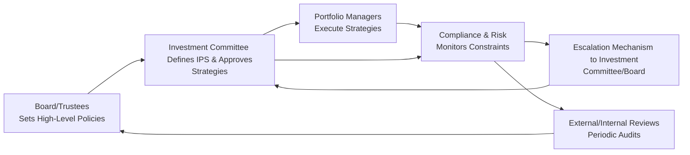

## Introduction

You know, when I first started dealing with investment committees, it was a bit intimidating. One day, I walked into a boardroom full of people who had decades of experience managing large institutional portfolios. I was there to talk about portfolio constraints and governance oversight. I still remember thinking, “Um, what if I say the wrong thing?” But as we dug deeper, it became clear: robust governance is critical, especially when we’re juggling multiple constraints—like regulatory limits, liquidity requirements, ESG preferences, and more. After all, even the best asset allocation plan can unravel if nobody ensures the constraints are consistently enforced.

By now, in Chapter 5, we’ve discussed a host of real-world concerns ranging from regulatory constraints (Section 5.1) to tax considerations (Section 5.2) and ESG investing (Section 5.6). In this final segment, we’ll zoom in on the governance structures needed to oversee these constraints and keep complex portfolios on track. In short, we’re tackling the processes and policies that ensure everyone follows the rules—from portfolio managers and traders to the board or external fiduciaries—and that potential breaches are flagged and addressed.

## The Importance of Clear Roles and Responsibilities

One of the recurring points in any discussion about governance oversight is the strong need for transparent roles and responsibilities. In many organizations, you might have a board of directors at the top, an investment committee overseeing the strategy and policy, and then a set of internal or external portfolio managers who do the day-to-day work. The challenge is making sure each member of this chain knows precisely where they fit in.

• Board of Directors or Trustees: Often holds the ultimate fiduciary responsibility, setting high-level constraints or mandates (for example, “We must follow this regulatory ratio” or “We will not exceed this leverage level”).

• Investment Committee: This is the group responsible for setting detailed policy guidelines, establishing an Investment Policy Statement (IPS), and overseeing portfolio management. The investment committee might approve specific exposures, monitor manager performance, or hire/fire external managers.

• Portfolio Managers: These folks do the heavy lifting when it comes to executing investment strategies. Whether they’re internal staff or external third-party managers, they’re tasked with achieving returns within the guidelines established by the board and the investment committee.

• Compliance and Risk Teams: Usually operate in parallel, ensuring that trades and positions satisfy all constraints. They’re typically the “check” mechanism for the entire system, verifying that managers stay within their authorized parameters.

In practical terms, each group’s responsibilities should be clearly documented—often in the IPS or in a governance charter—so that nobody can say, “Wait, I thought it was your job to check for compliance breaches.”

## Policy Formation and Approval

So, how do we transform big-picture constraints—like “maintain sustainable investing principles” or “avoid risky derivatives”—into specific, workable policies? The answer usually lies in developing a robust Investment Policy Statement and associated guidelines.

The IPS typically covers:  
• Permissible assets (e.g., specific equity or bond segments),  
• Leverage limits or guidelines,  
• The risk budget (how much volatility or tracking error is allowable compared to a benchmark),  
• ESG frameworks (for instance, whether to exclude certain industries or engage with them to improve corporate behavior),  
• Regulatory constraints (e.g., maximum position sizes or leverage set by law).

This policy then goes before the investment committee for review and approval. If a portfolio manager wants to deviate from existing constraints—say, by investing in a newly emerging asset class or applying a new hedging strategy—the manager must submit a proposal to the investment committee. In some cases, the committee might escalate that request to the board if it entails shifting major risk parameters or fundamentally changing the investment approach. Any time you add a new constraint (for instance, deciding that you’re going to systematically integrate climate risk into your screening process), you update those policies. 

### Example: Climate-Friendly Mandate  
In many funds, the conversation around ESG is front and center. Suppose the board decides to reduce the carbon footprint of the portfolio by 30% over the next five years. That high-level objective gets spelled out in the IPS, detailing exactly how to measure the portfolio’s carbon exposure, what data providers to rely on, and what thresholds represent a breach. The investment committee then monitors monthly or quarterly reports to see whether managers are hitting the targets. If the managers aren’t meeting those climate targets or if they exceed the carbon limit for a certain part of the portfolio, the committee can demand a plan of action—maybe rebalancing or unwinding positions.

## Monitoring and Reporting

Once constraints are set, the real work begins: you’ve got to track your portfolio’s behavior and check for compliance. This is where performance reports, risk dashboards, and compliance audits come into play. In practice, a robust monitoring environment includes:

• Regular Performance and Compliance Reporting: These are typically monthly or quarterly. Managers show performance relative to benchmarks, but they must also demonstrate that no constraints have been breached—like max single-issuer exposure, concentration limits, or sector exposures.  
• Tracking Error Analysis: We often talk about tracking error as the volatility of the difference between a portfolio’s returns and its benchmark’s returns. A higher-than-expected tracking error might indicate the manager is taking on more risk than the policy allows.  
• Performance Attribution: If the committee wants to see exactly how a manager is generating returns, performance attribution helps break it down into categories like security selection, sector allocation, or currency decisions. If a manager is supposed to be a pure “value” investor but half the alpha is coming from currency bets, that might raise a red flag about style drift.  
• Compliance Reporting: This is the formal process for verifying that all investments, trades, and holdings align with statutory or self-imposed constraints. Many institutions rely on automated compliance systems that generate alerts whenever a holdings threshold is exceeded.

### Internal Audits and Compliance Teams

Let’s say you’re part of a compliance team or internal audit function. You probably conduct periodic checks (monthly, quarterly, or even daily for certain big funds) to compare actual positions against the permissible range. Beyond that, you might confirm that each transaction meets regulatory requirements—for instance, if a certain derivative is restricted or the fund can only short an asset with specific approvals. If something is off, it’s your job to highlight it through official channels, often culminating in a formal memo to the investment committee.

And trust me, there’s no better friend and no worse enemy than the compliance or audit team—when they raise a red flag, portfolio managers must listen. Their job is not to hamper returns but to ensure the fund doesn’t breach constraints that could land the institution in legal or financial trouble.

## The Escalation Mechanism

Even the best-run institution will occasionally run into situations where constraints are breached. Maybe it’s volatility that soared unexpectedly, or a manager who inadvertently misread an internal policy limit. That’s where escalation mechanisms come in.

An escalation mechanism details exactly who gets notified and what actions are taken if something goes wrong. This might look like:

1. The portfolio manager becomes aware of a breach (or the compliance system automatically flags it).  
2. The manager reports the breach to the Chief Investment Officer (CIO) or the compliance officer.  
3. The CIO or compliance officer escalates the matter to the investment committee.  
4. In severe cases, the committee might convene an emergency meeting or alert the board.  
5. A corrective action plan is formulated—this might involve reducing exposure, liquidating certain positions, or adjusting the hedge ratio immediately.

## External and Internal Reviews

### Periodic External Reviews

Having an objective, outside eye look over your governance practices can be incredibly helpful. Some institutions hire independent auditors or consultants to review their governance structures once every couple of years. The auditors check if the institution’s written policies match up with what’s happening in reality. They might also benchmark your governance practices against industry peers—this is especially prevalent in pensions or endowments, where there are well-established best practices.

### Internal Performance Reviews

Just as important are the internal reviews: usually led by senior management, the investment committee, or sometimes specialized subcommittees. These reviews aren’t just about verifying compliance; they’re also about checking whether each part of the governance structure is functioning as intended. Are managers receiving timely reports? Are compliance teams properly resourced and truly independent? Do the committees have enough time and expertise to evaluate complex proposals? If not, the institution might adjust roles, staff, or resources accordingly.

## Visualizing Governance Oversight

It’s often helpful to see how the different moving pieces fit together. The Mermaid.js diagram below illustrates a typical governance flow for implementing constraints in a complex portfolio:

In short, the board sets the overarching mandates (A). The investment committee (B) refines those into an actionable IPS, which sets the constraints. Portfolio managers (C) then execute trades within these guidelines. Meanwhile, compliance and risk teams (D) continuously monitor positions. If something goes wrong, escalation (E) loops back to the investment committee or up to the board. Finally, audits and periodic reviews (F) provide a layer of external validation and feedback.

## Common Pitfalls and How to Overcome Them

• Lack of Clarity in Role Definition: If it’s not crystal clear who does what, tasks can fall through the cracks. Periodic review of governance charters can fix that.  
• Overly Complex Constraints: Sometimes we layer so many constraints (like ESG, multiple risk metrics, liquidity constraints, regulatory caps) that the portfolio manager can’t effectively maneuver. If constraint conflicts emerge, the institution might need to revisit and rationalize them.  
• Insufficient Monitoring Technology: Without robust compliance software or consistent data, a manager could violate a constraint without anyone noticing until it’s too late. Investing in automated compliance solutions is often money well spent.  
• Weak Escalation Path: If a breach occurs but is not escalated swiftly or to the right person, it can exacerbate the portfolio’s risk exposure. A well-documented escalation process solves this.  
• Inadequate Board/Committee Oversight: Sometimes committees don’t meet often enough or rely heavily on subpar reporting. Strengthening meeting frequency and quality of reporting can go a long way.

## Real-World Case Study

Let’s look at a hypothetical situation. Suppose a medium-sized public pension fund sets a 60/40 equity-to-fixed-income allocation. After an extensive debate, the board also decides to incorporate an ESG screen to exclude the tobacco and firearms industries. However, the portfolio manager invests in an index derivative that indirectly contains these restricted securities. Because the derivative’s underlying structure wasn’t fully understood, the manager unknowingly violated the ESG exclusion constraint.

• The compliance team notices the violation in their monthly holdings review. They trigger an escalation to the investment committee.  
• The investment committee calls an extraordinary meeting to address it. They contact the external manager who created the derivative product, demanding an immediate action plan to remove the exposure.  
• After a thorough review, the committee updates the IPS to include a more explicit screening process for all derivative exposures used in the strategy. They also invest in a more advanced compliance screening tool.  
• The board requests an external auditor to review the portfolio’s entire derivative exposure to ensure no other hidden exposures to excluded industries exist.  
• Lessons learned: If you’re using complex products, you need robust oversight. This includes understanding intangible exposures (like indirect holdings in derivatives) that might go against your constraints.

## Best Practices and Key Takeaways

• Ensure governance roles are unambiguous: from the board to subcommittees to compliance.  
• Maintain a well-defined IPS that clearly states permissible assets, risk budgets, leverage policies, and ESG frameworks.  
• Monitor constraints regularly using compliance systems, performance attribution, and tracking error analyses.  
• Put in place a swift escalation mechanism with multi-level approvals for any breach.  
• Leverage both external and internal reviews to ensure objectivity and thoroughness.  
• Treat audits and compliance reviews as opportunities for improvement, not mere check-the-box exercises.

## Integration with Other Areas of the CFA Curriculum

Governance oversight intersects with numerous topics in the CFA Level III curriculum. For instance, referring back to Chapter 3 on Overview of Asset Allocation, the discussion on liability-related constraints ties directly into a fiduciary’s role. Elements of policy formation also connect to the strategic rebalancing considerations from Section 3.10, where rebalancing needs to be carried out within stated constraints. And from a macro perspective (Chapter 1), an institution’s governance practices might even reflect how it incorporates climate risk or geopolitical factors into constraints.

Governance doesn’t operate in a silo. Instead, it’s the backbone ensuring that everything from factor-based investing (Section 3.12) to ESG policies (Section 3.11) to real estate sector analysis (Section 2.5) is done responsibly. If you see a mismatch between the strategic goals and actual portfolio positions, governance oversight is typically where you’ll trace the breakdown.

## Final Exam Tips

• Expect scenario-based questions on governance, such as a case where constraints are violated. You might have to propose an escalation path or identify the best governance practice to adopt.  
• Familiarize yourself with the definitions of key terms like the Investment Committee, tracking error, compliance reporting, and audits.  
• Review how constraints are integrated into an IPS, and practice explaining how those constraints can be enforced or measured in real-life contexts.

## References and Further Reading

• CFA Institute Research Foundation, “Investment Governance for Fiduciaries.”  
• OECD Guidelines on Pension Fund Governance: https://www.oecd.org/  
• CFA Institute, 2025 Level III Curriculum, “Portfolio Governance and Oversight.”  
• International Corporate Governance Network (ICGN) materials: https://www.icgn.org/

---

## Test Your Knowledge: Governance Oversight and Complex Portfolio Constraints



### Which entity holds the ultimate fiduciary responsibility for setting high-level constraints in many investment organizations?

- [ ] Portfolio managers
- [x] Board of Directors or Trustees
- [ ] Advisory council
- [ ] Risk management team

> **Explanation:** The board or trustees typically bear overall fiduciary responsibility. They set broad mandates and constraints, which the investment committee and portfolio managers then implement and enforce.

### Which function is primarily responsible for day-to-day verification that trades and positions meet regulatory and internal policy requirements?

- [ ] The board of directors
- [ ] The investment committee
- [x] The compliance team
- [ ] The portfolio managers

> **Explanation:** While the board and investment committee define constraints, it is the compliance team (often in conjunction with risk management) that verifies trades and positions against these constraints.

### If a breach of a leverage limit is discovered, which action is generally recommended first?

- [ ] Immediate public disclosure
- [x] Escalate the issue to the Chief Investment Officer or compliance officer
- [ ] Disregard it until the next scheduled board meeting
- [ ] Liquidate the entire portfolio

> **Explanation:** A discovered breach should be escalated swiftly through the proper channels—often starting with the CIO or compliance officer—so that prompt corrective measures can be taken.

### In a robust governance structure, what is the primary role of the investment committee?

- [x] Define policy, oversee investment activities, and approve or deny deviations
- [ ] Develop automated compliance software
- [ ] Handle day-to-day trading decisions
- [ ] Implement forced liquidation whenever constraints are breached

> **Explanation:** The investment committee creates detailed policies, oversees performance, and decides whether managers may deviate from stated constraints. They are strategic rather than involved in the daily operations.

### When a portfolio exhibits significantly higher tracking error than the policy allows, what does this most likely indicate?

- [ ] An improvement in risk-adjusted performance
- [ ] A guaranteed violation of ESG constraints
- [ ] A healthy sign of active management
- [x] An indication that the portfolio might be taking undue risk

> **Explanation:** A higher-than-planned tracking error can mean the manager is straying from the benchmark or the agreed-upon risk budget, signaling possible undue risk.

### Which of the following best describes the purpose of periodic external reviews in a governance context?

- [x] Provide an objective assessment of whether governance practices align with written policies
- [ ] Replace internal compliance processes to reduce cost
- [ ] Overrule board decisions if necessary
- [ ] Handle day-to-day trade confirmations

> **Explanation:** External reviews offer independent validation of an institution’s governance structure. They enhance transparency and ensure that actual practices match the stated objectives and policies.

### Which key mechanism details what should happen if a constraint violation occurs?

- [ ] Investment strategy outline
- [ ] Performance attribution
- [x] Escalation mechanism
- [ ] Annual shareholders’ meeting

> **Explanation:** The escalation mechanism defines the process for reporting and resolving constraint breaches, specifying who is contacted and what corrective steps to take.

### An organization’s IPS states that no single equity position can exceed 5% of the overall portfolio. What best practice can help ensure adherence?

- [ ] Encourage the investment committee to meet once every five years
- [ ] Wait until a manager’s annual review to check exposures
- [x] Employ automated compliance systems with real-time alerts on position sizes
- [ ] Eliminate equities entirely from the portfolio

> **Explanation:** Automated compliance and real-time monitoring help catch any position that breaches the 5% limit before it becomes a major problem.

### A fund wants to integrate new ESG constraints. Which step should the investment committee take first?

- [ ] Hire a new CIO who endorses ESG
- [x] Incorporate these constraints into the Investment Policy Statement
- [ ] Immediately liquidate all existing equity positions
- [ ] Reduce the fund’s fixed-income allocation

> **Explanation:** ESG constraints should be formally included in the IPS or a related policy document, ensuring they become enforceable guidelines for portfolio managers.

### True or False: The board of directors often handles detailed trades and daily rebalancing decisions.

- [ ] True
- [x] False

> **Explanation:** The board sets the overarching policy and constraints. Day-to-day decisions, like individual trades and rebalancing, are handled by portfolio managers and operational teams based on board-approved guidelines.


