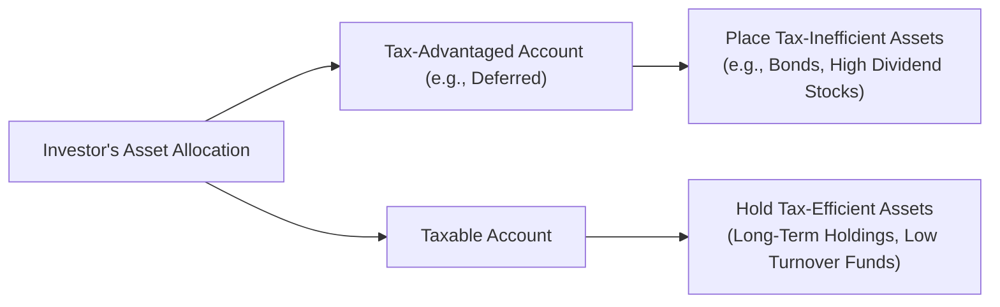
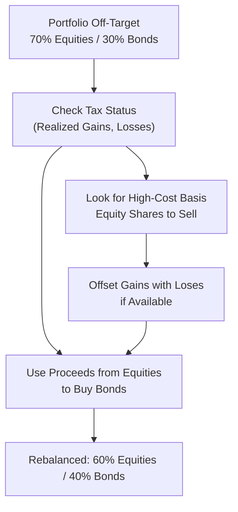

## Introduction and Context

Taxes: they’re one of those things we all love to hate. Yet when it comes to managing an investment portfolio, taxes are not just an afterthought—they can actually reshape the entire way we construct and rebalance our holdings. I remember a conversation with a friend who was quite proud of selecting “the best mutual funds” for his retirement account. But when he realized that hefty short-term capital gains were eroding his returns, he blurted out, “Wait, so all this time, I’ve been paying more in taxes than necessary?” 

This section delves into how careful tax planning takes center stage in asset allocation and rebalancing. By making thoughtful adjustments to asset location, tax-lot accounting, and the timing of trades, investors can boost after-tax returns. Yes, there’s a bit of complexity here—but hopefully, by the end of this, you’ll say, “Ah, that wasn’t too bad,” rather than, “Ugh, how do I even start?”

## Types of Taxes

We can’t talk about taxes without understanding the wide array of taxes that may impact a portfolio. Different jurisdictions have their own complex labyrinths of rules, and it’s absolutely crucial for global investors to know where taxes might come knocking.

Income Taxes  
Income tax often applies to bond interest, dividends, and sometimes certain distributions from mutual funds. Each income stream could be taxed at different rates—some jurisdictions even subject dividends to a specific set of rules (like dividend imputation credits). If we think of dividends as “income,” many regions treat them favorably compared to wage income, but that is far from universal.

Capital Gains Taxes  
Capital gains taxes arise when you sell an asset for more than its cost basis. In many jurisdictions, the rate varies depending on how long you held the asset: short-term vs. long-term. The short-term category (often defined as up to one year in the US, but definitions vary worldwide) can slam you with higher rates—similar to ordinary income. Meanwhile, long-term capital gains rates are often lower. So, well, if you’re flipping assets left and right, your tax bill might balloon.

Wealth, Estate, or Inheritance Taxes  
High-net-worth investors—those with large estates—need to be mindful of estate or inheritance taxes. In some countries, just passing assets along to the next generation can trigger additional taxation. This can significantly impact your planned asset allocation, especially in philanthropic estate planning.

Global Variation at a Glance  
Drawing from the OECD Tax Database or local government tax sites, you’ll often find that the classification of income, applicable tax rates, and thresholds vary drastically. For instance, you might have favorable capital gains rules in one place but then run into double taxation if you hold assets from another country that withholds taxes on dividends or interest. To manage these cross-border challenges, many global investors seek professional tax counsel or structure their holdings to maximize potential tax treaty benefits.

## Tax Drag on Returns

When I first started studying portfolio management, I used to think, “A 9% annual return means 9% more money, right?” Over time, I realized taxes could carve out a substantial slice from that pie. Tax drag is the reduction in overall returns due to taxes on dividends, interest, or realized capital gains.

Compounding  
Investors often talk about compound interest as a positive phenomenon, but taxes can keep compounding working against you. Each time you pay taxes on gains or distributions, there’s less principal left to grow in future periods. A small tax rate might not seem like a huge deal in year one, but remember that the effect compounds year after year.

High Turnover  
Frequent buying and selling quickly accumulates realized short-term capital gains—typically taxed at higher rates. Sure, you might be chasing alpha with short-term trades, but you may find that after-tax alpha is far more elusive. Keeping turnover at a strategic level and pairing it with an awareness of capital gains rates can help reduce tax drag.

Deferred Gains  
One best practice is deferring gains. If you don’t actually sell the asset, you won’t realize a taxable event (in most jurisdictions). This approach shifts the taxation further into the future, giving you that extra time to compound returns. It’s not always about avoiding taxes forever—but deferral can significantly enhance wealth accumulation.

## Asset Location

Asset location deals with making sure the right investments go into the right types of accounts. This planning can significantly improve your after-tax returns without changing your overall strategic asset allocation. It’s essentially about placing tax-inefficient assets in tax-advantaged accounts and saving space in taxable accounts for tax-efficient assets.

Tax-Advantaged Accounts vs. Taxable Accounts  
In many countries, tax-advantaged accounts (like IRAs or 401(k)s in the US, or certain pension accounts elsewhere) allow you to defer taxes on investment growth (or receive an upfront deduction for contributions). Meanwhile, taxable brokerage accounts require you to pay taxes annually on interest, dividends, and realized capital gains.

Tax-Inefficient vs. Tax-Efficient Assets  
Bonds generating interest taxed at the ordinary income rate are generally more “tax-inefficient” than equities that pay qualified dividends or produce long-term capital gains subject to lower rates. So, many investors place bond allocations in tax-deferred accounts to shield interest income from immediate taxation. Meanwhile, equity holdings with better long-term capital gains treatment might stay in taxable accounts for greater tax efficiency.

Diagram: Asset Location Approach

In this simple diagram, the investor has a specific target asset allocation (node A). The idea is to place more heavily taxed assets (B → D) in a tax-advantaged bucket and keep more tax-friendly assets (C → E) in the taxable bucket.

## Rebalancing Considerations

Rebalancing is vital in maintaining a portfolio’s risk and return profile. However, it can also generate capital gains, which means a tax bill. So let’s see how to manage that carefully.

Triggers for Rebalancing  
Some investors rebalance on an annual schedule, some do it whenever allocations deviate by a certain percentage threshold. In any rebalancing approach, be mindful that selling appreciated positions can lock in a taxable gain.

Tax-Aware Rebalancing  
One technique is to direct new contributions or dividends into underweight asset classes rather than selling assets. Similarly, if you must rebalance, you might sell specific lots (tax-lot accounting) that produce minimal gains or ideally realize some losses. If you happen to be carrying a loss in another security, that can further offset the gains. This helps keep your overall tax bill in check.

Tax-Loss Harvesting  
Tax-loss harvesting sounds fancy, but it’s simply the practice of selling a security at a loss to offset realized gains. You can then reinvest proceeds in a similar (but not “substantially identical”) security to maintain market exposure. By pairing losses with gains, the net capital gain can be driven down—sometimes to zero.

## Tax-Lot Accounting

A more advanced strategy that offers extra flexibility is tax-lot accounting. Instead of treating all shares of the same stock or fund as one blob, you track when each share or lot was purchased and at what cost basis.

Choosing Which Lots to Sell  
If you want to minimize gains, you can select the highest cost basis lot (thus generating the least capital gain). This is sometimes called HIFO (Highest In, First Out). Conversely, if you want to realize some gains (to offset losses or to lock in profits at a favorable rate), you might pick the lower cost basis lots. In most jurisdictions, you must keep meticulous records to do this properly.

Example: Let’s say you have 1,000 shares of a stock that you accumulated over time at varied prices. Today, you want to sell 200 shares. Instead of using the default FIFO rule that picks the oldest (and cheapest purchased) shares first, you specifically identify the lot with the highest purchase cost. That reduces your taxable gain.

## Global Considerations

Taxes can become even more complicated when you’re investing across multiple countries. Different jurisdictions may:

• Levy additional withholding taxes on dividends or interest for foreigners.  
• Have no capital gains tax at all (e.g., some countries in the Middle East) but a robust wealth tax.  
• Provide or disallow tax credits on foreign-sourced income.  

If you’re a global investor, keep an eye on tax treaties to determine if you can claim credits and avoid double taxation. Sometimes, a certain country’s local laws or bilateral treaties will reduce withholding taxes, but only if you fill out specific forms. This complexity can be daunting, but the payoff—potentially saving a chunk of your returns—is often well worth the added administrative steps.

## Putting It All Together

It’s one thing to talk about all this in theory. But let’s imagine a scenario: You have a moderate-growth portfolio of $1 million, aiming for 60% equities and 40% bonds. You also have access to a tax-deferred account (like a 401(k)) and a taxable brokerage account. You suddenly find that, after a big market rally, your equity exposure jumped to 70%. 

If you rebalance by simply selling 10% of equities in your taxable account, you may trigger large short-term capital gains. Instead, you could look for:

• High-cost basis equity shares that you can sell (to minimize realized gains).  
• Sizable unrealized losses in other positions (if you have them) to offset some gains.  
• Incoming contributions or dividends that could be redirected toward bond purchases in the taxable account, reducing the extent of any sales.  
• Rebalancing within your tax-deferred account first, because trades in a tax-deferred account do not trigger current taxation.  

By applying these strategies, you manage to rebalance effectively while reducing your near-term tax burden, leading to a stronger after-tax return over the long run.

## Practical Mermaid Diagram: Tax-Aware Rebalancing Flow

In this illustration, the investor starts at an off-target allocation and moves through a decision tree to identify tax saving opportunities when selling equities to buy bonds, culminating in a properly balanced portfolio with minimal tax impact.

## Best Practices, Pitfalls, and Tips

• Use a consistent recordkeeping system. If you can’t track lots accurately, you can’t effectively choose which shares to sell.  
• Watch for the wash-sale rule in some jurisdictions, which disallows claiming a loss if you buy a “substantially identical” security within a certain time window.  
• Make the most of your tax-advantaged accounts for rebalancing, if possible.  
• Keep an eye on changes in tax law that might create new opportunities—or pitfalls.  
• Don’t let tax tail wag the investment dog. In other words, the primary driver of portfolio decisions should still be your investment objectives and risk tolerance.

## Exam Relevance

On the CFA Level III exam, you might face scenario-based questions requiring you to calculate after-tax returns, identify an optimal asset location for certain securities, or determine which lots to sell when rebalancing. Constructed-response questions might highlight a client’s unique tax circumstances (like short-term vs. long-term gains or cross-border issues) and ask you to propose strategies to minimize tax drag. 

There are often subtle details, such as distinguishing between different lot identification methods, applying tax-loss harvesting, and diagnosing how frequently rebalancing should be executed. Always read the question carefully—look out for whether the exam item is focusing on short-term or long-term capital gains rates, or whether it provides data about offsetting capital losses.

## References for Further Exploration

• Poterba, J., “Taxation and Portfolio Structure,” American Economic Review.  
• Dammon, R., Spatt, C., & Zhang, H., “Optimal Asset Location and Allocation,” Journal of Finance.  
• CFA Institute, 2025 Level III Curriculum, “Tax-Aware Investing and Rebalancing.”  
• IRS Publication 550 (for US investors), https://www.irs.gov/  
• OECD Tax Database for international tax comparisons, https://www.oecd.org/tax/  

If you’re looking to really dive into the interplay between asset allocation and tax planning, you might also consult specialized tax practitioners or advanced estate-planning texts—especially if you’re facing unique cross-border or multi-generational planning issues.

Anyway, while no one loves paying taxes, being strategic can significantly bolster your after-tax wealth over time. The key is to systematically incorporate tax considerations into virtually every major portfolio decision, from whether to hold or sell an asset to how to place it. If you keep your eyes open for these nuances, you’ll likely walk away with stronger, more robust returns—and fewer unpleasant surprises come tax season.

## Test Your Knowledge: Tax Considerations in Asset Allocation



### Which of the following best describes tax drag in the context of portfolio returns?

- [ ] A permanent lifting of overall returns due to deferring realized gains.
- [x] A reduction in investment returns caused by taxes on income and capital gains.
- [ ] The cost incurred by frequent rebalancing in tax-deferred accounts.
- [ ] A scenario where short-term gains are taxed the same as long-term gains.

> **Explanation:** Tax drag refers to the decrease in returns tied to paying taxes on income distributions and realized gains, thus reducing the benefits of compounding over time.

### Which of the following is a potential advantage of tax-deferred accounts for rebalancing?

- [x] Rebalancing in tax-deferred accounts does not trigger immediate capital gains taxes.
- [ ] Rebalancing requires the investor to pay taxes on short-term capital gains.
- [ ] Dividends in a tax-deferred account are taxed at higher rates.
- [ ] There is no need to track cost basis for the securities in these accounts.

> **Explanation:** Trades inside tax-deferred accounts generally don’t create current taxable events, making these ideal vehicles for rebalancing without an immediate tax impact.

### Which statement best explains highest in, first out (HIFO) accounting?

- [x] It involves selling the shares with the highest purchase price first to reduce realized gains.
- [ ] It requires selling the earliest purchased shares first, increasing the probability of short-term gains.
- [ ] It is an alternate name for FIFO.
- [ ] It examines only capital gains from international holdings.

> **Explanation:** HIFO accounting means specifically identifying the lot with the highest cost basis for sale, thereby reducing the taxable capital gain.

### An investor is rebalancing a portfolio with an overweight in equities. Which step might minimize realized capital gains in a taxable account?

- [x] First, use incoming cash flows to purchase bonds instead of selling equities.
- [ ] Immediately sell shares acquired at the lowest cost basis.
- [ ] Purchase additional equities in the same account.
- [ ] Defer rebalancing and allow the overweight equity position to remain.

> **Explanation:** Directing new contributions or dividends to the underweight asset class (bonds, in this case) instead of selling equities is a common way to avoid realizing unnecessary gains.

### A short-term capital gain typically:

- [x] Occurs when an asset is held below the threshold (e.g., 12 months in the U.S.) and is taxed at higher rates.
- [ ] Applies only to dividend income reinvested automatically.
- [x] May be offset by realized capital losses for tax purposes.
- [ ] Is always taxed at the same rate as long-term capital gains.

> **Explanation:** Short-term gains, often taxed at an investor’s ordinary income rate, can be offset by capital losses. They are distinct from long-term gains, which often have preferential rates.

### Which of the following statements about asset location is correct?

- [x] Placing higher-taxed, income-generating assets (like bonds) in tax-advantaged accounts can improve after-tax returns.
- [ ] Putting all assets in taxable accounts always results in higher after-tax returns.
- [ ] Asset location strategies only apply to large institutions and not individual investors.
- [ ] Asset location is unrelated to capital gains tax rates.

> **Explanation:** Strategically placing tax-inefficient assets (e.g., high-yield bonds) in tax-deferred or tax-exempt accounts can significantly boost after-tax returns.

### Global investors face which additional tax considerations?

- [x] Withholding taxes on dividends or interest may apply, and bilateral tax treaties might reduce double taxation.
- [ ] Lower capital gains rates in their home country always apply to foreign assets.
- [x] Some countries have no withholding tax on interest or dividends, making cross-border investing simpler.
- [ ] Tax treaties always guarantee zero taxation on international income.

> **Explanation:** Cross-border investing often triggers withholding taxes. Some nations have specific treaty agreements that lower those taxes, but not always to zero.

### Tax-loss harvesting primarily aims to:

- [x] Realize losses on certain securities to offset gains from other holdings.
- [ ] Realize short-term gains to increase capital gains taxes.
- [ ] Increase the cost basis of existing positions.
- [ ] Eliminate the need to pay platform fees.

> **Explanation:** Tax-loss harvesting involves selling underperforming securities to create realized losses that can offset realized gains or, in some jurisdictions, even offset other forms of income up to certain limits.

### Which measure can help an investor reduce tax drag on a high-turnover portfolio?

- [x] Shift some short-term trading activities into a tax-deferred account.
- [ ] Hold more short positions in the taxable account.
- [ ] Immediately sell all appreciated positions once they have short-term gains.
- [ ] Stop tracking cost basis for easier reporting.

> **Explanation:** Housing frequent trades in a tax-deferred account allows investors to avoid immediate taxation on capital gains, reducing overall tax drag.

### True or False: Placing equities with low turnover in a taxable account and higher turnover or interest-bearing assets in tax-advantaged accounts is generally an effective strategy for tax efficiency.

- [x] True
- [ ] False

> **Explanation:** Equities (often with lower turnover or preferential tax rates) in taxable accounts can reduce annual tax drag, while interest-bearing and high-turnover assets placed in tax-advantaged accounts can defer or altogether avoid short-term capital gains taxes.


