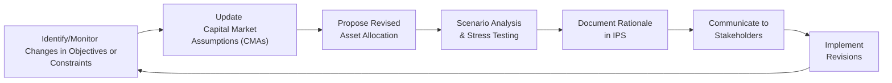

## Introduction

So, imagine you’ve crafted a great portfolio for your client—maybe it was for an individual saving for retirement or for a foundation supporting global education. You drew up a detailed Investment Policy Statement (IPS), allocated assets with great care, and everyone felt satisfied. But then, life happened: the client decided to retire earlier than expected, or the foundation received a large influx of donations. Suddenly, your carefully constructed asset allocation might need tuning (or, in some cases, a complete overhaul). And that’s exactly what we’ll dig into here: recommending and justifying allocation revisions when someone’s objectives and constraints change.

Portfolios themselves don’t live in a vacuum. They are influenced by new life events, changing career paths, shifting economic conditions, or fresh capital market research. Sometimes these changes are so significant that you can’t keep the same asset mix forever, right? We will walk through practical steps to identify shifts in an investor’s profile, reassess capital market assumptions, propose thoughtful allocation changes, and effectively communicate the rationale to all involved parties.

## Identifying Shifts in Investor Profile

One of the biggest triggers for revisiting an asset allocation is a shift in the investor’s life circumstances—what we often call “life-cycle events.” For an individual, it might be retirement, a new marriage, or the birth of a child. For an institution, it might be a change in leadership, the addition of new beneficiaries, or a large unexpected donation. Honestly, I’ve seen it all: I once worked with a philanthropic foundation that realized it had raised three times its expected donations in a single quarter, drastically altering its spending timeline. Suddenly, the existing portfolio needed to get a lot more conservative to preserve capital for the near term. That’s a radical shift in objectives.

Let’s break down the kinds of events that can cause changes in objectives and constraints:

• Changes in net worth: If a client’s wealth grows or shrinks significantly, their ability to bear risk can change.  
• Shifts in time horizon: Retirement dates might move up or get postponed, reshaping investment horizons and liquidity demands.  
• Evolving risk tolerance: People sometimes decide they’re comfortable with more risk, or they might need to dial it down because of health issues.  
• Organizational changes: Corporate restructuring, new leadership, or updated mandates (e.g., a new directive from a foundation’s Board of Directors).  

These changes can open the door to brand-new constraints or alter existing constraints around liquidity, time horizon, or unique needs (like legal or tax considerations). It’s important to maintain an updated log of these events or potential events—some investment managers do annual reviews, while others place triggers in the IPS that automatically prompt a review when certain thresholds are crossed.

## Reassessment of Capital Market Assumptions

Even if an investor’s personal or organizational circumstances stay relatively stable, external factors can change the entire game. Economic developments, new research on expected returns, or big policy shifts (like new trade tariffs or a sudden tweak to monetary policy) can cause you to revisit your capital market assumptions (CMAs). And dear me, if 2020 taught us anything, it’s that we have to be prepared for massive, unforeseen macro shocks.

### Why Update CMAs?

• Emerging data on returns, volatilities, and correlations: Perhaps new research indicates that a certain asset class or sector is more volatile than we thought.  
• Shifting economic cycles: We’ve discussed business cycles in Chapter 1. The stage of the cycle could affect expectations for equities, fixed income, commodities, and so on.  
• Policy developments: A change in central bank interest rate policy or a significant fiscal intervention (e.g., massive government stimulus) might alter the relative attractiveness of bonds versus equities.  
• Macroeconomic shocks: Real-world crises, geopolitical events, or natural disasters can reorder the investment landscape in surprising ways.  

All these changes feed into updated expectations for risk and return. If equities across emerging markets are now expected to yield lower returns due to geopolitical tension, or if interest rate policy in major economies has turned dramatically hawkish, your entire model for the next five years might need recalibration.  

### Mapping New Assumptions to Updated Portfolios

When you detect new data, let’s say from an updated study on asset class returns, or after discussions with economists and market strategists, incorporate these changes into your forecasting frameworks. This process might involve:

1. Revising expected returns and standard deviations for each asset class in your portfolio.  
2. Checking changes in correlations (some asset classes may become more correlated in turmoil).  
3. Using scenario analysis or Monte Carlo simulation to test how these new assumptions affect your portfolio performance under different market regimes.  

If the results show that your portfolio underperforms in most plausible scenarios, you may want to consider shifting allocations (e.g., reducing equity exposure, adding alternative investments that thrive when interest rates rise, etc.).

## Methodology to Propose Changes

Alright, so you’ve identified the impetus for change—it might be a life event, or it might be the economy taking a wild turn. The next step is to propose revisions in a structured, transparent way. This helps you (a) remain consistent with your client’s updated objectives and constraints, and (b) logically connect your recommended changes to the investor’s broader financial picture. Let’s break it down:

### 1. Summarize the Change in Circumstances

First, make sure everyone is on the same page about what changed and why it matters. If it’s personal, mention the life event—maybe the investor is two years away from retirement now instead of ten. If it’s market-driven, highlight new capital market forecasts or risk considerations. For instance, “We have revised our expected annual return for developed market equities from 7% to 5% due to slowing GDP growth and a cyclical downturn.”

### 2. Recommend the Revisions

Next, propose the specific adjustments to the asset allocation. Suppose you previously had 60% in equities, 30% in bonds, and 10% in alternatives. Maybe you want to reduce equity exposure by 10 percentage points and shift those funds into investment-grade bonds or a diversified real asset strategy. Always make sure you link the recommended changes to the updated objectives: “We’re lowering equity exposure because liquidity has become a priority, and the investor has a reduced risk tolerance given the shorter time horizon.”

### 3. Estimate the Expected Benefits

Lay out, in plain language, how the changes might offer improvements. Maybe the revised portfolio has a slightly lower expected return but significantly reduces volatility, or it might provide better inflation protection. Where possible, quantify these effects. “Our model suggests a 12% reduction in annualized volatility with only a 1% decrease in expected return.”

### 4. Acknowledge Potential Trade-Offs

No portfolio change is free of trade-offs. You might incur transaction fees or realize capital gains, which can create tax liabilities (and under IFRS or US GAAP, we account for those consistently, though the net effect on your client or institution might be quite different). You’ll also need to settle potential short-term volatility or underperformance relative to the old portfolio. Be upfront about these: “Implementing this shift will incur around 0.4% in transaction costs, and we’ll trigger embedded capital gains of approximately $50,000, but we believe the improved alignment with the client’s risk tolerance justifies this.”

## Documenting Changes and Rationale

#### The Role of the Investment Policy Statement (IPS)

The IPS is typically the “constitution” for an investor’s portfolio. Any major changes in allocation should be reflected in a revised IPS or an appendix that tracks updates. I’ve sometimes seen managers skip this step—maybe they made small but meaningful changes to the portfolio and never updated the IPS. Then, a year later, someone’s confused about why the portfolio drifts from the stated policy. So, keep the IPS fresh and highlight exactly why each change was made.

#### Scenario Analysis and Stakeholder Communication

When you propose modifications, it’s wise to present scenario analyses or stress tests to show the potential outcomes. For instance, highlight how the revised portfolio reacts if interest rates rise unexpectedly or if equities drop by 15%. That helps stakeholders (like trustees or plan beneficiaries) see the robust logic behind your changes.

A quick example: Let’s say your new recommended portfolio has 55% equities, 35% bonds, and 10% private real estate. You run a scenario showing a moderate recession with a 20% equity drop, and you demonstrate that losses in real estate are partially offset by stable bond performance. If the outcome still meets the client’s constraints (like a maximum 15% total drawdown), it can give everyone more confidence in the strategy.

## Communication Strategy

Once you’ve performed analyses and updated your IPS, you still have to share these allocation changes with your client or stakeholders in a way that resonates. So, let’s get practical:

• Use Plain English: As complex as the financial markets might be, try to cut out technical jargon when necessary.  
• Visual Aids: A simple chart or a short scenario-based graph showing expected outcomes under different assumptions often works wonders.  
• Address Psychological Hurdles: Many clients have a strong aversion to change, especially if the previous allocation was in place for years. Acknowledge their loyalty to the old plan and assure them that it was valid at the time—but that situations and markets evolve.  

It’s often helpful to compare the old and new allocations side by side. Illustrate the expected risk-return trade-off for each scenario. If you have a performance-based track record that estimates “what might have happened if we had changed allocation a few years ago,” show it—but do so responsibly, clarifying that past performance is not necessarily indicative of future results (the standard disclaimers still apply).

## A Process Flow Diagram

Below is a simple Mermaid diagram that details a recommended process for revising asset allocations in response to changing objectives and constraints:

This cycle continues over time, as both investor circumstances and market environments evolve.

## Practical Example

Let’s walk through a hypothetical scenario: Patricia, age 60, was planning to retire at 70. Her portfolio was 70% global equities and 30% fixed income. Everything was going fine until she decided she’d had enough of the corporate grind and wanted to retire at 62 instead. That means her time horizon got eight years shorter. She’s also a bit more skittish about stock market volatility so close to her new retirement age.

• Identify the shift: Patricia’s risk tolerance and time horizon have changed more sharply than anticipated.  
• Reassess CMAs: Suppose recent macro data suggests equities might enter a period of higher volatility and lower returns. Meanwhile, inflation could increase, lowering the real returns from bonds.  
• Recommend changes: Shift from 70% equity/30% bond to a 50% equity/40% bond/10% alternative strategy (like real assets).  
• Scenario analysis: Compare outcomes in normal conditions and in a recession scenario. The new allocation is expected to reduce potential losses if equities plunge.  
• Implement: Update her IPS accordingly, highlight potential trade-offs (such as tax implications when selling equities), and communicate the rationale.  

## Best Practices and Common Pitfalls

• Best Practice: Maintain an ongoing “watchlist” of personal/institutional changes that might trigger a review. Combine that with periodic CMA updates.  
• Best Practice: Whenever you propose a reallocation, deliver a thorough cost-benefit summary that quantifies expected risk and return changes.  
• Common Pitfall: Failing to update the IPS or neglecting to document the justification for your changes. This can create confusion about timing and reason for changes.  
• Common Pitfall: Ignoring client psychology around the fear of change. Clients might cling to an outdated allocation. Communicating empathy and logic can help.  
• Common Pitfall: Over-frequent changes. Yes, continuing to refine the strategy is useful, but flipping the allocation too often leads to higher costs and potential whipsaws.

## Tailoring Approaches for Different Constraints

• Time Horizon Constraints: If the time horizon shortens, a typical move is to reduce risk—maybe tilt away from long-duration assets.  
• Liquidity Constraints: If unexpected liquidity needs arise, you might shift allocations toward more liquid instruments, like cash equivalents or shorter-duration bonds.  
• Tax Constraints: If realizing capital gains is too expensive, you could focus on tax-loss harvesting, or apply a more gradual reallocation strategy.  
• Regulatory/Policy Constraints: Some institutions have compliance limitations, so keep up-to-date with relevant rules (such as permissible asset classes for a foundation).  

## Looking Beyond the Numbers

It might sound a bit “soft,” but it’s vital to remember that when a client’s objectives or constraints change, there’s probably a personal or organizational story behind it—like an upcoming philanthropic project with a big emotional commitment. Incorporating these elements into your technical recommendations shows empathy and can foster trust. Ultimately, a revised allocation that addresses both financial and personal considerations is more robust and more likely to be followed through.

## Exam Tips and Final Thoughts

When you’re dealing with exam questions on recommending and justifying allocation revisions:

• Watch for key “trigger” words like “life event,” “changing market conditions,” or “risk tolerance.” This basically signals that the exam wants you to propose changes to the existing portfolio.
• Structure your answers to align with a clear methodology: Identify the change, propose the fix, state the benefits, weigh the trade-offs, and update the IPS.
• Tie your recommendations back to risk-return concepts, capital market assumptions, and the investor’s updated constraints. Provide hypothetical numbers or short scenario analyses if asked.
• If it’s a constructed-response (essay) format, be concise, logical, and link every recommendation to the updated constraints. If you propose a shift from 60% equities to 45% equities, clearly explain why (e.g., time horizon got shortened).
• Time management is crucial in the exam environment—prepare with practice questions that mimic official exam style.

In short, the key is to be systematic, transparent, and empathetic whenever we recommend and justify allocation revisions for changing objectives and constraints. After all, the best portfolio is one that flexibly aligns with real-world circumstances—both in the markets and in people’s lives.

## References and Further Reading

• Brinson, G., Hood, R., & Beebower, G., “Determinants of Portfolio Performance,” Financial Analysts Journal.  
• CFA Institute, 2025 Level III Curriculum, “Monitoring and Rebalancing Portfolios.”  
• “Lifecycle Investing: A New, Safe, and Audacious Way to Improve the Performance of Your Retirement Portfolio” by Ian Ayres and Barry Nalebuff.  
• Hennessy, A., “Adaptive Asset Allocation in Changing Markets,” Journal of Portfolio Management.  

--------------------------------------------------------------------------------

## Recommending and Justifying Allocation Revisions Quiz



### Which of the following life events is most likely to necessitate a major revision to an investor's asset allocation?

- [ ] A small fluctuation in quarterly income
- [ ] A short-term market correction
- [x] A decision by the investor to retire five years earlier than planned
- [ ] A new sector-specific research report

> **Explanation:** A major change in time horizon or personal circumstances (like an earlier retirement date) typically triggers a re-evaluation of objectives and constraints.  

### In reassessing capital market assumptions (CMAs) for a portfolio, which of the following factors is the least likely to prompt an update?

- [ ] A sudden change in central bank interest rate policy
- [x] A minor error in the volatility calculation for a niche asset class 
- [ ] New evidence that correlations among asset classes have shifted
- [ ] A major macroeconomic shock that changes return expectations

> **Explanation:** Minor errors or negligible changes might not justify a full-scale rework of CMAs, whereas changes in rate policy, correlations, or macro shocks are more significant.  

### When proposing a revised asset allocation, which of the following is the best first step?

- [ ] Immediately shift assets without client consent
- [x] Summarize the change in circumstances that justifies the revision
- [ ] Document the trade-offs in a separate disclosure 
- [ ] Conduct scenario analysis before discussing changes with the client

> **Explanation:** The first step is to ensure the client understands the catalyst for change. Scenario analysis is critical, but establishing the reason for the change comes first.  

### Which one of the following statements best describes the role of the IPS during allocation revisions?

- [ ] The IPS is an optional document that can be referenced if problems arise 
- [ ] The IPS only matters for regulatory oversight 
- [ ] The IPS is an internal document for the portfolio manager only  
- [x] The IPS should be formally updated to reflect the reasons and rationale behind re-allocations

> **Explanation:** The IPS represents the contract between the manager and the investor. All significant changes warrant an IPS update to maintain clarity.  

### Which of the following is the most significant benefit of using scenario analysis when recommending allocation changes?

- [x] Demonstrating potential outcomes under different market environments 
- [ ] Ensuring the new allocation outperforms the old allocation in all scenarios
- [ ] Eliminating all fear from the client’s decision-making process
- [ ] Providing an exact prediction for future portfolio performance

> **Explanation:** Scenario analysis helps visualize how the revised portfolio behaves under various conditions, offering transparency for better decision-making.  

### If a shift in an investor’s goals leads to a tighter liquidity constraint, which of the following strategies is most appropriate?

- [x] Increase the allocation to more liquid assets like cash or short-term bonds
- [ ] Invest in long-duration bonds to earn higher returns
- [ ] Increase equity exposure to benefit from growth
- [ ] Switch to illiquid private equity for diversification

> **Explanation:** Higher liquidity needs typically mean a higher exposure to liquid instruments so that the investor can meet new requirements.  

### A key trade-off associated with rebalancing a portfolio that contains significant capital gains is:

- [ ] Higher expected returns 
- [ ] Lower transaction costs 
- [x] Potentially large tax liabilities 
- [ ] Reduced correlation among remaining assets

> **Explanation:** Realizing gains may generate substantial tax consequences. Managers often need to weigh the benefit of rebalancing against the tax cost.  

### Why might a foundation drastically change its asset allocation after receiving a sudden large donation?

- [ ] To speculate on a one-time market rally
- [ ] To take on more risk to please stakeholders 
- [x] To ensure newly inflated capital can be conservatively allocated for future spending needs
- [ ] To avoid updating the IPS or capital market assumptions

> **Explanation:** A significant donation can alter the foundation’s ability to fund projects and might merit a more conservative or differently balanced allocation to protect and deploy the larger asset base effectively.  

### A client has an existing 70% equity allocation but recently expressed increased aversion to volatility. Which recommended adjustment best aligns with this new constraint?

- [ ] Increase the equity allocation further to achieve higher returns for a shorter horizon
- [x] Reduce the equity portion and allocate to lower-volatility instruments
- [ ] Invest in highly leveraged derivatives for outsized gains
- [ ] Maintain the same allocation and wait for the volatility to drop

> **Explanation:** A higher aversion to volatility generally suggests lowering equity exposure in favor of more stable assets.  

### True or False: Clients are rarely influenced by psychological barriers when an advisor recommends changes to an established allocation.

- [ ] True
- [x] False

> **Explanation:** Many clients experience psychological barriers or emotional ties to an old allocation. Acknowledging and addressing these is key to implementing changes effectively.


