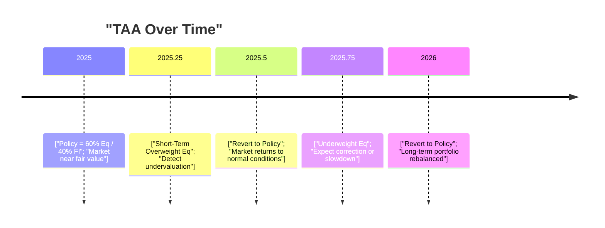

## Definition and Purpose
Tactical Asset Allocation (TAA) is basically the art—or science, depending on whom you ask—of making short-term changes to your long-term (strategic) policy portfolio in order to capitalize on fleeting market opportunities. So if your strategic policy allocates, say, 60% to equities and 40% to bonds, you might tilt that equity exposure up to 65% (or 70% if you’re feeling bold) for a short period when you believe stocks are set to outperform. Once the opportunity passes or your signals change, you snap back to your long-term allocation and shrug like, “Well, that was fun.”  

I’ve seen TAA approaches in practice where managers got it spectacularly right, jumping into undervalued segments at just the right time. I’ve also witnessed cringe-worthy misfires—overzealous moves that were quickly reversed when the market had other ideas. Regardless, TAA is often employed to enhance portfolio returns or limit downside risk beyond what a more static policy portfolio might achieve.

At the CFA Level III level of study, TAA is a great illustration of how to bridge the theoretical with the practical. On that note, TAA also interacts closely with many topics discussed in earlier chapters—especially macroeconomic analysis (Chapter 1) and the forecasting of capital market returns (Chapter 2).  

## TAA Frameworks
Even though TAA always aims to exploit short-term market dislocations, there are several ways to go about it. Think of these frameworks as different roads leading to the same city: hopefully that city has higher risk-adjusted returns.  

### Discretionary (Judgment-Based) Approach
The discretionary approach is probably what most people envision when they think of good old-fashioned portfolio management: You rely on a manager’s skill, intuition, and deep research (fundamental, macro, or even just “gut feeling”). Maybe the manager sees a shift in monetary policy (as explored back in Chapter 1.8 on monetary and fiscal policy) and believes interest rates will remain lower for longer, thus boosting certain equity sectors. They decide to overweight equities in the near term, expecting that impetus to fade within months or quarters.

This method can be flexible and adaptive—like the manager who “just knows” from experience that high yield spreads are too attractive to ignore. On the other hand, it’s subject to overconfidence, anchoring, or other cognitive biases (as discussed in Section 5.5 on Behavioral Biases). It’s tricky to remain unbiased when you’re excited about a thesis, or, worse, anchored to a single viewpoint.  

### Systematic (Model-Based) Approach
The systematic method tries to tame that emotional side. Here, managers use quantitative models that might generate signals based on:  
• Momentum or trend-following metrics (e.g., short-term exponential moving averages crossing over longer-term ones).  
• Value indicators (e.g., price-to-earnings ratios relative to historical benchmarks).  
• Macroeconomic factors (e.g., inflation, employment changes, yield curve slope).  

When a signal is triggered—say, the model identifies that small-cap stocks are undervalued with positive momentum—the portfolio’s weight in that segment automatically goes up. Systematic approaches can also incorporate machine learning or advanced data analytics (Chapter 2.11 on Alternative Data), although they carry the risk of “model drift” or data-mining. If the underlying economic relationships shift, or if the data the model was trained on don’t represent the future well, systematic TAA can quickly lose its edge.

Below is a simple flow diagram of a typical systematic TAA process:

This diagram is by no means exhaustive, but it helps visualize the iterative nature of systematic TAA: gather relevant info, generate signals, decide if the signals are strong enough to act upon, implement trades, then continuously monitor for exit triggers or rebalancing signals.

## Factors Influencing TAA Decisions
Now, whether you use a discretionary or systematic method, there are a few critical variables that commonly feed into TAA decisions:

• Market Valuation Indicators. Examples include P/E ratios for equities, credit spreads for bonds, or even rental yields for real estate. While a high P/E ratio may suggest caution, it can also be a sign that investors see vibrant growth ahead. So you can’t look at valuation in isolation—you also want to consider the bigger economic picture.

• Business Cycle Indicators. By referencing the business cycle phases (Section 1.6 on effects of business cycles), you might determine whether riskier assets are likely to outperform, or if it’s safer to move toward high-grade bonds. Leading economic indicators—like housing starts or new orders—can hint at expansions or recessions on the horizon, giving TAA strategies precious forecasting power.

• Risk Sentiment Metrics. Think of the Chicago Board Options Exchange Volatility Index (VIX), investor sentiment surveys, or even social media sentiment. As these signals point to fear or euphoria, TAA might shift safer or riskier in tune.  

## Implementation Considerations
Let’s say you’ve identified an exciting short-term opportunity. Maybe an index has sold off dramatically but you believe it’s a temporary dip. Great—now the question is how to hop on that train fast and cost-effectively.  

• Speed. TAA opportunities can vanish quicker than your favorite snack at a party. If it takes you days to conclude your trades, you might lose the advantage. That’s where liquid instruments—especially futures, swaps, or ETFs—really come in handy.  

• Liquidity and Transaction Costs. Even if your timing model is perfect, if you pay a fortune in commissions or struggle with high bid–ask spreads, you could erode or even negate potential gains. Keep in mind the capacity of your vehicle (some large funds might face slippage if they trade big volumes in less liquid markets).

• Leverage and Derivatives. TAA is frequently implemented with derivatives. For instance, if your client’s strategic allocation is 60% equities, but you want a short-term tilt to 70% without selling other assets, you might buy equity index futures to replicate that tilting effect. This helps you adjust exposures with minimal disruption or tax consequences. But, you know, leverage always deserves caution—if the thesis is wrong, losses can magnify.

## Practical Example: Discretionary TAA in Action
Let’s consider a hypothetical scenario. Suppose your strategic allocation is:

• 50% Global Equities  
• 40% Global Bonds  
• 10% Real Estate  

Your macro research suggests that inflation is about to spike more than the central bank expects. Historically, in inflationary upticks, certain sectors—like energy or basic materials—can do well (though you might recall we discussed inflation across asset classes in Section 1.7). You decide to overweight equities by 5%, specifically tilting toward commodity-related firms, anticipating that rising input prices will benefit them. You reduce your global bond exposure by the same 5%, expecting bond prices to fall if yields rise with inflation.

• Original Policy: (50% equities / 40% bonds / 10% real estate)  
• TAA Shift: (55% equities / 35% bonds / 10% real estate)  

In a perfect world, the commodity-heavy stocks rally for the next 6 to 12 months, and you unwind the position once inflation recedes. Even capturing just a couple of percentage points of extra return can create a nice performance advantage. But if inflation never materializes—maybe the central bank’s rate hikes stifle it quickly—you might be forced to revert quietly, with or without a mild bruise on your performance.  

## Calculating the Potential TAA Alpha
Some managers will track their “TAA alpha” by comparing hypothetical returns of the baseline policy portfolio to actual returns posted by the portfolio with TAA overlays:


\text{TAA Alpha} = R_\text{TAA portfolio} - R_\text{Policy portfolio}


This difference can be further decomposed by the magnitude and direction of each tilt. Monitoring TAA alpha over time helps the manager see whether the TAA calls are consistently adding value or just creating additional volatility.

## Risks and Limitations
If TAA sounds too good to be true—“Just deviate from your policy, snap up quick alpha, and done!”—keep in mind the dangers as well:

• Timing Risk. One of the hardest things is nailing the buy and sell pivot points correctly. Too early, you might be sitting in an underperforming position. Too late, you’ve missed the rally.

• Model Risk. For a systematic strategy, a flawed dataset or unrealistic assumptions can cause big mistakes. Also, periods of regime shifts can nullify whatever patterns you found in historical data.

• Behavioral Biases. On the discretionary side, it’s easy to get attached to a narrative, like “This time is different,” or get anchored to prior price levels. Overconfidence bias can lead a manager to keep doubling down when the market is screaming otherwise.

• Opportunity Cost. All the time and resources spent on TAA could have gone toward something else, like deeper fundamental analysis or manager selection in alternative assets.  

## Case Study: TAA Using Trend-Following Signals
Imagine a systematic TAA fund that invests in major global equity indices—like those in the US, Europe, and Asia. It uses a 200-day moving average to determine if an index is in an uptrend or downtrend. When the price stays above the 200-day moving average for at least a month, the fund adds a “long tilt” in that market. If the price stays below that average for at least a month, the fund decreases exposure or even short-sells the index via futures.

In a stable bull market, the strategy outperforms for a while, because it’s heavily weighted in rising markets. Then, when volatility spikes and markets dip, it cuts exposure. Perfect, right? Except the strategy might be “whipsawed” in choppy markets—caught buying high and selling low multiple times as markets fluctuate around that average. The net effect could reduce returns or even cause steady small losses.

This scenario underscores the need to combine multiple signals—valuation, macro factors, sentiment—rather than relying on a single trend metric.  

## Best Practices
• Diversify TAA signals. If using systematic approaches, combine multiple uncorrelated signals (e.g., momentum, value, macro).  
• Stress test and scenario plan. If TAA relies on certain assumptions (like stable central bank policy), run alternative scenario tests.  
• Control portfolio risk. Set guidelines on how large TAA shifts can be. For instance, allow only ±5% from strategic weights. This way, if you’re wrong, you won’t blow up the entire portfolio.  
• Manage transaction costs. Use derivatives where possible to reduce slippage and frictional costs.

## Diagram: TAA vs. Strategic Allocation Over Time
Below is a simple timeline diagram to illustrate how TAA might periodically deviate from the policy targets.

This timeline is simplified but offers a sense of how TAA overlays come and go.

## Integrating TAA with Other Portfolio Strategies
TAA isn’t a standalone approach; it meshes with strategic asset allocation (SAA), factor investing (Chapter 3.6), liability-driven investing (Chapter 4.11), and more. For example, a pension fund might do liability-relative asset allocation for its core strategy, but still engage in TAA overlays if it sees a high-probability short-term opportunity.  

You might find a TAA approach also complements factor investing—like overweighting value equities when valuations are uniquely attractive for a short window. It’s essential, though, to ensure each approach is consistent with the broader investment governance framework discussed in Chapter 3.1, so you’re not confusing the overall portfolio’s objectives.

## Exam Relevance and Tips
For the CFA Level III exam, you might see TAA integrated into scenario-based questions, typically in an item set or constructed response format. Common tasks include:  
• Identifying TAA opportunities based on market signals.  
• Evaluating whether a proposed TAA shift is justified given transaction costs or liquidity constraints.  
• Critiquing a manager’s TAA decision based on behavioral biases.  
• Calculating TAA alpha or analyzing performance attribution.  

A typical exam question could present an investor scenario with certain macro data, show a manager’s proposed TAA shift, and then ask whether the candidate would recommend the shift. You’d likely weigh market valuations, potential alpha, volatility and transaction costs, plus the manager’s track record.  

Always remember to show your reasoning. Don’t just say “Yes, do it” or “No, skip it.” Summarize why the signals are compelling or not, how the risk controls are in place (or absent), and how the tilt affects the portfolio’s risk-return profile.

## Tail Risk and TAA
TAA can also be used for tail-risk management—de-risking when conditions point to major downturns (e.g., yield curve inversion, extreme credit spreads, or geopolitical tensions). If proactive, TAA might help dodge the worst of a crisis. The flip side is you might get out too early or too late and hamper your returns unnecessarily.  

## Personal Anecdote
I still remember a portfolio manager (let’s call him Alex) who talked about using TAA to dodge major drawdowns. In a rising market, Alex systematically purchased put options to guard against black-swan events. He frowned at the modest drag on returns but said he slept way better at night. That’s the intangible side of TAA: sometimes, it’s also about controlling psychological risk for the manager and the client.

## Conclusion
TAA is a powerful strategy that helps managers respond to short-term market dislocations, but it’s no magic wand. Successful TAA demands skillful timing, robust data or fundamental insight, prudent risk management, and, often, a dash of humility. While a well-implemented TAA overlay can absolutely boost portfolio performance, an ill-timed or poorly researched shift might also undermine years of careful strategic planning.

In practice, TAA is likely to remain a lively area of active management, especially with the rise of advanced analytics and big data. As a CFA Level III candidate, you should be prepared to analyze TAA proposals—understanding their rationale, risks, and how they fit in the broader context of portfolio objectives and constraints.

## Glossary
• Tactical Asset Allocation (TAA): A portfolio strategy that shifts weights in the short term away from a baseline policy portfolio to exploit market opportunities.  
• Policy Portfolio (Strategic Asset Allocation): The long-term baseline allocation across asset classes consistent with an investor’s objectives and constraints.  
• Momentum: A trend-following approach where upward (downward) trending assets are expected to continue performing up (or down).  
• Valuation Indicators: Metrics used to assess whether an asset or market is overvalued, fairly valued, or undervalued (e.g., P/E ratios).  
• Leverage: The use of borrowed money or derivative instruments to increase potential returns (and risk).  

## References, Further Reading, and Research Materials
• LeBaron, B., “Technical Trading Rule Profitability and Foreign Exchange Intervention,” Journal of International Economics.  
• Fabozzi, F., & Markowitz, H., “The Theory and Practice of Investment Management,” Wiley.  
• CFA Institute, 2025 Level III Curriculum, “Tactical Asset Allocation.”  
• Ilmanen, A., “Expected Returns,” Wiley.  
• Chapters 1–4 of this volume (Capital Market Expectations, Forecasting, and Overview of Asset Allocation) for deeper macro and systematic context.

--------------------------------------------------------------------------------

## Test Your Knowledge: Tactical Asset Allocation Exam-Style Questions



### Which of the following best describes the primary goal of Tactical Asset Allocation (TAA)?

- [ ] To maintain constant exposure to a diversified set of asset classes.
- [x] To deviate from a strategic policy portfolio in response to short-term market opportunities.
- [ ] To replicate the performance of a broad market index across all asset classes.
- [ ] To eliminate volatility from a portfolio through derivatives.

> **Explanation:** TAA involves short-term shifts away from the long-term strategic allocation to capture short-lived market opportunities.

### Which statement is most accurate regarding discretionary vs. systematic TAA approaches?

- [ ] Discretionary TAA strictly follows pre-defined quantitative models.
- [x] Systematic TAA relies on quantitative signals, while discretionary TAA involves judgment and qualitative insights.
- [ ] Discretionary TAA uses machine learning algorithms, whereas systematic TAA depends on fundamental research.
- [ ] Both discretionary and systematic TAA completely avoid behavioral biases.

> **Explanation:** Discretionary TAA relies on portfolio managers’ judgment, while systematic TAA depends on rules-based or quantitative models.

### A fund manager wants to overweight equities temporarily based on an expected short-term rally in corporate earnings. Which of the following factors would be least relevant to her TAA decision?

- [ ] Yield curve slope
- [ ] Forward P/E ratios
- [ ] Implied volatility levels
- [x] Historical GDP growth over the past 50 years

> **Explanation:** While historical GDP growth may provide context, it is less germane to a short-term TAA decision than current or forward-looking valuations, implied volatility, or business cycle indicators like the yield curve.

### When implementing TAA using leverage, an important risk to consider is:

- [ ] Reduced portfolio volatility.
- [ ] Guaranteed higher returns.
- [x] Amplified losses if market moves are unfavorable.
- [ ] Elimination of market risk.

> **Explanation:** Leverage magnifies both gains and losses, so an unfavorable market movement can lead to substantial drawdowns.

### Which scenario illustrates the use of TAA for tail-risk management?

- [x] Temporarily increasing portfolio hedges or buying protective puts when market conditions appear highly uncertain.
- [ ] Maintaining a consistent 60/40 equity/bond allocation at all times.
- [x] Overweighting equities in a stable bull market.
- [ ] Replacing all holdings with cash in a long-term strategy.

> **Explanation:** Tail-risk management often involves implementing short-term hedges or holding more protective assets if downside risks are perceived as high.

### In a systematic TAA strategy using a moving average crossover signal, a potential downside is:

- [ ] Positive performance in trending markets.
- [ ] Inability to trade large positions quickly.
- [ ] Completely eliminating model risk.
- [x] Whipsaw losses in sideways or volatile markets.

> **Explanation:** A model relying on moving average crossovers can be caught in frequent trades if prices fluctuate around the moving average, leading to potential small but repeated losses.

### If a TAA overlay added 1.5% to the portfolio’s return versus the strategic policy portfolio, this excess return is often referred to as:

- [ ] Beta
- [x] TAA alpha
- [ ] Information ratio
- [ ] Sharpe premium

> **Explanation:** The incremental performance above the policy benchmark due to tactical shifts is termed TAA alpha.

### One of the biggest behavioral risks in discretionary TAA is:

- [ ] Slow decision-making due to cost constraints.
- [ ] Lack of any emotional or cognitive biases in the investment decision process.
- [x] Overconfidence or anchoring causing mis-timed trades.
- [ ] Guaranteed systematic profits in choppy markets.

> **Explanation:** Overconfidence and anchoring are prime behavioral pitfalls that can severely affect discretionary TAA decisions.

### Which of the following best explains why a manager might prefer derivatives (e.g., futures) over directly trading underlying securities for TAA?

- [ ] Futures contracts rarely trade, so slippage is minimal.
- [ ] Derivatives always reduce risk without limiting upside potential.
- [ ] Underlying securities have lower liquidity and transparency than derivatives.
- [x] Derivatives allow swift, low-cost adjustments to asset-class exposure without large cash outlays.

> **Explanation:** Derivatives facilitate rapid exposure changes since they are often more liquid and require less capital outlay than buying/selling underlying cash securities.

### TAA can be effective for responding to short-term dislocations. True or False?

- [x] True
- [ ] False

> **Explanation:** TAA is designed precisely to adjust allocations in reaction to short-term mispricing or opportunities, thereby potentially enhancing returns over a static strategic allocation.


