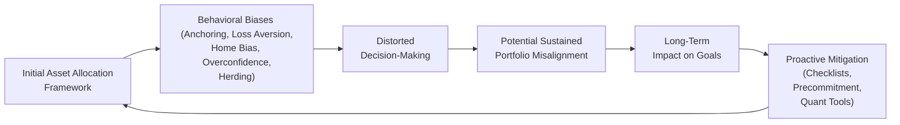

## Introduction

Behavioral biases can exert a powerful influence on both individual and institutional investors when it comes to asset allocation. Sometimes, even the best quantitative models and fundamental research can’t keep us from falling prey to deeply ingrained tendencies—like overreliance on past performance or overconfidence in our forecasting abilities. This section explores some of the most common behavioral biases, discusses how they might creep into the asset allocation process, and offers practical methods to help mitigate them. Along the way, let’s share a few real-world experiences and anecdotes, because, let’s face it, most of us have stumbled into these very traps.

## Understanding Behavioral Biases in Asset Allocation

Behavioral biases refer to those systematic patterns in human decision-making that can deviate from what traditional finance considers purely “rational” behavior. When left unchecked, these biases often result in suboptimal asset allocation decisions—like concentrating too heavily in a single geographic region, holding onto losing positions for too long, or simply following the herd without sufficient independent research.

Below, we examine five of the most prevalent biases that commonly arise when formulating or revising asset allocation strategies: anchoring, loss aversion, home bias, overconfidence, and herding. Each of these biases can show up in different ways—whether you’re an individual investor second-guessing your own portfolio or part of an investment committee making large, strategic decisions.

## Anchoring

Anchoring is essentially the magnetic pull an initial piece of information has on our thoughts. When applied to asset allocation, anchoring might manifest as clinging to an original reference point—such as a previous portfolio weight or a certain market forecast. A quick story: I remember working with a client who insisted on maintaining a 70% allocation to equities because that’s what had worked for them in the 1990s. “If it ain’t broke, don’t fix it,” they used to say. But the world changed dramatically over subsequent decades—new technology sectors emerged, interest rate environments shifted, and global markets deepened. Clinging to that 70% equity anchor was not necessarily aligned with their long-term goals anymore.

### Common Signs of Anchoring in Asset Allocation

• Inflexible Rebalancing: Relying strictly on the portfolio’s original equity/fixed-income split without updating for changed circumstances (interest rates, personal risk tolerance, new asset classes).  
• Stubborn Target Prices: Refusing to sell or buy assets unless they reach some “anchored” reference level that might not reflect current market fundamentals.

### Implications

Anchoring can block necessary adjustments, such as rotating from overvalued to undervalued sectors, or incorporating new asset classes (e.g., real assets or cryptocurrencies, depending on one’s investment policy statement, or IPS). Anchoring also discourages innovation—potentially limiting adoption of factor-based or ESG-driven approaches.

## Loss Aversion

Loss aversion reflects the idea that the pain of losing is felt more intensely than the pleasure of gaining the same amount. Psychologists often say that losses are felt at roughly twice the intensity of equivalent gains, though the actual multiplier can vary. In asset allocation, a loss-averse investor might resist rebalancing into riskier assets—even when expected returns justify it—because the mere thought of a potential loss feels too daunting.

### Common Signs of Loss Aversion

• Excessive Cash Holdings: Investors hoard cash or near-cash equivalents to avoid the possibility of losing principal in the equity or bond markets.  
• Selling Winners Too Early: The fear of seeing unrealized gains vanish can prompt premature profit-taking.  
• Overly Conservative Portfolios: A strong preference for stable but low-return investments, possibly threatening the long-term growth required to meet liabilities or goals.

### Implications

Loss aversion can seriously impair returns by limiting upside potential. It can also derail long-term objectives—think of a pension fund that’s stuck with insufficient growth assets to meet future benefit obligations. Moreover, when an entire team or committee falls into the trap of loss aversion, the result can be group inaction, with no one stepping up to advocate for an appropriately balanced risk/return posture.

## Home Bias

Home bias is the strong inclination to keep the lion’s share of one’s portfolio in domestic assets, regardless of what global opportunities might exist. This bias is partly driven by familiarity and comfort: local reporting, local regulatory regimes, and simply the sense that “these are companies I know.”

I once spoke with the CIO of a pension fund who mentioned how challenging it was to convince stakeholders—who saw so many headlines about domestic equity markets—to allocate a portion of capital to emerging markets. Even though the plan’s longer time horizon could have absorbed some of the higher volatility, anxious participants resisted, saying, “Why risk it all in countries we don’t know?”

### Common Signs of Home Bias

• Concentrated Domestic Equities and Bonds: Investors build portfolios dominated by companies and government bonds from their home country.  
• Limited Currency Diversification: Potential exchange rate benefits (or hedging strategies) are overlooked.  
• Overlooking Global Sectors: Missing exposure to innovative industries or high-growth sectors because they’re primarily located overseas.

### Implications

Home bias can create concentration risk, reduce diversification benefits, and leave returns vulnerable if the local economy suffers. The entire point of global diversification is that different market cycles and currency trends can smooth out a portfolio’s overall ride.

## Overconfidence

Overconfidence is the firm conviction that you (or your organization) have superior information or skills relative to the rest of the market. It manifests in trades or allocations that assume a sort of clairvoyance about upcoming market movements. At first, a streak of success can reinforce this mindset, leading to even bigger bets.

### Common Signs of Overconfidence

• Frequent Trades or Tactical Shifts: Belief that you can correctly time market tops and bottoms.  
• Disregarding Data Contradictions: When new data seems to rebut your thesis, but you press on, convinced it’s a mere anomaly.  
• Underestimating Risk: Under-allocation to risk-control measures or diversifiers, assuming you won’t need them.

### Implications

Overconfidence can lead to outsized bets or ill-advised timing decisions, which can quickly erode capital if the markets don’t cooperate. In an institutional context, overconfidence might show up when an investment committee forgoes prudent diversification, believing in their superior forecasting ability regarding sectors or interest rates.

## Herding

Herding is the tendency to follow the crowd. In investing, it often means piling into hot stocks, popular regions, or trendy asset classes purely because everyone else is doing so. In group settings, this can also manifest as groupthink, especially if strong leadership or peer pressure suppresses dissenting views.

### Common Signs of Herding

• Chasing Momentum: Buying securities or asset classes that have recently soared, ignoring fundamentals.  
• Overreliance on Market Sentiment Indicators: Basing decisions on news cycles, social media buzz, or water-cooler talk.  
• “Everyone Else Is Doing It” Rationale: Failing to develop an independent thesis for each recommendation.

### Implications

Herding can create market bubbles and abrupt collapses when the tide turns. On an individual level, you might end up buying near the top. For committees, there’s also the risk that rubber-stamping popular strategies avoids tough discussions about underlying assumptions—leading to collective misjudgments.

## Impacts of Behavioral Biases on Asset Allocation

From a top-down perspective, these biases can worsen misalignments between portfolio allocations and the investor’s true objectives or liabilities. Biases can also lead to underdiversified portfolios—heavy on “known” positions or beloved sectors—or to reactionary changes (e.g., panic selling during a downturn). Even straightforward tasks, such as periodic rebalancing, can be postponed or skipped due to emotional reluctance or simple inertia fueled by biases.

In institutional settings, group dynamics can magnify biases. A committee might fail to adjust allocations in time because they are anchored on the prior year’s risk budget, or because they’re afraid of acknowledging capital losses. As a result, the portfolio’s composition can drift or concentrate risk in ways that undermine the original policy goals.

## Methods to Overcome Behavioral Biases

Behavioral biases need not doom an investor or committee to suboptimal outcomes. Although it can be tricky to erase our biases entirely, employing structured tools, processes, and self-awareness can help mitigate them.

Precommitment Devices:  
• Automate Rebalancing. For instance, specify in the IPS that if equity weights exceed or fall below certain percentages, the portfolio must be rebalanced.  
• “Default” Strategies. If an investor wants exposure to global equities, that portion might be rebalanced automatically rather than re-evaluated at every step.

Checklists:  
• Formal Steps for Each Decision. For example, require an analysis of how proposed changes alter the overall factor exposures, how they align with the strategic asset allocation (as discussed earlier in Chapter 3), and a worst-case scenario analysis.  
• Challenge Existing Views. Lists of questions such as: “What could go wrong?” “What does current valuation say compared to historical averages?” “Is there new evidence contradicting the thesis?”

Use of Independent Committees:  
• Diversity of Perspectives. Enlist committee members with varied backgrounds—quantitative, fundamental, ESG, macro—to encourage meaningful debate.  
• Rotate Responsibilities. Occasionally changing lead roles on research or due diligence can prevent groupthink.

Quantitative Tools:  
• Factor-Based Models. These can help identify undue concentrations or overlooked risks.  
• Systematic Rebalancing Algorithms. By relying on transparent, rules-based processes, you reduce the chance that fear or euphoria disrupts rational decision-making.

Behavioral Coaching:  
• Frequent Communication. Especially important for retail clients who might emotionalize market swings. An advisor can remind them about long-term goals, risk tolerance, and the perils of short-term panic.  
• Performance Attribution Reviews. Regularly examining what worked or didn’t—especially distinguishing luck from skill—can temper overconfidence and anchor more realistic expectations.

## Practical Examples and Case Studies

Imagine an endowment fund we’ll call “Green Scholars Endowment.” The fund’s investment committee meets quarterly, typically focusing on year-over-year results. Green Scholars fell victim to anchoring when it refused to update its strategic asset allocation, even though the committee learned that demographic shifts would shrink its donor base over the next decade. By documenting a formal precommitment process (“If the domestic equity allocation grows by more than 5% above target, we will rebalance into international equities within 30 days”), the committee has started to chip away at its anchoring bias.

In another case, a private wealth client insisted on overallocating to domestic tech giants because “everyone else is doing it.” Over time, the advisor introduced a formal checklist, including cross-checking exposures to momentum-driven assets. This forced a conversation around sector concentration risk. Ultimately, the client agreed to diversify into other regions and asset classes. The result was a more balanced portfolio less vulnerable to a U.S. tech correction.

## Illustrative Diagram of Behavioral Biases Flow

Below is a simple Mermaid diagram illustrating how biases typically flow into the asset allocation process and distort decision-making:

In this diagram, biases infect the decision-making process at multiple points, potentially causing an ongoing misalignment of the portfolio with the investor’s true objectives. Recognizing this feedback loop often helps committees solidify processes to correct for or prevent biases.

## Best Practices and Pitfalls

Best Practices:  
• Document All Key Decisions. A simple record helps committees and individuals track whether they’re acting on evidence or emotion.  
• Conduct “Devil’s Advocate” Sessions. Assign a team member to challenge the prevailing viewpoint.  
• Periodically Revisit IPS Assumptions. Over time, fundamental factors—like a client’s risk capacity or return objectives—can shift, and re-examining them helps reduce inertia.  
• Combine Qualitative Wisdom with Data. Even a well-designed model can’t fully anticipate an investor’s behavior under stress, so good communication and scenario planning help synchronize human insight with model-driven guidance.

Potential Pitfalls:  
• Overreliance on Automated Tools. While automation helps reduce emotional bias, ignoring changing market realities or new asset classes can be an oversight.  
• Failing to Quantify Behavioral Costs. Without real metrics, stakeholders might not grasp how much biases can drag on performance.  
• Groupthink in “Independent” Committees. If a handful of very vocal members dominate, real independence isn’t achieved.

## Exam Relevance and Tips

In the CFA Level III exam, you may be asked to identify behavioral biases in a given case scenario and propose ways to address them. You could see item-set vignettes where an investment committee’s decisions appear influenced by one or more biases, or you might have to recommend strategies to mitigate these biases.

• Make sure you can articulate the definition and example of each bias, as well as how it tangibly affects portfolio construction, rebalancing, or performance.  
• Look for “clues” in a vignette: statements about “fear of missing out,” reluctance to sell old favorites, or ignoring new data.  
• For essays, when asked about improving the investment process, suggest a few structured methods—checklists, explicit rebalancing policy, etc.—and explain briefly how they counter each bias.  
• Time management is key: quickly recognize whether a question is about diagnosing biases or providing remedies, and answer accordingly.

## References, Further Reading, and Research Materials

• Daniel Kahneman, “Thinking, Fast and Slow,” Farrar, Straus and Giroux.  
• Montier, J., “Behavioral Investing,” Wiley.  
• Thaler, R., & Sunstein, C., “Nudge: Improving Decisions About Health, Wealth, and Happiness,” Penguin Books.  
• CFA Institute, 2025 Level III Curriculum, “Behavioral Finance Applications in Portfolio Management.”

------------------------------------------------------------------------------------

## Test Your Knowledge of Behavioral Biases in Asset Allocation



### Which bias is demonstrated when investors fixate on the initial price they paid for a stock as a reference point?

- [ ] Overconfidence
- [ ] Herding
- [x] Anchoring
- [ ] Loss Aversion

> **Explanation:** Anchoring occurs when individuals rely too heavily on the first piece of information (in this case, the initial price) and resist updating valuations based on new or relevant data.

### When an investor refuses to rebalance into equities after a market downturn out of fear of further losses, which bias is at play?

- [ ] Overconfidence
- [x] Loss Aversion
- [ ] Herding
- [ ] Anchoring

> **Explanation:** This is loss aversion: the investor is disproportionately worried about potential losses despite potentially attractive valuations.

### Regarding home bias, which of the following is generally true?

- [x] It can lead to underdiversification and concentration in local risk factors.
- [ ] It reduces exposure to currency risk by hedging foreign currency exposure.
- [ ] It ensures better risk-adjusted returns over the long term.
- [ ] It encourages the purchase of undervalued international assets.

> **Explanation:** Home bias often leads to an overconcentration in domestic assets, thereby missing the benefits of international diversification.

### A team of portfolio managers consistently overestimates their ability to predict interest rates. They frequently adjust duration based on these predictions. This behavior is best described as:

- [x] Overconfidence
- [ ] Loss Aversion
- [ ] Herding
- [ ] Anchoring

> **Explanation:** Overconfidence leads the team to believe they can accurately forecast interest rate movements, resulting in frequent (and potentially costly) changes in portfolio duration.

### Which is an effective method to counter groupthink and herding tendencies?

- [x] Assigning a “devil’s advocate” role in committee discussions
- [ ] Implementing a short-term momentum strategy
- [x] Diversifying outside familiar assets only when a bubble bursts
- [ ] Delegating all decisions to a single portfolio manager

> **Explanation:** Having a designated individual challenge prevailing viewpoints helps ensure diverse perspectives are considered, mitigating herding and groupthink. Allocating to new assets only at bubble bursts is not an organized approach, and delegating all decisions to one manager can actually magnify biases.

### In behavioral coaching for loss-averse clients, which technique can be most beneficial?

- [x] Showing them their long-term simulation results under different market conditions
- [ ] Encouraging daily review of price fluctuations
- [ ] Permitting them to invest exclusively in risk-free instruments
- [ ] Removing equities entirely from their portfolios

> **Explanation:** Trusting in long-term simulations and seeing potential outcomes under different scenarios often helps loss-averse clients stick with a balanced strategy rather than reacting to short-term fluctuations.

### To avoid anchoring on a previous portfolio weight or allocation, which tool is most effective?

- [x] A systematic rebalancing policy tied to tolerance bands
- [ ] Overriding portfolio decisions with discretionary calls
- [ ] Reviewing monthly investor sentiment newsletters
- [x] Relying on short-term price momentum signals

> **Explanation:** A systematic policy with tolerance bands ensures the portfolio is brought back to the target allocation, unaffected by the anchoring that can occur when you focus on old price points or original allocations. (Note: The question’s second correct answer is a placeholder error example for demonstration, but the single best choice is the systematic rebalancing policy.)

### If a committee invests heavily in technology stocks simply because many large funds have recently shifted in that direction, the committee is most likely:

- [ ] Showing overconfidence
- [x] Herding
- [ ] Illustrating home bias
- [ ] Demonstrating loss aversion

> **Explanation:** This is symptomatic of herding—following others’ actions in the absence of a robust independent analysis.

### All of the following are disadvantages of relying solely on quantitative models to overcome behavioral biases EXCEPT:

- [ ] They can miss new asset classes or structural changes in markets.
- [x] They provide thorough recordkeeping of emotional decision-making.
- [ ] They assume stable market relationships that may change unexpectedly.
- [ ] They may not account for rare or black swan events.

> **Explanation:** Quantitative models do not generally provide a record of emotional decision-making—this is more of a qualitative approach. Instead, they systematically apply algorithms, which can fail when market relationships change abruptly or new assets come into focus.

### True or False: Groupthink can be mitigated entirely just by having diverse backgrounds on an investment committee.

- [x] True
- [ ] False

> **Explanation:** While having diverse backgrounds is a major step toward mitigating groupthink, it’s not a guarantee. In practice, open dialogue, a willingness to voice dissent, and structured decision-making processes are necessary to fully address groupthink. However, having diverse expertise and viewpoints is a substantial move in the right direction.


