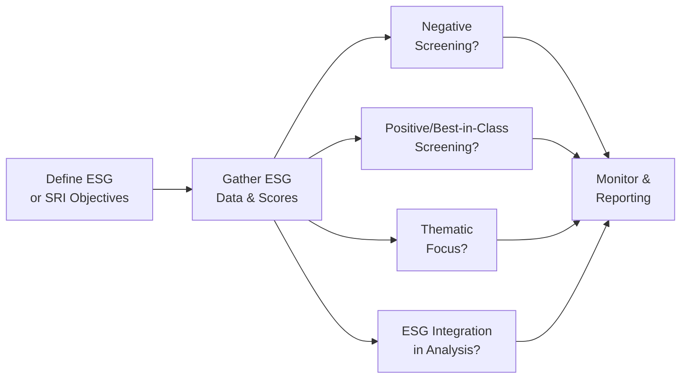

Definition and Scope  
ESG (Environmental, Social, and Governance) is a framework that looks beyond financial statements by integrating sustainability factors into investment decisions. Socially Responsible Investing (SRI) goes hand in hand with ESG, but it often emphasizes aligning an investor’s portfolio with specific ethical, social, or environmental values. For instance, some SRI-focused portfolios exclude industries like tobacco or firearms, a practice commonly called negative screening. Others might prioritize specific industries that demonstrate solid environmental practices or advanced diversity, equity, and inclusion policies—often referred to as positive screening.

Because ESG and SRI combine ethical considerations with financial objectives, they can bring unique constraints and opportunities to asset allocation. In previous chapters, we mostly focused on risk-adjusted returns, correlations, and macroeconomic drivers. Now, we add an extra dimension: aligning investments with certain personal or organizational values. And yes, I remember the first time I dealt with a client who said, “I’m not comfortable having any fossil fuel exposure,” even though that sector had compelling valuations. We had to tweak the entire portfolio approach. That’s the sort of constraint we’ll delve into here.

Motivations  
Investors pursue ESG and SRI strategies for different reasons:

• Ethical and Value Alignment: Some individuals or institutions have explicit missions or are determined to avoid investing in companies that conflict with their principles.  

• Regulatory or Stakeholder Pressure: Pension funds, endowments, and insurance companies may need to meet specific climate-related or ESG disclosure requirements, especially in regions where regulation is tightening.  

• Risk Mitigation: ESG factors can highlight hidden risks. For instance, poor environmental practices may lead to lawsuits or fines. Weak governance might encourage fraud or corruption. Integrating ESG factors can help avoid or reduce industries that face significant regulatory or reputational backlash.  

• Competitive Advantage: Certain investors believe that firms with strong ESG profiles display better long-term performance or resilience.  

Portfolio Construction Approaches  
Implementing ESG and SRI strategies can vary widely. Let’s consider the main methods:

Negative Screening  
• Excludes companies or industries not meeting specific criteria.  
• Widely used by religious or ethically driven funds—think of avoiding gambling or firearms.  
• Straightforward to execute, although it may reduce diversification.  

Positive Screening / Best-in-Class  
• Selects securities with robust ESG ratings compared to sector peers.  
• Known as “best-in-class” because it retains exposure to various sectors but opts for a subset of companies deemed more sustainable.  
• Encourages improvement within industries, since firms might try to boost ESG scores to attract capital.  

Thematic Investing  
• Focuses on specific themes such as clean energy, water and sanitation, or social inclusion.  
• Suited for investors looking to direct capital toward a particular cause.  
• Returns can be cyclical, as thematic investments may be concentrated in niche industries or technologies.  

Integration of ESG Scores  
• Incorporates ESG metrics into fundamental or quantitative analysis.  
• Often uses third-party data providers like MSCI, Sustainalytics, or other specialized ESG raters.  
• May adjust portfolio weights based on ESG scores or exclude low-rated issuers.  

The following Mermaid diagram sums up these approaches:

In many cases, practitioners will use a combination of these methods. For instance, you might exclude certain “red-flag” sectors (negative screening) but also apply best-in-class selection among the remainder. Others get more granular, weighting positions according to specialized ESG scores.

Performance Considerations  
There’s lively debate over whether ESG constraints help or hurt performance. Some studies suggest that strong ESG practices lower companies’ cost of capital and reduce downside risk. Others argue that tight restrictions can lead to higher tracking error and a narrower investment universe, which might limit potential returns.

Practical realities:  
• Revenue and operating costs may be impacted by ESG factors (e.g., a carbon tax).  
• Tighter regulations and stakeholder scrutiny could tilt market sentiment.  
• Sometimes firms with strong ESG profiles demonstrate lower volatility in crises—think of the 2008 meltdown or 2020 pandemic, when companies known for robust governance were more stable.

On the other hand, heavily screened portfolios might miss out on profitable opportunities. Adding these constraints also increases compliance, data collection, and reporting costs—something to keep in mind when analyzing net returns.

Reporting and Metrics  
Investors increasingly need to show how their ESG approach is playing out in real-life portfolios. Reporting frameworks like the Sustainability Accounting Standards Board (SASB) and recommendations from the Task Force on Climate-related Financial Disclosures (TCFD) are pushing for standardized practices. This allows stakeholders to compare apples to apples.

Growing interest in measuring social and environmental impact has spurred many asset managers to publish “impact reports.” They highlight stats like carbon footprint reduction or workforce diversity. Still, standardization remains patchy. Some entities measure ESG in a normative way, while others focus on materiality—what’s financially relevant. Over time, we expect consistent, standardized disclosures to become more widespread, improving data reliability and comparability.

Practical Examples and Real-World Scenarios  
Below are a few ways these constraints show up in real life:

• Pension Fund with Climate Mandates: A public pension fund might be required by local regulation to divest from coal producers or to disclose the overall carbon emissions of its portfolio. The portfolio manager must remain mindful of any underweight or overweight exposures across energy sectors.  

• University Endowment Excluding Fossil Fuels: Many university endowments receive activism pressure from faculty, students, and donors to exclude high-carbon industries. Endowment managers might implement a negative screen that eliminates certain companies, or even entire sub-industries in the oil and gas space.  

• Corporate 401(k) Plan Emphasizing Diversity: An employer wants to ensure that employees have access to funds that meet certain diversity criteria. The company might integrate best-in-class screening for the top 20% of companies in each sector for workplace diversity, representation, or community engagement.  

• Thematic Green Bond Portfolio: An institutional investor might dedicate 15% of its fixed-income allocation to green bonds that fund water conservation, renewable energy projects, or sustainable infrastructure.  

Anecdotally, I recall analyzing a small biotech firm with terrific ESG scores, partly because they had strong governance and were transparent about clinical trials. Their share price was surging, ironically enough, at the same time we were asked by a client to exclude “experimental drug companies” from the SRI portfolio. We had to do extra custom screening just for that. That’s how real-life constraints intersect with performance potential.

Common Pitfalls and Best Practices  
Pitfalls  
• Data Inconsistency: Not all ESG ratings are created equal. Providers use different methodologies, so an “A” rating in one system might be a “B+” elsewhere.  
• Overconcentration: Overly restrictive negative screening might cause an undesirable concentration in certain sectors.  
• Greenwashing: Some firms or funds market themselves as “sustainable” without truly meeting meaningful ESG criteria.  

Best Practices  
• Multi-Provider Data: Combine at least two sources of ESG scores for cross-validation.  
• Use Materiality: Focus on industry-specific metrics that materially impact value. For instance, water usage is highly relevant to beverage companies, while data privacy is critical for tech firms.  
• Clear Mandates: Define precise objectives. If your main goal is to reduce carbon risk, then measure and manage the portfolio’s carbon footprint.  
• Regular Review: ESG standards and external data sources evolve quickly, so revisit screens and scoring models frequently.  

Incorporating ESG with Other Constraints  
We’re in Chapter 5 discussing real-world constraints, which might also include liquidity requirements or legal/regulatory constraints. ESG adds another layer. For instance, a fund with big liquidity needs might struggle if a key ESG-compliant bond is illiquid. Also, some markets (like certain emerging economies) have less robust ESG data, which complicates analysis. Balancing these constraints can be tricky. You might see references to chapters 5.1 (Asset Size, Liquidity Needs) or 5.3 (Recommending and Justifying Allocation Revisions) for additional synergy.

Exam Tips  
• Be ready for scenario-based questions where you must identify how an ESG or SRI constraint affects portfolio composition or performance projections.  
• Practice describing the benefits and drawbacks of negative screening, best-in-class screening, and thematic investing.  
• Demonstrate how you might integrate ESG data in a standard portfolio optimization context, like mean–variance optimization or factor-based approaches.  
• Understand that performance can be impacted by higher expenses (e.g., data, compliance) and reduced opportunity sets.  
• Familiarize yourself with TCFD, SASB, and other frameworks. The exam may ask about how to implement or report these disclosures.  

Glossary  
ESG (Environmental, Social, Governance): A framework that evaluates a company’s environmental footprint, social impact, and governance practices.  
SRI (Socially Responsible Investing): Investing that blends ethical or values-based considerations with financial outcomes.  
Negative Screening: Excluding companies, industries, or countries that conflict with specific ethical, social, or environmental values.  
Best-in-Class Screening: Selecting firms with the highest ESG scores within a given industry.  
SASB (Sustainability Accounting Standards Board): An organization issuing industry-specific sustainability disclosure standards.  
TCFD (Task Force on Climate-related Financial Disclosures): A framework providing guidelines on reporting climate-related financial risks and opportunities.

References, Further Reading, and Research Materials  
• CFA Institute, “ESG Investing and Analysis,” CFA Institute publications.  
• Global Sustainable Investment Review, https://www.gsi-alliance.org/.  
• Boffo, R., & Patalano, R., “ESG Investing: Practices, Progress and Challenges,” OECD.  
• Eccles, R., & Klimenko, S., “The Investor Revolution,” Harvard Business Review.

## Mastering ESG and SRI Constraints: Test Your Knowledge



### Which of the following best describes negative screening in an ESG context?

- [x] Excluding specific companies or industries based on undesirable attributes.
- [ ] Choosing companies with superior ESG metrics relative to peers.
- [ ] Concentrating investments in a particular ESG-related theme.
- [ ] Integrating ESG scores into every aspect of the security selection process.

> **Explanation:** Negative screening targets the explicit exclusion of certain sectors or firms that fail specific ethical or sustainability requirements, in contrast to positive screening or thematic investing.

### One reason an investor might apply SRI constraints is:

- [ ] To maximize exposure to fossil fuel industries.
- [x] To align the portfolio with personal or organizational values.
- [ ] To increase portfolio beta beyond usual market levels.
- [ ] To eliminate the need for sector diversification.

> **Explanation:** A common driver of SRI strategies is value alignment, where investors exclude or include companies based on moral or ethical concerns.

### Which of the following is true about the impact of ESG considerations on portfolio performance?

- [ ] It always guarantees higher returns.
- [ ] It usually leads to severe underperformance in every market cycle.
- [x] Mixed evidence suggests ESG integration can sometimes reduce risk while potentially limiting the opportunity set.
- [ ] It has no impact on either returns or risk.

> **Explanation:** Multiple studies produce varying results. ESG constraints might reduce downside risk but can also limit the available investment universe.

### Which statement most accurately describes best-in-class screening?

- [ ] Completely avoiding investments in specific sectors like tobacco or firearms.
- [x] Selecting top ESG-rated companies within each sector.
- [ ] Investing solely in green bonds or water resource projects.
- [ ] Screening based on carbon footprint alone.

> **Explanation:** Best-in-class screening retains sector exposure but chooses the highest-rated ESG performers in each sector rather than excluding entire industries.

### A portfolio manager decides to sever all exposure to coal producers due to heightened climate risk. This choice is an example of:

- [x] Negative screening.
- [ ] Positive screening.
- [x] A potential source of tracking error.
- [ ] A best-in-class approach.

> **Explanation:** Excluding coal producers is negative screening. Such an exclusion can also create tracking error versus benchmarks that include those companies.

### In ESG investing, materiality refers to:

- [x] The relevance of specific ESG factors to a company or sector’s financial performance.
- [ ] A universal set of nonfinancial disclosures that apply equally to all industries.
- [ ] The process of excluding “sin stocks” from a portfolio.
- [ ] The practice of only using official ESG rating providers.

> **Explanation:** Materiality indicates how important or financially relevant certain ESG factors are within a given industry. It ensures focus on factors that can substantively affect company performance.

### A complete exit from an entire sector based on a client’s ethical constraints could raise which portfolio risk?

- [x] Concentration risk in other sectors.
- [ ] Lower portfolio tracking error.
- [x] Increased volatility from missing broad market exposure.
- [ ] Elimination of short-term rebalancing need.

> **Explanation:** Excluding an entire sector shrinks diversification potential, which can create a higher concentration in remaining sectors and thus higher portfolio volatility.

### Which statement about thematic ESG investing is most accurate?

- [ ] Thematic investors avoid using specialized ESG data.
- [ ] It naturally includes all sectors equally.
- [ ] It is typically cost-free to implement.
- [x] It concentrates capital in a specific ESG-related area such as clean energy or water conservation.

> **Explanation:** Thematic investing targets a particular sustainability or ESG theme, often concentrating exposure within certain industries.

### A large institutional investor mandates that each holding must have at least an “above-average” ESG rating from two different providers. What is a potential challenge?

- [x] Inconsistency between ESG data providers may lead to conflicting ratings.
- [ ] All providers converge on the same rating system.
- [ ] The rule can lower data requirements.
- [ ] This typically reduces compliance costs.

> **Explanation:** ESG ratings vary widely by provider. Requiring multiple sources can complicate selection if one provider’s “above-average” rating is another’s “average” or “below-average.”

### True or False: Greenwashing can occur when a firm or investment fund markets itself as sustainable, despite minimal actual adherence to ESG principles.

- [x] True
- [ ] False

> **Explanation:** Greenwashing is a growing concern. Firms or funds may showcase certain minor sustainability efforts to appear ESG-friendly, even if those efforts do not substantively align with recognized ESG standards.


