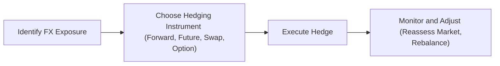
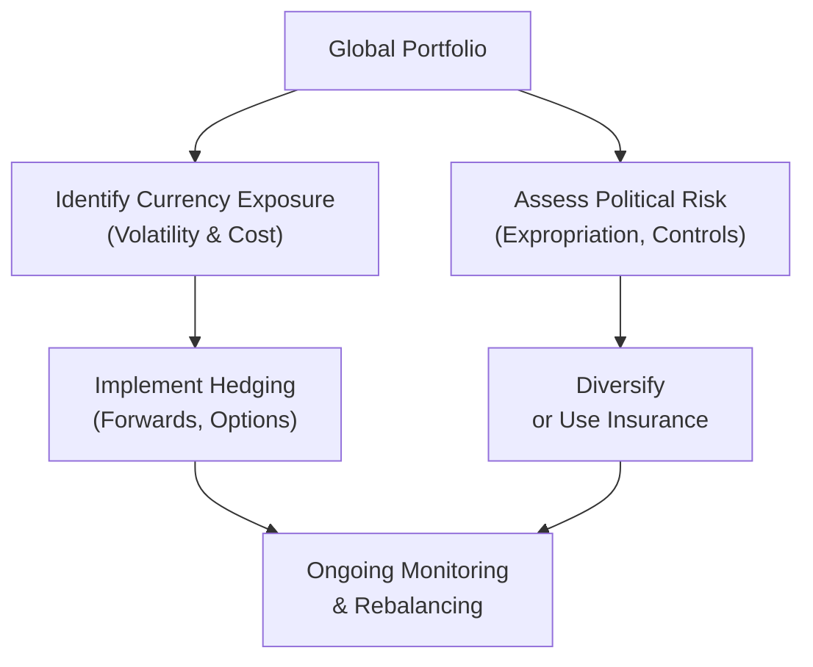

## Understanding Currency Risk

Currency risk, sometimes called exchange rate risk, is a key consideration for any investor venturing across borders. The moment we invest in foreign assets—whether equities, bonds, or derivatives—we're exposed not only to the performance of those assets in their local markets but also to changes in their underlying exchange rates relative to our home currency. It’s almost like that time I traveled overseas and realized that if my currency suddenly weakened, my stay got more expensive—except in finance, these “hotel bills” can run in the millions.

Exchange rates are influenced by a wide variety of factors, including differences in interest rates, inflation expectations, trade balances, capital flows, and macroeconomic performance. Even short-term shifts in market sentiment can cause sizable price swings. For instance, a rumored change in central bank policy might spark a flurry of speculative trades, causing exchange rates to fluctuate rapidly.

This added layer of volatility is why portfolio managers often consider currency hedging. When left unmanaged, currency exposure can be a big source of uncertainty. Of course, whether you want that exposure or not depends on the nature of your portfolio, your liabilities, your time horizon, and your risk tolerance. After all, some folks actually welcome currency risk when they have a view that certain currencies are likely to appreciate. Others prefer mitigating the uncertainty so they can focus on the “pure” performance of the underlying local assets.

## Passive vs. Active Currency Hedging

Broadly speaking, we often split currency risk management into two sides of the coin: a passive (fully hedged) approach versus an active (selectively hedged) approach. The passive approach might involve systematically neutralizing foreign exchange (FX) risk. This method tries to stabilize returns in the base currency, but it can also mean forfeiting any potential gains from favorable currency movements.

Active hedging, on the other hand, looks more like skill-based currency management. Here, you might hedge exposures if you have a negative outlook on a particular currency, while leaving them unhedged if you think the currency will strengthen. For example, if you suspect that the U.S. dollar might appreciate against the euro, you might keep some exposure to the dollar (i.e., not fully hedge). But this relies on forecasts and, like all forecasts, carries the risk of being dead wrong. Let’s be real: even professionals who do this day in and day out get it wrong sometimes—maybe more often than they’d like to admit.

The key question is how comfortable you are with currency-driven volatility and whether you see currency decisions as a source of alpha. If you’re uncertain, you might hedge partially—somewhere between 30% to 70%—and review that exposure regularly.

## Hedging Tools and Techniques

When it comes to mitigating currency risk, a set of tried-and-true financial instruments comes into play. These can be as straightforward or complex as you like:

Forward Contracts. The simplest way to lock in an exchange rate for a future date is with a forward contract. Say you have a bond denominated in euros and you know you’ll convert back to U.S. dollars in six months. You can set up a forward contract to exchange euros for dollars at a predetermined rate six months from now. This eliminates the uncertainty that might arise from euro/dollar fluctuations during that period. Because forwards are over-the-counter contracts, you typically face counterparty risk, but you also enjoy flexibility in contract terms (like notional size or settlement date).

Currency Futures. Similar to forwards, currency futures are standardized and trade on an exchange, which reduces counterparty risk but can limit customization. They tend to have smaller liquidity in certain currency pairs outside the majors, so keep that in mind if you have exposure in an exotic currency pair.

Currency Swaps. If you need to exchange not just principal but also interest payments in two different currencies, currency swaps might fit better. A currency swap can help you convert liabilities or assets in one currency to another, effectively exchanging sets of cash flows over a defined term. This is often used by multinational firms and pension funds looking to match durations and coupon payments in a cost-effective manner.

Currency Options. Options can be appealing if you want downside protection without fully giving up upside potential. For example, you could buy a put option on a currency that you’re worried may fall in value against your base currency. The cost of that option is a premium, which you lose if the feared downturn never materializes, but that’s the price of insurance. Some managers use option collars—buying a put and selling a call—to offset some of that cost.

Natural Hedging. Sometimes, you can hedge currency exposures simply by matching foreign currency liabilities and assets. For instance, if you’re an exporter in Europe paying your employees in euros but receiving revenue in dollars, you might consider taking out a euro-denominated loan. You might also invest in euro-denominated securities. This way, your local currency inflows and outflows offset each other to some extent.

Below is a simple Mermaid diagram illustrating the conceptual flow among common currency hedging strategies:

## Monitoring and Rebalancing Currency Positions

Managing currency exposure isn’t a “set it and forget it” deal. Exchange rates fluctuate constantly, so your hedge ratio might drift from your target. In addition, capital flows into and out of your portfolio may change the underlying exposure. In practice, you’ll want an established rebalancing policy—maybe every month or quarter, or whenever your hedge ratio diverges significantly from your target.

You also need to monitor the costs of hedging. Currency forwards are priced according to interest rate differentials under the interest rate parity principle. If the interest rate of your base currency is much lower than that of the foreign currency, it might cost you more to hedge, at least in forward points. That’s where some managers examine carry trades—though that’s a tactic with its own set of risks.

Here’s a simplified KaTeX expression to demonstrate the forward price relationship (though real markets will add in credit spreads, transaction costs, and so on):


F_{A/B}(t) = S_{A/B}(0) \times \frac{(1 + i_A)^t}{(1 + i_B)^t}


Where:  
• \\( S_{A/B}(0) \\) is the spot exchange rate, quoting currency A in terms of B at time 0.  
• \\( i_A \\) is the annualized risk-free interest rate of currency A.  
• \\( i_B \\) is the annualized risk-free interest rate of currency B.  
• \\( F_{A/B}(t) \\) is the forward price for time t in the future.

## Understanding Political Risk

Currency risk is just one facet. Political risk—often encompassing policy instability, geopolitical tensions, or even outright expropriation—can wreak havoc on global portfolios. You might recall the feeling of reading about sudden capital controls in a country where your company or fund has investments. It’s like the market door is slamming shut with your money still inside.

Political risk isn’t always dramatic. Sometimes it’s as mild as new tariffs or a change in local tax structure, affecting company profitability and your returns. Other times, it’s more severe: expropriation, unexpected default on government bonds, or regulatory clampdowns on foreign ownership. Political risk might manifest in the form of sudden shifts in property rights or forced conversions of local currencies into illiquid vehicles.

When analyzing a country’s political risk, investors often look for:  
• Stability of the current government.  
• Frequency of policy reversals.  
• History of dealing with foreign investors.  
• Ongoing geopolitical tensions with neighboring countries.  
• Local attitudes towards capital controls or expropriation.  

Political or country risk premiums—above the normal required return for an investment—are typically embedded in asset prices to compensate for these uncertainties. Equity valuations or sovereign bond yields may appear cheaper or higher, respectively, to entice investors into a higher-risk environment. But note that such premiums may spike or change quickly if a new event upends the status quo.

## Mitigating Political Risk

The most straightforward approach to mitigating political risk is geographic diversification. The idea is that you spread your portfolio across multiple countries and regions. If one government goes rogue, you’re exposed to only a slice of your total assets. Yes, it’s a bit like not putting all your eggs in one basket, but with the added complexity that each “basket” might have its own unique set of rules or unpredictabilities.

Another approach is to buy political risk insurance, offered by agencies like the World Bank’s Multilateral Investment Guarantee Agency (MIGA) or certain private insurers. This can protect against government actions such as expropriation or currency inconvertibility. While it can be expensive or complicated, it might be worthwhile for large or long-term investments in higher-risk regions.

Finally, many portfolio managers rely on ongoing research: reading local news, analyzing policy statements, subscribing to political risk rating services, or even working with country risk consultants. Periodic reviews can help you identify red flags early. The table below outlines some of the factors to watch:

| Factor                     | Description                             | Example Implications                          |
|----------------------------|-----------------------------------------|-----------------------------------------------|
| Government Stability       | Frequency of elections, public support  | Risk of abrupt policy changes                 |
| Regulatory Environment     | Ease of doing business, capital flows   | Possible capital controls or restrictions     |
| Geopolitical Tensions      | Territorial disputes, trade conflicts   | Tariffs, embargoes, or forced asset divestment|
| Social Unrest              | Protests, labor strikes, unrest         | Operational disruptions or reputational risk   |
| Economic Diversification   | Dependence on a single export or sector | Vulnerability to commodity price swings        |

## Combining Currency and Political Risk Management

It’s often best to think of currency and political risk in tandem. A seemingly attractive currency carry might be overshadowed by the risk of a new capital control that disallows foreign investors from repatriating funds at a fair market rate. Similarly, a stable political climate might still see currency values plummet because of changing global interest rates or trade balances. Successful global portfolio management integrates both sets of risks into the strategic asset allocation (see Chapter 2 and Chapter 3 references for more on how macroeconomic changes and systematic risk exposures can drive these decisions).

In a pinch, I’ve seen skilled managers pivot their hedge exposures when they see political storm clouds on the horizon. For example, an equity manager with positions in a country that’s about to hold a potentially destabilizing election might decide to fully hedge the currency and reduce direct holdings, or temporarily shift capital to a more liquid ETF that invests in that region. It’s definitely no guarantee, but it’s one way to reduce potential blowback if things go sideways.

Below is a simplified flow tying currency risk and political risk considerations together:

## Ongoing Monitoring of Regulatory and Policy Changes

Keeping tabs on local regulations, tax regimes, and foreign investor guidelines is imperative. For instance, certain emerging markets may impose limitations on the profits that foreign investors can repatriate. Other countries might have variable withholding taxes that affect your after-tax yield on equity dividends or bond interest. In some jurisdictions, the central bank might impose daily limits on currency transactions for non-residents.

A regular review of these shifting rules helps keep your portfolio nimble. This might include:  
• Reviewing local central bank announcements for changes to foreign exchange rules.  
• Monitoring official channels or specialized consulting firms for capital control directives.  
• Tracking local tax law amendments that could change your effective yields.  

I’ve personally found that a well-timed consultation with on-the-ground advisors can be worth its weight in gold—especially in markets where the rules can change quickly, or where the official language might create translation barriers.

## Practical Examples and Case Studies

Let’s illustrate a couple of simplified scenarios:

Scenario 1: Japanese Pension Fund Investing in U.S. Bonds  
A Japanese pension fund invests in a portfolio of U.S. Treasury bonds. The pension fund’s liabilities are in Japanese yen. If the yen appreciates substantially against the dollar, the value of the U.S. bond holdings (when converted back to yen) will drop. To protect against that, the pension fund enters into a series of currency forwards to sell dollars and buy yen at a predetermined rate. The fund rebalances these forward contracts every month to maintain a fully hedged position.

Scenario 2: Venture Capital Firm in an Emerging Market  
A venture capital firm invests in a startup based in an emerging market country that has a volatile political climate. The firm is concerned about potential expropriation or new restrictions limiting foreign ownership. To mitigate this, the firm invests alongside a local partner with strong government ties and also purchases political risk insurance. Although it increases upfront cost, the insurance covers expropriation, currency inconvertibility, and forced abandonment risk. Furthermore, the firm partially hedges the local currency after an initial analysis shows a persistent inflation differential. A set of rolling currency option contracts is used, allowing some participation if the local currency gains, but capping downside if it depreciates sharply.

These examples highlight the interplay between currency risk management and political risk management—and underscore the flexibility required to deal with real-world complexity.

## Best Practices and Common Pitfalls

Maintaining an awareness of local market liquidity is crucial for implementing hedges effectively. If you’re dealing with an illiquid currency, even if hedging instruments exist, the costs can be punitive. It’s also important to ensure that your hedging or insurance solutions are not themselves subject to local regulatory restrictions. For instance, a currency forward contract is only as good as the counterparty’s ability to honor it—and if that counterparty is located in a jurisdiction with shaky legal protections, the hedge might fail when it’s needed most.

Another frequent pitfall is ignoring correlation dynamics. Currency movements can sometimes reinforce or offset market-price movements, so blindly hedging can remove a diversification benefit. If local equities tend to rise when the currency falls, that might cushion your total returns in your base currency. Sometimes partial hedging or a dynamic approach is more optimal.

## Conclusion

Currency and political risks are key dimensions of global portfolio management, and approaching them with the right mindset and tools can tip the scales in your favor. Whether you’re a believer in pure, systematic currency hedging or an active trader who likes to glean alpha from currency bets, staying informed is paramount. And keep in mind the interplay with political factors—because all the currency hedges in the world won’t help if a country locks down capital flows or changes the very structure of the financial system overnight.

Having a well-thought-out process—one that monitors economic shifts, interest rate differentials, political developments, and your own portfolio’s evolving exposure—forms the cornerstone of robust global investing. Don’t forget the intangible benefits of local knowledge, and never underestimate the complexities of actually executing a strategy in a foreign market.

## Exam Tips

At the CFA Level III exam, you can expect scenario-based questions where you’re asked to determine whether to hedge, how to hedge, and what tool to use under varying market conditions. Be prepared to:  
• Differentiate between passive and active hedging, and articulate the rationale for each.  
• Perform quick forward pricing calculations or show how currency options can be used to limit downside.  
• Identify situations that call for partial hedges.  
• Discuss how political risk premiums might influence valuation models (especially discounted cash flow (DCF) or risk-adjusted discount rates).  
• Recommend adjustments to an asset allocation based on new political risk developments or currency outlook.  
• Relate currency hedging strategies to the overall investment policy statement, ensuring consistency with client objectives and guidelines.

Stay methodical and structured in your essay or item-set responses. Show your reasoning step-by-step. The examiners love clarity on how you arrived at your conclusion, not just the conclusion itself.

## References, Further Reading, and Research Materials

• Shapiro, A., “Multinational Financial Management,” Wiley.  
• Butler, K., “Multinational Finance,” Thomson.  
• CFA Institute, 2025 Level III Curriculum, “Currency Risk Management in Portfolios.”  
• Political Risk Service scores (e.g., PRS Group), https://www.prsgroup.com/.  
• MIGA (Multilateral Investment Guarantee Agency) resources, https://www.miga.org/.  

## Test Your Knowledge: Managing Currency and Political Risks



### Which statement most accurately describes the difference between passive and active currency hedging?

- [x] Passive hedging systematically neutralizes currency risk, while active hedging selectively hedges based on market views.
- [ ] Passive hedging refers to the use of standardized forward contracts, while active hedging uses swaps.
- [ ] Active hedging is always less costly than passive hedging due to lower transaction frequency.
- [ ] Active hedging typically involves only partial hedges, whereas passive hedging involves no hedging.

> **Explanation:** Passive hedging focuses on removing currency risk altogether, whereas active hedging involves making discretionary decisions about when and how much to hedge.

### An investor holds an equity portfolio denominated in a foreign currency. If the investor anticipates that the foreign currency will depreciate, which strategy is most appropriate?

- [x] Selling currency forwards.
- [ ] Buying currency call options.
- [ ] Buying currency put options.
- [ ] Entering a currency swap where the investor pays the foreign currency.

> **Explanation:** Selling currency forwards locks in the ability to convert the foreign currency holdings to the base currency at a set rate, mitigating losses if the foreign currency weakens.

### Which of the following does NOT typically fall under political risk considerations?

- [ ] Expropriation of foreign-owned assets.
- [ ] Imposition of capital controls.
- [x] Changes in a central bank’s monetary policy related to inflation.
- [ ] Currency inconvertibility regulations.

> **Explanation:** Central bank monetary policy changes are generally classified under macroeconomic or currency risk, not under the umbrella of political risk.

### A global bond fund invests in a country where local regulations suddenly prohibit profit repatriation. Which form of risk has primarily impacted this investment?

- [ ] Credit risk.
- [ ] Liquidity risk.
- [x] Political risk.
- [ ] Interest rate risk.

> **Explanation:** Repatriation restrictions are part of political risk, as they stem from government regulations limiting capital outflows.

### An investor buys a currency put option on a foreign currency they expect to decline. Which statement about potential outcomes is correct?

- [x] It allows the investor to sell the foreign currency at the strike price if it depreciates below that level.
- [ ] It obligates the investor to sell the foreign currency at the strike price.
- [x] The investor can still benefit if the currency suddenly appreciates.
- [ ] The premium is zero if the currency appreciates above the strike.

> **Explanation:** A put option is a right, not an obligation, to sell, providing downside protection while keeping upside potential if the currency rises.

### Which of the following is a valid way to naturally hedge foreign currency exposure?

- [x] Matching foreign currency revenues with liabilities in the same currency.
- [ ] Buying currency forwards to lock in a future exchange rate.
- [ ] Using an interest rate swap to offset yield differentials.
- [ ] Purchasing political risk insurance.

> **Explanation:** Natural hedging involves structuring your operations to ensure offsetting currency flows, such as having debts payable in the same currency in which you earn revenue.

### When analyzing political risk in a country, which factor is least relevant?

- [x] The average daily FX trading volume in that country’s currency.
- [ ] Potential for policy changes after elections.
- [x] Historical record of expropriation or violation of property rights.
- [ ] Geopolitical tensions with neighboring countries.

> **Explanation:** While FX trading volume may affect liquidity and transaction costs, it is not typically a direct measure of political risk. Policy changes, history of expropriation, and geopolitical tensions are more directly related to political risk.

### Which action might a portfolio manager take in response to looming political upheaval in a target market?

- [x] Reduce or exit positions and use currency hedges to limit downside.
- [ ] Maintain current allocations but add commodity exposure.
- [ ] Use interest rate swaps to reduce duration risk.
- [ ] Increase exposure to local equities as a contrarian approach.

> **Explanation:** Reducing positions or using hedges directly mitigates the potential financial harm from a political shock.

### In the context of currency swaps, which statement is generally true?

- [x] They involve exchanging principal and interest payments between different currencies.
- [ ] They only involve exchanging one interest rate benchmark for another, in the same currency.
- [ ] They are typically traded on an exchange, reducing counterparty risk.
- [ ] They cannot be used to hedge long-term currency exposure.

> **Explanation:** Currency swaps exchange principal and interest in two currencies; the other statements are incorrect or incomplete descriptions.

### In a scenario where a country's government passes a law restricting foreign exchange rate movements to a narrow band, what risk is primarily elevated?

- [x] True
- [ ] False

> **Explanation:** The narrower band might signal impending capital controls or heightened political interference in currency markets, thus political risk is on the rise.


