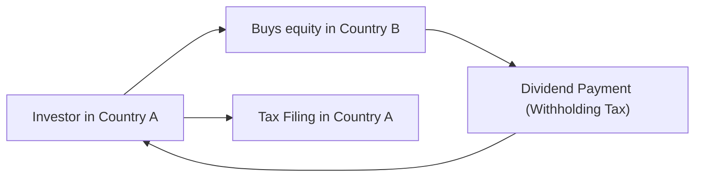
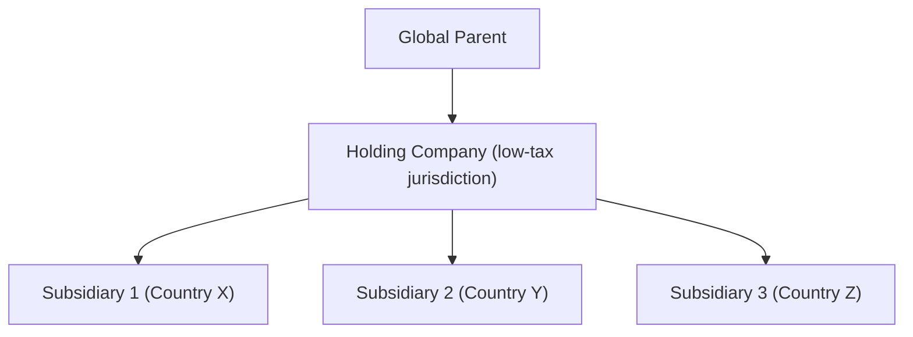

Introduction  
Sometimes when I think about cross-border tax and regulatory challenges, I remember a friend who tried to open a brokerage account abroad. She had great intentions—wanted exposure to a rapidly growing market, did her research, and even walked through the official instructions on the local regulator’s website. Yet a few months later, she was knee-deep in unexpected withholding taxes, currency controls, and reporting rules she’d never heard of. It was a wake-up call: investing across borders can unlock huge opportunities, but it also comes with a few headaches. Let’s walk through those complexities together and highlight strategies that help investors navigate multi-jurisdictional waters.

Cross-Border Tax Complexity  
One of the biggest struggles with multi-jurisdictional investing is dealing with divergent tax regimes. Capital gains, dividends, interest income, and estate taxes can carry very different treatments from one country to another—even from one province to another in certain federal systems. Double taxation occurs when two or more governments simultaneously tax the same stream of income. It can sound scary, but double taxation treaties (often drawn from frameworks such as the OECD’s Model Tax Convention) aim to reduce or even eliminate this duplication.

Consider a hypothetical scenario: An investor based in Country A purchases dividend-paying stocks in Country B. The investor might owe a withholding tax in Country B on dividends, plus a local income tax back in Country A. Since many countries sign tax treaties with one another, it’s sometimes possible to reduce the withholding tax from, say, 30% to 15%—big difference, right? But these treaties are not uniform. Each has unique rules, and you’ll need to validate that your specific investment or entity qualifies. This is usually subject to rigorous documentation as well, such as obtaining a certificate of tax residency.

Let’s visualize the concept briefly:

In this diagram, the investor from Country A invests in assets in Country B. The dividends flow back to the investor but can be subject to withholding tax. Then the investor might still have to declare that dividend income (net of withholding tax) on their Country A return. Nearby double taxation treaties can partially offset or credit taxes paid in the source country.

Regulatory Divergence  
Taxes aren’t the whole story; laws and regulations around ownership, repatriation of earnings, or market access can differ drastically across the globe. Some jurisdictions (often emerging or frontier markets) limit foreign investments in strategic sectors like telecommunications, energy, or natural resources. These rules aren’t trivial. They can take the form of a direct ban on non-local ownership above a certain percentage, or a requirement to structure the investment through a domestic partner.

It’s possible you’ll run into repatriation constraints that limit how easily you can move profits—or even principal—back out of a country. Imagine discovering you can’t convert your local-currency returns into your home currency because of restrictions on foreign exchange conversions. That’s a double whammy if the local currency suddenly depreciates.

If you’re a CFA candidate studying for the exam, keep an eye on how these regulatory elements might change the risk profile or feasibility of certain allocations. For example, your perfect portfolio weighting to an emerging market might be 10%. But local rules might limit certain funds to a smaller slice, or you might have to use an alternative instrument (like a depositary receipt).

Structuring Techniques  
Various legal and operational mechanisms exist to help manage cross-border tax exposures and regulatory constraints. Some of these might sound fancy, but they’re widespread:

• Holding Companies: Setting up a holding company in a tax-friendly jurisdiction can centralize ownership of multiple subsidiaries across different countries. It could offer treaty benefits, such as lower withholding taxes, as well as administrative convenience—one location for corporate governance. However, you need to check anti-tax-avoidance rules or “substance” requirements to ensure you’re not running afoul of local laws.

• Special Purpose Vehicles (SPVs): An SPV is a separate legal entity established for a specific deal, project, or purpose. These can offer liability segregation for high-risk investments. In cross-border transactions, SPVs may help structure deals so that only the SPV is legally responsible for local operations or so that you can qualify for more favorable tax treatment under a local treaty. That said, watch out for increased scrutiny because regulators often keep an eye on potential abuses (think about the 2008 crisis lessons).

• Transfer Pricing Practices: If you’re dealing with a multinational corporation that invests or operates in different countries, transfer pricing influences how profits are allocated across jurisdictions. Under certain conditions, structuring an investment or a supply chain might shift taxable profit from a high-tax to a low-tax jurisdiction. Be aware, though, that tax authorities have ramped up regulatory oversight and will audit questionable pricing arrangements.

Here’s a quick illustration of how a holding company might sit on top of multiple operating subsidiaries:

In this structure, the holding company might allow the global parent to benefit from tax treaty networks or reduce withholding tax. It also cleanly separates liabilities in each operating subsidiary.

Compliance and Reporting  
A misstep in tax or regulatory compliance can lead to serious consequences, from hefty penalties to retroactive taxation. So if you’re investing across borders, you want to know about the big acronyms:

• FATCA (Foreign Account Tax Compliance Act): A U.S. regulation requiring foreign financial institutions to identify and report U.S.-related account information to the IRS. If you’re a U.S. taxpayer investing overseas or a foreign financial institution with U.S. account holders, this can be a big compliance burden.

• Common Reporting Standard (CRS): Developed by the OECD, the CRS is a global framework for the automatic exchange of financial account information among participating countries. It’s basically an international parallel to FATCA. If you’re a private investor with multiple accounts globally, expect your info to be shared across jurisdictions.

Even at a more mundane level, you’ll need to meet local filing deadlines, keep accurate statements, and (in some countries) appoint a local auditor or representative. Blow a filing date or misreport your income, and you might face fines—or worse, a ban on future investments. Because regulations change quickly, many cross-border investors rely on local advisors who can help interpret rules updated every year or two. And let’s not forget currency convertibility or capital controls. Some markets require you to fill out special forms or obtain regulatory approval when you move large sums in or out.

Best Practices  
How do we handle these complexities without losing too much sleep?

• Local Advisors: Don’t try to go it alone. Even the savviest CFA charterholders can benefit from on-the-ground guidance. Local tax accountants, attorneys, and compliance specialists can be expensive, but often it’s money well spent.

• Continuous Monitoring: Cross-border regulations shift frequently. For instance, the Carried Interest tax rules in certain European countries have changed multiple times in just a few years. Even the U.S. has updated partnership taxation rules recently. So periodic check-ins with your local partners or advisors are essential.

• Management of Currency Convertibility Risk: Some countries might unexpectedly impose capital controls. Keep an eye on the FX environment and consider hedging if it makes sense from a cost/benefit perspective. This might intersect with your strategic asset allocation decisions (see earlier sections in Chapter 5 for currency management strategies).

• Governance and Political Risk: Make sure you stay on top of local political developments and governance trends. Emerging market governments can suddenly change foreign ownership caps. If that’s a risk, maybe consider a more flexible route such as depositary receipts or private placements.

• Hedge Your Bets: Because of the patchwork nature of cross-border rules, it may help to diversify across different markets and legal structures. That way, if one location clamps down, your entire portfolio won’t be derailed.

Glossary  
• Withholding Tax: A tax withheld at the source by the payer on income paid to foreign investors, such as dividends, interest, or royalty payments.  
• Double Taxation Treaty: A bilateral agreement aiming to eliminate or reduce the double taxation of the same income in two (or more) countries.  
• Special Purpose Vehicle (SPV): A legal entity created to isolate and manage financial risk, commonly used in structured finance deals or to facilitate cross-border holdings.  
• FATCA (Foreign Account Tax Compliance Act): A U.S. regulation that requires foreign financial institutions to share information about U.S. account holders with the U.S. IRS.  
• Common Reporting Standard (CRS): A global initiative led by the OECD for the automatic exchange of financial information between tax authorities.

References, Further Reading, and Research Materials  
• OECD, “Model Tax Convention on Income and on Capital,” https://www.oecd.org/tax/treaties/  
• EY, Deloitte, or KPMG tools for comparing cross-border tax rates and compliance requirements.  
• CFA Institute, 2025 Level III Curriculum, “Managing Cross-Border Investments.”  
• Eun, C. S., and Resnick, B. G., “International Financial Management.”  

Exam Tips and Final Thoughts  
In the CFA Level III exam context, you could see multi-jurisdictional tax and regulatory issues appear in an item set or a constructed-response question. It might challenge you to propose an optimal structure for a client, factoring in the constraints of cross-border tax treaties or to evaluate how an unexpected regulatory shift changes your recommended asset allocation. Possibly you’ll have to do some quick math on net returns after withholding taxes or show you understand how to monitor new restrictions.

A few tips:  
• Don’t forget the timeline for local reporting and the penalty exposures—these can affect the feasibility of certain cross-border allocations.  
• Keep an eye on hypothetical rules about foreign ownership caps or repatriation. The exam might hinge on whether you notice that certain regulations limit the investment solution.  
• If you’re asked to compare two jurisdictional approaches, mention double taxation treaties, withholding rates, or the presence of stable political frameworks.  

By demonstrating mastery of cross-border tax rules, regulatory differences, and compliance, you’ll be well-positioned to handle real-world portfolio solutions. Although these issues are seldom straightforward, they’re pivotal in designing robust, globally diversified portfolios.

## Test Your Knowledge: Cross-Border Tax & Regulatory Challenges



### Under a typical double taxation treaty, which of the following often occurs on dividend income?

- [ ] Dividends are taxed once at the higher of the two jurisdictions' rates.
- [x] Withholding tax is reduced, and the investor may receive a tax credit in their home country.
- [ ] Dividend income is completely exempt from taxation in both jurisdictions.
- [ ] Investor must pay a penalty tax for offshore movements of capital.

> **Explanation:** Double taxation treaties often reduce the withholding tax rate and allow a foreign tax credit or similar relief mechanism in the investor’s home country, preventing double taxation.

### Which statement best describes a key feature of FATCA compliance?

- [ ] It exempts foreign banks from disclosing information on U.S. citizens living abroad.
- [ ] It applies only to institutional investors managing corporate assets in the U.S.
- [ ] It is designed only to track hedge funds at the institutional level.
- [x] It requires foreign financial institutions to report U.S. account holder information to the U.S. IRS.

> **Explanation:** FATCA mandates foreign financial institutions to identify and report U.S. account holders’ information to the U.S. IRS to prevent tax evasion.

### Which of the following scenarios is most likely to trigger a violation of local regulatory rules on foreign ownership?

- [x] Buying a controlling stake in a strategic telecommunications firm that a country defines as sensitive.
- [ ] Acquiring government bonds denominated in a foreign currency.
- [ ] Investing in widely traded global index funds through a domestic brokerage.
- [ ] Purchasing shares in a publicly listed consumer goods company with no ownership restrictions.

> **Explanation:** Many countries restrict or cap foreign ownership in strategic sectors, like telecommunications or natural resources, to protect national interests.

### What is the main rationale behind using a Special Purpose Vehicle (SPV) in a cross-border deal?

- [ ] To circumvent all tax and reporting regulations outright.
- [ ] To eliminate the need for any financial transparency in the transaction.
- [x] To isolate financial and legal risk while potentially benefiting from a local treaty network.
- [ ] To ensure the investor’s personal assets are automatically co-mingled with the deal’s assets.

> **Explanation:** An SPV can separate the risks of a cross-border deal from the parent entity and can also help structure transactions to make use of local treaties and reduce withholding tax.

### In monitoring multi-jurisdictional tax exposure, which best practice approach is generally recommended?

- [ ] Rely entirely on high-level overviews and broad disclaimers.
- [x] Seek local tax and legal advisors in each relevant jurisdiction.
- [ ] Wait until tax filing season to explore each year’s new rules.
- [x] Only pay attention to broad currency fluctuations.

> **Explanation:** Engaging local advisors in each jurisdiction (including lawyers and accountants) is essential to navigate rapidly changing tax and legal regulations. Monitoring currency fluctuations can also matter but is only one piece of risk management.

### How do cross-border limitations on repatriation of profits most directly affect an asset allocation?

- [x] They can limit an investor’s ability to realize returns or rebalance into other assets.
- [ ] They usually reduce the nominal yield on U.S. Treasury securities.
- [ ] They help reduce the cost of hedging foreign currency.
- [ ] They eliminate foreign withholding taxes.

> **Explanation:** If a jurisdiction restricts repatriation of profits, the investor may struggle to bring returns home or rebalance back into other global asset classes, thus influencing liquidity and strategic choices.

### Why might an investor choose a holding company in a low-tax jurisdiction?

- [ ] Because it eliminates all taxes everywhere.
- [ ] Because it is entirely free of regulatory oversight.
- [x] To consolidate ownership of international subsidiaries and potentially gain tax treaty benefits.
- [ ] To evade compliance with FATCA and CRS.

> **Explanation:** Holding companies can sometimes help consolidate control and potentially gain preferential withholding-tax rates under well-established double taxation treaties. They still must remain in compliance with FATCA/CRS and other regulations.

### Which of the following describes a risk of failing to comply with FATCA or CRS reporting obligations?

- [ ] Complete elimination of local taxes in the investor’s home country.
- [ ] Automatic cancellation of the investor’s offshore accounts with no penalty.
- [ ] Guaranteed eligibility for a reduced withholding rate.
- [x] Potential fines, penalties, or loss of access to certain banking services.

> **Explanation:** Non-compliance with FATCA or CRS can result in penalties, reputational damage, and potential loss of access to some financial institutions.

### Which of these items is generally the greatest concern regarding transfer pricing in a multi-jurisdictional context?

- [ ] Ensuring all taxable transactions remain domestic.
- [x] Properly allocating profits and expenses among jurisdictions to avoid accusations of tax evasion.
- [ ] Preventing all foreign subsidiaries from generating revenue.
- [ ] Making sure no international standards apply to the company.

> **Explanation:** Transfer pricing rules require profits to be allocated in a manner consistent with the economic reality. Incorrect processes could be investigated by tax authorities for shifting income to low-tax jurisdictions inappropriately.

### A local regulation states that foreign investors cannot own more than 49% of any joint venture in a strategic industry. True or False: This regulation is immaterial to an investor’s asset allocation decisions.

- [ ] True
- [x] False

> **Explanation:** Such ownership restrictions can substantially alter the feasibility or portfolio weighting for a given sector. Hence, these regulations are highly material to asset allocation decisions.


