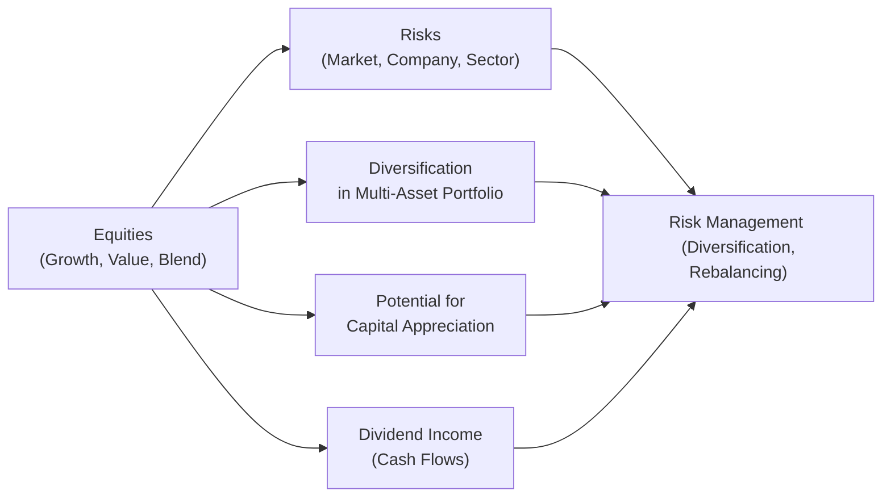

## Introduction

I remember early in my own investing journey—way before I sat for the CFA exams—there was this moment when I realized, “Hey, equities are more than just random ticker symbols on the screen.” They serve as powerful engines fueling long-term returns and, well, real wealth generation. Many times, folks get fixated on day-to-day price swings, while the deeper significance of equities in a diversified portfolio can get lost in the noise. And guess what? If you’re heading into the advanced realm of the CFA® Program (particularly Level III), you'll find that this holistic understanding of equities is crucial.

This section explores the primary roles that equities play in an investment portfolio. While we’ll examine several reasons investors hold equities—long-term growth, inflation hedging, and diversification come to mind—we’ll also discuss how equity allocations tie into other parts of the portfolio, such as fixed income or alternative investments (refer to Chapters 2 and 3, respectively, for more on those asset classes). Buckle up, because an investor’s decisions about equity allocations can significantly shape portfolio returns and risks.

## Long-Term Growth Engine

One of the biggest reasons investors gravitate toward equities is the potential for long-term capital appreciation. Over extended periods, stock markets have historically outpaced inflation and delivered higher returns compared to many other asset classes.

• Compounding Magic: Equity returns can be reinvested—either via dividend reinvestment or through price appreciation capacity—leading to compounding growth. Even if the stock price temporarily dips, consistent reinvestment can lower your average cost and magnify gains over time.

• Inflation Hedge: Stocks represent partial ownership in companies that produce goods or services, and as prices for those goods and services rise (i.e., inflation goes up), corporate revenues and, in turn, earnings could also rise. While not a perfect hedge at every point in time, equities generally maintain purchasing power better than many other assets over the long run.

• Alignment with Economic Growth: When the economy expands, corporate earnings usually increase. Growing earnings often translate into higher valuations, although this relationship is not always direct or immediate. At the macro level, expansions often coincide with healthy equity performance.

It seems to me that the detail many new investors overlook is the combination of price growth and dividend growth as a major amplifier of total return. Over five, ten, or even twenty years, this compounding effect can lead to returns that comfortably exceed inflation.

## Diversification Benefits

Diversification is a guiding principle for any portfolio manager—spreading risk across multiple asset classes can mitigate the impact of any individual asset underperforming.

• Correlation with Other Assets: Equities generally exhibit lower correlation with certain asset classes, like Treasuries or alternative assets such as private real estate. Even if the correlation level changes over time (especially in crisis periods when correlations can spike), a balanced allocation still helps reduce portfolio volatility over the long run.

• Sector and Geographical Diversification: Within equities, you can diversify further by spreading investments across industries (technology, healthcare, financials, etc.) and different regions (United States, Europe, emerging markets, etc.). This approach dampens the risk that comes from concentrating too heavily in one area.

• Illustrator Example: Consider a portfolio with 60% equities, 30% bonds, and 10% alternative investments. Historically, when equities experience a significant pullback, bonds or certain alternatives might rise or at least remain stable, offsetting some of those losses. While no foolproof formula exists, prudent structuring can cushion negative outcomes.

A quick anecdote: When my friend started investing, all they had were tech stocks—basically no diversification. In a tech boom, that’s fantastic. But once the tide turned, their entire portfolio took a hit with minimal downside protection. That’s the classic “eggs in one basket” scenario.

## The Components of Equity Returns

Equities deliver returns through two main avenues: price appreciation and dividend income. It’s pretty straightforward, but often underappreciated how the dividend component can form a notable chunk of total equity return.

• Price Appreciation: This occurs when the market value of a share increases over time. It’s driven by several factors, including earnings growth, market sentiment, macroeconomic conditions, and industry trends.

• Dividends: These are cash distributions paid out of corporate profits. Some companies adopt a high-dividend policy—often mature firms with stable earnings—while others reinvest profits for growth. The metric to watch here is the dividend yield, defined as:


\text{Dividend Yield} = \frac{\text{Annual Dividends per Share}}{\text{Share Price}}


A higher dividend yield may indicate an income-oriented investment, but could also reflect market skepticism if the share price has fallen recently. It’s always wise to dig deeper.

• Total Return: When analyzing equity performance, especially in portfolio management, you’ll look at the total return, which is:


\text{Total Return} = \text{Price Appreciation} + \text{Dividends (Reinvested)}


This reinvestment mechanism can essentially “snowball” returns over longer horizons. For a more hands-on demonstration of how reinvestment accelerates returns, consider plotting hypothetical positions over time with different reinvestment schedules. You’ll see the compounding effect in action.

## Equity Investment Styles

Equities are seldom a monolithic block but rather a broad set of holdings that can be segmented based on style and factors. Two popular styles that appear frequently in discussions are growth and value.

• Growth Equities: Growth stocks typically reinvest earnings to expand operations (think technology or biotech firms). They often trade at higher price-to-earnings (P/E) ratios and pay lower dividends (or no dividends at all). Investors hope that future earnings growth justifies today’s higher pricing.

• Value Equities: Value stocks, on the other hand, often trade at lower P/E ratios or price-to-book (P/B) ratios because they might be in more mature sectors or have been overlooked by the market. They may carry higher dividend yields and are viewed as undervalued relative to their fundamentals.

• Blend Strategies: Some investors combine both growth and value equities into a balanced ‘blend’ style. This approach aims to harness the best of both worlds—capitalizing on a growth story while not neglecting more stable, dividend-paying companies.

In practice, a portfolio manager can tilt allocations toward a particular style depending on the economic cycle, interest rate environment, or personal preference. For instance, in high-growth phases, you might see outperformance of growth stocks, while in uncertain or more value-oriented periods, investors might favor stable, undervalued companies.

## Risk Factors and Mitigation

Yes, equities can be a robust source of return, but they’re not without risk. In fact, volatility is typically higher for stocks than for many fixed-income instruments. Understanding those risks is critical for a portfolio manager.

• Market (Systematic) Risk: This is the risk inherent in the entire equity market. It’s driven by macro factors such as GDP growth, interest rates, geopolitical developments, and consumer confidence. You can’t really diversify away market risk with more equities, although you can reduce overall portfolio risk by including asset classes that are uncorrelated to equities.

• Company-Specific Risk (Unsystematic Risk): This is unique to an individual company—maybe it’s a new competitor emerging, a product recall, or a management shake-up. The good news is that unsystematic risk can be mitigated through diversification into multiple stocks across different sectors or geographies.

• Sector/Industry Risk: If you’re heavily concentrated in one sector (e.g., technology), you could experience greater ups and downs aligned with that cohort’s performance. Sector-based Exchange-Traded Funds (ETFs) and targeted approaches can be used to either concentrate or diversify sector exposures depending on your strategy.

• Currency/Political Risk: When you invest in global equities, currency fluctuations and political events can significantly affect returns. For instance, a strong home currency can erode returns from foreign-denominated equities. Political unrest can also drive down share prices in certain regions.

A key theme in portfolio management is risk-adjusted return—your job is not solely to maximize returns but to do so relative to the risk levels your client or institution can shoulder. Tools such as the Capital Asset Pricing Model (CAPM) or multifactor risk models can help analyze the relationship between systematic risk (beta) and expected return.

## Revisiting and Rebalancing the Equity Allocation

The role of equities in the portfolio doesn’t remain static. Over time, changes in market conditions, personal circumstances, or institutional mandates can influence how much equity exposure is appropriate.

• Rebalancing: This is the process of realigning a portfolio’s allocations back to their target weights. For example, if your target allocation is 60% equities and 40% bonds, but a strong rally in equities has pushed that ratio to 70% equities and 30% bonds, you might sell some equities and buy bonds to restore the target. Rebalancing helps maintain a consistent risk level in line with strategy.

• Changing Risk Tolerance: Individual risk tolerance or institutional constraints aren’t set in stone. Market drawdowns can change investor sentiment, or a new liability schedule can alter an institutional investor’s appetite for equity risk (see also Chapter 5 on Portfolio Management for Institutional Investors).

• Lifecycle Considerations: A younger investor or a pension fund with a longer time horizon might hold a higher proportion of equities, anticipating greater tolerance for volatility and a need for higher returns. An older investor—maybe approaching retirement—might prefer less exposure to equities to protect achieved capital.

## A Visual Look at Equity Roles

Below is a simple Mermaid diagram illustrating various roles and flows of equities within a balanced portfolio.

The diagram shows that equities offer growth, dividends, and diversification benefits, but also come with risks that are managed through careful strategy implementation.

## Case Studies and Real-World Scenarios

• Pension Fund Perspective: A sovereign pension fund might allocate 40% to global equities for long-term capital growth to meet future liabilities. The equities portion is actively managed with a focus on stable dividend payers and some tactical tilts to growth sectors. Over a decade, this helps offset shortfalls in fixed-income returns during periods of low interest rates.

• Family Office Example: A high-net-worth investor (e.g., an ultra-wealthy family) might spin off a dedicated equity portfolio that invests in both domestic and international stocks. They diversify among various sectors—technology, consumer staples, and healthcare—while also rotating some portion into emerging markets seeking higher growth. Dividends reinvested over time substantially boost the portfolio’s capital base.

In both scenarios, equities serve a similar role: providing growth and, depending on the strategy, a steady flow of dividends or realized gains used to fund other needs.

## Common Pitfalls and Best Practices

• Pitfall: Overreliance on a Single Sector. Concentrating equity bets in “hot” sectors can lead to heavy losses when the cycle inevitably turns.

• Pitfall: Chasing Past Performance. Investors sometimes pile into last year’s best-performing stocks without proper due diligence.

• Best Practice: Periodic Stress Tests. Use scenario analysis (see also Chapter 2.11 for fixed-income scenario analysis, but the concept extends well to equities) to see how equity allocations might fare under adverse market conditions.

• Best Practice: Factor Analysis. Evaluate the roles of factors like size, value, momentum, and quality to see how they shape portfolio performance. Smart beta or factor-tilted strategies are increasingly common in equity management.

• Best Practice: Ongoing Education and Monitoring. The equity landscape shifts dynamically. Managers who keep tabs on market changes, macroeconomic clues, and corporate developments can adjust positions more effectively.

## Putting It All Together

At this point, you might be thinking: “So, how do I decide the ideal equity allocation?” The short answer: it depends on your objectives, constraints, market views, time horizon, and risk tolerance. For private clients, you’d draft an Investment Policy Statement (IPS) (see Chapter 4) outlining equity allocations. For institutions, you’d align equity allocations with liabilities, regulatory constraints, and stakeholder expectations (Chapter 5). The next part of this volume expands on benchmark selection and active vs. passive approaches for managing that equity slice.

## Exam Tips

• Familiarize Yourself with Return Decomposition: Understand how dividends and price appreciations combine as total return. This concept frequently appears in essay/item set questions where you must calculate or evaluate total returns.

• Emphasize Risk-Adjusted Metrics: The exam may require you to justify equity allocations based on risk-adjusted performance measures like the Sharpe ratio, Treynor ratio, or alpha.

• Know Growth vs. Value Dynamics: Mental “Aha!”: The CFA exam loves testing conceptual knowledge on how various equity styles behave in different market conditions, as well as how to incorporate them into the IPS.

• Integrate Macroeconomic Signals: Tying economic phases to equity performance is a common exam approach, especially at Level III, where the exam can present scenario-based cases.

• Practice Rebalancing Calculations: Be prepared to demonstrate how you’d rebalance a portfolio that has drifted away from its target allocation. This could appear in step-by-step question formats or item sets focusing on risk management.

Keeping these pointers in mind should help you handle both theoretical questions and practical calculations that appear in the CFA Level III exam.

## References

• Bodie, Z., Kane, A., & Marcus, A. (2018). Investments (11th ed.). McGraw-Hill Education.  
• Damodaran, A. (2021). Investment Valuation (3rd ed.). Wiley.  
• CFA Institute. (n.d.). Research Foundation Publications. https://www.cfainstitute.org/research

## Test Your Knowledge: Roles of Equities in a Multi-Asset Portfolio



### Which factor is typically the primary reason investors hold equities in their portfolios?

- [x] Potential for long-term capital appreciation
- [ ] Greater liquidity than other asset classes
- [ ] Guaranteed dividend payments
- [ ] Complete immunity from market downturns

> **Explanation:** Equities have historically provided higher long-term returns compared to other asset classes, mainly due to their capacity for capital appreciation, even though dividends and liquidity can be important benefits.

### How does dividend yield fit into the total return calculation for an equity investment?

- [ ] It is irrelevant to the total return.
- [ ] It measures only price decline.
- [x] It adds to price appreciation to form total return.
- [ ] It is purely a technical indicator unrelated to fundamental analysis.

> **Explanation:** Total return = price appreciation + dividends. Dividend yield represents the income portion of returns, which combines with price appreciation to form total return.

### Diversifying equity exposures across different sectors and regions helps reduce which type of risk?

- [x] Company-specific risk
- [ ] Market-wide systematic risk
- [ ] Beta risk
- [ ] Dividend risk

> **Explanation:** Sector and geographical diversification helps reduce unsystematic (company-specific) risk. Systematic risk, on the other hand, cannot be diversified away.

### What tends to happen to equity valuations when corporate earnings rise significantly during economic expansion?

- [ ] Equity valuations always remain constant.
- [ ] Equity valuations typically decrease.
- [x] Equity valuations often increase due to higher expected future cash flows.
- [ ] The relationship between earnings growth and valuations is strictly inverse.

> **Explanation:** As corporate earnings grow, markets frequently reassess higher expected future cash flows, which can push valuations upward. However, the relationship is not guaranteed and can be influenced by many factors.

### Which type of equity investment style typically emphasizes reinvesting earnings for growth and pays little to no dividends?

- [x] Growth
- [ ] Value
- [x] Growth
- [ ] Blend

> **Explanation:** Growth equities often have higher P/E ratios and prioritize capital reinvestment for future expansion rather than paying dividends.

### What is a common reason investors conduct portfolio rebalancing in an equity-heavy portfolio after a bull market?

- [x] To realign allocations to their target weights
- [ ] To ensure no further profit is gained
- [ ] To increase exposure to the best-performing stocks
- [ ] To eliminate all exposure to fixed income

> **Explanation:** During a bull market, equity allocations can rise above the intended target, increasing risk. Rebalancing trims equities back to target weights, controlling risk.

### If a portfolio has significant exposure solely to technology stocks, which form of risk is most acutely increased?

- [x] Sector-specific risk
- [ ] Market-wide systematic risk
- [x] Sector-specific risk
- [ ] Currency risk

> **Explanation:** Concentrating investments in a single sector—like technology—increases exposure to sector-level events. Systematic market risk affects all stocks but is separate from sector risk.

### Which statement best describes the relationship between inflation and equity returns over the long term?

- [x] Equities can outpace inflation by reflecting higher corporate earnings.
- [ ] Equities always lag behind inflation.
- [ ] Inflation does not affect equities.
- [ ] Equities act like cash in an inflationary environment.

> **Explanation:** Because equities represent stakes in businesses whose revenues may rise with inflation, they can often outperform inflation over the long haul.

### Which is NOT a key component of equity returns?

- [x] Bond coupon payments
- [ ] Dividend income
- [ ] Price appreciation
- [ ] Reinvested dividends

> **Explanation:** Bond coupons are a feature of fixed-income investments. Equity returns stem from price appreciation and dividends (and reinvested dividends), not fixed-interest payments.

### True or False: Systematic (market) risk is eliminated if you hold a sufficiently diversified equity portfolio?

- [x] True
- [ ] False

> **Explanation:** Actually, this might trip you up. The question states “Systematic (market) risk is eliminated…” That’s not correct. Systematic risk can’t be eliminated even with diversification. However, let’s interpret: If the correct answer is “False,” then you correct that systematic risk cannot be eliminated. Let’s revise:

- [ ] True
- [x] False

> **Explanation:** Systematic risk cannot be diversified away because it affects the entire market. A well-diversified portfolio can eliminate unsystematic, company-specific risk, but not market-wide risk.


