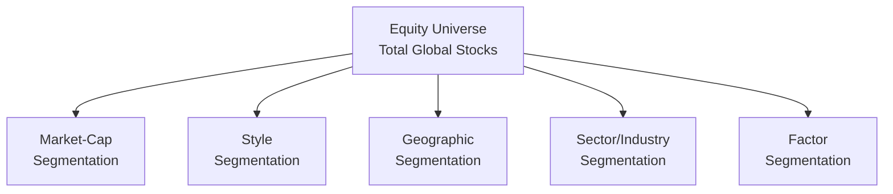

Equity managers, just like the rest of us when faced with too many puzzle pieces, often need a systematic way to break down a massive collection of stocks into more manageable chunks. That’s where the idea of segmenting the equity universe shines. By dividing the broad set of stocks into segments—based on market capitalization, style, geography, sector, or factors—managers can more easily align investment strategies with client objectives. In this article, we’ll explore different segmentation approaches, walk through practical examples, and relate them to real-world experiences in equity portfolio management.

Introduction and Rationale  
Sometimes you’ll hear folks say, “Why bother dividing up the equity market? Just buy the whole thing and be done with it!” But I think it’s important to appreciate that different segments can behave uniquely, especially in various economic environments. Take large-cap mega-tech stocks—they often dominate headlines and drive a good chunk of market returns. Meanwhile, small-caps can be more volatile but sometimes buzz with entrepreneurial energy. Without segmentation, it's easy to lose track of your exposures and inadvertently overweight or underweight important slices of the market.

Market Capitalization Segmentation  
One of the most common approaches is to classify stocks by their market capitalization (or “market cap"). Market cap is, in simple terms, the per-share price multiplied by the number of shares outstanding. The typical segments are:

• Large-Cap  
• Mid-Cap  
• Small-Cap  

(And you may spot “mega-cap” or “micro-cap” in some discussions too.)

Why does this help? Well, large-cap companies are usually well-established, have more analyst coverage, and trade in higher volume. This often means improved liquidity and narrower bid-ask spreads. Meanwhile, small-caps can be more volatile and thinly traded, which might lead to higher transaction costs or more pronounced price swings. But they also can present unique opportunities for those who can handle the extra risk—or at least that’s what many believe.

If we think about Chapter 6 on Trading Costs and Electronic Markets, we see how market cap influences the ease of executing trades. Higher liquidity for large-caps helps reduce spreads, while smaller, more obscure firms may cause bigger transaction costs. So when a client says, “We want a high-growth, small-cap portfolio,” you need to consider not just growth potential but also mitigating liquidity challenges.  

Style-Based Segmentation—Growth, Value, and Core  
Another classic segmentation approach is by investment style. Usually, managers talk about growth, value, or sometimes a “core” or “blend” approach.

• Growth Investing – Focuses on companies expected to grow earnings, revenues, or cash flows above the industry or market average. Valuations might be high, but the thesis is that spectacular future growth will justify the price. This style often looks for intangible factors like brand leadership, superior technology, or disruptive business models.

• Value Investing – A value-oriented manager looks for companies trading below their intrinsic or fair value. They like to spot depressive valuations—stocks battered by the market but that still have solid fundamentals. Ratios like price-to-earnings (P/E) or price-to-book (P/B) matter a lot here.

• Core (or sometimes “Blend”) – A middle-ground approach that tries to combine elements of growth and value, or that invests in broad indices without a strong tilt either way.

That’s fairly straightforward, right? But I recall once analyzing a set of tech stocks that seemed to have astronomical P/E ratios. Were they growth stocks, or simply overpriced? That’s where the complexity comes in: style definitions can be tricky because markets constantly shift, and some “growth” companies might pivot to become stable behemoths or backslide into a value territory. 

Geographic Segmentation  
In a world that’s so interconnected, it’s easy to forget that not all markets move together. Managers often segment the equity universe by geography:

• Domestic vs. International  
• Developed vs. Emerging Markets  
• Region-Specific, such as Asia-Pacific or Latin America  

Currency risk, political risk, cultural considerations, and local economic cycles are just a few factors that can dramatically influence returns outside one’s home market. For instance, say a U.S.-based client invests in emerging markets to capture higher growth. They must accept currency fluctuations, changing regulations, or different disclosure standards. This is a big reason global-minded equity managers pay close attention to research from local analysts, and they may hedge currency exposures if needed.

In Chapter 3 on Asset Allocation to Alternative Investments, we talk about how geographic diversification also applies to real assets and private equity. The same concept holds true: you spread your eggs among different baskets to either capture new opportunities or mitigate concentrated geopolitical risks.

Sector and Industry Segmentation  
Managers also classify equities by their primary business activity: technology, healthcare, financials, energy, and so on. Sectors and industries remind me of the times I’ve seen portfolio managers check if they’re leaning heavily into cyclical industries—those that rise or fall with the broader economy (think materials, consumer discretionary)—versus more defensive sectors like utilities or consumer staples.

Why bother with sector segmentation? Well, it allows you to manage sector overweights or underweights relative to a benchmark. For instance, if you’re using the S&P 500 as a benchmark, you can measure your weighting to technology or healthcare stocks versus that index. If you see a 10% overweight in tech, you might investigate whether that aligns with your macro outlook. Another reason is correlation: certain industries tend to move together—like how energy stocks react to shifting oil prices. By segmenting your portfolio, you can better understand and control your sector exposures.

Factor-Based Segmentation  
The conversation about segmenting by factors has grown in leaps and bounds over the last decade. Factor-based investing systematically targets shared characteristics (or “factors”) that drive stock returns. Common factors include size (small vs. large), value, momentum, quality, low volatility, and more.

• Momentum – Buying stocks that have recently performed well in anticipation the trend will continue.  
• Quality – Focusing on profitability measures or stable earnings.  
• Low Volatility – Seeking stocks that exhibit less price fluctuation over time.  

These systematic approaches have soared in popularity. Sometimes referred to as “smart beta,” factor investing is used to capture specific risk premiums in a transparent, rules-based manner. It can be a cost-effective way to gain targeted exposures if done properly. For example, “Let’s isolate a momentum factor within small-cap stocks,” or “Let’s tilt the portfolio to the low-vol factor across developed markets.” You’d be segmenting your equity universe first by geography, then by size, then layering on a factor tilt. Phew—there’s some segmentation for you!

Below is a simple visual diagram showing how an equity universe might break down into multiple levels:

Of course, in the real world, these segments aren’t always distinct. You can have a small-cap growth stock in an emerging market that also exhibits a strong momentum factor. It can get complicated, but that’s precisely why we break it down.

Integrating Multiple Segmentation Approaches  
Most advisors and portfolio managers use more than one segmentation approach at once. You might start with a broad global equity universe, subdivide it by region, and then further subdivide by style or by factor. Or, you might pick a set of comparable large-cap, value-oriented stocks across regions—and that’s your investable pool. The important thing is to make sure each step aligns with the client’s risk tolerance, time horizon, and financial goals.  

On the client side, some folks want a strictly domestic focus because they’re comfortable with what they know. Others want global diversification. Another might be convinced that small-cap growth is “the next big thing.” The job of the manager is to systematically parse through these demands and ensure the client’s objectives are always front-and-center, while also adhering to constraints like liquidity, risk guidelines (which might be spelled out in an Investment Policy Statement), and so on.

Challenges and Common Pitfalls  
Let’s be frank—segmenting the equity universe is part science, part art. Here are a few challenges that I’ve seen managers face:

• Shifting Boundaries. Stocks move from small-cap to mid-cap or from growth to value over time. This can cause style drift in the portfolio.  
• Over-Segmentation. Too many sub-categories can create complexity and drive up transaction costs, especially if the manager tries to maintain precise exposures in each little bucket.  
• Factor Overcrowding. Some factors (like momentum) can become overcrowded if lots of investors chase them, potentially wiping out factor advantages.  
• Benchmark Limitations. Benchmarks might not perfectly reflect your actual investable universe, leading to confusion about how to measure performance.  

Staying flexible yet systematic can help avoid these pitfalls. The best managers I know have a well-defined process for reclassifying stocks or rebalancing exposures and stick to it.  

Practical Example  
Imagine a portfolio manager for a balanced fund, who decides that, for the equity portion, she wants exposure to U.S. large-cap value, EAFE (Europe, Australasia, Far East) core, and emerging market growth. Each of these segments focuses on different risk-return characteristics, liquidity expectations, and fundamental drivers:

• U.S. Large-Cap Value – Tends to be well-established firms, often with stable dividends, that the manager believes are trading below fair value. Trading liquidity is typically excellent, which is great for rebalancing.  
• EAFE Core – Provides diversification, but be prepared for currency risk. She might decide to hedge (or not) based on the fund’s policy.  
• Emerging Market Growth – Targets an area of potentially higher return but higher volatility. Also watch out for liquidity constraints and regulatory differences.  

By combining these segments, she can construct an overall equity strategy that might fit the risk tolerance of a balanced fund. She also reduces concentration risk in any single geography or style.  

Best Practices  
• Align segmentation with investment objectives. If your client wants yield, perhaps consider large-cap dividend payers from stable sectors.  
• Revisit segmentation as the market evolves. Something might start as small-cap growth but soon become mid-cap if it booms, so ensure you’re reviewing classification thresholds.  
• Keep an eye on correlation. If your objective is diversification, choose segments that don’t move in perfect lockstep.  
• Manage expenses and transaction costs carefully. Overly narrow segmentation can lead to frequent rebalancing.  

It’s easy to get caught up in the excitement of slicing and dicing the market in novel ways, but the end goal is to achieve the right balance of risk and return for the client.

Exam Tips for Level III Candidates  
In the context of the CFA® exam, you can bet that scenario-based questions will test your ability to identify and apply the appropriate segmentation strategy. You might be given a portfolio scenario where a manager’s style tilt doesn’t match the client’s preference, or a question about how to classify new stocks creeping from mid-cap to large-cap territory. Be prepared to:

• Explain the rationale behind each segmentation method.  
• Show how you’d communicate the benefits and risks to clients.  
• Demonstrate how factor-based segmentation can be integrated with style or market-cap approaches.  
• Identify potential mismatches with the client’s IPS or benchmark.  

Remember to frame your answers around the client’s willingness and ability to take on risk, as well as any constraints like liquidity or time horizon. Also, watch out for subtle terminology differences: “growth” doesn’t always equal “high P/E.” There might be deeper fundamental metrics the exam question wants you to highlight.

References  
• CFA Institute. (n.d.). Equity Investments. Candidate Readings.  
• Fabozzi, F., & Markowitz, H. (2002). The Theory and Practice of Investment Management. Wiley.  
• MSCI Indexes: https://www.msci.com/indexes  

Test Your Knowledge: Equity Segmentation for Portfolio Managers



### A portfolio manager planning to build a small-cap fund should prioritize which factor in her segmentation choice?

- [ ] Projected future dividends
- [x] Market liquidity for small-cap issues
- [ ] Avoiding any factor-based strategies
- [ ] Discounted cash flow modeling

> **Explanation:** Small-cap portfolios are commonly subject to liquidity constraints, so prioritizing how easily (or not) these stocks can be traded is crucial.

### Which style-based segment typically involves picking stocks trading at prices below their perceived intrinsic value?

- [ ] Growth
- [ ] Core
- [x] Value
- [ ] Momentum

> **Explanation:** Value investing centers on buying undervalued securities based on measures like P/E or P/B, aiming for potential long-term correction in price.

### If a manager is concerned about currency risk in international equities, which approach might offer the most straightforward mitigation?

- [ ] Using pure factor-based strategies
- [ ] Avoiding investment in foreign stocks altogether
- [x] Employing currency-hedged international equity segments
- [ ] Switching primarily to small-cap domestic stocks

> **Explanation:** Currency-hedged international equity segments can neutralize some foreign exchange risk, ensuring returns are more directly tied to the performance of the underlying equities.

### A fund invests in technology, healthcare, financials, and utilities, aiming to manage over- or underweights relative to a benchmark for each. This is an example of:

- [x] Sector/Industry segmentation
- [ ] Style-based segmentation
- [ ] Geographic segmentation
- [ ] Market cap segmentation

> **Explanation:** The fund focuses on sector/industry categories, adjusting the weights to manage risk and potential excess return against a benchmark.

### Which of the following is a potential drawback of overly narrow segmentation in an equity portfolio?

- [x] Increased rebalancing costs
- [ ] Better alignment with the benchmark
- [ ] Reduced tracking error
- [ ] Simplified regulatory reporting

> **Explanation:** Too many narrow segments create complexity and can lead to frequent rebalancing, raising transaction costs.

### When a stock transitions from small-cap to mid-cap status, failing to reclassify it hampers which of the following?

- [x] Accurate style or size classification
- [ ] Dividend reinvestment
- [ ] The ability to measure GDP growth
- [ ] Static bond durations in liability-driven strategies

> **Explanation:** Classification updates are necessary to maintain an accurate reflection of the stock’s market cap segment, ensuring the portfolio’s intended allocations remain correct.

### Factor-based segmentation that targets low-volatility equities is primarily seeking to:

- [x] Capture reduced risk exposures
- [ ] Maximize short-term returns
- [x] Provide more stable return streams over time
- [ ] Exploit currency anomalies

> **Explanation:** Low-volatility strategies focus on minimizing the magnitude of price fluctuations, aiming for more stable and predictable returns. They may not necessarily maximize short-term gains.

### Which best describes the notion of “style drift” in an equity portfolio?

- [ ] A stock that is sold too soon
- [x] A portfolio’s style classification shifting over time as stocks evolve
- [ ] Manager imitation of other funds’ strategies
- [ ] Excess correlation with bond markets

> **Explanation:** Style drift occurs when a portfolio’s characteristics shift away from the original style classification (e.g., drifting from growth to blend), which can lead to unintended exposures.

### When combining geographic segmentation with style segmentation, a manager would have to consider:

- [x] Both local economic factors and the fundamental style of companies
- [ ] Only the local economic factors
- [ ] Dividing stocks strictly by dividend yields
- [ ] Ignoring all market cap considerations

> **Explanation:** Combining geographic segmentation with style requires understanding how local economic conditions and the company’s growth or value tilt interact in the market.

### True or False: Sector/industry segmentation ensures that currency risk is completely eliminated from the portfolio.

- [x] False
- [ ] True

> **Explanation:** Sector/industry segmentation alone does not address currency risk; it only categorizes stocks by their primary business. Currency risk arises from investing in foreign-denominated securities and must be managed separately.


