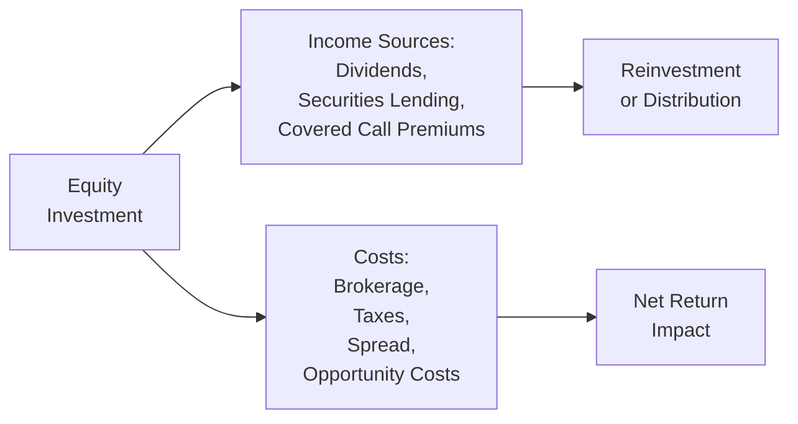

## Introduction

Picture this: You’re sipping coffee on a Monday morning (perhaps a bit too early) and you open your trading dashboard. You watch the prices flicker green and red. Equities are that crucial, “fun” part of a portfolio where investors often expect the lion’s share of growth. But, as many have learned the hard way, investing in stocks isn’t just about watching the index climb. There are all sorts of income streams—dividends, securities lending revenue, options premiums—and, for better or worse, there are also plenty of costs: brokerage fees, taxes, custody fees, and a bunch of others that sometimes sneak up on you. Ignoring these can erode an otherwise healthy return, so it’s important to understand how each component affects your portfolio’s bottom line.

Below, we’ll walk through the sources of income and the primary costs associated with managing an equity portfolio. We’ll consider how taxation and administrative factors shift the net returns, why market microstructure matters, and why decisions about active trading need to be weighed carefully against their incremental expenses and tax consequences. This discussion complements Sections 1.1 and 1.2 of this volume, which cover how equities fit into the overall asset allocation and how an equity manager’s investment universe is segmented.

## Income Sources in Equity Portfolios

When we think about generating returns from equities, capital gains jump to mind. But capital appreciation isn’t the only source of income. For many professional and individual investors, income generation can be just as important, especially if they rely on periodic cash flows or if they reinvest that income for compound growth.

### Dividends
Dividends might be the most straightforward source of income. Companies that generate profits may choose to distribute a portion of these earnings as dividends to shareholders. Some investors hold dividend-paying stocks to meet short-term cash flow needs, while others reinvest dividends to bolster long-term growth (a practice often referred to as dividend reinvestment plans, or DRIPs). 

Dividends vary significantly by company and sector. Utilities, consumer staples, and financials are often stable dividend payers. Newly minted tech companies may prefer reinvesting in R&D rather than paying dividends. Either way, keep an eye on the dividend yield relative to market conditions, and remember that dividends can be cut without warning if a firm faces financial stress.

### Securities Lending Income
A second income source—sometimes overlooked by smaller or less experienced investors—is securities lending. If a portfolio holds shares that are in demand by short sellers or market makers, those shares can be lent out in exchange for a fee. For large institutional managers or even well-capitalized retail investors working with specialized brokerage accounts, securities lending can produce a nice incremental revenue stream. The arrangement usually involves collateral posted by the borrower. However, this is not a risk-free proposition. While the collateral is intended to safeguard the lender, there are counterparty and operational risks to manage. 

### Covered Call Premiums
Selling covered calls is a strategy that mixes income generation with partial upside sacrifice. Here’s the gist: you already hold a stock, so you sell (write) a call option on that same stock. You collect an upfront premium from the buyer. If the stock price remains below the option’s strike price at expiration, you keep the premium and your shares. If the stock price goes above the strike, the buyer exercises their right to purchase those shares at the strike price, and you forgo any additional upside beyond that. Some portfolio managers use this to generate consistent income while accepting that they cap their stock’s near-term upside.

## Examining Explicit Costs

Explicit costs are the ones you see in black-and-white on statements or invoices. They’re often meticulously reported (thanks to regulation and standard brokerage reporting).

### Brokerage Commissions
Every time you buy or sell shares, your broker charges a commission or a fee. For active traders and large institutional accounts, these fees add up quickly. Over time, technology has driven down commissions in many markets. For instance, some jurisdictions now commonly offer “zero-commission” trades to retail customers, but watch out: the cost might be hidden somewhere else (e.g., wider spreads, payment for order flow). Professional managers track commission costs carefully because a lot of studies have shown that frequent trading can seriously dent returns.

### Management Fees
Portfolio managers, whether active mutual funds or separately managed accounts, typically assess annual fees that may range anywhere from a fraction of a percent to more than 2%, depending on the strategy. Naturally, if we’re talking hedge funds, performance-based fees can take a sizable chunk of profits. The general principle is: the more specialized or niche the strategy, the higher the fees, though competition in the market is shifting this dynamic. Investors should compare these fees to the expected outperformance. In other words, ask: does the manager’s skill likely justify the additional expense?

### Exchange Fees
You’ll also encounter exchange fees, though these are usually quite small on a per-trade basis and often get lumped in with other transaction items. Still, institutions can see this cost build quickly if trading volumes are high.

## Understanding Implicit Costs

Implicit costs, quite simply, are those that are not clearly displayed on a line item invoice. They might still be huge, especially for larger trades.

### Bid-Ask Spreads
The bid-ask spread is effectively the difference between what buyers are willing to pay and what sellers are asking. If you buy a stock at the ask price, you lose out on the spread relative to the bid. This phenomenon is well-covered in Chapter 6 of this curriculum (particularly Section 6.1 on transaction costs). For actively traded stocks, the spreads might be tight (just a few pennies). For more illiquid or smaller-cap stocks, the spreads can be wide enough to matter a lot in your return calculations.

### Market Impact
Market impact is the price movement caused by your trade. If you start buying up shares of a relatively illiquid stock, you might drive the price higher, forcing you to pay more for subsequent shares. Similarly, if you unload a big block position, the price might fall. Large institutional investors have to be extra cautious here and use specialized trading algorithms or “work” their trades over time to reduce market impact. The trade-off? Potentially higher opportunity cost if the stock’s price moves away from them due to other market forces.

### Opportunity Costs
Sometimes the best trade is the one you don’t make, and sometimes it’s the one you miss out on. Opportunity cost in equity portfolio management refers to the gains you forego when you can’t execute a trade quickly enough or at the desired price. It’s frequently lumped in with implementation shortfall calculations (discussed in Section 6.3). In simpler terms, if you decide you want a certain stock at $50 but the price is up to $52 by the time you get your trade in, that difference can weigh on your performance.

## Factoring in Taxes

Taxes are like gravity—always pulling at your returns. Yet the extent of that pull depends heavily on your jurisdiction and personal situation.

### Dividend Taxes
Some regions grant favorable dividend tax rates, especially for “qualified” dividends. Other regions treat dividends as ordinary income. This difference can be substantial for high-net-worth individuals in higher tax brackets. Because these taxes directly reduce the net yield, tax-sensitive investors often prefer tax-advantaged accounts or strategies to minimize the burden.

### Capital Gains Taxes
Short-term capital gains (on positions held under a certain threshold, often a year) can be taxed more heavily than long-term gains. This structure encourages longer holding periods, especially in reference to broad-based equities. But there are exceptions. In some tax regimes, capital gains might be indexed to inflation or might not exist at all. Understanding these variations is key for both private wealth managers (Chapter 4) and institutions (Chapter 5).

### Transaction Taxes
Some countries even impose transaction taxes or stamp duties on each purchase or sale (looking at you, certain European and Asian markets). These can be small, but again, frequent traders or large block trades can see an outsized hit.

## Custody and Administration Costs

Don’t forget to keep your house in order—literally. Custody fees reflect the costs of having a financial entity safeguard your shares, maintain records, and handle corporate actions. For an individual investor, these might be rolled into the overall brokerage fees. For an institutional pension manager or a mutual fund, custody fees can be a more specific line item. Meanwhile, administrative costs can include everything from performance measurement systems to compliance oversight and audit fees.

Though these costs might seem minor, they can add up, particularly when funds or family offices manage large or highly diversified portfolios. “Jumping ship” to a custodian with lower fees might save basis points that compound over time.

## The Power of Compounding Effects

All these income sources and costs swirl together to form the net return on an equity portfolio. If you manage to:
1) reinvest dividends (or covered call premiums),  
2) keep transaction costs low,  
3) optimize the timing of trades to manage tax liabilities,  
4) maintain competitive custody or management fees,  

…well, you can significantly boost your ending wealth after years of compounding. It’s basically the difference between a portfolio that grows at, say, 6.8% annual returns net of all fees and taxes versus one that compounds at 7.3%. That might not sound like a big gap—until you see the end balance 20 years later. 

Sometimes managers get enamored with exotic alpha strategies, but as they say in personal finance: “It’s not so much what you earn, it’s what you get to keep.” Minimizing costs while capturing decent, consistent growth is often the real game-changer. 

Here’s a simple net return equation in KaTeX form:

$$
\text{Net Portfolio Return} = (\text{Gross Return} + \text{Income Sources}) - (\text{Explicit Costs} + \text{Implicit Costs} + \text{Taxes} + \text{Administration Costs})
$$

Even a small difference in the net return can have a huge effect over the long haul.

## Cost-Benefit Trade-Off in Active Trading

As covered in Section 1.5 of this volume (“Rationales for Active vs. Passive Equity Management”), deciding whether to pursue a more active equity strategy often comes down to a cost-benefit analysis. Active managers believe they can exploit mispriced securities or short-term market inefficiencies. However, these strategies typically incur higher transaction costs and can trigger additional capital gains taxes. In short, your trades must generate enough incremental alpha to cover these extra expenses. 

Many managers approach this question by analyzing historical alpha performance relative to frictional trading costs. If your data suggests (in good faith) that you can consistently outpace fees and taxes, active management might be justified. If not, a passive or factor-tilted approach might yield better risk-adjusted, post-tax returns.

## A Visual Overview

Below is a simple Mermaid diagram illustrating how different sources of income and costs flow into net portfolio returns for equity investments:

## Best Practices, Common Pitfalls, and Strategies

• Keep track of your total cost picture: You might see “zero commission,” but remember to check other fees or potential hidden spreads.  
• Review your tax position annually: For both individuals and institutions, tax laws change, new allowances emerge, and your overall stance on realized gains might shift.  
• Rebalance strategically: Sometimes it’s better to wait for a tax-friendly window to rebalance, especially if short-term capital gains apply.  
• Monitor liquidity: Large trades can create significant slippage, especially in less-liquid markets. And watch out for margin calls or securities lending recalls if markets turn volatile.  
• Evaluate cost per strategy: If you employ an options-based covered call approach, be sure the premium income justifies the opportunity cost of losing upside.

## Glossary

• Securities Lending: The practice of lending shares to short sellers or market participants for a fee, requiring collateral from the borrower.  
• Market Impact: A measurable price movement that occurs as a direct consequence of buying or selling shares.  
• Bid-Ask Spread: The price gap between the highest bid (buy) and lowest ask (sell) orders in the market.  
• Covered Call: An options strategy where a call is written (sold) on a stock already owned to generate premium income.  
• Custodial Services: Administrative services that safeguard investor assets, process dividends and corporate actions, and maintain accurate records.

## References and Further Reading

• CFA Institute. (n.d.). Wealth Management Publications.  
• Harris, L. (2003). Trading and Exchanges: Market Microstructure for Practitioners. Oxford University Press.  
• Morningstar Research. (n.d.). Guides on Fees and Expenses. [Link](https://www.morningstar.com)

## Final Exam Tips

1. Focus on calculations that integrate both explicit and implicit costs. The CFA Level III exam may incorporate item sets where you’re required to compute the net benefit of a trade after factoring in slippage, commissions, and taxes.  
2. Practice scenario-based questions. For instance, how does a manager’s decision to sell a position near year-end affect short-term versus long-term capital gains?  
3. Understand transaction cost analysis measures (e.g., implementation shortfall, VWAP) from Chapter 6. They often pair well with the “Costs in Equity Portfolio Management” topic for exam items.  
4. Be prepared to defend or refute the use of an active strategy on a cost-benefit basis, referencing alpha potential and transaction overhead.  
5. Keep an eye on detail: small differences can add up to big results in the essay portion of the exam.

## Test Your Knowledge of Equity Income and Cost Management



### Which of the following is an explicit cost in equity portfolio management?

- [x] Management fees
- [ ] Bid-ask spreads
- [ ] Market impact
- [ ] Opportunity costs

> **Explanation:** Management fees appear clearly on invoices/statements, thus qualifying as an explicit cost. Bid-ask spreads, market impact, and opportunity costs are not directly billed.

### Which of the following best describes a covered call?

- [ ] An investor sells put options to collect premium
- [x] An investor already owns shares and sells call options to earn premium
- [ ] An investor borrows shares to short them for a profit
- [ ] An investor buys a call option and immediately exercises it

> **Explanation:** A covered call is when you own the underlying shares and write (sell) a call option on those shares in exchange for premium income.

### In high-frequency trading, which implicit cost tends to stand out the most?

- [ ] Brokerage commissions
- [x] Bid-ask spreads
- [ ] Management fees
- [ ] Exchange fees

> **Explanation:** High-frequency traders exploit very small price differentials, so even small bid-ask spreads can significantly impact their performance.

### You expect to generate additional revenue by lending out your shares. What is this strategy called?

- [ ] Short selling
- [ ] Margin lending
- [x] Securities lending
- [ ] Cash collateralization

> **Explanation:** Securities lending refers to loaning out shares to another party, typically to short sellers or for other liquidity needs, in exchange for a fee or collateral.

### Which cost is typically categorized as an implicit cost?

- [x] Market impact
- [ ] Exchange fee
- [ ] Advisor management fee
- [ ] Custody fee

> **Explanation:** Market impact is not line-item billed; it’s reflected in price movements due to trade execution, making it an implicit cost.

### If a portfolio manager frequently buys and sells equities within a short time frame, what tax concern is most relevant?

- [x] Short-term capital gains taxes
- [ ] Long-term capital gains taxes
- [ ] Dividend tax withholding
- [ ] Estate taxes

> **Explanation:** Frequent buying and selling usually triggers short-term capital gains taxes if the holding period (often one year in many jurisdictions) is not satisfied.

### What is the potential downside of a covered call strategy if the stock’s price rises sharply?

- [ ] You pay taxes at a higher rate on dividends
- [ ] You lose the shares entirely with no compensation
- [x] You forgo gains above the call’s strike price
- [ ] You do not receive premium income

> **Explanation:** With a covered call, if the stock price exceeds the strike price, you “lose” that extra upside because your shares may be called away at the strike.

### Which of the following fees is likely to increase as the portfolio experiences more trading volume?

- [ ] Management fee
- [x] Brokerage commission costs
- [ ] Custody fees
- [ ] Dividends paid

> **Explanation:** Brokerage commissions (explicit costs) generally increase directly with the amount of trading.

### Which statement is true concerning custodial services?

- [ ] They are optional for institutional portfolios
- [x] They provide record-keeping and safekeeping of securities
- [ ] They only apply to assets held in tax-advantaged accounts 
- [ ] They eliminate all trading fees

> **Explanation:** Custodial services hold and record securities on behalf of investors. They are typically required for institutional portfolios to ensure safe and accurate record-keeping.

### Is the following statement True or False?  
“Minimizing small cost differences (like custody fees or small additional taxes) rarely has a significant effect on long-term compounding.”

- [ ] True
- [x] False

> **Explanation:** Even small fee differentials compound over time and can significantly affect the terminal value of a portfolio.


