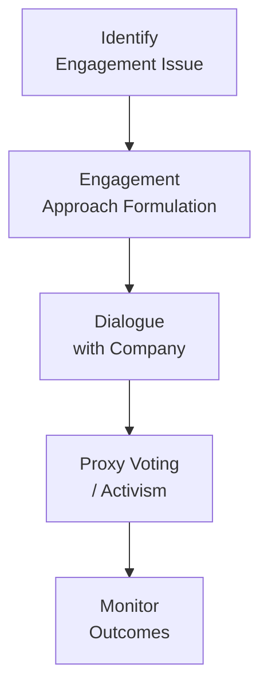

## Introduction

Most of us have heard stories of people who buy a couple of shares in a big-name company, then show up at the annual meeting just to catch a glimpse of the CEO or snag some free coffee. But investing can involve more than just showing up. When investors hold larger stakes—like institutional investors or dedicated equity managers—they can actually use their positions to create positive changes within the companies they own. This is the essence of shareholder engagement. Think of it as having a seat at the table, with a chance to talk to executives about everything from board structures to sustainability practices. Sound interesting? Let’s explore what shareholder engagement really means, how you can do it in a meaningful way, and what role the equity manager plays in this important process.

## What Is Shareholder Engagement?

Shareholder engagement involves proactive communication and dialogue between the equity manager (acting on behalf of clients) and the company’s leadership. As an equity manager, you’re not just a passively invested bystander; rather, you’re in a position to influence decisions that can boost corporate value, enhance accountability, or even prompt leadership changes if necessary.

Sometimes, this engagement might be as simple as voting proxies in alignment with the investment strategy outlined in Section 1.3 (Income and Costs in Equity Portfolio Management) or discussing executive compensation structures. Other times, it might involve more formal activism, such as pushing the company to spin off a division or restructure its board.

### Why Engage at All?

• Alignment of Interests. By actively engaging, managers encourage companies to focus on long-term success instead of short-term profit.  
• Risk Mitigation. Engagement can identify red flags—like high leverage or poor oversight—and prompt corrective steps before problems escalate.  
• Value Creation. Good corporate governance often translates into stronger financial performance, especially when combined with effective ESG initiatives (see Section 1.7, ESG Integration in Equity Portfolios).

## A Quick Anecdote

I once had the chance to observe an annual general meeting (AGM) for a large technology firm. One set of investors believed the company’s board was underqualified, especially regarding cybersecurity experience—well, that’s not something you want to undermine in a tech company. Over several months, these shareholders voiced their concerns in direct talks with management. Eventually, the company brought on two new board members with deep cybersecurity backgrounds. That’s a neat example of shareholders stepping in and making a difference not just for the company’s sake, but for everyone’s.  

## Key Elements: Stewardship, Governance, and Proxy Voting

### Stewardship

Stewardship means taking care of your clients’ capital in a responsible and forward-looking manner. An engaged equity manager sees stewardship as a core function—actively working to ensure that portfolio companies are being managed in the right way, for the right reasons.

### Corporate Governance

Corporate governance refers to the system of rules, practices, and processes by which a company is directed and controlled. Effective governance includes:

• A well-structured board that provides knowledgeable oversight.  
• Transparent policies on executive compensation.  
• Ethical and sustainable business practices.  

When governance is strong, companies typically make better strategic decisions, handle crises more effectively, and sustain long-term profitability.

### Proxy Voting

Proxy voting is a fundamental tool for shareholder engagement. Managers use proxy votes to elect board members, approve or reject executive compensation packages, and support or oppose shareholder proposals. Think of it as casting ballots on major corporate matters. Deciding how to vote often involves analyzing company disclosures (like annual reports or sustainability statements) and aligning that vote with client objectives. For instance, if your clients prioritize responsible environmental policies, you might vote for a measure that demands more transparent carbon disclosure.

## The Role of an Equity Manager

Let’s zero in on how an equity manager fits into all this. True engagement requires several steps:

1. Setting an Engagement Strategy. Before even analyzing companies, a manager should clarify how actively they plan to engage. Will they simply rely on proxy voting guidelines developed by third parties such as ISS (Institutional Shareholder Services)? Or will they adopt a more hands-on approach—meeting with boards, submitting proposals, and so on?

2. Analysis and Monitoring. An equity manager must stay informed about the firm’s financial health, corporate governance structures, strategic plans, and ethical standards. This monitoring might involve reading financial statements, scouring sustainability reports, or keeping an eye on news about potential controversies.

3. Communication with Management. Engagement might involve private meetings, conference calls, or letter-writing campaigns. During these interactions, managers aim for a constructive tone, seeking to understand management’s perspective and offer insight or criticism where needed.

4. Proxy Voting and Advocacy. Voting shares in alignment with client interests is a duty that cannot be overlooked. When issues are particularly significant, the manager might advocate publicly or encourage other shareholders to support a particular cause.

5. Ongoing Review. After any engagement effort—be it a single meeting or a multi-year activism campaign—managers review the results and refine their strategy for future engagements.

Below is a simple diagram illustrating the engagement cycle:

## Shareholder Activism: Constructive vs. Hostile

Shareholder activism is a more intense form of engagement. Activist investors often take large equity positions and then push for drastic changes. Sometimes, these changes can be constructive, like calling for new board talent that introduces fresh ideas or urging the sale of an underperforming division. Other times, the approach can be categorized as hostile, with activists publicly criticizing management and threatening proxy fights, or even lawsuits, if demands aren’t met.

### Constructive Activism

• More Collaborative  
• Emphasis on Long-Term Growth  
• Often negotiates behind the scenes  

### Hostile Activism

• Confrontational  
• Public Criticisms of Management  
• May involve proxy fights or attempts to fire top executives  

Managers should recognize that activism, when thoughtfully executed, often leads to improved governance and strategic renewal. However, if it’s purely confrontational, it may damage relationships and even harm the company’s reputation or short-term market sentiment.

## Regulatory Framework and Regional Differences

Regulations on shareholder engagement differ across regions:

• In the U.S., the Securities and Exchange Commission (SEC) sets guidelines on proxy disclosures, activist campaigns, and large shareholder reporting (e.g., Section 13D filings for owners of 5% or more).  
• In Europe, the Shareholder Rights Directive encourages more active engagement and greater transparency regarding voting policies.  
• In Asia, local regulations might emphasize different aspects, such as controlling foreign shareholder influence.  

Equity managers need to be aware of these nuances. Sometimes, an investor with global portfolios must adopt different engagement strategies in different markets. For instance, direct activism might be more common in the U.S., while behind-the-scenes engagement could be more common in Japan due to cultural norms.

## ESG: A Driving Force in Modern Engagement

Environmental, social, and governance (ESG) factors have become a key area of focus for many investors. In fact, Section 1.7 “ESG Integration in Equity Portfolios” outlines how these factors are increasingly integrated into the investment process. Shareholder engagement is a tool to press companies on ESG performance, from carbon emissions to labor practices.

• Climate Change and Environmental Disclosures. Investors are asking companies to measure and disclose greenhouse gas emissions, set net-zero targets, or detail action plans to mitigate climate risks.  
• Social Issues. This may involve diversity and inclusion at all levels, supply chain ethics, or data privacy concerns.  
• Governance Revisited. ESG factors circle right back to governance. Effective boards are typically more willing to address social and environmental issues in a transparent manner.

## Possible Impact of Engagement on Performance

Will working with management actually boost returns for investors? Well, let’s say it definitely can. Research suggests that constructive engagement on governance or strategy can lead to lower risk profiles and potentially enhance returns. Though nothing is guaranteed, better-run companies typically have fewer scandals, adapt more smoothly to market changes, and use resources more effectively.

In some cases, engaged shareholders also help reduce the misalignment of incentives. For instance, if management is chasing short-term quarterly results by cutting beneficial long-term investments, active shareholders can put the brakes on those short-sighted decisions.

## The Resource Requirements and Challenges

Engagement, especially the more direct and hands-on type, can be time-intensive. It requires:

• Skilled Staff: Specialists in corporate governance or specific sectors (e.g., technology or energy) to analyze company materials thoroughly.  
• Time and Coordination: Continuous dialogue with management, checking proxy proposals, reading through legal documents, and coordinating with other institutional investors.  
• Potential Costs: Legal fees, proxy solicitation costs, and staff hours.

Some managers choose to outsource aspects of engagement—particularly proxy voting analytics—to third-party providers. However, that can introduce a layer of distance between the investor and the company. Ultimately, a manager must decide how much time and energy to devote to direct engagement based on strategy and client preferences.

## Potential Pitfalls

• Overreach: Sometimes, engagement can pressure management toward actions that might not be in the company’s best long-term interest.  
• Conflicts of Interest: If certain stakeholders have competing interests, an activist strategy might benefit one group over others.  
• Reputation Risk: Publicly criticizing management or forcing abrupt changes can harm relationships with corporate leadership and dampen future collaborations.  
• Regulatory Missteps: Non-compliance with regional disclosure rules can lead to fines and negative publicity.

## Best Practices for Effective Engagement

1. Know Your Goals: Clarify whether you’re aiming for improved ESG reporting, changes in executive compensation, new board appointments, or something else.  
2. Collaborate Where Feasible: Engage with the company privately and collaboratively. Formal steps such as proxy fights should be a last resort.  
3. Maintain Transparency with Clients: Let your investors know how you intend to vote on proxies and why.  
4. Respect Local Norms and Laws: Engagement looks different across regions—learn each jurisdiction’s framework.  
5. Measure and Report Outcomes: Track how engagements affect both the company’s governance practices and overall portfolio performance.

## Exam Tips and Strategies

In the CFA Level III exam, especially in constructed-response or item-set questions, you may be asked to:

• Explain how engagement can align corporate behavior with investor objectives, referencing examples of board structure or sustainability improvements.  
• Identify the steps an equity manager should undertake to implement a successful engagement strategy.  
• Assess the trade-offs and potential challenges of activism versus more collaborative engagement.  
• Integrate ESG concerns into an engagement scenario, possibly linking to other sections like 1.7 “ESG Integration in Equity Portfolios” or discussing the unique constraints of tax-exempt funds from Chapter 2.6.  
• Evaluate a scenario in which an institutional investor must decide whether to launch a proxy fight or negotiate behind the scenes.  

Be sure to outline both pros and cons when discussing activism. Pay attention to potential pitfalls such as reputational damage and excessive resource consumption. Practice writing concise, structured answers that incorporate practical examples—examiners often seek clarity and real-world application of theoretical concepts.

## References and Further Reading

• CFA Institute. (n.d.). Global ESG Disclosure Standards for Investment Products.  
• Eccles, R. G., Ioannou, I., & Serafeim, G. (2014). The Impact of Corporate Sustainability on Organizational Processes and Performance. Management Science.  
• ISS (Institutional Shareholder Services) Proxy Voting Guidelines: https://www.issgovernance.com/policy  

## Test Your Knowledge: Shareholder Engagement and Equity Manager’s Role



### Which of the following best describes shareholder engagement?

- [ ] A short-term trading strategy in which shareholders rapidly buy and sell shares for profit.
- [x] A proactive dialogue between equity managers and company management to encourage long-term value creation.
- [ ] A government-imposed regulation requiring weekly meetings between shareholders and the board.
- [ ] A broker-driven approach to executing trades at the lowest possible cost.

> **Explanation:** Shareholder engagement emphasizes open communication between shareholders and corporate leadership, focusing on aligned objectives, corporate governance, and risk management over the long term.

### Which tool commonly used by equity managers is a direct means of influencing corporate governance?

- [ ] Day trading.
- [ ] Portfolio rebalancing.
- [ ] Dividend reinvestment plans.
- [x] Proxy voting.

> **Explanation:** Proxy voting grants shareholders the right to vote on critical corporate issues like board appointments and executive compensation, making it a direct channel of influence.

### Which outcome might constructive shareholder engagement produce?

- [x] Enhancement of company performance and improved ESG disclosures.
- [ ] Imposition of unnecessary external regulations on the firm.
- [ ] Rapid liquidation of all shares in protest.
- [ ] Abandonment of long-term strategic planning.

> **Explanation:** Constructive engagement can strengthen governance and transparency, leading to potential performance benefits. It encourages dialogue rather than punitive actions or abrupt share disposals.

### In a hostile activist campaign, which of the following approaches is more likely?

- [ ] Collaborative discussions with company management behind closed doors.
- [ ] Support for current board structure.
- [ ] Quiet negotiation focused on incremental changes.
- [x] Public confrontation and proxy fights to unseat board members.

> **Explanation:** Hostile campaigns tend to be confrontational and may involve public actions such as proxy battles to force changes in leadership or strategy.

### What is a key challenge in shareholder engagement for equity managers?

- [x] Engagement can be time-consuming and demands specialized expertise in governance.
- [ ] It always leads to negative publicity and lower stock returns.
- [ ] It automatically eliminates conflicts of interest between managers and investors.
- [ ] It is prohibited under most regional regulatory frameworks.

> **Explanation:** Engagement requires dedicated resources—both time and skilled personnel. Contrary to the incorrect options, it’s not illegal generally, nor does it always lead to negative publicity. Conflicts of interest remain a possibility if not managed properly.

### An equity manager wanting to emphasize environmental considerations in shareholder engagement might:

- [ ] Demand that the company delist its shares from public markets immediately.
- [ ] Stop all ESG-related conversations and focus on short-term returns.
- [ ] Encourage management to use cheaper materials regardless of emissions.
- [x] Advocate for stronger oversight of greenhouse gas emissions and transparent sustainability reporting.

> **Explanation:** Investors focused on ESG factors commonly urge increased disclosure of environmental practices and improvement in sustainability performance.

### Which of the following is a common regulatory requirement for large shareholders in the U.S.?

- [ ] Filing a Section 13D disclosure when ownership meets or exceeds 5%.
- [ ] Reporting to the Federal Reserve each time the proxy is voted.
- [ ] Eliminating all board members before acquiring more shares.
- [ ] Keeping share ownership entirely anonymous for compliance reasons.

> **Explanation:** Under U.S. law, acquiring 5% or more of a company’s shares generally triggers a requirement to file Schedule 13D with the SEC, disclosing the intent behind the acquisition.

### How can an equity manager measure the effectiveness of an engagement strategy?

- [x] By tracking changes in board composition, executive compensation trends, and relevant financial metrics.
- [ ] By reducing the number of investor meetings and limiting management contact.
- [ ] By disclosing only positive outcomes to investors.
- [ ] By using fixed pre-determined metrics without flexibility.

> **Explanation:** Continuous monitoring of company changes—such as governance structures and financial performance—allows managers to see how effective their engagement approach has been.

### Which of the following statements about activism is accurate?

- [ ] Activism cannot lead to positive results for the target company.
- [ ] Constructive activism always aims to publicly embarrass management teams.
- [x] Activism can be either constructive (collaborative) or hostile (confrontational).
- [ ] Hostile activism is illegal in most major markets.

> **Explanation:** Activism falls into two broad styles—collaborative approaches that foster dialogue and hostile approaches that use public pressure or aggression to effect change.

### True or False: Shareholder engagement is exclusively about short-term profit maximization.

- [ ] True
- [x] False

> **Explanation:** Shareholder engagement generally focuses on long-term value creation, sustainability, and risk reduction rather than immediate, short-lived gains.


