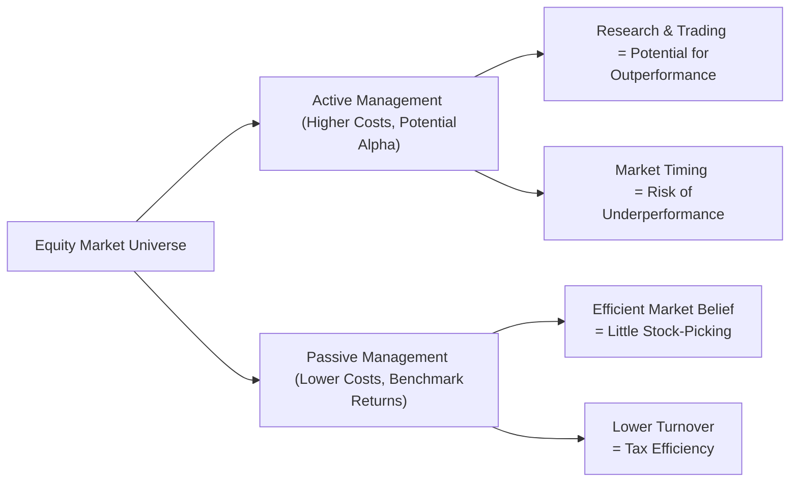

## Introduction
So, perhaps you’ve heard friends or colleagues debate: “Active investing is the surest way to beat the market!” versus “Nah, you can’t beat the market, so just buy an index fund!” If you’re like me, you might have been a little confused at first—why do some people spend so much time researching individual companies, while others are perfectly happy mimicking an index? In this section, we’ll walk through both the theory and the very real practical considerations that push investors toward either active or passive equity management (or sometimes a combination of both).

Active equity management means a manager is aiming to beat a stated benchmark (often an equity index) by picking the “right” stocks at the “right” time. Passive equity management attempts to mirror a benchmark’s performance by holding (approximately) the same positions as the underlying index. You’ll see each approach used widely in the industry, but the decision often depends on your view of market efficiency, your investment objectives, fee tolerance, and, well, even your investor temperament.

## The Case for Active Equity Management
Active managers strive for alpha—excess returns above a chosen benchmark—by selecting stocks that they believe are mispriced or have higher growth potential than market consensus implies. And who doesn’t love the idea of finding hidden gems? Yet it’s not all sunshine; with higher research and trading costs, and often performance fees, active strategies can see their returns eaten away by expenses. Let’s break down the rationale.

• Exploiting Market Inefficiencies. One of the big reasons to go active is the belief that markets aren’t perfectly efficient—meaning some shares might be under- or overvalued. Active managers try to exploit mispricing with expert research, or by focusing on niche market segments they believe the average investor overlooks.  
• Specialized Knowledge. In some cases, managers have built specialized industry insights. Think of a manager with deep expertise in biotechnology, who can better analyze advanced pharmaceutical pipelines than the broader market.  
• Long-Term Perspective. Some active managers follow a patient strategy, waiting for recognized value to unlock over time. For instance, they might target cyclical industries, accept short-term volatility, and reap rewards when the cycle turns.  
• Market Timing. A more controversial aspect is deciding when to shift exposures—say, reducing equity positions when an overheated market looks primed for a correction. Proper market timing can boost returns, but it’s notoriously difficult and carries high risk.

Despite these opportunities, active management typically comes with higher fees. Frequent trading can also generate higher tax bills, which is especially relevant in private wealth contexts (see Chapter 4 for how that can shape after-tax returns). And if you recall from the Efficient Market Hypothesis (EMH) debate, many academics argue that once you add up transaction costs and taxes, the chance of consistently beating the benchmark is slim.

## The Case for Passive Equity Management
Passive management, also known as indexing, seeks to replicate an index’s performance without trying to outperform it. If you believe markets are generally efficient, or if you’re concerned about costs, this approach might ring a bell.

• Embracing the Efficient Market Hypothesis. If you subscribe to the idea that all available information is quickly reflected in stock prices, chasing “undervalued” stocks could be a fool’s errand. Instead, you settle for the market return right away.  
• Lower Fees. The big advantage is cost. You typically see low expense ratios in index funds or ETFs. Likewise, lower portfolio turnover can reduce transaction costs and capital gains distributions.  
• Broad Diversification. By mirroring the entire index, investors naturally gain exposure to multiple sectors and companies, limiting idiosyncratic risk.  
• Transparent Strategy. With a passive fund, you know exactly what you’re getting—an approximate replication of a published index and its sector weights.

One potential downside to passive investing, though, is almost by definition you’ll never beat the market—your best-case scenario is matching the index minus costs. Also, there’s something called tracking error, which measures the divergence of a portfolio’s returns from those of its benchmark. Operational gaps, fees, and rebalancing frequency can introduce a slight mismatch from the official index performance.

## A Visual Overview
Let’s take a quick look at a simple diagram showing some major considerations around active and passive strategies, as well as the potential outcomes:

## Hybrid and Factor-Based Approaches
Not everything is strictly black or white. Some approaches sit in a gray zone, trying to capture aspects of both passive and active. Enhanced indexing, for example, aims to track an index closely but tweak the portfolio composition slightly (often on factor tilts like value, momentum, or quality) to seek incremental returns. These strategies are sometimes called “smart beta” or “factor investing,” where you systematically tilt toward factors that have historically delivered risk-adjusted outperformance.

• Enhanced Indexing. The portfolio manager replicates the chosen benchmark but may underweight or overweight certain stocks to capture small incremental alpha. Often, the tracking error is small, so they still look like an index fund on the surface.  
• Factor-Based (Smart Beta). Using academic research that shows certain factors—like low volatility or momentum—can generate alpha over the long run, managers design systematic rules to tilt exposures. The cost is typically lower than traditional active management but higher than purely passive.

## Assessing Market Efficiency
Your stance on market efficiency truly shapes how you approach active vs. passive. If you believe that most information is already baked into the price—particularly for large cap, heavily analyzed stocks—passive makes a lot of sense. On the other hand, if you see the world as rife with overlooked corner cases, bubble markets, and investor biases, you might have more confidence in an active approach (and your ability to exploit those inefficiencies).

But let’s not forget: Market efficiency might differ across regions and market caps. Small-cap stocks or emerging markets might offer more opportunities for mispricing than large-cap U.S. equities. In Chapter 1.1, we discuss the roles of equities in the overall portfolio, and you’ll see how these dynamics might influence your equity allocation strategy.

## Costs, Fees, and Performance Measurement
One of the trickiest aspects for the investor is evaluating how fees and costs affect returns. Most studies show that, on average, active funds underperform their benchmarks net of fees, especially over longer horizons (Sharpe 1991). That’s not to say outperformance never happens—some managers certainly do beat the market—but it can be tough to identify them ahead of time.

• Expense Ratios. The manager’s annual charge for running the fund.  
• Transaction Costs. Higher turnover in active funds can lead to greater brokerage fees and market-impact costs.  
• Taxes. Each time a portfolio manager realizing capital gains or losses, it flows through to investors. Active funds tend to realize more taxable events.  
• Performance-Based Fees. Hedge funds or certain active managers charge fees linked to alpha generation, which can be a double-edged sword for investors.

When evaluating any strategy, whether it’s pure active or a semi-active approach, always consider performance net of fees. It sounds obvious, but trust me, I’ve seen folks focus so much on manager track records before fees that they overlook the final net results.

## Example: A Tale of Two Strategies
Let’s illustrate with a simple scenario. Suppose you have two funds: 

• Fund A is an active equity fund that forecasts 2% alpha gross of fees relative to the S&P 500. Its expense ratio is 1.2% per year, plus it tends to have higher portfolio turnover that might add 0.3% in other transaction costs.  
• Fund B is a straightforward S&P 500 Index fund with a 0.05% expense ratio and minimal turnover.

In an average year, if Fund A achieves its 2% alpha forecast (best-case scenario), net of fees you gain (2% – 1.2% – 0.3%) = 0.5% above the index. Meanwhile, Fund B returns the index minus 0.05%. That leaves a 0.55% difference in favor of Fund A. However, if Fund A’s alpha forecast stumbles below expectations or if turnover spikes, that difference might vanish or reverse, especially after taxes.  

Do you go with Fund A or Fund B? It depends on your belief in the manager’s skill, the consistency of performance, and your tolerance for paying higher fees in pursuit of alpha. In real life, the situation is more complex—especially when you consider style drifts, capacity constraints, or how well the manager’s style aligns with your overall portfolio. But hopefully, this little example highlights how fees and alpha expectations interplay.

## Best Practices and Potential Pitfalls
• Consistent Benchmark Selection: If you’re measuring alpha, define your benchmark properly. See Section 1.6, “Benchmark Selection for Equity Portfolios,” for more details.  
• Watch Out for Closet Indexing: Some “active” funds might hug the index so closely that they’re effectively passive—yet charge high fees. This mismatch can severely impact net returns.  
• Factor Congestion: Many factor-based strategies have gained popularity. That can erode some of the excess returns if the entire market crowds into the same factors—leading to factor volatility.  
• Manager Selection and Due Diligence: Just because a manager was successful in the past doesn’t guarantee future alpha (see Sharpe 1991 for the arithmetic of active management). Check track records across different market cycles, and be certain about overall risk exposures.  
• Patience vs. Performance Chasing: Even well-structured active strategies can underperform for periods. Chasing “hot funds” based on short-term performance often leads to poor long-term outcomes.

## Glossary
• Alpha: The excess return of a portfolio relative to the return of a benchmark index.  
• Market Efficiency: The degree to which current asset prices reflect all available, relevant information.  
• Indexing: An investment strategy aiming to match or track the components of a financial index.  
• Tracking Error: The divergence between a portfolio’s returns and those of its benchmark.  
• Enhanced Indexing: A strategy that closely tracks an index but makes modest active bets to slightly improve returns.

## Conclusion
Alright, that’s the big picture. Once you read about it in textbooks, it might sound simplified—either go active or go passive—but in practice, there are shades in between. Your final choice will hinge on your specific objectives, your outlook on market efficiency, your fee tolerance, and your comfort level with tracking error. As we move forward, keep in mind how these active vs. passive decisions also apply to other asset classes, like fixed-income (detailed in Chapter 2), or alternative investments (Chapter 3). 

Are you comfortable paying a premium in the hopes of outperforming a benchmark, or are you content with “market” returns and minimal costs? It’s a question each investor must answer for themselves—sometimes with a bit of trial and error. In my opinion, you’ll find a blend is often the most practical route: index for your core exposure, then selectively deploy active managers where you truly believe alpha is feasible.

## References
• Sharpe, W. F. (1991). “The Arithmetic of Active Management.” The Financial Analysts Journal.  
• CFA Institute. (n.d.). Active vs. Passive Investing Insights.  
• Bogle, J. (2017). The Little Book of Common Sense Investing. Wiley.  

---------
  
## Test Your Knowledge: Understand Active Versus Passive Strategies



### Which of the following factors is typically the most significant advantage of passive over active equity management?

- [ ] Higher potential alpha
- [x] Lower expense ratios
- [ ] Greater opportunity for specialized knowledge
- [ ] More precise market timing

> **Explanation:** Passive management usually has substantially lower expense ratios due to minimal research and trading costs, making it attractive for cost-conscious investors.  

### Which of the following best describes tracking error?

- [ ] The difference between alpha and beta
- [ ] The difference between taxable and tax-exempt returns
- [x] The divergence of a portfolio’s returns from those of its benchmark
- [ ] A measure of how frequently a fund manager trades

> **Explanation:** Tracking error represents how closely a portfolio’s returns follow its benchmark. A high tracking error implies greater deviation.  

### An enhanced index strategy is best described as:

- [x] A strategy that closely replicates the benchmark but establishes small factor tilts
- [ ] A straightforward approach that fully replicates the benchmark with zero deviations
- [ ] A high turnover active strategy that pursues large mispricing
- [ ] A strategy designed only to limit overall expenses

> **Explanation:** Enhanced indexing aims to stay close to the benchmark while employing modest active decisions (small factor tilts) to generate incremental alpha.  

### Which of the following investors is most likely to benefit from a passive strategy?

- [x] An investor who believes markets are broadly efficient and wants to minimize costs
- [ ] An investor who has identified a niche sector with little analyst coverage
- [ ] An investor who wants to engage in frequent market timing
- [ ] An investor who wants concentrated positions in emerging market equities

> **Explanation:** A core rationale for passive investing is belief in market efficiency and a desire to reduce fees and trading costs.  

### Which action below is more commonly associated with active management than passive management?

- [ ] Holding every stock in the index at the same weight
- [ ] Rebalancing the portfolio only when the index changes constituents
- [ ] Minimizing load fees and brokerage costs
- [x] Tactical market timing based on forecasted macro trends

> **Explanation:** Active managers often try to time market movements, which is not typical of passive approaches.  

### The cost impact of active equity management typically includes:

- [ ] Prime brokerage fees only
- [ ] No difference from passive management
- [x] Research costs, higher turnover, and possibly performance-based fees
- [ ] A decrease in tax obligations

> **Explanation:** Active management commonly faces higher expenses due to research, trading, and potential performance fees, making it more expensive than passive approaches.  

### Which of the following situations could most undermine an active manager’s ability to deliver alpha?

- [x] A highly efficient market with extensive analyst coverage
- [ ] Niche sectors with limited research
- [ ] A portfolio size small enough to allow agility
- [ ] Frequent interactions with corporate management teams

> **Explanation:** In highly efficient markets, it is more difficult to find mispriced securities consistently, reducing an active manager’s chance of beating the benchmark.  

### A passive manager who seeks to replicate a benchmark might still face tracking error because:

- [ ] Their strategy is 100% identical to the benchmark  
- [ ] The index is updated only every decade
- [x] Operational costs, rebalancing frequency, and minor portfolio differences
- [ ] They invest in bonds instead of equities

> **Explanation:** Even passive managers can deviate slightly from the index due to fees, rebalancing timing, and minor weighting differences.  

### An investor who uses an S&P 500 Index fund will typically gain exposure to:

- [x] Broad large-cap U.S. equity market
- [ ] Only small-cap U.S. equities
- [ ] Predominantly emerging markets
- [ ] Corporate bonds of various maturities

> **Explanation:** The S&P 500 is a well-known index measuring large-cap stocks in the U.S., providing broad equity market exposure in that space.  

### True or False: A key argument in favor of active management is that it can generate alpha, but net-of-fees returns often underperform the index average.

- [x] True
- [ ] False

> **Explanation:** While active management has the potential to deliver alpha, a majority of managers fail to beat the market over long periods once fees are factored in.


