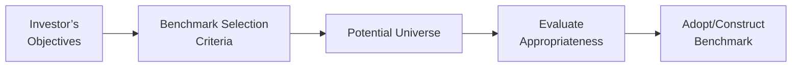

## Introduction

Sometimes—especially during those sleepless nights before performance review season—managers realize how powerful the right benchmark can be in telling their story. A benchmark is basically your measuring stick. If you don’t get this part right, you might come off like a champion (when the bar was set too low) or look less impressive than you really are (when the benchmark is set way too high). 

In this section, we’ll chat about how to select benchmarks for equity portfolios. We’ll cover why a benchmark matters, what makes a good benchmark, and some typical benchmark choices you’ll see in practice. We’ll also talk about customizing your own benchmarks when you can’t find one that fits your investment style.

## Why Benchmarks Matter

It might sound obvious, but your benchmark is the foundation you use to measure portfolio success or failure. The benchmark is that single point of comparison that helps you filter out general market noise and hone in on how well (or poorly) your portfolio is performing. The best benchmarks:

• Show you if your active strategies are adding real alpha or just riding passive market gains.  
• Offer perspective on how much risk you’re taking relative to what’s “standard” in your specific universe.  
• Provide transparency that keeps all stakeholders on the same page—clients, managers, and regulators alike.

On top of all that, benchmarks can influence manager behavior because they define what success looks like. If the benchmark skews toward certain sectors, you’ll need to pay attention to those weights to avoid large tracking errors (unless you intentionally deviate). And if your portfolio aims to meet an ESG standard, your benchmark should align with that too.

## Characteristics of a Good Benchmark

A good benchmark is more than just a random index found in a financial newspaper. Let’s highlight some vital characteristics that a well-constructed equity benchmark typically has:

### Unambiguous

A benchmark should be clear about exactly which securities are included and how they’re weighted. If you have to guess what’s in the index or the methodology behind the selection, that’s a red flag. You’ll want something you can explain to a client with a quick bullet list.

### Investable

No one wants a benchmark that includes hypothetical securities you can’t actually buy. An investable index ensures its components are traded on real markets, typically with sufficient liquidity that a manager could (at least in theory) replicate the positions.

### Measurable

We want consistent data. If your benchmark releases returns only once a year, well, that’s probably not very practical when you need more frequent performance updates (e.g., monthly or quarterly). Good benchmarks have timely and reliable pricing data so you can measure returns whenever you like.

### Appropriate

A small-cap growth manager using a broad large-cap index for comparison is obviously comparing apples to oranges. The benchmark has to match the style, objectives, and risk exposure of the portfolio. If you’re running a tech-focused growth fund, then presumably you’ll look at a growth-oriented or tech-heavy index.

### Reflective of the Manager’s Style

We all invest in different ways. Some managers look at fundamental growth prospects, some hunt for deep value, while others chase market trends. A strong alignment with your style is critical. If you’re a purely value-driven manager, measure yourself against a value index to see how well you’re picking undervalued stocks relative to your peers.

### Objective Construction

Benchmarks need transparent rules for how they pick constituents and weigh them. Maybe it’s by market capitalization, maybe it’s by some fundamental measure, or a thematic approach. Regardless, the rules need to be systematic, documented, and ideally free from conflicts of interest.

To visualize how all these characteristics connect in practical usage, here’s a quick diagram of the typical process a manager goes through in finding the right benchmark:

In a nutshell: you start by defining your overall objectives, figure out which benchmark criteria are important, scan the available options, assess which ones fit best, and finally select (or build) the right yardstick.

## Global vs. Regional Benchmarks

We can often categorize benchmarks by the geographic scope of their coverage.

### Global Benchmarks

Global or international benchmarks (e.g., MSCI World, MSCI All Country World Index (ACWI)) include a broad selection of stocks across many developed and emerging markets. Global managers, or those who want the freedom to invest in multiple regions, often pick a global benchmark. It’s basically the yardstick that says, “Hey, how’m I doing against everything out there?”

Little anecdote: a friend of mine once tried to measure her global equity portfolio against a domestic-only index, S&P 500. She ended up with weird tracking differences simply because a lot of the portfolio was in Europe and Asia. Once she switched to a global index, things made a lot more sense.

### Regional Benchmarks

For strategies tied to a particular country or region, you might pick something like the S&P 500 (U.S.) or the STOXX Europe 600 (Europe). These benchmarks capture specific local markets. Sometimes, managers are restricted by mandate or client preference to remain within certain regions, making these local benchmarks the natural choice.

## Style Benchmarks: Growth vs. Value

Investment styles come in and out of fashion—growth and value being perhaps the two biggest, oldest “camps.” If you’re a growth manager, you might compare yourself to the Russell 1000 Growth index or the S&P 500 Growth index. Value managers often track themselves against the Russell 1000 Value or S&P 500 Value. 

The reason style benchmarks exist is that pure growth managers invest in companies they believe will show significant revenue and earnings expansion, often ignoring near-term valuation multiples. Value managers might buy companies trading below intrinsic value, expecting the market to eventually correct the price. Since these approaches differ drastically, it wouldn’t be fair to measure them against the same broad-based index.

## Custom Benchmarks

Sometimes none of the existing indexes perfectly matches a manager’s approach. Suppose you have a specialized ESG approach that invests only in environmentally friendly technology—there may not be a widely recognized index that nails your specific methodology. In that case, you can go ahead and create a custom benchmark, which means building a set of securities and weighting them according to rules you define.

### Reasons to Build a Custom Benchmark

• You have a niche theme (e.g., alternative energy subsector).  
• Industry or factor exposures are highly specific.  
• You want a strict set of screening rules (e.g., no fossil fuel exposures, no tobacco, restricted carbon footprints).  
• You need to align with client-imposed constraints.

### Potential Downsides

• Might be expensive to maintain.  
• Harder to replicate because of thinly traded securities.  
• Less recognized or accepted by external parties.  
• May raise questions about objectivity, since you could inadvertently “cherry-pick” constituents to make your portfolio look good.

Still, a custom benchmark is often the only route if you’re venturing off the beaten path. Just stay transparent about how you built it.

## Inappropriate Benchmarks and Their Consequences

The significance of an appropriate benchmark often pops into our mind only after we’ve picked the wrong one. So what’s the big deal if your chosen benchmark doesn’t align with your strategy?

• It distorts performance attribution, making it tough to say what portion of returns came from skill.  
• It can over- or understate risk, because the benchmark might have different volatility or sector exposures than your strategy.  
• It can mislead investors and lead to poor manager evaluation—like praising a manager who’s simply benefiting from an uncorrelated benchmark or punishing a rising star who invests differently.  
• Eventually, it may encourage the manager to pay more attention to the benchmark composition than to their stated investment philosophy, which introduces style drift or changes strategy purely to improve short-term tracking.

I once heard an ex-colleague vent their frustration that their “tech-driven disruptor portfolio” was being compared to the S&P 500. Impressive returns in certain periods got overshadowed by short-term corrections in the broader market. By switching to a tech-heavy guide, they gained clarity on what truly was alpha from picking innovative companies.

## Glossary

Measurable Benchmark  
A benchmark that provides frequent and consistent performance data, typically reflecting daily or monthly prices so that managers can compare their returns in a timely manner.

Investable Benchmark  
An index composed of securities that can actually be purchased by a portfolio. This typically excludes securities with extremely limited liquidity or those restricted from foreign ownership.

Appropriate Benchmark  
One that closely mirrors the manager’s style, risk appetite, and expected exposures. For a small-cap manager, this might be the Russell 2000. For a global manager, MSCI World might fit the bill.

Custom Index  
A specialized index constructed with specific inclusion/exclusion criteria to align closely with a unique investment mandate (e.g., an internally created ESG index). For instance, a manager may remove sin stocks and reweight constituents based on a proprietary methodology.

## Practical Example: Building Your Own ESG Benchmark

Let’s say you run a mid-cap portfolio focused on emerging market companies that demonstrate strong environmental stewardship. You can’t find an existing index that fits your definition perfectly. So you build a custom index as follows:

1. Start with a broad emerging market mid-cap index.  
2. Exclude companies in the top 25% of emissions relative to their sector.  
3. Further exclude companies that generate more than 10% of revenues from coal.  
4. Reweight the remaining securities using a free-float market cap approach to ensure liquidity.  

You end up with a curated list of 150 stocks. This is now your custom benchmark. You can measure how effectively your active choices within these 150 “acceptable” securities enhance value relative to the baseline approach.

## Implementation Hurdles

• Data Collection: Ensuring consistent environmental metrics and verifying they’re accurate.  
• Rebalancing Frequency: Determining how often to update your index.  
• Cost: Building or licensing your own index can be resource-intensive, especially if you require multiple data sources or sophisticated screening tools.  

Despite these hurdles, a well-designed custom benchmark can offer the ultimate apples-to-apples measurement of your specialized strategy.

## Exam Tips and Common Pitfalls

When it comes to the CFA Level III exam, you’re likely to see scenario-based problems that test your understanding of how to pick or evaluate a benchmark in context. Here are a few pointers:

• Check the manager’s stated style. If the manager is global growth, the correct benchmark is a global growth index, not a domestic value or broad market index.  
• Watch for “red flags”: an index that includes uninvestable securities, or that doesn’t match the risk exposures of the portfolio.  
• You might need to differentiate between a standard index (e.g., S&P 500) and a style index (e.g., S&P 500 Growth).  
• Pay close attention to the manager’s constraints. If there are ESG or sector constraints, a custom benchmark might be the best fit.  

Also, in essay-type questions, you’ll often need to justify the choice. So remember to mention the benchmark’s investability, measurability, and appropriateness. They might ask for a short rationale around each characteristic.

## References

• CFA Institute. (n.d.). Performance Evaluation and Benchmark Construction.  
• Russell Indices: [https://www.ftserussell.com/products/indices](https://www.ftserussell.com/products/indices)  
• MSCI Index Methodology: [https://www.msci.com/index-methodology](https://www.msci.com/index-methodology)

## Test Your Knowledge: Equity Benchmarking Strategies



### Which characteristic best describes an investable benchmark?

- [ ] A benchmark that has been adjusted for currency exposures.
- [x] A benchmark comprised of securities that can be readily purchased by a manager.
- [ ] A benchmark with a higher proportion of illiquid stocks meant to capture market inefficiencies.
- [ ] A benchmark that mirrors the performance of a single actively managed fund.

> **Explanation:** An investable benchmark has securities that a portfolio manager can realistically purchase in the marketplace, ensuring alignment with real-world trading.

### A global equity portfolio that invests across developed and emerging markets would most likely measure performance against:

- [ ] The S&P 500 index.
- [ ] A small-cap value index.
- [x] The MSCI All Country World Index (ACWI).
- [ ] A custom index for domestic-only utilities.

> **Explanation:** The MSCI ACWI provides comprehensive coverage across both developed and emerging markets, aligning well with a global equity portfolio.

### What is a primary advantage of using a style-specific index, such as a growth or value index?

- [ ] They typically exclude large-cap securities, providing more alpha opportunity.
- [x] They reflect characteristics relevant to a manager’s investment style, aiding in more accurate performance comparisons.
- [ ] They impose no constraints on sector selection, making them fully diversified.
- [ ] They always have lower volatility than broad market indexes.

> **Explanation:** Style-specific benchmarks align with the manager’s strategy (e.g., growth or value), enhancing the clarity of performance attribution and risk analysis.

### When might a portfolio manager face difficulty if the chosen benchmark is inappropriate?

- [ ] It always lowers the portfolio’s return due to style drift.
- [ ] It automatically leads to higher fees for clients.
- [ ] It never affects long-only portfolio strategies.
- [x] It can result in misleading performance attribution and misaligned investment decisions.

> **Explanation:** An inappropriate benchmark can significantly distort how performance is evaluated and may encourage investment decisions that deviate from the manager’s stated strategy.

### A customizable, or custom, benchmark is typically used when:

- [x] The existing standard benchmarks do not match a manager’s specialized or niche investing style.
- [ ] The securities in the benchmark are all restricted from foreign ownership.
- [ ] The manager wants to match the sector allocations of a large-cap index exactly.
- [ ] The manager has no measure of style exposure and needs a broad-based yardstick.

> **Explanation:** Custom benchmarks are constructed when off-the-shelf benchmarks are inadequate for reflecting a portfolio’s unique constraints or thematic approach.

### Which of the following can be a drawback of creating a custom benchmark?

- [ ] It streamlines the performance evaluation process.
- [ ] It reduces tracking error compared to generic benchmarks.
- [x] It can be perceived as less objective and more difficult to replicate.
- [ ] It eliminates the need for continuous data collection.

> **Explanation:** Custom benchmarks can appear subjective due to their specialized construction rules, and often they require more complex data updates.

### A correct statement about an unambiguous benchmark is that:

- [x] Its constituents are clearly defined and transparent to all users.
- [ ] It exclusively includes illiquid assets for higher return potential.
- [ ] It uses a random indexing methodology decided by the manager.
- [ ] It focuses only on the top 10 largest stocks in the market.

> **Explanation:** An unambiguous benchmark clearly outlines the securities included and the way they are weighted, leaving no confusion as to what it represents.

### For a manager whose mandate is to invest solely in European stocks, which benchmark would be most appropriate?

- [ ] MSCI All Country World Index
- [x] STOXX Europe 600
- [ ] S&P 500
- [ ] Russell 2000 Growth

> **Explanation:** The STOXX Europe 600 provides broad coverage of the European equity market, aligning with the mandate’s geographic focus.

### What is a key reason to prefer a narrower style benchmark over a broad-based benchmark?

- [ ] Narrow style benchmarks are always cheaper to license.
- [ ] Broad-based benchmarks never reflect actual market performance accurately.
- [ ] Narrow style benchmarks avoid the inclusion of large-cap stocks.
- [x] Narrow style benchmarks reflect a manager’s specific investment style more accurately.

> **Explanation:** If a portfolio is committed to a particular style or sector, a narrower style-focused index is more suitable for measuring performance, given the alignment in investment approach.

### True or False: An inappropriate benchmark can encourage unintended changes in a manager’s investment style to improve short-term tracking.

- [x] True
- [ ] False

> **Explanation:** Managers might shift toward the benchmark’s style or sector weights if they feel pressured to reduce tracking error, which can undermine the original strategy.


