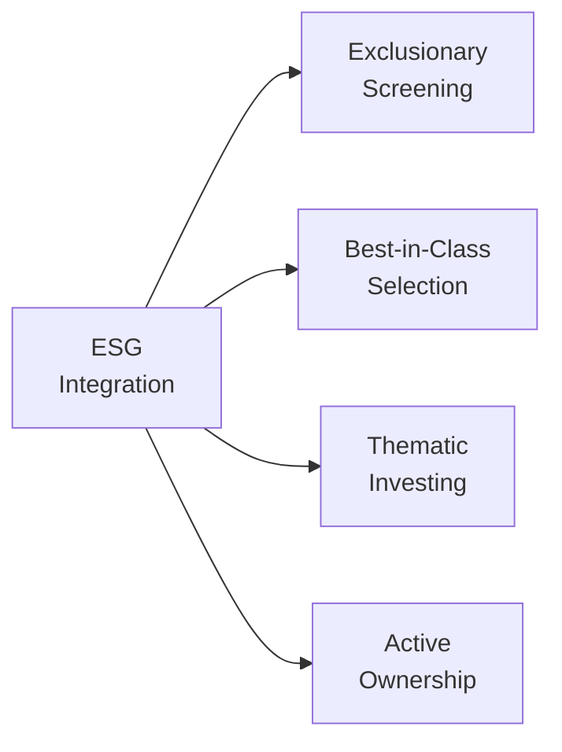

## Introduction

Environmental, Social, and Governance (ESG) factors have steadily found their way into the heart of equity portfolio management. And honestly, it’s not surprising: as investors (and sometimes just everyday humans), we’ve grown more aware of how a company’s environmental footprint, its approaches to labor practices, diversity, or corruption risk, and its management structures can all affect financial performance in the long run.

In earlier sections of this curriculum (e.g., Section 1.4, “Shareholder Engagement and an Equity Manager’s Role”), we laid out the evolving responsibilities of equity managers in influencing corporate behavior. ESG integration is, in many ways, an extension of that conversation. Here, we explore why ESG factors matter for equity investments, how they can be integrated into the investment process, and what challenges you might face along the way. I’ll sprinkle in a bit of personal reflection, too. For instance, I remember the first time a client specifically asked, “Wait, do they treat their employees well?” My team and I had to scramble to figure that out—this was well before ESG data was as widely available as it is now. Since then, ESG integration has grown leaps and bounds, and it’s changed how many managers approach equity portfolios.

## Why ESG Matters for Equity Investing

ESG goes beyond the financial statements to capture intangible (but meaningful) risks and opportunities:

• Environmental (E): This one’s about things like carbon emissions, water usage, resource depletion, pollution, and climate-change resilience. If a company is heavily reliant on fossil fuels, or has poor environmental practices, it might face regulatory fines or shifting consumer demand.  
• Social (S): Think employee well-being, diversity and inclusion, community impact, and supply chain labor standards. Social factors can affect brand loyalty, employee productivity, and even the risk of litigation or reputational damage.  
• Governance (G): Governance covers issues like board structure, executive compensation, strong internal controls—in other words, how a company is managed at the highest levels. Poor governance often shows up through scandals, fraud, or “one person running the show” fiascos.

Taken together, these factors can highlight potential blind spots not captured by traditional equity analysis. In Section 1.2, we learned about segmenting the equity manager’s investment universe. ESG integration can serve as an additional segmentation lens, ensuring the portfolio aligns with both risk considerations and personal or institutional values.

## ESG Integration Approaches

Just as there’s no single way to build a portfolio, there’s no one-size-fits-all method for incorporating ESG. Different managers and investors emphasize different elements, often depending on their risk tolerance, return objectives, or moral preferences. Below is a helpful diagram summarizing typical ESG approaches.

### Exclusionary Screening

Exclusionary screening—also called negative screening—means filtering out companies or industries deemed unacceptable based on certain ESG standards. Common exclusions include tobacco, weapons manufacturing, or companies with severe environmental controversies. In practice, a manager might compile a “no-buy” list. For instance, large public pension funds might say, “No coal-mining companies,” or “No cluster munitions manufacturers.” The main benefit is clarity: the manager or client explicitly says “we don’t finance these businesses.”

On the flip side, you might give up opportunities if certain excluded companies end up delivering strong returns. For instance, a high-earning oil company might be off-limits, even if it’s outperforming the broader market. That said, many managers argue that certain industries carry long-term risks (such as strict environmental policies in the future) that may render short-term gains moot.

### Best-in-Class Selection

Sometimes known as “positive screening,” best-in-class selection involves choosing top-notch ESG performers within each industry. Instead of ruling out entire industries, you simply pick the ones that do the best environmentally, socially, or governance-wise in their respective sectors. The idea is that some companies in energy, for example, are more environmentally proactive (maybe they’re investing heavily in renewables or carbon capture) than peers. A best-in-class approach captures these relative differences.

Investors who can’t or don’t want to avoid entire industries might prefer this approach. However, it does require robust ESG data or third-party ratings (like MSCI ESG Research or Sustainalytics) to isolate the “leaders” from the pack. And keep in mind those ratings can differ dramatically from one provider to another because the methodologies and weightings for each ESG factor might vary.

### Thematic Investing

It’s possible you’ll come across specialized funds or portfolios that hone in on a particular ESG theme. Maybe it’s water sustainability, or renewable energy, or gender equality. Thematic investing, in short, is about targeting a specific social or environmental cause while expecting financial returns. It feels a bit like “impact investing”—where you’re seeking social or environmental benefits in addition to profits—but not always structured in the same philanthropic way.

Thematic investing can be quite forward-looking. A classic example could be a “Clean Energy” equity fund, which invests in companies that produce or enable wind, solar, or other green power solutions. The big question, of course, is whether the thematic approach lines up with your broader investment goals. If your theme faces huge regulatory tailwinds (like net-zero emission targets), great. If not, you could be left with sector-concentrated risk if the theme underperforms.

### Active Ownership (Engagement and Proxy Voting)

Section 1.4 introduced the concept of shareholder engagement—where equity investors attend annual general meetings, vote on shareholder resolutions, and engage with management. ESG-minded shareholders often do this to push for improvements such as better carbon disclosures, more independent directors, or stronger labor rights. Even large institutional investors are leaning on public companies to set net-zero emissions targets or to reduce supply chain complexity tied to labor abuses.

Active ownership can be more subtle than screaming from the rooftops. Often, a quiet conversation with management can nudge a company toward better governance or social policies. But it’s also more resource-intensive. You (or your team) must track each company’s activities, attend meetings, and possibly file shareholder proposals. Some might see it as extra work, but it’s also a strategic lever that can create value long term.

## ESG Data and Rating Providers

Picture this scenario: You want to identify best-in-class companies in the global chemicals sector, focusing on carbon emissions, workplace safety, and board diversity. If you’re lucky, the companies themselves release sustainability reports (a practice known as Sustainability Reporting), giving you direct info on these metrics. Many times, though, it’s incomplete or inconsistent across firms.

That’s where ESG rating and data providers come into play. Firms like MSCI ESG Research, Sustainalytics, S&P Global, or CDP collect a host of metrics, weighting them to produce an overall ESG score or rating. But be careful: each rating agency uses different rating scales, data collection methods, and assumptions. A company could get an “AA” rating from one provider and a “BBB” from another. As a manager, you might cross-check multiple sources or incorporate your own fundamental analysis to round out the view.

## Embedded Benefits of ESG Analysis

1. Risk Management: A company with robust ESG practices is often more transparent, better governed, and better prepared to handle environmental or social disruptions. During the early days of the COVID-19 pandemic, for instance, companies with strong supply chain management—often flagged by top S (social) scores—faced fewer operational hiccups.

2. Reputation and Brand Value: Firms with strong ESG track records may be more trusted by consumers and business partners. This intangible brand value can create a price premium or a loyal customer base.

3. Meeting Investor Demand: A big reason managers adopt ESG is because investors are asking for it. Particularly for institutional asset owners—like endowments or pensions—ESG alignment can be part of their mandate.

## Balancing ESG Integration and Performance

“Does ESG investing mean sacrificing returns?” That’s the million-dollar question (though maybe it’s more like the billion-dollar question these days). Some research suggests that ESG integration can reduce downside risk and potentially improve risk-adjusted returns by screening out “bad actors” or by favoring forward-looking companies. Other studies argue the constraints on your investment universe might cut off profitable opportunities. So, well, it’s not always black-and-white.

The outcome heavily depends on how ESG is implemented. A poorly executed exclusionary screen that removes half the market without a thoughtful process might hamper performance. A skillful best-in-class approach that identifies forward-thinking companies could do the opposite. As you might expect, your mileage may vary, but careful ESG integration typically doesn’t hamper returns over the long run. At least that’s the consensus forming among many practitioners and academics.

## Regulatory Developments

You may have noticed that disclosures about carbon footprints or diversity metrics are more common now. Various jurisdictions have updated regulations that require public companies to disclose certain ESG metrics, or at least encourage them to do so. A handful of years ago, it was a total Wild West when it came to ESG data. Now, with frameworks like those from the Sustainability Accounting Standards Board (SASB) and the Task Force on Climate-related Financial Disclosures (TCFD), we see more standardized reporting.

For investors, this regulatory push means more usable data. It also means a bit more accountability—if companies exaggerate or “greenwash” their ESG credentials, they can face legal or reputational backlash. In Section 1.5, we examined the push-and-pull of active vs. passive management. This regulatory environment for ESG is one reason active managers gained an edge in carefully analyzing which disclosures are legitimate and which might be fluff.

## ESG in the Investment Process

### Step 1: Define Objectives and Constraints

Like any good investment process, it starts with your objectives. Clearly outline the portfolio’s ESG goals. Are you aiming to exclude certain industries? Generate positive social impact? Focus on high corporate governance standards? These preferences might come from the client’s Investment Policy Statement (IPS). In many institutional contexts, the policy might read something like, “The fund shall consider environmental factors in the selection of equity securities and target an overall ESG rating above a certain threshold.”

### Step 2: Choose an ESG Approach

From the four approaches described (exclusionary screening, best-in-class, themed investing, or active ownership), determine what resonates with your investment philosophy, risk tolerance, and resources. You might combine more than one. For example, you might exclude coal stocks while actively engaging with the rest of your portfolio on governance issues.

### Step 3: Conduct ESG Due Diligence

Analyze ESG data from corporate disclosures, third-party ESG rating agencies, or your own fundamental research. Check for controversies—does the company have pending lawsuits around environmental spills, or a history of bribery and corruption? Assess how the company measures and manages environmental or social risks. Identify the degree of board independence and the presence of shareholder-friendly policies.

### Step 4: Incorporate Insights into Valuation

In equity analysis, you might adjust discount rates, forecasted cash flows, or terminal values to reflect ESG risks or opportunities. A company with a massive carbon footprint, for instance, might face heavier future taxes, so you build that into your model. Conversely, a well-governed firm might have a lower cost of capital, reflecting investor confidence.

### Step 5: Portfolio Construction and Monitoring

Finally, integrate your ESG findings into the portfolio. Weight the stocks in a way that aligns with your ESG priorities. Monitor these holdings over time, re-checking ESG ratings and controversies. This process might lead to rebalancing or engagement if a holding’s ESG profile deteriorates.

## Real-World Mini-Case

Not too long ago, I helped a client who insisted on excluding firearms manufacturers from their equity portfolio. We started with a broad equity index, then utilized negative screening to remove firearm-related securities. Next, we overlaid a best-in-class approach on the remaining universe to find companies with top-tier sustainability and governance scores. The final portfolio had about 400 stocks and was overweight in certain tech companies with stellar environmental track records and strong anti-bias policies. The client was thrilled that they had a portfolio reflecting their ethical stance, and we found the performance quite competitive with standard benchmarks, especially during periods of market volatility or crisis—helped in part by the portfolio’s tilt toward well-managed, forward-looking businesses.

## Common Challenges and Potential Criticisms

1. Data Quality and Availability: Not all companies disclose the same ESG metrics, making apples-to-apples comparisons tough.  
2. Subjectivity in Ratings: Different rating providers emphasize different metrics, often leading to conflicting ESG scores.  
3. “Greenwashing”: Companies might overstate their environmental or social credentials, so due diligence is essential.  
4. Investment Universe Constraints: Exclusionary screening might reduce diversification or miss profitable opportunities.  
5. Complexity and Costs: Maintaining an ESG-integrated equity process can require extra research, data subscriptions, and ongoing engagement efforts.

## Future Trends and Considerations

Looking ahead, ESG reporting standards will likely become more uniform, thanks to evolving regulations and international initiatives. Technological advancements—like big-data analytics and AI—will facilitate more sophisticated ESG analysis, capturing real-time data on things like supply chain emissions or workforce retention. Also, investor expectations around social issues (like diversity in leadership) and environmental resiliency (climate and biodiversity) are bound to intensify.

In Section 1.8, we’ll explore how some of these ESG considerations might combine with Smart Beta Strategies, offering a hybrid approach that systematically targets ESG factors alongside more traditional risk factors. Meanwhile, fixed-income counterparts are exploring green bonds and social bonds (see Chapter 2.10). All these efforts underscore a broader shift: ESG is no longer a niche or “feel-good” strategy—it’s part of the mainstream conversation on portfolio construction.

## Best Practices for ESG Integration

• Define Clear ESG Objectives: Tailor your approach to the client’s values or the fund’s mandate.  
• Cross-Check Data Sources: Don’t rely on a single ESG rating. Supplement ratings with direct corporate disclosures and your own fundamental research.  
• Engage with Companies: Active ownership can address concerns more effectively than blanket exclusion, especially if you’re willing to shape corporate behavior.  
• Monitor and Revisit ESG Scores: ESG is dynamic. A firm’s rating can quickly change if new controversies emerge or if a company significantly improves.  
• Balance ESG with Performance Goals: Keep sight of your overall return objective. ESG factors should complement, not overshadow, prudent investment analysis.  

## Exam Tips for ESG Integration in Equity Portfolios

From a CFA Level III perspective, exam questions might weave ESG considerations into scenario-based vignettes. You could be asked to:

• Propose an ESG strategy for a given client.  
• Evaluate real or hypothetical company ESG data.  
• Critique different approaches (exclusion, best-in-class, thematic investing).  
• Factor ESG risks into equity valuation or portfolio construction.  

Be prepared for short-answer or item-set questions that test your ability to interpret conflicting ESG ratings, or to recommend a strategy that aligns with an investor’s ethical, environmental, or social goals. Remember to tie your arguments to the investor’s Investment Policy Statement and to highlight the trade-offs involved (like potential opportunity costs or data limitations).

Also, keep in mind the synergy with other sections:  
• In 1.5, rationales for active vs. passive management connect directly to how easily you can implement and monitor ESG in active or passive strategies.  
• In 6.11, some algorithmic trading strategies might require transaction cost analysis for large-scale transitions into ESG-compliant portfolios.  

## References and Further Reading

• CFA Institute. (n.d.). ESG Investment Essentials.  
• Tirole, J. (2017). Economics for the Common Good. Princeton University Press.  
• PRI (Principles for Responsible Investment): https://www.unpri.org/  
• SASB (Sustainability Accounting Standards Board): https://www.sasb.org/  
• TCFD (Task Force on Climate-related Financial Disclosures): https://www.fsb-tcfd.org/  

## Test Your Knowledge: ESG Integration in Equity Portfolios



### 1. Which of the following best describes a Best-in-Class ESG approach?

- [ ] Avoiding specific sectors based on ethical grounds.
- [x] Selecting companies that demonstrate ESG leadership within their respective industries.
- [ ] Voting against management on all proxy items related to ESG matters.
- [ ] Investing solely in renewable energy companies.

> **Explanation:** A Best-in-Class approach focuses on picking top ESG performers within each sector, rather than excluding entire industries.

### 2. Which statement is true about data released in sustainability reports?

- [x] It may be incomplete or inconsistent, complicating cross-company comparisons.
- [ ] It always follows a uniform global standard enforced by regulators.
- [ ] It discloses only positive environmental metrics.
- [ ] It must be audited by government agencies in every jurisdiction.

> **Explanation:** Corporate sustainability reporting remains largely voluntary in many regions, and even where it’s required, firms may follow different frameworks, leading to inconsistent data.

### 3. Under Exclusionary Screening, which of the following is a possible pitfall?

- [ ] More robust diversification.
- [ ] Greater potential for capturing industries with high growth.
- [x] Potential loss of attractive investment opportunities if an excluded sector outperforms.
- [ ] Easier time matching the benchmark’s performance.

> **Explanation:** Exclusionary screening narrows the investable universe and may cut out sectors or companies that could deliver strong returns, creating potential opportunity costs.

### 4. A key objective of active ownership in ESG investing is:

- [ ] To fully eliminate exposure to carbon-intensive companies.
- [x] To influence companies' behavior or policies through engagement and proxy voting.
- [ ] To only buy companies with AAA ESG ratings.
- [ ] To replicate market benchmarks while ignoring ESG factors.

> **Explanation:** Active ownership leverages shareholder power to encourage management to adopt better ESG practices or disclosures.

### 5. Which of the following is NOT a method commonly associated with ESG integration?

- [ ] Best-in-class selection
- [ ] Thematic investing
- [x] Immediate divestment upon any governance concern, no questions asked
- [ ] Engagement with corporate management

> **Explanation:** While swift divestment can happen, full immediate divestment upon any governance hiccup is not typically a structured, recognized ESG approach; engagement is often a first step.

### 6. ESG rating providers can differ because:

- [ ] They are regulated by a single global standard.
- [x] Each uses its own methodology, weighting factors differently.
- [ ] They rate only social and governance factors, ignoring environmental data.
- [ ] Their assessments must be validated by a government agency.

> **Explanation:** ESG rating providers such as MSCI ESG Research, Sustainalytics, or S&P Global can weight factors (like emissions, board diversity, etc.) differently, leading to variant outcomes.

### 7. When incorporating ESG factors into equity valuations, an analyst might:

- [x] Adjust the discount rate to account for higher environmental or social risks.
- [ ] Ignore the legal environment and assume no impact of future regulations.
- [x] Foresee changes in consumer demand for more sustainable products.
- [ ] Treat governance risks as irrelevant to a firm’s projected cash flows.

> **Explanation:** ESG factors can affect cost of capital, future cash flow growth, and risk exposures, which should be integrated into valuation assumptions.

### 8. Which of the following statements about thematic investing is correct?

- [ ] It avoids high-growth areas of the market.
- [x] It targets a specific ESG-related theme (e.g., clean energy) for concentrated investments.
- [ ] It always includes companies from all sectors.
- [ ] It excludes all carbon-intensive industries by definition.

> **Explanation:** Thematic investing hones in on a particular environmental or social trend, such as clean energy, creating sector or thematic concentration.

### 9. From a performance perspective, adopting ESG factors in equity portfolios:

- [x] May help mitigate downside risk by identifying poorly governed firms.
- [ ] Ensures lower returns since it constrains the universe.
- [ ] Has no effect on risk management.
- [ ] Always produces higher alpha.

> **Explanation:** ESG integration can reduce risk through avoiding problematic firms or industries, but returns are not guaranteed to be higher or lower—it depends on implementation.

### 10. True or False: All ESG portfolio strategies require complete exclusion of certain sectors or companies.

- [x] True
- [ ] False

> **Explanation:** This is actually a trick statement. Some ESG approaches—like exclusionary screening—may exclude certain sectors outright, but not all ESG strategies require that. Best-in-class, for instance, does not necessarily exclude entire industries, only poor ESG performers within them.


