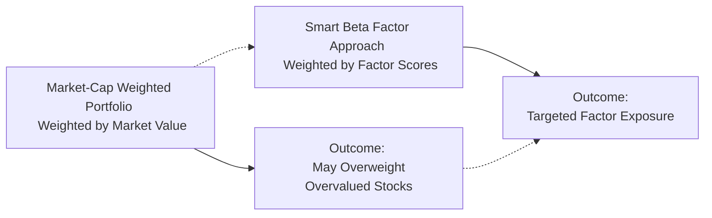

## Introduction

So, let’s say you’re sitting around a table with a bunch of investment pros who are passionately debating whether to stick to a plain-vanilla index fund or shift to a factor-based approach—what in the world are they talking about? If you’ve ever heard terms like “value factor,” “momentum factor,” or “low-volatility strategy,” they’re likely referencing a family of investing approaches that we typically call “smart beta.” And trust me, I still remember the day I decided to tilt my personal stock portfolio toward “quality” companies, fully prepared for a magic moment—only to watch the market do the exact opposite for the first year or so! But that’s the nature of smart beta strategies: they can offer systematically driven exposures to well-researched factors, yet they can also test your patience when those factors fall out of favor.

In essence, smart beta strategies aim to blend the best of two worlds: the cost-efficiency and rules-based discipline of indexing, plus the targeted exposures of factor-based active management. By systematically overweighting or underweighting stocks that exhibit certain characteristics (like being “cheap,” trending strongly, or having low volatility), investors can potentially capture risk premia that researchers have identified over decades of empirical data. But big disclaimers are needed: success depends on factor persistence (i.e., whether these factors continue to work going forward), plus your willingness to ride out sometimes prolonged stretches of underperformance. Let’s dig into the details.

## What Are Smart Beta Strategies?

A quick refresher: A standard market-cap-weighted index invests in companies based on their relative size in the market. The bigger the company’s market capitalization, the larger its weight in the index. Simple, right? But that simplicity also introduces biases. Market-cap weighting can lead to overweighting expensive and potentially overhyped stocks, while underweighting cheaper, less-in-the-limelight ones. Smart beta strategies are designed to break free from some of these pitfalls by focusing on alternative criteria for weighting.

They might rank stocks according to a single factor—like “value,” such as the price-to-book (P/B) ratio—or combine multiple factors, such as “value, momentum, and low volatility” all rolled into one. The method is still rules-based, so it’s more transparent and cost-effective than many traditional active approaches. However, smart beta typically involves more frequent rebalancing and specialized methodology, which leads to higher costs and turnover compared to plain index funds.

## Core Principles of Factor Tilts

Smart beta strategies rely heavily on the concept of “factor tilts.” A factor tilt occurs when a portfolio systematically gives higher weight to stocks exhibiting a specific trait or characteristic associated with a risk premium or performance advantage. Here are some commonly pursued equity market factors:

• Value: Seeks cheap stocks based on fundamental metrics, such as book value or earnings.  
• Momentum: Targets stocks that have performed well in the recent past, betting that their trend continues.  
• Low Volatility (or Low Beta): Focuses on lower-risk stocks that have historically exhibited less price fluctuation.  
• Quality: Emphasizes companies with strong balance sheets, stable earnings, and robust profitability metrics (like high return on equity).  
• Size (Small-Cap Tilt): Tilts toward smaller companies, often presumed to have higher growth potential but also greater risk.

Among the famous academicians who helped popularize factor investing are Eugene Fama and Ken French, whose three-factor (and later five-factor) models suggested that size and value, along with market exposure, add significant explanatory power to stock returns. Then you have expansions like Carhart’s four-factor model that added momentum to the mix, plus ongoing research on additional factors like profitability and investment intensity. All these insights laid the groundwork for modern smart beta products.

## How Smart Beta Portfolios Are Constructed

Once you’ve identified a factor or set of factors, the next step is to figure out how to build a portfolio around them. In many strategies, each stock in the eligible universe is ranked based on factor scores, such as price-to-earnings (P/E) for value or trailing 12-month total return for momentum. The methodology then might pick the top (or bottom) slice of that ranking and give them higher (or lower) weights. 

Below is a simple flowchart illustrating a high-level process of constructing a smart beta portfolio:

The devil is in the details, though. Index providers differ in how they score, how often they rebalance, and whether they cap exposures to individual stocks or track error relative to a parent index. For instance, a “pure value” index might only take the top decile of stocks based on a value metric, whereas a “composite quality” index might average multiple financial ratios (ROE, debt-to-equity, earnings stability) to produce a single quality score. Some strategies also incorporate optimization to control sector exposures or reduce turnover.

## Possible Advantages

• Potential for Excess Returns: Historical evidence suggests that certain factors (like value or momentum) have generated higher returns than the market over the long run.  
• Risk Reduction: Factor tilts may also reduce certain risks (e.g., a low-volatility portfolio typically experiences smaller drawdowns).  
• Transparency: Because these strategies are rules-based, you can generally understand what’s under the hood.  
• Cost Efficiency (Relative to Fully Active): While not as cheap as market-cap indexing, smart beta strategies can be less expensive than many actively managed funds.

## Potential Pitfalls

• Extended Underperformance: Factors can fall out of favor and underperform for years, causing anxious investors to pull the plug at the worst possible times (I felt that frustration personally when my “value tilt” languished during a massive tech-led rally).  
• Higher Turnover & Fees: Compared to plain market-cap indexing, factor-based strategies rebalance more often and require more complex research processes, leading to higher costs.  
• Market Cycle Sensitivity: Factors behave differently across economic cycles. For example, momentum might do well in strong bull markets but falter at major turning points.  
• Factor Crowding: When too many investors chase the same factor (or group of factors), valuations may become stretched, negating the historical premium.  

## Factor Performance Through Different Market Cycles

Factors have a reputation for waxing and waning. For instance, a simple momentum strategy might excel in a trending up market but underperform in choppy or reversing markets. Low volatility might look embarrassing during a raging bull cycle but hold up well in bear markets. Savvy investors know they should be prepared to “stay the course” if they believe strongly in a factor’s long-run premium. That said, patience is required. A quick glance at rolling 3-year or 5-year periods can reveal how any single factor might truly test your conviction.

## Implementation Considerations

### 1. Rebalancing & Trading Costs
Smart beta strategies introduce a systematic approach to portfolio rebalancing. Typically, holdings are adjusted at set intervals—maybe quarterly, semiannually, or annually—based on updated factor scores. Frequent rebalancing can improve alignment with factor exposures but also increases transaction costs. Market impact can become significant for strategies that apply stricter factor screens or the ones that manage larger AUM (assets under management).

### 2. Diversification & Unintended Exposures
While factor investing is about strategic tilts, heavy factor tilts can produce unintended exposures or risk concentrations. For example, a deep-value tilt might inadvertently concentrate positions in slow-growing industries or cyclical sectors. To mitigate these effects, indices often use optimization to cap sector overweight or incorporate multiple factors for better diversification.

### 3. Investment Horizon & Behavioral Discipline
Have you ever met an eager investor who hopped into a momentum strategy just after it soared for a few months, only to jump ship when momentum snapped? Many folks underestimate how crucial it is to stick to a factor approach over a sufficiently long horizon—factors, by their nature, can have drawn-out periods of underperformance. You need discipline and conceptual conviction. If you bail too quickly, you won’t capture the potential benefits.

### 4. Costs & Fees
Though commonly cheaper than fully active funds, smart beta ETFs or index funds still carry higher expense ratios than plain-vanilla cap-weighted index funds. Indeed, you’re paying for the research and specialized methodology. Investors should carefully compare fees across different providers and weigh those costs against the likely benefits of factor exposure. 

## Smart Beta Strategies and ESG Integration

In recent years, we’ve also seen the rise of ESG (Environmental, Social, Governance) factor integration. Some investors want lower volatility or momentum plus alignment with good corporate behavior. Many index providers have launched “smart beta meets ESG” products, applying both standard factor criteria and ESG screens. For example, a Low-Volatility ESG index might rank stocks by volatility and also remove firms with poor environmental or social track records. This trend mirrors a broader industry shift toward combining factor tilts with sustainability objectives (see also Section 1.7 on ESG Integration in Equity Portfolios and Chapter 3.9 for ESG factors in alternative investments).

## Monitoring and Performance Attribution

When evaluating results, you’ll want to parse out how much of your return came from general market exposure versus factor exposures. A typical breakdown might attribute returns to:

1. • Market Beta (broad equity market movements)  
2. • Factor Tilt (e.g., value vs. momentum vs. low vol, etc.)  
3. • Stock Selection Effects (idiosyncratic outcomes, if any)  

Analysts often use regression-based approaches to estimate factor exposures. Let’s say your fund’s alpha (α) after controlling for relevant factors is near zero. That might suggest your outperformance is basically explained by the factor tilt, rather than skillful security selection.

A simplified formula for performance attribution in a factor-based portfolio might look like:

(1)  
Rᵖ — R𝘧 = βₘ(Rₘ — R𝘧) + βᵥ Fᵥ + βₘₒ Fₘₒ + βₗᵥ Fₗᵥ + … + α  

Where:  
• Rᵖ is the portfolio return.  
• R𝘧 is the risk-free rate.  
• Rₘ is the market return.  
• (Rₘ — R𝘧) is often referred to as the market premium.  
• Fᵥ, Fₘₒ, Fₗᵥ, … are factor returns for value, momentum, low volatility, and so on.  
• βᵥ, βₘₒ, βₗᵥ, … are the portfolio exposures (betas) to those factors.  
• α is any unexplained (idiosyncratic) excess return.

Of course, in the real world, we might employ more sophisticated multi-factor models with advanced regressions. But the gist is that consistent factor tilts often overshadow pure security selection, making them a unique hybrid solution situated between passive indexing and fully active management.

## Common Pitfalls and Best Practices

• Overfitting to Past Data: Some providers might game the backtests to show outstanding results, only for real-world performance to disappoint.  
• Insufficient Due Diligence: Always scrutinize a smart beta strategy’s index methodology, especially regarding sector caps, rebalancing frequency, and factor definitions.  
• Chasing Last Year’s Winner: If you buy a momentum or value strategy simply because it had a stellar run, you risk potential reversal.  
• Not Considering Taxes: Higher turnover in factor-based portfolios might trigger more taxable events. For private wealth clients, carefully weigh after-tax returns versus a simpler indexing approach (see Chapter 4.7, “Asset Location and Tax-Efficient Investing”).

## Diagram: Comparing Market-Cap Weighting vs. Smart Beta

Below is a simplified diagram that contrasts a traditional market-cap approach with a factor-tilt approach:

In this simplified view, the main difference is in how portfolio weights are determined—market cap vs. factor-based weighting. The latter aims for a targeted risk premium, though it introduces complexities.

## Exam Tips, Practical Anecdotes, and Next Steps

Although the CFA Program is often quite formal, it’s absolutely okay to remember personal takeaways like, “Man, the value factor might stay out of favor for a while, so I better be prepared to hold on.” From an exam perspective, be ready to tackle item sets or essay questions that ask you to:

• Contrast a smart beta strategy with pure market-cap indexing and with a fully active approach.  
• Evaluate whether a specific factor tilt might be suitable for a client’s objective, risk tolerance, or time horizon.  
• Calculate factor exposures and attribute performance if given relevant return data.  
• Discuss how rebalancing frequency affects transaction costs and tracking error.  
• Critique a proposed or existing smart beta product—how factor definitions, sector constraints, or fee structures might fit or clash with the client’s needs.

Finally, if you want a deeper dive, the references below are worth your time. Andrew Ang’s “Asset Management: A Systematic Approach to Factor Investing” is a classic, and Antti Ilmanen’s “Expected Returns” offers a thorough exploration of various risk premia. Also, be sure to check out MSCI’s factor index guide linked below.

## References and Further Reading

• Ang, A. (2014). Asset Management: A Systematic Approach to Factor Investing. Oxford University Press.  
• Ilmanen, A. (2011). Expected Returns. Wiley.  
• MSCI Factor Indexes: https://www.msci.com/factor-investing  

---

## Mastering Smart Beta Strategies: Self Test



### Which of the following best describes a smart beta investment approach?

- [ ] Fully active management targeting alpha through security selection.
- [ ] Market-cap-weighted indexing with no factor tilts.
- [x] Rules-based investing with systematic factor tilts.
- [ ] Event-driven investing focusing on M&A opportunities.

> **Explanation:** Smart beta blends passive-like rules with factor tilts to systematically overweight or underweight certain stocks.  

### When constructing a value-oriented smart beta portfolio, which metric would typically play a crucial role?

- [ ] Price momentum over the last 6 months.
- [x] Price-to-book or price-to-earnings ratios.
- [ ] Historical stock price volatility.
- [ ] Debt-to-equity ratio over 3 years.

> **Explanation:** A value tilt typically hinges on valuation measures such as P/B or P/E, comparing a stock’s price to accounting or earnings metrics.  

### One of the primary benefits associated with smart beta strategies (relative to fully active management) is:

- [x] Lower management costs due to rules-based methodology.
- [ ] Guaranteed outperformance across all market cycles.
- [ ] Zero risk exposure to broader market fluctuations.
- [ ] Complete immunity from style drift.

> **Explanation:** Since smart beta is rules-based, it generally comes with lower expenses than traditional active management, though not as low as plain-vanilla indexing.  

### A low-volatility smart beta factor might underperform the broader market in which situation?

- [x] A strong bull market where high-beta stocks rally intensely.
- [ ] A market downturn accompanied by flight to safety.
- [ ] A stagnant market with minimal returns all around.
- [ ] A recession driven by low corporate earnings.

> **Explanation:** Low-volatility strategies seek stability and defensive traits; they can lag when markets are roaring and high-beta stocks surge rapidly.  

### In a smart beta framework, which of the following statements is true about factor diversification?

- [x] Combining multiple factors (like value, momentum, and quality) may smooth out performance cycles.
- [ ] Stacking more factors always lowers portfolio risk to zero.
- [x] Some factors can negatively correlate, reducing overall portfolio volatility.
- [ ] Factor tilts are always correlated with each other, creating constant volatility drag.

> **Explanation:** Using multiple factors can help diversify across different economic and market environments. Some factors perform well when others are lagging, though it’s vital to monitor correlations.  

### Which of the following best defines “factor tilt”?

- [ ] A measure of the portfolio’s historical alpha relative to a market-cap index.
- [x] A systematic weighting toward a specific risk factor deemed to offer excess returns.
- [ ] A regulatory practice used to mitigate insider trading risks.
- [ ] A short-term pricing anomaly identified using technical indicators.

> **Explanation:** Factor tilt is the intentional overweight (or underweight) of certain factors associated with potential return premia.  

### Regarding the implementation of a momentum-based smart beta product, which statement is most accurate?

- [x] Turnover can be relatively high due to frequent rebalancing when trends change.
- [ ] Turnover is typically lower than a plain-vanilla market-cap-weighted index.
- [x] It follows recent performance trends, which carries risk if abrupt market reversals occur.
- [ ] Momentum strategies rarely experience drawdowns because winners keep winning.

> **Explanation:** Momentum strategies can have high turnover to keep up with shifting trends, leading to potentially higher costs and possible underperformance in choppy or reversing markets.  

### Which factor tilt in equity portfolios primarily seeks to reduce drawdowns and protect on the downside?

- [ ] Momentum factor.
- [ ] Value factor.
- [ ] Size factor.
- [x] Low Volatility factor.

> **Explanation:** The low-volatility factor typically invests in stocks with smaller price fluctuations, offering a more defensive stance when broader markets decline.  

### Which of the following is a key risk of “factor crowding”?

- [x] Overly popular factors may see overstretched valuations, diminishing future returns.
- [ ] The factor becomes automatically hedged by other market players, locking in profits.
- [ ] The factor’s definition is lost, making it less transparent.
- [ ] All regulatory oversight on factor strategies ceases.

> **Explanation:** When large numbers of investors flock to a factor, they can drive up valuations for related stocks, compressing the return premium that historically existed.  

### True or False: Smart beta strategies eliminate the need for disciplined rebalancing.

- [ ] True
- [x] False

> **Explanation:** Smart beta methodologies typically require disciplined and sometimes frequent rebalancing to maintain desired factor exposures, making it crucial for investors to stay systematic.  


