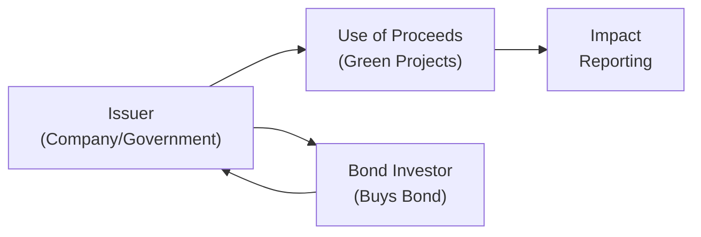

## Introduction and Context

ESG (Environmental, Social, Governance) investing has emerged as a major force in the fixed-income market, connecting investor values with practical capital allocation decisions. You might have heard a friend say, “I just want my bond investments to do some good for the planet,” and, you know, that sentiment is becoming surprisingly common. Market participants increasingly seek out green bonds to help finance environmental projects or social bonds that support affordable housing and community development. These instruments are no longer niche; they are part of a broader shift toward sustainable finance. 

In this section, we explore how ESG criteria can be integrated into fixed-income portfolio management. We consider frameworks such as the Green Bond Principles (GBP) and the Sustainability-Linked Bond Principles (SLBP), both of which guide issuers and investors in structuring and evaluating ESG-labeled bonds. This discussion also delves into the challenges of “greenwashing”—in short, over-hyping the green credentials of a bond—and the methods used to distinguish genuine impact from empty marketing.

## ESG in Fixed-Income: Overview and Rationale

ESG investing goes beyond traditional financial metrics, incorporating factors like a company’s carbon footprint or labor practices into the analysis. In fixed-income investing, ESG screening can involve:

• Assessing an issuer’s environmental performance (e.g., greenhouse gas emissions).  
• Gauging social impact (e.g., healthcare benefits for workers, community engagement).  
• Evaluating governance effectiveness (e.g., board independence, anti-corruption measures).  

If you’ve ever worried about default risk, it may help to know that some academic and industry research suggests that issuers with strong ESG profiles can have a lower probability of default. They’ve got better governance processes, fewer reputational risks, and typically run a tighter ship on compliance issues. Of course, the evidence isn’t absolute—some well-run, high-ESG issuers still face market volatility. That said, ESG screening is steadily moving from being a “nice to have” to a meaningful part of credit risk assessment.

### Potential Impact on Bond Yields and Spreads

Integrating ESG factors might influence a bond’s yield or spread relative to its peers. In many cases, bonds with robust ESG credentials trade at narrower spreads (sometimes referred to as a “greenium”) because of growing demand from socially conscious investors. However, this isn’t guaranteed across the board. If an issuer is smaller or less recognized, the ESG label may not significantly lower its borrowing costs—at least not immediately. Over time, though, investors are watching the issuance momentum of green and social bonds and factoring them into portfolio allocation decisions.

## Green Bonds: Funding Environmental Initiatives

Green bonds are specifically earmarked to fund climate or environmental projects such as renewable energy facilities, pollution prevention, and sustainable infrastructure. When you buy a green bond, you’re essentially lending money to finance a project that, ideally, helps reduce carbon emissions or mitigate climate change. The proceeds are allocated (and ideally ring-fenced) to green initiatives. Issuers must be transparent about how these funds are used, disclosing details in an impact report.

### Green Bond Principles (GBP)

The International Capital Market Association (ICMA) introduced the Green Bond Principles (GBP)—a set of voluntary guidelines referencing:

• Use of Proceeds: Clarify and disclose how the bond’s proceeds will be allocated to environmentally beneficial projects.  
• Process for Project Evaluation and Selection: Explain the systematic process to determine project eligibility.  
• Management of Proceeds: Ensure funds are properly earmarked for green uses.  
• Reporting: Provide regular updates on the projects, including quantitative and qualitative impact measures.  

GBP compliance isn’t enforced by law; it’s voluntary. Nevertheless, it’s become a widely recognized standard, offering credibility to issuers and confidence to investors.

### Typical Green Bond Structure

Below is a simple depiction (in Mermaid diagram form) of how green bond proceeds flow from issuer to environmental initiatives, and eventually circle back to the investor in the form of interest payments and principal.

• Step 1: Issuer sells bonds to investors.  
• Step 2: Issuer deploys proceeds into green projects.  
• Step 3: Periodic reporting details the environmental benefits.  
• Step 4: Investors receive bond interest and, at maturity, principal repayment.  

## Social and Sustainability-Linked Bonds

### Social Bonds

Social bonds fund socially oriented projects like affordable housing, access to healthcare and education, and poverty alleviation initiatives. These follow many of the same principles as green bonds but focus on social challenges—improving outcomes for underserved communities.

### Sustainability-Linked Bonds (SLBs)

Sustainability-linked bonds represent another twist: their coupon rates or redemption features adjust based on the issuer’s ability to meet certain ESG performance targets. For instance, if the issuer fails to lower its carbon emissions by a predetermined percentage, the coupon may step up. This offers investors a built-in incentive to see the issuer follow through on its sustainability promises.

SLB structures can get complicated—for example, you might see a bond whose interest rate increases by 25 basis points if the issuer’s greenhouse gas reductions fail to reach a specified threshold. These are innovative because, unlike use-of-proceeds bonds, the funds can be used for general corporate purposes, but the issuer’s overall ESG performance remains on the hook.

## ESG Integration in Fixed-Income Analysis

You may be wondering, “Well, how do I actually do this in practice?” In a typical ESG integration approach for fixed income:

• Start with an ESG score or rating for each issuer. You can use external data from specialized rating agencies.  
• Incorporate the ESG rating into your fundamental analysis. Adjust the issuer’s credit risk profile if it faces significant pending litigation or environmental liabilities.  
• Evaluate the bond’s structure (e.g., secured vs. unsecured, maturity, covenant strength) within the issuer’s ESG context. A green bond from a heavily polluting industry might still yield more if they’re genuinely cleaning up their act.  
• Decide on an allocation. Balance pure financial return expectations with the desire to meet ESG impact goals.  

Some portfolio managers set specific ESG thresholds for investment—like, “We will exclude any bond with an environmental rating below a certain threshold.” Others prefer best-in-class approaches, investing in the “ESG leaders” within each sector.

## Greenwashing: Risks, Realities, and Mitigation

Greenwashing occurs when an issuer exaggerates or outright misrepresents the environmental or social benefits of their project. This can happen in a few ways:

• Labeling a bond as “green” with minimal or little transparency on actual projects.  
• Providing no quantifiable evidence of environmental impact (e.g., no metrics on carbon offset).  
• Selecting projects that might only marginally address environmental concerns while marketing them as transformative.  

### Verifying ESG Claims

Preventing greenwashing often involves third-party verifications and second-party opinions. In fact, many investors will not buy a bond labeled as “green” unless there’s an external review from a reputable provider. These verifiers confirm that the bond’s framework and disclosures align with the Green Bond Principles, and they may provide ongoing monitoring of financed projects.

Sustainability ratings agencies can also play a key role by assessing the issuer’s overall ESG performance. If the issuer’s rating is poor or if controversies surface, the bond’s “green” label might be called into question. The systematic approach—ESG rating plus second-party opinion plus robust impact reporting—goes a long way to ensure the authenticity of ESG claims.

## Challenges of ESG and Green Bond Investing

### Trade-Off Between Financial Return and ESG Objectives

Some investors worry that focusing on ESG might come at the expense of returns. Often, green and social bonds might be oversubscribed, which can drive yields lower than comparable traditional bonds. That said, studies suggest the long-term risk-adjusted performance might be equal or better, especially if the issuer’s ESG activities reduce negative externalities and potential liabilities.

### Liquidity Constraints

While the green bond market is growing, it’s still smaller than the overall corporate or sovereign bond market. Liquidity can sometimes be an issue, especially for specialized social or sustainability-linked bonds with unique structures or longer maturities. Portfolio managers need to carefully assess whether these bonds fit their liquidity needs and risk tolerance.

### Lack of Standardization

ESG rating methodologies can vary significantly. Two different agencies might give the same issuer very different scores. Also, “green bond” definitions may differ in certain jurisdictions. This inconsistency can create confusion, making it all the more crucial for managers to do thorough due diligence.

### Evolving Regulatory Environment

Regulations around sustainability reporting, disclosure, and taxonomy are evolving rapidly. For instance, the European Union introduced the Sustainable Finance Disclosure Regulation (SFDR), but there’s no single global standard. As an investor, it’s helpful (I might even say essential) to keep tabs on regulatory changes that affect the labeling and distribution of green or social bonds.

## Practical Example: Municipal Green Bond

Let’s say a city government issues a 10-year green bond to finance the construction of a solar farm. The bond matures in 2035, with a semiannual coupon. Suppose the city obtains a second-party opinion from a reputable firm like Sustainalytics or V.E (Vigeo Eiris), verifying that the project meets GBP guidelines. The proceeds, ring-fenced in a dedicated account, exclusively pay for site construction, equipment, and project management. After two years, the city issues an impact report showing a reduction of X metric tons of CO₂ emissions per year—along with a breakdown of how funds were spent. 

To an investor, owning this municipal green bond might mean slightly lower yield than a comparable municipal bond from the same city not earmarked for environmental improvement. But it may also bring intangible benefits—fulfilling an ESG mandate and showing stakeholders that the portfolio aims to reduce carbon emissions.

## Putting It All Together in a Portfolio

For fixed-income portfolio managers, incorporating ESG means developing a structured process:

1. Define Objectives: Decide whether you’re aiming for pure return maximization or you place a premium on environmental or social outcomes.  
2. Conduct ESG Research: Use external ESG data, internal analysis, or both to assign ESG ratings to issuers.  
3. Screen or Tilt the Portfolio: Exclude low-rated issuers or overweight those with promising ESG metrics.  
4. Monitor Impact and Performance: Keep track of the project outcomes (for green/social bonds) and watch for controversies.  
5. Adjust as Needed: If an issuer’s ESG performance deteriorates or you sense greenwashing, take action to reduce or exit the position.  

Over time, portfolio managers who systematically incorporate ESG factors can develop a nuanced awareness of credit risk and potential intangible benefits. There may still be plenty of debate about how much outperformance ESG-labeled bonds can generate, but it’s undisputed that investor demand is strong and growing.

## Best Practices and Potential Pitfalls

• Best Practices:  
  – Seek transparency: Look for detailed use-of-proceeds disclosures and third-party verifications.  
  – Diversify across issuers, regions, and ESG themes.  
  – Document your process: Show stakeholders exactly how you integrate ESG factors.  
  – Stay updated on regulatory changes and new labeled-bond structures.

• Potential Pitfalls:  
  – Greenwashing: Relying solely on marketing material without verification.  
  – Inconsistent Data: Different rating agencies can have conflicting methodologies.  
  – Liquidity: Some ESG-labeled issuances might not have robust secondary market trading.  
  – Overconfidence in ESG “halo”: Even a green-labeled issuer can have credit issues.  

## Exam Tips and Key Takeaways

1. Be Ready to Illustrate Processes: On the CFA exam, you might get scenario-based questions about a hypothetical green or social bond. Practice explaining how to evaluate the bond’s eligibility, measure its impact, and incorporate ESG ratings.  
2. Know the Key Frameworks: Green Bond Principles, Sustainability-Linked Bond Principles—memorize the fundamental guidelines and be able to articulate how they apply.  
3. Understand Greenwashing: The exam may test your ability to identify signs of questionable ESG claims.  
4. Don’t Ignore Traditional Credit Analysis: ESG does not replace fundamental credit research; it enhances it.  
5. Brush Up on Reporting Standards: Familiarize yourself with what “Use of Proceeds” and “Impact Report” mean in practice.  
6. Keep an Eye on Regulatory Updates: The exam might reference new or updated regulations shaping ESG-related disclosure or labeling requirements.

## References and Suggested Readings

• International Capital Market Association’s Green Bond Principles:  
  https://www.icmagroup.org  
• CFA Institute’s ESG Investing and Analysis Curriculum Readings  
• TCFD (Task Force on Climate-Related Financial Disclosures) Guidelines:  
  https://www.fsb-tcfd.org  

• Additional sources:  
  – “Sustainability-Linked Bond Principles,” ICMA  
  – “ESG Integration in Corporate Bond Portfolios,” by CFA Institute  
  – “Greenwashing or Green Reality?”, MSCI Research  

--------------------------------------------------------------------------------

## Test Your Knowledge: ESG and Green Bond Investing



### Which of the following best describes use of proceeds in green bond issuance?

- [ ] A general classification of all funds for any form of corporate operation.
- [x] A clearly identified and ring-fenced allocation of funds to environmentally beneficial projects.
- [ ] A form of coupon adjustment based on the performance of the issuer.
- [ ] A term describing the tax treatment of green bonds in the United States.

> **Explanation:** Under the Green Bond Principles, issuers must outline how proceeds will be used specifically for environmental or climate-related projects.

---

### Which statement is most accurate regarding potential yield spreads on green bonds?

- [x] Green bonds might trade at narrower spreads due to high investor demand, referred to as a “greenium.”
- [ ] Green bonds always trade at significantly wider spreads than conventional bonds.
- [ ] Green bonds have no discernible yield differences compared to conventional bonds.
- [ ] Green bonds trade at narrower spreads solely due to their shorter maturity.

> **Explanation:** Demand for green bonds can lead to tighter spreads compared to similar conventional bonds, creating a “greenium.” This is not guaranteed, but it does happen often as investor demand for sustainable finance instruments grows.

---

### A sustainability-linked bond (SLB) typically differs from a green bond in that:

- [ ] The issuer can use proceeds only for social causes.
- [ ] SLBs have no requirement for any external verification process.
- [x] SLBs may alter coupon rates based on the issuer’s sustainability performance over time.
- [ ] SLBs have a shorter maturity profile than green bonds.

> **Explanation:** Sustainability-linked bonds include provisions allowing coupon adjustments if the issuer meets or fails specific ESG performance targets.

---

### Which of the following best exemplifies greenwashing?

- [x] Marketing a new bond as green but providing no use-of-proceeds documentation or verifiable impact data.
- [ ] Lowering the coupon on a sustainability-linked bond when an issuer meets emissions targets.
- [ ] Having an independent reviewer verify the environmental impact of a project.
- [ ] Labeling a bond according to recognized guidelines such as the Green Bond Principles.

> **Explanation:** Greenwashing occurs when issuers overstate or fail to substantiate the environmental or social benefits of a bond, often due to a lack of transparency or misleading claims.

---

### When integrating ESG into fixed-income portfolio construction, a “best-in-class” approach refers to:

- [ ] Excluding all issuers that do not meet a minimum ESG rating threshold.
- [ ] Only investing in bonds labeled as green or sustainability-linked.
- [x] Overweighting bond issuers with the highest ESG ratings in each sector, rather than excluding entire sectors.
- [ ] Avoiding any exposure to high-yield bonds based on ESG concerns.

> **Explanation:** A best-in-class approach invests in top ESG performers within each industry rather than excluding whole industries.

---

### Which statement is true about the Green Bond Principles (GBP)?

- [ ] They are legally binding regulations in most countries.
- [ ] They only apply to sovereign bond issuers.
- [x] They are voluntary guidelines that emphasize transparency and proper use of proceeds.
- [ ] They prohibit interest rate adjustments tied to sustainability performance.

> **Explanation:** GBP guidelines are recommended but voluntary, focusing on transparency around the use of proceeds, process of project evaluation, and regular reporting.

---

### What is a primary argument supporting the view that ESG integration can reduce a bond’s default risk?

- [x] Companies with strong ESG profiles may have fewer legal, reputational, and regulatory risks.
- [ ] Issuers must guarantee full repayment on internal reserves alone.
- [ ] Interest rates on ESG-labeled bonds never fluctuate.
- [ ] Green bonds rely on government subsidies for coupons.

> **Explanation:** ESG-forward issuers often have better risk controls, stakeholder relationships, and brand reputation, potentially lowering default risk.

---

### Which is an example of a second-party opinion (SPO) in green bond issuance?

- [x] A verification report from a recognized agency such as Sustainalytics affirming alignment with GBP.
- [ ] The issuer’s internal affirmation that proceeds will be used for carbon offset projects.
- [ ] An annual disclosure of interest rate changes.
- [ ] A legal covenant that the bond will trade at par in the secondary market.

> **Explanation:** A second-party opinion is typically from an independent reviewer, confirming that a bond’s framework aligns with established green or social bond principles.

---

### Among the key challenges in ESG and green bond investing is:

- [ ] The complete absence of investor demand for green products.
- [ ] The inability to find any labeled ESG bond in developed markets.
- [ ] The strict uniformity of ESG ratings from different agencies.
- [x] The lack of standardization across different ESG rating methodologies.

> **Explanation:** Varying ESG scoring methods and definitions can create inconsistency in how issuers are evaluated, which is a significant challenge.

---

### True or False: Sustainability-linked bonds (SLBs) have rigid restrictions on how bond proceeds are spent.

- [x] True
- [ ] False

> **Explanation:** Although “sustainability-linked” implies ESG commitments, SLBs do not generally restrict the use of proceeds the way green bonds do. Instead, they tie the bond’s financial terms to sustainability performance targets—this can be considered a “restriction” in a broader sense of alignment to ESG goals rather than use-of-proceeds. The distinction is nuanced, but from the perspective of standard definitions, SLBs and green bonds differ in how proceeds are allocated.


