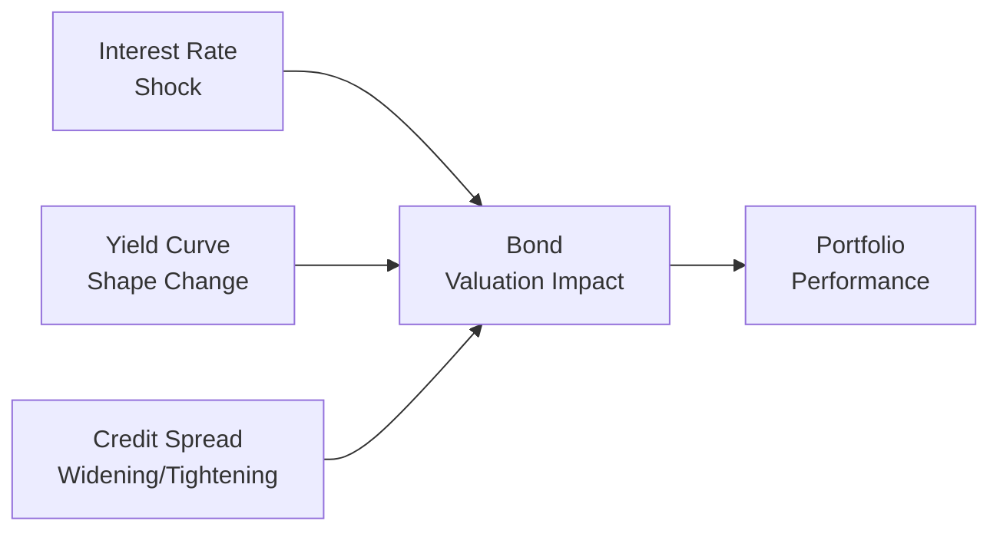
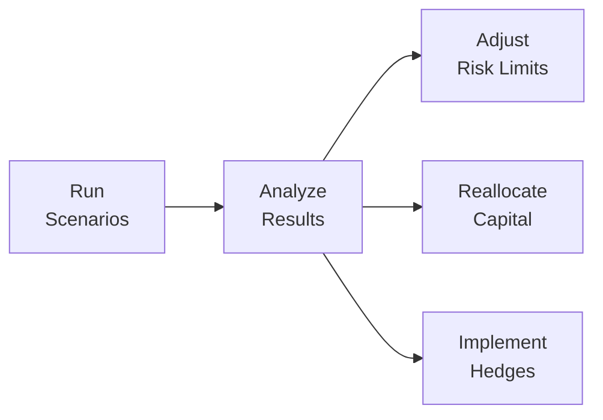

## Introduction and Context

So—picture this: you’re managing a large bond portfolio, happily collecting coupons, when suddenly interest rates spike 300 basis points overnight. Or, maybe credit spreads widen dramatically because of a rumor about, say, geopolitical tensions. Yikes! The question is: how do we get a handle on the risks that come with such ups and downs—and perhaps even weirder scenarios—before they slam into us out of nowhere?

That’s where scenario analysis and stress testing step in. They help us imagine a variety of “what if” events, so we can figure out how our portfolio might behave and, hopefully, what to do about it. In this section, we’ll explore scenario analysis for fixed-income portfolios, highlighting both historical events (like the 2008 financial crisis) and hypothetical shocks (like a sudden yield curve twist). We’ll also get into best practices for incorporating multi-factor stress tests, addressing liquidity constraints, and refining your whole portfolio management approach.

## Scenario Analysis: Key Concepts

Scenario analysis is a forward-looking technique that examines how a portfolio might respond under a range of conditions. Instead of focusing solely on normal “average” outcomes, scenario analysis helps you consider different states of the world—particularly those that can stretch risk factors beyond their usual ranges.

• Scenario Analysis: A forward-looking risk management technique examining portfolio outcomes under different predefined events.  
• Stress Testing: A specific form of scenario analysis focusing on severe, adverse conditions.  
• Historical Scenario: Replaying actual past events to evaluate current portfolio vulnerability.  
• Hypothetical Scenario: Creating events not observed historically but deemed plausible.  

### Why Scenario Analysis?

Well, because bond values can swing due to shifts in interest rates, credit spreads, or liquidity conditions, we need a systematic way to measure those moves. Scenario analysis helps reveal:

• Potential losses due to parallel or non-parallel yield curve shocks.  
• Liquidity constraints that may arise if, say, many investors want to sell simultaneously.  
• The portfolio’s sensitivity to tail risk: those “extreme but plausible” events.  
• Third-order effects like margin calls for leveraged positions or forced sales to meet redemptions.  

Or, frankly, sometimes you just want to sleep better at night, right?

## Historical vs. Hypothetical Scenarios

### Historical Scenario Analysis

Historical scenarios replay real events. Did you ever discuss the chaos of 2008 with a fellow bond manager at an industry conference? Maybe they told you, “I never want to live through that meltdown again!” Well, with historical scenario analysis, you basically reapply the interest rate, credit spread, and macro-economic changes from, say, late 2007 through 2009 to your current portfolio. This approach has the advantage of being grounded in actual data. You see exactly how your holdings would have behaved if you were teleported back to that era.

Typical historical scenarios include:

• 2008 Global Financial Crisis: Collateral calls, big jumps in credit spreads, dramatic flattening (at times) of the yield curve.  
• 2011 European Sovereign Debt Crisis: Widening spreads on eurozone bonds, liquidity panic.  
• 2020 Pandemic Crisis: Rapid yield curve shifts, flights to safety, central bank interventions, etc.  

Because we’re using real data from actual financial distress, the results are tangible. But the downfall is that the next crisis may differ. You know, history doesn’t always repeat itself, or so they say (some say it “rhymes,” but that’s a debate for another time).

### Hypothetical Scenario Analysis

Hypothetical scenarios don’t rely on real events. Instead, we say, “What if?” For instance, “What if the Federal Reserve raises rates two times faster than expected? What if inflation skyrockets due to supply chain disruptions? What if the yield curve inverts more drastically than we’ve ever seen?” We set up these hypothetical possibilities and run them through our models.

Hypothetical scenario analysis is powerful because it frees us from the constraints of recorded history. We can simulate unique or rare events—like a global cyberattack or a sudden credit freeze—assuming they’re “extreme but plausible.” But constructing them requires expert judgment. Sometimes we can glean insights from economic research or from the dreaded “war stories” around the trading desk.

## Stress Testing: Going to Extremes (Within Reason)

Stress testing is a specialized subset of scenario analysis. The gist is: we assume truly severe shocks but maintain a degree of plausibility. Think of it as scenario analysis turned up to eleven.

Common stress scenarios might involve:

• A 300–400 basis point jump in interest rates in under six months (especially relevant if you hold a lot of long-duration bonds).  
• A dramatic widening of credit spreads—for instance, corporate spreads doubling because of a panic about a major industry’s health.  
• A sudden drop in market liquidity, where normal buyers vanish overnight, potentially forcing you to accept massive discounts to sell.  

Yes, it sounds terrifying. That’s kind of the point. Stress tests illuminate the deeper cracks in the portfolio that a standard scenario analysis (or a typical VaR approach) might overlook.

### The Role of “Extreme but Plausible”

In stress testing, we want extremes that aren’t purely fantasy. Watching Hollywood apocalypse movies might inspire interesting “end-of-the-world” scenarios, but from a risk management standpoint, we need to ask: is it feasible or truly improbable? If it’s too improbable, planning for it might be unproductive. On the other hand, if your scenario is too mild, it won’t demonstrate where real vulnerabilities lie.

## How These Shocks Impact Bond Valuations

Let’s take a quick refresher on how bond prices might respond under different shocks:

1. Interest Rate Shifts:  
   • A parallel shift up in the yield curve usually causes prices to drop across the board—more severely for longer-duration bonds given higher sensitivity (duration).  
   • A parallel shift down generally boosts bond prices.  

2. Yield Curve Changes (e.g., Flattening, Steepening, Twist):  
   • Flattening might help long-duration positions if yields at the long end drop sharply relative to short-term yields.  
   • Steepening can deliver the opposite effect.  

3. Credit Spread Widening/Tightening:  
   • Widening spreads reduce bond prices, especially for lower-credit-quality issues.  
   • Tightening spreads can cause bond prices to rally, with high-yield or extended credit playing a starring role in potential outperformance.  

We can visualize this in a simple conceptual flow to see how these primary factors affect the portfolio.

The figure shows that interest rate shocks, yield curve changes, and credit spread movements feed into bond valuation changes, which then ultimately flow into the overall portfolio performance.

## Identifying Liquidity Strains and Forced Sales

One thing that doesn’t always hit you until you’ve lived it: liquidity can evaporate fast in a crisis. For instance, let’s say we hold a big chunk of corporate bonds that trade infrequently. Under normal conditions, that’s no big deal. But if a stress scenario emerges, bid-ask spreads can widen, and the entire secondary market can freeze. If you’re leveraged, margin calls may force you to sell into a market with no buyers, which is pretty much the worst-case scenario. By running liquidity-based scenario analysis, we can figure out how quickly we can raise cash and at what cost.

Here are some issues to examine:

• Margin Calls: If portfolio value drops, lenders might demand additional collateral.  
• Redemptions: If it’s a mutual fund or an ETF, large-scale investor withdrawals can force asset sales at unfavorable prices.  
• Regulatory Requirements: Institutions like banks or insurance companies might face capital requirement constraints after a rating downgrade.  

## Multi-Factor Stress Tests

While single-factor scenarios are extremely useful, markets often face multiple shocks simultaneously. A multi-factor approach might blend changes in inflation, default rates, and market volatility. For instance, imagine the following scenario:

• Inflation jumps 2% above expectations, prompting central banks to raise rates quickly.  
• Credit default rates climb due to recession fears.  
• Market volatility spikes, causing a flight to high-quality government bonds.  

In this hypothetical multi-factor scenario, we’d need to assess how each piece interacts. For instance, interest rate hikes hurt bond valuations, but flight-to-safety might lower yields on Treasuries. That can offset some losses for government holdings. Meanwhile, riskier corporate bonds face widening spreads and potential default risk. By layering in each factor, we get a more comprehensive view of potential outcomes.

## Employing Scenario Outputs in Practice

So, you’ve run a series of scenarios—both historical and hypothetical—for your core plus bond fund. What’s next?

1. Refine Risk Limits: Maybe your high-yield exposure is a bit too high.  
2. Reallocate Capital: You might decide to rotate into shorter-duration Treasuries if you’re worried about inflation.  
3. Implement Hedges: Some investors use interest rate swaps, or they buy credit default swaps (CDS) to hedge corporate credit risk.  
4. Adjust Liquidity Buffers: In leveraged or open-end funds, you might augment your cash holdings to avoid forced sales.  

Ultimately, scenario analysis should not be treated as a one-and-done exercise. You’ll typically incorporate regular stress tests and scenario analyses into your risk management dashboards, updating them as markets evolve—and, trust me, markets are always cooking up something new.

The diagram above illustrates how the process is iterative: each scenario run informs decisions like risk limit adjustments and capital reallocation.

## Personal Anecdote: The Surprise of a “Non-Financial” Event

I remember chatting with a colleague who was completely blindsided by an emerging market political crisis—nothing to do with interest rates or credit spreads at first glance. But as the political situation worsened, currency risk soared, foreign investors fled the local bond market, and then, ironically, those issues’ prices collapsed. It was a rude awakening that reminded all of us: scenario analysis shouldn’t be limited to pure financial factors. You can design scenarios that consider oddball political or social events, because as we all know, sometimes that’s exactly what drives a meltdown.

## Best Practices and Common Pitfalls

• Best Practices  
  – Integrate Realism: Combine plausible assumptions with data-driven parameters.  
  – Update Frequently: As the interest rate environment and economic conditions shift, old scenarios might lose relevance quickly.  
  – Document Everything: You want an auditable approach for compliance and to ensure institutional knowledge is retained.  
  – Engage Stakeholders: Risk committees, portfolio managers, and analysts should be able to challenge or confirm scenario assumptions.

• Common Pitfalls  
  – Over-Reliance on a Single Historical Event: The next crisis might not look like the last one.  
  – “Perfect Hedge” Mentality: Even well-conceived hedges can fail under extreme liquidity squeezes or if correlations shift drastically.  
  – Ignoring Second-Order Effects: If you skip channels like liquidity, margin calls, or correlation changes, you’ll miss potential vulnerabilities.  

## Exam Tips: Scenario Analysis and Stress Testing

1. Clearly define your scenario. CFA exam questions often hinge on whether you grasp what’s being tested.  
2. When you see the term “extreme but plausible,” think: Are the assumptions valid for a severe market environment?  
3. For constructed-response questions, show step-by-step logic. If you’re analyzing how a yield curve shift might affect your portfolio, walk through the duration, convexity, and potential credit impacts.  
4. Don’t forget liquidity risk. It’s easy to focus on price changes and forget that you may not be able to sell at a reasonable price.  
5. Time management is crucial on the exam. Outline your scenario analysis approach systematically—exam graders love seeing structured frameworks.

## References and Further Reading

• IMF and BIS reports provide real-world examples of robust stress testing frameworks.  
• John Hull’s “Risk Management and Financial Institutions” has comprehensive chapters on scenario analysis.  
• GARP (Global Association of Risk Professionals) offers materials on best practices for designing stress-testing programs.  

And if you want to geek out over the technical aspects, your local regulatory authorities might publish guidance on firm-wide stress testing for banks, which can be surprisingly adaptable to a broader asset management context.

## Test Your Knowledge: Scenario Analysis and Stress Testing in Fixed-Income Portfolios



### A portfolio manager wants to replay the economic and market conditions of 2008–2009 to gauge the vulnerability of her current bond portfolio. This is an example of:

- [ ] Hypothetical scenario analysis
- [x] Historical scenario analysis
- [ ] Extreme loss scenario analysis
- [ ] Multi-factor scenario analysis

> **Explanation:** Replaying the 2008–2009 crisis (using actual historical data and market shocks) is a classic example of historical scenario analysis.

### Which of the following best describes a “stress test” in fixed-income portfolio management?

- [x] An analysis focusing on severe yet plausible events
- [ ] An analysis ignoring interest rate risks
- [ ] A forward-looking calculation restricted to mild rate movements
- [ ] A purely mathematical technique for discounting future cash flows

> **Explanation:** Stress testing typically looks at extreme but plausible market shocks. It’s more severe than a standard scenario analysis.

### Which scenario below might be considered “hypothetical” for a stress test?

- [ ] Replaying the COVID-19 lockdown in early 2020
- [x] An immediate 250 bps rate hike combined with a 50% jump in default rates
- [ ] Using yield fluctuations from the 2011 European Sovereign Debt Crisis
- [ ] Examining actual currency moves during 2008–2009

> **Explanation:** A large, one-time jump in both interest rates and default rates that has not been observed historically is a hypothetical scenario.

### In multi-factor stress testing for a bond portfolio, which of the following sets of factors might be combined?

- [x] Inflation, default rates, and market volatility
- [ ] Only interest rates and convexity
- [ ] Only yield curve flattening and duration
- [ ] None of the above

> **Explanation:** A multi-factor test includes various interrelated factors like inflation, default rates, and volatility rather than examining one or two factors in isolation.

### A significant advantage of historical scenario analysis over hypothetical scenario analysis is that:

- [x] The results are based on real data and known market behaviors
- [ ] It always provides more severe outcomes
- [x] It never requires subjective assumptions
- [ ] It is easier to automate in all cases

> **Explanation:** Historical scenarios use real data from actual events, which can make outcomes more reliable. However, they may still require certain assumptions and may or may not be severe relative to hypothetical shocks.

### A potential pitfall of relying solely on a single historical stress event (such as 2008) for scenario testing is:

- [x] The next crisis may have different drivers and dynamics
- [ ] It always produces overly severe losses
- [ ] It is too complex to replicate
- [ ] It cannot be modeled in fixed-income portfolios

> **Explanation:** Over focusing on a single event may cause underestimating new or different types of financial shocks.

### Liquidity risk is critical in scenario analyses because:

- [x] Forced sales in illiquid markets can magnify losses
- [x] Margin calls never happen in liquid markets
- [ ] Wide bid-ask spreads only affect equities, not bonds
- [ ] Bond portfolios typically do not face redemption pressures

> **Explanation:** Liquidity can disappear in a crisis, causing forced sales and larger-than-expected losses.

### When designing a stress scenario involving a 300 bps interest rate hike, a manager should primarily consider:

- [x] Duration of the portfolio
- [ ] Tax status of portfolio investors
- [ ] History of real estate returns
- [ ] Only the weighting of short-duration bonds

> **Explanation:** Duration captures how sensitive bond prices are to changes in interest rates. A 300 bps hike usually impacts longer-duration bonds more severely.

### In scenario analysis, combining interest rate shocks with default risk changes is referred to as:

- [x] A multi-factor approach
- [ ] A single-factor approach
- [ ] A tail risk reversion
- [ ] A liquidity-only scenario

> **Explanation:** When more than one variable is shocked simultaneously—like interest rates and default rates—it’s a multi-factor scenario.

### Stress tests that reflect rare yet severe events in the tails of the probability distribution help measure:

- [x] Tail risk
- [ ] Expected shortfall
- [ ] Duration
- [ ] Beta risk

> **Explanation:** Tail risk focuses on the outcomes in the extreme ends (tails) of the probability distribution.


