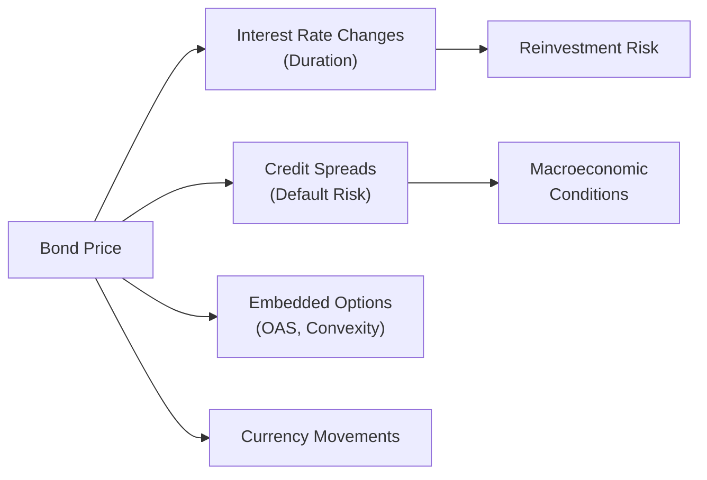

When it comes to managing fixed-income portfolios, appreciating the various dimensions of risk and return is essential for any investment manager—whether you’re running a mutual fund, advising a pension plan, or just curating your personal bond portfolio. Well, I remember the first time I stared at a table of bond durations and spreads. It looked intimidating, but as soon as I figured out how each piece fits into the bigger picture, everything began to click. The neat part is that once you untangle these concepts—duration, convexity, yield measures, correlation, and more—you’ll start spotting how each risk factor weaves into real-world outcomes.

Below, we’ll walk through the major risk measures in fixed-income, demonstrate how to interpret them, and consider how correlations with other asset classes come into play. If you ever feel like you’re juggling too many variables, don’t worry—that’s precisely the art and science of fixed-income portfolio management. After all, the better you understand these risk and return measures, the more effectively you can optimize your portfolio under different economic scenarios.

## Key Concepts in Fixed-Income Risk

Before focusing on the quantitative measures, let’s highlight the core risks in fixed-income investing. Think of each risk like a different “challenge” that can pop up and impact bond valuation or returns:

• Interest Rate Risk (Duration)  
• Credit Risk (Default Risk)  
• Liquidity Risk  
• Reinvestment Risk  
• Currency (Exchange Rate) Risk (relevant for non-domestic bond positions)  

These risk factors often intertwine. For instance, interest rate hikes can knock down bond prices, but they might also reduce corporate earnings, which affects credit risk. And if you hold a non-U.S. bond, you might have to watch out for currency swings. No single metric captures the entire mosaic of risk, so combining different measures is critical.

## Interest Rate Risk and Duration

One of the most fundamental risk measures in bond investing is duration. Duration basically helps you estimate how much the bond’s price might move if yields shift by a small amount. You can think of duration as a “price sensitivity” gauge, typically stated in years. So if your bond has a duration of 5, that means if the yield curve moves (all else equal) by 1%, you might anticipate about a 5% change in the bond’s price—although this is just an approximation.

### Types of Duration

• Modified Duration: Speaks to how a bond’s price changes in response to a change in yields, assuming yields all move in parallel and ignoring the nuances of embedded options.  
• Effective Duration: Usually used for bonds with embedded optionality (like callable or putable bonds). It captures the price sensitivity while factoring in how the option might be exercised.  
• Key Rate Duration: Looks at sensitivity to a specific point on the yield curve. You might have one key rate duration number for the 2-year tenor, another for the 5-year, etc. This is handy for analyzing yield curve twists, not just parallel shifts.

Imagine you’re comparing two bonds with the exact same coupon and maturity. One might have a slightly different duration than the other if it has an embedded call feature or if the coupon payment schedule is more frequent. Those small differences matter a ton when interest rate volatility picks up.

### The Math Behind Duration

In more formal terms, you might see a formula like:


\frac{\Delta P}{P} \approx -D_{\text{mod}} \times \Delta y


where ΔP represents the change in price, P is the current price, D_mod is the modified duration, and Δy the change in yield. The minus sign indicates price moves in the opposite direction of yield.

## Convexity: The Next Step

Picture you’re driving on a straight road (that’s your duration-based relationship between prices and yields). Suddenly, the road curves—that’s convexity taking effect. Duration by itself is a linear approximation, but the bond price-yield relationship is really curved, hence the name “convexity.”  

• Positive convexity: Typically, as yields fall, bond prices rise at an accelerating rate (versus the linear estimate). So if yields plummet, a bond with a higher convexity will see a larger price jump compared to one with lower convexity.  
• Negative convexity: Some bonds, like callable bonds, may exhibit negative convexity when yields drop. If the issuer calls the bond, it prevents the price from rising too far above the call price.

It’s the second-order measure that refines the duration estimate. Managers who hold large positions in mortgage-backed securities (where homeowners have the right to prepay their mortgages) are especially tuned in to convexity, because prepayments can cause negative convexity in certain yield environments.

## Yield to Maturity, Yield to Worst, and All That Jazz

### Yield to Maturity (YTM)

Yield to Maturity is basically the internal rate of return on a bond if you hold it all the way to maturity and collect all the coupons and principal. If you buy at par, the YTM might be close to the coupon rate, but if you buy at a discount or premium, the YTM adjusts accordingly.  

One thing that confused me when I was new to bonds was reconciling coupon rates with YTM. Sometimes a bond’s coupon is 4.5% but the YTM is 5%, which might happen if you’re buying the bond below par—so you get a higher yield than the stated coupon.

### Yield to Worst (YTW)

If a bond has embedded calls or puts, you can’t just state one yield figure and be done with it. There might be several possible dates on which the bond could be redeemed at a specified price. The YTW is the lowest yield among all possible redemption scenarios—basically giving you a conservative yield estimate so you’re not blindsided by an early call.

## Spreads: Where Risk Premiums Live

### Credit Spreads

Corporate bonds, especially those with lower credit ratings, trade at higher yields than risk-free government bonds. The difference is called the “credit spread,” and it reflects default (credit) risk and other intangible uncertainties. If the credit spread is widening, that usually signals the market’s concern that corporate defaults might tick up.

### Option-Adjusted Spread (OAS)

Bonds with embedded options—think callable or putable bonds—are best evaluated with the option-adjusted spread. OAS “strips out” the option component from the overall spread, letting you see the pure compensation you’re receiving for the credit risk, net of the value of the embedded option. So if you’re comparing two callable bonds, you can compare their OAS to get a handle on which one offers more or less compensation for taking on risk.

## Exploring Correlation in Fixed-Income Portfolios

Correlation measures how two assets move in relation to each other, on a scale from -1 (perfect negative correlation) up to +1 (perfect positive correlation). For portfolio construction, especially in multi-asset contexts, the correlation between fixed-income and equities is important. Historically, government bonds of high credit quality tend to have low or even negative correlation with equities in times of economic stress. That’s why you’ll often see government bond allocations as a “hedge” or “stabilizer” in a diversified portfolio.

### Correlation with Other Asset Classes

• Equity Correlation: Typically moderate to low for investment-grade bonds; can be higher for high-yield bonds that behave more like equities.  
• Real Estate Correlation: This can vary widely depending on the real estate subsector and macro conditions. Commercial real estate might be more sensitive to higher interest rates.  
• Commodities Correlation: Often quite low, but if inflation surges, both commodities and interest rates might shift simultaneously—affecting bond prices.

Correlation is not static. You’ll notice that in certain risk-off environments, correlation can converge (everything goes down together). In calmer markets, correlations might be more stable. In the big picture, part of the reason people hold government bonds is precisely because they often provide that cushion when equity markets take a tumble.

## Macroeconomic Impacts on Risk and Return Measures

Interest rates, credit spreads, and correlations don’t live in a vacuum—they’re shaped by macroeconomic factors like GDP growth, inflation, and central bank policy. Let’s look at a few examples:

• GDP Growth: Just think—if the economy is booming, corporate default risk likely comes down, thus credit spreads may tighten. Bond prices for riskier debt can rally since there’s less fear of default.  
• Inflation Expectations: Rising inflation often leads to rising yields and falling bond prices. Longer-duration bonds can get hit the hardest because they’re more sensitive to interest rate shifts.  
• Central Bank Policy: Central banks adjust short-term rates to influence economic activity. If you hold a large chunk of floating-rate notes, for instance, your interest income might step up when policy rates go higher.

These macro factors also affect cross-asset correlation. In a high-inflation environment, for instance, a central bank might raise rates to cool things off, which can put downward pressure on equities and also cause existing bonds to drop in value. The correlation between bonds and equities could become more positive—reducing diversification benefits—if the stress is severe enough.

## Visualizing the Relationship Between Key Risk Factors

Below is a simple Mermaid diagram that outlines how different factors connect in influencing the price of a fixed-income security:

The diagram highlights how each risk factor (interest rates, spreads, currency, etc.) can influence bond prices. Additionally, macro conditions flow into these risks, shaping the overall outcome for a bond portfolio.

## Putting It All Together

The beauty of bond investing is that these measures—duration, convexity, yield to maturity, spreads, correlation—kind of link up in a big puzzle. From an exam or real-world perspective, you’re constantly balancing these elements:

• Are you comfortable extending duration if you expect rates to drop?  
• Do you want credit risk for higher yield, or are you worried about a downturn?  
• Are you okay with embedded options that might cap your upside (like callable bonds)?  
• How do these exposures fit into your overall multi-asset portfolio?

In Chapter 2.1, we touched on how fixed-income securities serve as a stabilizing force in the portfolio. In 2.3, we’ll discuss bond market liquidity—an area closely tied to risk premiums and portfolio management strategies, especially during turbulent markets.

Success in fixed-income portfolio management is about fine-tuning how these measures align with your investment objectives and constraints. If you can do that—while keeping an eye on the macro environment and shifting correlations—you’ll be well on your way to building a robust bond portfolio.

## Practical Tips and Best Practices

• Always Stress Test Different Scenarios: Even a quick what-if analysis around interest rates, default rates, and currency changes can reveal vulnerabilities.  
• Keep an Eye on Correlations Over Time: They can shift. For instance, if you’re counting on bonds to offset an equity drawdown, keep track of how your bond sector is performing.  
• Mind the Embedded Options: Negative convexity can bite when rates fall, so ensure you’ve done an OAS analysis.  
• Monitor Macroeconomic Indicators: GDP trends, inflation readings, and central bank chatter can give clues about forthcoming changes in rates and spreads.

## Common Pitfalls

• Overlooking Liquidity Risk: A bond might look great on paper, but if you can’t easily sell it when you need cash, that can become a serious headache.  
• Ignoring the Call Risk: If a high-coupon bond is called away early, your realized yield might be far lower than the yield to maturity.  
• Failing to Rebalance: If your bond durations become too large or too small relative to your target, your overall portfolio could develop unintended exposures.

## Final Exam Tips

1. Write down the key formula relationships (like the approximation for price change using duration).  
2. Understand how to evaluate embedded options using OAS. Bond clipped by a call feature can often show up in item-set questions.  
3. Practice scenario-based questions. The more you rehearse toggling different yields and credit spread environments, the faster you can answer on exam day.  
4. Remember that correlation is not static. If the question references a stressed market environment, watch for details on whether correlations rise.

## References for Further Study

• Saunders, A. & Cornett, M. “Financial Markets and Institutions.”  
• Fabozzi, F. ed., The Handbook of Fixed Income Securities (multiple editions).  
• Bank for International Settlements (BIS) research papers on credit spreads: https://www.bis.org  

And if you can’t get enough of the nitty-gritty details, there’s an entire universe of commentary on fixed-income and macro dynamics. Try to stay curious—that’s how you make the leap from memorizing definitions to mastering bond markets.

## Test Your Knowledge: Fixed-Income Risk and Return Measures



### Which measure best indicates how a bond's price will react to small parallel shifts in the yield curve?

- [x] Modified duration
- [ ] Yield to worst
- [ ] Option-adjusted spread
- [ ] Key rate duration

> **Explanation:** Modified duration captures the sensitivity of a bond’s price to small changes in yield, assuming a parallel shift. Key rate duration targets sensitivity at certain maturities on the curve, but modified duration is the conventional measure for a uniform rate move.

### A callable bond has a higher yield compared to an otherwise identical non-callable bond primarily because:

- [x] The issuer can redeem the bond early, limiting upside
- [ ] Investors prefer callable bonds over non-callable bonds
- [ ] All callable bonds have higher credit risk
- [ ] Callable bonds have zero convexity

> **Explanation:** Investors demand a higher yield (or spread) to compensate for the call option that benefits the issuer. This embedded call negatively impacts the potential price appreciation when interest rates fall.

### When yields change significantly, duration estimates may not accurately predict price changes. The concept that corrects this linear approximation is called:

- [x] Convexity
- [ ] Correlation
- [ ] Effective duration
- [ ] Key rate duration

> **Explanation:** Convexity measures the curvature in the price-yield relationship. It refines the duration-based price change estimate, particularly for large yield changes.

### Which of the following is the most appropriate risk measure for a mortgage-backed security with embedded prepayment options?

- [x] Effective duration
- [ ] Modified duration
- [ ] Yield to maturity
- [ ] Macaulay duration

> **Explanation:** Mortgage-backed securities often exhibit embedded prepayment options. Effective duration incorporates the effect of changing cash flows due to these prepayments, making it more accurate than a simple modified duration approach.

### The yield measure that reflects the lowest potential return for a bond with embedded call and put features is known as:

- [x] Yield to worst
- [ ] Yield to maturity
- [x] Option-adjusted spread
- [ ] Yield to call

> **Explanation:** Yield to worst is the most conservative yield an investor can earn, among various redemption possibilities. Option-adjusted spread is a spread measure, not a direct yield measure.

### A corporate bond's yield is 5.50% while a government bond of the same maturity yields 3.50%. This 2% difference is most commonly referred to as:

- [x] Credit spread
- [ ] Bid-ask spread
- [ ] Yield to worst
- [ ] OAS

> **Explanation:** The difference between the corporate bond and a government bond yield of identical maturity is the credit spread, reflecting default and other issuer-related risks.

### In a portfolio context, correlation measures:

- [x] The degree to which assets move in tandem
- [ ] The difference in yields between two bonds of the same maturity
- [x] The chance of default by the issuer
- [ ] The time to maturity of a bond

> **Explanation:** Correlation quantifies how two assets move together (positively or negatively). It does not directly address default risk nor time to maturity.

### If inflation expectations rise significantly, which statement is generally true for the fixed-income market?

- [x] Bond prices tend to decline due to higher required yields
- [ ] Bond prices tend to rise due to lower required yields
- [ ] The correlation with equities becomes significantly negative
- [ ] Duration increases automatically

> **Explanation:** Higher inflation expectations usually lead to higher yields, which cause bond prices to drop. Correlation changes are possible, but not always straightforwardly negative.

### Why might high-yield corporate bonds exhibit a higher correlation with equities than investment-grade bonds?

- [x] High-yield bonds are more sensitive to economic swings and credit conditions
- [ ] High-yield bonds pay no coupon
- [ ] Investors typically hedge high-yield bonds with equity derivatives
- [ ] High-yield bonds have a negative duration

> **Explanation:** High-yield bonds often behave more like equities because they’re more dependent on the issuer’s financial health (especially in economic upturns or downturns). Therefore, they can show stronger correlation with equity market performance.

### Duration is best described as:

- [x] True
- [ ] False

> **Explanation:** Duration is indeed a measure of a bond’s sensitivity to interest rate changes, expressed in years.


