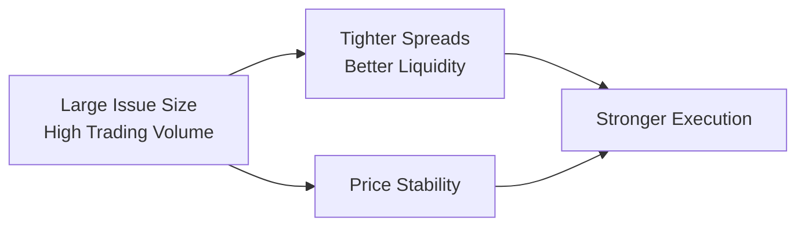

When managing fixed-income portfolios, it’s easy enough to focus mainly on yield and credit quality—until one day, you try to sell a large position in a particular bond issue and realize…no one’s buying! This tricky phenomenon is related to bond market liquidity.

Bond market liquidity, at its core, is about how quickly you can buy or sell a bond without heavily influencing its price. The range of liquidity across different bonds can be surprisingly large: some bonds trade frequently with stable prices and tight bid-ask spreads, while others languish in the portfolio like wallflowers at a dance, rarely attracting a buyer or seller. Understanding liquidity is crucial for effective portfolio management. This section examines the drivers of bond liquidity, the implications for performance and risk, and strategies for mitigating liquidity challenges in various market conditions.

## Key Drivers of Bond Market Liquidity

Well, let’s start with the big question: what makes some bonds more liquid than others? Liquidity in the bond market is primarily driven by:

• Issue size: Larger bond issues generally have more active secondary markets because more investors own those bonds. Suppose a multinational corporation issues $1 billion worth of a bond versus only $50 million—investors feel more confident trading the larger issue since more market participants are out there.

• Credit rating: Investment-grade bonds issued by highly rated entities (like Aaa/AAA) often attract a broad pool of buyers. On the other hand, lower-rated bonds (e.g., high-yield or “junk” bonds) may see reduced liquidity and wider bid-ask spreads, especially when market sentiment sours.

• Sector and market region: Government bonds tend to be the most liquid, followed by high-grade corporate bonds. Bonds in emerging markets or specialized sectors often face thinner trading volumes. During times of global stress, capital flight from riskier markets can dry up liquidity scarily fast.

• Market structure: If there are many active dealers, brokers, and electronic trading platforms for a specific bond sector, that segment usually enjoys better liquidity. Conversely, in less developed or more fragmented markets, you can end up with fewer buyers and sellers—and bigger challenges exiting positions.

Below is a simple visual representation of how certain factors connect to bond market liquidity:

## How Liquidity Affects Transaction Costs and Price Stability

If you’ve been reading the official definitions, you’ll see that liquidity is closely tied to bid-ask spreads. A bond with abundant liquidity typically has a narrower spread between the highest price someone is willing to buy it for (the bid) and the lowest price someone is willing to sell it for (the ask). Narrow spreads lower frictional costs. Meanwhile, illiquid bonds can see shockingly wide spreads—so you end up losing money just by transacting. This difference can be critical to bond portfolio performance, especially for strategies that rely on active trading or frequent rebalancing.

Liquidity also impacts price stability. When a bond is thinly traded, a single large trade may push the price around—imagine trying to sell a big chunk of a rare painting in a sleepy art market versus a widely recognized masterpiece in a bustling auction. Similarly, a large corporate or institutional investor attempting to rebalance a portfolio might inadvertently move prices more in illiquid segments. That risk is especially relevant if a stress event hits and everyone rushes for the exit at the same time.

## Role of Market Makers, Primary Dealers, and Electronic Platforms

In many fixed-income markets, “market makers” and “primary dealers” are the unsung heroes (or sometimes villains) when it comes to ensuring there’s a buyer or seller for your bonds. Market makers stand ready to quote both buy and sell prices, profiting from the difference (the bid-ask spread). Primary dealers, for instance, often have obligations to support liquidity in government bond markets—they trade directly with the central bank and help distribute newly issued government debt.

Electronic trading platforms—like MarketAxess or Tradeweb—have further transformed how bonds are traded, providing centralized marketplaces that match multiple buyers and sellers. That being said, it’s not always a frictionless utopia. While electronic trading can reduce transaction costs for higher-volume, standard-issue bonds, the liquidity benefits may not extend in the same way to smaller or more esoteric bond issues. In times of market stress, electronic quotes can dry up quickly, forcing trades to occur at significantly deeper discounts.

## Impact on Performance and Portfolio Rebalancing

Let’s say your portfolio invests in investment-grade corporate bonds and high-yield bonds. During a normal market environment, you might be able to rebalance fairly efficiently, taking advantage of tight spreads, especially in your higher-grade bonds. But if the market suddenly becomes jittery—say, there’s a spike in credit risk fears—liquidity may evaporate, especially in high-yield issues. You might face:

• Delayed executions: Possibly you can’t find a buyer at the price you want.  
• Higher costs: The market maker willing to buy your bonds might offer a lower-than-expected price if they sense you’re desperate to sell.  
• Missed opportunities: When you can’t exit or enter positions fast enough, you lose potential alpha, or you fail to avoid further price declines.  

In short, liquidity constraints can hamper your performance—particularly when your investment horizon requires flexible portfolio adjustments.

## Bond Liquidity Under Market Stress

During major market dislocations, like the COVID-19 meltdown in March 2020, liquidity across multiple segments of the bond market simply vanished. Even the usually liquid U.S. Treasury market faced unusual strains, as there were moments when large sellers overwhelmed the market’s capacity for immediate absorption. I remember a friend in the industry—she was trying to do a routine sell of an off-the-run Treasury bond and was shocked to see a much wider spread than usual. In “normal” times, that bond would have been easy to trade with minimal cost, but the wave of selling pressure changed everything. This phenomenon highlights why bond market participants must plan for stress scenarios well in advance.

Fire-sale risk—in which investors are forced to liquidate holdings quickly—can be especially brutal. Distressed selling in an illiquid environment can push bond prices much lower than their “fair” values, further exacerbating losses. Meanwhile, well-capitalized investors (the ones holding cash buffers or lines of credit) can scoop up bargains at the expense of less-liquid market participants.

## Strategies to Mitigate Liquidity Risk

1. Diversify the portfolio across different bond types and sectors. Concentrating too heavily in illiquid issues can lead to large transaction costs and major headaches when trying to adapt your portfolio.  
2. Target larger, more frequently traded issues. For example, opting for so-called “benchmark” bonds within the corporate or sovereign space can enhance liquidity.  
3. Rely on derivatives. Credit default swaps (CDS) or interest rate futures can sometimes provide a more liquid tool for altering the portfolio’s exposure to credit or duration risk, especially when bond markets become thin.  
4. Use cash buffers. Maintaining an appropriate level of cash-like assets can cover short-term liquidity needs, preventing forced selling.  
5. Determine position limits in less-liquid issues. Setting internal guidelines can help ensure the portfolio remains nimble.  
6. Engage with effective trading platforms and brokers. Cultivating relationships with primary dealers and other liquidity providers can give you an edge in sourcing tighter quotes or placing large trades.  

## How Poor Liquidity Amplifies Price Moves

Price swings often intensify in illiquid markets due to fewer buyers and sellers. When sentiment changes or new information surfaces—say a corporate downgrade or negative economic data—traders holding these illiquid bonds may have nowhere to go fast. If they must sell, the clearing price might plummet, turning a moderate credit event into a bigger loss. That volatility is precisely why investors require a “liquidity premium” on illiquid bonds; you need compensation for the possible difficulty and delay in exiting your position.

## Importance of Monitoring Liquidity for Large Portfolios

When managing multi-billion-dollar portfolios, even a small difference in bid-ask spread can have a big impact on performance. Institutional managers must maintain a holistic view of liquidity across all positions. This might include:

• Daily or weekly liquidity scoring: Evaluate each bond’s average trading volume, bid-ask spreads, and dealer quotes.  
• Scenario analysis: Model the potential cost of liquidating a portion of the portfolio during a market stress event.  
• Turnover ratio tracking: Monitor how frequently positions are traded and compare actual turnover with planned rebalancing frequencies.

Being proactive allows large bondholders to adjust strategies before trouble hits, rather than scrambling when everyone else is heading for the exits.

## Practical Example: Navigating a Thinly Traded Corporate Bond

Imagine you manage a fixed-income portfolio that holds $5 million of a mid-tier energy company’s bonds. The bonds are rated BBB- and are part of a modest $100 million issuance—relatively small. Under stable conditions, you might see a bid-ask spread of around 20 basis points, which seems tolerable. Suddenly, there’s a correction in the oil market, and the issuer’s fundamentals look shakier. Fewer dealers quote that bond. You want to minimize further credit exposure, so you decide to sell.

But now, the best quotes are 80 basis points lower than the last traded price. You notice the spread is massive, and the volume at those quotes is small—meaning you may not be able to sell your entire position at that price. If you decide to offload the entire stake in one shot, you might drive the price lower. Alternatively, you can break up your transactions into smaller trades over a few days or weeks, but then you risk further market deterioration. This scenario shows how illiquidity can turn an ordinary risk-management decision—exiting a position—into a complicated puzzle.

## Glossary of Key Terms

• Liquidity: The ease with which an asset can be purchased or sold without significantly affecting its price.  
• Bid-Ask Spread: The difference between the price a buyer is willing to pay (bid) and the price a seller is asking (ask).  
• Market Maker: A firm or individual obligated or willing to provide continuous two-sided quotes (bid and ask).  
• Fire-Sale Risk: The risk that an investor must rapidly liquidate securities at a substantial discount during challenging market conditions.  
• Electronic Trading Platforms: Online systems that match buyers and sellers of securities, often improving transparency and execution speeds.  
• Primary Dealer: A bank or securities broker-dealer that may trade directly with a central bank and is often required to participate in government debt auctions.  
• Liquidity Premium: An extra yield that investors demand for holding bonds that are not easily traded.  
• Turnover Ratio: The frequency with which the bonds in a portfolio are bought and sold over a given period, often expressed as a percentage.

## Common Pitfalls

• Chasing higher yields without regard to liquidity: A yield premium can be enticing, but illiquidity can quickly wipe out any advantage if you can’t sell the bond when you need to.  
• Ignoring stress events: Markets aren’t always stable. Building stress-test scenarios is absolutely vital to see how your portfolio holds up when liquidity vanishes.  
• Overreliance on stale pricing data: Sometimes you see a “price” for a bond, but that price may not reflect current market conditions if the bond seldom trades.  
• Inadequate position limits: If one bond position becomes too large relative to market depth, you may face steeper transaction costs or face forced selling at unfavorable prices.

## Final Exam Tips

• Be ready to analyze real-world liquidity scenarios in essay-type questions: The CFA Level III often presents a context—like a “portfolio manager wanting to rebalance in a stressed market”—and asks how to respond.  
• Know how to integrate liquidity considerations: For item-set questions, you might see data on bid-ask spreads, issue sizes, or market volumes. You’ll likely need to incorporate that data into your portfolio decisions.  
• Demonstrate knowledge of mitigating techniques: Could you use derivatives instead of selling a bond directly? Would adding a cash buffer or adjusting a bond ladder reduce liquidity risk?  
• Practice scenario-based analysis: Show your step-by-step reasoning in responding to liquidity challenges. For instance, you might weigh the pros and cons of partial liquidation, or consider shift to Treasuries or cash to handle short-term liabilities.

Always remember, strong liquidity management can turn a respectable bond portfolio into a resilient one—even in the face of unexpected market disruptions.

## References, Suggested Readings & Resources

• CFA Institute’s “Guide to Bond Market Liquidity” white papers.  
• BIS Quarterly Reviews—insights into global bond market liquidity conditions:  
  → https://www.bis.org.  
• Harris, Larry. “Trading and Exchanges: Market Microstructure for Practitioners.”  
• Keep an eye on your local regulatory updates regarding trading and primary dealer obligations.  

## Test Your Knowledge: Bond Market Liquidity and Portfolio Implications



### Which factor most directly influences the bid-ask spread in bond trading?

- [ ] Maturity date
- [x] Market liquidity
- [ ] Coupon rate
- [ ] Listing exchange

> **Explanation:** The bid-ask spread is highly influenced by market liquidity; the easier it is to buy or sell a bond, the narrower that spread will tend to be.

### What is the primary role of a market maker in the bond market?

- [x] Providing continuous buy and sell quotes
- [ ] Inspecting credit ratings of issuers
- [ ] Coordinating all primary issuances of bonds
- [ ] Setting official interest rates

> **Explanation:** Market makers quote both bid and ask prices, facilitating trades and enhancing market liquidity.

### When liquidity suddenly dries up for a specific bond, an investor often faces:

- [ ] Enhanced return via a higher coupon
- [x] Higher transaction costs and wider spreads
- [ ] Immediate rebalancing at minimal cost
- [ ] Guaranteed capital appreciation

> **Explanation:** In illiquid conditions, fewer traders are willing to transact, resulting in wider spreads and higher trading costs.

### Which of the following best describes a “fire-sale risk”?

- [ ] A scenario where bonds are sold at a price above par
- [ ] A requirement to increase the coupon rate for distressed bonds
- [x] Having to sell assets quickly at significantly discounted prices
- [ ] A forced buy-back of bonds by the issuer

> **Explanation:** Fire-sale risk refers to selling under stress conditions, often at much lower prices than the bond’s intrinsic value.

### Why might an investor prefer to use derivatives such as credit default swaps instead of selling bonds directly in a stressed market?

- [x] To adjust credit exposure more efficiently with lower liquidity impact
- [ ] To fully eliminate price risk across the portfolio
- [x] To provide a faster hedge if the bond market is illiquid
- [ ] Because swaps are structured to guarantee no price volatility

> **Explanation:** Derivatives can offer a more liquid, flexible means to hedge or modify exposure without directly selling an illiquid bond.  

### What is a key advantage of large-issue (benchmark) bonds in portfolio management?

- [ ] They are automatically insured by the government.
- [ ] Their coupons are universally higher than smaller issues.
- [x] They typically have better liquidity and tighter spreads.
- [ ] They are not subject to any credit rating changes.

> **Explanation:** Benchmark bonds, often high-volume issues, benefit from greater trading activity and narrower bid-ask spreads.

### Which of the following most accurately defines a “primary dealer”?

- [x] A bank or broker-dealer trading directly with a central bank
- [ ] A rating agency that evaluates bond quality
- [x] A brokerage that must underwrite all corporate debt deals
- [ ] An online marketplace for retail bond investors

> **Explanation:** Primary dealers typically have the right (and sometimes the obligation) to trade government securities directly with central banks and help distribute new issues.

### Why is monitoring turnover ratio important for bond portfolio managers?

- [ ] Turnover ratio only matters for equities, not bonds
- [ ] It directly determines coupon payment frequency
- [x] It indicates how often bond positions are traded and helps assess liquidity
- [ ] It measures only realized gains

> **Explanation:** Bond portfolio turnover ratio reveals trading volume and frequency, providing insight into liquidity needs and transaction costs.

### During times of market stress, how does bond liquidity usually change?

- [ ] Liquidity typically improves due to increased trading volumes
- [ ] There is no difference in liquidity before and after stress events
- [x] Liquidity often declines, widening spreads and hampering trades
- [ ] Institutional investors become forced buyers, supporting the market

> **Explanation:** In stressed markets, many participants retreat, causing liquidity to dry up and spreads to increase.

### True or False: An investor who holds illiquid bonds should expect a lower yield as compensation for thin trading volumes.

- [ ] True
- [x] False

> **Explanation:** Investors typically demand a higher yield (liquidity premium) to compensate for the risk associated with illiquid bonds.


