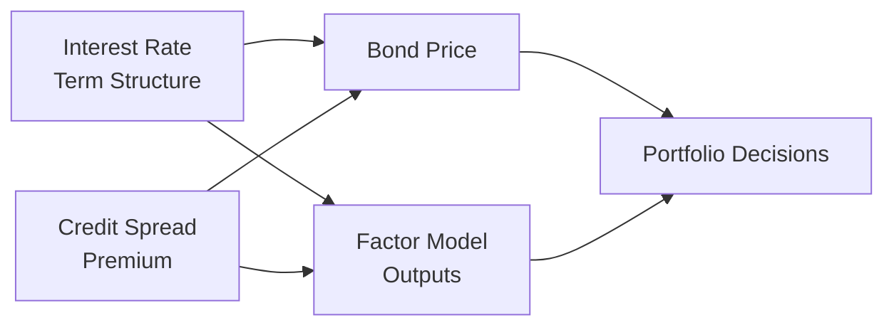

## Introduction

Sometimes, when we talk about fixed-income assets, we imagine a neat little coupon schedule—like a series of predictable payments that basically never change. And, hey, that assumption works great in a world where interest rates don’t jump around or credit quality never morphs. But real life is—well—messy. Interest rates fluctuate. Credit spreads widen or tighten. Liquidity and supply/demand forces shift from day to day. And yeah, it can be headache-inducing to wade through all this. That’s why, in this section, we’ll explore a more robust modeling framework for fixed-income returns, discussing the major factors that drive bond performance and the term structure models that help us understand (and hopefully navigate) how yields move over time.

In earlier sections (particularly 2.2: Fixed-Income Risk and Return Measures), we introduced risk concepts—duration, convexity, correlation, and so on. In this article, we’ll add more meat to the bones by looking at a typical discounted cash flow model, factor-based models, arbitrage-free structures, and common short-rate or forward-rate frameworks like Vasicek, Cox-Ingersoll-Ross, or the Heath-Jarrow-Morton approach. We’ll also see how these models inform portfolio management decisions, from tactical yield-curve positioning to strategic portfolio design. 

## The Standard Fixed-Income Pricing Framework

The starting point for just about any fixed-income model is a Discounted Cash Flow (DCF) framework. At a high level, the price of a bond is the present value of all future coupon payments plus the principal redemption, discounted at an appropriate rate that reflects the risks of those cash flows. Sometimes, we break this discount rate into a risk-free term plus any relevant spreads (credit, liquidity, etc.). Symbolically:

(1)  
P = ∑(CFᵗ / (1 + yᵗ)ᵗ),  

where:  
• CFᵗ is the expected cash flow (coupon or principal) at time t,  
• yᵗ is the yield (or discount rate) appropriate for time t.  

In practice, we might refine yᵗ to include a benchmark risk-free rate plus a credit spread, plus any liquidity premium. This approach, while straightforward, only goes so far in helping us detect how bond prices might respond to shifts in yield curves or credit conditions. For that, we need factor models that decompose the sources of return.

## Factor Models for Bond Returns

Factor models break bond returns into components (factors) that help quantify how changing market conditions influence prices. The well-known Litterman-Scheinkman framework identifies three core factors that often drive bond yields:

• Level: A parallel shift of the entire yield curve (i.e., all maturities moving up or down).  
• Slope: A tilt that makes short-term rates move differently than long-term rates.  
• Curvature: Changes in the “middle” of the curve relative to short and long maturities.

But that’s not everything. We also account for:  
• Credit spread risk: The margin that compensates investors for expected default risk.  
• Liquidity risk: The premium demanded for less-liquid issues.  
• Optionality risk: How embedded options (callable or putable bonds) complicate the risk–return profile.

In a simplified multi-factor representation, the return on a bond in excess of the risk-free rate can be modelled as:

(2)  
rᵢ = α + β₁F₁ + β₂F₂ + … + βₙFₙ + εᵢ,  

where Fⱼ are factor returns (e.g., changes in level, slope, curvature), βⱼ are factor loadings, α is the bond’s alpha (or security-specific outperformance), and εᵢ is the error term that captures idiosyncratic noise.

### CAPM vs. Factor Approaches

You might remember that the classic CAPM states:

(3)  
E(rₐ) = rᶠ + βₐ(E(rₘ) – rᶠ),

where E(rₐ) is the expected return of asset a, rᶠ is the risk-free rate, E(rₘ) is the expected market return, and βₐ is the asset’s sensitivity to the market. While CAPM is a marvelous foundation for equity markets, it’s a bit limited for fixed-income because bond returns can’t always be captured by a single market factor. Indeed, interest rate risk alone is multi-dimensional due to the term structure, and then we have credit, liquidity, and other factors that CAPM’s single-beta framework doesn’t fully capture.

That’s why bond managers—especially for large institutional portfolios—tend to use factor-based or arbitrage-free term structure models. In simpler words: CAPM might get you in the ballpark, but if you really want to manage interest rate risk, you typically need a more specialized approach.

## Arbitrage-Free Models

Arbitrage-free term structure models ensure that it’s impossible to exploit inconsistent pricing anomalies for a riskless profit. These frameworks incorporate the idea that if any bond’s price is “out of line,” investors could construct offsetting portfolios with zero net investment to lock in a certain gain. Because that’s not supposed to persist in an efficient market, arbitrage-free models are designed to keep price relationships consistent.

### Heath-Jarrow-Morton (HJM) Framework

A big name in arbitrage-free modeling is the Heath-Jarrow-Morton (HJM) framework. This approach models the evolution of the entire forward-rate curve rather than just short-term rates, capturing how each forward rate might shift over time in a way that remains internally consistent. Practically speaking, HJM models can get complicated, involving advanced mathematics (e.g., stochastic calculus), but the main takeaway is that they allow you to produce a “scenario set” of possible yield curves, all consistent with no-arbitrage principles.

## Short-Rate Models: Vasicek and CIR

Sometimes, we only want to model the short end of the curve—the instantaneous short rate—and then derive zero-coupon bond prices or forward rates from that. Two popular short-rate models are:

• Vasicek: Assumes interest rates follow a mean-reverting process with a normal distribution of possible changes. Because the rate can, in theory, go negative, critics sometimes highlight this as unrealistic.  

• Cox-Ingersoll-Ross (CIR): Also mean-reverting but uses a square-root process to keep rates strictly positive (or at least non-negative).  

Let’s see the typical form of the short-rate dynamics under Vasicek:

(4)  
dr(t) = a [b – r(t)] dt + σ dW(t),  

where a is the speed of mean reversion, b is the long-term mean, and σ is the volatility parameter. CIR is similar but modifies the diffusion term to be √r(t), ensuring positivity.

Why does any of this matter? Because these short-rate models let you generate theoretical yield curves for different time horizons and measure how bond prices might respond to potential shifts in the short rate. And it’s super handy when simulating stress scenarios—like, “What if short rates spike 2% next quarter?”

## Forward-Rate Models: A Different Angle

In forward-rate models such as HJM or the related LMM (Libor Market Model), instead of focusing on the short rate, we track an evolving family of forward rates. The main difference is that with a short-rate model, everything is built “from the ground up,” starting from the short rate. With forward-rate models, you’re effectively specifying how the entire yield curve changes in a consistent way over time. Many portfolio managers like these models because they can directly see how forward rates respond to market shocks.  

When you compare these two approaches—short-rate models vs. forward-rate curve models—the essence is the same (they’re capturing yield curve dynamics), but the vantage point is different. Short-rate models are like focusing on the changing temperature of a single critical water pipe and inferring how the entire system is responding. Forward-rate models look at the bigger system directly, each pipe in the entire structure, and measure changes in them all simultaneously.

## Practical Implementations for Fixed-Income Managers

Fixed-income managers might use term structure models in various ways:

• Scenario Analysis: Generate possible interest rate paths and estimate the resulting bond prices (see also 2.11: Scenario Analysis and Stress Testing).  
• Risk Budgeting: Decompose portfolio risk using factor loadings (level, slope, curvature, credit, etc.).  
• Hedging Strategies: Identify specific exposures, such as reducing duration in the short end or hedging a specific credit factor.  
• Relative Value Analysis: Compare model-implied bond prices with actual market prices to see if certain bonds look over- or under-valued.  
• Tactical vs. Strategic Allocation: Decide if a short-duration tilt could help in a rising-rate environment or if a barbell vs. bullet approach to maturity selection might yield better risk-adjusted returns.

From personal experience, I remember first using a simple short-rate model for a small bond portfolio I was managing. I thought, “OK, if the short rate reverts to 3% from 1.5% over the next year, what happens?” But real yields often surprise you. Sometimes, the yield curve shape changes in ways you didn’t expect—like flattening sharply or becoming humped in the belly. That’s why something more advanced, like a multi-factor approach or a forward-rate model, can give richer insights—though ironically, you can end up with more complicated “what-if” analysis. So it’s a tradeoff. More complexity can help you see hidden risks, but you’ve got to watch out for overfitting or data mining. 

## Common Pitfalls and Best Practices

• Overreliance on Single-Factor Models: Some folks too heavily rely on a one-dimensional approach (like duration alone) and ignore slope or curvature. That can lead to big time misses if the curve moves in unexpected ways.  
• Ignoring Liquidity: Especially in thinly traded segments, liquidity risk can overshadow other factors. A decent yield advantage might vanish if you can’t exit at a fair price.  
• Data Quality: Term structure modeling can only be as good as your yield curve estimates. If your input yields are from illiquid markets, the curve you model might be misleading.  
• Model Complexity vs. Transparency: These term structure models range from “very basic” to “extremely complex.” You need a balance where you capture the necessary dynamics but can still communicate results to your stakeholders (or your client or your boss!). Overly complex models can become black boxes.  
• Stress Testing: The future is inherently unpredictable. Use stress tests and scenario analyses to see the range of possible outcomes, not just the “most likely” scenario.

## Visualizing Key Concepts

Below is a simple diagram that illustrates how the interest rate term structure, along with credit spread factors, influences bond prices (and eventually your portfolio decisions).  

In practice, the factor model’s outputs (E) combine information from the interest rate term structure (A) and the credit spread environment (B) to help unify everything into a consistent set of insights about bond price behavior (C). Ultimately, these insights drive portfolio decisions (D).

## Application to Tactical and Strategic Asset Allocation

If, for instance, your models are telling you that short rates are likely to revert upward fairly quickly (a scenario that can be gleaned from a short-rate model like CIR or from forward rates that reflect market expectations), you might adopt a shorter duration stance tactically. Or, if a factor model highlights that credit spreads are likely to narrow because of strong economic fundamentals, you could tilt toward corporate bonds. 

On a strategic level—particularly for liability-driven investing, as discussed in Section 2.7—understanding the term structure’s expected path is key in matching asset durations to liability durations. This can reduce interest rate risk and help ensure that the funding ratio remains stable.

## Exam Tips and Final Thoughts

On exam day, you might be asked to interpret a shift in the yield curve and deduce the impact on a portfolio’s value. Or, you might see a question on how to choose between a short-rate model like Vasicek and a forward-rate model like HJM to forecast future yield curve moves. Be prepared to articulate not only the formulas but also the practical pros and cons of each approach. 

Remember, in essay questions (constructed response), it’s common for exam prompts to ask for a recommended strategy under a specific yield curve scenario. Show your steps clearly. If you mention that a flattening yield curve scenario could hamper returns on a barbell strategy, explicitly connect it to how the factor model or short-rate simulation indicates that medium-term rates might rise more than short-term rates.  

Also, watch out for potential ethical considerations, such as making sure your valuation models are consistent with the CFA Institute’s standards on fair dealing and risk disclosures to clients. Overly aggressive or overly simplistic modeling can mislead clients if you’re not transparent about the assumptions and limitations.

## References for Further Reading

• Tuckman, B. and Serrat, A., Fixed Income Securities: Tools for Today’s Markets.  
• Litterman, R. and Scheinkman, J., “Common Factors Affecting Bond Returns,” Journal of Fixed Income.  
• Hull, J., Options, Futures, and Other Derivatives (advanced chapters on stochastic interest rates).  

You’ll find that diving deeper into these references can help you strengthen your command over the math behind these models. If you’re feeling some confusion along the way, that’s normal—these can be complex topics, so explore multiple sources and examples to get the knack of how bond pricing and yield curves interact.  

---

## Test Your Knowledge: Fixed-Income Return Modeling Quiz



### Which of the following best describes the core purpose of a Discounted Cash Flow (DCF) model in fixed-income valuation?

- [x] Translating future bond cash flows into present value terms using an appropriate discount rate.
- [ ] Providing a single market beta estimate for bond portfolios.
- [ ] Ensuring no arbitrage conditions across different maturities.
- [ ] Confirming that bond yields cannot be negative.

> **Explanation:** The point of a DCF model is to discount future cash flows at a rate commensurate with the risk, giving a present value of those cash flows.

### In Litterman-Scheinkman factor analysis, which set of factors is most commonly identified?

- [x] Level, slope, and curvature of the yield curve.
- [ ] Duration, convexity, and DV01.
- [x] Liquidity, default, and inflation risk.
- [ ] GDP growth, inflation, and short-rate volatility.

> **Explanation:** Litterman-Scheinkman emphasizes how bond yield movements can typically be decomposed into level (parallel shifts), slope (tilts), and curvature (changes in the middle).

### Why is CAPM often considered insufficient as a stand-alone model for fixed-income return drivers?

- [x] It uses a single market factor and does not fully account for term structure, credit, or liquidity factors.
- [ ] It requires too much data on alpha and idiosyncratic risks.
- [ ] It automatically ensures arbitrage-free pricing of all durations.
- [ ] It is only suitable for extremely short-term bonds.

> **Explanation:** CAPM’s one-factor approach is limited in capturing multiple distinct drivers of bond returns, particularly interest rate and credit spread complexities.

### Which statement best defines an arbitrage-free model?

- [x] A model that ensures no possible riskless profit from mispriced assets.
- [ ] A model that allows free entry and exit for investors.
- [ ] A model that only prices zero-coupon bonds and no other securities.
- [ ] A model that sets credit spreads at zero for all maturities.

> **Explanation:** Arbitrage-free models prevent the existence of exploitation opportunities for riskless, guaranteed returns due to inconsistent bond pricing.

### Under the Vasicek model, the short rate follows a mean-reverting process. Which feature distinguishes the Cox-Ingersoll-Ross (CIR) model from Vasicek?

- [x] CIR uses a square-root process to keep interest rates from turning negative.
- [ ] CIR prohibits the use of continuous compounding.
- [x] CIR allows interest rates to move independently of time.
- [ ] CIR approximates interest rates as purely deterministic.

> **Explanation:** While both models incorporate mean reversion, CIR modifies the diffusion term (σ√r) so that rates don’t go below zero.

### In a multi-factor bond return model, which of the following statements is most accurate?

- [x] Each factor’s beta indicates how sensitive the bond is to that factor’s movements.
- [ ] The bond return is always zero when all factor loadings are set to zero.
- [ ] All factors must be related to interest rates.
- [ ] A multi-factor model assumes identical volatility across all maturities.

> **Explanation:** Multi-factor models express bond return as the sum of the factor exposures (betas) times each factor’s return (plus any alpha).

### One reason a portfolio manager might adopt a forward-rate-based model (like HJM) rather than a short-rate model is:

- [x] To directly observe potential changes across the entire yield curve, rather than just inferring it from a single short rate.
- [ ] To ensure the portfolio has no exposure to credit spread risk.
- [x] To guarantee a perfect forecast of interest rates in the future.
- [ ] To avoid any stochastic calculus.

> **Explanation:** Forward-rate models allow the manager to model the dynamics of the entire forward curve. This direct observation can be more intuitive for certain hedging and risk management strategies than short-rate models.

### Which of the following is a practical use of term structure models in fixed-income portfolio management?

- [x] Generating potential interest rate paths for scenario analysis and risk assessment.
- [ ] Eliminating all credit risk from the portfolio.
- [ ] Removing the need for fundamental credit analysis.
- [ ] Automating equity portfolio rebalancing.

> **Explanation:** Term structure models are particularly useful in scenario analysis to see how bond values might respond under different yield path assumptions.

### Which of the following is a common pitfall when applying complex term structure models?

- [x] Overfitting the model and losing sight of interpretability.
- [ ] Helping traders identify hidden relative value opportunities.
- [ ] Simplifying the yield curve into a single risk factor.
- [ ] Reducing transaction costs in all market regimes.

> **Explanation:** Models can become so complex they become a “black box,” hard to understand or interpret, which can reduce their practical usefulness.

### True or False: In a mean-reverting short-rate model, if the short rate is well below its long-term mean, the model predicts a higher probability that it will move upward.

- [x] True
- [ ] False

> **Explanation:** Mean reversion implies that rates farther below the mean have a tendency—over time—to drift upwards toward that mean.


